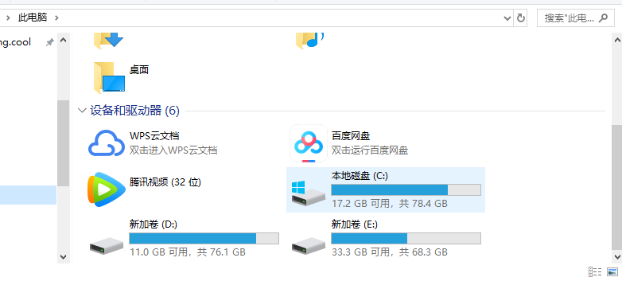
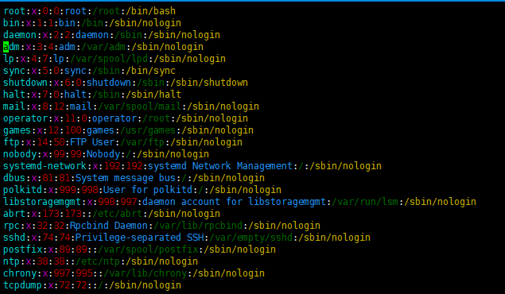
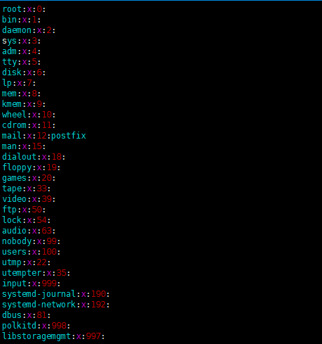
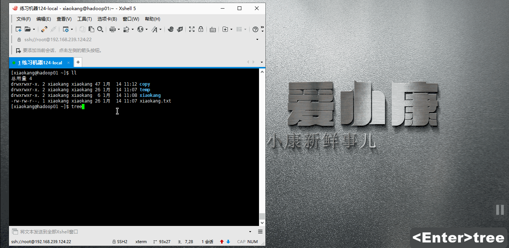
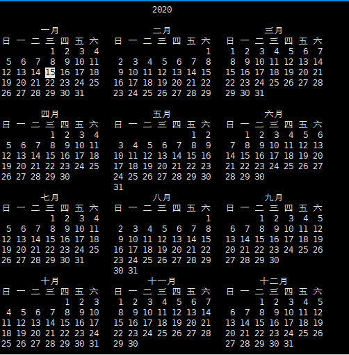
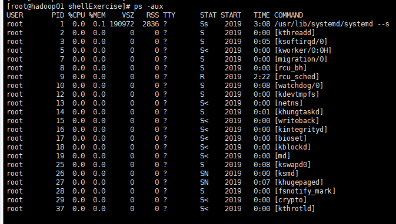
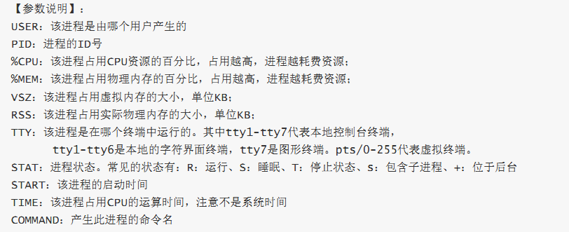

# Linux

# 一、操作系统的发展史

## 01. 操作系统的发展历史

### 1.1 Unix

1965 年之前的时候，电脑并不像现在一样普遍，它可不是一般人能碰的起的，除非是军事或者学院的研究机构，而且当时大型主机至多能提供30台终端（30个键盘、显示器)，连接一台电脑


		
**为了解决数量不够用的问题**

* 1965 年左后由 **贝尔实验室** 加入了 **麻省理工学院** 以及 **通用电气** 合作的计划 —— 该计划要建立一套 **多使用者(multi－user)**、**多任务(multi－processor)**、**多层次(multi－level)** 的 **MULTICS** 操作系统，想让大型主机支持 300 台终端
* 1969 年前后这个项目进度缓慢，资金短缺，贝尔实验室退出了研究
* 1969 年从这个项目中退出的 **Ken Thompson** 当时在实验室无聊时，为了让一台空闲的电脑上能够运行 "星际旅行（Space Travel）" 游戏，在 8 月份左右趁着其妻子探亲的时间，**用了 1 个月的时间**，使用汇编写出了 Unix 操作系统的原型
* 1970 年，美国贝尔实验室的 **Ken Thompson**，以 **BCPL** 语言为基础，设计出很简单且很接近硬件的 **B 语言**（取BCPL的首字母），并且他用 **B 语言** 写了第一个 UNIX 操作系统
* 1971 年，同样酷爱 "星际旅行（Space Travel）" 的 **Dennis M.Ritchie** 为了能早点儿玩上游戏，加入了 **Thompson** 的开发项目，合作开发 UNIX，他的主要工作是改造 **B 语言**，因为**B 语言** 的跨平台性较差
* 1972 年，**Dennis M.Ritchie** 在 **B 语言** 的基础上最终设计出了一种新的语言，他取了 **BCPL** 的第二个字母作为这种语言的名字，这就是 **C 语言**
* 1973 年初，**C 语言**的主体完成，**Thompson** 和 **Ritchie** 迫不及待地开始用它完全重写了现在大名鼎鼎的 **Unix 操作系统**


肯·汤普逊（左）和丹尼斯·里奇（右）

#### C 语言

* 在把 **UNIX** 移植到其他类型的计算机上使用时，**C 语言**强大的移植性（Portability）在此显现
  * 机器语言和汇编语言都不具有移植性，为 x86 开发的程序，不可能在 Alpha，SPARC 和 ARM 等机器上运行
* 而 **C 语言**程序则可以使用在任意架构的处理器上，只要那种架构的处理器**具有对应的 C 语言编译器和库**，然后将 C 源代码编译、连接成目标二进制文件之后即可运行 

#### Unix 家谱


### 1.2 Minix

* 因为 **AT&T（通用电气）** 的政策改变，在 Version 7 Unix 推出之后，发布新的使用条款，将 UNIX 源代码私有化，在大学中不再能使用 UNIX 源代码
* **Andrew S. Tanenbaum（塔能鲍姆）** 教授为了能 **在课堂上教授学生操作系统运作的细节**，决定在不使用任何 AT&T 的源代码前提下，自行开发与 UNIX 兼容的操作系统，以避免版权上的争议
* 以 **小型 UNIX（mini-UNIX）**之意，将它称为 **MINIX**

### 1.3 Linux

* 1991 年 **林纳斯（Linus）** 就读于赫尔辛基大学期间，对 Unix 产生浓厚兴趣，尝试着在Minix 上做一些开发工作
* 因为 **Minix** 只是教学使用，因此功能并不强，**林纳斯** 经常要用他的终端 **仿真器（Terminal Emulator）** 去访问大学主机上的新闻组和邮件，为了方便读写和下载文件，他自己编写了磁盘驱动程序和文件系统，这些在后来成为了 Linux 第一个内核的雏形，当时，他年仅 21 岁！
* **林纳斯** 利用 GNU 的 bash 当做开发环境，gcc 当做编译工具，编写了 Linux 内核，一开始 Linux 并不能兼容 Unix
  * 即 Unix 上跑的应用程序不能在 Linux 上跑，即应用程序与内核之间的接口不一致
  * 一开始 Linux 只适用于 386，后来经过全世界的网友的帮助，最终能够兼容多种硬件


## 02. Linux 内核及发行版

### 2.1 Linux 内核版本

* **内核（kernel）**是系统的心脏，是运行程序和管理像磁盘和打印机等硬件设备的核心程序，它提供了一个在裸设备与应用程序间的抽象层
* Linux 内核版本又分为 **稳定版** 和 **开发版**，两种版本是相互关联，相互循环
  * **稳定版**：具有工业级强度，可以广泛地应用和部署。新的稳定版相对于较旧的只是修正一些 bug 或加入一些新的驱动程序
  * **开发版**：由于要试验各种解决方案，所以变化很快
* 内核源码网址：http://www.kernel.org

> 所有来自全世界的对 Linux 源码的修改最终都会汇总到这个网站，由 Linus 领导的开源社区对其进行甄别和修改最终决定是否进入到 Linux 主线内核源码中


### 2.2 Linux 发行版本

* **Linux 发行版（也被叫做 GNU/Linux 发行版）**通常包含了包括桌面环境、办公套件、媒体播放器、数据库等应用软件
* 常见的发行版本如下：
  * Ubuntu
  * Redhat
  * Fedora
  * openSUSE
  * Linux Mint
  * Debian
  * Manjaro
  * Mageia
  * CentOS
  * Arch

* 十大 Linux 服务器发行版排行榜：http://os.51cto.com/art/201612/526126.htm

> 在几乎每一份与 Linux 有关的榜单上，基于 Debian 的 Ubuntu 都占有一席之位。Canonical 的Ubuntu 胜过其他所有的 Linux 服务器发行版 ―― 从简单安装、出色的硬件发现，到世界级的商业支持，Ubuntu确立了难以企及的严格标准

## 03. Linux 的应用领域

### 3.1 服务器领域

* Linux 在服务器领域的应用是其重要分支
* Linux 免费、稳定、高效等特点在这里得到了很好的体现
  * 早期因为维护、运行等原因同样受到了很大的限制
  * 近些年来 Linux 服务器市场得到了飞速的提升，尤其在一些高端领域尤为广泛

### 3.2 嵌入式领域

* 近些年来 Linux 在嵌入式领域的应用得到了飞速的提高
* Linux 运行稳定、对网络的良好支持性、低成本，且可以根据需要进行软件裁剪，内核最小可以达到几百 KB 等特点，使其近些年来在嵌入式领域的应用得到非常大的提高

> 主要应用：**机顶盒**、**数字电视**、**网络电话**、**程控交换机**、**手机**、**PDA**等都是其应用领域，得到了 Google、三星、摩托罗拉、NEC 等公司的大力推广

### 3.3 个人桌面领域

* 此领域是传统 Linux 应用最薄弱的环节
* 传统 Linux 由于界面简单、操作复杂、应用软件少的缺点，一直被 Windows 所压制
* 近些年来随着 **Ubuntu**、**Fedora** 等优秀桌面环境的兴起，同时各大硬件厂商对其支持的加大，Linux 在个人桌面领域的占有率在逐渐的提高

> 在 Ubuntu 中玩 QQ


# 二、Linux文件和目录

## 01. 单用户操作系统和多用户操作系统

* **单用户操作系统**：指一台计算机在同一时间 **只能由一个用户** 使用，一个用户独自享用系统的全部硬件和软件资源
  * **Windows XP** 之前的版本都是单用户操作系统

* **多用户操作系统**：指一台计算机在同一时间可以由 **多个用户** 使用，多个用户共同享用系统的全部硬件和软件资源
  * **Unix** 和 **Linux** 的设计初衷就是多用户操作系统

## 02. `Windows` 和 `Linux` 文件系统区别

### 2.1 `Windows` 下的文件系统

* 在 `Windows` 下，打开 “计算机”，我们看到的是一个个的驱动器盘符：



* 每个驱动器都有自己的根目录结构，这样形成了多个树并列的情形，如图所示：


### 2.2 `Linux` 下的文件系统

* 在 `Linux` 下，我们是看不到这些驱动器盘符，我们看到的是文件夹（目录）：


* `Ubuntu` 没有盘符这个概念，只有一个根目录 `/`，所有文件都在它下面


### 2.3 用户目录

位于 `/home/user`，称之为用户工作目录或家目录，表示方式：

```bash
/home/user
~
```

### 2.4 `Linux` 主要目录速查表

* /：根目录，**一般根目录下只存放目录**，在 linux 下有且只有一个根目录，所有的东西都是从这里开始
  * 当在终端里输入 `/home`，其实是在告诉电脑，先从 `/`（根目录）开始，再进入到 `home` 目录
* /bin、/usr/bin：可执行二进制文件的目录，如常用的命令 ls、tar、mv、cat 等
* /boot：放置 linux 系统启动时用到的一些文件，如 linux 的内核文件：`/boot/vmlinuz`，系统引导管理器：`/boot/grub`
* /dev：存放linux系统下的设备文件，访问该目录下某个文件，相当于访问某个设备，常用的是挂载光驱`mount /dev/cdrom /mnt`
* /etc：系统配置文件存放的目录，不建议在此目录下存放可执行文件，重要的配置文件有 
  * /etc/inittab
  * /etc/fstab
  * /etc/init.d
  * /etc/X11
  * /etc/sysconfig
  * /etc/xinetd.d
* /home：系统默认的用户家目录，新增用户账号时，用户的家目录都存放在此目录下
  * `~` 表示当前用户的家目录
  * `~edu` 表示用户 `edu` 的家目录
* /lib、/usr/lib、/usr/local/lib：系统使用的函数库的目录，程序在执行过程中，需要调用一些额外的参数时需要函数库的协助
* /lost+fount：系统异常产生错误时，会将一些遗失的片段放置于此目录下
* /mnt: /media：光盘默认挂载点，通常光盘挂载于 /mnt/cdrom 下，也不一定，可以选择任意位置进行挂载
* /opt：给主机额外安装软件所摆放的目录
* /proc：此目录的数据都在内存中，如系统核心，外部设备，网络状态，由于数据都存放于内存中，所以不占用磁盘空间，比较重要的文件有：/proc/cpuinfo、/proc/interrupts、/proc/dma、/proc/ioports、/proc/net/* 等
* /root：系统管理员root的家目录
* /sbin、/usr/sbin、/usr/local/sbin：放置系统管理员使用的可执行命令，如 fdisk、shutdown、mount 等。与 /bin 不同的是，这几个目录是给系统管理员 root 使用的命令，一般用户只能"查看"而不能设置和使用
* /tmp：一般用户或正在执行的程序临时存放文件的目录，任何人都可以访问，重要数据不可放置在此目录下
* /srv：服务启动之后需要访问的数据目录，如 www 服务需要访问的网页数据存放在 /srv/www 内
* /usr：usr是Unix Software Resource的缩写， 也就是Unix操作系统软件资源所放置的目录，而不是用户的数据；所有系统默认的软件都会放置到/usr, 系统安装完时，这个目录会占用最多的硬盘容量 
  * /usr/bin：存放应用程序
  * /usr/share：存放共享数据
  * /usr/lib：存放不能直接运行的，却是许多程序运行所必需的一些函数库文件
  * /usr/local：存放软件升级包
  * /usr/share/doc：系统说明文件存放目录
  * /usr/share/man：程序说明文件存放目录
* /var：放置系统执行过程中经常变化的文件
  * /var/log：随时更改的日志文件 
  * /var/spool/mail：邮件存放的目录
  * /var/run：程序或服务启动后，其 PID 存放在该目录下

### 2.5 两个重要的文件

#### /etc/passwd文件

> 用户的配置文件，记录用户的各种信息

每行含义：用户名、口令（也就是密码）、用户标识号、组标识号、注释性描述、主目录、登录Shell（就是登录之后，使用的终端命令）



#### /etc/group文件

> 组的配置文件，记录Linux包含的组的信息

每行含义：组名、口令（也就是密码）、组标识号、组内用户列表



# 三、文件和目录常用命令

## 01. 查看目录内容

### 1.1 终端实用技巧 

#### 1> 自动补全

* 在敲出 `文件`／`目录`／`命令` 的前几个字母之后，按下 `tab` 键
  * 如果输入的没有歧义，系统会自动补全
  * 如果还存在其他 `文件`／`目录`／`命令`，再按一下 `tab` 键，系统会提示可能存在的命令

#### 2> 曾经使用过的命令

* 按 `上`／`下` 光标键可以在曾经使用过的命令之间来回切换
* 如果想要退出选择，并且不想执行当前选中的命令，可以按 `ctrl + c`

### 1.2 `ls` 命令说明

* `ls` 是英文单词 **list** 的简写，其功能为列出目录的内容，是用户最常用的命令之一，类似于 **DOS** 下的 `dir` 命令

#### Linux 下文件和目录的特点

* Linux **文件** 或者 **目录** 名称最长可以有 `256` 个字符
* 以 `.` 开头的文件为隐藏文件，需要用 -a 参数才能显示
* **.** 代表当前目录
* **..** 代表上一级目录

### 1.3 ls 常用选项

| 参数 | 含义                                         |
| ---- | -------------------------------------------- |
| -a   | 显示指定目录下所有子目录与文件，包括隐藏文件 |
| -l   | 以列表方式显示文件的详细信息                 |
| -h   | 配合 -l 以人性化的方式显示文件大小           |


### 1.4 ls 通配符的使用

| 通配符 | 含义                                 |
| ------ | ------------------------------------ |
| *      | 代表任意个数个字符                   |
| ?      | 代表任意一个字符，至少 1 个          |
| []     | 表示可以匹配字符组中的任一一个       |
| [abc]  | 匹配 a、b、c 中的任意一个            |
| [a-f]  | 匹配从 a 到 f 范围内的的任意一个字符 |


## 02. 切换目录

### 2.1 `cd`

* `cd` 是英文单词 **change directory** 的简写，其功能为更改当前的工作目录，也是用户最常用的命令之一

> 注意：Linux 所有的 **目录** 和 **文件名** 都是大小写敏感的

| 命令  | 含义                                   |
| ----- | -------------------------------------- |
| cd    | 切换到当前用户的主目录(/home/用户目录) |
| cd ~  | 切换到当前用户的主目录(/home/用户目录) |
| cd .  | 保持在当前目录不变                     |
| cd .. | 切换到上级目录                         |
| cd -  | 可以在最近两次工作目录之间来回切换     |


### 2.2 相对路径和绝对路径

* **相对路径** 在输入路径时，最前面不是 **/** 或者 **~**，表示相对 **当前目录** 所在的目录位置
* **绝对路径** 在输入路径时，最前面是 **/** 或者 **~**，表示从 **根目录/家目录** 开始的具体目录位置

## 03. 创建和删除操作

### 3.1 `touch`

* 创建文件或修改文件时间
  * 如果文件 **不存在**，可以创建一个空白文件
  * 如果文件 **已经存在**，可以修改文件的末次修改日期


### 3.2 `mkdir`

* 创建一个新的目录

| 选项 | 含义             |
| ---- | ---------------- |
| -p   | 可以递归创建目录 |

> **新建目录的名称** 不能与当前目录中 **已有的目录或文件** 同名


### 3.3 `rm`

* 删除文件或目录

> 使用 `rm` 命令要小心，因为文件删除后不能恢复

| 选项 | 含义                                                  |
| ---- | ----------------------------------------------------- |
| -f   | 强制删除，忽略不存在的文件，无需提示                  |
| -r   | 递归地删除目录下的内容，**删除文件夹** 时必须加此参数 |
| -i   | 删除前询问                                            |


## 04. 拷贝和移动文件

| 序号 | 命令               | 对应英文 | 作用                                 |
| ---- | ------------------ | -------- | ------------------------------------ |
| 01   | tree [目录名]      | tree     | 以树状图列出文件目录结构             |
| 02   | cp 源文件 目标文件 | copy     | 复制文件或者目录                     |
| 03   | mv 源文件 目标文件 | move     | 移动文件或者目录／文件或者目录重命名 |

### 4.1 `tree`

* `tree` 命令可以以树状图列出文件目录结构

| 选项 | 含义       |
| ---- | ---------- |
| -d   | 只显示目录 |



### 4.2 `cp`

* `cp` 命令的功能是将给出的 **文件** 或 **目录** 复制到另一个 **文件** 或 **目录** 中，相当于 **DOS** 下的 `copy` 命令

| 选项 | 含义                                                         |
| ---- | ------------------------------------------------------------ |
| -i   | 覆盖文件前提示                                               |
| -r   | 若给出的源文件是目录文件，则 cp 将递归复制该目录下的所有子目录和文件，目标文件必须为一个目录名 |


强制复制并覆盖`\cp -rf 源文件 目标文件`

### 4.3 `mv`

* `mv` 命令可以用来 **移动** **文件** 或 **目录**，也可以给 **文件或目录重命名**

| 选项 | 含义           |
| ---- | -------------- |
| -i   | 覆盖文件前提示 |


## 05. 查看文件内容

| 序号 | 命令                 | 对应英文    | 作用                                                 |
| ---- | -------------------- | ----------- | ---------------------------------------------------- |
| 01   | cat 文件名           | concatenate | 查看文件内容、创建文件、文件合并、追加文件内容等功能 |
| 02   | more 文件名          | more        | 分屏显示文件内容                                     |
| 03   | grep 搜索文本 文件名 | grep        | 搜索文本文件内容                                     |

### 5.1 `cat`

* `cat` 命令可以用来 **查看文件内容**、**创建文件**、**文件合并**、**追加文件内容** 等功能
* `cat` 会一次显示所有的内容，适合 **查看内容较少** 的文本文件

| 选项 | 含义               |
| ---- | ------------------ |
| -b   | 对非空输出行编号   |
| -n   | 对输出的所有行编号 |

### 5.2 `more`

* `more` 命令可以用于分屏显示文件内容，每次只显示一页内容
* 适合于 **查看内容较多**的文本文件

使用 `more` 的操作键：

| 操作键   | 功能                 |
| -------- | -------------------- |
| 空格键   | 显示手册页的下一屏   |
| Enter 键 | 一次滚动手册页的一行 |
| b        | 回滚一屏             |
| f        | 前滚一屏             |
| q        | 退出                 |
| /word    | 搜索 **word** 字符串 |

### 5.3 `less`

* `和more类似` 

使用 `less` 的操作键：

| 操作键   | 功能                         |
| -------- | ---------------------------- |
| /word    | 在日志中匹配**word**的下一个 |
| ?word    | 在日志中匹配**word**的上一个 |
| Enter 键 | 一次滚动手册页的一行         |
| b        | 回滚一屏                     |
| f        | 前滚一屏                     |
| q        | 退出                         |
| h        | 帮助                         |

### 5.4 `grep`

* Linux 系统中 `grep` 命令是一种强大的文本搜索工具
* `grep`允许对文本文件进行 **模式**查找，所谓模式查找，又被称为正则表达式

| 选项 | 含义                                     |
| ---- | ---------------------------------------- |
| -n   | 显示匹配行及行号                         |
| -v   | 显示不包含匹配文本的所有行（相当于求反） |
| -i   | 忽略大小写                               |
| -w   | 只匹配整个单词                           |
| -l   | 只列出文件名                             |
| -r   | 在当前和所有子目录中搜索                 |

两种语法

```bash
数据源 | grep 搜索的内容

grep [-nviwlr] 搜索的内容 要查找的路径
```

* 常用的两种模式查找

| 参数 | 含义                         |
| ---- | ---------------------------- |
| ^a   | 行首，搜寻以 **a** 开头的行  |
| ke$  | 行尾，搜寻以 **ke** 结束的行 |

```shell
[xiaokang@hadoop01 xiaokang]$ cat *.log *.txt
hello 微信公众号：小康新鲜事儿
xiaokang.log

hello 微信公众号：小康新鲜事儿
xiaokang1.txt

hello 微信公众号：小康新鲜事儿
xiaokang.txt

微信公众号：小康新鲜事儿
xiaokangxxs.txt
[xiaokang@hadoop01 xiaokang]$ grep -irl HELLO .
./xiaokang.txt
./xiaokang1.txt
./xiaokang.log
[xiaokang@hadoop01 xiaokang]$ grep -irl --include=*.log  HELLO .
./xiaokang.log
[xiaokang@hadoop01 xiaokang]$ grep -irl --include=*.txt  HELLO .
./xiaokang.txt
./xiaokang1.txt
[xiaokang@hadoop01 xiaokang]$ grep -i HELLO .
grep: .: 是一个目录
[xiaokang@hadoop01 xiaokang]$ grep -ir HELLO .
./xiaokang.txt:hello 微信公众号：小康新鲜事儿
./xiaokang1.txt:hello 微信公众号：小康新鲜事儿
./xiaokang.log:hello 微信公众号：小康新鲜事儿
[xiaokang@hadoop01 xiaokang]$ grep -irl HELLO .
./xiaokang.txt
./xiaokang1.txt
./xiaokang.log
```

### 5.5 `tail`

* tail 命令可用于查看文件的内容，有一个常用的参数 -f 常用于查阅正在改变的日志文件。 

| 序号 | 命令                 | 作用                                                         |
| ---- | -------------------- | ------------------------------------------------------------ |
| 01   | tail 文件名          | 查看文件的最后 10 行                                         |
| 02   | tail -f 文件名       | 会把文件里的最尾部的内容显示在屏幕上，并且不断刷新，只要文件更新就可以看到最新的文件内容 |
| 03   | tail -n<行数> 文件名 | 显示文件的尾部 n 行内容                                      |

### 5.6  `head`

* head 用来显示档案的开头至标准输出中，默认head命令打印其相应文件的开头10行。 

| 序号 | 命令                 | 作用                  |
| ---- | -------------------- | --------------------- |
| 01   | head 文件名          | 查看文件的开头 10 行  |
| 03   | head -n<行数> 文件名 | 显示文件的前 n 行内容 |

### 5.7`file`

- file用来查看类型

```bash
[root@xk1181259634 ~]# file code/
code/: directory
[root@xk1181259634 ~]# file test.tar.gz 
test.tar.gz: gzip compressed data, from Unix, last modified: Wed Jan 15 14:56:50 2020
[root@xk1181259634 ~]# file makeFile.sh 
makeFile.sh: Bourne-Again shell script, ASCII text executable
[root@xk1181259634 ~]# file -z test.tar.gz 
test.tar.gz: POSIX tar archive (GNU) (gzip compressed data, from Unix, last modified: Wed Jan 15 14:56:50 2020)
[root@xk1181259634 ~]# file /dev/null
/dev/null: character special
```

## 06. 统计文件字数`wc`

- Linux wc命令用于计算字数。

- 利用wc指令我们可以计算文件的Byte数、字数、或是行数

| 序号 | 命令                       | 作用                                             |
| ---- | -------------------------- | ------------------------------------------------ |
| 01   | wc 文件名                  | 查看文件统计信息（包含行数、单词数、字节数）     |
| 02   | wc -l 文件名               | 只显示文件行数                                   |
| 03   | wc -w 文件名               | 只显示文件字数                                   |
| 04   | wc -c 文件名               | 只显示文件字节数                                 |
| 05   | wc -L 文件名               | 打印最长行的长度                                 |
| 06   | wc 文件名1 文件名2 文件名3 | 查看多个文件统计信息（包含行数、单词数、字节数） |

```bash
$ wc anaconda-ks.cfg #anaconda-ks.cfg文件的统计信息  
50  124 1285 anaconda-ks.cfg #anaconda-ks.cfg文件的行数为50、单词数124、字节数1285

$ wc -l anaconda-ks.cfg 
50 anaconda-ks.cfg
$ wc -w anaconda-ks.cfg 
124 anaconda-ks.cfg
$ wc -c anaconda-ks.cfg 
1285 anaconda-ks.cfg

$ wc anaconda-ks.cfg position.sh go
50  124 1285 anaconda-ks.cfg
5   11   58 position.sh
1    2   19 go
56  137 1362 总用量
```

## 07.vi

### 01.`vi` 简介

#### 1.1 学习 `vi` 的目的

* 在工作中，要对 **服务器** 上的文件进行 **简单** 的修改，可以使用 `ssh` 远程登录到服务器上，并且使用 `vi` 进行快速的编辑即可

* 常见需要修改的文件包括：

  * **源程序**

  * **配置文件**，例如 `ssh` 的配置文件 `~/.ssh/config`

    ```bash
    Host xiaokang
        HostName www.xiaokang.cool
        User root
        Port 22
    	IdentitiesOnly yes
    #1、Host 后边的是名称，以后可以根据这个名称进行访问；
    #2、HostName是你的主机IP地址；
    #3、User为主机登录的用户名；
    #4、IdentitiesOnly yes固有配置；
    ```

> * 在没有图形界面的环境下，要编辑文件，`vi` 是最佳选择！
> * 每一个要使用 Linux 的程序员，都应该或多或少的学习一些 `vi` 的常用命令

#### 1.2 vi 和 vim

* 在很多 `Linux` 发行版中，直接把 `vi` 做成 `vim` 的软连接

##### vi

* `vi` 是 `Visual interface` 的简称，是 `Linux` 中 **最经典** 的文本编辑器
* `vi` 的核心设计思想 —— **让程序员的手指始终保持在键盘的核心区域，就能完成所有的编辑操作**

* `vi` 的特点：
  * **没有图形界面** 的 **功能强大** 的编辑器
  * 只能是编辑 **文本内容**，不能对字体、段落进行排版
  * **不支持鼠标操作**
  * **没有菜单**
  * **只有命令**
* `vi` 编辑器在 **系统管理**、**服务器管理** 编辑文件时，**其功能永远不是图形界面的编辑器能比拟的**

##### vim

**vim = vi improved**

- `vim` 是从 `vi` 发展出来的一个文本编辑器，支持 **代码补全**、**编译** 及 **错误跳转** 等方便编程的功能特别丰富，在程序员中被广泛使用，被称为 **编辑器之神**

### 02. 打开和新建文件

* 在终端中输入 `vi` **在后面跟上文件名** 即可

```bash
$ vi 文件名
```

* 如果文件已经存在，会直接打开该文件
* 如果文件不存在，会新建一个文件

#### 2.1 打开文件并且定位行

* 在日常工作中，有可能会遇到 **打开一个文件，并定位到指定行** 的情况
* 例如：在开发时，**知道某一行代码有错误**，可以 **快速定位** 到出错代码的位置

* 这个时候，可以使用以下命令打开文件

```bash
$ vi 文件名 +行数
```

> 提示：如果只带上 `+` 而不指定行号，会直接定位到文件末尾

#### 2.2 异常处理

* 如果 `vi` 异常退出，在磁盘上可能会保存有 **交换文件**
* 下次再使用 `vi` 编辑该文件时，会看到以下屏幕信息，按下字母 `d` 可以 **删除交换文件** 即可

> 提示：按下键盘时，注意关闭输入法


### 03.三种工作模式

* `vi` 有三种基本工作模式：
  1. **命令模式**
     * **打开文件首先进入命令模式**，是使用 `vi` 的 **入口**
     * 通过 **命令** 对文件进行常规的编辑操作，例如：**定位**、**翻页**、**复制**、**粘贴**、**删除**……
     * 在其他图形编辑器下，通过 **快捷键** 或者 **鼠标** 实现的操作，都在 **命令模式** 下实现
  2. **末行模式** —— 执行 **保存**、**退出** 等操作 
     * 要退出 `vi` 返回到控制台，需要在末行模式下输入命令
     * **末行模式** 是 `vi` 的 **出口**
  3. **编辑模式** —— 正常的编辑文字


### 末行模式命令

|   命令   |     英文     | 功能                           |
| :------: | :----------: | ------------------------------ |
|  set nu  |  set number  | 显示行号                       |
| set nonu | set nonumber | 不显示行号                     |
|    w     |    write     | 保存                           |
|    q     |     quit     | 退出，如果没有保存，不允许退出 |
|    q!    |     quit     | 强行退出，不保存退出           |
|    wq    | write & quit | 保存并退出                     |
|    x     |              | 保存并退出                     |

### 行内移动

| 命令 | 英文 | 功能                           |
| :--: | :--: | ------------------------------ |
|  w   | word | 向后移动一个单词               |
|  b   | back | 向前移动一个单词               |
|  0   |      | 行首                           |
|  ^   |      | 行首，第一个不是空白字符的位置 |
|  $   |      | 行尾                           |

### 行数移动

|  命令  | 英文 | 功能                 |
| :----: | :--: | -------------------- |
|   gg   |  go  | 文件顶部             |
|   G    |  go  | 文件末尾             |
| 数字gg |  go  | 移动到 数字 对应行数 |
| 数字G  |  go  | 移动到 数字 对应行数 |
| :数字  |      | 移动到 数字 对应行数 |

### 撤销

| 命令 | 英文 | 功能         |
| :--: | :--: | ------------ |
|  u   | undo | 撤销上次命令 |

###  删除文本

|    命令     |  英文  | 功能                              |
| :---------: | :----: | --------------------------------- |
|      x      |  cut   | 删除光标所在字符，或者选中文字    |
| d(移动命令) | delete | 删除移动命令对应的内容            |
|     dd      | delete | 删除光标所在行，可以 ndd 删除多行 |
|      D      | delete | 删除光标所在字符至行尾            |

> 提示：如果使用 **可视模式** 已经选中了一段文本，那么无论使用 `d` 还是 `x`，都可以删除选中文本

### 复制、粘贴

* `vi` 中提供有一个 **被复制文本的缓冲区**
  * **复制** 命令会将选中的文字保存在缓冲区 
  * **删除** 命令删除的文字会被保存在缓冲区
  * 在需要的位置，使用 **粘贴** 命令可以将缓冲区的文字插入到光标所在位置

|    命令     | 英文  | 功能                             |
| :---------: | :---: | -------------------------------- |
| y(移动命令) | copy  | 复制                             |
|     yy      | copy  | 复制一行，可以 nyy 复制多行      |
|      p      | paste | 粘贴到当前行的下一行，np粘贴多次 |
|      P      | paste | 粘贴到当前行的上一行，np粘贴多次 |

### 常规查找

| 命令 | 功能     |
| :--: | -------- |
| /str | 查找 str |

* 查找到指定内容之后，使用 `Next` 查找下一个出现的位置：
  * `n`: 查找下一个
  * `N`: 查找上一个

### 查找并替换

* 在 `vi` 中查找和替换命令需要在 **末行模式** 下执行
* 记忆命令格式：

```bash
:%s///g
```

#### 1) 全局替换

* **一次性**替换文件中的 **所有出现的旧文本**
* 命令格式如下：

```
:%s/旧文本/新文本/g
```

#### 2) 可视区域替换

* **先选中** 要替换文字的 **范围**
* 命令格式如下：

```
:s/旧文本/新文本/g
```

#### 3) 确认替换

* 如果把末尾的 `g` 改成 `gc` 在替换的时候，会有提示！**推荐使用！**

```
:%s/旧文本/新文本/gc
```

1. `y` - `yes` 替换
2. `n` - `no` 不替换
3. `a` - `all` 替换所有
4. `q` - `quit` 退出替换
5. `l` - `last` 最后一个，并把光标移动到行首
6. `^E` 向下滚屏
7. `^Y` 向上滚屏

## 08. 其他

### 8.1 `echo 文字内容`

* `echo` 会在终端中显示参数指定的文字，通常会和 **重定向** 联合使用

### 8.2 重定向 `>` 和 `>>`

* Linux 允许将命令执行结果 **重定向**到一个 **文件**
* 将本应显示在**终端上的内容** **输出／追加** 到**指定文件中**

其中

* `>` 表示输出，会覆盖文件原有的内容
* `>>` 表示追加，会将内容追加到已有文件的末尾

| stdin      | :zero: |
| ---------- | ------ |
| **stdout** | :one:  |
| **stderr** | :two:  |

### 8.3 管道 `|`

* Linux 允许将 **一个命令的输出** 可以**通过管道** 做为 **另一个命令的输入**
* 可以理解现实生活中的管子，管子的一头塞东西进去，另一头取出来，这里 `|` 的左右分为两端，左端塞东西（写），右端取东西（读）

常用的管道命令有：

* `more`：分屏显示内容
* `grep`：在命令执行结果的基础上查询指定的文本

# 四、用户管理

## 01. **用户** 和 **权限** 的基本概念

### 1.1 基本概念

* **用户** 是 Linux 系统工作中重要的一环，用户管理包括 **用户** 与 **组** 管理
* 在 Linux 系统中，不论是由本机或是远程登录系统，每个系统都**必须拥有一个账号**，并且**对于不同的系统资源拥有不同的使用权限**
* 在 Linux 中，可以指定 **每一个用户** 针对 **不同的文件或者目录** 的 **不同权限**
* 对 **文件／目录** 的权限包括：

| 序号 | 权限 |  英文  | 缩写 | 数字代号 |
| :--: | :--: | :----: | :--: | :------: |
|  01  |  读  |  read  |  r   |    4     |
|  02  |  写  | write  |  w   |    2     |
|  03  | 执行 | excute |  x   |    1     |

### 1.2 组

* 为了方便用户管理，提出了 **组** 的概念，如下图所示


* 在实际应用中，可以预先针对 **组** 设置好权限，然后 **将不同的用户添加到对应的组中**，从而**不用依次为每一个用户设置权限**

### 1.3 ls -l 扩展

* `ls -l` 可以查看文件夹下文件的详细信息，从左到右依次是：

  * **权限**，第 1 个字符如果是 `d` 表示目录

    -：常规文件
    d：目录
    b：块特殊设备
    c：字符特殊设备
    p：有名管道
    s：信号灯
    l：符号链接

  * **硬链接数**，通俗地讲，就是有多少种方式，可以访问到当前目录／文件

  * **拥有者**，家目录下 文件／目录 的拥有者通常都是当前用户

  * **组**，在 Linux 中，很多时候，会出现组名和用户名相同的情况，后续会讲

  * **大小**

  * **时间**

  * **名称**


### 1.4 超级用户

* Linux 系统中的 `root` 账号通常 **用于系统的维护和管理**，对操作系统的所有资源 **具有所有访问权限**
* 在大多数版本的 Linux 中，都不推荐 **直接使用 root 账号登录系统**
* 在 Linux 安装的过程中，系统会自动创建一个用户账号，而这个默认的用户就称为“标准用户”

#### sudo

* `su` 是 `substitute user` 的缩写，表示 **使用另一个用户的身份**
* `sudo` 命令用来以其他身份来执行命令，预设的身份为 `root`
* 用户使用 `sudo` 时，必须先输入密码（加入NOPASSWD后可以不用输入），之后有 **5 分钟的有效期限**，超过期限则必须重新输入密码

> 若其未经授权的用户企图使用 `sudo`，则会发出警告邮件给管理员

```bash
#让普通用户拥有超级管理员权限
1.以root身份修改/etc/sudoers的权限
chmod u+w /etc/sudoers

2.在root所在行的下一行插入
root    ALL=(ALL)       ALL
普通用户名称 ALL=(ALL) NOPASSWD:ALL

3.当普通用户想要以root身份执行某个操作时，前面加上sudo即可
sudo mkdir xiaokang

4.以root身份将/etc/sudoers的权限修改回原样
chmod u-w /etc/sudoers
```

## 02. **组管理** 终端命令

> 提示：**创建组** / **删除组** 的终端命令都需要通过 `sudo` 执行

| 序号 | 命令                      | 作用                      |
| ---- | ------------------------- | ------------------------- |
| 01   | groupadd 组名             | 添加组                    |
| 02   | groupdel 组名             | 删除组                    |
| 03   | cat /etc/group            | 查看组信息                |
| 04   | chgrp -R 组名 文件/目录名 | 递归修改文件/目录的所属组 |

> 提示：
>
> * 组信息保存在 `/etc/group` 文件中
> * `/etc` 目录是专门用来保存 **系统配置信息** 的目录


* 在实际应用中，可以预先针对 **组** 设置好权限，然后 **将不同的用户添加到对应的组中**，从而**不用依次为每一个用户设置权限**

## 03. **用户管理** 终端命令

### 3.1 创建用户／设置密码／删除用户

| 序号 | 命令                           | 作用                 | 说明                                                         |
| ---- | ------------------------------ | -------------------- | ------------------------------------------------------------ |
| 01   | useradd -m -g 组 新建用户名    | 添加新用户           | <ul><li>-m 自动建立用户家目录</li><li>-g 指定用户所在的组，否则会建立一个和同名的组</li></ul> |
| 02   | passwd 用户名                  | 设置用户密码         | 如果是普通用户，直接用 passwd 可以修改自己的账户密码         |
| 03   | userdel -rf 用户名             | 强制删除用户         | -rf 选项会强制删除用户和用户家目录                           |
| 04   | cat /etc/passwd \| grep 用户名 | 确认用户信息         | 新建用户后，用户信息会保存在 /etc/passwd 文件中              |
|      | useradd -u 用户id 用户名       | 添加指定id号的新用户 | 0-499为系统保留，id默认会从500开始，后续创建会依次递增，使用-u后可以自行指定id |

> 提示：
>
> * 创建用户时，默认会创建一个和**用户名**同名的**组名**，在/home目录下创建一个和用户名同名的文件夹
> * 用户信息保存在 `/etc/passwd` 文件中

### 3.2 查看用户信息

| 序号 | 命令        | 作用                       |
| ---- | ----------- | -------------------------- |
| 01   | id [用户名] | 查看用户 UID 和 GID 信息   |
| 02   | who         | 查看当前所有登录的用户列表 |
| 03   | whoami      | 查看当前登录用户的账户名   |
| 04   | groups      | 查看当前用户所在的组       |

#### usermod

* `usermod` 可以用来设置 **用户** 的 **主组** ／ **附加组** 和 **登录 Shell**，命令格式如下：
* **主组**：通常在新建用户时指定，在 `etc/passwd` 的第 4 列 **GID 对应的组**
* **附加组**：在 `etc/group` 中最后一列表示该组的用户列表，用于指定 **用户的附加权限**

> 提示：设置了用户的附加组之后，需要重新登录才能生效！

```bash
# 修改登录名
usermod -l 新登录名 旧登录名

# 修改用户的主组（passwd 中的 GID）
usermod -g 组 用户名

# 修改用户的附加组
usermod -G 组 用户名

# 修改用户登录 Shell
usermod -s /bin/bash 用户名
```

> 注意：默认使用 `useradd` 添加的用户是没有权限使用 `sudo` 以 `root` 身份执行命令的，可以使用以下命令，将用户添加到 `sudo` 附加组中

```bash
usermod -G sudo 用户名
```

#### which

> 提示
>
> * `/etc/passwd` 是用于保存用户信息的文件
> * `/usr/bin/passwd` 是用于修改用户密码的程序

* `which` 命令可以查看执行命令所在位置，例如：

```bash
which ls

# 输出
# /bin/ls

which useradd

# 输出
# /usr/sbin/useradd
```

##### `bin` 和 `sbin`

* 在 `Linux` 中，绝大多数可执行文件都是保存在 `/bin`、`/sbin`、`/usr/bin`、`/usr/sbin`
* `/bin`（`binary`）是二进制执行文件目录，主要用于具体应用
* `/sbin`（`system binary`）是系统管理员专用的二进制代码存放目录，主要用于系统管理
* `/usr/bin`（`user commands for applications`）后期安装的一些软件
* `/usr/sbin`（`super user commands for applications`）超级用户的一些管理程序

> 提示：
>
> * `cd` 这个终端命令是内置在系统内核中的，没有独立的文件，因此用 `which` 无法找到 `cd` 命令的位置

### 3.3 切换用户

| 序号 | 命令        | 作用                   | 说明                                     |
| ---- | ----------- | ---------------------- | ---------------------------------------- |
| 01   | su - 用户名 | 切换用户，并且切换目录 | - 可以切换到用户家目录，否则保持位置不变 |
| 02   | exit        | 退出当前登录账户       |                                          |

* `su` 不接用户名，可以切换到 `root`，但是不推荐使用，因为不安全
* `exit` 示意图如下：


## 04. 修改文件权限

| 序号 | 命令  | 作用       |
| ---- | ----- | ---------- |
| 01   | chown | 修改拥有者 |
| 02   | chgrp | 修改组     |
| 03   | chmod | 修改权限   |

* 命令格式如下：

```bash
# 修改文件|目录的拥有者
chown 用户名 文件名|目录名

# 递归修改文件|目录的组
chgrp -R 组名 文件名|目录名

# 递归修改文件权限
chmod -R 755 文件名|目录名
```

* `chmod` 在设置权限时，可以简单地使用三个数字分别对应 **拥有者** ／ **组** 和 **其他** 用户的权限

```bash
# 直接修改文件|目录的 读|写|执行 权限，但是不能精确到 拥有者|组|其他
chmod +/-rwx 文件名|目录名
```


* 常见数字组合有（`u`表示用户／`g`表示组／`o`表示其他）：
  * `777` ===> `u=rwx,g=rwx,o=rwx` 
  * `755` ===> `u=rwx,g=rx,o=rx`
  * `644` ===> `u=rw,g=r,o=r

# 五、系统信息相关

## 01. 时间和日期

| 序号 | 命令 | 作用                                             |
| ---- | ---- | ------------------------------------------------ |
| 01   | date | 查看系统时间                                     |
| 02   | cal  | `calendar` 查看日历，`-y` 选项可以查看一年的日历 |

```bash
date --help

[root@xk1181259634]# date +%Y-%m-%d
2020-01-15
[root@xk1181259634]# date +%H:%M:%S
11:35:33
[root@xk1181259634]# date +%H:%M:%S
11:35:33
[root@xk1181259634]# date +%I:%M:%S
11:36:38
[root@xk1181259634]# date +%c
2020年01月15日 星期三 11时37分14秒

[root@xk1181259634]# cal -y 2020
2020年01月15日 星期三 11时37分14秒
```



## 02. 磁盘信息

| 序号 | 命令           | 作用                              |
| ---- | -------------- | --------------------------------- |
| 01   | df -h          | `disk free` 显示磁盘剩余空间      |
| 02   | du -h [目录名] | `disk usage` 显示目录下的文件大小 |

* 选项说明

| 参数 | 含义                       |
| ---- | -------------------------- |
| -h   | 以人性化的方式显示文件大小 |

## 03. 进程信息

* 所谓 **进程**，通俗地说就是 **当前正在执行的一个程序**

| 序号 | 命令               | 作用                                  |
| ---- | ------------------ | ------------------------------------- |
| 01   | ps aux             | `process status` 查看进程的详细状况   |
| 02   | top                | 动态显示运行中的进程并且排序          |
| 03   | kill [-9] 进程代号 | 终止指定代号的进程，`-9` 表示强行终止 |

> `ps` 默认只会显示当前用户通过终端启动的应用程序

* `ps` 选项说明

| 选项 | 含义                                     |
| ---- | ---------------------------------------- |
| a    | 显示终端上的所有进程，包括其他用户的进程 |
| u    | 显示进程的详细状态                       |
| x    | 显示没有控制终端的进程                   |

> 提示：使用 `kill` 命令时，最好只终止由当前用户开启的进程，而不要终止 `root` 身份开启的进程，否则可能导致系统崩溃

>* 要退出 `top` 可以直接输入 `q`

# 六、网络&服务&进程相关

## 01. 网络

- `ping` 一般用于检测当前计算机到目标计算机之间的网络 **是否通畅**，**数值越大，速度越慢**

```bash
# 检测到目标主机是否连接正常
[root@xk1181259634]# ping IP地址

# 检测本地网卡工作正常
[root@xk1181259634]# ping 127.0.0.1
```

- `ifconfig` 可以查看／配置计算机当前的网卡配置信息 

```bash
# 查看网卡配置信息
[root@xk1181259634]# ifconfig [ens33]

# 查看网卡对应的 IP 地址
[root@xk1181259634]# ifconfig | grep inet
```

网卡配置信息**文件**：`/etc/sysconfig/network-scripts/ifcfg-ens33`

>SSH 客户端是一种使用 Secure Shell（SSH） 协议连接到远程计算机的软件程序
SSH 是目前较可靠，专为远程登录会话和其他网络服务 提供安全性的协议
	利用 SSH 协议 可以有效防止远程管理过程中的信息泄露
	通过 SSH 协议 可以对所有传输的数据进行加密，也能够防止 DNS 欺骗和 IP 欺骗
SSH 的另一项优点是传输的数据可以是经过压缩的，所以可以加快传输的速度

```bash
ssh [-p port] user@remote
```

1. `user` 是在远程机器上的用户名，如果不指定的话默认为当前用户

2. `remote` 是远程机器的地址，可以是 **IP**／**域名**，或者是 **后面会提到的别名**

3. `port` 是 **SSH Server 监听的端口**，如果不指定，就为默认值 `22`

>提示：使用 exit 退出当前用户的登录
提示：在工作中，SSH 服务器的端口号很有可能不是 22，如果遇到这种情况就需要使用 -p 选项，指定正确的端口号，否则无法正常连接到服务器

- scp 就是 `secure copy`，是一个在 Linux 下用来进行 **远程拷贝文件** 的命令
- 它的**地址格式与 ssh 基本相同**，**需要注意的是**，在指定端口时用的是大写的 `-P` 而不是小写的

```bash
# 把本地当前目录下的 01.py 文件 复制到 远程 家目录下的 Desktop/01.py
# 注意：`:` 后面的路径如果不是绝对路径，则以用户的家目录作为参照路径
scp -P port 01.py user@remote:Desktop/01.py

# 把远程 家目录下的 Desktop/01.py 文件 复制到 本地当前目录下的 01.py
scp -P port user@remote:Desktop/01.py 01.py

# 加上 -r 选项可以传送文件夹
# 把当前目录下的 demo 文件夹 复制到 远程 家目录下的 Desktop
scp -r demo user@remote:Desktop

# 把远程 家目录下的 Desktop 复制到 当前目录下的 demo 文件夹
scp -r user@remote:Desktop demo
```

| 选项 | 含义                                                         |
| ---- | ------------------------------------------------------------ |
| -r   | 若给出的源文件是目录文件，则 scp 将递归复制该目录下的所有子目录和文件，目标文件必须为一个目录名 |
| -P   | 若远程 SSH 服务器的端口不是 22，需要使用大写字母 -P 选项指定端口 |

## 02. 服务

- service瞬时操作

  ```bash
  #查看/停止/启动/重启服务
  service 服务名 status/stop/start/restart
  ```

- chkconfig永久操作

  ```bash
  #关闭/开启服务自启
  chkconfig 服务名 off/on
  ```

- CentOS-7.3-防火墙常用命令

| 名称                                      | 命令                                            |
| ----------------------------------------- | ----------------------------------------------- |
| 查看firewall服务状态                      | systemctl status firewalld                      |
| 查看firewall的状态                        | firewall-cmd --state                            |
| 开启firewalld.service服务                 | service firewalld start                         |
| 关闭firewalld.service服务                 | service firewalld stop                          |
| 重启firewalld.service服务                 | service firewalld restart                       |
| 查看当前防火墙规则                        | firewall-cmd --list-all                         |
| 查询端口是否开放                          | firewall-cmd --query-port=8080/tcp              |
| 开放3306端口                              | firewall-cmd --permanent --add-port=3306/tcp    |
| 移除3306端口                              | firewall-cmd --permanent --remove-port=3306/tcp |
| 重启防火墙(修改配置后要重启防火墙)        | firewall-cmd --reload                           |
| 使用管道命令查看firewalld服务开机启动状态 | systemctl list-unit-files                       |
| 设置firewalld服务开机自启                 | systemctl enable firewalld.service              |
| 关闭firewalld服务开机自启                 | systemctl disable firewalld.service             |

`参数解释`

1、firwall-cmd：是Linux提供的操作firewall的一个工具；
2、--permanent：表示设置为持久；
3、--add-port：标识添加的端口；

## 03. 进程

- 所谓 **进程**，通俗地说就是 **当前正在执行的一个程序** 

| 序号 | 命令               | 作用                                  |
| ---- | ------------------ | ------------------------------------- |
| 01   | ps -aux            | `process status` 查看进程的详细状况   |
| 02   | top                | 动态显示运行中的进程并且排序          |
| 03   | kill [-9] 进程代号 | 终止指定代号的进程，`-9` 表示强行终止 |
| 04   | pstree -up         |                                       |

**`ps` 默认只会显示当前用户通过终端启动的应用程序**

 `ps` 选项说明 

| 选项 | 含义                                     |
| ---- | ---------------------------------------- |
| a    | 显示终端上的所有进程，包括其他用户的进程 |
| u    | 显示进程的详细状态                       |
| x    | 显示没有控制终端的进程                   |





 `pstree` 选项说明 

| 选项 | 含义               |
| ---- | ------------------ |
| p    | 显示进程的PID      |
| u    | 显示进程的所属用户 |

>提示：使用 `kill` 命令时，最好只终止由当前用户开启的进程，而不要终止 `root` 身份开启的进程，否则可能导致系统崩溃
要退出 `top` 可以直接输入 `q`

# 七、其它命令

## 01. 查找文件`find`

* `find` 命令功能非常强大，通常用来在 **特定的目录下** **搜索** 符合条件的文件
* 语法：find [搜索路径] [参数选项] [匹配表达式] 
* 功能：在指定的搜索路径下搜索指定的目录或文件。

| 序号 | 命令                     | 作用                                                         |
| ---- | ------------------------ | ------------------------------------------------------------ |
| 01   | find [路径] -name "*.py" | 查找指定路径下扩展名是 `.py` 的文件，包括子目录              |
| 02   | -name 字符               | 查找的包含“字符”的文件和目录                                 |
| 03   | -perm 模式               | 匹配所有符合指定数值模式值的文件                             |
| 04   | -size n[c]               | 匹配大小为n个block的文件名，c:以字节为单位                   |
| 05   | -user 用户名             | 搜索所有属主为用户名的文件                                   |
|      | -group 组名              | 搜索所有属主为组名的文件                                     |
| 07   | -atime n                 | 搜索在n天前访问过的文件                                      |
| 08   | -mtime n                 | 搜索在n天前状态修改过的文件                                  |
| 09   | -ctime n                 | 搜索在n天前修改过的文件                                      |
| 10   | -exec 命令 {} \\;        | 对每个匹配的文件执行该命令，标志{}用于指定命令执行时文件名出现的地方，命令必须终止于符号“{} \\;” |

* 如果省略路径，表示在当前文件夹下查找
* 之前学习的通配符，在使用 `find` 命令时同时可用

### 实例

```bash
#搜索当前目录下，文件名包含 `1` 的文件
find -name "*1*"
#搜索当前目录下，所有以 `.txt` 为扩展名的文件
find -name "*.txt"
#搜索当前目录下，以数字 `1` 开头的文件
find -name "1*"
#查找所有空文件并将其删除
find / -size 0 –exec rm –rf {} \;
```

## 02. 软链接

| 序号 | 命令                          | 作用                                                         |
| ---- | ----------------------------- | ------------------------------------------------------------ |
| 01   | ln -s 被链接的源文件 链接文件 | 建立文件的软链接，用通俗的方式讲**类似于** Windows 下的**快捷方式** |

* 注意：

* 1. 没有 `-s` 选项建立的是一个 **硬链接文件** ，文件夹不能创建硬链接

    * 两个文件占用相同大小的硬盘空间，**工作中几乎不会建立文件的硬链接**

* 2. **源文件要使用绝对路径**，不能使用相对路径，这样可以方便移动链接文件后，仍然能够正常使用

#### 文件软硬链接的示意图


> 在 Linux 中，**文件名** 和 **文件的数据** 是分开存储的

* 提示：
  * 在 Linux 中，只有文件的 `硬链接数 == 0` 才会被删除
  * 使用 `ls -l` 可以查看一个文件的硬链接的数量
  * 在日常工作中，几乎不会建立文件的硬链接，知道即可

## 03. 打包压缩

* **打包压缩** 是日常工作中备份文件的一种方式
* 在不同操作系统中，常用的打包压缩方式是不同的
  * `Windows` 常用 `rar`、`zip`
  * `Mac` 常用 `zip`
  * `Linux` 常用 `tar.gz`

### 3.1 打包 ／ 解包

* `tar` 是 Linux 中最常用的 **备份**工具，此命令可以 **把一系列文件** 打包到 **一个大文件中**，也可以把一个 **打包的大文件恢复成一系列文件**
* `tar` 的命令格式如下：

```bash
# 打包文件
tar -cvf 打包文件.tar 被打包的文件／路径...

# 解包文件
tar -xvf 打包文件.tar
```

* `tar` 选项说明

| 选项 | 含义                                                         |
| ---- | ------------------------------------------------------------ |
| c    | 生成档案文件，创建打包文件                                   |
| x    | 解开档案文件                                                 |
| v    | 列出归档解档的详细过程，显示进度                             |
| f    | 指定档案文件名称，f 后面一定是 .tar 文件，所以必须放选项最后 |

> 注意：`f` 选项必须放在最后，其他选项顺序可以随意

### 3.2 压缩／解压缩

#### 1) `gzip`

* `tar` 与 `gzip` 命令结合可以使用实现文件 **打包和压缩**
  * `tar` 只负责打包文件，但不压缩
  * 用 `gzip` 压缩 `tar` 打包后的文件，其扩展名一般用 `xxx.tar.gz`

> 在 `Linux` 中，最常见的压缩文件格式就是 `xxx.tar.gz`

* 在 `tar` 命令中有一个选项 **-z** 可以调用 `gzip`，从而可以方便的实现压缩和解压缩的功能

* 命令格式如下：

```bash
# 压缩文件
tar -zcvf 打包文件.tar.gz 被压缩的文件／路径...

# 解压缩文件
tar -zxvf 打包文件.tar.gz

# 解压缩到指定路径
tar -zxvf 打包文件.tar.gz -C 目标路径
```

| 选项 | 含义                                               |
| ---- | -------------------------------------------------- |
| -C   | 解压缩到指定目录，注意：**要解压缩的目录必须存在** |

#### 2) `bzip2(two)`

* `tar` 与 `bzip2` 命令结合可以使用实现文件 **打包和压缩**（用法和 `gzip` 一样）
  * `tar` 只负责打包文件，但不压缩，
  * 用 `bzip2` 压缩 `tar` 打包后的文件，其扩展名一般用 `xxx.tar.bz2`

* 在 `tar` 命令中有一个选项 **-j** 可以调用 `bzip2`，从而可以方便的实现压缩和解压缩的功能

* 命令格式如下：

```bash
# 压缩文件
tar -jcvf 打包文件.tar.bz2 被压缩的文件／路径...

# 解压缩文件
tar -jxvf 打包文件.tar.bz2
```

## 04. `cut`、`tr`

- cut:切割文本
  -  -d ：自定义分隔符，默认为制表符。 
  -  -f  ：与-d一起使用，指定显示哪个区域。 
- tr: 字符转换 

```bash
#语法一：数据源 | cut [参数]
date  | cut -d ' ' -f1,2
#语法二：cut 参数 要处理的文件
cut -d ',' -f1,2  customer.csv
```

```bash
#原始文件
[root@xk1181259634 code]# cat test_0.txt 
Shell so easy
xiaokang
Test
I am a hadoop engineer.
#-d 删除指定字符
[root@xk1181259634 code]# cat test_0.txt | tr -d xiaokang
Shell s esy

Test
I m  hdp eeer.
#-s 去重字符
[root@xk1181259634 code]# cat test_0.txt | tr -s e
Shell so easy
xiaokang
Test
I am a hadoop enginer.
#小写转大写
[root@xk1181259634 code]# cat test_0.txt | tr 'a-z''A-Z'
tr: "a-zA-Z" 后缺少操作数
当进行替换操作时必须给定两组字符串。
Try 'tr --help' for more information.
[root@xk1181259634 code]# cat test_0.txt | tr 'a-z' 'A-Z'
SHELL SO EASY
XIAOKANG
TEST
I AM A HADOOP ENGINEER.
```

