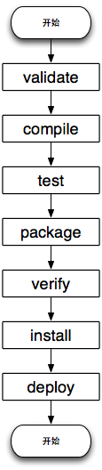
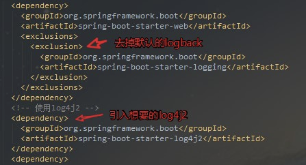

# Maven

## 1.Maven概念

> Maven由Apache 软件基金会所提供，一个开源项目， 是基于项目对象模型（POM）进行软件项目管理及自动构建工具。

## 2.为什么要使用Maven

1. 项目启动困难（Maven几分钟）
2. 每个项目配置不同（跨所有项目的一致使用——对于新开发人员来说，这意味着没有过渡的时间）
3. jar包依赖困难，冲突不断（高级依赖项管理，包括自动更新、依赖项闭包(也称为传递依赖项)）
4. jar包管理困难，每个项目都要导入（版本统一管理、Maven仓库）
5. 输出jar、war困难（Maven直接支持）

## 3.Maven作用

- 统一项目依赖管理，Maven将jar包和项目分开了，通过依赖管理来管理Jar包，节省空间
- 提供统一的模板，构建统一的项目结构
- 一键构建项目： Maven 可以完成的工作：编译、测试、运行、打包、部署。  

## 4.Maven与IDE的关系

- IDE可以集成Maven
- 两者分工
  - IDE：项目代码的编写、修改等等
  - Maven：项目的构建、编译、测试、运行、打包、部署

## 5.Maven目录结构


- src\main\java，用来存放项目的Java源代码。
- src\main\resources，用来存放项目相关的资源文件（比如配置文件）。
- src\test\java，用来存放项目的测试 Java 源代码。
- src\test\resource，用来存放运行测试代码时所依赖的资源文件。

## 6.Maven命令

```bash
#查看Maven版本信息 
mvn -v
#编译源代码
mvn compile
#编译、运行单元测试
mvn test
#打包
mvn package
#清空输出目录下所有文件
mvn clean
#安装至本地仓库
mvn install
```

## 7.Maven命令创建项目

```bash
mvn archetype:generate -DgroupId=cool.xiaokang -DartifactId=MavenDemoCmd -Dversion=1.0-SNAPSHOT -Dpackage=cool.xiaokang -DarchetypeArtifactId=maven-archetype-quickstart
```

## 8.什么是Maven的构件

>  在Maven中，任何依赖(jar包,tomcat等)或项目(自己打包的jar,war等)输出都可成为构件。 

## 9.Maven标识元素

 每个构件都有自己的唯一标识(唯一坐标)，由groupId，artifactId和version等信息构成 

**groupId**：当前Maven构件组织名。（也就是项目包名）

**artifactId**：项目名

**version**：项目当前版本。

## 10.Maven生命周期



## 11.Maven的构件的作用范围

|          | 编译期 | 测试期 | 运行期 | 说明                                                         |
| -------- | ------ | ------ | ------ | ------------------------------------------------------------ |
| compile  | **√**  | **√**  | **√**  | 默认范围                                                     |
| provided | **√**  | **√**  |        | 如servlet-api.jar,运行期由web容器提供                        |
| runtime  |        | **√**  | **√**  | 编译期无需直接引用                                           |
| test     |        | **√**  |        | 如junit.jar                                                  |
| system   | **√**  | **√**  |        | (**不推荐**)必须通过<systemPath> </systemPath>元素，显示指定依赖文件的路径，与本地系统相关联，可移植性差。 |
| import   |        |        |        | 表示继承父pom.xml中的依赖范围设置                            |

## 12.短路优先

- 构件具有依赖传递。例如：当前项目依赖构件A，而构件A又依赖B，Maven会将A和B都视为当前项目的依赖。

- 构件之间存在版本冲突时，Maven会依据 “**短路优先**” 原则加载构件。此外，我们也可以在pom.xml中，使用显式排除某个版本的依赖，以确保项目能够运行。

1. 项目依赖构件A和B，构件A → C → D(version:1.0.0)，构件B → D(version:1.1.0)，此时，Maven会优先解析加载D(version:1.1.0)。
2. 项目依赖构件A和B，构件A → D(version:1.0.0)， 构件B → D(version:1.1.0)，此时，Maven会优先解析加载D(version:1.0.0)。

## 13.依赖排除

有时候你引入的依赖中包含你不想要的依赖包，你想引入自己想要的，这时候就要用到排除依赖了，比如下图中spring-boot-starter-web自带了logback这个日志包，我想引入log4j2的，所以我先排除掉logback的依赖包，再引入想要的包就行了



```xml
<exclusions>
    <exclusion>
        <groupId>org.springframework.boot</groupId>
        <artifactId>spring-boot-starter-logging</artifactId>
    </exclusion>
</exclusions>
```