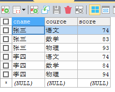
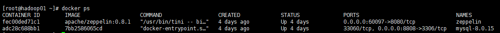
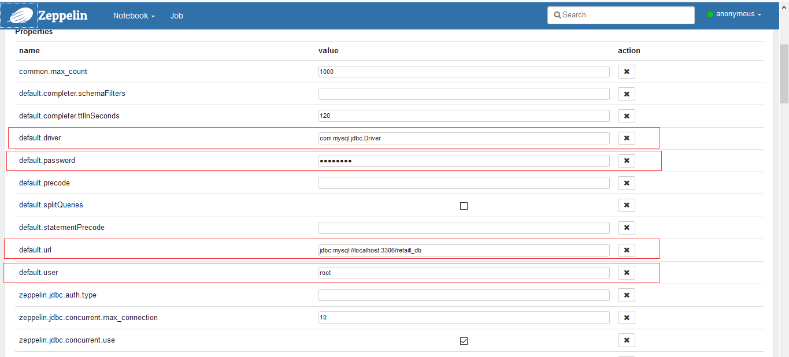
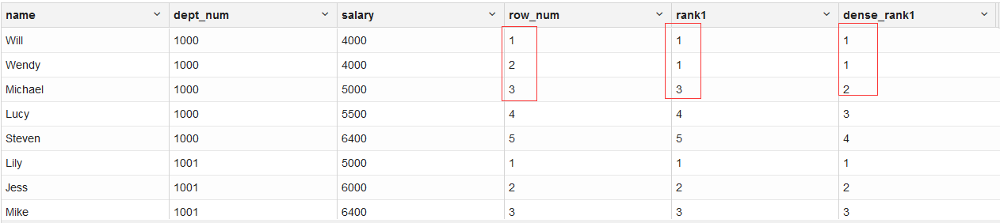
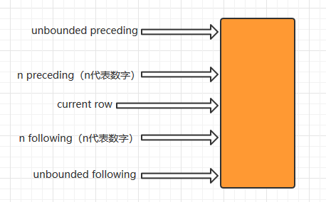
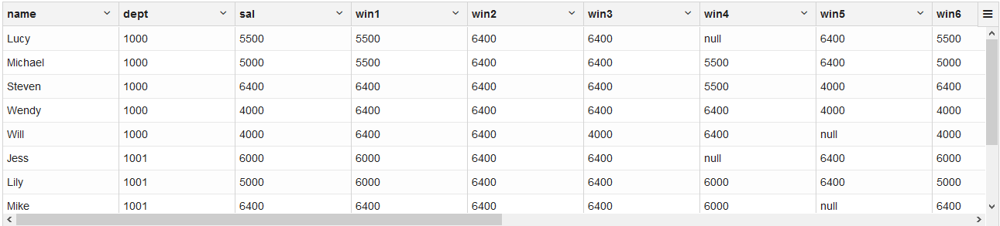
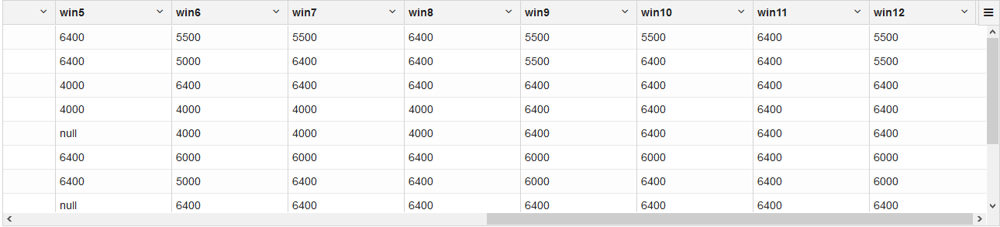
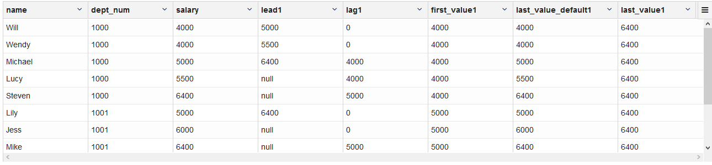

# SQL

## 1.行转列

建表

```mysql
DROP TABLE IF EXISTS `students_score`;
/*!40101 SET @saved_cs_client     = @@character_set_client */;
/*!50503 SET character_set_client = utf8mb4 */;
CREATE TABLE `students_score` (
  `cname` VARCHAR(10) DEFAULT NULL,
  `cource` VARCHAR(10) DEFAULT NULL,
  `score` INT(11) DEFAULT NULL
) ENGINE=INNODB DEFAULT CHARSET=utf8;
/*!40101 SET character_set_client = @saved_cs_client */;

--
-- Dumping data for table `students_score`
--

LOCK TABLES `students_score` WRITE;
/*!40000 ALTER TABLE `students_score` DISABLE KEYS */;
INSERT INTO `students_score` VALUES ('张三','语文',74),('张三','数学',83),('张三','物理',93),('李四','语文',74),('李四','数学',84),('李四','物理',94);
/*!40000 ALTER TABLE `students_score` ENABLE KEYS */;
UNLOCK TABLES;
```



- if方式

  ```java
  //java中
  if(表达式){
      //if code
  }else{
      //else code	
  }
  //mysql中
  if（表达式,表达式为true执行,表达式为false执行）
  ```

- case end方式

  ```java
  //单个条件
  case 列名
      when 列所对应的值 then 想要显示的列的值 else 不满足when后面的值时的值 
  end
          
  //多个条件
  case 列名
      when 列所对应的值 then 想要显示的列的值
      when 列所对应的值 then 想要显示的列的值
      when 列所对应的值 then 想要显示的列的值
      else 不满足以上所有when后面的值时的值
  end
          
  //条件区间
  case
      when 列名>某个值 and 列明<某个值 then 想要显示的值
      when 列名>某个值 and 列明<某个值 then 想要显示的值
      when 列名>某个值 and 列明<某个值 then 想要显示的值
      else 不满足以上所有when后面的区间值时的值
  end
  ```

- sql语句

  ```mysql
  select cname 姓名,
      MAX(if(cource='语文',score,0)) as 语文,
      MAX(if(cource='数学',score,0)) as 数学,
      MAX(if(cource='物理',score,0)) as 物理
  from students_score
  group by cname
  
  select cname 姓名,
      (case cource when '语文' then score else 0 end) as 语文,
      (case cource when '数学' then score else 0 end) as 数学,
      (case cource when '物理' then score else 0 end) as 物理
  from students_score
  group by cname
  ```

  

## 2.时间格式化相关

```mysql
year(date)：获取date字段的年，如2020
quarter(date)：获取date字段的所属季度，如3
date_format(date,"%y-%m")：将date字段的时间格式化成xx-xx格式，如2020-01
date_format(date,"%w")='0'：date字段的时间属于星期几，如0表示Monday
concat(year(date),'-',quarter(date))：concat是一个拼接函数，将date字段拼接为指定格式，如2020-1
CAST(SUBSTRING_INDEX(TIME,":",1) AS DECIMAL(4,2))：cast类型转换函数，substring_index中第一个参数为要分割的字段值，第二个参数为分割条件，第三个为取哪部分
```

## 3.Docker安装MySql8

```bash
docker pull mysql:8.0.15

docker run -d --name mysql-8.0.15 -p 8808:3306 -e MYSQL_ROOT_PASSWORD=xiaokang 7bb2586065cd

docker exec -it adc28c688bb1 /bin/bash

mysql -u root -pxiaokang

ALTER user 'root'@'%' IDENTIFIED WITH mysql_native_password BY 'xiaokang'; 

flush privileges;

quit;
```

```json
运行时的容器信息
"Mounts": [
            {
                "Type": "volume",
                "Name": "951aa880aaf5ae16da840ca77f09f741e91b7e02dd1da4ae2f44e29351b6daf1",
                "Source": "/var/lib/docker/volumes/951aa880aaf5ae16da840ca77f09f741e91b7e02dd1da4ae2f44e29351b6daf1/_data",
                "Destination": "/var/lib/mysql",
                "Driver": "local",
                "Mode": "",
                "RW": true,
                "Propagation": ""
            }
        ]
```



## 4.zeppelin安装和配置（含Docker版）

1. 下载zeppelin-0.8.1-bin-all.rar
2. 解压
3. bin目录下双击zeppelin.cmd运行
4. 浏览器输入http;//localhost:8080（默认用户为anonymous）
5. 配置interpreter



```bash
#1.下载镜像
docker pull apache/zeppelin:0.8.1

#2.创建卷(目录在/var/lib/docker/volumes)
docker volume create zeppelin-logs
docker volume create zeppelin-notebook

#3.启动zeppelin
docker run -d -p 60097:8080 -v zeppelin-logs:/logs -v  zeppelin-notebook:/notebook --env HOST_IP=0.0.0.0 --env ZEPPELIN_LOG_DIR='/logs' --env ZEPPELIN_NOTEBOOK_DIR='/notebook' --volume /etc/localtime:/etc/localtime --restart=always --name zeppelin  apache/zeppelin:0.8.1
```


## 5.练习-客户&交易分析&&门店分析

```mysql
#一、客户信息分析(1.最受欢迎的信用卡)
select credit_type,count(distinct credit_no) as no_count
from customer_details
group by credit_type
order by no_count desc
limit 1
#2.前5个最多的客户职业
select job,count(*) as job_count
from customer_details
group by job
order by job_count desc
limit 0,5
#3.前三个美国女性持有的最流行的行用卡
select credit_type,count(*) as count
from customer_details
where gender='Female' and country='United States'
group by credit_type
order by count desc 
limit 0,3
#4.按性别和国家进行客户统计
select gender,country,count(*) as count
from customer_details
group by gender,country
#二、交易分析(1.按月度统计总收益)
select date_format(date,"%y-%m") as month_count,round(sum(price),2) as month_price
from transactions
group by month_count
#2.按季度统计总收益
select round(sum(price),2) as quarter_price,concat(year(date),"-",quarter(date)) as quarter
from transactions
group by quarter
#3.按年统计总收益
select round(sum(price),2) as year_price,year(date) as year
from transactions
group by year
#4.统计每周各天的总收益
select round(sum(price),2) as week_price,
    case
        when date_format(date,"%w")='0' then 'Monday'
        when date_format(date,"%w")='1' then 'Tuesday'
        when date_format(date,"%w")='2' then 'Wednesday'
        when date_format(date,"%w")='3' then 'Thursday'
        when date_format(date,"%w")='4' then 'Friday'
        when date_format(date,"%w")='5' then 'Saturday'
        when date_format(date,"%w")='6' then 'Sunday'
    end as week
from transactions
group by week
#5.按时间段统计平均收益和总收益
SELECT round(AVG(price),2) AS avg_price,round(SUM(price),2) AS sum_price,
    CASE
	    WHEN time_in_hours > 5 AND time_in_hours <= 8 THEN 'early morning'
	    WHEN time_in_hours > 8 AND time_in_hours <= 11 THEN 'morning'
	    WHEN time_in_hours > 11 AND time_in_hours <= 13 THEN 'noon'
	    WHEN time_in_hours > 13 AND time_in_hours <= 18 THEN 'afternoon'
	    WHEN time_in_hours > 18 AND time_in_hours <= 22 THEN 'evening'
        ELSE 'night'
    END AS time_slot
FROM(
SELECT price,
    (CAST(SUBSTRING_INDEX(TIME,":",1) AS DECIMAL(4,2))+CAST(SUBSTRING_INDEX(TIME,":",2) AS DECIMAL(4,2))/60) AS time_in_hours
FROM transactions
) xk
GROUP BY time_slot
#6.统计消费次数排行前10位的客户
select cd.first_name,count(distinct ts.transaction_id) as ts_id_count
from transactions ts
join customer_details as cd
on ts.customer_id=cd.customer_id
group by ts.customer_id
order by ts_id_count desc
limit 0,10
#7.统计消费额前10位客户
select first_name,round(sum(price),2) as total_price
from(
select distinct ts.transaction_id,cd.first_name,ts.price,ts.customer_id
from transactions ts
join customer_details cd
on ts.customer_id=cd.customer_id
) xk
group by customer_id
order by total_price desc
limit 0,10
#8.统计每年度、季度总客户数
select year,year_quarter,count(distinct customer_id) as customer_count
from(
select 
	customer_id,
	concat(year(date),'-',quarter(date)) as year_quarter,
	year(date) as year 
from transactions
) xk
group by year,year_quarter
order by customer_count desc
#9.找出平均消费额最大的客户
select cd.first_name,cd.customer_id,round(avg(price),2) as avg_price
from transactions ts
join customer_details cd
on ts.customer_id=cd.customer_id
group by cd.customer_id
order by avg_price
#10.统计最受欢迎的产品（分别从购买客户数量、购买频次、消费额三个维度分析）
select product,count(customer_id) as purchase_cus
from transactions 
group by product 
order by purchase_cus desc
limit 0,5
#从购买频次维度分析
select product,count(distinct transaction_id) as purchase_count
from transactions 
group by product 
order by purchase_count desc
limit 0,5
#从消费额维度分析
select product,sum(price) as purchase_price
from transactions 
group by product 
order by purchase_price desc
limit 0,5
#三、1.按客流量找出最受欢迎的门店
SELECT store_name,ts.store_id,COUNT(DISTINCT customer_id) AS customer_count
FROM transactions ts
JOIN store_details sd
ON sd.store_id=ts.store_id
GROUP BY store_id
ORDER BY customer_count DESC
limit 1
#2.按客户消费额找出最受欢迎的门店
SELECT store_name,ts.store_id,ROUND(SUM(price),2) AS customer_price
FROM transactions ts
JOIN store_details sd
ON sd.store_id=ts.store_id
GROUP BY store_id
ORDER BY customer_price DESC
limit 1
#3.按交易频次找出最受欢迎的门店
SELECT store_name,ts.store_id,COUNT(DISTINCT transaction_id) AS transaction_count
FROM transactions ts
JOIN store_details sd
ON sd.store_id=ts.store_id
GROUP BY store_id
ORDER BY transaction_count DESC
limit 1
#4.按客流量找出每个门店最受欢迎的商品
select store_name,product,max_customer_count
from(
    select product,store_id,max(customer_count) as max_customer_count
    from(
        select product,store_id,count(distinct customer_id) as customer_count
        from transactions
        group by store_id,product
    ) temp
    group by store_id
) xk
join store_details sd
on sd.store_id=xk.store_id


    select store_name,product,xk.store_id,max(customer_count) as max_customer_count
    from(
        select product,store_id,count(distinct customer_id) as customer_count
        from transactions
        group by store_id,product
    ) xk
JOIN store_details sd
ON sd.store_id=xk.store_id
group by store_id
#5.统计每个门店客流量与雇员的比率
select store_name,customer_count,employee_number,concat(round((customer_count/employee_number),2),"%") as percent
from
(select store_id,count(distinct customer_id) as customer_count
from transactions
group by store_id) temp
join store_details sd
on sd.store_id=temp.store_id
#6.按年度-月份统计每家门店的收益
SELECT sd.store_name,year_month1,temp.total_price
FROM
(SELECT store_id,ROUND(SUM(price),2) AS total_price,DATE_FORMAT(DATE,"%Y-%m") AS year_month1
FROM transactions
GROUP BY store_id,year_month1) temp
JOIN store_details sd
ON sd.store_id=temp.store_id
#7.找出每家门店最繁忙的时刻
SELECT sd.store_name,time_slot,total_transaction
FROM
(SELECT store_id,
	COUNT(transaction_id) AS total_transaction,
	CASE
		WHEN time_in_hours>5 AND time_in_hours<=8 THEN 'early morning'
		WHEN time_in_hours > 8 AND time_in_hours <= 11 THEN 'morning'
		WHEN time_in_hours > 11 AND time_in_hours <= 13 THEN 'noon'
		WHEN time_in_hours > 13 AND time_in_hours <= 18 THEN 'afternoon'
		WHEN time_in_hours > 18 AND time_in_hours <= 22 THEN 'evening'
		ELSE 'night'
	END AS time_slot
FROM
(SELECT store_id,
	transaction_id,
	(CAST(SUBSTRING_INDEX(TIME,":",1) AS DECIMAL(4,2))+CAST(SUBSTRING_INDEX(TIME,":",-1) AS DECIMAL(4,2))/60) AS time_in_hours
FROM transactions
) temp
GROUP BY store_id,time_slot
) xk
JOIN store_details sd 
ON sd.store_id=xk.store_id
```

## 6.窗口函数

1. 定义

   > 窗口函数是一组特殊的函数，扫描多个输入行来计算每个输出值，为每行数据生成一行结果，可以通过窗口函数进行聚合和分析

2. 排序

   ```mysql
   ROW_NUMBER()->#对所有数值输出不同的序号，序号唯一连续（1，2，3）
   
   RANK()->#对于相同数值，输出相同的序号，排序不会连续（1，1，3） 
   
   DENSE_RANK()->#对于相同数值，输出相同的序号，排序连续（1，1，2）
   ```

   ```mysql
   #对于各个部门的薪水进行排名，按照薪水的高到低
   select name,dept_num,salary,
      row_number() over(partition by dept_num order by salary ) as row_num,
      rank() over(partition by dept_num order by salary ) as rank1,
      dense_rank() over(partition by dept_num order by salary ) as dense_rank1
   from employee_contract
   order by dept_num ,salary 
   ```

   

3. 聚合

   ```mysql
   #1.统计最近两年各季度的累加利润
   select concat(year(order_time),"-",quarter(order_time)) as order_quarter,order_money,
       SUM(order_money) over(order by year(order_time),quarter(order_time)) as year_quarter_mondey
   from orderinfo
    
   #2.统计最近两年各年各季度的累加利润
   select concat(year(order_time),"-",quarter(order_time)) as order_quarter,order_money,
       SUM(order_money) over(partition by year(order_time) order by QUARTER(order_time)) as year_quarter_mondey
   from orderinfo
    
   #3.统计最近两年各年各月的累计利润
   select concat(year(order_time),"-",month(order_time)) as order_month,order_money,
       SUM(order_money) over(partition by year(order_time) order by MONTH(order_time)) as year_quarter_mondey
   from orderinfo
   where year(order_time)+2>year(now())
   ```

   窗口定义

   

   ```mysql
   SELECT
      name, dept_num AS dept, salary AS sal,
      MAX(salary) OVER (PARTITION BY dept_num ORDER BY name ROWS BETWEEN 2 PRECEDING AND CURRENT ROW) win1,
      MAX(salary) OVER (PARTITION BY dept_num ORDER BY name ROWS BETWEEN 2 PRECEDING AND UNBOUNDED FOLLOWING) win2,
      MAX(salary) OVER (PARTITION BY dept_num ORDER BY name ROWS BETWEEN 1 PRECEDING AND 2 FOLLOWING) win3,
      MAX(salary) OVER (PARTITION BY dept_num ORDER BY name ROWS BETWEEN 2 PRECEDING AND 1 PRECEDING) win4,
      MAX(salary) OVER (PARTITION BY dept_num ORDER BY name ROWS BETWEEN 1 FOLLOWING AND 2 FOLLOWING) win5,
      MAX(salary) OVER (PARTITION BY dept_num ORDER BY name ROWS BETWEEN CURRENT ROW AND CURRENT ROW) win6,
      MAX(salary) OVER (PARTITION BY dept_num ORDER BY name ROWS BETWEEN CURRENT ROW AND 1 FOLLOWING) win7,
      MAX(salary) OVER (PARTITION BY dept_num ORDER BY name ROWS BETWEEN CURRENT ROW AND UNBOUNDED FOLLOWING) win8,
      MAX(salary) OVER (PARTITION BY dept_num ORDER BY name ROWS BETWEEN UNBOUNDED PRECEDING AND CURRENT ROW) win9,
      MAX(salary) OVER (PARTITION BY dept_num ORDER BY name ROWS BETWEEN UNBOUNDED PRECEDING AND 1 FOLLOWING) win10,
      MAX(salary) OVER (PARTITION BY dept_num ORDER BY name ROWS BETWEEN UNBOUNDED PRECEDING AND UNBOUNDED FOLLOWING) win11,
      MAX(salary) OVER (PARTITION BY dept_num ORDER BY name ROWS 2 PRECEDING) win12
   FROM employee_contract  
   ORDER BY dept, name;
   ```

   

   

4. 分析

   ```mysql
   SELECT name, dept_num, salary,
                 LEAD(salary, 2) OVER(PARTITION BY dept_num ORDER BY salary) AS lead1,
                 LAG(salary, 2, 0) OVER(PARTITION BY dept_num ORDER BY salary) AS lag1,
                 FIRST_VALUE(salary) OVER (PARTITION BY dept_num ORDER BY salary) AS first_value1,
                 LAST_VALUE(salary) OVER (PARTITION BY dept_num ORDER BY salary) AS last_value_default1,
                 LAST_VALUE(salary) OVER (PARTITION BY dept_num ORDER BY salary RANGE BETWEEN 
                                                UNBOUNDED PRECEDING AND UNBOUNDED FOLLOWING) AS last_value1
   FROM employee_contract
   ORDER BY dept_num, salary;
   ```

   

## 7.窗口函数练习

```mysql
#1、统计order_items表中销量最多的前10个商品
SELECT order_item_product_id,
	SUM(order_item_quantity) AS total_quantity
FROM order_items
GROUP BY order_item_product_id
ORDER BY total_quantity DESC
LIMIT 0,10
#2、根据商品子类id大小对每个商品大类下的子类进行排名
SELECT category_department_id,category_name,
	row_number() over(PARTITION BY category_department_id ORDER BY category_id) AS rank_category
FROM categories
#3、统计order_items表中各订单中不同商品总数、订单总金额、订单最高/最低/平均金额
SELECT order_item_order_id,order_item_product_id,
	COUNT(*) over(PARTITION BY order_item_order_id) AS product_total,
	SUM(order_item_subtotal) over(PARTITION BY order_item_order_id) AS total_price,
	MAX(order_item_subtotal) over(PARTITION BY order_item_order_id) AS max_price,
	MIN(order_item_subtotal) over(PARTITION BY order_item_order_id) AS min_price,
	AVG(order_item_subtotal) over(PARTITION BY order_item_order_id) AS avg_price
FROM order_items
```

## 8.表数据

```mysql
CREATE DATABASE  IF NOT EXISTS `retail_db` /*!40100 DEFAULT CHARACTER SET utf8mb4 COLLATE utf8mb4_0900_ai_ci */ /*!80016 DEFAULT ENCRYPTION='N' */;
USE `retail_db`;
-- MySQL dump 10.13  Distrib 8.0.18, for Win64 (x86_64)
--
-- Host: localhost    Database: retail1_db
-- ------------------------------------------------------
-- Server version	8.0.18

/*!40101 SET @OLD_CHARACTER_SET_CLIENT=@@CHARACTER_SET_CLIENT */;
/*!40101 SET @OLD_CHARACTER_SET_RESULTS=@@CHARACTER_SET_RESULTS */;
/*!40101 SET @OLD_COLLATION_CONNECTION=@@COLLATION_CONNECTION */;
/*!50503 SET NAMES utf8 */;
/*!40103 SET @OLD_TIME_ZONE=@@TIME_ZONE */;
/*!40103 SET TIME_ZONE='+00:00' */;
/*!40014 SET @OLD_UNIQUE_CHECKS=@@UNIQUE_CHECKS, UNIQUE_CHECKS=0 */;
/*!40014 SET @OLD_FOREIGN_KEY_CHECKS=@@FOREIGN_KEY_CHECKS, FOREIGN_KEY_CHECKS=0 */;
/*!40101 SET @OLD_SQL_MODE=@@SQL_MODE, SQL_MODE='NO_AUTO_VALUE_ON_ZERO' */;
/*!40111 SET @OLD_SQL_NOTES=@@SQL_NOTES, SQL_NOTES=0 */;

--
-- Table structure for table `categories`
--

DROP TABLE IF EXISTS `categories`;
/*!40101 SET @saved_cs_client     = @@character_set_client */;
/*!50503 SET character_set_client = utf8mb4 */;
CREATE TABLE `categories` (
  `category_id` INT(11) DEFAULT NULL,
  `category_department_id` INT(11) DEFAULT NULL,
  `category_name` VARCHAR(45) DEFAULT NULL
) ENGINE=INNODB DEFAULT CHARSET=utf8mb4 COLLATE=utf8mb4_0900_ai_ci;
/*!40101 SET character_set_client = @saved_cs_client */;

--
-- Dumping data for table `categories`
--

LOCK TABLES `categories` WRITE;
/*!40000 ALTER TABLE `categories` DISABLE KEYS */;
INSERT INTO `categories` VALUES (1,2,'Football'),(2,2,'Soccer'),(3,2,'Baseball & Softball'),(4,2,'Basketball'),(5,2,'Lacrosse'),(6,2,'Tennis & Racquet'),(7,2,'Hockey'),(8,2,'More Sports'),(9,3,'Cardio Equipment'),(10,3,'Strength Training'),(11,3,'Fitness Accessories'),(12,3,'Boxing & MMA'),(13,3,'Electronics'),(14,3,'Yoga & Pilates'),(15,3,'Training by Sport'),(16,3,'As Seen on  TV!'),(17,4,'Cleats'),(18,4,'Men\'s Footwear'),(19,4,'Women\'s Footwear'),(20,4,'Kids\' Footwear'),(21,4,'Featured Shops'),(22,4,'Accessories'),(23,5,'Men\'s Apparel'),(24,5,'Women\'s Apparel'),(25,5,'Boys\' Apparel'),(26,5,'Girls\' Apparel'),(27,5,'Accessories'),(28,5,'Top Brands'),(29,5,'Shop By Sport'),(30,6,'Men\'s Golf Clubs'),(31,6,'Women\'s Golf Clubs'),(32,6,'Golf Apparel'),(33,6,'Golf Shoes'),(34,6,'Golf Bags & Carts'),(35,6,'Golf Gloves'),(36,6,'Golf Balls'),(37,6,'Electronics'),(38,6,'Kids\' Golf Clubs'),(39,6,'Team Shop'),(40,6,'Accessories'),(41,6,'Trade-In'),(42,7,'Bike & Skate Shop'),(43,7,'Camping & Hiking'),(44,7,'Hunting & Shooting'),(45,7,'Fishing'),(46,7,'Indoor/Outdoor Games'),(47,7,'Boating'),(48,7,'Water Sports'),(49,8,'MLB'),(50,8,'NFL'),(51,8,'NHL'),(52,8,'NBA'),(53,8,'NCAA'),(54,8,'MLS'),(55,8,'International Soccer'),(56,8,'World Cup Shop'),(57,8,'MLB Players'),(58,8,'NFL Players');
/*!40000 ALTER TABLE `categories` ENABLE KEYS */;
UNLOCK TABLES;

--
-- Table structure for table `customer_details`
--

DROP TABLE IF EXISTS `customer_details`;
/*!40101 SET @saved_cs_client     = @@character_set_client */;
/*!50503 SET character_set_client = utf8mb4 */;
CREATE TABLE `customer_details` (
  `customer_id` VARCHAR(255) DEFAULT NULL,
  `first_name` VARCHAR(255) DEFAULT NULL,
  `last_name` VARCHAR(255) DEFAULT NULL,
  `email` VARCHAR(255) DEFAULT NULL,
  `gender` VARCHAR(255) DEFAULT NULL,
  `address` VARCHAR(255) DEFAULT NULL,
  `country` VARCHAR(255) DEFAULT NULL,
  `language` VARCHAR(255) DEFAULT NULL,
  `job` VARCHAR(255) DEFAULT NULL,
  `credit_type` VARCHAR(255) DEFAULT NULL,
  `credit_no` VARCHAR(255) DEFAULT NULL
) ENGINE=INNODB DEFAULT CHARSET=latin1;
/*!40101 SET character_set_client = @saved_cs_client */;

--
-- Dumping data for table `customer_details`
--

LOCK TABLES `customer_details` WRITE;
/*!40000 ALTER TABLE `customer_details` DISABLE KEYS */;
INSERT INTO `customer_details` VALUES ('1','Spencer','Raffeorty','sraffeorty0@dropbox.com','Male','9274 Lyons Court','China','Khmer','Safety Technician III','jcb','3.5893733855e+015'),('2','Cherye','Poynor','cpoynor1@51.la','Female','1377 Anzinger Avenue','China','Czech','Research Nurse','instapayment','6.3765948618e+015'),('3','Natasha','Abendroth','nabendroth2@scribd.com','Female','2913 Evergreen Lane','China','Yiddish','Budget/Accounting Analyst IV','visa','4.0415919056e+015'),('4','Huntley','Seally','hseally3@prlog.org','Male','694 Del Sol Lane','China','Albanian','Environmental Specialist','laser','6.7711831074e+017'),('5','Druci','Coad','dcoad4@weibo.com','Female','16 Debs Way','China','Hebrew','Teacher','jcb','3.5372872598e+015'),('6','Sayer','Brizell','sbrizell5@opensource.org','Male','71 Banding Terrace','China','Maltese','Accountant IV','americanexpress','3.7970988539e+014'),('7','Becca','Brawley','bbrawley6@sitemeter.com','Female','7 Doe Crossing Junction','China','Czech','Payment Adjustment Coordinator','jcb','3.5453777199e+015'),('8','Michele','Bastable','mbastable7@sun.com','Female','98 Clyde Gallagher Pass','China','Malayalam','Tax Accountant','jcb','3.5881317871e+015'),('9','Marla','Brotherhood','mbrotherhood8@illinois.edu','Female','4538 Fair Oaks Trail','China','Dari','Design Engineer','china-unionpay','5.6022338452e+018'),('10','Lionello','Gogarty','lgogarty9@histats.com','Male','800 Sage Alley','China','Danish','Clinical Specialist','diners-club-carte-blanche','3.0290846607e+013'),('11','Camile','Ringer','cringera@army.mil','Female','5060 Fairfield Alley','China','Punjabi','Junior Executive','china-unionpay','5.6022134906e+015'),('12','Gillan','Banbridge','gbanbridgeb@wikipedia.org','Female','91030 Havey Point','China','Kurdish','Chemical Engineer','jcb','3.5559480588e+015'),('13','Guinna','Damsell','gdamsellc@spiegel.de','Female','869 Ohio Park','China','Fijian','Analyst Programmer','jcb','3.5320094652e+015'),('14','Octavia','McDugal','omcdugald@rambler.ru','Female','413 Forster Center','China','English','Desktop Support Technician','maestro','5.0201759312e+017'),('15','Anjanette','Penk','apenke@lulu.com','Female','8154 Schiller Road','China','Swedish','VP Sales','jcb','3.5480390558e+015'),('16','Maura','Teesdale','mteesdalef@globo.com','Female','9568 Quincy Alley','China','Dutch','Dental Hygienist','jcb','3.5828942525e+015'),('17','Chastity','Neylon','cneylong@wix.com','Female','11952 Northwestern Lane','China','Gujarati','Geologist I','jcb','3.5431759121e+015'),('18','Ralph','Coils','rcoilsh@artisteer.com','Male','5070 Hooker Pass','China','Khmer','Speech Pathologist','mastercard','5.5057935872e+015'),('19','Jehanna','Whybrow','jwhybrowi@wp.com','Female','83 Maywood Way','China','Fijian','Assistant Professor','visa-electron','4.8445733855e+015'),('20','Ingeberg','Sutehall','isutehallj@feedburner.com','Female','272 Butternut Drive','China','Kazakh','Assistant Manager','visa-electron','4.4058349872e+015'),('21','Mikaela','Frensch','mfrenschk@tiny.cc','Female','2 Packers Avenue','China','Ndebele','Systems Administrator I','diners-club-enroute','2.0191816974e+014'),('22','Gladys','Rowatt','growattl@prlog.org','Female','0068 Towne Way','China','English','Environmental Specialist','jcb','3.5695587649e+015'),('23','Marguerite','Schimoni','mschimonim@nymag.com','Female','0974 Valley Edge Circle','China','Malay','Web Designer III','jcb','3.5339330946e+015'),('24','Cordy','Herety','cheretyn@howstuffworks.com','Female','805 Kenwood Trail','United States','Luxembourgish','Engineer I','jcb','3.5427824859e+015'),('25','Erie','Gilleson','egillesono@php.net','Male','7709 Eastlawn Point','United States','Chinese','Paralegal','diners-club-carte-blanche','3.0279733685e+013'),('26','Hermina','Adacot','hadacotp@canalblog.com','Female','763 Bartillon Junction','China','West Frisian','Nuclear Power Engineer','jcb','3.5783371056e+015'),('27','Biddy','Bocke','bbockeq@adobe.com','Female','17 Morning Plaza','China','Khmer','Help Desk Technician','laser','6.3041730255e+016'),('28','Tonie','McLeese','tmcleeser@networkadvertising.org','Female','50 Muir Park','China','Malayalam','Financial Analyst','china-unionpay','5.6022217824e+016'),('29','Sonni','Tommasuzzi','stommasuzzis@taobao.com','Female','447 Vernon Way','China','Montenegrin','Recruiting Manager','diners-club-enroute','2.0161978709e+014'),('30','Saunderson','Casebourne','scasebournet@gov.uk','Male','00357 Steensland Center','China','Georgian','VP Quality Control','jcb','3.5711473921e+015'),('31','Ranna','Jeandet','rjeandetu@vkontakte.ru','Female','3 Meadow Vale Road','China','Gagauz','Budget/Accounting Analyst I','mastercard','5.1001775322e+015'),('32','Philomena','Toppin','ptoppinv@cnn.com','Female','17828 Sunbrook Circle','Canada','Kannada','Junior Executive','mastercard','5.4995434794e+015'),('33','Nanette','Spinney','nspinneyw@yellowpages.com','Female','861 Monica Place','China','Guaraní','Nurse','maestro','6.3047431335e+016'),('34','Rowland','Boyn','rboynx@homestead.com','Male','9 Village Green Place','China','Dzongkha','Data Coordiator','laser','6.7719013829e+016'),('35','Sigismund','Seage','sseagey@php.net','Male','93551 North Trail','China','Montenegrin','VP Accounting','visa-electron','4.1750015263e+015'),('36','Idaline','Byforth','ibyforthz@xinhuanet.com','Female','94 Delaware Alley','China','Dhivehi','Teacher','jcb','3.5393283151e+015'),('37','Marjory','Rahl','mrahl10@alexa.com','Female','8300 Shoshone Alley','China','Dhivehi','Office Assistant II','visa-electron','4.1750094355e+015'),('38','Dev','Kopfen','dkopfen11@yandex.ru','Male','79 Shopko Plaza','China','West Frisian','Office Assistant I','jcb','3.5598784507e+015'),('39','Caralie','Looby','clooby12@craigslist.org','Female','73110 Dryden Alley','China','Dzongkha','Chief Design Engineer','instapayment','6.370350283e+015'),('40','Kelby','Drewell','kdrewell13@csmonitor.com','Male','3 Rieder Park','United States','Latvian','Programmer III','jcb','3.5547530956e+015'),('41','Alverta','Rubinsohn','arubinsohn14@ask.com','Female','89 Esch Avenue','China','Croatian','Engineer III','mastercard','5.4189341596e+015'),('42','Arel','Klainman','aklainman15@ucsd.edu','Male','243 Mariners Cove Circle','China','Belarusian','Civil Engineer','americanexpress','3.7230189599e+014'),('43','Raviv','Marriner','rmarriner16@sfgate.com','Male','396 Cody Junction','China','Hebrew','Accounting Assistant II','diners-club-us-ca','5.5762813209e+015'),('44','Jermayne','Tooby','jtooby17@zdnet.com','Male','60 Anniversary Terrace','China','Croatian','Database Administrator IV','jcb','3.5741972516e+015'),('45','Rea','Nichols','rnichols18@hostgator.com','Female','381 Bluejay Center','China','Hebrew','Computer Systems Analyst IV','jcb','3.5432030215e+015'),('46','Jehu','Ashurst','jashurst19@sbwire.com','Male','7 Sherman Plaza','China','Assamese','Software Test Engineer I','jcb','3.5793912585e+015'),('47','Allistir','Imloch','aimloch1a@adobe.com','Male','6120 Chive Drive','China','Bulgarian','Graphic Designer','mastercard','5.273288058e+015'),('48','Ashton','Battleson','abattleson1b@cpanel.net','Male','23 Esch Terrace','China','Hiri Motu','Nuclear Power Engineer','mastercard','5.1001497169e+015'),('49','Isabel','Castelin','icastelin1c@miitbeian.gov.cn','Female','56657 Meadow Ridge Circle','China','Filipino','VP Marketing','maestro','5.0204741823e+016'),('50','Car','Hufton','chufton1d@yelp.com','Male','8 Charing Cross Court','China','Telugu','Legal Assistant','mastercard','5.0101221676e+015'),('51','Alvera','Cryer','acryer1e@woothemes.com','Female','41 Bashford Alley','China','Dzongkha','Tax Accountant','jcb','3.5681815065e+015'),('52','Lori','Moizer','lmoizer1f@cbc.ca','Female','03130 Calypso Lane','China','Somali','Account Representative IV','jcb','3.5500427699e+015'),('53','Viola','Firmage','vfirmage1g@cisco.com','Female','4734 Steensland Court','Canada','Swedish','Chemical Engineer','jcb','3.5817575249e+015'),('54','Warde','Flukes','wflukes1h@abc.net.au','Male','043 Lyons Crossing','China','Danish','Recruiter','switch','4.903584985e+017'),('55','Noam','Bockett','nbockett1i@cafepress.com','Male','809 Eagle Crest Hill','China','Quechua','Dental Hygienist','jcb','3.5852444765e+015'),('56','Leora','Cooch','lcooch1j@infoseek.co.jp','Female','4201 Elka Road','China','Kashmiri','VP Accounting','jcb','3.5359343185e+015'),('57','Joane','Peyton','jpeyton1k@prweb.com','Female','7 Browning Plaza','United States','Dzongkha','Nurse Practicioner','jcb','3.5467437637e+015'),('58','Adey','Gyrgorcewicx','agyrgorcewicx1l@economist.com','Female','51575 Washington Plaza','China','Indonesian','Media Manager I','jcb','3.5325057047e+015'),('59','Alexio','Strickett','astrickett1m@theglobeandmail.com','Male','71 Schurz Street','United States','Arabic','Environmental Specialist','maestro','6.762706305e+015'),('60','Lamond','Killeley','lkilleley1n@blinklist.com','Male','6 Nancy Place','China','German','Design Engineer','diners-club-enroute','2.0181279744e+014'),('61','Mommy','Halleday','mhalleday1o@google.com.hk','Female','32 Sunbrook Park','United States','Mongolian','Administrative Assistant IV','jcb','3.5291670879e+015'),('62','Vick','Marcinkus','vmarcinkus1p@lycos.com','Male','0 Blackbird Hill','China','Greek','Graphic Designer','jcb','3.5476783392e+015'),('63','Casey','Kinane','ckinane1q@omniture.com','Female','33 Acker Crossing','China','Bosnian','Food Chemist','jcb','3.5516319164e+015'),('64','Aimil','Missen','amissen1r@engadget.com','Female','311 Loomis Court','China','Zulu','Geologist IV','jcb','3.5370595696e+015'),('65','Dukey','Creffeild','dcreffeild1s@biglobe.ne.jp','Male','4047 Orin Street','China','Malay','Programmer IV','switch','4.9055353234e+017'),('66','Carine','Brandsen','cbrandsen1t@gizmodo.com','Female','3 Schurz Avenue','China','West Frisian','Account Executive','jcb','3.5813282098e+015'),('67','Reeba','Beggs','rbeggs1u@angelfire.com','Female','0 Green Road','United States','Japanese','Accountant II','mastercard','5.1001491136e+015'),('68','Gracia','Sandey','gsandey1v@businessweek.com','Female','82 Bowman Avenue','China','Czech','Automation Specialist II','mastercard','5.4227380956e+015'),('69','Ambros','Bovingdon','abovingdon1w@foxnews.com','Male','3 Ohio Avenue','United States','Malay','Administrative Assistant I','mastercard','5.3743713948e+015'),('70','Lissy','Buy','lbuy1x@slideshare.net','Female','8 Reindahl Hill','China','Pashto','Actuary','maestro','6.7617809961e+018'),('71','Vanny','Watman','vwatman1y@slate.com','Female','0 South Lane','China','Tsonga','Engineer II','jcb','3.5485166062e+015'),('72','Brooks','Cherm','bcherm1z@marriott.com','Male','394 Memorial Junction','China','New Zealand Sign Language','Programmer Analyst II','diners-club-carte-blanche','3.002521428e+013'),('73','Alexandr','Giscken','agiscken20@telegraph.co.uk','Male','77 Kingsford Place','China','Greek','Marketing Manager','jcb','3.5457543405e+015'),('74','Fae','Adger','fadger21@tripadvisor.com','Female','078 Heffernan Road','China','Arabic','Research Nurse','jcb','3.5669047712e+015'),('75','Ingrim','Tanswill','itanswill22@cmu.edu','Male','73094 Thierer Road','China','Amharic','Physical Therapy Assistant','diners-club-enroute','2.0158847884e+014'),('76','Giustina','Corsor','gcorsor23@blog.com','Female','24005 Westend Road','China','Malay','Structural Analysis Engineer','jcb','3.5549310631e+015'),('77','Lotta','Goburn','lgoburn24@123-reg.co.uk','Female','43752 Oneill Circle','China','Punjabi','Web Designer II','visa-electron','4.0268156696e+015'),('78','Raphaela','Bottoms','rbottoms25@dropbox.com','Female','9266 Springview Alley','China','Luxembourgish','Marketing Manager','jcb','3.5826572443e+015'),('79','Guss','Patroni','gpatroni26@shareasale.com','Male','30 Elka Lane','China','Persian','Structural Analysis Engineer','switch','4.9118425351e+018'),('80','Camilla','Dudenie','cdudenie27@businessinsider.com','Female','920 Starling Avenue','China','Azeri','Clinical Specialist','mastercard','5.108750223e+015'),('81','Kim','Phelipeaux','kphelipeaux28@samsung.com','Male','585 Straubel Plaza','China','Belarusian','Registered Nurse','visa-electron','4.4057625102e+015'),('82','Maurene','Helliar','mhelliar29@disqus.com','Female','61079 Northwestern Alley','United States','New Zealand Sign Language','Legal Assistant','switch','4.936740859e+018'),('83','Shae','Kelby','skelby2a@economist.com','Male','25904 Village Green Hill','China','Papiamento','Chemical Engineer','maestro','6.7631560327e+015'),('84','Jewel','Murrum','jmurrum2b@woothemes.com','Female','43 Larry Pass','China','Arabic','Business Systems Development Analyst','solo','6.7675585464e+018'),('85','Kelwin','Massimo','kmassimo2c@theglobeandmail.com','Male','2437 Vera Avenue','China','Tajik','Web Developer I','bankcard','5.6022264039e+015'),('86','Zachariah','Nottle','znottle2d@google.com','Male','6 Forest Avenue','China','Tetum','Mechanical Systems Engineer','maestro','6.3048781693e+015'),('87','Cassandre','Kerry','ckerry2e@google.es','Female','643 Hanson Parkway','China','Belarusian','Web Developer III','jcb','3.5831298658e+015'),('88','Skyler','Browse','sbrowse2f@house.gov','Male','807 Sachtjen Way','China','Croatian','Mechanical Systems Engineer','bankcard','5.602238837e+015'),('89','Gare','Wilcock','gwilcock2g@addthis.com','Male','50 Lukken Road','China','Italian','Data Coordiator','jcb','3.5301836168e+015'),('90','Francois','Bream','fbream2h@imgur.com','Male','8289 Kinsman Drive','China','Italian','Legal Assistant','mastercard','5.0483766684e+015'),('91','Marnia','Fackrell','mfackrell2i@washington.edu','Female','88 Artisan Way','China','Assamese','Senior Quality Engineer','visa-electron','4.0268833969e+015'),('92','Court','Potzold','cpotzold2j@forbes.com','Male','28771 Packers Trail','China','Telugu','Research Nurse','china-unionpay','5.6022225683e+018'),('93','Farrell','Bon','fbon2k@bing.com','Male','7555 Meadow Vale Plaza','China','Bislama','Statistician I','mastercard','5.1001452829e+015'),('94','Toni','Keating','tkeating2l@shutterfly.com','Female','07 Green Hill','China','Greek','Payment Adjustment Coordinator','mastercard','5.5470814987e+015'),('95','Christie','Adair','cadair2m@noaa.gov','Male','7525 Bluejay Trail','China','Swati','Executive Secretary','jcb','3.5715958852e+015'),('96','Cammi','Searston','csearston2n@vk.com','Female','44 Lighthouse Bay Street','China','Kannada','Senior Cost Accountant','jcb','3.5556066954e+015'),('97','Lory','Yarker','lyarker2o@istockphoto.com','Female','32312 Garrison Road','China','Polish','Software Test Engineer III','jcb','3.5793517892e+015'),('98','Killie','Stubbin','kstubbin2p@latimes.com','Male','13 Sherman Park','China','Lao','Help Desk Operator','diners-club-us-ca','5.5507383984e+015'),('99','Zack','Martello','zmartello2q@nih.gov','Male','819 Katie Park','China','Haitian Creole','Pharmacist','bankcard','5.6022479322e+015'),('100','Allen','De Benedetti','adebenedetti2r@comsenz.com','Male','79917 Debra Pass','China','Indonesian','Web Designer IV','jcb','3.5454745436e+015'),('101','Justin','Watkiss','jwatkiss2s@ft.com','Male','45 Stang Avenue','United States','Zulu','Structural Analysis Engineer','bankcard','5.6022355399e+015'),('102','Harold','Thirsk','hthirsk2t@ebay.com','Male','8 Parkside Alley','China','Tswana','Media Manager I','diners-club-carte-blanche','3.0263344362e+013'),('103','Derek','Davidsohn','ddavidsohn2u@desdev.cn','Male','6 La Follette Hill','China','Bosnian','Automation Specialist I','jcb','3.5837598302e+015'),('104','Butch','Rolling','brolling2v@newsvine.com','Male','6218 Spenser Circle','China','Bengali','Administrative Assistant II','diners-club-us-ca','5.5737425927e+015'),('105','Jeniffer','Jencey','jjencey2w@vimeo.com','Female','22422 Monterey Road','United States','Kashmiri','Registered Nurse','china-unionpay','5.6022126506e+017'),('106','Ferris','Brashier','fbrashier2x@domainmarket.com','Male','5739 Delladonna Plaza','China','Armenian','Technical Writer','diners-club-enroute','2.0151698574e+014'),('107','Ban','Exeter','bexeter2y@bbb.org','Male','2695 Waywood Street','China','Romanian','Pharmacist','jcb','3.5426608977e+015'),('108','Muffin','Pengelley','mpengelley2z@webmd.com','Male','67 John Wall Pass','China','Swahili','Structural Analysis Engineer','bankcard','5.6022564384e+015'),('109','Winne','Denzey','wdenzey30@surveymonkey.com','Female','29347 Grim Terrace','China','Latvian','Financial Analyst','mastercard','5.0076615423e+015'),('110','Tremaine','Zeplin','tzeplin31@admin.ch','Male','7961 Loomis Terrace','China','Kazakh','Graphic Designer','jcb','3.528857381e+015'),('111','Sabrina','Ashmole','sashmole32@go.com','Female','99 Hoepker Road','China','Nepali','Software Test Engineer III','visa','4.0415907466e+012'),('112','Maude','McElhinney','mmcelhinney33@wix.com','Female','56281 Grim Road','China','Spanish','VP Sales','jcb','3.5335298948e+015'),('113','Licha','Dudbridge','ldudbridge34@cbslocal.com','Female','78 Tennessee Alley','China','Armenian','Senior Sales Associate','china-unionpay','5.6022532243e+018'),('114','Fabe','Bramhall','fbramhall35@princeton.edu','Male','043 Merry Crossing','China','New Zealand Sign Language','Engineer IV','mastercard','5.2772535569e+015'),('115','Garth','Eastes','geastes36@51.la','Male','653 Nevada Center','China','Croatian','Staff Scientist','jcb','3.5682022455e+015'),('116','Mellisent','Notley','mnotley37@twitter.com','Female','4 Kim Park','China','Sotho','Assistant Manager','bankcard','5.6022290926e+015'),('117','Stephana','Menis','smenis38@timesonline.co.uk','Female','29 Evergreen Circle','China','Sotho','Health Coach II','bankcard','5.6022262967e+015'),('118','Bax','Grishaev','bgrishaev39@sciencedirect.com','Male','17969 Bashford Crossing','China','Korean','Paralegal','laser','6.3043070478e+015'),('119','Merla','Tulloch','mtulloch3a@rediff.com','Female','51375 Northview Lane','China','German','Associate Professor','diners-club-enroute','2.01829663e+014'),('120','Hanan','Sames','hsames3b@spotify.com','Male','1743 Forest Run Drive','China','Japanese','Teacher','jcb','3.5400058339e+015'),('121','Ines','Marshallsay','imarshallsay3c@state.tx.us','Female','5177 Melody Crossing','China','Bengali','Software Engineer II','jcb','3.5573290497e+015'),('122','Purcell','Uzielli','puzielli3d@elegantthemes.com','Male','2 Southridge Lane','China','Papiamento','Help Desk Operator','jcb','3.5523538609e+015'),('123','Libbi','Durbin','ldurbin3e@mtv.com','Female','582 John Wall Lane','China','Khmer','VP Sales','visa-electron','4.9175957416e+015'),('124','Hattie','Emons','hemons3f@nbcnews.com','Female','07 Mcguire Court','China','Burmese','General Manager','jcb','3.5661854009e+015'),('125','Berget','Arro','barro3g@acquirethisname.com','Female','2849 Bowman Pass','China','Catalan','Pharmacist','mastercard','5.1730256316e+015'),('126','Steffen','Bakewell','sbakewell3h@reverbnation.com','Male','5821 Iowa Point','China','Kazakh','Automation Specialist I','jcb','3.5505150372e+015'),('127','Clark','Deeman','cdeeman3i@wunderground.com','Male','06925 Bluestem Alley','China','Macedonian','Professor','jcb','3.5892719745e+015'),('128','Kanya','Brewer','kbrewer3j@si.edu','Female','12361 Old Gate Circle','China','Oriya','Senior Cost Accountant','visa-electron','4.1750017893e+015'),('129','Kristal','Kirkham','kkirkham3k@cocolog-nifty.com','Female','86172 Annamark Plaza','Canada','Quechua','Technical Writer','visa-electron','4.913441874e+015'),('130','Tadd','Rubenchik','trubenchik3l@bravesites.com','Male','18547 Donald Avenue','China','Dhivehi','Actuary','visa','4.0179562449e+012'),('131','Yancey','Rama','yrama3m@paginegialle.it','Male','6 Melby Alley','Canada','Azeri','Account Representative III','visa-electron','4.913746808e+015'),('132','Harrie','Poter','hpoter3n@marriott.com','Female','94 Nevada Point','China','Kannada','Administrative Assistant IV','americanexpress','3.7428390738e+014'),('133','Gabriel','Kirby','gkirby3o@digg.com','Female','586 Cascade Street','China','Tetum','Quality Engineer','maestro','6.762148595e+015'),('134','Rafaela','Rowena','rrowena3p@histats.com','Female','750 Ilene Way','China','Dzongkha','Structural Analysis Engineer','mastercard','5.108752493e+015'),('135','Eunice','McCool','emccool3q@ameblo.jp','Female','9174 Mifflin Drive','China','Kyrgyz','Professor','jcb','3.5435786423e+015'),('136','Gauthier','Vannuccinii','gvannuccinii3r@hhs.gov','Male','92909 Fairview Trail','China','Yiddish','Office Assistant I','china-unionpay','5.6100026997e+016'),('137','Ardath','Cicco','acicco3s@hp.com','Female','82237 Ilene Pass','United States','Maltese','Clinical Specialist','jcb','3.5780722148e+015'),('138','Selma','Cordobes','scordobes3t@reference.com','Female','9 Jackson Lane','China','Malagasy','Nurse','jcb','3.5790983885e+015'),('139','Paquito','Eldridge','peldridge3u@ezinearticles.com','Male','0889 Sachtjen Street','China','Swedish','Programmer Analyst IV','visa-electron','4.9136901643e+015'),('140','Sawyere','Larman','slarman3v@cafepress.com','Male','47595 Hayes Place','China','Luxembourgish','Information Systems Manager','americanexpress','3.7428332513e+014'),('141','Lucais','McManus','lmcmanus3w@elpais.com','Male','729 Moland Plaza','China','English','Sales Representative','jcb','3.5502279227e+015'),('142','Allistir','McCluin','amccluin3x@altervista.org','Male','5215 Luster Crossing','China','Gagauz','Developer I','americanexpress','3.7462244874e+014'),('143','Iago','Franey','ifraney3y@indiegogo.com','Male','7 Sachs Road','China','Kyrgyz','GIS Technical Architect','mastercard','5.0483749286e+015'),('144','Faye','Richfield','frichfield3z@prweb.com','Female','77 Acker Hill','China','Ndebele','Web Developer III','china-unionpay','5.6022404383e+016'),('145','Ilyssa','Lawton','ilawton40@photobucket.com','Female','27 Ridge Oak Hill','China','Korean','Accountant III','jcb','3.5527889506e+015'),('146','Fidelio','Bilofsky','fbilofsky41@toplist.cz','Male','27 Stephen Park','China','Khmer','Nuclear Power Engineer','mastercard','5.1769571181e+015'),('147','Zebedee','Pybworth','zpybworth42@newsvine.com','Male','9100 Northport Avenue','China','Marathi','Technical Writer','diners-club-enroute','2.0184727171e+014'),('148','Abram','Bartolic','abartolic43@hud.gov','Male','767 Lakewood Gardens Trail','China','Guaraní','Geologist III','visa-electron','4.0269274438e+015'),('149','Alyson','Wybron','awybron44@hhs.gov','Female','02 Anhalt Hill','China','Kyrgyz','Staff Accountant III','jcb','3.5399459279e+015'),('150','Ronni','Godfree','rgodfree45@rakuten.co.jp','Female','2988 High Crossing Junction','China','Swedish','Automation Specialist IV','jcb','3.547869968e+015'),('151','Abey','Ackermann','aackermann46@ameblo.jp','Male','1 Thierer Park','China','Gujarati','Structural Analysis Engineer','visa-electron','4.0260560125e+015'),('152','Martie','Stygall','mstygall47@is.gd','Female','7 Onsgard Place','China','Bengali','General Manager','diners-club-enroute','2.0193432005e+014'),('153','Daveta','Barnwill','dbarnwill48@zdnet.com','Female','75 Bunker Hill Avenue','China','French','Web Designer IV','jcb','3.5896258596e+015'),('154','Gail','Stickney','gstickney49@google.nl','Female','69 Mayer Center','United States','Italian','Analyst Programmer','jcb','3.5870223937e+015'),('155','Tabina','Seiffert','tseiffert4a@clickbank.net','Female','7357 Mcguire Avenue','China','Spanish','Editor','jcb','3.5835007539e+015'),('156','Andra','Colegate','acolegate4b@slate.com','Female','3 Westport Drive','United States','Nepali','Environmental Tech','visa-electron','4.5081011385e+015'),('157','Parke','Rameaux','prameaux4c@sakura.ne.jp','Male','3352 Forster Court','China','Zulu','Pharmacist','jcb','3.5519579486e+015'),('158','Kippar','Oleksinski','koleksinski4d@kickstarter.com','Male','70909 Farwell Circle','China','Yiddish','Automation Specialist IV','jcb','3.5569004167e+015'),('159','Kerwinn','Milan','kmilan4e@tripod.com','Male','3905 Dexter Trail','China','Romanian','Senior Developer','solo','6.7676189856e+018'),('160','Vito','Yukhnev','vyukhnev4f@bandcamp.com','Male','256 Rigney Alley','China','German','Physical Therapy Assistant','jcb','3.5810307707e+015'),('161','Lauri','Mulder','lmulder4g@disqus.com','Female','230 Stuart Drive','Canada','Afrikaans','Office Assistant IV','jcb','3.5698950921e+015'),('162','Garreth','Commuzzo','gcommuzzo4h@theatlantic.com','Male','508 Esker Avenue','China','Fijian','Executive Secretary','jcb','3.5862249051e+015'),('163','Eugen','Simion','esimion4i@twitter.com','Male','56 Mallory Plaza','China','Dutch','Recruiting Manager','jcb','3.5796014447e+015'),('164','Norton','Seedull','nseedull4j@360.cn','Male','399 Annamark Road','China','Italian','Legal Assistant','mastercard','5.1001423039e+015'),('165','Augustine','Lillicrop','alillicrop4k@symantec.com','Male','13 Algoma Trail','China','Yiddish','Technical Writer','laser','6.304446826e+015'),('166','Averil','Napleton','anapleton4l@amazonaws.com','Male','71169 Scott Plaza','China','Sotho','Research Assistant IV','jcb','3.5887666431e+015'),('167','Cy','Sugar','csugar4m@nymag.com','Male','40 Ilene Terrace','China','Estonian','Database Administrator II','maestro','5.0381098818e+018'),('168','Sayre','Hurworth','shurworth4n@shop-pro.jp','Female','779 Elka Parkway','China','Hindi','Food Chemist','jcb','3.5511462731e+015'),('169','Theodora','Matchett','tmatchett4o@tamu.edu','Female','58379 Michigan Lane','China','Quechua','Teacher','mastercard','5.0076652571e+015'),('170','Marleen','Loadman','mloadman4p@washington.edu','Female','2 Crownhardt Way','China','Italian','Research Associate','jcb','3.5405607192e+015'),('171','Costa','Andress','candress4q@sciencedaily.com','Male','7 Truax Center','China','Korean','Teacher','jcb','3.5827634424e+015'),('172','Willy','Primmer','wprimmer4r@ustream.tv','Male','37 Farmco Plaza','China','Swedish','Clinical Specialist','china-unionpay','5.6022403216e+017'),('173','Emera','Glowacz','eglowacz4s@smugmug.com','Female','4706 Sycamore Crossing','China','Indonesian','Compensation Analyst','maestro','5.8939888859e+018'),('174','Quintilla','Bondley','qbondley4t@scribd.com','Female','5775 Summit Road','China','Amharic','Internal Auditor','jcb','3.5363468779e+015'),('175','Gannon','Cornbell','gcornbell4u@zdnet.com','Male','4 Ridge Oak Point','China','New Zealand Sign Language','Occupational Therapist','visa-electron','4.1750096467e+015'),('176','Dwight','Vautier','dvautier4v@boston.com','Male','314 Hollow Ridge Plaza','China','Kazakh','Quality Engineer','jcb','3.5765280575e+015'),('177','Elvira','Botton','ebotton4w@yahoo.com','Female','0 Dahle Lane','China','M?ori','Systems Administrator I','bankcard','5.6103024423e+015'),('178','Sherrie','Frankum','sfrankum4x@discovery.com','Female','12550 Commercial Parkway','China','Afrikaans','Project Manager','jcb','3.5771517623e+015'),('179','Nicki','Verna','nverna4y@nature.com','Female','71714 Cody Hill','China','Tok Pisin','Health Coach II','jcb','3.5293811545e+015'),('180','Bobbe','Ellsom','bellsom4z@goo.gl','Female','84049 Novick Drive','China','Mongolian','GIS Technical Architect','switch','4.9055913511e+015'),('181','Paulie','Iacoboni','piacoboni50@admin.ch','Male','9282 East Center','China','Swahili','Civil Engineer','diners-club-enroute','2.0166952616e+014'),('182','Petrina','Ariss','pariss51@ycombinator.com','Female','176 Lerdahl Parkway','China','Hebrew','Clinical Specialist','diners-club-us-ca','5.4252744381e+015'),('183','Jere','Sargant','jsargant52@google.it','Female','715 Logan Place','China','Moldovan','Actuary','visa','4.0415960053e+015'),('184','Berke','Conkey','bconkey53@blogs.com','Male','2 Dixon Center','China','Maltese','Paralegal','jcb','3.5672722414e+015'),('185','Benjamen','MacAleese','bmacaleese54@whitehouse.gov','Male','4 Claremont Lane','China','Kashmiri','Financial Advisor','instapayment','6.3787503991e+015'),('186','Selinda','Lafay','slafay55@bluehost.com','Female','75031 Old Gate Park','China','Swati','Administrative Officer','visa-electron','4.5084975536e+015'),('187','Marie-jeanne','Caughtry','mcaughtry56@psu.edu','Female','24 Mariners Cove Junction','China','Fijian','Office Assistant I','jcb','3.5421348522e+015'),('188','Harrie','Kabsch','hkabsch57@nifty.com','Female','83 Carioca Road','United States','Macedonian','Financial Advisor','visa','4.0415977357e+012'),('189','Wood','Sofe','wsofe58@sourceforge.net','Male','46 Anhalt Hill','China','Finnish','Structural Analysis Engineer','jcb','3.5774002399e+015'),('190','Jonell','Shorthill','jshorthill59@apple.com','Female','794 Gale Junction','China','Fijian','Software Engineer III','mastercard','5.107922835e+015'),('191','Serena','Loveredge','sloveredge5a@hostgator.com','Female','29123 Continental Crossing','China','Tetum','Web Developer III','mastercard','5.0076676913e+015'),('192','Teena','Deesly','tdeesly5b@time.com','Female','7 Hagan Circle','United States','Polish','Programmer I','bankcard','5.6022410275e+015'),('193','Felice','Hilhouse','fhilhouse5c@dailymail.co.uk','Female','96 Mendota Trail','China','Fijian','Registered Nurse','switch','6.3333600941e+015'),('194','Freddy','Pauli','fpauli5d@utexas.edu','Male','056 Leroy Place','China','Tsonga','Social Worker','jcb','3.546440491e+015'),('195','Darline','Yushachkov','dyushachkov5e@blog.com','Female','852 Monterey Lane','China','M?ori','Human Resources Manager','jcb','3.5513207054e+015'),('196','Kellsie','Maud','kmaud5f@woothemes.com','Female','584 Sunnyside Drive','China','Marathi','Software Consultant','maestro','5.0185997911e+016'),('197','Fifine','Lyal','flyal5g@freewebs.com','Female','89590 Delaware Trail','China','Hiri Motu','Teacher','jcb','3.532823057e+015'),('198','Humphrey','Pincked','hpincked5h@tripod.com','Male','38 Arizona Lane','China','New Zealand Sign Language','Financial Advisor','jcb','3.5315232198e+015'),('199','Pearla','Sample','psample5i@nydailynews.com','Female','05205 Northwestern Circle','China','Polish','Developer III','jcb','3.5898677936e+015'),('200','Amabelle','Tillot','atillot5j@t.co','Female','95756 Little Fleur Parkway','China','Belarusian','Senior Quality Engineer','jcb','3.5340399449e+015'),('201','Gene','Wixey','gwixey5k@lycos.com','Female','62 Maple Wood Hill','China','Kyrgyz','Structural Analysis Engineer','jcb','3.5608601015e+015'),('202','Giraud','Friel','gfriel5l@forbes.com','Male','7917 Veith Center','China','Bengali','Geologist II','bankcard','5.602214405e+015'),('203','Whitby','Hoyland','whoyland5m@symantec.com','Male','98018 Merchant Junction','China','Italian','Help Desk Technician','switch','5.6418273954e+017'),('204','Caldwell','Dennett','cdennett5n@cpanel.net','Male','3444 Walton Center','China','Burmese','Registered Nurse','maestro','6.0469606438e+016'),('205','Roderigo','Fitzsimons','rfitzsimons5o@prweb.com','Male','167 Northland Way','China','Afrikaans','GIS Technical Architect','jcb','3.533820084e+015'),('206','Francis','Geaves','fgeaves5p@harvard.edu','Male','1962 Mitchell Park','China','Moldovan','Teacher','visa','4.0415978081e+015'),('207','Eddy','Aynscombe','eaynscombe5q@discovery.com','Male','5981 Northridge Center','China','Haitian Creole','Internal Auditor','switch','5.6418234092e+015'),('208','Pru','Raynham','praynham5r@sakura.ne.jp','Female','92 Park Meadow Plaza','China','Kazakh','Environmental Specialist','jcb','3.5531274787e+015'),('209','Gunar','Messitt','gmessitt5s@furl.net','Male','51145 Shasta Crossing','China','Dhivehi','Teacher','jcb','3.5553011256e+015'),('210','Emmy','Mitro','emitro5t@cmu.edu','Male','2428 Harper Court','China','Norwegian','Programmer Analyst II','switch','4.9033597185e+018'),('211','Marlyn','Persian','mpersian5u@seesaa.net','Female','4 Pleasure Street','United States','Greek','Programmer Analyst I','jcb','3.5510144811e+015'),('212','Terrence','Patrie','tpatrie5v@paypal.com','Male','02 Bluestem Plaza','China','Moldovan','Teacher','jcb','3.5828645902e+015'),('213','Kimberlyn','Heikkinen','kheikkinen5w@networkadvertising.org','Female','7 Dorton Park','China','Irish Gaelic','Marketing Assistant','switch','6.3337978684e+015'),('214','Gisele','Causer','gcauser5x@clickbank.net','Female','69616 Wayridge Junction','China','Albanian','Accountant II','switch','4.905789224e+018'),('215','Glynnis','Sabates','gsabates5y@foxnews.com','Female','3 Becker Plaza','China','Tajik','Engineer II','jcb','3.5755924818e+015'),('216','Pren','Megroff','pmegroff5z@weather.com','Male','6839 Morrow Plaza','United States','Bislama','VP Marketing','jcb','3.5348952384e+015'),('217','Rudolfo','Halt','rhalt60@squidoo.com','Male','96 Knutson Court','China','Yiddish','Web Designer III','diners-club-carte-blanche','3.0406233491e+013'),('218','Feodor','Barrington','fbarrington61@springer.com','Male','06 Ramsey Alley','China','Kurdish','GIS Technical Architect','maestro','6.047678676e+015'),('219','Ignace','Crocroft','icrocroft62@seattletimes.com','Male','3 Randy Way','China','Khmer','Desktop Support Technician','jcb','3.5827423724e+015'),('220','Verne','Brigham','vbrigham63@vkontakte.ru','Male','64 Vermont Parkway','China','Oriya','Research Nurse','jcb','3.5741975865e+015'),('221','Shanda','Peerman','speerman64@opensource.org','Female','0 Transport Drive','China','Tok Pisin','Budget/Accounting Analyst IV','jcb','3.5605979915e+015'),('222','Jenna','Bosher','jbosher65@nifty.com','Female','11 Helena Center','China','Greek','Cost Accountant','china-unionpay','5.6109004602e+015'),('223','Melinda','Simmonds','msimmonds66@vistaprint.com','Female','506 Larry Parkway','China','Punjabi','GIS Technical Architect','maestro','5.8935265699e+015'),('224','Darius','Jiroutka','djiroutka67@smugmug.com','Male','1 Summerview Terrace','China','Guaraní','Geologist IV','jcb','3.5468400103e+015'),('225','Romonda','Itzcak','ritzcak68@independent.co.uk','Female','637 Burrows Center','China','Lao','Software Consultant','mastercard','5.1001488665e+015'),('226','Mark','Borland','mborland69@prlog.org','Male','350 Burning Wood Point','China','Estonian','Design Engineer','jcb','3.5676065062e+015'),('227','Annabela','Cohane','acohane6a@redcross.org','Female','85554 Mifflin Hill','United States','Bosnian','Web Developer I','maestro','5.0386763086e+017'),('228','Maynord','Beaufoy','mbeaufoy6b@1688.com','Male','0 Barnett Terrace','China','Dhivehi','Research Assistant III','jcb','3.5361973638e+015'),('229','Maris','Retter','mretter6c@hostgator.com','Female','679 Morning Drive','China','Luxembourgish','Office Assistant I','laser','6.3049444087e+017'),('230','Zabrina','Elmar','zelmar6d@hubpages.com','Female','8 Fulton Drive','China','Kannada','Assistant Manager','jcb','3.550503118e+015'),('231','Brnaba','Blackwell','bblackwell6e@shutterfly.com','Male','3 Larry Circle','China','Malagasy','Environmental Tech','visa','4.0179570067e+012'),('232','Hillie','Van Der Weedenburg','hvanderweedenburg6f@harvard.edu','Male','8093 Schiller Street','United States','Tok Pisin','Food Chemist','diners-club-carte-blanche','3.0257036302e+013'),('233','Sella','Rabbitt','srabbitt6g@indiatimes.com','Female','163 Warbler Pass','China','Tsonga','Registered Nurse','americanexpress','3.7462276235e+014'),('234','Johnnie','Victoria','jvictoria6h@printfriendly.com','Male','65276 Barby Crossing','China','Amharic','Occupational Therapist','jcb','3.5715237737e+015'),('235','Reese','Cicccitti','rcicccitti6i@digg.com','Male','5478 8th Point','United States','Tetum','Analyst Programmer','jcb','3.5833717175e+015'),('236','Kelby','Westraw','kwestraw6j@mediafire.com','Male','24 Rigney Alley','China','Azeri','Office Assistant IV','diners-club-enroute','2.017917981e+014'),('237','Idelle','McKeggie','imckeggie6k@aboutads.info','Female','55482 Debs Circle','China','Zulu','Programmer I','jcb','3.5389572498e+015'),('238','Bancroft','Seldon','bseldon6l@engadget.com','Male','2991 Burning Wood Circle','China','Norwegian','Social Worker','mastercard','5.0076698269e+015'),('239','Maybelle','Sutcliffe','msutcliffe6m@wikispaces.com','Female','645 Northport Road','China','Lithuanian','Social Worker','diners-club-enroute','2.0191734873e+014'),('240','Emory','Gonzalvo','egonzalvo6n@opera.com','Male','125 Clove Trail','China','Zulu','Biostatistician III','diners-club-carte-blanche','3.0594912555e+013'),('241','Jarrett','Costerd','jcosterd6o@icio.us','Male','53 Lakewood Gardens Crossing','China','Marathi','Project Manager','maestro','6.7631253943e+017'),('242','Billie','Calan','bcalan6p@tinypic.com','Female','3581 6th Terrace','China','Gagauz','Human Resources Manager','diners-club-carte-blanche','3.0561059154e+013'),('243','Blythe','Schwant','bschwant6q@51.la','Female','161 Ridge Oak Court','Canada','Portuguese','Desktop Support Technician','jcb','3.5688107042e+015'),('244','Hammad','Mathet','hmathet6r@msu.edu','Male','60 Harbort Court','China','Arabic','Programmer II','jcb','3.5463573951e+015'),('245','Wynny','Kobu','wkobu6s@usda.gov','Female','1 Pond Pass','China','Amharic','Financial Advisor','diners-club-carte-blanche','3.0262116738e+013'),('246','Barry','Kilrow','bkilrow6t@youtu.be','Male','222 Norway Maple Alley','China','Haitian Creole','Developer II','mastercard','5.5076812559e+015'),('247','Davidde','Hegges','dhegges6u@npr.org','Male','604 Forest Run Park','China','Spanish','Quality Engineer','jcb','3.5349839042e+015'),('248','Jolee','Saenz','jsaenz6v@fastcompany.com','Female','8 Tennyson Hill','United States','Maltese','Junior Executive','bankcard','5.602255412e+015'),('249','Gilberto','Nancarrow','gnancarrow6w@psu.edu','Male','4 Donald Junction','China','Swedish','Budget/Accounting Analyst II','switch','6.3311012178e+018'),('250','Natalya','Ollivier','nollivier6x@acquirethisname.com','Female','727 Granby Avenue','China','Punjabi','VP Sales','china-unionpay','5.6022574671e+016'),('251','Elysha','Kubica','ekubica6y@indiegogo.com','Female','78654 Swallow Road','China','Kyrgyz','Accountant IV','jcb','3.5860227189e+015'),('252','Bernice','Dupree','bdupree6z@github.io','Female','776 Larry Street','China','Dutch','Software Consultant','diners-club-us-ca','5.5463742458e+015'),('253','Jamie','Kyllford','jkyllford70@tripadvisor.com','Male','71 Towne Trail','China','Latvian','Executive Secretary','jcb','3.5373393812e+015'),('254','Graig','Heamus','gheamus71@hugedomains.com','Male','05 Dottie Park','China','Maltese','Accounting Assistant III','jcb','3.5372022389e+015'),('255','Michele','Land','mland72@simplemachines.org','Male','6 Esch Road','China','Tajik','Safety Technician I','visa-electron','4.917800052e+015'),('256','Gerry','Brislan','gbrislan73@nytimes.com','Male','0 Iowa Point','China','Norwegian','Research Nurse','jcb','3.5597925628e+015'),('257','Sheffie','Pedrol','spedrol74@google.com','Male','6236 Graedel Park','China','Italian','Chemical Engineer','bankcard','5.6022428471e+015'),('258','Celestyn','Burgh','cburgh75@tmall.com','Female','33 Kim Pass','United States','Chinese','Internal Auditor','mastercard','5.5991841399e+015'),('259','Lilly','Broderick','lbroderick76@pcworld.com','Female','94407 Rowland Place','China','Macedonian','Civil Engineer','bankcard','5.6022224047e+015'),('260','Danette','Stode','dstode77@yandex.ru','Female','8 Anzinger Alley','China','Aymara','VP Sales','diners-club-enroute','2.0140361724e+014'),('261','Fairleigh','Stairs','fstairs78@amazon.co.uk','Male','07 Shopko Parkway','United States','Kurdish','Statistician II','china-unionpay','5.6022485738e+016'),('262','Forrester','Kierans','fkierans79@github.com','Male','347 Anniversary Road','China','Punjabi','Assistant Professor','visa-electron','4.4059644486e+015'),('263','Carlita','Noell','cnoell7a@tamu.edu','Female','45 Claremont Hill','China','Yiddish','Information Systems Manager','jcb','3.5842152979e+015'),('264','Gardner','Demchen','gdemchen7b@desdev.cn','Male','325 Hanover Park','China','New Zealand Sign Language','Software Consultant','switch','5.6418228257e+017'),('265','Alastair','Perry','aperry7c@adobe.com','Male','59 Waywood Court','China','Hindi','Mechanical Systems Engineer','jcb','3.5787048426e+015'),('266','Errick','Behrendsen','ebehrendsen7d@toplist.cz','Male','90534 Mesta Place','China','Hiri Motu','Sales Representative','visa-electron','4.0260857318e+015'),('267','Bethany','Sinney','bsinney7e@harvard.edu','Female','03 Forster Court','China','Telugu','Systems Administrator III','visa-electron','4.0263186526e+015'),('268','Orlando','Clulee','oclulee7f@i2i.jp','Male','7 Roxbury Plaza','China','Dzongkha','Financial Advisor','mastercard','5.1087571471e+015'),('269','Kareem','Housam','khousam7g@shutterfly.com','Male','459 Longview Center','China','Japanese','Cost Accountant','mastercard','5.0023518224e+015'),('270','Jerrilyn','Burtenshaw','jburtenshaw7h@mashable.com','Female','00645 Golf View Crossing','China','Croatian','Help Desk Technician','jcb','3.5745677725e+015'),('271','Regan','Tuny','rtuny7i@ucoz.com','Male','901 Evergreen Drive','United States','Kannada','Senior Editor','jcb','3.5805641826e+015'),('272','Hewet','Lingwood','hlingwood7j@amazonaws.com','Male','24528 Park Meadow Center','Canada','Swedish','Health Coach I','instapayment','6.3929052965e+015'),('273','Carroll','Chaundy','cchaundy7k@vinaora.com','Male','4360 Dahle Hill','China','Spanish','Recruiting Manager','jcb','3.5874945946e+015'),('274','Huey','Skene','hskene7l@seattletimes.com','Male','5 Donald Crossing','United States','Greek','Senior Quality Engineer','switch','5.6418299388e+018'),('275','Nariko','Faulds','nfaulds7m@posterous.com','Female','52 Crowley Terrace','China','Fijian','Environmental Tech','jcb','3.5311854279e+015'),('276','Odette','Benzie','obenzie7n@smugmug.com','Female','750 Graceland Terrace','China','Mongolian','Professor','bankcard','5.6105667636e+015'),('277','Guido','McSharry','gmcsharry7o@shareasale.com','Male','9 Reindahl Drive','China','Hiri Motu','VP Quality Control','switch','6.3332692839e+018'),('278','Vite','Bonwick','vbonwick7p@godaddy.com','Male','5 Laurel Place','China','Persian','Database Administrator IV','jcb','3.5550122815e+015'),('279','Troy','Izak','tizak7q@51.la','Male','13 Sunbrook Way','Canada','Kyrgyz','Staff Accountant II','diners-club-carte-blanche','3.0025379365e+013'),('280','Stefanie','Lantry','slantry7r@china.com.cn','Female','8809 David Way','China','Mongolian','Environmental Specialist','solo','6.7678832106e+015'),('281','Riccardo','Lambillion','rlambillion7s@amazon.co.uk','Male','9972 Kings Center','China','Oriya','Help Desk Technician','instapayment','6.3973415261e+015'),('282','Lenard','Shimony','lshimony7t@spiegel.de','Male','269 Lighthouse Bay Hill','China','Tok Pisin','Assistant Professor','jcb','3.5780402547e+015'),('283','Wells','Brigstock','wbrigstock7u@blogger.com','Male','296 Commercial Crossing','China','Greek','Internal Auditor','visa-electron','4.9177321618e+015'),('284','Wit','Tiffney','wtiffney7v@disqus.com','Male','4643 Golden Leaf Crossing','China','Guaraní','VP Accounting','americanexpress','3.379417895e+014'),('285','Merrel','Woolfitt','mwoolfitt7w@hexun.com','Male','7648 Fairview Road','China','Marathi','VP Marketing','jcb','3.5643443064e+015'),('286','Bradney','Christer','bchrister7x@discuz.net','Male','97 Dixon Road','China','Irish Gaelic','Executive Secretary','visa','4.0413714285e+015'),('287','Godfrey','Manser','gmanser7y@twitpic.com','Male','1 Barby Court','China','Malayalam','Senior Financial Analyst','maestro','5.0180988089e+017'),('288','Thomasine','Atwill','tatwill7z@toplist.cz','Female','1 Bay Place','China','Kannada','Editor','china-unionpay','5.6022174483e+015'),('289','Skylar','Nassey','snassey80@noaa.gov','Male','1863 Drewry Terrace','China','Tsonga','Sales Representative','switch','6.3333306415e+018'),('290','Quillan','Reef','qreef81@youtube.com','Male','3 Grim Park','United States','Mongolian','Chief Design Engineer','diners-club-carte-blanche','3.0211554022e+013'),('291','Issi','Duns','iduns82@constantcontact.com','Female','18 Anthes Court','United States','Telugu','Project Manager','visa-electron','4.913472672e+015'),('292','Allin','Dallander','adallander83@addthis.com','Male','75461 Quincy Avenue','Canada','Arabic','Senior Developer','visa-electron','4.0260556623e+015'),('293','Babbie','Reven','breven84@canalblog.com','Female','370 New Castle Crossing','Canada','Belarusian','Financial Advisor','jcb','3.5616410829e+015'),('294','Galina','Marchington','gmarchington85@unesco.org','Female','2217 Grim Park','China','Persian','Analog Circuit Design manager','visa','4.0413795386e+012'),('295','Stillmann','Gratland','sgratland86@vk.com','Male','9 Laurel Junction','China','Swedish','Editor','diners-club-enroute','2.0163191253e+014'),('296','Gerhardine','Haug','ghaug87@usa.gov','Female','08191 East Avenue','China','Azeri','Social Worker','visa-electron','4.9132381535e+015'),('297','Lorenza','Flack','lflack88@mashable.com','Female','6 Donald Road','China','Korean','Research Nurse','switch','6.3311063442e+017'),('298','Chevalier','Gurr','cgurr89@a8.net','Male','780 Russell Place','China','Bislama','Staff Accountant I','visa','4.0179561443e+012'),('299','Rodd','O\' Finan','rofinan8a@sphinn.com','Male','96153 Dakota Park','China','Zulu','Compensation Analyst','instapayment','6.3801537395e+015'),('300','Angelia','Hagger','ahagger8b@dmoz.org','Female','911 Di Loreto Trail','China','Tamil','Budget/Accounting Analyst IV','jcb','3.547101178e+015'),('301','Gwenneth','Melesk','gmelesk8c@ucla.edu','Female','08252 La Follette Trail','China','German','Accountant I','jcb','3.5596148946e+015'),('302','Florian','Ambrogetti','fambrogetti8d@barnesandnoble.com','Male','4643 Graedel Hill','China','Georgian','Assistant Media Planner','jcb','3.5364758498e+015'),('303','Pamella','McLanachan','pmclanachan8e@businessinsider.com','Female','7687 Dryden Park','China','Kashmiri','Electrical Engineer','jcb','3.5723576093e+015'),('304','Aluino','Kitchener','akitchener8f@php.net','Male','38 South Pass','China','West Frisian','Technical Writer','diners-club-enroute','2.0189707199e+014'),('305','Arley','Earthfield','aearthfield8g@list-manage.com','Male','024 Evergreen Park','China','Dari','Design Engineer','maestro','6.7628722445e+015'),('306','Concordia','Shaughnessy','cshaughnessy8h@theguardian.com','Female','1 Stone Corner Way','China','Tajik','Junior Executive','jcb','3.5466276257e+015'),('307','Eden','Gotecliffe','egotecliffe8i@springer.com','Female','603 Northridge Junction','United States','Korean','Information Systems Manager','mastercard','5.2555193189e+015'),('308','Davey','Piddle','dpiddle8j@discovery.com','Male','4 Dapin Pass','China','Burmese','Mechanical Systems Engineer','jcb','3.5486682279e+015'),('309','Sybil','Riepl','sriepl8k@photobucket.com','Female','93 David Center','China','Sotho','Civil Engineer','jcb','3.5550686053e+015'),('310','Samuele','Yanshin','syanshin8l@pen.io','Male','19466 Petterle Hill','China','Bislama','Assistant Manager','visa-electron','4.9134604074e+015'),('311','Cheston','Teodori','cteodori8m@icq.com','Male','3 Boyd Road','China','Mongolian','Tax Accountant','bankcard','5.6022118172e+015'),('312','Gusti','Franklyn','gfranklyn8n@1und1.de','Female','50 Loftsgordon Hill','Canada','Danish','VP Product Management','visa-electron','4.17500995e+015'),('313','Ronalda','Ruffle','rruffle8o@apache.org','Female','6555 American Ash Place','China','Italian','Project Manager','jcb','3.5676968504e+015'),('314','Bernardine','Astlet','bastlet8p@netvibes.com','Female','56269 Hagan Road','China','Assamese','Senior Quality Engineer','mastercard','5.0023590238e+015'),('315','Renate','Simnor','rsimnor8q@google.fr','Female','72 Esch Crossing','China','Danish','Accountant I','switch','4.9030105355e+018'),('316','Mame','Kees','mkees8r@quantcast.com','Female','93928 Fisk Point','China','Zulu','Internal Auditor','visa-electron','4.9179136352e+015'),('317','Radcliffe','Robion','rrobion8s@soundcloud.com','Male','51142 Kenwood Road','China','West Frisian','Programmer IV','jcb','3.5889925358e+015'),('318','Delores','Thormann','dthormann8t@netscape.com','Female','823 Springs Trail','China','Croatian','Nuclear Power Engineer','jcb','3.5538188476e+015'),('319','Angie','Hinkens','ahinkens8u@163.com','Male','7343 Roth Hill','China','Oriya','Design Engineer','laser','6.7098241488e+017'),('320','Jehu','Piggott','jpiggott8v@linkedin.com','Male','70987 Dovetail Drive','United States','Polish','Project Manager','diners-club-carte-blanche','3.0229573102e+013'),('321','Had','Carvill','hcarvill8w@bluehost.com','Male','987 Sachs Way','China','Bengali','General Manager','visa-electron','4.9174734012e+015'),('322','Brooks','Mayoral','bmayoral8x@wikimedia.org','Female','16 Arkansas Center','China','Nepali','Programmer Analyst II','visa-electron','4.405177677e+015'),('323','Wandie','Heynen','wheynen8y@answers.com','Female','23649 Starling Road','China','Indonesian','Biostatistician IV','diners-club-enroute','2.0164853611e+014'),('324','Enrichetta','MacCague','emaccague8z@furl.net','Female','28 Melody Crossing','China','M?ori','Assistant Professor','jcb','3.5518764039e+015'),('325','Jodee','MacCracken','jmaccracken90@thetimes.co.uk','Female','26924 Schiller Way','China','Swedish','Executive Secretary','maestro','6.7639367701e+015'),('326','Reinaldo','Briiginshaw','rbriiginshaw91@timesonline.co.uk','Male','431 Commercial Point','Canada','Dhivehi','Data Coordiator','laser','6.7064240292e+017'),('327','Sibyl','Rampley','srampley92@jiathis.com','Female','97766 Hanson Center','China','Bulgarian','Programmer IV','bankcard','5.6101093319e+015'),('328','Marla','Manssuer','mmanssuer93@uol.com.br','Female','433 Old Shore Street','China','Persian','Assistant Media Planner','visa-electron','4.8445966496e+015'),('329','Clarance','Domenc','cdomenc94@businessinsider.com','Male','15 Rockefeller Trail','China','Latvian','Marketing Manager','visa','4.041372956e+015'),('330','Reinhold','Hallawell','rhallawell95@home.pl','Male','62 Sugar Place','China','Arabic','Nurse','visa-electron','4.0265620866e+015'),('331','Hyacintha','Jadczak','hjadczak96@sciencedaily.com','Female','39219 Washington Place','China','Dutch','Systems Administrator IV','jcb','3.5347530346e+015'),('332','Alberto','Twitching','atwitching97@dell.com','Male','820 Springview Junction','United States','Pashto','Senior Developer','mastercard','5.0076627098e+015'),('333','Jinny','Willavize','jwillavize98@biglobe.ne.jp','Female','8015 Lunder Crossing','United States','Indonesian','Structural Analysis Engineer','diners-club-enroute','2.0143827202e+014'),('334','Analise','McGrady','amcgrady99@cisco.com','Female','51 Golf Court','China','M?ori','Software Engineer IV','mastercard','5.5657710713e+015'),('335','Romy','Domelaw','rdomelaw9a@pen.io','Female','5235 Hoepker Center','China','Swedish','Sales Associate','jcb','3.5808711174e+015'),('336','Blayne','Dimmer','bdimmer9b@unblog.fr','Male','2238 Redwing Place','China','Somali','Senior Developer','switch','6.3311056954e+015'),('337','Kittie','Bluck','kbluck9c@issuu.com','Female','7332 Katie Circle','China','Hiri Motu','Environmental Specialist','laser','6.3047412662e+017'),('338','Koral','Dowgill','kdowgill9d@irs.gov','Female','1846 Valley Edge Crossing','China','Spanish','Accountant III','jcb','3.5471406523e+015'),('339','Reeta','Snaddin','rsnaddin9e@webnode.com','Female','51665 Hallows Point','China','Bengali','Operator','jcb','3.5280484964e+015'),('340','Sophia','Cyson','scyson9f@ow.ly','Female','6493 Schurz Lane','China','Luxembourgish','Health Coach II','diners-club-enroute','2.0190513121e+014'),('341','Clarance','Roos','croos9g@posterous.com','Male','6129 Sachs Crossing','United States','Assamese','Technical Writer','americanexpress','3.7462246324e+014'),('342','Ingeberg','Couroy','icouroy9h@engadget.com','Female','436 Bay Hill','China','Aymara','Paralegal','switch','6.3311047589e+015'),('343','Jilleen','Sabben','jsabben9i@bigcartel.com','Female','11 Lighthouse Bay Circle','China','Tetum','Junior Executive','diners-club-enroute','2.0186119885e+014'),('344','Patty','Haycox','phaycox9j@wufoo.com','Male','85505 Emmet Alley','China','Assamese','Legal Assistant','laser','6.7712494873e+015'),('345','Melli','Hollerin','mhollerin9k@quantcast.com','Female','26 Nova Street','China','Catalan','Financial Advisor','china-unionpay','5.6022467809e+015'),('346','Viki','Rivelin','vrivelin9l@cmu.edu','Female','01 Roxbury Trail','United States','Punjabi','Payment Adjustment Coordinator','china-unionpay','5.60223808e+016'),('347','Joete','Wathan','jwathan9m@github.com','Female','89 Amoth Avenue','China','German','Mechanical Systems Engineer','jcb','3.570475352e+015'),('348','Gasparo','Benedicte','gbenedicte9n@infoseek.co.jp','Male','162 Surrey Trail','Canada','Icelandic','Graphic Designer','visa','4.0179561661e+015'),('349','Ezechiel','January','ejanuary9o@e-recht24.de','Male','18 Milwaukee Park','United States','Filipino','Legal Assistant','jcb','3.5606954629e+015'),('350','Mano','Duran','mduran9p@samsung.com','Male','7 Schlimgen Center','China','Albanian','Editor','americanexpress','3.3794140979e+014'),('351','Abramo','Martignon','amartignon9q@blogger.com','Male','29 Golf View Point','China','Swedish','Sales Associate','jcb','3.5648167722e+015'),('352','Dagny','Berks','dberks9r@dailymotion.com','Male','4235 Cambridge Center','China','Tetum','Programmer III','jcb','3.581680792e+015'),('353','Carla','Shane','cshane9s@miitbeian.gov.cn','Female','51504 Donald Center','China','Dutch','Registered Nurse','americanexpress','3.7428823771e+014'),('354','Rubin','Winsor','rwinsor9t@vkontakte.ru','Male','6 Monterey Point','China','Quechua','Accountant IV','laser','6.706575249e+018'),('355','Lyssa','Jirka','ljirka9u@goo.ne.jp','Female','4 Shasta Parkway','China','Irish Gaelic','Clinical Specialist','jcb','3.5394227083e+015'),('356','Kristos','Argo','kargo9v@ebay.co.uk','Male','21 Fair Oaks Plaza','China','Georgian','Help Desk Operator','jcb','3.5618868217e+015'),('357','Morie','Leverette','mleverette9w@ox.ac.uk','Male','9705 Victoria Place','China','Persian','Electrical Engineer','jcb','3.5535712252e+015'),('358','Miguela','Bandiera','mbandiera9x@discuz.net','Female','05907 Jay Street','China','Zulu','Research Associate','jcb','3.5717759335e+015'),('359','Ephrayim','Horbart','ehorbart9y@studiopress.com','Male','9 Carberry Pass','China','Dutch','Information Systems Manager','jcb','3.5709041028e+015'),('360','Cyrillus','Panons','cpanons9z@cloudflare.com','Male','7052 Cody Point','China','Nepali','Desktop Support Technician','maestro','6.7596515938e+015'),('361','Somerset','Wraight','swraighta0@omniture.com','Male','8 Norway Maple Street','China','Zulu','Developer III','visa-electron','4.917530471e+015'),('362','Napoleon','Marc','nmarca1@who.int','Male','5 Tennyson Park','China','Italian','Pharmacist','mastercard','5.0076628668e+015'),('363','Margi','Prangle','mpranglea2@comcast.net','Female','62529 Armistice Court','China','Romanian','Statistician II','mastercard','5.1001351813e+015'),('364','Aggi','Ogan','aogana3@merriam-webster.com','Female','53747 Susan Circle','China','Indonesian','Marketing Assistant','mastercard','5.0101268421e+015'),('365','Wilhelmina','Cooke','wcookea4@elpais.com','Female','763 Green Ridge Plaza','United States','Malagasy','Software Consultant','jcb','3.5690880283e+015'),('366','Red','Levins','rlevinsa5@domainmarket.com','Male','033 Prairie Rose Plaza','China','Guaraní','VP Marketing','instapayment','6.392412622e+015'),('367','Norrie','Sands-Allan','nsandsallana6@eepurl.com','Male','4292 Dunning Lane','China','German','GIS Technical Architect','jcb','3.538866287e+015'),('368','Alberto','Mosdell','amosdella7@fotki.com','Male','810 Killdeer Center','United States','Czech','VP Quality Control','jcb','3.5712618162e+015'),('369','Avery','Ithell','aithella8@opensource.org','Male','8 Barby Court','Canada','Malay','Paralegal','maestro','5.0387870978e+017'),('370','Filmore','Fahrenbach','ffahrenbacha9@barnesandnoble.com','Male','666 Weeping Birch Terrace','China','Estonian','Marketing Manager','mastercard','5.5034054587e+015'),('371','Taddeusz','McComb','tmccombaa@cdc.gov','Male','2 Novick Crossing','Canada','Aymara','Environmental Tech','maestro','6.7618208878e+015'),('372','Gerard','Crocombe','gcrocombeab@goodreads.com','Male','683 Independence Hill','China','Nepali','Internal Auditor','jcb','3.5683281063e+015'),('373','Garey','Bapty','gbaptyac@ameblo.jp','Male','70067 Bunting Alley','United States','Ndebele','Clinical Specialist','jcb','3.5702085109e+015'),('374','Lucius','Tweedy','ltweedyad@opensource.org','Male','887 Mesta Center','China','Sotho','Registered Nurse','jcb','3.5849672259e+015'),('375','Bernelle','Kubas','bkubasae@wufoo.com','Female','8 Thackeray Hill','China','Khmer','Marketing Manager','jcb','3.5339269435e+015'),('376','Alexander','Jolliffe','ajolliffeaf@reverbnation.com','Male','0918 Algoma Park','China','Tsonga','Health Coach III','visa','4.0179518778e+015'),('377','Edmund','Savaage','esavaageag@lycos.com','Male','8416 Gale Road','China','West Frisian','Financial Analyst','jcb','3.5797333966e+015'),('378','Taffy','Pounder','tpounderah@vk.com','Female','0 Haas Street','China','Indonesian','Recruiting Manager','diners-club-enroute','2.0197388082e+014'),('379','Goran','Glyn','gglynai@photobucket.com','Male','040 Maryland Way','China','Malayalam','Programmer Analyst III','americanexpress','3.7966753942e+014'),('380','Tanney','Snowsill','tsnowsillaj@1688.com','Male','19235 Dixon Circle','United States','Papiamento','Geological Engineer','switch','6.3333677535e+017'),('381','Goraud','Roxburgh','groxburghak@ucoz.com','Male','2079 Bunting Plaza','China','Punjabi','Nurse','bankcard','5.6106586644e+015'),('382','Bondie','Radwell','bradwellal@google.nl','Male','707 Heath Drive','China','Belarusian','Legal Assistant','laser','6.7710184777e+018'),('383','Ward','Domerq','wdomerqam@usda.gov','Male','169 Esker Court','China','Japanese','Account Executive','china-unionpay','5.6022327585e+015'),('384','Dalis','Fifoot','dfifootan@cbslocal.com','Male','76 Moose Center','Canada','Persian','Help Desk Operator','visa','4.017953061e+015'),('385','Julian','Brisson','jbrissonao@oakley.com','Male','82 Harper Alley','China','Azeri','Editor','diners-club-carte-blanche','3.0204201951e+013'),('386','Fanechka','Crole','fcroleap@senate.gov','Female','384 Shoshone Park','China','Hebrew','Research Associate','switch','4.911616212e+015'),('387','Laure','Featherby','lfeatherbyaq@moonfruit.com','Female','335 David Crossing','China','Bulgarian','Mechanical Systems Engineer','bankcard','5.6022242386e+015'),('388','Scottie','Kaasmann','skaasmannar@imdb.com','Male','04488 Northland Point','China','Swahili','Operator','diners-club-enroute','2.014073128e+014'),('389','Charleen','Nelsey','cnelseyas@gravatar.com','Female','6 Ridgeview Place','China','Tswana','Chemical Engineer','americanexpress','3.7428890194e+014'),('390','Brendin','Durrans','bdurransat@arstechnica.com','Male','2588 Clemons Terrace','China','Icelandic','Software Consultant','jcb','3.5768565372e+015'),('391','Steven','Lantry','slantryau@state.gov','Male','00 Erie Court','China','Mongolian','VP Product Management','switch','6.759776494e+015'),('392','Kimball','Munby','kmunbyav@livejournal.com','Male','610 Shopko Street','China','M?ori','Executive Secretary','jcb','3.559560468e+015'),('393','Milzie','Egdal','megdalaw@gmpg.org','Female','191 Onsgard Road','China','Hindi','Assistant Manager','jcb','3.5635753837e+015'),('394','Aleta','Whight','awhightax@elpais.com','Female','02212 Bluestem Park','China','Danish','Internal Auditor','jcb','3.550715595e+015'),('395','Sheppard','Handlin','shandlinay@bloglines.com','Male','2478 Upham Place','China','Lithuanian','Graphic Designer','china-unionpay','5.6022464072e+015'),('396','Zaccaria','Giannazzi','zgiannazziaz@edublogs.org','Male','73 Surrey Point','China','Dutch','Geological Engineer','jcb','3.5897909254e+015'),('397','Shantee','Khomin','skhominb0@myspace.com','Female','2 Logan Terrace','China','Hebrew','Computer Systems Analyst I','jcb','3.5382094158e+015'),('398','Cord','Bleacher','cbleacherb1@jiathis.com','Male','337 Jenna Terrace','China','Tsonga','Physical Therapy Assistant','jcb','3.5496827428e+015'),('399','Dallis','Kennelly','dkennellyb2@nih.gov','Male','604 Harper Court','China','Luxembourgish','Help Desk Technician','diners-club-carte-blanche','3.0133107155e+013'),('400','Waverly','Chattelaine','wchattelaineb3@deliciousdays.com','Male','864 Eastwood Place','China','Sotho','General Manager','visa-electron','4.9138326529e+015'),('401','Ettore','Easeman','eeasemanb4@printfriendly.com','Male','371 American Drive','Canada','New Zealand Sign Language','Human Resources Manager','visa-electron','4.1750096648e+015'),('402','Murvyn','Mouncher','mmouncherb5@cbsnews.com','Male','1 2nd Center','China','Croatian','Food Chemist','mastercard','5.1616604681e+015'),('403','Alvis','Weepers','aweepersb6@mlb.com','Male','52 Northwestern Crossing','China','Montenegrin','Assistant Manager','jcb','3.5576063476e+015'),('404','Brooks','Habbon','bhabbonb7@dagondesign.com','Male','9719 Leroy Junction','China','Hebrew','Environmental Tech','jcb','3.5476322981e+015'),('405','Geraldine','Morhall','gmorhallb8@lycos.com','Female','6533 Becker Avenue','China','Persian','Director of Sales','visa','4.04137637e+015'),('406','Jeromy','Sleath','jsleathb9@acquirethisname.com','Male','400 Old Gate Point','China','Bosnian','GIS Technical Architect','visa-electron','4.9177434333e+015'),('407','Elita','Dallinder','edallinderba@tripadvisor.com','Female','2 Center Alley','China','Gujarati','Food Chemist','china-unionpay','5.6108380562e+015'),('408','Benn','Boustred','bboustredbb@cam.ac.uk','Male','700 Clarendon Center','China','Italian','Senior Editor','jcb','3.5897585052e+015'),('409','Marika','Bramelt','mbrameltbc@usnews.com','Female','5735 Derek Parkway','United States','Polish','Environmental Specialist','switch','6.7590877759e+018'),('410','Shelley','Breed','sbreedbd@examiner.com','Female','51 Blue Bill Park Circle','United States','Bosnian','Financial Advisor','americanexpress','3.4291591361e+014'),('411','Aretha','Scotford','ascotfordbe@devhub.com','Female','23 Monica Place','China','Greek','Accountant II','mastercard','5.0076600616e+015'),('412','Estell','Tennison','etennisonbf@yahoo.co.jp','Female','628 Bluestem Alley','China','Croatian','Civil Engineer','maestro','6.3040328816e+016'),('413','Melania','Arblaster','marblasterbg@indiatimes.com','Female','566 Reindahl Street','Canada','Hiri Motu','Tax Accountant','jcb','3.5568719092e+015'),('414','Abeu','MacCoughen','amaccoughenbh@phoca.cz','Male','96815 Union Circle','China','Afrikaans','Information Systems Manager','jcb','3.5337969089e+015'),('415','Gwen','Zannelli','gzannellibi@cocolog-nifty.com','Female','6652 Bartelt Center','China','Icelandic','Data Coordiator','china-unionpay','5.6022479144e+015'),('416','Louis','Flacknoe','lflacknoebj@sina.com.cn','Male','39107 Jana Trail','China','Dhivehi','VP Quality Control','bankcard','5.602215073e+015'),('417','Jocko','Rohlfing','jrohlfingbk@blogspot.com','Male','7422 Clyde Gallagher Center','Canada','Portuguese','Chemical Engineer','jcb','3.5873450739e+015'),('418','Isobel','Glencrosche','iglencroschebl@who.int','Female','255 Beilfuss Lane','United States','Macedonian','Software Test Engineer II','jcb','3.5888770908e+015'),('419','Mil','Chirm','mchirmbm@constantcontact.com','Female','17 Dwight Point','China','New Zealand Sign Language','Data Coordiator','visa','4.0415984085e+012'),('420','Lucias','Heber','lheberbn@tripod.com','Male','575 Columbus Terrace','China','Gagauz','Design Engineer','maestro','5.0387275874e+016'),('421','Clem','Grahlman','cgrahlmanbo@patch.com','Female','061 Bultman Circle','China','Hindi','Pharmacist','mastercard','5.1733356907e+015'),('422','Mara','Northidge','mnorthidgebp@discuz.net','Female','5845 Bartillon Street','United States','Spanish','Financial Analyst','china-unionpay','5.6022144328e+017'),('423','Dorian','Coldbreath','dcoldbreathbq@home.pl','Female','588 Loftsgordon Junction','United States','Swati','Staff Accountant IV','visa-electron','4.0263844656e+015'),('424','Debbi','Frankish','dfrankishbr@who.int','Female','74 Montana Street','China','Afrikaans','Food Chemist','jcb','3.5796287459e+015'),('425','Ashley','Toffolini','atoffolinibs@youtu.be','Female','671 Prairieview Center','China','Tetum','General Manager','visa-electron','4.4058069973e+015'),('426','Gertruda','McGrae','gmcgraebt@paypal.com','Female','219 Farmco Plaza','Canada','Kazakh','Account Coordinator','jcb','3.5409315633e+015'),('427','Andris','Degoe','adegoebu@moonfruit.com','Male','805 Valley Edge Pass','China','Bislama','Staff Accountant I','jcb','3.5304710418e+015'),('428','Alyce','Priddie','apriddiebv@usatoday.com','Female','662 Merchant Park','China','Dzongkha','Web Developer II','china-unionpay','5.6022437266e+018'),('429','Berrie','O\'Crigane','bocriganebw@ebay.co.uk','Female','54 Gateway Way','China','Luxembourgish','Nuclear Power Engineer','diners-club-carte-blanche','3.0018471653e+013'),('430','Ivie','Shepeard','ishepeardbx@ox.ac.uk','Female','14054 Surrey Circle','China','Somali','VP Sales','diners-club-us-ca','5.560872253e+015'),('431','Giffy','Charles','gcharlesby@unicef.org','Male','19 Mosinee Crossing','China','Bulgarian','Clinical Specialist','instapayment','6.3819552328e+015'),('432','Ranna','Aldcorn','raldcornbz@disqus.com','Female','8598 Lillian Circle','China','Guaraní','Environmental Specialist','china-unionpay','5.602244385e+015'),('433','Vince','Storms','vstormsc0@scribd.com','Male','46 Atwood Plaza','China','Norwegian','Office Assistant II','china-unionpay','5.6022284193e+018'),('434','Rabi','Skerme','rskermec1@sciencedaily.com','Male','0066 Vermont Point','China','Dari','Mechanical Systems Engineer','jcb','3.5333536409e+015'),('435','Jacquetta','Ziemecki','jziemeckic2@printfriendly.com','Female','2 Mifflin Circle','China','Danish','Actuary','jcb','3.5396178862e+015'),('436','Terrence','Quilter','tquilterc3@digg.com','Male','59 Buena Vista Circle','Canada','Chinese','Geological Engineer','mastercard','5.1001348693e+015'),('437','Thornie','Barnwell','tbarnwellc4@army.mil','Male','41303 Harper Parkway','China','West Frisian','Mechanical Systems Engineer','jcb','3.5854493719e+015'),('438','Willdon','Venditti','wvendittic5@vimeo.com','Male','91669 Welch Parkway','China','English','Account Representative II','visa','4.4457170153e+015'),('439','Jennica','Boys','jboysc6@etsy.com','Female','33762 Rigney Pass','China','Norwegian','Financial Analyst','mastercard','5.1087571175e+015'),('440','Catlin','Yearne','cyearnec7@rediff.com','Female','282 Anzinger Alley','China','Papiamento','Engineer II','jcb','3.5293227013e+015'),('441','Abelard','Lowmass','alowmassc8@yahoo.com','Male','23 Killdeer Hill','China','Montenegrin','Account Executive','laser','6.7715088509e+015'),('442','Freedman','Scotchmur','fscotchmurc9@cnbc.com','Male','754 Sachs Lane','China','Albanian','Media Manager III','maestro','6.7592796738e+018'),('443','Kenyon','Matyja','kmatyjaca@cargocollective.com','Male','6257 Karstens Drive','China','Czech','Computer Systems Analyst II','jcb','3.5674692296e+015'),('444','Giuditta','Hewins','ghewinscb@google.fr','Female','55 Rusk Court','China','Bulgarian','Web Designer IV','diners-club-carte-blanche','3.058379303e+013'),('445','Anette','Casemore','acasemorecc@fc2.com','Female','1905 Arapahoe Crossing','China','Burmese','Data Coordiator','diners-club-carte-blanche','3.0566680244e+013'),('446','Weidar','Glamart','wglamartcd@cbsnews.com','Male','8 Division Circle','China','Romanian','Data Coordiator','visa-electron','4.0269435533e+015'),('447','Fred','Alben','falbence@who.int','Male','22599 Springs Street','China','Papiamento','Nurse','jcb','3.5576137658e+015'),('448','Alexia','Slatford','aslatfordcf@reuters.com','Female','0451 Butterfield Point','China','Macedonian','Senior Cost Accountant','mastercard','5.1001373368e+015'),('449','Genevra','Stamps','gstampscg@amazon.com','Female','91867 Northfield Junction','China','Assamese','Office Assistant IV','visa-electron','4.4056082985e+015'),('450','Hercules','Garms','hgarmsch@dailymail.co.uk','Male','4 Sherman Circle','China','Swahili','Geological Engineer','jcb','3.5612565782e+015'),('451','Amelie','Slym','aslymci@smh.com.au','Female','515 5th Parkway','China','Zulu','Safety Technician IV','diners-club-carte-blanche','3.0144597433e+013'),('452','Kipp','Harmour','kharmourcj@google.de','Male','7846 Northfield Point','China','Tajik','Editor','maestro','6.7636167446e+016'),('453','Bud','Head','bheadck@delicious.com','Male','9 Cherokee Trail','China','Kyrgyz','Chief Design Engineer','diners-club-enroute','2.0161497312e+014'),('454','Dan','Gabitis','dgabitiscl@hc360.com','Male','0659 Pond Point','China','Arabic','Analog Circuit Design manager','visa-electron','4.0266454087e+015'),('455','Bartlett','Firbanks','bfirbankscm@miibeian.gov.cn','Male','82127 Becker Circle','Canada','New Zealand Sign Language','Health Coach II','jcb','3.5808434e+015'),('456','Bess','Pratt','bprattcn@twitter.com','Female','62 Dayton Center','China','Fijian','Account Executive','jcb','3.5628149994e+015'),('457','Gilles','Bulch','gbulchco@stanford.edu','Male','95516 Lawn Park','China','Amharic','Office Assistant I','diners-club-carte-blanche','3.0527917301e+013'),('458','Alleyn','Lamlin','alamlincp@fema.gov','Male','37472 International Park','China','Tswana','Nuclear Power Engineer','americanexpress','3.3794192504e+014'),('459','Venus','McNamee','vmcnameecq@scientificamerican.com','Female','63 Messerschmidt Street','China','Papiamento','Database Administrator IV','americanexpress','3.7230185409e+014'),('460','Issy','Kilborn','ikilborncr@slideshare.net','Female','3 Nova Place','China','Latvian','Accountant IV','americanexpress','3.7428808408e+014'),('461','Kristel','Farrears','kfarrearscs@yahoo.co.jp','Female','0 Trailsway Junction','China','Haitian Creole','Help Desk Operator','jcb','3.5734624671e+015'),('462','Archambault','Radmore','aradmorect@fotki.com','Male','2322 Menomonie Junction','China','Romanian','Geologist I','mastercard','5.1001316509e+015'),('463','Frances','Noorwood','fnoorwoodcu@unesco.org','Female','11218 Raven Lane','Canada','Norwegian','Teacher','jcb','3.5300935163e+015'),('464','Mortimer','Abramski','mabramskicv@cnn.com','Male','49 Summit Circle','United States','Kurdish','Developer III','jcb','3.5823537537e+015'),('465','Isahella','Lea','ileacw@bing.com','Female','72 Mallard Park','China','Gagauz','Recruiter','maestro','5.0387792872e+016'),('466','Abby','Kemetz','akemetzcx@surveymonkey.com','Male','0497 Beilfuss Alley','United States','Lithuanian','Safety Technician IV','mastercard','5.0101219662e+015'),('467','Isabel','Elegood','ielegoodcy@google.com.au','Female','3186 Marcy Junction','China','Finnish','Senior Quality Engineer','jcb','3.5717194259e+015'),('468','Luke','Moukes','lmoukescz@wordpress.com','Male','139 Menomonie Parkway','United States','Belarusian','Environmental Specialist','bankcard','5.6022417024e+015'),('469','Innis','Triplow','itriplowd0@gizmodo.com','Male','1 North Court','China','Croatian','Financial Advisor','jcb','3.5554917589e+015'),('470','Egor','Henningham','ehenninghamd1@fema.gov','Male','80479 Del Sol Court','China','Kashmiri','Account Representative II','jcb','3.5775084511e+015'),('471','Patrica','Beedham','pbeedhamd2@dell.com','Female','51310 Eggendart Avenue','China','New Zealand Sign Language','Media Manager IV','americanexpress','3.7230124887e+014'),('472','Rube','Wix','rwixd3@wired.com','Male','9 Judy Street','China','Macedonian','Office Assistant II','jcb','3.548154291e+015'),('473','Sylvia','Meysham','smeyshamd4@ehow.com','Female','799 Raven Drive','China','Hungarian','Nurse','mastercard','5.1001304058e+015'),('474','Ado','Crips','acripsd5@moonfruit.com','Male','04 Artisan Way','China','Dhivehi','Occupational Therapist','jcb','3.5354635719e+015'),('475','Reuben','Pavia','rpaviad6@deliciousdays.com','Male','29 Bobwhite Lane','United States','Ndebele','Business Systems Development Analyst','visa-electron','4.9174139121e+015'),('476','Morrie','Shute','mshuted7@rakuten.co.jp','Male','115 Meadow Valley Road','China','Danish','Marketing Assistant','jcb','3.5494267067e+015'),('477','Maxy','McPhelimy','mmcphelimyd8@loc.gov','Male','66729 Vermont Trail','China','Dzongkha','Pharmacist','visa-electron','4.1750080538e+015'),('478','Nancie','Pacitti','npacittid9@facebook.com','Female','6629 Coleman Place','China','Greek','Librarian','laser','6.7060937435e+016'),('479','Ximenes','Stathers','xstathersda@t-online.de','Male','7 High Crossing Place','United States','Korean','Tax Accountant','diners-club-carte-blanche','3.014369017e+013'),('480','Kerry','Beslier','kbeslierdb@a8.net','Male','6 Welch Crossing','China','Gagauz','Automation Specialist III','jcb','3.5816613251e+015'),('481','Wylie','Guarnier','wguarnierdc@foxnews.com','Male','7 Meadow Ridge Trail','China','Tamil','Safety Technician IV','jcb','3.5495117005e+015'),('482','Bud','Scholling','bschollingdd@hao123.com','Male','6079 Maryland Court','China','Papiamento','Budget/Accounting Analyst II','diners-club-enroute','2.0142588136e+014'),('483','Alison','Collinson','acollinsonde@home.pl','Female','441 Warner Center','China','Lithuanian','Web Designer IV','jcb','3.5763601898e+015'),('484','Bonnee','Pedley','bpedleydf@google.cn','Female','203 La Follette Pass','China','Hiri Motu','Graphic Designer','mastercard','5.0076605307e+015'),('485','Lyn','Caughey','lcaugheydg@goo.gl','Male','925 Roth Park','China','Gagauz','Graphic Designer','jcb','3.5650386325e+015'),('486','Abbe','Oppery','aopperydh@sourceforge.net','Male','929 Oak Valley Alley','China','West Frisian','Technical Writer','jcb','3.5343870637e+015'),('487','Todd','Uman','tumandi@posterous.com','Male','506 Surrey Center','China','Malagasy','Graphic Designer','jcb','3.5598075604e+015'),('488','Jeromy','Zanicchelli','jzanicchellidj@elegantthemes.com','Male','37107 Fallview Terrace','China','Haitian Creole','Software Engineer I','solo','6.3343866314e+018'),('489','Van','Paty','vpatydk@woothemes.com','Female','8467 John Wall Parkway','China','Swahili','Civil Engineer','mastercard','5.2281945953e+015'),('490','Corine','Doul','cdouldl@parallels.com','Female','71 Butternut Crossing','China','Montenegrin','Community Outreach Specialist','jcb','3.5406964112e+015'),('491','Jackquelin','Beames','jbeamesdm@bbb.org','Female','537 Riverside Trail','China','Hindi','Senior Editor','mastercard','5.108751354e+015'),('492','Michele','Childs','mchildsdn@liveinternet.ru','Female','5 Badeau Pass','China','Bengali','Computer Systems Analyst IV','solo','6.3345813051e+017'),('493','Rem','Clemintoni','rclemintonido@a8.net','Male','02011 Muir Place','China','Italian','VP Sales','jcb','3.5847554535e+015'),('494','Stanly','Seakes','sseakesdp@jugem.jp','Male','181 Heffernan Point','China','Swahili','Financial Advisor','jcb','3.5712779935e+015'),('495','Glynda','Loker','glokerdq@amazon.co.uk','Female','01 Tomscot Drive','China','Tajik','Librarian','jcb','3.5327872194e+015'),('496','Alva','Buyers','abuyersdr@washington.edu','Male','778 Grasskamp Terrace','United States','Hindi','Physical Therapy Assistant','jcb','3.5830060692e+015'),('497','Aristotle','Delepine','adelepineds@simplemachines.org','Male','68 Novick Pass','China','Tamil','Operator','diners-club-enroute','2.0187152459e+014'),('498','Morgan','Fruchon','mfruchondt@wufoo.com','Male','1 Pleasure Parkway','United States','Tswana','Research Nurse','jcb','3.5845600434e+015'),('499','Tatum','Caddan','tcaddandu@goodreads.com','Female','9 Brickson Park Junction','China','Punjabi','Financial Analyst','jcb','3.5604641242e+015'),('500','Lamond','Siaskowski','lsiaskowskidv@nyu.edu','Male','9 Del Sol Point','China','Kannada','Developer I','switch','4.9055554422e+017');
/*!40000 ALTER TABLE `customer_details` ENABLE KEYS */;
UNLOCK TABLES;

--
-- Table structure for table `dept`
--

DROP TABLE IF EXISTS `dept`;
/*!40101 SET @saved_cs_client     = @@character_set_client */;
/*!50503 SET character_set_client = utf8mb4 */;
CREATE TABLE `dept` (
  `DEPTNO` INT(2) NOT NULL COMMENT '部门编号',
  `DNAME` VARCHAR(14) DEFAULT NULL COMMENT '部门名称',
  `LOC` VARCHAR(13) DEFAULT NULL COMMENT '位置',
  PRIMARY KEY (`DEPTNO`)
) ENGINE=INNODB DEFAULT CHARSET=utf8 COMMENT='部门信息表';
/*!40101 SET character_set_client = @saved_cs_client */;

--
-- Dumping data for table `dept`
--

LOCK TABLES `dept` WRITE;
/*!40000 ALTER TABLE `dept` DISABLE KEYS */;
INSERT INTO `dept` VALUES (10,'ACCOUNTING','NEW YORK'),(20,'RESEARCH','DALLAS'),(30,'SALES','CHICAGO'),(40,'OPERATIONS','BOSTON');
/*!40000 ALTER TABLE `dept` ENABLE KEYS */;
UNLOCK TABLES;

--
-- Table structure for table `emp`
--

DROP TABLE IF EXISTS `emp`;
/*!40101 SET @saved_cs_client     = @@character_set_client */;
/*!50503 SET character_set_client = utf8mb4 */;
CREATE TABLE `emp` (
  `EMPNO` INT(4) NOT NULL COMMENT '员工编号',
  `ENAME` VARCHAR(10) DEFAULT NULL COMMENT '员工姓名',
  `JOB` VARCHAR(9) DEFAULT NULL COMMENT '工作岗位',
  `MGR` INT(4) DEFAULT NULL COMMENT '上级经理',
  `HIREDATE` DATE DEFAULT NULL,
  `SAL` DOUBLE(7,2) DEFAULT NULL,
  `COMM` DOUBLE(7,2) DEFAULT NULL,
  `DEPTNO` INT(2) DEFAULT NULL,
  PRIMARY KEY (`EMPNO`)
) ENGINE=INNODB DEFAULT CHARSET=utf8 COMMENT='员工编号';
/*!40101 SET character_set_client = @saved_cs_client */;

--
-- Dumping data for table `emp`
--

LOCK TABLES `emp` WRITE;
/*!40000 ALTER TABLE `emp` DISABLE KEYS */;
INSERT INTO `emp` VALUES (7369,'SMITH','CLERK',7902,'1980-12-17',800.00,NULL,20),(7499,'ALLEN','SALESMAN',7698,'1981-02-20',1600.00,300.00,30),(7521,'WARD','SALESMAN',7698,'1981-02-22',1250.00,500.00,30),(7566,'JONES','MANAGER',7839,'1981-04-02',2975.00,NULL,20),(7654,'MARTIN','SALESMAN',7698,'1981-09-28',1250.00,1400.00,30),(7698,'BLAKE','MANAGER',7839,'1981-05-01',2850.00,NULL,30),(7782,'CLARK','MANAGER',7839,'1981-06-09',2450.00,NULL,10),(7788,'SCOTT','ANALYST',7566,'1987-04-19',3000.00,NULL,20),(7839,'KING','PRESIDENT',NULL,'1981-11-17',5000.00,NULL,10),(7844,'TURNER','SALESMAN',7698,'1981-09-08',1500.00,0.00,30),(7876,'ADAMS','CLERK',7788,'1981-05-23',1100.00,NULL,20),(7900,'JAMES','CLERK',7698,'1981-12-03',950.00,NULL,30),(7902,'FORD','ANALYST',7566,'1981-12-03',3000.00,NULL,20),(7934,'MILLER','CLERK',7782,'1982-01-23',1300.00,NULL,10);
/*!40000 ALTER TABLE `emp` ENABLE KEYS */;
UNLOCK TABLES;

--
-- Table structure for table `employee_contract`
--

DROP TABLE IF EXISTS `employee_contract`;
/*!40101 SET @saved_cs_client     = @@character_set_client */;
/*!50503 SET character_set_client = utf8mb4 */;
CREATE TABLE `employee_contract` (
  `name` VARCHAR(30) DEFAULT NULL,
  `dept_num` INT(11) DEFAULT NULL,
  `employee_id` INT(11) DEFAULT NULL,
  `salary` INT(11) DEFAULT NULL,
  `type` VARCHAR(20) DEFAULT NULL,
  `start_date` VARCHAR(20) DEFAULT NULL
) ENGINE=INNODB DEFAULT CHARSET=utf8mb4 COLLATE=utf8mb4_0900_ai_ci;
/*!40101 SET character_set_client = @saved_cs_client */;

--
-- Dumping data for table `employee_contract`
--

LOCK TABLES `employee_contract` WRITE;
/*!40000 ALTER TABLE `employee_contract` DISABLE KEYS */;
INSERT INTO `employee_contract` VALUES ('Michael',1000,99,5000,'full','2014-01-29'),('Will',1000,100,4000,'full','2013-10-02'),('Wendy',1000,101,4000,'part','2014-10-02'),('Steven',1000,102,6400,'part','2012-11-03'),('Lucy',1000,103,5500,'full','2010-01-03'),('Jess',1001,105,6000,'part','2014-12-02'),('Mike',1001,106,6400,'part','2013-11-03'),('Wei',1002,107,7000,'part','2010-04-03'),('Yun',1002,108,5500,'full','2014-01-29'),('Richard',1002,109,8000,'full','2013-09-01'),('Lily',1001,104,5000,'part','2014-11-29');
/*!40000 ALTER TABLE `employee_contract` ENABLE KEYS */;
UNLOCK TABLES;

--
-- Table structure for table `order_items`
--

DROP TABLE IF EXISTS `order_items`;
/*!40101 SET @saved_cs_client     = @@character_set_client */;
/*!50503 SET character_set_client = utf8mb4 */;
CREATE TABLE `order_items` (
  `order_item_id` INT(11) DEFAULT NULL,
  `order_item_order_id` INT(11) DEFAULT NULL,
  `order_item_product_id` INT(11) DEFAULT NULL,
  `order_item_quantity` INT(11) DEFAULT NULL,
  `order_item_subtotal` FLOAT DEFAULT NULL,
  `order_item_product_price` FLOAT DEFAULT NULL
) ENGINE=INNODB DEFAULT CHARSET=utf8mb4 COLLATE=utf8mb4_0900_ai_ci;
/*!40101 SET character_set_client = @saved_cs_client */;

--
-- Dumping data for table `order_items`
--

LOCK TABLES `order_items` WRITE;
/*!40000 ALTER TABLE `order_items` DISABLE KEYS */;
INSERT INTO `order_items` VALUES (1,1,957,1,299.98,299.98),(2,2,1073,1,199.99,199.99),(3,2,502,5,250,50),(4,2,403,1,129.99,129.99),(5,4,897,2,49.98,24.99),(6,4,365,5,299.95,59.99),(7,4,502,3,150,50),(8,4,1014,4,199.92,49.98),(9,5,957,1,299.98,299.98),(10,5,365,5,299.95,59.99),(11,5,1014,2,99.96,49.98),(12,5,957,1,299.98,299.98),(13,5,403,1,129.99,129.99),(14,7,1073,1,199.99,199.99),(15,7,957,1,299.98,299.98),(16,7,926,5,79.95,15.99),(17,8,365,3,179.97,59.99),(18,8,365,5,299.95,59.99),(19,8,1014,4,199.92,49.98),(20,8,502,1,50,50),(21,9,191,2,199.98,99.99),(22,9,1073,1,199.99,199.99),(23,9,1073,1,199.99,199.99),(24,10,1073,1,199.99,199.99),(25,10,1014,2,99.96,49.98),(26,10,403,1,129.99,129.99),(27,10,917,1,21.99,21.99),(28,10,1073,1,199.99,199.99),(29,11,365,1,59.99,59.99),(30,11,627,4,159.96,39.99),(31,11,1014,1,49.98,49.98),(32,11,191,4,399.96,99.99),(33,11,1014,5,249.9,49.98),(34,12,957,1,299.98,299.98),(35,12,134,4,100,25),(36,12,1014,3,149.94,49.98),(37,12,191,5,499.95,99.99),(38,12,502,5,250,50),(39,13,276,4,127.96,31.99),(40,14,1004,1,399.98,399.98),(41,14,1014,2,99.96,49.98),(42,14,502,1,50,50),(43,15,502,1,50,50),(44,15,1073,1,199.99,199.99),(45,15,828,3,95.97,31.99),(46,15,365,3,179.97,59.99),(47,15,1004,1,399.98,399.98),(48,16,365,2,119.98,59.99),(49,16,365,5,299.95,59.99),(50,17,810,4,79.96,19.99),(51,17,1014,2,99.96,49.98),(52,17,93,3,74.97,24.99),(53,17,1073,1,199.99,199.99),(54,17,365,4,239.96,59.99),(55,18,1073,1,199.99,199.99),(56,18,365,2,119.98,59.99),(57,18,403,1,129.99,129.99),(58,19,1004,1,399.98,399.98),(59,19,957,1,299.98,299.98),(60,20,502,5,250,50),(61,20,1014,4,199.92,49.98),(62,20,403,1,129.99,129.99),(63,20,365,5,299.95,59.99),(64,21,897,3,74.97,24.99),(65,21,276,4,127.96,31.99),(66,21,37,2,69.98,34.99),(67,21,502,2,100,50),(68,23,957,1,299.98,299.98),(69,24,403,1,129.99,129.99),(70,24,502,1,50,50),(71,24,502,5,250,50),(72,24,1073,1,199.99,199.99),(73,24,1073,1,199.99,199.99),(74,25,1004,1,399.98,399.98),(75,27,502,3,150,50),(76,27,1073,1,199.99,199.99),(77,27,1004,1,399.98,399.98),(78,28,191,4,399.96,99.99),(79,28,957,1,299.98,299.98),(80,28,957,1,299.98,299.98),(81,28,191,1,99.99,99.99),(82,28,365,1,59.99,59.99),(83,29,1073,1,199.99,199.99),(84,29,1014,5,249.9,49.98),(85,29,403,1,129.99,129.99),(86,29,403,1,129.99,129.99),(87,29,1004,1,399.98,399.98),(88,30,502,2,100,50),(89,31,191,5,499.95,99.99),(90,33,403,1,129.99,129.99),(91,33,1073,1,199.99,199.99),(92,33,403,1,129.99,129.99),(93,33,1014,4,199.92,49.98),(94,34,957,1,299.98,299.98),(95,35,403,1,129.99,129.99),(96,36,502,2,100,50),(97,36,957,1,299.98,299.98),(98,36,1004,1,399.98,399.98),(99,37,365,1,59.99,59.99),(100,37,906,4,99.96,24.99),(101,38,627,4,159.96,39.99),(102,38,502,4,200,50),(103,39,1073,1,199.99,199.99),(104,41,1014,4,199.92,49.98),(105,41,825,4,127.96,31.99),(106,42,627,1,39.99,39.99),(107,42,365,5,299.95,59.99),(108,42,1004,1,399.98,399.98),(109,43,957,1,299.98,299.98),(110,43,191,1,99.99,99.99),(111,43,403,1,129.99,129.99),(112,44,1004,1,399.98,399.98),(113,45,627,5,199.95,39.99),(114,45,627,4,159.96,39.99),(115,45,924,5,79.95,15.99),(116,45,365,1,59.99,59.99),(117,46,403,1,129.99,129.99),(118,46,1014,2,99.96,49.98),(119,48,1014,1,49.98,49.98),(120,48,886,2,49.98,24.99),(121,49,957,1,299.98,299.98),(122,49,365,2,119.98,59.99),(123,49,403,1,129.99,129.99),(124,50,403,1,129.99,129.99),(125,50,957,1,299.98,299.98),(126,51,502,1,50,50),(127,51,1004,1,399.98,399.98),(128,52,1014,5,249.9,49.98),(129,52,1014,3,149.94,49.98),(130,56,1073,1,199.99,199.99),(131,56,1014,4,199.92,49.98),(132,56,957,1,299.98,299.98),(133,57,365,3,179.97,59.99),(134,57,365,2,119.98,59.99),(135,57,403,1,129.99,129.99),(136,57,821,4,207.96,51.99),(137,58,775,2,19.98,9.99),(138,58,502,1,50,50),(139,58,1004,1,399.98,399.98),(140,58,1073,1,199.99,199.99),(141,58,403,1,129.99,129.99),(142,59,957,1,299.98,299.98),(143,59,365,1,59.99,59.99),(144,59,365,1,59.99,59.99),(145,59,1073,1,199.99,199.99),(146,61,365,2,119.98,59.99),(147,61,365,2,119.98,59.99),(148,61,191,4,399.96,99.99),(149,62,1004,1,399.98,399.98),(150,62,1004,1,399.98,399.98),(151,62,957,1,299.98,299.98),(152,62,502,1,50,50),(153,63,1004,1,399.98,399.98),(154,63,1014,2,99.96,49.98),(155,63,1004,1,399.98,399.98),(156,64,502,3,150,50),(157,64,502,1,50,50),(158,64,365,1,59.99,59.99),(159,64,191,2,199.98,99.99),(160,64,502,4,200,50),(161,65,957,1,299.98,299.98),(162,66,403,1,129.99,129.99),(163,66,365,2,119.98,59.99),(164,66,957,1,299.98,299.98),(165,66,403,1,129.99,129.99),(166,67,502,3,150,50),(167,68,957,1,299.98,299.98),(168,69,365,4,239.96,59.99),(169,70,1073,1,199.99,199.99),(170,70,403,1,129.99,129.99),(171,70,957,1,299.98,299.98),(172,71,191,5,499.95,99.99),(173,71,365,2,119.98,59.99),(174,71,627,1,39.99,39.99),(175,72,627,2,79.98,39.99),(176,72,1073,1,199.99,199.99),(177,72,572,3,119.97,39.99),(178,72,835,2,63.98,31.99),(179,73,1014,5,249.9,49.98),(180,73,1014,5,249.9,49.98),(181,73,1014,5,249.9,49.98),(182,73,403,1,129.99,129.99),(183,73,191,4,399.96,99.99),(184,74,365,2,119.98,59.99),(185,75,403,1,129.99,129.99),(186,75,502,1,50,50),(187,75,502,4,200,50),(188,75,1004,1,399.98,399.98),(189,77,1014,2,99.96,49.98),(190,77,365,5,299.95,59.99),(191,77,191,1,99.99,99.99),(192,77,403,1,129.99,129.99),(193,77,502,2,100,50),(194,81,627,5,199.95,39.99),(195,81,627,3,119.97,39.99),(196,81,1014,4,199.92,49.98),(197,81,403,1,129.99,129.99),(198,83,1073,1,199.99,199.99),(199,84,1004,1,399.98,399.98),(200,84,191,5,499.95,99.99),(201,84,627,5,199.95,39.99),(202,84,502,4,200,50),(203,84,1073,1,199.99,199.99),(204,87,627,3,119.97,39.99),(205,88,403,1,129.99,129.99),(206,88,1014,3,149.94,49.98),(207,91,1004,1,399.98,399.98),(208,91,365,5,299.95,59.99),(209,92,1014,4,199.92,49.98),(210,93,778,4,99.96,24.99),(211,94,1004,1,399.98,399.98),(212,94,627,4,159.96,39.99),(213,94,403,1,129.99,129.99),(214,94,1014,1,49.98,49.98),(215,95,627,5,199.95,39.99),(216,96,1014,2,99.96,49.98),(217,96,957,1,299.98,299.98),(218,96,403,1,129.99,129.99),(219,97,886,5,124.95,24.99),(220,98,403,1,129.99,129.99),(221,98,502,2,100,50),(222,99,191,5,499.95,99.99),(223,99,502,4,200,50),(224,99,1073,1,199.99,199.99),(225,99,1073,1,199.99,199.99),(226,100,403,1,129.99,129.99),(227,100,365,2,119.98,59.99),(228,100,191,3,299.97,99.99),(229,101,191,1,99.99,99.99),(230,101,957,1,299.98,299.98),(231,101,1073,1,199.99,199.99),(232,101,957,1,299.98,299.98),(233,103,365,5,299.95,59.99),(234,103,403,1,129.99,129.99),(235,103,1004,1,399.98,399.98),(236,104,403,1,129.99,129.99),(237,104,957,1,299.98,299.98),(238,104,365,2,119.98,59.99),(239,105,403,1,129.99,129.99),(240,105,365,3,179.97,59.99),(241,105,365,2,119.98,59.99),(242,106,191,1,99.99,99.99),(243,107,565,4,280,70),(244,107,502,5,250,50),(245,107,403,1,129.99,129.99),(246,107,627,2,79.98,39.99),(247,107,957,1,299.98,299.98),(248,110,278,1,44.99,44.99),(249,110,365,4,239.96,59.99),(250,110,1073,1,199.99,199.99),(251,110,365,1,59.99,59.99),(252,110,502,1,50,50),(253,111,1014,5,249.9,49.98),(254,112,1014,2,99.96,49.98),(255,112,642,4,120,30),(256,112,365,2,119.98,59.99),(257,112,1004,1,399.98,399.98),(258,112,365,4,239.96,59.99),(259,113,627,3,119.97,39.99),(260,113,1014,1,49.98,49.98),(261,113,957,1,299.98,299.98),(262,113,1014,3,149.94,49.98),(263,114,365,4,239.96,59.99),(264,115,957,1,299.98,299.98),(265,115,957,1,299.98,299.98),(266,116,957,1,299.98,299.98),(267,116,135,3,66,22),(268,116,1014,2,99.96,49.98),(269,116,191,2,199.98,99.99),(270,116,403,1,129.99,129.99),(271,117,1004,1,399.98,399.98),(272,117,135,3,66,22),(273,117,365,2,119.98,59.99),(274,117,1014,4,199.92,49.98),(275,118,403,1,129.99,129.99),(276,118,403,1,129.99,129.99),(277,118,502,1,50,50),(278,119,821,3,155.97,51.99),(279,119,403,1,129.99,129.99),(280,119,1014,4,199.92,49.98),(281,120,1004,1,399.98,399.98),(282,120,502,5,250,50),(283,120,191,1,99.99,99.99),(284,120,365,1,59.99,59.99),(285,121,957,1,299.98,299.98),(286,121,957,1,299.98,299.98),(287,121,365,3,179.97,59.99),(288,121,502,5,250,50),(289,122,191,1,99.99,99.99),(290,122,627,1,39.99,39.99),(291,122,957,1,299.98,299.98),(292,122,1004,1,399.98,399.98),(293,122,1014,2,99.96,49.98),(294,123,627,5,199.95,39.99),(295,123,502,4,200,50),(296,123,403,1,129.99,129.99),(297,124,1004,1,399.98,399.98),(298,127,403,1,129.99,129.99),(299,127,1004,1,399.98,399.98),(300,127,502,1,50,50),(301,129,1014,5,249.9,49.98),(302,130,365,3,179.97,59.99),(303,130,502,3,150,50),(304,130,1014,2,99.96,49.98),(305,130,1073,1,199.99,199.99),(306,131,1004,1,399.98,399.98),(307,131,957,1,299.98,299.98),(308,131,93,5,124.95,24.99),(309,132,1014,1,49.98,49.98),(310,132,278,3,134.97,44.99),(311,132,502,5,250,50),(312,132,365,3,179.97,59.99),(313,133,502,2,100,50),(314,133,365,4,239.96,59.99),(315,133,365,5,299.95,59.99),(316,134,365,1,59.99,59.99),(317,135,627,1,39.99,39.99),(318,135,365,2,119.98,59.99),(319,135,502,1,50,50),(320,136,957,1,299.98,299.98),(321,137,365,5,299.95,59.99),(322,137,365,5,299.95,59.99),(323,139,502,1,50,50),(324,139,1004,1,399.98,399.98),(325,139,804,3,59.97,19.99),(326,140,1073,1,199.99,199.99),(327,140,957,1,299.98,299.98),(328,140,1004,1,399.98,399.98),(329,140,627,5,199.95,39.99),(330,140,502,3,150,50),(331,141,564,3,90,30),(332,141,502,2,100,50),(333,141,1014,2,99.96,49.98),(334,142,403,1,129.99,129.99),(335,143,191,2,199.98,99.99),(336,143,365,4,239.96,59.99),(337,143,957,1,299.98,299.98),(338,143,1004,1,399.98,399.98),(339,145,917,5,109.95,21.99),(340,145,403,1,129.99,129.99),(341,145,1014,1,49.98,49.98),(342,146,502,3,150,50),(343,146,403,1,129.99,129.99),(344,146,957,1,299.98,299.98),(345,146,1014,1,49.98,49.98),(346,147,403,1,129.99,129.99),(347,147,191,3,299.97,99.99),(348,148,502,2,100,50),(349,148,502,5,250,50),(350,148,403,1,129.99,129.99),(351,149,365,3,179.97,59.99),(352,149,1014,5,249.9,49.98),(353,150,403,1,129.99,129.99),(354,151,502,2,100,50),(355,151,835,3,95.97,31.99),(356,151,403,1,129.99,129.99),(357,152,792,2,29.98,14.99),(358,152,1073,1,199.99,199.99),(359,152,191,1,99.99,99.99),(360,152,627,4,159.96,39.99),(361,152,917,4,87.96,21.99),(362,154,957,1,299.98,299.98),(363,154,403,1,129.99,129.99),(364,154,1014,5,249.9,49.98),(365,154,365,2,119.98,59.99),(366,155,365,2,119.98,59.99),(367,156,1014,1,49.98,49.98),(368,157,191,2,199.98,99.99),(369,158,1004,1,399.98,399.98),(370,159,1014,3,149.94,49.98),(371,159,797,3,53.97,17.99),(372,159,365,5,299.95,59.99),(373,159,191,4,399.96,99.99),(374,159,403,1,129.99,129.99),(375,160,191,2,199.98,99.99),(376,161,502,2,100,50),(377,161,502,1,50,50),(378,161,1004,1,399.98,399.98),(379,161,1073,1,199.99,199.99),(380,162,957,1,299.98,299.98),(381,162,957,1,299.98,299.98),(382,162,957,1,299.98,299.98),(383,162,403,1,129.99,129.99),(384,163,775,4,39.96,9.99),(385,163,365,2,119.98,59.99),(386,164,365,5,299.95,59.99),(387,164,403,1,129.99,129.99),(388,164,365,5,299.95,59.99),(389,164,191,4,399.96,99.99),(390,164,365,4,239.96,59.99),(391,165,276,2,63.98,31.99),(392,165,191,4,399.96,99.99),(393,165,191,5,499.95,99.99),(394,165,365,4,239.96,59.99),(395,165,403,1,129.99,129.99),(396,166,627,4,159.96,39.99),(397,166,365,1,59.99,59.99),(398,166,1073,1,199.99,199.99),(399,166,1073,1,199.99,199.99),(400,167,1073,1,199.99,199.99),(401,167,365,2,119.98,59.99),(402,167,1004,1,399.98,399.98),(403,167,1073,1,199.99,199.99),(404,168,191,4,399.96,99.99),(405,168,957,1,299.98,299.98),(406,170,1014,2,99.96,49.98),(407,170,365,4,239.96,59.99),(408,170,403,1,129.99,129.99),(409,170,365,1,59.99,59.99),(410,170,191,1,99.99,99.99),(411,171,627,1,39.99,39.99),(412,171,191,5,499.95,99.99),(413,171,1004,1,399.98,399.98),(414,171,365,5,299.95,59.99),(415,172,191,3,299.97,99.99),(416,172,1073,1,199.99,199.99),(417,172,365,1,59.99,59.99),(418,172,365,1,59.99,59.99),(419,172,1073,1,199.99,199.99),(420,173,235,4,139.96,34.99),(421,174,365,1,59.99,59.99),(422,174,1073,1,199.99,199.99),(423,174,957,1,299.98,299.98),(424,174,804,5,99.95,19.99),(425,175,957,1,299.98,299.98),(426,175,627,3,119.97,39.99),(427,177,191,1,99.99,99.99),(428,177,191,2,199.98,99.99),(429,177,1004,1,399.98,399.98),(430,177,1014,2,99.96,49.98),(431,178,1014,1,49.98,49.98),(432,178,1004,1,399.98,399.98),(433,179,365,4,239.96,59.99),(434,180,403,1,129.99,129.99),(435,180,1014,2,99.96,49.98),(436,180,191,2,199.98,99.99),(437,180,1073,1,199.99,199.99),(438,180,1004,1,399.98,399.98),(439,181,905,3,74.97,24.99),(440,181,957,1,299.98,299.98),(441,181,502,2,100,50),(442,181,627,1,39.99,39.99),(443,182,1004,1,399.98,399.98),(444,184,191,1,99.99,99.99),(445,184,627,5,199.95,39.99),(446,184,502,4,200,50),(447,184,1014,3,149.94,49.98),(448,184,134,2,50,25),(449,185,1014,4,199.92,49.98),(450,185,365,3,179.97,59.99),(451,185,771,4,159.96,39.99),(452,186,1004,1,399.98,399.98),(453,186,957,1,299.98,299.98),(454,188,1073,1,199.99,199.99),(455,188,1004,1,399.98,399.98),(456,188,1014,2,99.96,49.98),(457,188,1004,1,399.98,399.98),(458,188,502,4,200,50),(459,189,403,1,129.99,129.99),(460,189,365,5,299.95,59.99),(461,189,191,3,299.97,99.99),(462,190,957,1,299.98,299.98),(463,190,1004,1,399.98,399.98),(464,190,627,4,159.96,39.99),(465,191,627,1,39.99,39.99),(466,192,821,1,51.99,51.99),(467,192,957,1,299.98,299.98),(468,192,1004,1,399.98,399.98),(469,192,1004,1,399.98,399.98),(470,193,1073,1,199.99,199.99),(471,193,502,3,150,50),(472,193,191,4,399.96,99.99),(473,193,1004,1,399.98,399.98),(474,194,627,3,119.97,39.99),(475,194,1004,1,399.98,399.98),(476,194,1014,1,49.98,49.98),(477,194,403,1,129.99,129.99),(478,195,835,4,127.96,31.99),(479,195,1014,5,249.9,49.98),(480,195,1073,1,199.99,199.99),(481,196,365,4,239.96,59.99),(482,197,502,5,250,50),(483,197,403,1,129.99,129.99),(484,198,191,4,399.96,99.99),(485,200,502,5,250,50),(486,200,191,2,199.98,99.99),(487,200,403,1,129.99,129.99),(488,200,1014,5,249.9,49.98),(489,200,403,1,129.99,129.99),(490,201,1014,5,249.9,49.98),(491,201,1014,4,199.92,49.98),(492,202,135,3,66,22),(493,202,403,1,129.99,129.99),(494,204,365,3,179.97,59.99),(495,204,627,5,199.95,39.99),(496,204,365,1,59.99,59.99),(497,205,365,1,59.99,59.99),(498,205,1004,1,399.98,399.98),(499,206,1073,1,199.99,199.99),(500,206,1004,1,399.98,399.98),(501,206,403,1,129.99,129.99),(502,207,135,2,44,22),(503,207,502,3,150,50),(504,207,191,1,99.99,99.99),(505,207,191,5,499.95,99.99),(506,207,627,5,199.95,39.99),(507,208,403,1,129.99,129.99),(508,209,365,2,119.98,59.99),(509,209,172,2,60,30),(510,209,1004,1,399.98,399.98),(511,209,957,1,299.98,299.98),(512,209,365,1,59.99,59.99),(513,211,172,1,30,30),(514,211,822,5,239.95,47.99),(515,211,191,1,99.99,99.99),(516,212,627,4,159.96,39.99),(517,213,957,1,299.98,299.98),(518,213,365,5,299.95,59.99),(519,213,502,2,100,50),(520,214,627,4,159.96,39.99),(521,214,1014,5,249.9,49.98),(522,214,191,2,199.98,99.99),(523,214,627,2,79.98,39.99),(524,215,1073,1,199.99,199.99),(525,216,627,3,119.97,39.99),(526,216,957,1,299.98,299.98),(527,216,957,1,299.98,299.98),(528,216,778,3,74.97,24.99),(529,219,502,5,250,50),(530,219,1014,2,99.96,49.98),(531,220,1004,1,399.98,399.98),(532,220,1004,1,399.98,399.98),(533,220,502,2,100,50),(534,220,828,1,31.99,31.99),(535,221,502,4,200,50),(536,221,403,1,129.99,129.99),(537,221,627,5,199.95,39.99),(538,221,1004,1,399.98,399.98),(539,221,403,1,129.99,129.99),(540,222,191,4,399.96,99.99),(541,222,365,2,119.98,59.99),(542,223,365,5,299.95,59.99),(543,223,191,1,99.99,99.99),(544,223,365,1,59.99,59.99),(545,223,627,3,119.97,39.99),(546,223,1073,1,199.99,199.99),(547,224,627,1,39.99,39.99),(548,225,1073,1,199.99,199.99),(549,225,1073,1,199.99,199.99),(550,225,403,1,129.99,129.99),(551,226,1004,1,399.98,399.98),(552,226,403,1,129.99,129.99),(553,226,365,4,239.96,59.99),(554,226,502,3,150,50),(555,227,191,4,399.96,99.99),(556,227,828,3,95.97,31.99),(557,228,365,2,119.98,59.99),(558,228,1004,1,399.98,399.98),(559,228,627,3,119.97,39.99),(560,228,1014,2,99.96,49.98),(561,228,977,2,59.98,29.99),(562,229,1014,5,249.9,49.98),(563,229,564,2,60,30),(564,229,502,3,150,50),(565,229,502,5,250,50),(566,230,502,2,100,50),(567,231,1014,1,49.98,49.98),(568,231,403,1,129.99,129.99),(569,231,627,2,79.98,39.99),(570,231,957,1,299.98,299.98),(571,232,365,2,119.98,59.99),(572,232,835,1,31.99,31.99),(573,232,1073,1,199.99,199.99),(574,234,627,2,79.98,39.99),(575,234,775,1,9.99,9.99),(576,235,1004,1,399.98,399.98),(577,236,1004,1,399.98,399.98),(578,236,627,4,159.96,39.99),(579,236,365,3,179.97,59.99),(580,237,403,1,129.99,129.99),(581,237,365,4,239.96,59.99),(582,237,1073,1,199.99,199.99),(583,237,502,1,50,50),(584,237,365,3,179.97,59.99),(585,238,365,4,239.96,59.99),(586,238,403,1,129.99,129.99),(587,238,823,2,103.98,51.99),(588,238,365,4,239.96,59.99),(589,239,957,1,299.98,299.98),(590,239,627,2,79.98,39.99),(591,239,1014,3,149.94,49.98),(592,239,957,1,299.98,299.98),(593,240,502,4,200,50),(594,240,1014,5,249.9,49.98),(595,240,365,3,179.97,59.99),(596,240,1073,1,199.99,199.99),(597,241,957,1,299.98,299.98),(598,241,1004,1,399.98,399.98),(599,241,627,1,39.99,39.99),(600,242,1073,1,199.99,199.99),(601,242,502,1,50,50),(602,242,627,2,79.98,39.99),(603,243,1004,1,399.98,399.98),(604,243,775,3,29.97,9.99),(605,243,957,1,299.98,299.98),(606,243,1004,1,399.98,399.98),(607,243,1014,1,49.98,49.98),(608,244,403,1,129.99,129.99),(609,244,1014,2,99.96,49.98),(610,244,1004,1,399.98,399.98),(611,244,1014,1,49.98,49.98),(612,245,1004,1,399.98,399.98),(613,246,403,1,129.99,129.99),(614,246,957,1,299.98,299.98),(615,246,1004,1,399.98,399.98),(616,246,403,1,129.99,129.99),(617,246,818,1,47.99,47.99),(618,247,1004,1,399.98,399.98),(619,247,502,4,200,50),(620,247,957,1,299.98,299.98),(621,247,1014,2,99.96,49.98),(622,248,191,1,99.99,99.99),(623,248,1014,4,199.92,49.98),(624,249,1073,1,199.99,199.99),(625,249,502,2,100,50),(626,249,1004,1,399.98,399.98),(627,249,502,4,200,50),(628,250,365,4,239.96,59.99),(629,250,365,4,239.96,59.99),(630,251,403,1,129.99,129.99),(631,252,1073,1,199.99,199.99),(632,252,502,1,50,50),(633,252,365,2,119.98,59.99),(634,252,403,1,129.99,129.99),(635,253,502,1,50,50),(636,253,191,1,99.99,99.99),(637,253,191,2,199.98,99.99),(638,253,957,1,299.98,299.98),(639,254,365,2,119.98,59.99),(640,254,502,5,250,50),(641,254,502,2,100,50),(642,255,1014,4,199.92,49.98),(643,255,191,4,399.96,99.99),(644,255,1014,3,149.94,49.98),(645,255,403,1,129.99,129.99),(646,256,1014,1,49.98,49.98),(647,256,957,1,299.98,299.98),(648,256,365,1,59.99,59.99),(649,256,627,3,119.97,39.99),(650,256,365,1,59.99,59.99),(651,257,191,2,199.98,99.99),(652,257,502,3,150,50),(653,257,627,4,159.96,39.99),(654,259,502,1,50,50),(655,259,365,4,239.96,59.99),(656,259,365,2,119.98,59.99),(657,260,191,2,199.98,99.99),(658,260,502,5,250,50),(659,262,403,1,129.99,129.99),(660,262,134,2,50,25),(661,262,1014,4,199.92,49.98),(662,262,191,5,499.95,99.99),(663,263,502,2,100,50),(664,264,1004,1,399.98,399.98),(665,264,365,5,299.95,59.99),(666,264,1073,1,199.99,199.99),(667,265,502,3,150,50),(668,265,771,5,199.95,39.99),(669,265,502,1,50,50),(670,265,502,2,100,50),(671,265,403,1,129.99,129.99),(672,266,1073,1,199.99,199.99),(673,267,191,3,299.97,99.99),(674,268,365,1,59.99,59.99),(675,268,365,3,179.97,59.99),(676,269,502,3,150,50),(677,271,1014,2,99.96,49.98),(678,271,191,3,299.97,99.99),(679,271,365,4,239.96,59.99),(680,271,502,1,50,50),(681,271,191,2,199.98,99.99),(682,272,818,4,191.96,47.99),(683,273,1073,1,199.99,199.99),(684,273,957,1,299.98,299.98),(685,273,403,1,129.99,129.99),(686,274,957,1,299.98,299.98),(687,274,191,1,99.99,99.99),(688,274,365,1,59.99,59.99),(689,275,365,4,239.96,59.99),(690,275,365,5,299.95,59.99),(691,275,172,3,90,30),(692,275,1004,1,399.98,399.98),(693,277,627,2,79.98,39.99),(694,277,403,1,129.99,129.99),(695,278,365,5,299.95,59.99),(696,278,797,2,35.98,17.99),(697,278,627,5,199.95,39.99),(698,278,502,4,200,50),(699,279,191,2,199.98,99.99),(700,280,403,1,129.99,129.99),(701,281,957,1,299.98,299.98),(702,281,365,4,239.96,59.99),(703,281,191,3,299.97,99.99),(704,281,1014,3,149.94,49.98),(705,282,365,5,299.95,59.99),(706,283,627,3,119.97,39.99),(707,283,1014,4,199.92,49.98),(708,283,1014,1,49.98,49.98),(709,283,1073,1,199.99,199.99),(710,284,1004,1,399.98,399.98),(711,284,191,3,299.97,99.99),(712,284,1004,1,399.98,399.98),(713,284,1014,1,49.98,49.98),(714,284,1014,4,199.92,49.98),(715,285,403,1,129.99,129.99),(716,285,1073,1,199.99,199.99),(717,286,403,1,129.99,129.99),(718,286,365,1,59.99,59.99),(719,286,1073,1,199.99,199.99),(720,287,403,1,129.99,129.99),(721,287,365,1,59.99,59.99),(722,287,1004,1,399.98,399.98),(723,287,957,1,299.98,299.98),(724,287,627,5,199.95,39.99),(725,288,191,1,99.99,99.99),(726,289,191,3,299.97,99.99),(727,289,191,4,399.96,99.99),(728,289,1073,1,199.99,199.99),(729,289,403,1,129.99,129.99),(730,289,1073,1,199.99,199.99),(731,290,627,5,199.95,39.99),(732,290,917,3,65.97,21.99),(733,292,1073,1,199.99,199.99),(734,292,1073,1,199.99,199.99),(735,292,1014,4,199.92,49.98),(736,292,957,1,299.98,299.98),(737,292,1004,1,399.98,399.98),(738,293,627,4,159.96,39.99),(739,293,403,1,129.99,129.99),(740,293,403,1,129.99,129.99),(741,294,1014,5,249.9,49.98),(742,294,792,4,59.96,14.99),(743,294,957,1,299.98,299.98),(744,295,627,5,199.95,39.99),(745,296,1014,1,49.98,49.98),(746,296,116,2,89.98,44.99),(747,297,1014,3,149.94,49.98),(748,297,1073,1,199.99,199.99),(749,297,134,1,25,25),(750,297,365,5,299.95,59.99),(751,299,627,1,39.99,39.99),(752,300,116,1,44.99,44.99),(753,300,957,1,299.98,299.98),(754,300,1073,1,199.99,199.99),(755,301,627,1,39.99,39.99),(756,301,1004,1,399.98,399.98),(757,302,1014,1,49.98,49.98),(758,302,957,1,299.98,299.98),(759,302,403,1,129.99,129.99),(760,303,1073,1,199.99,199.99),(761,303,502,5,250,50),(762,304,365,5,299.95,59.99),(763,304,1004,1,399.98,399.98),(764,304,365,2,119.98,59.99),(765,304,1073,1,199.99,199.99),(766,305,116,1,44.99,44.99),(767,306,191,1,99.99,99.99),(768,306,403,1,129.99,129.99),(769,307,191,3,299.97,99.99),(770,307,365,2,119.98,59.99),(771,307,502,5,250,50),(772,307,403,1,129.99,129.99),(773,307,906,2,49.98,24.99),(774,308,365,5,299.95,59.99),(775,308,365,4,239.96,59.99),(776,311,1014,3,149.94,49.98),(777,311,282,5,159.95,31.99),(778,311,1004,1,399.98,399.98),(779,311,365,4,239.96,59.99),(780,311,818,2,95.98,47.99),(781,312,957,1,299.98,299.98),(782,312,897,3,74.97,24.99),(783,313,627,2,79.98,39.99),(784,313,1014,2,99.96,49.98),(785,314,1073,1,199.99,199.99),(786,314,957,1,299.98,299.98),(787,314,567,5,125,25),(788,314,365,2,119.98,59.99),(789,315,1014,3,149.94,49.98),(790,315,365,1,59.99,59.99),(791,315,1073,1,199.99,199.99),(792,315,191,4,399.96,99.99),(793,316,403,1,129.99,129.99),(794,318,403,1,129.99,129.99),(795,319,627,5,199.95,39.99),(796,319,627,3,119.97,39.99),(797,320,403,1,129.99,129.99),(798,320,1073,1,199.99,199.99),(799,321,365,5,299.95,59.99),(800,323,365,3,179.97,59.99),(801,323,1004,1,399.98,399.98),(802,323,1014,5,249.9,49.98),(803,323,403,1,129.99,129.99),(804,324,1004,1,399.98,399.98),(805,324,1014,4,199.92,49.98),(806,324,502,5,250,50),(807,325,835,4,127.96,31.99),(808,325,1014,3,149.94,49.98),(809,326,627,2,79.98,39.99),(810,326,365,4,239.96,59.99),(811,327,502,3,150,50),(812,327,1073,1,199.99,199.99),(813,327,365,2,119.98,59.99),(814,327,403,1,129.99,129.99),(815,327,365,4,239.96,59.99),(816,328,1073,1,199.99,199.99),(817,328,278,5,224.95,44.99),(818,328,365,1,59.99,59.99),(819,330,957,1,299.98,299.98),(820,330,1014,1,49.98,49.98),(821,330,365,3,179.97,59.99),(822,330,1014,1,49.98,49.98),(823,330,403,1,129.99,129.99),(824,332,502,3,150,50),(825,332,1073,1,199.99,199.99),(826,332,365,5,299.95,59.99),(827,333,365,1,59.99,59.99),(828,333,191,2,199.98,99.99),(829,333,957,1,299.98,299.98),(830,333,403,1,129.99,129.99),(831,334,191,5,499.95,99.99),(832,334,502,2,100,50),(833,335,1004,1,399.98,399.98),(834,335,365,4,239.96,59.99),(835,335,191,3,299.97,99.99),(836,335,365,1,59.99,59.99),(837,335,1014,4,199.92,49.98),(838,336,957,1,299.98,299.98),(839,337,1014,5,249.9,49.98),(840,337,502,3,150,50),(841,338,191,4,399.96,99.99),(842,338,957,1,299.98,299.98),(843,338,365,4,239.96,59.99),(844,338,627,4,159.96,39.99),(845,339,924,1,15.99,15.99),(846,339,365,5,299.95,59.99),(847,339,1004,1,399.98,399.98),(848,339,977,1,29.99,29.99),(849,342,365,2,119.98,59.99),(850,343,502,5,250,50),(851,343,502,4,200,50),(852,343,403,1,129.99,129.99),(853,345,957,1,299.98,299.98),(854,345,1004,1,399.98,399.98),(855,345,1004,1,399.98,399.98),(856,347,502,3,150,50),(857,348,1073,1,199.99,199.99),(858,349,1073,1,199.99,199.99),(859,349,403,1,129.99,129.99),(860,349,502,2,100,50),(861,349,191,5,499.95,99.99),(862,350,365,5,299.95,59.99),(863,350,1073,1,199.99,199.99),(864,350,1014,2,99.96,49.98),(865,350,365,3,179.97,59.99),(866,350,1014,1,49.98,49.98),(867,351,1014,3,149.94,49.98),(868,351,1004,1,399.98,399.98),(869,351,403,1,129.99,129.99),(870,351,191,3,299.97,99.99),(871,351,924,4,63.96,15.99),(872,352,365,1,59.99,59.99),(873,352,1004,1,399.98,399.98),(874,352,821,5,259.95,51.99),(875,352,627,1,39.99,39.99),(876,352,1004,1,399.98,399.98),(877,353,365,3,179.97,59.99),(878,353,1014,4,199.92,49.98),(879,353,1014,1,49.98,49.98),(880,353,403,1,129.99,129.99),(881,354,957,1,299.98,299.98),(882,355,957,1,299.98,299.98),(883,355,1014,5,249.9,49.98),(884,356,1014,4,199.92,49.98),(885,356,502,1,50,50),(886,356,565,2,140,70),(887,356,191,2,199.98,99.99),(888,357,273,1,27.99,27.99),(889,357,1073,1,199.99,199.99),(890,358,365,2,119.98,59.99),(891,358,502,1,50,50),(892,358,1014,5,249.9,49.98),(893,358,365,3,179.97,59.99),(894,359,924,4,63.96,15.99),(895,359,191,4,399.96,99.99),(896,359,365,2,119.98,59.99),(897,359,502,3,150,50),(898,359,403,1,129.99,129.99),(899,360,1073,1,199.99,199.99),(900,360,1014,3,149.94,49.98),(901,360,365,1,59.99,59.99),(902,360,1073,1,199.99,199.99),(903,360,1014,4,199.92,49.98),(904,362,1073,1,199.99,199.99),(905,362,1004,1,399.98,399.98),(906,362,502,4,200,50),(907,362,403,1,129.99,129.99),(908,363,1073,1,199.99,199.99),(909,363,191,2,199.98,99.99),(910,363,1004,1,399.98,399.98),(911,363,191,2,199.98,99.99),(912,364,1004,1,399.98,399.98),(913,364,502,1,50,50),(914,365,403,1,129.99,129.99),(915,366,365,3,179.97,59.99),(916,366,1073,1,199.99,199.99),(917,366,403,1,129.99,129.99),(918,367,627,3,119.97,39.99),(919,367,1004,1,399.98,399.98),(920,367,191,2,199.98,99.99),(921,367,572,5,199.95,39.99),(922,367,627,2,79.98,39.99),(923,368,403,1,129.99,129.99),(924,368,828,5,159.95,31.99),(925,368,957,1,299.98,299.98),(926,368,365,2,119.98,59.99),(927,370,365,3,179.97,59.99),(928,370,365,3,179.97,59.99),(929,372,403,1,129.99,129.99),(930,372,957,1,299.98,299.98),(931,373,1004,1,399.98,399.98),(932,373,502,1,50,50),(933,373,502,1,50,50),(934,373,365,2,119.98,59.99),(935,375,565,1,70,70),(936,375,93,1,24.99,24.99),(937,376,1014,1,49.98,49.98),(938,376,365,4,239.96,59.99),(939,376,1004,1,399.98,399.98),(940,376,502,2,100,50),(941,377,1073,1,199.99,199.99),(942,378,1014,1,49.98,49.98),(943,378,627,3,119.97,39.99),(944,378,835,1,31.99,31.99),(945,378,1073,1,199.99,199.99),(946,381,810,5,99.95,19.99),(947,382,1004,1,399.98,399.98),(948,382,191,3,299.97,99.99),(949,383,627,5,199.95,39.99),(950,383,403,1,129.99,129.99),(951,383,1073,1,199.99,199.99),(952,384,957,1,299.98,299.98),(953,384,365,4,239.96,59.99),(954,384,191,3,299.97,99.99),(955,384,1073,1,199.99,199.99),(956,385,191,1,99.99,99.99),(957,385,627,3,119.97,39.99),(958,385,957,1,299.98,299.98),(959,385,627,1,39.99,39.99),(960,385,365,3,179.97,59.99),(961,386,1004,1,399.98,399.98),(962,386,1014,3,149.94,49.98),(963,387,1014,5,249.9,49.98),(964,388,627,3,119.97,39.99),(965,389,1014,4,199.92,49.98),(966,389,1014,4,199.92,49.98),(967,389,191,3,299.97,99.99),(968,390,642,3,90,30),(969,390,1004,1,399.98,399.98),(970,390,1014,2,99.96,49.98),(971,390,403,1,129.99,129.99),(972,391,403,1,129.99,129.99),(973,392,627,5,199.95,39.99),(974,392,365,3,179.97,59.99),(975,392,403,1,129.99,129.99),(976,392,1004,1,399.98,399.98),(977,392,365,5,299.95,59.99),(978,393,957,1,299.98,299.98),(979,394,502,1,50,50),(980,395,172,4,120,30),(981,396,135,4,88,22),(982,396,728,3,195,65),(983,397,1073,1,199.99,199.99),(984,397,828,2,63.98,31.99),(985,398,957,1,299.98,299.98),(986,398,502,1,50,50),(987,398,957,1,299.98,299.98),(988,398,1004,1,399.98,399.98),(989,399,365,5,299.95,59.99),(990,399,1004,1,399.98,399.98),(991,399,957,1,299.98,299.98),(992,399,1073,1,199.99,199.99),(993,399,703,3,59.97,19.99),(994,401,403,1,129.99,129.99),(995,402,1014,3,149.94,49.98),(996,402,1014,5,249.9,49.98),(997,402,1004,1,399.98,399.98),(998,403,502,3,150,50),(999,403,1014,4,199.92,49.98),(1000,403,365,3,179.97,59.99),(1001,403,957,1,299.98,299.98),(1002,403,1073,1,199.99,199.99),(1003,404,502,4,200,50),(1004,404,1073,1,199.99,199.99),(1005,404,191,5,499.95,99.99),(1006,404,1014,5,249.9,49.98),(1007,404,365,1,59.99,59.99),(1008,405,627,3,119.97,39.99),(1009,405,403,1,129.99,129.99),(1010,405,1014,5,249.9,49.98),(1011,405,191,2,199.98,99.99),(1012,407,403,1,129.99,129.99),(1013,407,1014,1,49.98,49.98),(1014,407,1014,4,199.92,49.98),(1015,408,365,1,59.99,59.99),(1016,409,403,1,129.99,129.99),(1017,409,191,1,99.99,99.99),(1018,410,191,5,499.95,99.99),(1019,411,957,1,299.98,299.98),(1020,411,627,5,199.95,39.99),(1021,411,502,4,200,50),(1022,413,1014,5,249.9,49.98),(1023,413,1014,3,149.94,49.98),(1024,413,502,4,200,50),(1025,413,1073,1,199.99,199.99),(1026,413,703,2,39.98,19.99),(1027,414,191,5,499.95,99.99),(1028,414,403,1,129.99,129.99),(1029,414,502,3,150,50),(1030,414,403,1,129.99,129.99),(1031,414,502,1,50,50),(1032,415,365,1,59.99,59.99),(1033,415,797,1,17.99,17.99),(1034,415,1073,1,199.99,199.99),(1035,416,1073,1,199.99,199.99),(1036,417,957,1,299.98,299.98),(1037,417,403,1,129.99,129.99),(1038,417,191,5,499.95,99.99),(1039,417,1004,1,399.98,399.98),(1040,417,1014,1,49.98,49.98),(1041,418,403,1,129.99,129.99),(1042,418,502,1,50,50),(1043,418,1004,1,399.98,399.98),(1044,419,1073,1,199.99,199.99),(1045,419,957,1,299.98,299.98),(1046,419,1073,1,199.99,199.99),(1047,419,191,2,199.98,99.99),(1048,421,1004,1,399.98,399.98),(1049,422,1014,4,199.92,49.98),(1050,422,1004,1,399.98,399.98),(1051,423,1014,5,249.9,49.98),(1052,423,957,1,299.98,299.98),(1053,424,365,3,179.97,59.99),(1054,425,778,4,99.96,24.99),(1055,427,365,4,239.96,59.99),(1056,427,1073,1,199.99,199.99),(1057,427,627,4,159.96,39.99),(1058,427,627,5,199.95,39.99),(1059,427,627,2,79.98,39.99),(1060,428,403,1,129.99,129.99),(1061,428,365,3,179.97,59.99),(1062,428,403,1,129.99,129.99),(1063,428,502,4,200,50),(1064,429,365,4,239.96,59.99),(1065,429,627,5,199.95,39.99),(1066,429,567,5,125,25),(1067,430,957,1,299.98,299.98),(1068,430,365,2,119.98,59.99),(1069,430,957,1,299.98,299.98),(1070,430,403,1,129.99,129.99),(1071,430,1014,1,49.98,49.98),(1072,431,365,4,239.96,59.99),(1073,431,1004,1,399.98,399.98),(1074,432,797,3,53.97,17.99),(1075,432,1073,1,199.99,199.99),(1076,433,502,3,150,50),(1077,436,1004,1,399.98,399.98),(1078,436,1014,3,149.94,49.98),(1079,436,627,2,79.98,39.99),(1080,437,365,2,119.98,59.99),(1081,437,365,3,179.97,59.99),(1082,437,502,5,250,50),(1083,437,957,1,299.98,299.98),(1084,438,365,2,119.98,59.99),(1085,441,403,1,129.99,129.99),(1086,441,191,4,399.96,99.99),(1087,441,957,1,299.98,299.98),(1088,441,365,5,299.95,59.99),(1089,442,957,1,299.98,299.98),(1090,442,1073,1,199.99,199.99),(1091,442,502,5,250,50),(1092,442,191,4,399.96,99.99),(1093,442,627,2,79.98,39.99),(1094,443,1004,1,399.98,399.98),(1095,443,191,2,199.98,99.99),(1096,443,957,1,299.98,299.98),(1097,444,1004,1,399.98,399.98),(1098,446,1004,1,399.98,399.98),(1099,447,957,1,299.98,299.98),(1100,449,502,1,50,50),(1101,449,957,1,299.98,299.98),(1102,449,365,1,59.99,59.99),(1103,449,502,5,250,50),(1104,450,502,1,50,50),(1105,451,365,5,299.95,59.99),(1106,451,365,3,179.97,59.99),(1107,451,1073,1,199.99,199.99),(1108,451,1073,1,199.99,199.99),(1109,451,1014,4,199.92,49.98),(1110,453,1004,1,399.98,399.98),(1111,454,1073,1,199.99,199.99),(1112,455,1004,1,399.98,399.98),(1113,455,627,3,119.97,39.99),(1114,455,1014,2,99.96,49.98),(1115,455,1073,1,199.99,199.99),(1116,456,365,5,299.95,59.99),(1117,456,403,1,129.99,129.99),(1118,456,1014,3,149.94,49.98),(1119,456,365,2,119.98,59.99),(1120,458,172,1,30,30),(1121,458,365,1,59.99,59.99),(1122,458,1014,5,249.9,49.98),(1123,458,957,1,299.98,299.98),(1124,459,564,2,60,30),(1125,459,365,4,239.96,59.99),(1126,461,1004,1,399.98,399.98),(1127,462,1073,1,199.99,199.99),(1128,462,1004,1,399.98,399.98),(1129,463,365,4,239.96,59.99),(1130,463,502,5,250,50),(1131,463,627,1,39.99,39.99),(1132,463,191,3,299.97,99.99),(1133,465,1014,2,99.96,49.98),(1134,465,403,1,129.99,129.99),(1135,465,403,1,129.99,129.99),(1136,466,1004,1,399.98,399.98),(1137,466,403,1,129.99,129.99),(1138,466,627,1,39.99,39.99),(1139,466,403,1,129.99,129.99),(1140,466,1073,1,199.99,199.99),(1141,467,1014,5,249.9,49.98),(1142,467,627,3,119.97,39.99),(1143,467,403,1,129.99,129.99),(1144,467,403,1,129.99,129.99),(1145,467,403,1,129.99,129.99),(1146,468,886,3,74.97,24.99),(1147,468,502,5,250,50),(1148,468,1004,1,399.98,399.98),(1149,470,502,2,100,50),(1150,470,1014,2,99.96,49.98),(1151,470,1014,3,149.94,49.98),(1152,470,1014,3,149.94,49.98),(1153,471,627,1,39.99,39.99),(1154,471,403,1,129.99,129.99),(1155,472,502,5,250,50),(1156,472,627,1,39.99,39.99),(1157,472,957,1,299.98,299.98),(1158,473,365,5,299.95,59.99),(1159,473,1014,1,49.98,49.98),(1160,473,191,5,499.95,99.99),(1161,474,1014,4,199.92,49.98),(1162,474,502,3,150,50),(1163,474,1073,1,199.99,199.99),(1164,474,905,1,24.99,24.99),(1165,474,1014,4,199.92,49.98),(1166,475,191,5,499.95,99.99),(1167,475,1014,3,149.94,49.98),(1168,476,1073,1,199.99,199.99),(1169,477,1073,1,199.99,199.99),(1170,477,1073,1,199.99,199.99),(1171,477,502,3,150,50),(1172,477,365,5,299.95,59.99),(1173,477,1004,1,399.98,399.98),(1174,478,1073,1,199.99,199.99),(1175,479,502,1,50,50),(1176,479,191,1,99.99,99.99),(1177,479,1004,1,399.98,399.98),(1178,479,1073,1,199.99,199.99),(1179,480,502,1,50,50),(1180,480,627,2,79.98,39.99),(1181,480,365,3,179.97,59.99),(1182,480,957,1,299.98,299.98),(1183,481,502,2,100,50),(1184,482,564,1,30,30),(1185,483,821,5,259.95,51.99),(1186,483,957,1,299.98,299.98),(1187,483,191,1,99.99,99.99),(1188,484,957,1,299.98,299.98),(1189,484,957,1,299.98,299.98),(1190,485,502,2,100,50),(1191,485,1004,1,399.98,399.98),(1192,485,403,1,129.99,129.99),(1193,485,1004,1,399.98,399.98),(1194,485,403,1,129.99,129.99),(1195,486,365,4,239.96,59.99),(1196,486,365,2,119.98,59.99),(1197,486,977,4,119.96,29.99),(1198,486,1004,1,399.98,399.98),(1199,486,957,1,299.98,299.98),(1200,487,1073,1,199.99,199.99),(1201,487,403,1,129.99,129.99),(1202,487,403,1,129.99,129.99),(1203,487,957,1,299.98,299.98),(1204,488,957,1,299.98,299.98),(1205,489,957,1,299.98,299.98),(1206,490,365,1,59.99,59.99),(1207,490,1004,1,399.98,399.98),(1208,491,502,2,100,50),(1209,491,1073,1,199.99,199.99),(1210,492,191,2,199.98,99.99),(1211,492,403,1,129.99,129.99),(1212,492,957,1,299.98,299.98),(1213,492,1004,1,399.98,399.98),(1214,493,1004,1,399.98,399.98),(1215,493,1073,1,199.99,199.99),(1216,493,1004,1,399.98,399.98),(1217,493,403,1,129.99,129.99),(1218,494,1014,3,149.94,49.98),(1219,494,403,1,129.99,129.99),(1220,495,728,2,130,65),(1221,495,191,4,399.96,99.99),(1222,495,191,4,399.96,99.99),(1223,496,365,1,59.99,59.99),(1224,496,502,3,150,50),(1225,496,821,1,51.99,51.99),(1226,496,403,1,129.99,129.99),(1227,496,1014,1,49.98,49.98),(1228,497,792,3,44.97,14.99),(1229,498,957,1,299.98,299.98),(1230,498,403,1,129.99,129.99),(1231,499,1073,1,199.99,199.99),(1232,499,906,2,49.98,24.99),(1233,499,502,3,150,50),(1234,499,502,4,200,50),(1235,500,1073,1,199.99,199.99),(1236,500,365,3,179.97,59.99),(1237,500,502,1,50,50),(1238,500,365,1,59.99,59.99),(1239,500,1014,2,99.96,49.98),(1240,501,771,5,199.95,39.99),(1241,502,924,2,31.98,15.99),(1242,503,1073,1,199.99,199.99),(1243,503,1073,1,199.99,199.99),(1244,504,1014,5,249.9,49.98),(1245,504,403,1,129.99,129.99),(1246,504,502,4,200,50),(1247,504,728,4,260,65),(1248,505,1014,4,199.92,49.98),(1249,506,191,1,99.99,99.99),(1250,506,403,1,129.99,129.99),(1251,506,502,5,250,50),(1252,506,1004,1,399.98,399.98),(1253,506,365,1,59.99,59.99),(1254,508,1004,1,399.98,399.98),(1255,508,93,5,124.95,24.99),(1256,508,135,5,110,22),(1257,508,957,1,299.98,299.98),(1258,509,502,5,250,50),(1259,509,893,2,49.98,24.99),(1260,509,1014,3,149.94,49.98),(1261,509,1004,1,399.98,399.98),(1262,510,1004,1,399.98,399.98),(1263,510,502,2,100,50),(1264,510,886,2,49.98,24.99),(1265,510,365,5,299.95,59.99),(1266,511,276,5,159.95,31.99),(1267,511,365,3,179.97,59.99),(1268,511,403,1,129.99,129.99),(1269,512,365,1,59.99,59.99),(1270,512,1004,1,399.98,399.98),(1271,513,403,1,129.99,129.99),(1272,513,365,2,119.98,59.99),(1273,513,403,1,129.99,129.99),(1274,513,191,2,199.98,99.99),(1275,515,1004,1,399.98,399.98),(1276,516,502,4,200,50),(1277,516,403,1,129.99,129.99),(1278,516,1004,1,399.98,399.98),(1279,517,957,1,299.98,299.98),(1280,517,172,1,30,30),(1281,517,957,1,299.98,299.98),(1282,517,365,3,179.97,59.99),(1283,517,1004,1,399.98,399.98),(1284,518,957,1,299.98,299.98),(1285,519,1073,1,199.99,199.99),(1286,519,1014,3,149.94,49.98),(1287,520,957,1,299.98,299.98),(1288,520,502,4,200,50),(1289,521,627,4,159.96,39.99),(1290,521,957,1,299.98,299.98),(1291,521,957,1,299.98,299.98),(1292,521,1014,3,149.94,49.98),(1293,522,502,5,250,50),(1294,522,365,2,119.98,59.99),(1295,524,1014,1,49.98,49.98),(1296,524,403,1,129.99,129.99),(1297,524,365,1,59.99,59.99),(1298,524,1014,4,199.92,49.98),(1299,525,1014,2,99.96,49.98),(1300,525,365,2,119.98,59.99),(1301,525,906,1,24.99,24.99),(1302,525,1004,1,399.98,399.98),(1303,526,403,1,129.99,129.99),(1304,527,403,1,129.99,129.99),(1305,527,1014,1,49.98,49.98),(1306,527,1073,1,199.99,199.99),(1307,527,1014,3,149.94,49.98),(1308,528,1004,1,399.98,399.98),(1309,528,403,1,129.99,129.99),(1310,529,403,1,129.99,129.99),(1311,529,1004,1,399.98,399.98),(1312,529,627,2,79.98,39.99),(1313,529,502,2,100,50),(1314,529,365,3,179.97,59.99),(1315,530,1073,1,199.99,199.99),(1316,530,771,2,79.98,39.99),(1317,530,1004,1,399.98,399.98),(1318,530,502,4,200,50),(1319,531,502,5,250,50),(1320,531,1014,5,249.9,49.98),(1321,532,365,5,299.95,59.99),(1322,532,365,5,299.95,59.99),(1323,532,627,4,159.96,39.99),(1324,534,502,1,50,50),(1325,535,365,5,299.95,59.99),(1326,535,502,1,50,50),(1327,535,1004,1,399.98,399.98),(1328,536,365,5,299.95,59.99),(1329,536,191,5,499.95,99.99),(1330,536,627,1,39.99,39.99),(1331,536,403,1,129.99,129.99),(1332,537,191,2,199.98,99.99),(1333,537,1004,1,399.98,399.98),(1334,537,502,2,100,50),(1335,537,564,5,150,30),(1336,538,365,5,299.95,59.99),(1337,538,365,4,239.96,59.99),(1338,538,1014,1,49.98,49.98),(1339,538,1004,1,399.98,399.98),(1340,538,403,1,129.99,129.99),(1341,539,1073,1,199.99,199.99),(1342,539,365,4,239.96,59.99),(1343,539,365,1,59.99,59.99),(1344,540,44,1,59.99,59.99),(1345,540,403,1,129.99,129.99),(1346,540,957,1,299.98,299.98),(1347,540,627,3,119.97,39.99),(1348,541,957,1,299.98,299.98),(1349,542,365,2,119.98,59.99),(1350,542,403,1,129.99,129.99),(1351,542,403,1,129.99,129.99),(1352,542,403,1,129.99,129.99),(1353,543,403,1,129.99,129.99),(1354,543,365,1,59.99,59.99),(1355,544,1004,1,399.98,399.98),(1356,544,403,1,129.99,129.99),(1357,545,502,1,50,50),(1358,545,365,5,299.95,59.99),(1359,545,502,2,100,50),(1360,546,403,1,129.99,129.99),(1361,546,365,2,119.98,59.99),(1362,546,1073,1,199.99,199.99),(1363,546,93,1,24.99,24.99),(1364,546,1073,1,199.99,199.99),(1365,547,249,2,109.94,54.97),(1366,547,627,2,79.98,39.99),(1367,547,1073,1,199.99,199.99),(1368,547,365,4,239.96,59.99),(1369,548,502,3,150,50),(1370,548,403,1,129.99,129.99),(1371,548,403,1,129.99,129.99),(1372,549,977,1,29.99,29.99),(1373,549,502,5,250,50),(1374,549,502,1,50,50),(1375,549,627,4,159.96,39.99),(1376,549,1004,1,399.98,399.98),(1377,550,365,3,179.97,59.99),(1378,550,957,1,299.98,299.98),(1379,551,502,4,200,50),(1380,551,403,1,129.99,129.99),(1381,551,273,5,139.95,27.99),(1382,552,1014,1,49.98,49.98),(1383,554,502,5,250,50),(1384,555,365,2,119.98,59.99),(1385,555,1004,1,399.98,399.98),(1386,555,191,2,199.98,99.99),(1387,556,502,2,100,50),(1388,556,564,5,150,30),(1389,556,627,2,79.98,39.99),(1390,556,957,1,299.98,299.98),(1391,557,365,5,299.95,59.99),(1392,557,728,1,65,65),(1393,557,502,4,200,50),(1394,557,365,3,179.97,59.99),(1395,558,1004,1,399.98,399.98),(1396,560,502,5,250,50),(1397,560,825,1,31.99,31.99),(1398,560,403,1,129.99,129.99),(1399,561,502,2,100,50),(1400,562,403,1,129.99,129.99),(1401,562,502,3,150,50),(1402,562,1004,1,399.98,399.98),(1403,563,403,1,129.99,129.99),(1404,563,1073,1,199.99,199.99),(1405,565,793,5,74.95,14.99),(1406,565,365,5,299.95,59.99),(1407,567,403,1,129.99,129.99),(1408,567,235,2,69.98,34.99),(1409,568,191,1,99.99,99.99),(1410,568,1014,3,149.94,49.98),(1411,568,365,4,239.96,59.99),(1412,568,1073,1,199.99,199.99),(1413,571,172,3,90,30),(1414,571,1014,3,149.94,49.98),(1415,571,957,1,299.98,299.98),(1416,572,1004,1,399.98,399.98),(1417,572,403,1,129.99,129.99),(1418,575,365,1,59.99,59.99),(1419,575,1014,5,249.9,49.98),(1420,577,365,1,59.99,59.99),(1421,577,191,1,99.99,99.99),(1422,579,1004,1,399.98,399.98),(1423,579,282,2,63.98,31.99),(1424,580,365,5,299.95,59.99),(1425,580,1004,1,399.98,399.98),(1426,580,1004,1,399.98,399.98),(1427,580,502,2,100,50),(1428,581,1004,1,399.98,399.98),(1429,581,1073,1,199.99,199.99),(1430,582,957,1,299.98,299.98),(1431,582,191,4,399.96,99.99),(1432,583,365,4,239.96,59.99),(1433,583,502,4,200,50),(1434,583,249,5,274.85,54.97),(1435,584,1073,1,199.99,199.99),(1436,585,403,1,129.99,129.99),(1437,585,365,1,59.99,59.99),(1438,586,627,3,119.97,39.99),(1439,586,403,1,129.99,129.99),(1440,587,191,3,299.97,99.99),(1441,587,502,3,150,50),(1442,587,502,4,200,50),(1443,587,1014,5,249.9,49.98),(1444,589,502,4,200,50),(1445,589,957,1,299.98,299.98),(1446,589,403,1,129.99,129.99),(1447,589,191,2,199.98,99.99),(1448,591,823,1,51.99,51.99),(1449,592,502,4,200,50),(1450,592,403,1,129.99,129.99),(1451,592,365,4,239.96,59.99),(1452,592,365,5,299.95,59.99),(1453,593,957,1,299.98,299.98),(1454,593,365,3,179.97,59.99),(1455,593,403,1,129.99,129.99),(1456,594,502,4,200,50),(1457,594,1004,1,399.98,399.98),(1458,595,1004,1,399.98,399.98),(1459,595,627,5,199.95,39.99),(1460,595,403,1,129.99,129.99),(1461,595,403,1,129.99,129.99),(1462,596,1073,1,199.99,199.99),(1463,596,403,1,129.99,129.99),(1464,596,1004,1,399.98,399.98),(1465,599,1073,1,199.99,199.99),(1466,599,567,5,125,25),(1467,599,191,5,499.95,99.99),(1468,599,1073,1,199.99,199.99),(1469,600,191,3,299.97,99.99),(1470,600,917,4,87.96,21.99),(1471,600,1014,5,249.9,49.98),(1472,600,365,5,299.95,59.99),(1473,601,502,2,100,50),(1474,601,642,1,30,30),(1475,602,1014,3,149.94,49.98),(1476,602,365,5,299.95,59.99),(1477,602,365,4,239.96,59.99),(1478,603,403,1,129.99,129.99),(1479,604,365,3,179.97,59.99),(1480,604,1014,2,99.96,49.98),(1481,605,1004,1,399.98,399.98),(1482,607,365,5,299.95,59.99),(1483,607,1014,3,149.94,49.98),(1484,607,403,1,129.99,129.99),(1485,607,365,4,239.96,59.99),(1486,608,1073,1,199.99,199.99),(1487,609,1073,1,199.99,199.99),(1488,609,957,1,299.98,299.98),(1489,609,403,1,129.99,129.99),(1490,611,1014,4,199.92,49.98),(1491,611,810,1,19.99,19.99),(1492,611,1014,5,249.9,49.98),(1493,611,403,1,129.99,129.99),(1494,613,403,1,129.99,129.99),(1495,613,835,2,63.98,31.99),(1496,613,627,5,199.95,39.99),(1497,614,365,5,299.95,59.99),(1498,614,957,1,299.98,299.98),(1499,614,1004,1,399.98,399.98),(1500,614,191,2,199.98,99.99),(1501,614,957,1,299.98,299.98),(1502,615,502,5,250,50),(1503,615,797,1,17.99,17.99),(1504,616,365,2,119.98,59.99),(1505,616,627,1,39.99,39.99),(1506,618,1014,1,49.98,49.98),(1507,618,365,1,59.99,59.99),(1508,618,365,5,299.95,59.99),(1509,618,1073,1,199.99,199.99),(1510,618,403,1,129.99,129.99),(1511,619,1014,5,249.9,49.98),(1512,619,403,1,129.99,129.99),(1513,619,403,1,129.99,129.99),(1514,619,835,2,63.98,31.99),(1515,620,1014,5,249.9,49.98),(1516,621,1014,5,249.9,49.98),(1517,621,1004,1,399.98,399.98),(1518,621,365,5,299.95,59.99),(1519,621,365,4,239.96,59.99),(1520,622,957,1,299.98,299.98),(1521,622,1004,1,399.98,399.98),(1522,622,365,4,239.96,59.99),(1523,623,365,4,239.96,59.99),(1524,624,957,1,299.98,299.98),(1525,624,403,1,129.99,129.99),(1526,625,365,4,239.96,59.99),(1527,625,1004,1,399.98,399.98),(1528,625,403,1,129.99,129.99),(1529,626,627,5,199.95,39.99),(1530,626,365,1,59.99,59.99),(1531,627,365,2,119.98,59.99),(1532,627,1004,1,399.98,399.98),(1533,627,365,2,119.98,59.99),(1534,627,365,2,119.98,59.99),(1535,627,1073,1,199.99,199.99),(1536,628,893,3,74.97,24.99),(1537,628,1014,5,249.9,49.98),(1538,628,957,1,299.98,299.98),(1539,628,828,1,31.99,31.99),(1540,628,365,1,59.99,59.99),(1541,629,728,2,130,65),(1542,629,502,3,150,50),(1543,630,502,2,100,50),(1544,630,403,1,129.99,129.99),(1545,630,403,1,129.99,129.99),(1546,631,957,1,299.98,299.98),(1547,631,1004,1,399.98,399.98),(1548,631,191,2,199.98,99.99),(1549,631,191,3,299.97,99.99),(1550,632,1073,1,199.99,199.99),(1551,633,1004,1,399.98,399.98),(1552,633,502,2,100,50),(1553,634,1073,1,199.99,199.99),(1554,636,1073,1,199.99,199.99),(1555,636,365,5,299.95,59.99),(1556,636,627,3,119.97,39.99),(1557,636,957,1,299.98,299.98),(1558,636,1073,1,199.99,199.99),(1559,637,365,1,59.99,59.99),(1560,637,1004,1,399.98,399.98),(1561,638,191,1,99.99,99.99),(1562,638,403,1,129.99,129.99),(1563,639,403,1,129.99,129.99),(1564,639,191,4,399.96,99.99),(1565,639,403,1,129.99,129.99),(1566,640,191,3,299.97,99.99),(1567,641,957,1,299.98,299.98),(1568,643,1073,1,199.99,199.99),(1569,643,1004,1,399.98,399.98),(1570,644,957,1,299.98,299.98),(1571,644,957,1,299.98,299.98),(1572,644,1014,3,149.94,49.98),(1573,645,365,1,59.99,59.99),(1574,645,365,4,239.96,59.99),(1575,645,1073,1,199.99,199.99),(1576,646,502,4,200,50),(1577,646,191,3,299.97,99.99),(1578,646,403,1,129.99,129.99),(1579,646,403,1,129.99,129.99),(1580,646,1073,1,199.99,199.99),(1581,647,627,3,119.97,39.99),(1582,647,1073,1,199.99,199.99),(1583,647,926,4,63.96,15.99),(1584,647,1004,1,399.98,399.98),(1585,647,502,4,200,50),(1586,648,365,4,239.96,59.99),(1587,648,1014,3,149.94,49.98),(1588,648,365,3,179.97,59.99),(1589,648,957,1,299.98,299.98),(1590,649,1014,1,49.98,49.98),(1591,649,1073,1,199.99,199.99),(1592,650,1004,1,399.98,399.98),(1593,650,1073,1,199.99,199.99),(1594,651,191,2,199.98,99.99),(1595,651,502,3,150,50),(1596,651,191,1,99.99,99.99),(1597,651,1073,1,199.99,199.99),(1598,652,365,1,59.99,59.99),(1599,653,1014,5,249.9,49.98),(1600,654,403,1,129.99,129.99),(1601,654,191,5,499.95,99.99),(1602,654,403,1,129.99,129.99),(1603,655,1073,1,199.99,199.99),(1604,655,502,1,50,50),(1605,655,502,4,200,50),(1606,655,403,1,129.99,129.99),(1607,656,403,1,129.99,129.99),(1608,656,365,5,299.95,59.99),(1609,656,1014,4,199.92,49.98),(1610,657,1014,4,199.92,49.98),(1611,657,957,1,299.98,299.98),(1612,657,502,2,100,50),(1613,657,365,2,119.98,59.99),(1614,659,1073,1,199.99,199.99),(1615,659,191,5,499.95,99.99),(1616,659,502,1,50,50),(1617,659,957,1,299.98,299.98),(1618,660,403,1,129.99,129.99),(1619,660,1014,2,99.96,49.98),(1620,660,1004,1,399.98,399.98),(1621,660,957,1,299.98,299.98),(1622,661,365,2,119.98,59.99),(1623,661,365,3,179.97,59.99),(1624,661,502,3,150,50),(1625,661,191,3,299.97,99.99),(1626,662,1014,3,149.94,49.98),(1627,662,403,1,129.99,129.99),(1628,662,1014,1,49.98,49.98),(1629,663,1004,1,399.98,399.98),(1630,663,1073,1,199.99,199.99),(1631,664,1004,1,399.98,399.98),(1632,664,502,5,250,50),(1633,665,627,4,159.96,39.99),(1634,665,403,1,129.99,129.99),(1635,666,403,1,129.99,129.99),(1636,666,403,1,129.99,129.99),(1637,666,1014,2,99.96,49.98),(1638,666,1004,1,399.98,399.98),(1639,667,403,1,129.99,129.99),(1640,667,365,2,119.98,59.99),(1641,668,793,3,44.97,14.99),(1642,668,572,5,199.95,39.99),(1643,668,403,1,129.99,129.99),(1644,668,728,1,65,65),(1645,669,1004,1,399.98,399.98),(1646,669,365,2,119.98,59.99),(1647,670,502,2,100,50),(1648,670,502,1,50,50),(1649,671,502,5,250,50),(1650,672,957,1,299.98,299.98),(1651,673,191,5,499.95,99.99),(1652,673,977,4,119.96,29.99),(1653,674,957,1,299.98,299.98),(1654,674,627,5,199.95,39.99),(1655,674,502,3,150,50),(1656,675,1004,1,399.98,399.98),(1657,675,403,1,129.99,129.99),(1658,676,1004,1,399.98,399.98),(1659,676,172,2,60,30),(1660,677,191,5,499.95,99.99),(1661,677,403,1,129.99,129.99),(1662,677,1004,1,399.98,399.98),(1663,677,365,1,59.99,59.99),(1664,677,365,5,299.95,59.99),(1665,678,191,5,499.95,99.99),(1666,679,1014,5,249.9,49.98),(1667,679,403,1,129.99,129.99),(1668,680,403,1,129.99,129.99),(1669,681,835,4,127.96,31.99),(1670,681,1014,1,49.98,49.98),(1671,681,403,1,129.99,129.99),(1672,681,191,4,399.96,99.99),(1673,681,502,3,150,50),(1674,682,502,4,200,50),(1675,682,191,2,199.98,99.99),(1676,682,823,3,155.97,51.99),(1677,682,1014,2,99.96,49.98),(1678,682,365,4,239.96,59.99),(1679,684,403,1,129.99,129.99),(1680,684,1073,1,199.99,199.99),(1681,684,191,2,199.98,99.99),(1682,684,365,1,59.99,59.99),(1683,685,1073,1,199.99,199.99),(1684,685,1004,1,399.98,399.98),(1685,685,282,2,63.98,31.99),(1686,686,134,3,75,25),(1687,687,365,2,119.98,59.99),(1688,687,403,1,129.99,129.99),(1689,688,1014,3,149.94,49.98),(1690,688,365,5,299.95,59.99),(1691,689,365,2,119.98,59.99),(1692,690,1073,1,199.99,199.99),(1693,691,957,1,299.98,299.98),(1694,691,365,3,179.97,59.99),(1695,691,957,1,299.98,299.98),(1696,691,1014,2,99.96,49.98),(1697,691,1004,1,399.98,399.98),(1698,692,627,4,159.96,39.99);
/*!40000 ALTER TABLE `order_items` ENABLE KEYS */;
UNLOCK TABLES;

--
-- Table structure for table `orderinfo`
--

DROP TABLE IF EXISTS `orderinfo`;
/*!40101 SET @saved_cs_client     = @@character_set_client */;
/*!50503 SET character_set_client = utf8mb4 */;
CREATE TABLE `orderinfo` (
  `order_id` VARCHAR(30) NOT NULL,
  `order_customerId` INT(11) DEFAULT NULL,
  `order_money` DOUBLE DEFAULT NULL,
  `order_empid` VARCHAR(20) DEFAULT NULL,
  `order_time` DATE DEFAULT NULL,
  `order_desc` VARCHAR(200) DEFAULT NULL,
  PRIMARY KEY (`order_id`)
) ENGINE=INNODB DEFAULT CHARSET=utf8mb4 COLLATE=utf8mb4_0900_ai_ci;
/*!40101 SET character_set_client = @saved_cs_client */;

--
-- Dumping data for table `orderinfo`
--

LOCK TABLES `orderinfo` WRITE;
/*!40000 ALTER TABLE `orderinfo` DISABLE KEYS */;
INSERT INTO `orderinfo` VALUES ('s100001',100,2000,'s101','2017-01-05',''),('s1000010',100,770,'s103','2018-10-14',''),('s1000011',100,9990,'s103','2018-10-11',''),('s1000012',100,4330,'s101','2018-10-19',''),('s100002',100,20001,'s101','2017-01-01',''),('s100003',100,3000,'s105','2017-01-22',''),('s100004',100,6000,'s102','2017-05-01',''),('s100005',101,2000,'s101','2017-05-10',''),('s100006',100,1000,'s103','2017-05-09',''),('s100007',1020,1100,'s101','2018-09-10',''),('s100008',100,8100,'s104','2018-09-20',''),('s100009',100,4400,'s104','2018-09-11','');
/*!40000 ALTER TABLE `orderinfo` ENABLE KEYS */;
UNLOCK TABLES;

--
-- Table structure for table `salarylevel`
--

DROP TABLE IF EXISTS `salarylevel`;
/*!40101 SET @saved_cs_client     = @@character_set_client */;
/*!50503 SET character_set_client = utf8mb4 */;
CREATE TABLE `salarylevel` (
  `GRADE` INT(11) DEFAULT NULL,
  `LOSAL` INT(11) DEFAULT NULL,
  `HISAL` INT(11) DEFAULT NULL
) ENGINE=INNODB DEFAULT CHARSET=utf8;
/*!40101 SET character_set_client = @saved_cs_client */;

--
-- Dumping data for table `salarylevel`
--

LOCK TABLES `salarylevel` WRITE;
/*!40000 ALTER TABLE `salarylevel` DISABLE KEYS */;
INSERT INTO `salarylevel` VALUES (1,700,1200),(2,1201,1400),(3,1401,2000),(4,2001,3000),(5,3001,9999);
/*!40000 ALTER TABLE `salarylevel` ENABLE KEYS */;
UNLOCK TABLES;

--
-- Table structure for table `store_details`
--

DROP TABLE IF EXISTS `store_details`;
/*!40101 SET @saved_cs_client     = @@character_set_client */;
/*!50503 SET character_set_client = utf8mb4 */;
CREATE TABLE `store_details` (
  `store_id` VARCHAR(255) DEFAULT NULL,
  `store_name` VARCHAR(255) DEFAULT NULL,
  `employee_number` VARCHAR(255) DEFAULT NULL,
  `F4` VARCHAR(255) DEFAULT NULL,
  `F5` VARCHAR(255) DEFAULT NULL,
  `F6` VARCHAR(255) DEFAULT NULL,
  `F7` VARCHAR(255) DEFAULT NULL
) ENGINE=INNODB DEFAULT CHARSET=latin1;
/*!40101 SET character_set_client = @saved_cs_client */;

--
-- Dumping data for table `store_details`
--

LOCK TABLES `store_details` WRITE;
/*!40000 ALTER TABLE `store_details` DISABLE KEYS */;
INSERT INTO `store_details` VALUES ('1','NoFrill','10','','','',''),('2','Lablaws','23','','','',''),('3','FoodMart','18','','','',''),('4','FoodLovers','26','','','',''),('5','Walmart','30','','','','');
/*!40000 ALTER TABLE `store_details` ENABLE KEYS */;
UNLOCK TABLES;

--
-- Table structure for table `store_reviews`
--

DROP TABLE IF EXISTS `store_reviews`;
/*!40101 SET @saved_cs_client     = @@character_set_client */;
/*!50503 SET character_set_client = utf8mb4 */;
CREATE TABLE `store_reviews` (
  `transaction_id` VARCHAR(255) DEFAULT NULL,
  `store_id` VARCHAR(255) DEFAULT NULL,
  `review_score` VARCHAR(255) DEFAULT NULL,
  `F4` VARCHAR(255) DEFAULT NULL,
  `F5` VARCHAR(255) DEFAULT NULL,
  `F6` VARCHAR(255) DEFAULT NULL,
  `F7` VARCHAR(255) DEFAULT NULL
) ENGINE=INNODB DEFAULT CHARSET=latin1;
/*!40101 SET character_set_client = @saved_cs_client */;

--
-- Dumping data for table `store_reviews`
--

LOCK TABLES `store_reviews` WRITE;
/*!40000 ALTER TABLE `store_reviews` DISABLE KEYS */;
INSERT INTO `store_reviews` VALUES ('7430','1','5','','','',''),('912','3','3','','','',''),('4203','5','3','','','',''),('2205','4','4','','','',''),('5166','5','5','','','',''),('2755','5','','','','',''),('2036','5','5','','','',''),('5712','1','2','','','',''),('5296','5','4','','','',''),('6964','4','2','','','',''),('6460','2','','','','',''),('5960','1','5','','','',''),('6848','5','3','','','',''),('4775','2','4','','','',''),('4150','2','2','','','',''),('597','3','3','','','',''),('2535','1','2','','','',''),('4129','1','5','','','',''),('2181','4','1','','','',''),('6204','2','1','','','',''),('4046','5','','','','',''),('4041','5','5','','','',''),('2874','2','4','','','',''),('6658','4','4','','','',''),('1737','3','5','','','',''),('3821','4','4','','','',''),('5334','5','1','','','',''),('2531','2','5','','','',''),('2774','3','3','','','',''),('2982','2','2','','','',''),('4702','3','3','','','',''),('3092','5','1','','','',''),('1364','5','2','','','',''),('386','5','','','','',''),('4943','5','2','','','',''),('7723','5','5','','','',''),('1373','5','2','','','',''),('5117','3','3','','','',''),('6332','2','4','','','',''),('7662','2','3','','','',''),('365','5','4','','','',''),('327','1','2','','','',''),('1535','2','4','','','',''),('1022','5','4','','','',''),('7592','2','3','','','',''),('2629','4','4','','','',''),('6666','5','1','','','',''),('1835','1','2','','','',''),('7636','4','2','','','',''),('1122','4','1','','','',''),('851','1','4','','','',''),('6501','1','4','','','',''),('2060','3','','','','',''),('2906','5','4','','','',''),('3903','5','2','','','',''),('266','2','4','','','',''),('5545','4','3','','','',''),('550','2','2','','','',''),('602','1','3','','','',''),('1520','5','3','','','',''),('2389','3','3','','','',''),('1768','3','5','','','',''),('5431','4','4','','','',''),('749','5','4','','','',''),('6735','1','1','','','',''),('1956','1','3','','','',''),('6176','4','4','','','',''),('6694','4','1','','','',''),('1615','4','3','','','',''),('4715','4','','','','',''),('3911','1','1','','','',''),('7369','2','3','','','',''),('753','4','3','','','',''),('3686','5','4','','','',''),('7313','3','4','','','',''),('7909','1','2','','','',''),('126','4','2','','','',''),('6767','5','3','','','',''),('6201','1','1','','','',''),('7447','1','1','','','',''),('844','4','4','','','',''),('6927','3','2','','','',''),('892','1','4','','','',''),('4665','1','3','','','',''),('4280','4','4','','','',''),('330','1','4','','','',''),('7176','5','2','','','',''),('4710','5','3','','','',''),('3629','1','2','','','',''),('5799','2','4','','','',''),('2932','3','3','','','',''),('6573','1','4','','','',''),('4077','2','3','','','',''),('6828','3','5','','','',''),('3407','1','2','','','',''),('1811','4','','','','',''),('1654','2','1','','','',''),('7930','3','1','','','',''),('5395','3','1','','','',''),('6567','2','1','','','',''),('7596','3','4','','','',''),('7574','1','1','','','',''),('815','3','3','','','',''),('583','4','1','','','',''),('7109','2','5','','','',''),('1075','4','4','','','',''),('1843','5','4','','','',''),('6031','2','1','','','',''),('1631','3','4','','','',''),('4249','1','5','','','',''),('7695','3','5','','','',''),('3891','1','5','','','',''),('6395','5','1','','','',''),('1153','2','1','','','',''),('7342','1','','','','',''),('1389','5','1','','','',''),('4449','5','','','','',''),('4311','4','3','','','',''),('5914','2','4','','','',''),('1719','5','1','','','',''),('1230','5','3','','','',''),('1975','1','4','','','',''),('1119','2','3','','','',''),('6162','4','5','','','',''),('2320','5','2','','','',''),('7251','2','3','','','',''),('3070','5','5','','','',''),('5910','2','4','','','',''),('2888','5','4','','','',''),('4532','4','5','','','',''),('6710','1','','','','',''),('6705','1','3','','','',''),('2512','5','5','','','',''),('2707','3','3','','','',''),('216','4','','','','',''),('4471','5','3','','','',''),('552','4','3','','','',''),('1017','1','2','','','',''),('2488','1','','','','',''),('6485','2','3','','','',''),('3753','4','5','','','',''),('4597','4','4','','','',''),('3458','4','2','','','',''),('4910','3','1','','','',''),('3232','1','4','','','',''),('6684','4','5','','','',''),('6248','1','5','','','',''),('1827','1','1','','','',''),('2490','5','4','','','',''),('4782','4','2','','','',''),('1310','4','3','','','',''),('7186','2','','','','',''),('2050','2','5','','','',''),('7031','2','1','','','',''),('1484','3','1','','','',''),('3370','3','2','','','',''),('7370','4','2','','','',''),('2280','2','1','','','',''),('6116','1','4','','','',''),('601','2','2','','','',''),('6669','4','','','','',''),('5217','1','4','','','',''),('2552','4','','','','',''),('2089','5','2','','','',''),('6423','4','1','','','',''),('2801','2','1','','','',''),('1715','5','4','','','',''),('4796','5','3','','','',''),('6612','4','3','','','',''),('5636','3','3','','','',''),('7965','3','3','','','',''),('7788','2','1','','','',''),('7570','2','1','','','',''),('6780','1','3','','','',''),('5714','2','2','','','',''),('16','3','2','','','',''),('363','4','1','','','',''),('5631','3','1','','','',''),('7770','5','4','','','',''),('126','5','3','','','',''),('7195','2','3','','','',''),('1861','3','1','','','',''),('6200','2','5','','','',''),('5706','3','','','','',''),('317','4','4','','','',''),('3956','2','3','','','',''),('7155','4','3','','','',''),('5942','4','3','','','',''),('5897','2','5','','','',''),('68','4','2','','','',''),('3452','4','3','','','',''),('1018','3','3','','','',''),('339','3','4','','','',''),('803','1','1','','','',''),('6103','4','5','','','',''),('4146','2','','','','',''),('6862','3','2','','','',''),('7079','3','5','','','',''),('396','1','','','','',''),('4468','1','2','','','',''),('4367','3','3','','','',''),('2358','4','5','','','',''),('7102','4','3','','','',''),('1870','5','2','','','',''),('7352','4','3','','','',''),('1881','2','4','','','',''),('4195','5','2','','','',''),('3372','3','1','','','',''),('6799','4','5','','','',''),('2021','5','2','','','',''),('5594','2','4','','','',''),('2444','5','5','','','',''),('1872','5','5','','','',''),('2136','4','3','','','',''),('1199','1','4','','','',''),('7265','1','','','','',''),('491','1','1','','','',''),('4107','5','2','','','',''),('3091','3','3','','','',''),('6928','5','2','','','',''),('3995','3','1','','','',''),('6314','1','3','','','',''),('3504','1','4','','','',''),('2138','1','1','','','',''),('793','4','5','','','',''),('4636','3','2','','','',''),('4797','4','5','','','',''),('1866','4','','','','',''),('1548','4','','','','',''),('2292','4','4','','','',''),('3528','2','4','','','',''),('5002','4','2','','','',''),('5088','4','3','','','',''),('1540','1','4','','','',''),('3823','5','2','','','',''),('1557','2','5','','','',''),('2055','1','4','','','',''),('5464','3','1','','','',''),('7290','1','1','','','',''),('7709','3','','','','',''),('7337','5','3','','','',''),('188','5','1','','','',''),('1266','5','1','','','',''),('4870','1','5','','','',''),('2712','1','3','','','',''),('2604','2','2','','','',''),('7039','2','','','','',''),('4734','5','5','','','',''),('2542','2','5','','','',''),('752','4','3','','','',''),('5493','4','4','','','',''),('3247','3','5','','','',''),('3118','1','5','','','',''),('390','5','3','','','',''),('3810','5','4','','','',''),('7337','2','1','','','',''),('4674','4','2','','','',''),('4624','3','1','','','',''),('1522','5','3','','','',''),('1216','5','1','','','',''),('7375','4','5','','','',''),('2398','2','2','','','',''),('5487','4','1','','','',''),('5036','5','5','','','',''),('7641','3','5','','','',''),('6660','2','3','','','',''),('7721','3','4','','','',''),('3937','2','4','','','',''),('5301','5','5','','','',''),('7112','3','2','','','',''),('4945','2','2','','','',''),('1449','1','3','','','',''),('2514','3','2','','','',''),('2339','4','5','','','',''),('4242','5','5','','','',''),('1278','1','1','','','',''),('6507','2','2','','','',''),('6669','4','1','','','',''),('3569','3','2','','','',''),('1538','4','2','','','',''),('7849','3','5','','','',''),('439','2','4','','','',''),('7778','3','4','','','',''),('4187','5','4','','','',''),('4298','5','1','','','',''),('2852','3','5','','','',''),('6276','2','3','','','',''),('3585','5','5','','','',''),('153','1','2','','','',''),('1554','4','5','','','',''),('5869','4','4','','','',''),('6415','1','3','','','',''),('7033','3','5','','','',''),('7782','3','5','','','',''),('5422','2','2','','','',''),('7925','1','4','','','',''),('4051','1','4','','','',''),('1761','3','5','','','',''),('2813','1','1','','','',''),('619','4','4','','','',''),('5927','2','5','','','',''),('1631','4','3','','','',''),('1050','4','1','','','',''),('7258','4','4','','','',''),('718','2','2','','','',''),('1739','3','4','','','',''),('4880','5','1','','','',''),('792','5','5','','','',''),('4855','4','1','','','',''),('3092','1','2','','','',''),('5218','2','5','','','',''),('744','3','1','','','',''),('5076','4','5','','','',''),('369','1','4','','','',''),('2732','1','2','','','',''),('7894','3','2','','','',''),('5727','5','3','','','',''),('6025','5','1','','','',''),('6945','2','1','','','',''),('891','2','4','','','',''),('154','5','3','','','',''),('6118','4','2','','','',''),('2157','2','3','','','',''),('3507','1','2','','','',''),('7605','1','5','','','',''),('7787','1','','','','',''),('653','3','1','','','',''),('1492','1','5','','','',''),('4821','5','4','','','',''),('7200','1','4','','','',''),('7518','3','3','','','',''),('6282','2','3','','','',''),('6681','3','','','','',''),('6176','4','','','','',''),('7617','1','5','','','',''),('445','4','5','','','',''),('5291','3','4','','','',''),('343','1','4','','','',''),('2662','5','3','','','',''),('1131','1','1','','','',''),('2894','3','2','','','',''),('1491','2','1','','','',''),('504','4','2','','','',''),('7113','3','3','','','',''),('1890','1','5','','','',''),('1790','5','5','','','',''),('6102','2','3','','','',''),('3218','5','3','','','',''),('3586','1','5','','','',''),('7889','2','3','','','',''),('2498','4','3','','','',''),('2632','2','5','','','',''),('4273','4','3','','','',''),('4483','2','3','','','',''),('1162','2','4','','','',''),('7044','3','1','','','',''),('4481','5','1','','','',''),('7087','1','4','','','',''),('4942','5','2','','','',''),('1769','5','2','','','',''),('3272','5','1','','','',''),('3556','4','','','','',''),('6488','5','5','','','',''),('7789','4','2','','','',''),('6542','4','4','','','',''),('2990','5','3','','','',''),('4655','1','3','','','',''),('4802','4','1','','','',''),('5684','1','3','','','',''),('3803','2','3','','','',''),('2115','1','2','','','',''),('414','3','1','','','',''),('4513','2','','','','',''),('4888','4','5','','','',''),('4809','1','4','','','',''),('4017','2','','','','',''),('4169','4','2','','','',''),('6398','5','5','','','',''),('1229','2','4','','','',''),('2364','3','5','','','',''),('6979','3','1','','','',''),('2477','5','1','','','',''),('7310','3','2','','','',''),('6182','1','2','','','',''),('5351','3','3','','','',''),('2452','1','2','','','',''),('6401','2','1','','','',''),('1115','4','5','','','',''),('2667','2','2','','','',''),('661','5','2','','','',''),('6697','5','4','','','',''),('2178','1','2','','','',''),('5120','2','3','','','',''),('6679','5','1','','','',''),('4980','3','1','','','',''),('4498','5','','','','',''),('3547','1','2','','','',''),('4475','2','4','','','',''),('1934','2','4','','','',''),('2235','5','2','','','',''),('7529','1','4','','','',''),('1149','3','3','','','',''),('824','4','5','','','',''),('5166','5','5','','','',''),('6204','2','2','','','',''),('150','2','1','','','',''),('6017','4','5','','','',''),('847','2','','','','',''),('190','3','2','','','',''),('3359','3','4','','','',''),('2697','5','1','','','',''),('49','1','4','','','',''),('2172','4','1','','','',''),('7099','5','2','','','',''),('3944','2','4','','','',''),('6323','3','4','','','',''),('316','4','3','','','',''),('5963','5','5','','','',''),('5860','2','3','','','',''),('3384','4','5','','','',''),('6909','2','2','','','',''),('634','3','5','','','',''),('2136','1','4','','','',''),('1811','2','2','','','',''),('5181','3','3','','','',''),('6807','1','2','','','',''),('3670','4','5','','','',''),('6695','3','4','','','',''),('970','3','1','','','',''),('7993','3','1','','','',''),('7443','1','1','','','',''),('5026','2','4','','','',''),('7553','5','4','','','',''),('3198','5','3','','','',''),('5944','3','5','','','',''),('5408','2','2','','','',''),('4735','4','4','','','',''),('5639','2','3','','','',''),('3897','3','5','','','',''),('6206','5','3','','','',''),('4714','2','','','','',''),('2952','4','1','','','',''),('6366','5','1','','','',''),('2457','2','1','','','',''),('3188','1','4','','','',''),('1109','2','1','','','',''),('2388','1','1','','','',''),('4032','3','4','','','',''),('829','2','3','','','',''),('6680','1','3','','','',''),('4955','2','3','','','',''),('3236','1','4','','','',''),('914','4','5','','','',''),('1686','3','2','','','',''),('2642','5','5','','','',''),('6025','4','4','','','',''),('502','4','2','','','',''),('36','1','4','','','',''),('7142','3','2','','','',''),('6032','4','1','','','',''),('3965','3','2','','','',''),('725','2','4','','','',''),('2925','5','1','','','',''),('1183','3','1','','','',''),('7068','2','5','','','',''),('5239','3','4','','','',''),('2683','5','1','','','',''),('5705','4','5','','','',''),('4465','4','4','','','',''),('2450','5','3','','','',''),('5510','3','5','','','',''),('3221','5','4','','','',''),('5815','1','2','','','',''),('5843','5','2','','','',''),('1381','3','2','','','',''),('7546','1','1','','','',''),('3756','4','2','','','',''),('3371','1','2','','','',''),('1928','4','1','','','',''),('7034','5','4','','','',''),('5887','1','1','','','',''),('7430','5','5','','','',''),('3409','3','5','','','',''),('6190','3','2','','','',''),('2378','5','','','','',''),('7058','1','5','','','',''),('3243','1','5','','','',''),('3266','3','1','','','',''),('3289','1','2','','','',''),('6353','2','3','','','',''),('4787','5','1','','','',''),('138','3','5','','','',''),('551','4','1','','','',''),('6040','1','3','','','',''),('984','1','2','','','',''),('5142','2','5','','','',''),('7858','1','2','','','',''),('3030','2','2','','','',''),('5984','2','3','','','',''),('3829','5','4','','','',''),('5922','4','5','','','',''),('6713','1','5','','','',''),('753','4','3','','','',''),('4394','1','','','','',''),('6659','2','2','','','',''),('5214','1','1','','','',''),('7195','3','5','','','',''),('6442','1','1','','','',''),('4583','4','4','','','',''),('3621','2','2','','','',''),('2479','5','3','','','',''),('4949','5','4','','','',''),('6882','1','4','','','',''),('5937','1','','','','',''),('3578','3','4','','','',''),('1414','4','4','','','',''),('2155','1','1','','','',''),('388','4','4','','','',''),('7377','1','1','','','',''),('5793','1','2','','','',''),('2121','4','1','','','',''),('5527','1','2','','','',''),('2261','2','4','','','',''),('7890','4','3','','','',''),('3650','5','4','','','',''),('6124','5','5','','','',''),('1563','3','4','','','',''),('462','3','5','','','',''),('4910','1','4','','','',''),('234','5','1','','','',''),('465','4','4','','','',''),('4184','4','2','','','',''),('631','2','3','','','',''),('625','5','2','','','',''),('6853','2','2','','','',''),('438','1','5','','','',''),('5507','1','5','','','',''),('7563','5','3','','','',''),('6002','4','4','','','',''),('3017','1','4','','','',''),('3321','5','2','','','',''),('4508','5','3','','','',''),('3858','1','2','','','',''),('129','5','3','','','',''),('5504','3','5','','','',''),('1153','1','4','','','',''),('861','3','3','','','',''),('6817','2','5','','','',''),('1014','4','4','','','',''),('5571','5','5','','','',''),('4922','5','2','','','',''),('1084','5','4','','','',''),('1998','4','3','','','',''),('1835','4','1','','','',''),('5674','3','3','','','',''),('1850','5','5','','','',''),('5187','1','5','','','',''),('7504','2','1','','','',''),('6095','2','3','','','',''),('7318','3','','','','',''),('85','3','3','','','',''),('2457','4','4','','','',''),('5947','4','2','','','',''),('3927','3','1','','','',''),('6160','5','2','','','',''),('6094','1','4','','','',''),('3042','2','2','','','',''),('1086','3','2','','','',''),('6023','4','2','','','',''),('3854','3','','','','',''),('6094','1','','','','',''),('90','5','3','','','',''),('3804','3','5','','','',''),('3652','5','5','','','',''),('3731','4','5','','','',''),('16','4','5','','','',''),('5240','2','2','','','',''),('6218','2','','','','',''),('3372','4','1','','','',''),('4086','2','5','','','',''),('5845','2','3','','','',''),('461','2','5','','','',''),('6319','4','','','','',''),('5318','3','5','','','',''),('1731','2','3','','','',''),('3156','2','4','','','',''),('4885','5','5','','','',''),('7678','4','2','','','',''),('3356','3','5','','','',''),('502','3','1','','','',''),('5452','5','2','','','',''),('3440','1','5','','','',''),('3773','5','1','','','',''),('3138','1','2','','','',''),('6418','5','3','','','',''),('6129','2','2','','','',''),('3480','3','2','','','',''),('822','1','1','','','',''),('4136','1','1','','','',''),('1718','5','4','','','',''),('3800','5','1','','','',''),('1105','1','3','','','',''),('6899','2','3','','','',''),('3056','2','1','','','',''),('4424','1','4','','','',''),('6628','5','1','','','',''),('5469','3','1','','','',''),('5323','2','2','','','',''),('3528','3','1','','','',''),('2694','3','3','','','',''),('6783','4','2','','','',''),('4718','4','4','','','',''),('6482','1','4','','','',''),('1669','5','3','','','',''),('6156','4','2','','','',''),('4299','5','3','','','',''),('1040','4','5','','','',''),('4217','4','2','','','',''),('6932','2','2','','','',''),('350','1','3','','','',''),('654','1','2','','','',''),('2784','1','2','','','',''),('6156','4','4','','','',''),('584','2','2','','','',''),('181','1','3','','','',''),('4379','4','3','','','',''),('3997','1','4','','','',''),('3353','3','4','','','',''),('496','5','2','','','',''),('3488','1','3','','','',''),('7611','2','4','','','',''),('3959','1','3','','','',''),('1773','2','1','','','',''),('3494','2','1','','','',''),('1640','3','1','','','',''),('1717','2','5','','','',''),('2383','3','','','','',''),('6455','4','1','','','',''),('3856','4','3','','','',''),('4280','2','2','','','',''),('2995','5','5','','','',''),('3245','1','1','','','',''),('6823','1','2','','','',''),('869','2','4','','','',''),('2701','5','5','','','',''),('3767','1','3','','','',''),('2912','4','5','','','',''),('1187','3','2','','','',''),('4850','4','1','','','',''),('2288','1','5','','','',''),('4418','4','2','','','',''),('2270','3','2','','','',''),('6747','5','1','','','',''),('3575','2','3','','','',''),('3136','4','5','','','',''),('2807','5','5','','','',''),('4603','3','2','','','',''),('4309','2','4','','','',''),('7601','3','4','','','',''),('4167','4','5','','','',''),('3091','2','5','','','',''),('5578','1','3','','','',''),('747','1','2','','','',''),('5857','2','2','','','',''),('4528','3','1','','','',''),('5299','4','2','','','',''),('2782','1','5','','','',''),('4483','4','5','','','',''),('2308','2','2','','','',''),('5763','5','1','','','',''),('6832','3','5','','','',''),('5863','1','2','','','',''),('5935','5','2','','','',''),('7282','1','5','','','',''),('3397','1','5','','','',''),('336','1','','','','',''),('161','1','5','','','',''),('5280','2','5','','','',''),('94','1','5','','','',''),('1231','1','2','','','',''),('5546','1','4','','','',''),('2661','5','5','','','',''),('4549','1','2','','','',''),('7701','3','1','','','',''),('1290','2','3','','','',''),('1099','4','4','','','',''),('7076','1','5','','','',''),('5384','5','5','','','',''),('6703','1','3','','','',''),('5064','1','4','','','',''),('5041','1','1','','','',''),('6682','4','3','','','',''),('7906','3','4','','','',''),('5531','1','4','','','',''),('3085','3','3','','','',''),('1234','5','1','','','',''),('2452','2','5','','','',''),('244','1','4','','','',''),('100','3','1','','','',''),('4428','4','5','','','',''),('6677','3','4','','','',''),('3589','2','1','','','',''),('3640','2','1','','','',''),('5837','2','2','','','',''),('4036','2','3','','','',''),('2736','3','5','','','',''),('7897','5','3','','','',''),('672','5','3','','','',''),('4472','1','1','','','',''),('4854','4','2','','','',''),('7625','4','2','','','',''),('7308','2','5','','','',''),('2296','4','4','','','',''),('4390','2','3','','','',''),('6050','5','2','','','',''),('7728','4','3','','','',''),('3805','1','3','','','',''),('5902','3','5','','','',''),('4774','1','5','','','',''),('597','3','2','','','',''),('3525','3','2','','','',''),('145','2','','','','',''),('4386','3','5','','','',''),('7106','5','5','','','',''),('5199','2','','','','',''),('7470','3','','','','',''),('7306','1','','','','',''),('5835','4','4','','','',''),('3750','4','4','','','',''),('4192','1','2','','','',''),('5820','2','4','','','',''),('1913','3','4','','','',''),('1876','3','','','','',''),('2911','2','4','','','',''),('5099','4','3','','','',''),('1686','5','2','','','',''),('4112','5','','','','',''),('1732','5','5','','','',''),('917','2','5','','','',''),('7556','1','1','','','',''),('345','1','4','','','',''),('4513','5','3','','','',''),('112','4','2','','','',''),('7828','2','2','','','',''),('4546','4','2','','','',''),('1608','4','4','','','',''),('4136','4','2','','','',''),('1753','2','2','','','',''),('5400','1','4','','','',''),('6030','2','','','','',''),('6393','4','1','','','',''),('1372','4','2','','','',''),('7096','1','2','','','',''),('2794','5','3','','','',''),('3501','2','5','','','',''),('5666','3','3','','','',''),('4986','5','5','','','',''),('1503','5','5','','','',''),('1722','5','3','','','',''),('5648','3','3','','','',''),('7653','4','3','','','',''),('3485','1','5','','','',''),('4572','2','4','','','',''),('2377','4','1','','','',''),('2779','5','1','','','',''),('986','5','1','','','',''),('5447','2','2','','','',''),('884','3','4','','','',''),('2176','2','1','','','',''),('1241','3','2','','','',''),('1192','3','','','','',''),('7205','1','5','','','',''),('4202','5','4','','','',''),('1568','2','2','','','',''),('1261','1','1','','','',''),('2784','1','2','','','',''),('573','3','2','','','',''),('7617','3','3','','','',''),('1877','3','1','','','',''),('6668','5','2','','','',''),('3690','1','2','','','',''),('3724','1','4','','','',''),('389','5','2','','','',''),('7215','2','4','','','',''),('6554','4','3','','','',''),('1780','4','5','','','',''),('7496','1','','','','',''),('6547','4','3','','','',''),('4067','4','3','','','',''),('6390','4','4','','','',''),('501','3','3','','','',''),('6096','1','4','','','',''),('2650','4','5','','','',''),('6313','4','1','','','',''),('6990','3','1','','','',''),('2887','2','5','','','',''),('5401','5','1','','','',''),('7107','5','3','','','',''),('4358','1','2','','','',''),('3724','5','1','','','',''),('4361','5','5','','','',''),('215','3','1','','','',''),('5909','5','','','','',''),('675','5','1','','','',''),('6287','4','1','','','',''),('7645','2','5','','','',''),('7015','4','3','','','',''),('4252','1','2','','','',''),('6285','3','2','','','',''),('7020','2','2','','','',''),('3221','4','1','','','',''),('4314','3','2','','','',''),('4592','4','3','','','',''),('789','1','4','','','',''),('193','4','5','','','',''),('7214','3','1','','','',''),('3969','1','4','','','',''),('2740','5','1','','','',''),('7852','5','1','','','',''),('7017','2','3','','','',''),('4137','5','2','','','',''),('4558','3','2','','','',''),('4942','5','4','','','',''),('7491','3','5','','','',''),('5453','5','5','','','',''),('4682','4','2','','','',''),('298','1','5','','','',''),('1917','2','3','','','',''),('1134','3','4','','','',''),('3492','1','4','','','',''),('5804','1','1','','','',''),('1711','1','5','','','',''),('5388','1','3','','','',''),('3837','1','2','','','',''),('2685','5','4','','','',''),('7079','3','2','','','',''),('2586','2','3','','','',''),('2866','1','3','','','',''),('5418','4','2','','','',''),('6773','1','2','','','',''),('6584','4','5','','','',''),('5050','1','1','','','',''),('1747','5','1','','','',''),('945','5','4','','','',''),('3047','1','3','','','',''),('6301','2','2','','','',''),('7745','5','4','','','',''),('1956','5','4','','','',''),('7040','1','','','','',''),('1914','1','1','','','',''),('212','5','1','','','',''),('7728','3','','','','',''),('6085','3','5','','','',''),('1774','5','5','','','',''),('6259','4','4','','','',''),('36','2','1','','','',''),('1400','2','4','','','',''),('3964','1','4','','','',''),('1008','2','3','','','',''),('5775','2','4','','','',''),('1159','5','','','','',''),('532','1','5','','','',''),('1637','1','2','','','',''),('4485','3','2','','','',''),('2714','1','5','','','',''),('7193','3','3','','','',''),('1029','1','1','','','',''),('5951','1','4','','','',''),('5878','1','5','','','',''),('793','5','3','','','',''),('5468','5','1','','','',''),('364','3','2','','','',''),('5840','4','3','','','',''),('5322','2','4','','','',''),('92','5','1','','','',''),('4756','2','5','','','',''),('1092','1','1','','','',''),('7956','5','','','','',''),('750','2','2','','','',''),('7373','1','3','','','',''),('3478','1','5','','','',''),('7168','5','1','','','',''),('2772','5','2','','','',''),('3716','2','4','','','',''),('5890','1','3','','','',''),('7266','2','2','','','',''),('1418','3','4','','','',''),('1963','2','2','','','',''),('6922','2','3','','','',''),('7849','3','','','','',''),('822','2','2','','','',''),('6187','4','2','','','',''),('1056','5','4','','','',''),('574','2','2','','','',''),('3908','1','1','','','',''),('5338','5','2','','','',''),('7948','3','5','','','',''),('1527','1','5','','','',''),('3888','4','3','','','',''),('7185','1','3','','','',''),('4005','3','2','','','',''),('4577','2','','','','',''),('251','4','1','','','',''),('6470','1','5','','','',''),('4750','4','2','','','',''),('4464','4','1','','','',''),('294','4','3','','','',''),('768','4','1','','','',''),('3871','5','1','','','',''),('443','2','4','','','',''),('1442','5','2','','','',''),('5967','5','4','','','',''),('7187','1','4','','','',''),('7187','2','','','','',''),('2064','5','4','','','',''),('365','2','4','','','',''),('1922','3','1','','','',''),('4033','1','3','','','',''),('5982','5','1','','','',''),('765','1','5','','','',''),('6675','4','1','','','',''),('2932','1','3','','','',''),('1851','5','4','','','',''),('726','3','1','','','',''),('4694','3','3','','','',''),('981','3','3','','','',''),('2409','5','2','','','',''),('7307','1','4','','','',''),('3298','4','2','','','',''),('7451','3','2','','','',''),('5470','2','','','','',''),('3479','3','4','','','',''),('2164','2','5','','','',''),('3870','5','5','','','',''),('4843','1','4','','','',''),('7006','5','5','','','',''),('7603','3','5','','','',''),('1607','2','4','','','',''),('4577','4','3','','','',''),('3563','5','3','','','',''),('7810','3','4','','','',''),('3834','3','2','','','',''),('7090','3','4','','','',''),('6055','4','1','','','',''),('699','2','1','','','',''),('7478','1','3','','','',''),('2774','2','1','','','',''),('1911','5','4','','','',''),('4027','4','1','','','',''),('7953','3','5','','','',''),('5843','2','5','','','',''),('7944','5','3','','','',''),('7336','2','4','','','',''),('6440','2','4','','','',''),('6107','2','5','','','',''),('1569','4','5','','','',''),('1770','5','4','','','',''),('3266','1','1','','','',''),('925','5','','','','',''),('6605','1','3','','','',''),('2187','1','4','','','',''),('5246','1','4','','','',''),('3119','3','3','','','',''),('4887','4','3','','','',''),('3314','2','5','','','',''),('2679','1','3','','','',''),('1228','2','3','','','',''),('2252','4','3','','','',''),('4790','1','3','','','',''),('1152','5','4','','','',''),('1086','5','3','','','',''),('7619','4','2','','','',''),('7762','2','4','','','',''),('4680','2','3','','','',''),('2500','2','4','','','',''),('3186','2','2','','','',''),('4280','2','1','','','',''),('3468','2','5','','','',''),('3069','3','3','','','',''),('7517','3','5','','','',''),('34','5','4','','','',''),('4090','2','3','','','',''),('6236','2','1','','','',''),('129','1','5','','','',''),('2894','4','3','','','',''),('2217','3','5','','','',''),('2705','1','4','','','',''),('4578','2','5','','','',''),('2454','3','3','','','',''),('2454','5','1','','','',''),('2685','2','4','','','',''),('7259','1','2','','','',''),('6166','3','2','','','',''),('4479','1','2','','','',''),('475','4','1','','','',''),('1397','1','','','','',''),('3404','4','1','','','',''),('7843','2','4','','','',''),('4190','1','4','','','',''),('7844','5','','','','','');
/*!40000 ALTER TABLE `store_reviews` ENABLE KEYS */;
UNLOCK TABLES;

--
-- Table structure for table `students_score`
--

DROP TABLE IF EXISTS `students_score`;
/*!40101 SET @saved_cs_client     = @@character_set_client */;
/*!50503 SET character_set_client = utf8mb4 */;
CREATE TABLE `students_score` (
  `cname` VARCHAR(10) DEFAULT NULL,
  `cource` VARCHAR(10) DEFAULT NULL,
  `score` INT(11) DEFAULT NULL
) ENGINE=INNODB DEFAULT CHARSET=utf8;
/*!40101 SET character_set_client = @saved_cs_client */;

--
-- Dumping data for table `students_score`
--

LOCK TABLES `students_score` WRITE;
/*!40000 ALTER TABLE `students_score` DISABLE KEYS */;
INSERT INTO `students_score` VALUES ('张三','语文',74),('张三','数学',83),('张三','物理',93),('李四','语文',74),('李四','数学',84),('李四','物理',94);
/*!40000 ALTER TABLE `students_score` ENABLE KEYS */;
UNLOCK TABLES;

--
-- Table structure for table `transactions`
--

DROP TABLE IF EXISTS `transactions`;
/*!40101 SET @saved_cs_client     = @@character_set_client */;
/*!50503 SET character_set_client = utf8mb4 */;
CREATE TABLE `transactions` (
  `transaction_id` varchar(255) DEFAULT NULL,
  `customer_id` varchar(255) DEFAULT NULL,
  `store_id` varchar(255) DEFAULT NULL,
  `price` varchar(255) DEFAULT NULL,
  `product` varchar(255) DEFAULT NULL,
  `date` varchar(255) DEFAULT NULL,
  `time` varchar(255) DEFAULT NULL
) ENGINE=InnoDB DEFAULT CHARSET=latin1;
/*!40101 SET character_set_client = @saved_cs_client */;

--
-- Dumping data for table `transactions`
--

LOCK TABLES `transactions` WRITE;
/*!40000 ALTER TABLE `transactions` DISABLE KEYS */;
INSERT INTO `transactions` VALUES ('1','225','5','47.02','Bamboo Shoots - Sliced','2017/8/4','8:18'),('2','290','5','43.12','Tarts Assorted','2017/9/23','14:41'),('3','300','1','27.01','Soup - Campbells, Minestrone','2017/7/17','11:53'),('4','191','2','8.08','Hold Up Tool Storage Rack','2017/12/2','20:08'),('5','158','4','14.03','Pail With Metal Handle 16l White','2017/12/14','6:47'),('6','66','4','19.33','Flour - Bread','2017/6/25','18:48'),('7','440','2','7.41','Rice - Jasmine Sented','2017/4/10','18:29'),('8','419','2','9.28','Soup - Campbells Bean Medley','2018/2/8','17:03'),('9','351','3','14.07','Butter - Salted','2017/7/1','2:07'),('10','455','5','8.31','Trout - Smoked','2018/2/20','0:53'),('11','278','4','11.79','Bread - Sour Batard','2017/8/26','9:42'),('12','375','1','25.44','Ginger - Crystalized','2018/1/7','2:50'),('13','259','3','27.25','Bread - Pita','2018/1/14','11:55'),('14','236','5','12.56','Cake - Pancake','2018/3/3','17:03'),('15','156','4','45.79','Assorted Desserts','2018/2/27','13:00'),('16','314','5','23.06','Scallops - Live In Shell','2017/5/30','17:52'),('17','282','3','22.15','Bread - Roll, Italian','2017/4/7','18:53'),('18','375','2','49.49','Maple Syrup','2017/11/30','1:04'),('19','292','5','10.99','Sausage - Chorizo','2018/3/24','9:06'),('20','194','3','28.63','Glaze - Apricot','2017/6/14','5:44'),('21','356','1','32.71','Soup - Knorr, Veg / Beef','2018/2/9','15:26'),('22','216','3','43.25','Venison - Liver','2017/7/6','12:48'),('23','23','3','5.57','Ice Cream Bar - Hagen Daz','2017/11/25','19:51'),('24','478','4','32.53','Gherkin','2017/7/25','19:04'),('25','379','3','44.98','Slt - Individual Portions','2018/3/22','2:48'),('26','119','3','18.75','Croissants Thaw And Serve','2017/5/29','14:38'),('27','13','3','31.54','Pepper - Orange','2018/1/23','4:02'),('28','437','5','18.48','Spring Roll Veg Mini','2017/11/12','7:01'),('29','483','3','14.08','Foam Tray S2','2017/12/6','21:16'),('30','48','3','23.85','Wine - Chardonnay Mondavi','2017/11/4','20:32'),('31','183','1','25.81','Samosa - Veg','2018/3/12','12:00'),('32','135','4','13.92','Scotch - Queen Anne','2017/9/3','10:27'),('33','403','3','27.17','Crab - Soft Shell','2017/4/16','5:52'),('34','324','2','7.82','Mushroom - Shitake, Dry','2017/11/27','13:02'),('35','179','1','38.18','Soup Campbells Split Pea And Ham','2018/1/2','1:05'),('36','323','2','12.25','Water - Perrier','2017/9/24','12:46'),('37','15','5','44.59','Energy - Boo - Koo','2017/4/21','9:56'),('38','280','5','21.45','Cake Circle, Foil, Scallop','2017/5/17','4:13'),('39','255','2','9.33','Sauce - Soya, Light','2017/7/2','13:24'),('40','271','5','44.69','Tomato - Green','2017/5/31','4:29'),('41','131','1','35.07','Praline Paste','2018/3/12','13:25'),('42','376','5','33.13','Aspic - Amber','2017/4/24','13:18'),('43','453','1','45.38','Pepper - White, Ground','2017/10/19','6:22'),('44','1','3','46.14','Appetiser - Bought','2017/12/31','16:17'),('45','203','1','18.89','Wine - Duboeuf Beaujolais','2018/3/11','18:38'),('46','483','1','22.99','Baking Soda','2017/10/8','10:06'),('47','181','1','44.06','Beer - Maudite','2018/3/5','0:34'),('48','397','2','27.01','Turnip - Mini','2017/10/6','2:49'),('49','92','2','19.94','Stainless Steel Cleaner Vision','2018/3/29','3:58'),('50','492','5','23.89','Ginsing - Fresh','2018/3/1','6:48'),('51','2','2','28.24','Snapple - Iced Tea Peach','2018/1/7','22:17'),('52','437','4','5.14','Cookie - Oatmeal','2017/6/25','9:38'),('53','172','4','15.92','Oysters - Smoked','2017/6/27','22:31'),('54','395','1','40.42','Drambuie','2018/3/8','13:43'),('55','177','5','24.99','Beef - Roasted, Cooked','2018/1/15','22:57'),('56','70','3','18.34','Oregano - Fresh','2017/11/27','4:35'),('57','379','1','27.36','Juice - Orange 1.89l','2017/8/20','6:22'),('58','57','5','15.97','Nantuket Peach Orange','2018/1/30','3:24'),('59','100','5','10.45','Quail - Jumbo Boneless','2018/2/12','10:56'),('60','343','5','42.91','Beets','2018/2/21','7:42'),('61','345','4','11.84','Cleaner - Lime Away','2017/4/18','9:57'),('62','59','4','16.42','Juice - Orangina','2017/6/20','0:48'),('63','341','4','39.74','Pineapple - Canned, Rings','2017/11/1','19:00'),('64','229','2','44.76','Muffin Batt - Carrot Spice','2017/6/22','23:37'),('65','144','4','35.86','Swiss Chard - Red','2017/5/9','18:01'),('66','430','5','11.94','Nantucket Orange Juice','2017/9/29','23:10'),('67','419','1','16.11','Cake - Box Window 10x10x2.5','2017/11/23','18:03'),('68','304','3','33.24','Truffle Cups - Red','2017/9/6','18:03'),('69','271','1','28.17','Oil - Coconut','2017/7/29','16:23'),('70','242','1','18.41','Ecolab - Hobart Washarm End Cap','2017/10/7','7:11'),('71','263','4','7.18','Plasticknivesblack','2017/10/28','9:10'),('72','94','1','41.2','Kiwi','2017/8/1','6:43'),('73','11','5','46.05','Fruit Salad Deluxe','2017/4/28','11:30'),('74','194','3','5.29','Turnip - Wax','2017/11/29','1:58'),('75','406','5','12.36','Flour - Buckwheat, Dark','2018/3/19','5:09'),('76','113','1','38.34','Bread - Malt','2017/6/30','0:18'),('77','494','4','43.51','Nescafe - Frothy French Vanilla','2017/7/24','6:30'),('78','124','3','12.69','Lettuce - Boston Bib','2017/9/15','15:44'),('79','168','4','9.28','Wine - Montecillo Rioja Crianza','2018/2/19','10:41'),('80','60','1','39.93','Wine - Chardonnay South','2017/9/7','14:23'),('81','479','2','27.47','Container - Hngd Cll Blk 7x7x3','2017/5/18','19:29'),('82','139','5','22.75','Cookies - Oreo, 4 Pack','2017/8/14','7:23'),('83','376','5','47.36','Tuna - Yellowfin','2017/6/7','23:40'),('84','436','4','5.89','Cup Translucent 9 Oz','2017/9/2','13:09'),('85','161','2','12.19','Muffin Chocolate Individual Wrap','2018/2/9','1:12'),('86','385','1','44.18','Island Oasis - Peach Daiquiri','2017/9/6','1:12'),('87','129','2','40.44','Tea - Decaf 1 Cup','2017/12/6','9:14'),('88','192','3','35.18','Lemonade - Natural, 591 Ml','2017/8/20','5:07'),('89','108','5','28.26','Ecolab - Hobart Washarm End Cap','2017/8/16','4:40'),('90','139','3','29.88','Dish Towel','2018/3/18','20:50'),('91','46','2','11.97','Wine - Trimbach Pinot Blanc','2017/12/20','8:30'),('92','400','4','8.8','Broom - Angled','2017/5/21','17:14'),('93','76','2','48.73','Spice - Onion Powder Granulated','2017/6/30','22:41'),('94','373','2','35.14','Muffin Mix - Corn Harvest','2017/9/5','9:49'),('95','436','1','40.44','Shrimp - Tiger 21/25','2018/2/17','0:34'),('96','426','4','19.31','Ice - Clear, 300 Lb For Carving','2017/11/25','0:19'),('97','384','5','11.59','Pepper - Black, Crushed','2017/8/4','6:38'),('98','360','4','9.07','Lotus Rootlets - Canned','2017/7/5','13:24'),('99','30','1','15.41','Mace','2017/6/10','21:42'),('100','386','5','7.53','Gherkin - Sour','2018/3/8','21:15'),('101','218','2','13.88','External Supplier','2018/1/21','5:03'),('102','428','1','47.48','Dikon','2017/8/12','4:45'),('103','24','5','16.2','Raspberries - Fresh','2017/10/24','13:51'),('104','146','1','5.82','Coffee - Dark Roast','2017/8/24','22:30'),('105','470','2','28.66','Pork - Sausage, Medium','2018/2/6','10:37'),('106','339','2','5.55','Juice - Tomato, 10 Oz','2018/3/15','2:25'),('107','76','5','46.66','Shrimp - 150 - 250','2018/3/25','0:40'),('108','494','5','27.83','Pasta - Cheese / Spinach Bauletti','2017/10/30','8:15'),('109','498','2','31.19','Trueblue - Blueberry 12x473ml','2017/7/26','23:10'),('110','191','3','7.75','Cheese - Swiss Sliced','2017/4/26','18:02'),('111','481','4','40.21','Figs','2017/12/1','10:31'),('112','64','5','13.92','Barramundi','2018/3/19','22:47'),('113','47','4','20.96','Fond - Chocolate','2017/4/30','22:53'),('114','354','4','5.46','Basil - Pesto Sauce','2018/3/14','17:24'),('115','408','2','23.75','Bar - Granola Trail Mix Fruit Nut','2017/12/26','8:23'),('116','160','4','22.75','Curry Powder','2018/2/1','7:44'),('117','458','4','13.54','Nantucket - Kiwi Berry Cktl.','2017/5/31','15:34'),('118','244','5','21.15','Coffee Cup 12oz 5342cd','2017/8/2','0:07'),('119','96','4','30.79','Cookies Cereal Nut','2017/6/6','12:32'),('120','104','4','15.23','Sage - Fresh','2018/1/28','14:19'),('121','249','1','31.88','French Pastry - Mini Chocolate','2017/9/24','14:39'),('122','434','1','13.07','Cheese - Brie, Triple Creme','2017/8/29','11:50'),('123','352','2','42.24','Beans - Yellow','2018/2/20','9:45'),('124','77','1','47.49','Beans - Fava Fresh','2017/10/6','21:16'),('125','62','3','15.03','Maintenance Removal Charge','2017/4/21','3:40'),('126','363','5','31.01','Pork - Ham Hocks - Smoked','2018/3/4','1:32'),('127','62','4','17.7','Mustard Prepared','2017/8/22','5:40'),('128','432','2','27.71','Crush - Cream Soda','2017/4/22','7:32'),('129','238','5','12.17','Buffalo - Striploin','2017/6/19','15:48'),('130','98','3','31.36','Roe - Flying Fish','2018/2/28','6:48'),('131','59','3','40.58','Pie Pecan','2018/3/8','3:34'),('132','428','3','14.23','Appetizer - Seafood Assortment','2018/2/5','8:20'),('133','68','1','16.02','Mousse - Passion Fruit','2017/4/14','17:42'),('134','217','1','34.62','Wine - White, Pinot Grigio','2017/7/29','8:19'),('135','375','1','10.17','Squash - Pattypan, Yellow','2017/7/23','5:51'),('136','375','5','35.87','Pastry - Banana Muffin - Mini','2017/11/14','22:21'),('137','1','2','49.63','Flour - Whole Wheat','2017/6/6','3:44'),('138','445','3','45.16','Table Cloth 54x72 White','2017/6/16','16:43'),('139','382','3','22.46','Appetizer - Southwestern','2018/2/6','8:58'),('140','371','5','36.6','Cakes Assorted','2017/4/8','18:37'),('141','45','1','17.97','Zucchini - Yellow','2017/11/17','17:48'),('142','402','2','49.55','Cheese - Cheddarsliced','2018/3/8','20:44'),('143','20','4','12.83','Spring Roll Wrappers','2017/7/19','15:26'),('144','244','2','47.33','Pickle - Dill','2017/6/19','9:07'),('145','208','3','42.05','Cake Slab','2017/10/18','22:28'),('146','22','5','14.04','Chinese Lemon Pork','2017/6/4','6:38'),('147','425','3','9.43','Crackers Cheez It','2017/11/24','21:54'),('148','332','2','5.74','Wine - Barbera Alba Doc 2001','2017/12/31','11:54'),('149','267','5','33.78','Aromat Spice / Seasoning','2017/9/12','5:07'),('150','151','5','45.72','Shrimp - Tiger 21/25','2017/9/22','21:39'),('151','10','2','13.99','Bread Cranberry Foccacia','2018/2/20','0:32'),('152','225','4','31.31','Mix - Cocktail Strawberry Daiquiri','2017/6/23','21:04'),('153','159','4','10.72','Cookie Chocolate Chip With','2017/6/3','6:05'),('154','115','1','34.87','Blueberries - Frozen','2018/3/31','7:15'),('155','102','3','9.18','Marsala - Sperone, Fine, D.o.c.','2017/7/8','2:09'),('156','297','4','45.18','Oranges','2017/4/24','17:42'),('157','330','4','9.78','Nantuket Peach Orange','2018/1/5','10:43'),('158','478','2','24.49','Browning Caramel Glace','2017/8/18','6:33'),('159','15','5','26.3','Rosemary - Dry','2017/7/4','11:13'),('160','191','5','40.81','Water Chestnut - Canned','2017/5/28','21:19'),('161','411','1','13.43','Glass - Juice Clear 5oz 55005','2017/7/21','5:50'),('162','360','2','41.48','Bread - English Muffin','2017/10/14','6:24'),('163','491','4','48.17','Peppercorns - Pink','2017/10/17','2:23'),('164','330','5','38.29','Compound - Raspberry','2017/4/14','0:29'),('165','302','2','39.82','Okra','2017/4/7','9:42'),('166','434','4','44.89','Pasta - Canelloni, Single Serve','2017/5/16','5:17'),('167','343','4','7.84','Tea - Green','2017/11/19','14:03'),('168','317','5','43.82','Petite Baguette','2018/1/31','18:10'),('169','103','3','36.13','Pan Grease','2017/10/28','8:09'),('170','152','2','41.39','Pasta - Detalini, White, Fresh','2017/11/8','14:38'),('171','468','4','30.06','Barley - Pearl','2017/5/7','13:53'),('172','397','2','33.91','Gatorade - Lemon Lime','2017/7/13','8:03'),('173','137','3','5.56','Tea - Herbal Orange Spice','2017/9/1','13:37'),('174','99','3','9.95','Carbonated Water - Peach','2017/6/20','15:19'),('175','64','5','15.02','Chinese Foods - Chicken','2017/4/15','11:46'),('176','217','2','38.5','Thyme - Dried','2017/9/13','0:34'),('177','226','4','24.61','Chips Potato Swt Chilli Sour','2018/3/19','8:54'),('178','8','3','10.52','Oil - Peanut','2017/10/11','2:58'),('179','389','5','12.05','Cinnamon - Ground','2018/1/3','14:21'),('180','114','2','48.59','Goat - Whole Cut','2017/7/28','20:38'),('181','495','2','28.53','Calaloo','2017/6/21','23:27'),('182','177','3','30.36','Potatoes - Instant, Mashed','2018/3/21','14:12'),('183','499','5','24.05','Muffin Batt - Carrot Spice','2017/9/10','21:04'),('184','39','4','44.11','Garlic - Primerba, Paste','2017/8/18','18:44'),('185','111','2','43.65','Soup - French Onion','2017/10/9','18:00'),('186','85','4','47.38','Chocolate - Pistoles, White','2018/1/9','12:44'),('187','207','1','25.55','Carbonated Water - Blackcherry','2018/1/14','23:53'),('188','345','4','21.55','Melon - Watermelon, Seedless','2017/10/25','14:52'),('189','167','2','24.3','Toothpick Frilled','2017/10/30','14:04'),('190','492','2','35.52','Bread - White, Sliced','2017/7/27','21:07'),('191','1','1','45.16','Wine - Maipo Valle Cabernet','2017/7/28','16:18'),('192','206','1','8.77','Sprouts - Pea','2017/12/1','8:33'),('193','419','2','37.57','Pasta - Orecchiette','2017/9/14','5:57'),('194','154','5','47.59','Wine - Mondavi Coastal Private','2017/12/1','17:19'),('195','493','1','6.62','Soup - Base Broth Beef','2017/11/10','20:04'),('196','395','4','39.45','Celery Root','2017/12/31','10:09'),('197','384','3','37.85','Soup - Campbells','2018/3/18','1:19'),('198','347','3','28.43','Coriander - Seed','2017/5/12','10:07'),('199','120','2','39.7','Lemons','2017/5/8','10:56'),('200','9','5','42.16','Nestea - Ice Tea, Diet','2017/5/30','0:16'),('201','165','2','16.13','Beef Tenderloin Aaa','2017/10/5','3:25'),('202','439','1','7.4','Country Roll','2018/1/12','14:31'),('203','172','2','26.08','Dried Cranberries','2018/1/20','6:59'),('204','420','5','44.63','Pectin','2018/3/8','2:44'),('205','9','5','21.28','Compound - Orange','2017/5/25','2:48'),('206','259','1','29.76','Phyllo Dough','2018/3/18','6:04'),('207','55','4','41.97','Wasabi Powder','2017/8/1','19:09'),('208','132','2','31.4','Vodka - Lemon, Absolut','2017/10/17','8:02'),('209','455','5','28.91','Dill Weed - Dry','2017/5/28','1:10'),('210','301','1','19.17','Cookie Double Choco','2018/1/21','5:47'),('211','26','3','36.31','Nougat - Paste / Cream','2018/1/30','2:08'),('212','237','2','31.03','Squeeze Bottle','2018/2/9','5:57'),('213','162','3','32.8','Bread - Pumpernickle, Rounds','2018/1/31','16:00'),('214','34','4','32.97','Sugar - Cubes','2017/12/29','19:54'),('215','498','4','24.26','Durian Fruit','2017/8/15','11:28'),('216','193','5','46.72','Sobe - Orange Carrot','2017/6/4','8:44'),('217','212','5','12.06','Mix - Cappucino Cocktail','2017/5/9','9:21'),('218','318','2','15.53','Vinegar - White Wine','2017/7/13','4:27'),('219','25','4','28.16','External Supplier','2017/9/21','10:52'),('220','245','4','33.58','Bread - Assorted Rolls','2018/2/2','18:58'),('221','376','4','26.62','Shiro Miso','2018/1/17','0:05'),('222','57','1','21.45','Rabbit - Whole','2017/6/21','21:03'),('223','20','5','36.43','Tuna - Canned, Flaked, Light','2017/7/15','3:11'),('224','255','5','46.45','Wine - Rioja Campo Viejo','2018/1/2','17:56'),('225','13','2','33.05','Grapefruit - Pink','2017/12/13','8:46'),('226','189','4','13.7','Venison - Liver','2018/3/22','20:37'),('227','456','4','46.64','Sobe - Berry Energy','2017/9/3','17:05'),('228','410','1','38.72','Nacho Chips','2017/4/19','6:11'),('229','470','5','46.93','Turkey - Whole, Fresh','2017/5/25','5:03'),('230','332','2','18.49','Oil - Coconut','2017/9/13','17:39'),('231','82','5','34.48','Pastry - Choclate Baked','2018/2/10','15:40'),('232','376','5','39.3','Bay Leaf Fresh','2017/8/24','22:40'),('233','220','3','46.74','Beans - Turtle, Black, Dry','2017/6/12','1:12'),('234','310','1','15.72','Chicken - Whole Fryers','2017/5/5','10:55'),('235','364','2','30.93','Burger Veggie','2017/10/19','23:37'),('236','417','1','5.69','Ice Cream Bar - Hagen Daz','2017/10/4','8:16'),('237','72','2','11.46','Rice Wine - Aji Mirin','2017/11/6','14:16'),('238','402','4','44.21','Beef - Top Sirloin','2017/9/26','15:55'),('239','26','2','12.14','Wine - George Duboeuf Rose','2018/1/20','12:22'),('240','309','1','18.49','Pork - European Side Bacon','2017/5/9','16:06'),('241','414','5','24.66','Beef - Tongue, Cooked','2017/5/11','15:42'),('242','400','1','46.49','Chef Hat 25cm','2017/6/21','7:21'),('243','307','5','27.3','Mushroom - Shitake, Fresh','2017/8/27','19:32'),('244','158','3','49.58','Danishes - Mini Raspberry','2017/4/17','11:46'),('245','421','4','34.13','Water, Tap','2017/7/12','11:25'),('246','210','4','14.79','Bread - Pullman, Sliced','2017/12/4','6:51'),('247','499','1','39.77','Filling - Mince Meat','2017/8/26','18:35'),('248','176','2','21.88','Wine - Alsace Gewurztraminer','2017/11/25','20:51'),('249','296','3','44.66','Canadian Emmenthal','2017/8/3','18:06'),('250','400','5','33.24','Table Cloth 62x114 Colour','2017/11/26','9:33'),('251','30','5','8.53','Bacardi Mojito','2017/6/23','6:08'),('252','349','4','47.28','Lamb - Leg, Bone In','2017/6/2','2:06'),('253','373','4','15.92','Bar Mix - Lemon','2017/4/28','0:13'),('254','78','2','25.89','Beer - Camerons Cream Ale','2017/8/14','11:43'),('255','401','2','36.52','Beef - Sushi Flat Iron Steak','2017/10/30','15:21'),('256','219','5','17.84','Wine - Red, Metus Rose','2017/12/14','18:37'),('257','164','5','13.66','Cheese - Blue','2017/4/1','5:18'),('258','315','3','37.86','Crackers - Graham','2018/2/5','19:18'),('259','64','2','12.76','Cardamon Seed / Pod','2018/2/8','22:14'),('260','193','1','45.3','Lobster - Tail, 3 - 4 Oz','2017/12/23','12:27'),('261','141','2','35.51','Langers - Mango Nectar','2017/9/12','17:25'),('262','42','2','45.19','Absolut Citron','2017/8/4','11:40'),('263','248','3','39.1','Beef - Ground Lean Fresh','2017/9/21','11:13'),('264','293','1','43.43','Veal - Liver','2018/2/23','22:58'),('265','449','5','42.55','Table Cloth 90x90 White','2017/7/22','8:50'),('266','262','5','8.09','Sesame Seed','2017/7/26','3:47'),('267','170','4','29.96','Instant Coffee','2018/1/28','8:16'),('268','308','1','32.4','Kale - Red','2017/7/9','6:54'),('269','192','2','44.25','Ice - Clear, 300 Lb For Carving','2017/10/7','4:26'),('270','403','5','24.73','Foil - Round Foil','2017/4/19','9:52'),('271','229','3','36.26','Bread - Roll, Canadian Dinner','2017/8/15','7:00'),('272','267','5','16.52','Soup - Cream Of Broccoli','2018/2/15','2:54'),('273','180','3','17.05','Mackerel Whole Fresh','2018/2/5','19:55'),('274','103','1','42.61','Potatoes - Peeled','2017/9/24','0:50'),('275','110','4','21.6','Wine - White, French Cross','2018/2/9','0:35'),('276','103','3','27.64','Sauce - Thousand Island','2017/10/4','4:59'),('277','278','1','9.08','Southern Comfort','2017/10/27','7:08'),('278','106','3','43.99','Capon - Breast, Wing On','2017/7/23','16:18'),('279','257','4','37.96','Goat - Whole Cut','2017/6/23','8:49'),('280','273','5','28.76','Cloves - Ground','2017/12/8','11:57'),('281','471','1','44.01','Nori Sea Weed','2017/8/15','2:33'),('282','151','1','40.48','Beer - Mill St Organic','2017/7/9','7:19'),('283','27','2','18.94','Longos - Grilled Salmon With Bbq','2017/4/14','4:58'),('284','134','5','23.17','Flour Pastry Super Fine','2018/1/19','4:07'),('285','456','1','24.12','Bread - French Stick','2018/1/12','14:48'),('286','40','3','6.68','Pastry - French Mini Assorted','2017/4/11','10:13'),('287','236','1','41.33','Meldea Green Tea Liquor','2017/12/25','18:46'),('288','395','4','12.15','Zucchini - Green','2017/5/25','7:08'),('289','375','4','39.93','Jam - Marmalade, Orange','2017/5/20','23:50'),('290','20','2','21.5','Apples - Spartan','2017/11/29','19:45'),('291','457','1','11.97','Cheese - Havarti, Salsa','2017/10/5','9:03'),('292','183','1','47.01','Wine - Penfolds Koonuga Hill','2018/1/24','23:38'),('293','260','1','35.42','Nantucket Apple Juice','2018/2/8','14:38'),('294','310','2','47.94','Egg Patty Fried','2017/8/1','17:18'),('295','437','2','13.85','Yams','2017/12/28','8:57'),('296','333','4','11.97','Carrots - Mini Red Organic','2017/9/17','18:49'),('297','35','2','45.06','Bread Base - Goodhearth','2017/9/26','10:55'),('298','55','2','10.52','Potatoes - Fingerling 4 Oz','2018/2/1','12:49'),('299','12','2','18.58','Potatoes - Parissienne','2018/3/27','12:41'),('300','496','1','15.12','Pumpkin - Seed','2018/1/14','10:40'),('301','140','1','48.04','Bread - English Muffin','2017/5/6','15:00'),('302','476','2','14.69','Wine - Fat Bastard Merlot','2017/6/22','15:33'),('303','388','3','17.15','Temperature Recording Station','2017/6/5','15:59'),('304','219','3','19.47','Soap - Hand Soap','2017/5/31','17:40'),('305','284','1','37.2','Olives - Nicoise','2017/8/13','17:00'),('306','135','3','20.04','Crab - Meat Combo','2017/7/13','2:25'),('307','242','2','11.75','Table Cloth 54x54 White','2017/8/5','2:07'),('308','92','4','41.33','Fish - Soup Base, Bouillon','2017/10/9','3:07'),('309','444','3','16.6','Cheese - Oka','2017/8/28','4:06'),('310','210','5','35.96','The Pop Shoppe - Cream Soda','2017/6/26','10:13'),('311','457','5','5.19','Soy Protein','2017/10/21','9:50'),('312','449','5','22.19','Hand Towel','2017/10/10','16:22'),('313','195','3','38.3','Rambutan','2017/4/18','2:24'),('314','33','3','48.98','Tarts Assorted','2017/11/29','17:41'),('315','48','2','36.34','Appetizer - Mushroom Tart','2018/2/20','10:52'),('316','485','5','35.27','Cookie Trail Mix','2018/1/7','15:55'),('317','257','1','31.09','Plate Foam Laminated 9in Blk','2017/11/12','18:03'),('318','232','4','10.85','Appetizer - Tarragon Chicken','2017/7/5','16:09'),('319','499','1','33.82','Syrup - Monin, Irish Cream','2017/10/29','17:43'),('320','185','4','39.9','Tofu - Firm','2017/10/12','19:05'),('321','302','5','28.17','Pastry - Key Limepoppy Seed Tea','2017/8/17','5:40'),('322','35','3','45.6','Wine - Merlot Vina Carmen','2018/2/20','22:23'),('323','313','2','33.07','Sausage - Meat','2018/1/24','2:11'),('324','15','3','48.19','Pork - European Side Bacon','2017/11/29','16:51'),('325','135','3','30.61','Lettuce - Sea / Sea Asparagus','2017/5/25','23:13'),('326','151','3','10.38','Bag - Bread, White, Plain','2017/10/27','20:50'),('327','24','1','21.36','Crab - Meat','2017/9/27','21:05'),('328','338','4','5.89','Chives - Fresh','2017/12/7','15:52'),('329','6','2','27.77','Salt - Seasoned','2017/11/17','9:04'),('330','69','1','39.16','Gingerale - Schweppes, 355 Ml','2017/6/18','6:07'),('331','199','2','35.02','Soup - Campbells Bean Medley','2017/8/12','7:12'),('332','291','1','12.26','Soup - Campbells Tomato Ravioli','2017/7/12','16:01'),('333','461','4','6.32','Sea Bass - Fillets','2018/2/25','10:25'),('334','301','5','36.27','Veal - Leg, Provimi - 50 Lb Max','2017/4/17','13:17'),('335','478','5','11.11','Rabbit - Whole','2017/10/3','19:08'),('336','54','5','18.99','Dawn Professionl Pot And Pan','2018/1/1','20:31'),('337','411','4','12.51','Juice - Apple, 341 Ml','2017/5/5','6:44'),('338','18','3','21.65','Seabream Whole Farmed','2017/12/18','2:15'),('339','268','3','39.31','Lamb - Shanks','2018/2/13','15:27'),('340','439','5','26.67','Tea Leaves - Oolong','2017/5/10','6:57'),('341','326','3','29.72','Red Cod Fillets - 225g','2017/10/13','5:54'),('342','32','3','21.47','Soup - Campbells Mushroom','2017/6/28','23:35'),('343','381','2','20.64','Coffee Caramel Biscotti','2017/9/23','1:49'),('344','257','5','6.55','Pasta - Lasagne, Fresh','2017/5/9','16:34'),('345','404','5','45.5','Salmon Atl.whole 8 - 10 Lb','2017/8/22','9:08'),('346','433','2','27.6','Steampan - Lid For Half Size','2018/2/22','10:26'),('347','464','5','19.7','Pail - 15l White, With Handle','2017/7/23','14:32'),('348','206','1','29.32','Coffee Cup 8oz 5338cd','2018/1/22','0:46'),('349','88','2','16.52','Rabbit - Legs','2017/10/14','23:51'),('350','258','5','48.42','Butcher Twine 4r','2017/6/2','1:51'),('351','497','4','43.27','Extract - Raspberry','2017/6/20','12:37'),('352','216','4','47.38','Lamb - Leg, Bone In','2018/3/23','16:19'),('353','145','3','36.87','Cassis','2017/6/27','17:53'),('354','144','3','18.8','Cabbage - Nappa','2018/3/6','1:41'),('355','19','3','47.86','Alize Gold Passion','2017/6/28','23:08'),('356','415','3','37.17','Bread - Roll, Italian','2018/2/1','15:26'),('357','393','4','18.82','Container - Hngd Cll Blk 7x7x3','2017/12/7','17:28'),('358','266','2','29.61','Scrubbie - Scotchbrite Hand Pad','2017/9/25','12:36'),('359','87','2','23.11','Wine - Beaujolais Villages','2017/6/5','10:14'),('360','480','3','43.71','Lamb - Ground','2017/5/26','21:32'),('361','353','4','14.89','Crackers - Graham','2017/7/30','16:32'),('362','225','4','35.68','Tea - Herbal - 6 Asst','2017/10/28','6:09'),('363','211','2','37.56','Buffalo - Striploin','2017/10/16','22:17'),('364','113','2','8.05','Bread - Malt','2017/12/17','11:40'),('365','21','1','20.83','Coffee - Cafe Moreno','2017/11/1','21:41'),('366','418','3','15.57','Cheese - Stilton','2018/3/31','16:49'),('367','387','4','18.24','Lamb - Racks, Frenched','2017/10/20','14:46'),('368','495','2','14.74','Gingerale - Schweppes, 355 Ml','2017/5/16','11:35'),('369','117','1','32.4','Toamtoes 6x7 Select','2017/9/20','22:11'),('370','349','4','42.71','Molasses - Fancy','2017/9/5','21:10'),('371','123','3','35.41','Bread Country Roll','2017/10/10','4:32'),('372','47','3','45.69','Alize Gold Passion','2018/3/2','5:18'),('373','156','4','16.81','Island Oasis - Banana Daiquiri','2017/9/2','16:33'),('374','463','5','47.95','Wine - Bourgogne 2002, La','2017/7/11','14:50'),('375','427','1','26.99','Pasta - Cannelloni, Sheets, Fresh','2017/12/18','22:45'),('376','303','2','42.58','Beef - Texas Style Burger','2017/11/15','17:10'),('377','390','1','19.62','Sugar - Fine','2017/10/15','19:40'),('378','242','2','25.53','Wine - Ruffino Chianti Classico','2017/6/11','1:17'),('379','460','3','26.51','Muffin Hinge Container 6','2017/11/13','1:35'),('380','344','5','18.17','Pickles - Gherkins','2017/7/6','23:32'),('381','78','1','28.1','Eggs - Extra Large','2017/6/21','20:15'),('382','327','1','25.49','Pasta - Agnolotti - Butternut','2017/11/5','3:55'),('383','54','1','42.12','Pork Casing','2017/8/20','19:56'),('384','87','4','10.96','Chocolate - Chips Compound','2018/1/22','20:18'),('385','208','5','47.61','Soup - Campbells Beef Noodle','2017/4/5','12:35'),('386','6','1','12.55','Roe - Flying Fish','2018/1/15','21:20'),('387','406','1','18.71','Wine - Ice Wine','2017/12/11','1:26'),('388','84','1','38.54','Anchovy Paste - 56 G Tube','2017/4/11','15:13'),('389','455','5','27.5','Wine - Gato Negro Cabernet','2017/5/24','16:47'),('390','227','2','17.07','Bread - Crumbs, Bulk','2017/6/5','8:15'),('391','497','4','19.4','Beer - Paulaner Hefeweisse','2017/12/16','11:55'),('392','116','1','13.91','Sauce - Vodka Blush','2018/3/31','22:11'),('393','147','5','28.53','Wine - White, Ej Gallo','2017/11/5','20:45'),('394','57','1','10.92','Water Chestnut - Canned','2018/2/15','14:22'),('395','188','4','6.51','Extract - Raspberry','2017/12/5','6:29'),('396','27','1','38.59','Cheese - Marble','2017/11/24','5:32'),('397','308','3','48.9','Vinegar - White Wine','2017/4/9','8:03'),('398','357','4','12.99','Veal - Brisket, Provimi,bnls','2018/3/4','4:00'),('399','113','3','24.37','Wine - Chenin Blanc K.w.v.','2017/7/19','19:04'),('400','239','5','44.33','Appetizer - Escargot Puff','2017/5/10','22:36'),('401','98','2','42.28','Ginger - Ground','2018/2/16','14:03'),('402','233','1','16.04','Icecream - Dstk Super Cone','2017/7/27','0:42'),('403','299','1','48.54','Chicken - Thigh, Bone In','2018/2/14','21:39'),('404','473','2','9.31','Cookie - Oatmeal','2017/10/4','22:00'),('405','91','3','22.79','Lidsoupcont Rp12dn','2017/6/26','15:09'),('406','87','3','49.51','Hagen Daza - Dk Choocolate','2017/11/6','1:07'),('407','229','3','40.04','Bread - Rolls, Rye','2017/12/7','22:33'),('408','383','3','24.7','Trueblue - Blueberry Cranberry','2018/1/30','22:07'),('409','385','2','48.65','Kellogs Special K Cereal','2017/10/20','5:11'),('410','273','1','31.62','Mini - Vol Au Vents','2018/1/20','11:19'),('411','485','4','21.48','Water - Mineral, Carbonated','2017/12/26','15:18'),('412','379','4','42.64','Cookies - Englishbay Wht','2017/11/23','4:14'),('413','414','4','27.48','Mushroom - Chanterelle, Dry','2018/3/26','1:11'),('414','342','3','31.94','Steel Wool','2017/11/3','6:29'),('415','474','5','45.53','Gelatine Leaves - Bulk','2017/5/4','0:24'),('416','330','4','7.54','Lemonade - Strawberry, 591 Ml','2017/4/20','23:18'),('417','127','5','33.79','Wine - Malbec Trapiche Reserve','2017/7/3','1:25'),('418','20','3','47.91','Wine - Red, Black Opal Shiraz','2017/5/3','19:47'),('419','84','2','44.43','Longos - Burritos','2017/9/11','11:40'),('420','428','2','8.4','Mountain Dew','2018/1/24','21:04'),('421','153','2','21.48','Tomato - Peeled Italian Canned','2018/2/22','3:37'),('422','475','4','45.81','Pork - Belly Fresh','2017/4/8','4:02'),('423','18','3','14.35','Ginger - Crystalized','2017/12/2','23:28'),('424','217','3','10.27','Bandage - Fexible 1x3','2018/1/21','5:14'),('425','64','5','13.24','Veal - Insides, Grains','2017/9/11','5:06'),('426','145','1','49.31','Coffee - 10oz Cup 92961','2017/4/19','7:25'),('427','382','4','37.97','Broom And Brush Rack Black','2018/2/15','17:15'),('428','442','1','20.81','Tea Leaves - Oolong','2017/8/21','5:10'),('429','322','5','12.42','Pork - Bones','2017/7/20','5:01'),('430','109','4','7.58','Table Cloth 144x90 White','2017/7/22','15:09'),('431','489','3','38','Cheese - Ricotta','2017/11/29','18:31'),('432','63','1','41.67','Noodles - Steamed Chow Mein','2017/12/10','22:24'),('433','354','5','19.33','Foam Espresso Cup Plain White','2017/11/20','1:46'),('434','252','1','25.6','Appetizer - Crab And Brie','2017/7/19','20:06'),('435','198','1','33.98','Transfer Sheets','2017/8/19','6:49'),('436','25','1','21.02','Sweet Pea Sprouts','2017/5/17','14:46'),('437','419','4','5.34','Chinese Foods - Plain Fried Rice','2017/8/10','2:35'),('438','93','5','29.72','Venison - Racks Frenched','2017/12/10','12:30'),('439','297','4','5.03','Cake - Pancake','2018/3/27','3:47'),('440','44','5','49.84','Carbonated Water - Blackberry','2017/9/10','0:06'),('441','39','4','13.16','Pasta - Fettuccine, Egg, Fresh','2017/4/23','8:35'),('442','212','3','8.43','Beer - Labatt Blue','2017/6/11','6:11'),('443','321','3','23.85','Milkettes - 2%','2017/12/12','17:42'),('444','20','1','6.64','Spice - Chili Powder Mexican','2017/8/28','22:14'),('445','350','3','11.94','Bar Nature Valley','2017/6/27','18:58'),('446','228','5','49.78','Bread Crumbs - Japanese Style','2017/9/18','1:10'),('447','86','5','48.96','Kellogs Special K Cereal','2017/9/13','23:11'),('448','369','5','37.96','Chicken - Wieners','2017/5/16','16:21'),('449','334','4','12.16','Milkettes - 2%','2017/9/30','5:32'),('450','338','4','45.55','Pork - Ham, Virginia','2017/10/21','1:56'),('451','160','1','47.55','Muffin - Blueberry Individual','2017/12/26','19:41'),('452','130','4','25.02','Butter - Unsalted','2017/4/14','20:23'),('453','344','3','28.78','Soho Lychee Liqueur','2017/10/9','18:28'),('454','71','3','8.37','Thermometer Digital','2017/5/11','22:36'),('455','254','3','41.78','Table Cloth 120 Round White','2017/4/27','7:55'),('456','275','3','16.78','Tomatoes - Vine Ripe, Red','2017/4/11','19:34'),('457','392','5','26.24','Water - Green Tea Refresher','2017/8/26','15:35'),('458','302','4','13.53','Coffee Cup 12oz 5342cd','2017/8/6','19:51'),('459','469','2','26.71','Tea - Camomele','2017/10/20','5:17'),('460','170','2','47.67','Urban Zen Drinks','2017/6/26','12:20'),('461','121','5','45.97','Port - 74 Brights','2018/3/31','7:29'),('462','437','1','37.71','Radish - Black, Winter, Organic','2017/6/18','16:57'),('463','16','1','38.27','Country Roll','2017/5/27','20:23'),('464','308','2','35.41','Calypso - Lemonade','2017/7/6','16:59'),('465','470','2','47.89','Wine - Gato Negro Cabernet','2017/7/6','8:50'),('466','425','3','6.02','Eggroll','2017/11/10','19:59'),('467','124','5','20.44','Ocean Spray - Kiwi Strawberry','2017/11/22','21:18'),('468','170','4','36.68','Ice Cream Bar - Drumstick','2017/11/5','20:58'),('469','465','5','15.15','Turnip - Wax','2017/9/18','19:03'),('470','291','3','37.24','Puree - Blackcurrant','2017/12/24','16:28'),('471','265','5','5','Wine - Lou Black Shiraz','2017/7/31','10:48'),('472','61','1','48.23','Sausage - Blood Pudding','2018/3/31','13:16'),('473','238','2','28.52','Ice Cream - Strawberry','2017/7/11','4:12'),('474','345','5','8.19','Butcher Twine 4r','2017/5/14','11:24'),('475','123','1','9','Dill Weed - Fresh','2017/4/29','22:13'),('476','463','1','41.03','Melon - Honey Dew','2018/3/17','8:16'),('477','149','5','20.45','Transfer Sheets','2017/5/19','17:14'),('478','345','5','7.1','Wine - Riesling Dr. Pauly','2017/11/25','11:09'),('479','154','2','33.79','Carbonated Water - Raspberry','2017/12/20','11:26'),('480','479','4','18.73','Oneshot Automatic Soap System','2017/11/17','20:13'),('481','25','5','13.61','Chips Potato Reg 43g','2017/4/23','10:07'),('482','338','2','9.65','Hinge W Undercut','2017/12/4','12:40'),('483','49','4','16.93','Lamb - Leg, Diced','2017/11/17','10:57'),('484','450','3','35.87','Wine - Maipo Valle Cabernet','2017/9/21','1:26'),('485','477','2','10.91','Lidsoupcont Rp12dn','2018/3/29','5:42'),('486','159','5','34.66','Wine - Harrow Estates, Vidal','2017/6/4','23:29'),('487','379','3','48.24','Wine - Vineland Estate Semi - Dry','2018/2/11','22:22'),('488','224','1','23.42','Soup - French Onion','2017/11/7','15:41'),('489','105','3','44.69','Cheese - Augre Des Champs','2018/1/11','0:31'),('490','444','4','20.31','Sauce - Soya, Light','2017/4/25','20:03'),('491','224','3','11.94','Longos - Chicken Curried','2017/12/16','7:52'),('492','89','1','26.29','Pasta - Ravioli','2018/3/10','10:58'),('493','199','2','10.1','Ice Cream Bar - Oreo Sandwich','2017/7/25','13:22'),('494','393','2','48.09','Spaghetti Squash','2018/2/18','14:57'),('495','295','3','24.21','Okra','2018/3/16','7:57'),('496','374','1','45.87','Beef - Outside, Round','2017/9/27','0:27'),('497','467','2','48.49','Lid - High Heat, Super Clear','2017/12/12','19:28'),('498','316','1','23.31','Wine - Casillero Del Diablo','2017/5/15','12:38'),('499','156','1','47.71','Chinese Foods - Cantonese','2017/10/23','17:02'),('500','77','2','47.04','Bagel - Ched Chs Presliced','2017/7/6','15:15'),('501','253','4','33.06','Beef - Top Sirloin - Aaa','2017/9/20','22:26'),('502','1','4','11.86','Appetizer - Seafood Assortment','2018/1/25','23:30'),('503','479','2','6.85','Lotus Rootlets - Canned','2017/9/22','8:01'),('504','345','2','43.11','Coffee - 10oz Cup 92961','2017/5/22','2:05'),('505','183','4','30.83','Muffin Carrot - Individual','2017/10/5','4:01'),('506','416','2','27.95','Sprouts - Corn','2017/5/4','14:33'),('507','486','2','16.05','Mangoes','2017/6/2','5:56'),('508','497','2','23.37','Wasabi Powder','2017/11/25','10:05'),('509','204','5','8.99','Carbonated Water - Peach','2017/4/26','7:35'),('510','415','4','47.94','Tortillas - Flour, 10','2018/1/27','15:57'),('511','343','2','14.11','Buffalo - Short Rib Fresh','2018/1/12','1:08'),('512','320','3','31.42','Butter Ripple - Phillips','2017/4/24','12:30'),('513','431','3','5.95','Cheese - Mozzarella, Buffalo','2017/12/14','19:23'),('514','157','4','37.58','Appetizer - Spring Roll, Veg','2017/8/15','1:53'),('515','488','2','47.59','Cakes Assorted','2018/2/24','3:21'),('516','284','3','21.43','Wine - Fino Tio Pepe Gonzalez','2017/12/25','16:22'),('517','201','5','40.86','Mortadella','2017/11/19','7:24'),('518','429','1','42.6','Tea - Herbal - 6 Asst','2017/10/1','15:03'),('519','231','2','34.44','Island Oasis - Strawberry','2017/9/27','8:03'),('520','328','4','12.24','Ginger - Ground','2017/7/2','4:43'),('521','390','5','11.19','Sage - Fresh','2017/11/15','8:14'),('522','232','2','8.71','Carbonated Water - Raspberry','2017/4/11','21:04'),('523','67','5','12.33','Parsnip','2017/12/21','4:50'),('524','126','1','37.6','Energy Drink','2018/3/24','0:56'),('525','131','4','13.19','Plate Pie Foil','2017/8/30','14:11'),('526','275','3','5.09','Pasta - Fusili Tri - Coloured','2018/3/19','18:59'),('527','330','2','10.46','Pie Filling - Apple','2018/1/17','12:17'),('528','135','2','20.65','Food Colouring - Green','2018/1/26','21:56'),('529','367','3','29.83','Eggplant Italian','2017/8/4','16:57'),('530','134','1','9.29','Honey - Lavender','2018/2/3','1:15'),('531','224','3','10.92','Bread - French Baquette','2018/2/22','15:07'),('532','260','2','23.52','Wine - Red, Cooking','2017/8/10','7:08'),('533','185','4','16.25','Juice - Pineapple, 341 Ml','2017/9/30','23:39'),('534','20','5','7.58','Soup - Campbells Asian Noodle','2017/7/20','17:03'),('535','32','5','21.43','Chocolate - Semi Sweet, Calets','2018/1/14','16:21'),('536','174','4','41.13','Pork - Smoked Back Bacon','2017/12/6','8:03'),('537','451','3','22.39','Soup Bowl Clear 8oz92008','2018/3/28','11:07'),('538','63','1','42.28','Island Oasis - Ice Cream Mix','2018/2/12','14:08'),('539','323','4','30.54','Garlic','2017/11/8','14:40'),('540','450','2','14.82','Rootbeer','2017/6/24','22:17'),('541','254','4','30.61','Sauce - Plum','2017/7/1','10:28'),('542','360','2','28.42','Wasabi Paste','2018/1/12','16:08'),('543','291','2','34.96','Ice Cream - Turtles Stick Bar','2017/4/9','20:26'),('544','410','4','17.79','Everfresh Products','2017/5/10','6:23'),('545','352','1','7.81','Sugar - Palm','2017/8/26','21:28'),('546','34','2','42.32','Wine - Remy Pannier Rose','2017/9/28','15:29'),('547','44','4','22.48','Tomatoes - Yellow Hot House','2018/2/2','20:17'),('548','155','1','27.4','Soup - Campbells Asian Noodle','2017/8/8','9:25'),('549','280','1','13.32','Beer - Molson Excel','2017/5/23','6:27'),('550','97','2','19.39','Chicken Thigh - Bone Out','2017/5/30','9:33'),('551','190','5','29.29','Soup - Campbells, Spinach Crm','2018/1/9','2:38'),('552','378','4','10.38','Carbonated Water - Strawberry','2017/8/21','23:17'),('553','129','4','17.77','Ice Cream Bar - Oreo Cone','2017/11/16','2:51'),('554','164','4','48.57','Dragon Fruit','2017/6/6','23:47'),('555','333','2','13.01','Coffee Beans - Chocolate','2017/5/12','0:28'),('556','39','1','48.53','Vinegar - Raspberry','2017/11/29','17:45'),('557','3','4','45.06','Aspic - Light','2017/8/15','22:10'),('558','4','3','40.63','Tea - Lemon Scented','2018/1/7','0:53'),('559','412','5','19.73','Bread - Flat Bread','2017/8/29','12:48'),('560','89','1','35.75','Napkin - Beverage 1 Ply','2017/12/21','10:37'),('561','483','1','9.72','Milk 2% 500 Ml','2017/8/7','12:48'),('562','362','5','5.29','Chef Hat 20cm','2018/3/1','20:04'),('563','62','2','9.05','Parsley Italian - Fresh','2017/5/16','5:01'),('564','70','1','16.66','Transfer Sheets','2017/5/24','14:42'),('565','436','5','25.83','Energy - Boo - Koo','2017/8/1','3:06'),('566','227','3','29.26','Cut Wakame - Hanawakaba','2017/4/30','23:02'),('567','360','4','44.12','Stock - Veal, Brown','2017/4/6','3:54'),('568','287','5','31.68','Pepper - Green','2018/1/12','1:24'),('569','15','3','11.1','Milk - 2%','2017/4/24','14:59'),('570','211','3','48.96','Wine - Semi Dry Riesling Vineland','2018/1/5','22:26'),('571','174','4','19.3','Turnip - White, Organic','2017/12/15','14:56'),('572','276','4','47.68','Eggplant Oriental','2017/9/5','16:47'),('573','47','5','40.17','Cardamon Seed / Pod','2017/4/5','13:41'),('574','369','3','44.03','Turnip - Wax','2017/6/1','16:24'),('575','380','5','14.99','Flour - Whole Wheat','2017/12/17','18:30'),('576','459','1','49.24','Pastry - Banana Tea Loaf','2017/8/30','18:00'),('577','25','3','15.83','Crab - Soft Shell','2017/7/3','15:10'),('578','437','1','30.91','Wine - Cousino Macul Antiguas','2017/7/10','7:26'),('579','431','1','7.17','Container - Clear 32 Oz','2018/2/10','20:48'),('580','70','2','22.42','Chips - Potato Jalapeno','2017/9/1','15:18'),('581','275','1','43.15','Ice Cream Bar - Rolo Cone','2017/8/8','21:55'),('582','427','3','32.17','Clam Nectar','2017/4/12','19:08'),('583','346','4','5.98','Oil - Grapeseed Oil','2017/8/25','23:51'),('584','67','4','8.35','Pate Pans Yellow','2017/4/3','5:03'),('585','47','3','7.92','V8 - Tropical Blend','2018/2/12','10:20'),('586','15','3','6.98','Shrimp - Black Tiger 16/20','2017/6/23','6:01'),('587','190','4','21.18','Wine - Malbec Trapiche Reserve','2017/11/12','17:40'),('588','424','2','42.8','Wine - Soave Folonari','2018/1/6','7:27'),('589','177','1','33.1','Mushroom - White Button','2017/11/27','3:03'),('590','203','5','31.99','Cheese - Mozzarella','2018/3/20','10:04'),('591','422','3','13.94','Onions - Spanish','2018/1/11','15:11'),('592','355','5','9.7','Rabbit - Legs','2017/10/28','11:20'),('593','211','4','16.26','Appetizer - Spring Roll, Veg','2017/9/30','19:20'),('594','465','4','40.24','Pastry - Apple Large','2017/9/4','4:32'),('595','179','5','22.65','Bread - Flat Bread','2018/2/19','10:57'),('596','115','5','11.62','Cabbage Roll','2017/10/6','22:12'),('597','240','1','29.58','Wine - Jafflin Bourgongone','2017/4/4','8:37'),('598','101','5','26.7','Pastry - Trippleberry Muffin - Mini','2018/3/17','8:12'),('599','403','1','12.37','Cheese - Augre Des Champs','2018/1/9','13:39'),('600','249','1','22.05','Ham - Smoked, Bone - In','2017/12/26','5:38'),('601','288','5','7.93','Vinegar - White Wine','2018/1/30','7:06'),('602','442','5','11.47','Lobster - Canned Premium','2017/9/27','14:32'),('603','490','5','48.79','Syrup - Kahlua Chocolate','2018/1/20','4:02'),('604','228','5','8.62','Wine - Rioja Campo Viejo','2017/6/8','17:20'),('605','36','3','9.19','Beef - Tender Tips','2017/11/26','17:53'),('606','338','5','46.49','Sugar - Palm','2017/6/25','16:02'),('607','278','4','19.68','Wine - Saint - Bris 2002, Sauv','2017/7/27','13:34'),('608','374','1','43.16','Bread - Pain Au Liat X12','2018/2/21','21:43'),('609','365','3','48.13','Basil - Dry, Rubbed','2017/11/23','18:59'),('610','57','3','37.28','Beef - Rib Eye Aaa','2017/6/20','7:54'),('611','191','3','11.11','Fish - Bones','2017/11/20','11:16'),('612','242','5','21.44','Smoked Paprika','2017/4/18','10:24'),('613','12','1','8.61','Lamb - Whole, Fresh','2017/6/20','18:47'),('614','44','1','45.04','Wine - Jaboulet Cotes Du Rhone','2017/10/2','12:00'),('615','309','2','37.88','Cheese - Goat With Herbs','2017/5/16','11:48'),('616','56','3','29.11','Cheese - Mozzarella','2017/5/9','17:46'),('617','360','1','16.65','Chocolate Liqueur - Godet White','2017/11/6','10:10'),('618','366','2','36.82','Soup - Campbells Beef Stew','2017/5/11','2:03'),('619','285','2','48.87','Beer - True North Strong Ale','2017/5/18','1:06'),('620','424','1','24.53','Sprite - 355 Ml','2017/6/26','7:38'),('621','187','4','30.31','Champagne - Brights, Dry','2017/5/23','20:35'),('622','425','4','14.7','Momiji Oroshi Chili Sauce','2017/11/21','21:30'),('623','340','3','41.45','Barley - Pearl','2018/2/15','18:53'),('624','111','4','32.19','Beef - Prime Rib Aaa','2017/11/11','17:57'),('625','164','1','28.43','Sausage - Breakfast','2017/7/17','12:55'),('626','472','5','30.62','Saskatoon Berries - Frozen','2018/2/12','7:39'),('627','281','3','31.98','Soup - Knorr, Veg / Beef','2018/1/4','23:15'),('628','49','3','47.41','Grenadine','2017/4/20','16:49'),('629','469','2','11.51','Wine - Cava Aria Estate Brut','2017/5/22','8:02'),('630','67','3','36.54','Steel Wool','2017/8/28','22:45'),('631','103','1','32.93','Wine - Beringer Founders Estate','2017/12/28','20:08'),('632','417','4','20.27','Quinoa','2017/7/1','6:45'),('633','334','2','37.65','Beer - Blue','2018/1/18','16:51'),('634','397','1','27.88','Cake - Mini Potato Pancake','2017/5/15','4:38'),('635','112','1','18.91','Tumeric','2017/7/2','2:16'),('636','300','2','40.75','Pork - Smoked Kassler','2018/2/12','11:53'),('637','137','1','22.1','Noodles - Cellophane, Thin','2017/11/10','20:40'),('638','365','5','19.84','Tea - Herbal Orange Spice','2017/9/7','6:38'),('639','425','4','38.52','Smoked Paprika','2017/11/27','19:17'),('640','208','1','38.65','Cheese - Roquefort Pappillon','2017/11/21','21:15'),('641','57','3','38.21','Oil - Sunflower','2018/1/24','8:08'),('642','100','3','25.56','Mint - Fresh','2017/9/27','19:01'),('643','99','4','7.58','Muffin Puck Ww Carrot','2017/6/17','17:34'),('644','196','1','24.78','Huck Towels White','2018/2/3','16:25'),('645','355','5','33.61','Cheese - Swiss Sliced','2017/6/3','22:21'),('646','432','1','23.98','Wine - Cotes Du Rhone','2017/9/5','1:57'),('647','269','4','36.37','Soup - Campbells Beef Strogonoff','2017/5/5','20:46'),('648','288','1','29.8','Clam - Cherrystone','2018/3/12','19:55'),('649','125','5','35.66','Lettuce - California Mix','2017/7/24','13:09'),('650','264','5','23.42','Towel Multifold','2017/11/29','9:44'),('651','304','1','20.21','Beer - Labatt Blue','2017/5/17','14:52'),('652','208','3','22.78','Poppy Seed','2017/11/15','23:15'),('653','368','3','48.99','Ginsing - Fresh','2017/11/13','17:19'),('654','165','5','39.4','Table Cloth 62x114 Colour','2018/3/8','21:26'),('655','327','2','8.52','Ocean Spray - Ruby Red','2018/3/23','7:55'),('656','424','2','12.89','Puree - Strawberry','2018/3/4','7:33'),('657','332','1','21.3','Rum - White, Gg White','2017/9/30','16:11'),('658','420','5','49.86','Sausage - Breakfast','2017/4/26','11:20'),('659','368','1','23.86','Beef - Cooked, Corned','2018/2/6','14:25'),('660','25','3','17.34','Pie Box - Cello Window 2.5','2017/9/5','5:35'),('661','135','3','44.3','Spice - Paprika','2017/5/15','4:05'),('662','448','3','41.3','Nori Sea Weed - Gold Label','2017/9/6','10:32'),('663','15','4','26.52','Lobster - Canned Premium','2017/9/19','12:41'),('664','331','5','37.01','Bread - Roll, Calabrese','2018/1/25','11:25'),('665','169','5','26.71','Tomatoes - Orange','2017/12/13','0:12'),('666','125','3','24.4','Chinese Foods - Pepper Beef','2017/10/7','18:16'),('667','136','1','46.46','Oil - Truffle, White','2017/6/12','10:35'),('668','366','3','11.77','Shrimp - Black Tiger 6 - 8','2018/1/16','16:09'),('669','34','2','23.34','Remy Red Berry Infusion','2017/4/17','15:10'),('670','207','5','21.3','Bar Energy Chocchip','2017/9/24','4:50'),('671','3','3','17.93','Anchovy Paste - 56 G Tube','2017/11/12','6:56'),('672','115','5','5.46','Tomato - Green','2017/7/21','19:43'),('673','5','4','35.28','Broom - Corn','2017/10/3','9:41'),('674','332','4','36.31','Pork - Backfat','2017/12/28','19:30'),('675','33','4','41.25','Soup - French Onion','2017/11/29','17:29'),('676','88','2','44.02','Bread - Roll, Calabrese','2018/1/30','4:36'),('677','181','2','33.92','Mustard - Pommery','2017/12/12','2:18'),('678','318','2','39.77','Crush - Orange, 355ml','2018/2/6','17:22'),('679','471','3','48.16','Lemonade - Strawberry, 591 Ml','2017/8/10','23:24'),('680','229','2','7.83','Filo Dough','2017/10/26','21:54'),('681','51','3','14.19','Pomegranates','2017/6/4','6:20'),('682','195','4','12.18','Sponge Cake Mix - Chocolate','2018/1/7','4:28'),('683','351','4','21.06','Lamb Shoulder Boneless Nz','2017/5/25','18:38'),('684','59','3','21.24','Lamb Shoulder Boneless Nz','2017/4/10','3:51'),('685','176','2','8.62','Beef Ground Medium','2017/11/21','10:36'),('686','117','3','35.52','Ecolab - Mikroklene 4/4 L','2017/12/21','1:17'),('687','69','3','13.27','Pork - Backfat','2017/8/19','2:44'),('688','387','3','5.98','Beer - Camerons Auburn','2017/10/6','18:38'),('689','51','5','41.02','Compound - Raspberry','2017/5/27','12:45'),('690','82','4','20.15','Rye Special Old','2017/10/19','12:40'),('691','120','5','24.04','Ice Cream - Strawberry','2017/10/25','10:27'),('692','225','1','44.86','Ice Cream - Fudge Bars','2017/5/17','21:21'),('693','437','4','24.26','Tarragon - Fresh','2017/10/20','17:46'),('694','52','1','22.61','Cabbage - Nappa','2018/2/4','18:31'),('695','31','4','49.85','Ecolab - Power Fusion','2018/1/26','23:52'),('696','40','5','39.22','Crackers Cheez It','2018/2/27','23:32'),('697','124','1','29.17','Parsley Italian - Fresh','2017/10/27','8:48'),('698','264','5','35.29','Lamb - Bones','2017/11/6','13:50'),('699','322','2','39.14','Ginger - Pickled','2017/10/12','11:19'),('700','195','3','40.84','Shrimp - Black Tiger 6 - 8','2017/4/29','2:29'),('701','319','3','8.69','Flour - So Mix Cake White','2018/1/1','17:06'),('702','324','1','27.32','Cookie - Oatmeal','2017/5/18','8:53'),('703','132','1','24.95','Daikon Radish','2018/1/10','19:35'),('704','83','3','39.53','Cheese - Provolone','2018/2/12','22:40'),('705','463','5','41.64','Wine - Spumante Bambino White','2017/6/14','15:40'),('706','322','2','41.82','Bamboo Shoots - Sliced','2018/2/18','1:03'),('707','94','4','11.78','Danishes - Mini Cheese','2017/9/4','10:04'),('708','390','1','22.63','Cup - 3.5oz, Foam','2017/5/27','0:44'),('709','386','4','48.98','Pumpkin - Seed','2018/3/10','12:30'),('710','37','1','46.42','Snapple - Mango Maddness','2018/2/13','5:06'),('711','26','5','34.82','Tumeric','2017/7/7','15:45'),('712','315','5','40.4','Juice - Apple, 341 Ml','2018/1/17','5:18'),('713','347','4','11.39','Grand Marnier','2018/1/29','17:35'),('714','430','2','36.31','Cocoa Feuilletine','2017/10/3','0:32'),('715','403','2','32.94','Mustard - Seed','2018/1/1','13:27'),('716','58','2','14.56','Cup - 3.5oz, Foam','2017/8/4','0:12'),('717','18','3','36.66','Soho Lychee Liqueur','2017/5/11','9:01'),('718','86','3','5.92','Pie Filling - Apple','2017/11/7','10:49'),('719','274','4','23.1','Spring Roll Wrappers','2017/9/18','21:22'),('720','171','3','38.46','Herb Du Provence - Primerba','2017/8/22','21:41'),('721','316','4','24.59','Sorrel - Fresh','2017/6/20','8:05'),('722','226','5','36.49','Sauce - Roasted Red Pepper','2017/7/14','5:13'),('723','97','5','47.81','Cheese - Bakers Cream Cheese','2017/12/10','16:47'),('724','65','1','22.81','Wine - Pinot Noir Mondavi Coastal','2017/8/8','0:01'),('725','280','1','32.86','Tray - 16in Rnd Blk','2017/7/16','8:07'),('726','404','2','29.23','Calypso - Strawberry Lemonade','2017/4/21','11:55'),('727','470','2','11.35','Higashimaru Usukuchi Soy','2018/2/25','17:05'),('728','18','2','19.47','Chocolate - Milk Coating','2017/7/29','11:00'),('729','439','2','20.23','Sole - Dover, Whole, Fresh','2018/3/17','2:07'),('730','118','5','36.52','Wine La Vielle Ferme Cote Du','2017/4/6','2:44'),('731','433','5','46.36','Chocolate Bar - Smarties','2017/7/19','10:12'),('732','116','2','33.29','Bread - Pumpernickel','2017/5/1','13:59'),('733','86','2','25.54','Artichoke - Bottom, Canned','2017/6/5','10:19'),('734','493','3','16.42','Caviar - Salmon','2017/9/8','22:01'),('735','105','4','18.65','Wine - Ruffino Chianti','2017/10/4','17:11'),('736','328','1','47.28','Soup - French Onion, Dry','2017/9/26','3:58'),('737','49','4','31.29','Veal - Eye Of Round','2017/5/13','14:45'),('738','112','4','41.5','Ice Cream - Turtles Stick Bar','2017/8/6','23:19'),('739','229','2','10.77','Pepper - Gypsy Pepper','2017/12/12','9:26'),('740','407','5','38.97','Nestea - Iced Tea','2017/11/9','1:32'),('741','168','5','35.99','Wine - Carmenere Casillero Del','2017/10/15','17:43'),('742','403','2','47.74','Juice - Orangina','2017/9/6','20:29'),('743','238','1','17.69','Ham - Proscuitto','2018/2/7','11:28'),('744','45','2','17.48','Lamb - Leg, Bone In','2017/9/17','22:35'),('745','156','1','13.78','Bread - Italian Corn Meal Poly','2017/10/13','0:17'),('746','149','1','37.28','Wine - Semi Dry Riesling Vineland','2017/12/25','0:03'),('747','76','3','5.44','Lamb - Pieces, Diced','2017/9/27','5:31'),('748','425','3','44.2','Juice - Clam, 46 Oz','2017/8/6','4:21'),('749','315','4','11.65','Pail For Lid 1537','2017/10/25','0:20'),('750','243','4','31.35','Sour Puss Raspberry','2017/4/11','13:38'),('751','228','1','37.78','Chocolate - Semi Sweet, Calets','2017/7/29','3:29'),('752','490','4','23.99','Bread - Pain Au Liat X12','2017/4/12','14:31'),('753','187','3','34.49','Liquid Aminios Acid - Braggs','2017/5/22','16:01'),('754','445','5','41.55','Bread - Multigrain, Loaf','2017/5/20','4:01'),('755','270','4','17.82','Trout Rainbow Whole','2017/5/3','20:14'),('756','424','4','48.97','Trueblue - Blueberry Cranberry','2017/10/8','21:43'),('757','489','3','19.7','Appetizer - Escargot Puff','2017/5/15','21:21'),('758','74','4','12.1','Chocolate - Mi - Amere Semi','2018/1/16','7:51'),('759','271','1','41.02','Filling - Mince Meat','2018/3/27','8:47'),('760','396','1','29.93','Fib N9 - Prague Powder','2017/8/27','17:36'),('761','80','4','28.82','Vol Au Vents','2017/7/17','20:45'),('762','397','5','5.04','Beer - Blue','2017/9/17','23:52'),('763','204','4','44.34','Vinegar - Tarragon','2017/12/18','3:55'),('764','166','1','29.87','Pie Pecan','2017/6/19','16:58'),('765','408','3','11.67','Bay Leaf','2017/9/17','15:20'),('766','60','2','35.56','Chips Potato Reg 43g','2017/7/12','12:02'),('767','413','1','14.66','Water Chestnut - Canned','2017/4/7','6:30'),('768','166','4','17.24','Pastry - Baked Cinnamon Stick','2017/9/19','5:49'),('769','413','2','34.58','English Muffin','2017/12/29','23:00'),('770','356','5','21.41','Oats Large Flake','2018/3/17','0:18'),('771','462','2','9.24','Loaf Pan - 2 Lb, Foil','2017/9/24','5:25'),('772','75','3','22.17','Wine - Gewurztraminer Pierre','2017/4/28','10:20'),('773','395','4','47.54','Pie Shells 10','2017/5/8','7:52'),('774','462','5','48.42','Tea - Grapefruit Green Tea','2017/7/2','20:44'),('775','4','3','47.59','Black Currants','2017/10/11','4:02'),('776','352','4','33.9','Parsley Italian - Fresh','2017/9/30','1:23'),('777','1','1','35.83','Cocoa Powder - Natural','2017/6/2','5:56'),('778','396','4','44.37','Cookie Double Choco','2018/1/19','17:15'),('779','73','3','14.55','Beef Tenderloin Aaa','2017/9/3','12:16'),('780','385','5','40.12','Jolt Cola','2017/11/3','17:53'),('781','84','5','28.03','Veal - Leg, Provimi - 50 Lb Max','2017/7/6','6:59'),('782','401','1','17.24','Sauce - Caesar Dressing','2017/9/30','10:31'),('783','217','3','48.17','Yogurt - Plain','2017/9/13','6:52'),('784','402','1','24.98','Pastry - Chocolate Chip Muffin','2018/3/13','12:08'),('785','478','5','17.9','Bread - Corn Muffaletta','2017/9/20','10:46'),('786','178','5','39.02','Sauce - Hollandaise','2017/12/5','8:05'),('787','182','1','16.24','Puff Pastry - Slab','2017/4/21','12:58'),('788','159','4','39.38','Coffee Cup 16oz Foam','2017/12/30','4:28'),('789','210','1','8.04','Pate - Peppercorn','2017/12/21','10:54'),('790','282','3','5.73','Spice - Montreal Steak Spice','2018/2/6','2:32'),('791','7','2','45.26','Cotton Wet Mop 16 Oz','2017/7/24','2:34'),('792','84','5','43.24','Lamb - Shanks','2018/3/29','5:48'),('793','103','2','45.84','Wine - Conde De Valdemar','2018/3/7','9:53'),('794','396','1','44.45','Wine - Barolo Fontanafredda','2017/12/28','20:09'),('795','18','4','35.43','C - Plus, Orange','2017/9/1','22:39'),('796','72','5','30.5','Flour - All Purpose','2018/1/11','3:08'),('797','218','2','12.31','Flower - Dish Garden','2017/12/19','1:20'),('798','221','1','20.9','Beans - Soya Bean','2017/7/27','7:43'),('799','500','1','42.64','Shrimp - 21/25, Peel And Deviened','2017/7/2','15:14'),('800','344','5','43.45','Veal - Brisket, Provimi,bnls','2018/2/21','19:02'),('801','471','3','29','Wine - Fume Blanc Fetzer','2018/2/13','15:39'),('802','104','5','30.2','Trout - Smoked','2017/12/3','22:26'),('803','23','2','36.44','Wine - White Cab Sauv.on','2017/9/25','6:00'),('804','446','4','26.33','Goat - Whole Cut','2018/1/21','11:46'),('805','378','4','15.73','Cheese - Cream Cheese','2017/12/13','12:01'),('806','364','4','40.38','Wine - Cave Springs Dry Riesling','2017/8/5','0:02'),('807','404','3','37.16','Scallop - St. Jaques','2017/11/4','0:59'),('808','446','2','47.64','Wine - Red, Colio Cabernet','2017/4/11','11:16'),('809','142','5','31.38','Beans - Kidney White','2017/8/20','14:08'),('810','244','4','20.77','Sauce - Demi Glace','2018/1/18','1:26'),('811','196','3','19.99','Brandy Apricot','2017/12/28','4:42'),('812','278','1','12.23','Versatainer Nc - 8288','2018/2/1','15:58'),('813','185','1','16.08','Lambcasing','2017/11/26','4:54'),('814','299','1','40.14','Jello - Assorted','2017/12/20','15:31'),('815','413','1','12.68','Wine - Red, Mosaic Zweigelt','2017/8/22','21:15'),('816','425','4','30.15','Bread - Hot Dog Buns','2017/7/14','23:37'),('817','367','3','40.1','Beets','2017/12/7','22:50'),('818','158','2','18.36','Ecolab - Hobart Washarm End Cap','2018/2/8','20:27'),('819','157','3','13.16','Fish - Base, Bouillion','2017/7/26','22:38'),('820','370','3','28.74','Juice - Orangina','2018/1/11','18:43'),('821','153','2','13.15','Venison - Ground','2017/4/18','11:50'),('822','29','4','8.36','Containter - 3oz Microwave Rect.','2017/8/16','16:32'),('823','4','1','21.74','Chocolate Bar - Smarties','2017/6/12','23:01'),('824','440','1','29.07','Sugar - Crumb','2018/3/4','4:58'),('825','403','5','29.42','Beef - Kobe Striploin','2017/8/23','0:33'),('826','169','4','8.81','Cheese - Le Cru Du Clocher','2018/2/19','12:22'),('827','486','5','35.97','Pork - Hock And Feet Attached','2017/10/11','20:15'),('828','41','4','28.35','Veal - Inside','2017/10/22','11:18'),('829','183','5','47.92','Nut - Chestnuts, Whole','2018/3/3','17:01'),('830','174','4','41.1','Mop Head - Cotton, 24 Oz','2017/4/24','0:34'),('831','38','5','47.24','Macaroons - Two Bite Choc','2017/10/11','5:56'),('832','68','2','39.65','Split Peas - Green, Dry','2018/2/11','9:45'),('833','425','2','42.75','Container - Hngd Cll Blk 7x7x3','2018/2/11','7:28'),('834','377','4','31.96','Honey - Lavender','2018/1/6','9:34'),('835','270','1','18.72','Water - Mineral, Carbonated','2017/10/27','19:38'),('836','273','4','15.82','Wine - Zinfandel Rosenblum','2018/1/2','21:14'),('837','417','1','31.84','Wine - White, Concha Y Toro','2018/2/7','16:12'),('838','344','3','21.07','Cheese - Boursin, Garlic / Herbs','2018/2/17','23:42'),('839','451','2','44.32','Chickensplit Half','2017/4/8','4:33'),('840','208','2','16.02','Wine - Fat Bastard Merlot','2017/5/5','1:03'),('841','344','3','32.37','Petit Baguette','2017/11/25','23:38'),('842','366','5','34.07','Beef - Ground, Extra Lean, Fresh','2017/5/7','8:12'),('843','353','1','48.07','Marsala - Sperone, Fine, D.o.c.','2018/2/2','13:02'),('844','348','1','33.01','Sauce - Rosee','2017/8/23','17:46'),('845','474','3','45.7','Basil - Fresh','2017/8/4','16:26'),('846','261','2','20.24','Coffee - Decafenated','2018/1/25','14:31'),('847','247','4','20.91','Juice - Orange','2017/11/30','6:18'),('848','161','2','40.8','Chicken - Bones','2017/11/11','22:36'),('849','439','4','27.13','Soup - Campbells Tomato Ravioli','2017/10/28','18:35'),('850','26','3','24.89','Puree - Pear','2017/7/21','4:55'),('851','139','3','14.82','Plastic Wrap','2018/3/2','13:42'),('852','85','1','28.96','Soup - Campbellschix Stew','2017/8/8','6:55'),('853','285','5','31.12','Cheese - Mozzarella, Shredded','2017/12/19','0:31'),('854','139','3','29.56','Jam - Marmalade, Orange','2017/10/30','6:45'),('855','443','2','39.94','Shrimp - 31/40','2017/11/29','4:26'),('856','456','3','46.36','Muffin - Bran Ind Wrpd','2017/12/9','6:59'),('857','387','3','31.51','Wine - Tio Pepe Sherry Fino','2018/1/13','16:52'),('858','211','3','40.65','Flounder - Fresh','2017/8/22','5:05'),('859','405','1','26.53','Ham - Procutinni','2017/5/26','18:54'),('860','23','4','17.37','Lid - High Heat, Super Clear','2018/1/22','6:05'),('861','29','5','19.47','Beef - Tenderlion, Center Cut','2017/10/18','8:52'),('862','350','5','7.03','Fond - Chocolate','2017/6/27','2:55'),('863','119','1','25.22','Yogurt - Peach, 175 Gr','2017/11/2','21:09'),('864','428','2','28.25','Snapple - Iced Tea Peach','2017/12/10','18:45'),('865','413','2','18.02','Glove - Cutting','2017/11/3','0:22'),('866','455','3','27.32','Steampan - Foil','2017/5/29','12:19'),('867','443','5','7.62','Pepper - Black, Whole','2018/2/20','13:42'),('868','460','2','8.33','Sauce - Demi Glace','2017/9/28','13:44'),('869','294','5','17.03','Juice - Lemon','2017/8/12','4:33'),('870','322','4','49.72','Wine - Barossa Valley Estate','2017/12/25','23:05'),('871','474','1','46.56','Soy Protein','2018/2/21','16:00'),('872','490','3','31.91','Basil - Fresh','2017/4/22','0:40'),('873','312','5','32.34','Pork - Smoked Kassler','2017/8/3','16:15'),('874','179','1','39.35','Pork - Ground','2017/10/8','15:23'),('875','490','4','43.97','Uniform Linen Charge','2017/8/1','6:12'),('876','341','5','48.93','Vinegar - White Wine','2018/2/28','18:09'),('877','492','1','15.27','Wine - Prem Select Charddonany','2017/9/8','9:16'),('878','130','1','27.49','Chips - Assorted','2017/4/23','0:50'),('879','462','4','16.09','Ham - Proscuitto','2017/8/9','10:55'),('880','46','5','12.3','Pie Shell - 5','2018/1/30','16:18'),('881','5','2','28.76','Sauce - Soy Low Sodium - 3.87l','2017/6/14','9:50'),('882','144','1','11.73','Icecream - Dstk Cml And Fdg','2017/11/16','6:21'),('883','468','3','10.82','Lemonade - Island Tea, 591 Ml','2018/1/17','5:02'),('884','2','5','39.91','Soup - Knorr, Chicken Noodle','2017/9/14','8:59'),('885','120','2','21.58','Pineapple - Golden','2017/10/13','10:10'),('886','259','5','39.01','Canadian Emmenthal','2017/10/18','8:27'),('887','67','3','35.79','Wine - Merlot Vina Carmen','2017/12/24','23:25'),('888','120','2','5.66','Juice - Cranberry, 341 Ml','2017/8/1','15:15'),('889','154','5','22.71','Goat - Whole Cut','2017/6/27','20:03'),('890','110','1','37.79','Bananas','2017/8/14','16:22'),('891','77','5','47.77','Sprouts Dikon','2017/4/11','20:02'),('892','56','3','34.41','Bagelers - Cinn / Brown','2017/12/31','2:32'),('893','260','4','8.9','Sour Puss Sour Apple','2018/1/3','16:00'),('894','355','5','40.79','Cabbage - Red','2018/1/3','22:56'),('895','321','2','24.17','Energy Drink Red Bull','2017/4/30','2:23'),('896','341','4','45','Barramundi','2017/11/7','0:33'),('897','168','5','19.01','Split Peas - Green, Dry','2017/8/27','22:30'),('898','215','5','45.6','Dc - Frozen Momji','2017/10/24','7:41'),('899','20','3','46.58','Everfresh Products','2017/10/24','19:10'),('900','343','5','43.86','Tea - Grapefruit Green Tea','2017/10/28','18:32'),('901','438','1','12.79','Butter Ripple - Phillips','2017/10/23','20:58'),('902','294','1','33.84','Pork - Suckling Pig','2017/5/8','12:18'),('903','234','3','48.7','Pork - Smoked Kassler','2017/11/29','17:28'),('904','441','2','6.82','Cheese - La Sauvagine','2017/10/13','3:32'),('905','186','4','45.11','Fond - Chocolate','2017/8/22','11:40'),('906','472','3','42.02','Soup - French Onion','2017/6/29','16:55'),('907','249','3','40.44','Sea Urchin','2017/10/22','12:46'),('908','297','5','18.86','Carbonated Water - Raspberry','2018/3/6','7:09'),('909','391','4','11.91','Mayonnaise','2017/11/23','10:52'),('910','232','4','47.56','Honey - Comb','2017/10/28','13:14'),('911','99','1','29.76','Spaghetti Squash','2018/3/31','23:39'),('912','44','2','6.77','Rootbeer','2017/10/27','21:56'),('913','179','2','26.1','Turnip - White','2017/11/25','23:13'),('914','304','2','30.63','Soup - Beef, Base Mix','2017/6/3','8:12'),('915','29','1','25.7','Bread - 10 Grain','2017/12/19','5:49'),('916','92','3','11.78','Everfresh Products','2018/2/4','23:11'),('917','346','4','23.34','Snails - Large Canned','2018/2/19','1:56'),('918','457','2','36.06','Liqueur Banana, Ramazzotti','2017/12/25','21:33'),('919','98','5','42.25','Bread - Rye','2017/7/4','3:29'),('920','224','4','20.22','Wine - Gato Negro Cabernet','2017/10/3','1:06'),('921','20','3','37.67','Coffee - Beans, Whole','2018/1/1','5:11'),('922','136','4','45.66','Pork Loin Bine - In Frenched','2017/12/24','15:33'),('923','62','3','39.87','Bagelers','2017/12/23','0:06'),('924','431','2','7.07','Yukon Jack','2017/6/15','2:26'),('925','233','2','12.37','Wine - Winzer Krems Gruner','2017/7/13','1:21'),('926','68','2','33.48','Sardines','2018/1/17','9:58'),('927','79','3','28.08','Juice - Cranberry, 341 Ml','2017/8/21','2:24'),('928','422','5','42.98','Pork - Belly Fresh','2017/11/18','6:56'),('929','45','5','46.78','Mushroom - King Eryingii','2018/3/6','0:35'),('930','462','4','12.21','Urban Zen Drinks','2017/9/2','18:27'),('931','409','3','23.72','Cheese - Cheddar, Old White','2017/4/29','15:37'),('932','198','1','6.96','Wine - Rhine Riesling Wolf Blass','2017/11/3','13:31'),('933','64','5','41.9','Cheese - La Sauvagine','2017/11/27','20:05'),('934','278','2','19.28','Cheese - St. Paulin','2018/2/8','19:52'),('935','204','3','7.3','Pasta - Cannelloni, Sheets, Fresh','2018/3/11','5:42'),('936','289','2','24.99','The Pop Shoppe Pinapple','2017/5/12','9:59'),('937','357','1','14.69','Juice - Ocean Spray Cranberry','2018/2/15','12:05'),('938','222','4','35.76','Tortillas - Flour, 12','2017/7/27','12:26'),('939','235','4','46.55','Beans - Turtle, Black, Dry','2017/11/18','12:19'),('940','124','2','6.88','Water - San Pellegrino','2017/11/27','18:03'),('941','289','3','42.56','Pastry - Carrot Muffin - Mini','2018/1/31','4:18'),('942','254','3','5.02','Ice Cream - Chocolate','2017/4/26','8:44'),('943','247','3','9.03','Beef - Top Sirloin - Aaa','2017/7/28','0:49'),('944','366','2','5.45','Juice - Orange, Concentrate','2017/10/9','21:24'),('945','358','1','5.53','Spinach - Baby','2018/2/3','0:24'),('946','169','4','30.47','Bag - Bread, White, Plain','2017/6/4','22:51'),('947','175','1','34.68','Table Cloth 53x53 White','2018/3/14','20:17'),('948','235','4','8.25','Foam Espresso Cup Plain White','2018/2/26','15:49'),('949','190','1','45.35','Ginger - Ground','2017/5/18','5:55'),('950','482','1','6.34','Salami - Genova','2017/4/13','11:14'),('951','436','3','40.91','Lamb - Loin, Trimmed, Boneless','2018/3/4','15:15'),('952','326','2','39.45','Ice Cream Bar - Hageen Daz To','2017/11/19','11:08'),('953','135','2','14.72','Muffin Mix - Oatmeal','2017/10/27','2:00'),('954','332','4','34.28','Bread - Raisin','2017/11/25','11:24'),('955','215','1','37.32','Cream - 35%','2017/4/30','21:36'),('956','429','2','37.98','Oranges - Navel, 72','2017/4/11','1:40'),('957','323','4','22.07','Bread - French Stick','2017/4/6','17:08'),('958','101','1','8.63','Bagel - Ched Chs Presliced','2018/2/7','11:48'),('959','459','4','12.88','Wine - Penfolds Koonuga Hill','2017/11/22','5:01'),('960','181','4','18.66','Ice Cream Bar - Hageen Daz To','2017/5/13','18:53'),('961','415','4','48.54','Island Oasis - Pina Colada','2017/11/4','16:21'),('962','462','4','34.76','Straw - Regular','2017/9/30','22:03'),('963','407','3','45.68','Wine - Niagara,vqa Reisling','2017/5/8','16:10'),('964','98','2','48.62','Halibut - Fletches','2017/8/3','0:33'),('965','257','2','5.36','Table Cloth 144x90 White','2018/3/3','20:59'),('966','399','4','25.81','Vinegar - Sherry','2017/6/21','4:11'),('967','323','3','21.02','Bagel - Everything','2018/1/31','15:52'),('968','494','5','21.61','Wine - Magnotta - Cab Sauv','2017/11/11','15:08'),('969','305','5','18.59','Pork - Smoked Kassler','2017/4/22','21:58'),('970','53','2','36.96','Brandy Apricot','2017/10/26','20:10'),('971','360','5','46.17','Cardamon Seed / Pod','2018/3/27','3:30'),('972','217','1','48.54','Wine - Sake','2017/12/4','6:02'),('973','290','2','6.73','Lamb - Leg, Boneless','2018/2/19','4:30'),('974','30','4','18.83','Beef Dry Aged Tenderloin Aaa','2017/12/19','20:05'),('975','203','1','40.27','Cardamon Seed / Pod','2017/5/24','12:52'),('976','24','5','35.57','Wine - Marlbourough Sauv Blanc','2017/7/18','6:42'),('977','213','4','16.62','Split Peas - Yellow, Dry','2017/9/16','9:38'),('978','197','5','9.8','Crackers Cheez It','2018/1/3','7:51'),('979','360','2','40.01','Vaccum Bag 10x13','2017/8/30','22:57'),('980','319','1','34.7','Bread - Roll, Italian','2017/4/15','22:25'),('981','341','2','28.4','Beer - True North Strong Ale','2017/12/10','5:48'),('982','313','2','29.18','Food Colouring - Pink','2017/8/22','10:49'),('983','81','4','45.39','Jolt Cola - Red Eye','2017/5/23','6:10'),('984','469','5','30.91','Tomatoes Tear Drop Yellow','2018/3/26','7:13'),('985','183','3','42.29','Cheese - Asiago','2018/2/28','16:44'),('986','126','2','31.14','Salad Dressing','2018/1/29','1:13'),('987','80','2','31.81','Pasta - Rotini, Dry','2018/1/29','18:13'),('988','347','5','39.8','Veal - Inside','2017/6/4','13:40'),('989','496','5','23.75','Bread - Olive Dinner Roll','2017/6/11','15:05'),('990','471','4','6.41','The Pop Shoppe - Lime Rickey','2017/12/6','23:38'),('991','250','4','22.01','Rosemary - Dry','2017/5/23','19:09'),('992','27','2','30.86','Monkfish Fresh - Skin Off','2017/6/24','1:43'),('993','382','4','27.99','Truffle - Peelings','2017/7/13','8:56'),('994','126','5','13.62','Wine - White, Pinot Grigio','2017/9/16','0:17'),('995','148','5','20.55','Honey - Lavender','2017/7/5','13:26'),('996','219','4','33.06','Veal - Kidney','2018/3/14','0:19'),('997','300','3','48.73','Pork - Inside','2017/10/12','17:40'),('998','174','5','27.42','Milk - 2%','2017/9/11','14:50'),('999','224','1','8.41','Irish Cream - Butterscotch','2017/11/17','4:11'),('1000','78','4','40.38','Wine - Puligny Montrachet A.','2018/2/9','2:55'),('2001','234','2','31.69','Lamb - Sausage Casings','2017/12/2','10:11 ??'),('2002','118','1','24.32','Oil - Sunflower','2017/8/2','11:08 ??'),('2003','140','5','18.27','Cookie Dough - Chocolate Chip','2018/2/14','6:07 ??'),('2004','411','1','9.02','Pastry - Butterscotch Baked','2017/7/13','7:31 ??'),('2005','461','1','34.99','Shrimp - 31/40','2017/8/28','3:14 ??'),('2006','310','5','16.3','Chinese Foods - Pepper Beef','2017/9/15','9:21 ??'),('2007','394','5','37.3','Roe - Lump Fish, Black','2017/4/22','1:36 ??'),('2008','270','1','30.66','Peach - Halves','2017/11/7','10:51 ??'),('2009','78','5','4.64','Energy Drink - Franks Pineapple','2017/12/30','6:17 ??'),('2010','98','4','39.35','Chocolate - Chips Compound','2017/9/13','4:07 ??'),('2011','150','4','42.54','Soup - Boston Clam Chowder','2018/3/26','4:23 ??'),('2012','360','4','15.81','Cheese - Parmigiano Reggiano','2017/9/20','12:23 ??'),('2013','193','4','42.64','Mushroom - Morel Frozen','2017/5/8','11:55 ??'),('2014','441','5','23.43','Tilapia - Fillets','2017/7/22','10:45 ??'),('2015','138','5','4.29','Cheese - Marble','2018/2/16','4:06 ??'),('2016','441','4','33.55','Pasta - Fusili Tri - Coloured','2017/10/7','10:51 ??'),('2017','146','3','17.05','Pheasants - Whole','2017/8/31','12:31 ??'),('2018','399','2','8.7','Wine - Fontanafredda Barolo','2017/8/19','6:11 ??'),('2019','52','2','6.13','Crab - Dungeness, Whole, live','2017/7/30','2:49 ??'),('2020','83','1','3.83','Nut - Cashews, Whole, Raw','2017/8/28','1:44 ??'),('2021','277','2','25.37','Wine - Marlbourough Sauv Blanc','2017/12/28','1:43 ??'),('2022','164','3','43.19','Lotus Root','2017/4/21','8:25 ??'),('2023','192','4','47.69','Energy Drink','2017/11/18','11:08 ??'),('2024','44','3','22.38','Cheese - Oka','2017/4/29','8:44 ??'),('2025','256','2','35.34','Grenadine','2018/3/2','9:54 ??'),('2026','292','5','33.25','Cheese - Cottage Cheese','2018/2/7','2:26 ??'),('2027','267','1','7.68','Parsley Italian - Fresh','2018/3/2','9:38 ??'),('2028','449','1','42.95','Oven Mitts 17 Inch','2017/8/18','4:14 ??'),('2029','87','2','21.88','Beef Tenderloin Aaa','2017/10/3','11:45 ??'),('2030','322','4','7.87','Crab Brie In Phyllo','2017/5/31','11:49 ??'),('2031','33','4','26.92','Cheese - La Sauvagine','2018/3/12','2:13 ??'),('2032','362','4','25.48','Pheasants - Whole','2017/6/17','3:16 ??'),('2033','150','5','43.85','Beef - Kobe Striploin','2017/12/8','4:57 ??'),('2034','315','3','16.32','Bread - Pumpernickle, Rounds','2017/5/3','7:57 ??'),('2035','439','4','9.83','Wine - Bouchard La Vignee Pinot','2017/4/9','4:21 ??'),('2036','73','2','44.87','Sobe - Liz Blizz','2017/10/25','1:54 ??'),('2037','416','4','47.19','Ham - Cooked Bayonne Tinned','2017/12/26','1:48 ??'),('2038','441','3','48.96','Jam - Blackberry, 20 Ml Jar','2018/1/23','9:03 ??'),('2039','233','1','30.24','Beef - Tenderloin - Aa','2017/7/2','8:19 ??'),('2040','436','2','30.96','Pasta - Penne, Rigate, Dry','2017/4/28','9:37 ??'),('2041','41','5','47.72','Carrots - Purple, Organic','2017/10/8','5:40 ??'),('2042','172','1','31.49','Bread - Roll, Soft White Round','2017/5/22','5:21 ??'),('2043','130','5','25.04','Yogurt - Assorted Pack','2017/8/21','11:49 ??'),('2044','285','1','29.71','Kiwi','2017/5/27','4:40 ??'),('2045','44','2','31.29','Wine - Magnotta - Pinot Gris Sr','2018/2/28','1:12 ??'),('2046','337','4','10.95','Shark - Loin','2017/12/12','2:32 ??'),('2047','386','3','25.45','Bacardi Breezer - Tropical','2017/10/9','9:37 ??'),('2048','148','4','41.78','Tea - Camomele','2018/3/30','4:20 ??'),('2049','415','3','11.74','Stock - Veal, White','2017/7/23','11:37 ??'),('2050','208','3','21.41','Soap - Mr.clean Floor Soap','2017/9/3','2:51 ??'),('2051','423','4','41.82','Juice - Clam, 46 Oz','2018/2/14','7:06 ??'),('2052','328','4','12.99','Gatorade - Orange','2017/5/13','11:05 ??'),('2053','239','3','12.9','Onions - Red','2017/12/31','9:43 ??'),('2054','467','4','27.51','Ice Cream Bar - Oreo Cone','2018/3/22','12:31 ??'),('2055','252','4','37.93','Lamb - Leg, Diced','2017/5/31','5:36 ??'),('2056','171','3','10.66','Mustard Prepared','2018/3/19','6:44 ??'),('2057','188','4','43.32','Mustard - Dry, Powder','2017/10/26','12:02 ??'),('2058','70','1','13.94','Pepper - Chipotle, Canned','2017/6/12','11:28 ??'),('2059','59','3','2.81','Peas - Frozen','2017/6/25','12:29 ??'),('2060','23','1','33.13','Beef - Eye Of Round','2017/9/29','11:15 ??'),('2061','477','1','2.08','Pie Shell - 9','2018/2/17','8:13 ??'),('2062','243','1','45.95','Cheese Cloth','2017/11/12','9:32 ??'),('2063','22','2','12.84','Tray - Foam, Square 4 - S','2018/3/5','3:17 ??'),('2064','106','5','21.26','Squid - U - 10 Thailand','2017/5/4','5:33 ??'),('2065','47','4','9.23','Doilies - 5, Paper','2017/12/28','7:33 ??'),('2066','486','1','48.53','Tea - Darjeeling, Azzura','2017/9/1','11:10 ??'),('2067','434','2','27.81','Pork - Loin, Center Cut','2017/4/14','2:01 ??'),('2068','273','2','23.34','Lettuce - Escarole','2017/9/4','12:20 ??'),('2069','52','3','15.74','Ezy Change Mophandle','2017/7/5','3:48 ??'),('2070','266','4','46.17','Wine - Prem Select Charddonany','2018/2/27','9:54 ??'),('2071','459','1','44.99','Cake - Miini Cheesecake Cherry','2017/6/4','8:55 ??'),('2072','385','3','18.39','Bonito Flakes - Toku Katsuo','2018/1/26','9:06 ??'),('2073','451','3','24.23','Seabream Whole Farmed','2017/9/8','5:39 ??'),('2074','382','5','22.84','Cumin - Ground','2017/8/29','11:26 ??'),('2075','426','4','22.07','Veal - Loin','2018/1/17','2:06 ??'),('2076','367','5','24.86','Grand Marnier','2017/8/29','2:18 ??'),('2077','464','5','29.26','Rum - Spiced, Captain Morgan','2017/12/30','10:25 ??'),('2078','292','4','36.07','Beef - Eye Of Round','2018/3/12','2:54 ??'),('2079','257','4','39.31','C - Plus, Orange','2018/2/4','12:13 ??'),('2080','432','1','16.26','The Pop Shoppe - Lime Rickey','2017/8/30','10:37 ??'),('2081','231','5','40','Cheese Cloth','2017/10/28','6:28 ??'),('2082','83','5','26.35','Pancetta','2017/4/6','7:39 ??'),('2083','321','1','5.67','Rice - Basmati','2017/5/18','1:46 ??'),('2084','420','3','42.2','Vodka - Lemon, Absolut','2018/3/30','8:44 ??'),('2085','20','2','23.3','Soup - French Can Pea','2017/12/3','11:59 ??'),('2086','313','1','28.84','Ham - Cooked Bayonne Tinned','2017/4/4','12:14 ??'),('2087','163','1','30.94','Carbonated Water - Blackberry','2017/6/23','6:22 ??'),('2088','256','1','17.6','Wine - Magnotta - Bel Paese White','2017/8/25','12:15 ??'),('2089','323','5','18.37','Wine - Magnotta - Cab Sauv','2017/9/21','8:41 ??'),('2090','341','2','41.55','Truffle Cups - Red','2018/1/22','10:19 ??'),('2091','309','2','2.72','Cheese - Camembert','2017/7/6','6:38 ??'),('2092','151','2','13.52','Bread - Hamburger Buns','2017/8/19','2:21 ??'),('2093','261','2','47.17','Longos - Chicken Wings','2017/7/6','2:22 ??'),('2094','124','5','13.07','Wine - Puligny Montrachet A.','2017/10/13','12:50 ??'),('2095','254','1','36.66','Waffle Stix','2017/5/13','11:41 ??'),('2096','272','5','25.76','Cheese - Sheep Milk','2017/9/28','11:14 ??'),('2097','394','5','7.29','Herb Du Provence - Primerba','2018/1/15','1:43 ??'),('2098','374','3','33.25','Cheese - Swiss','2018/1/15','7:28 ??'),('2099','148','5','25.85','Vegetable - Base','2018/2/8','11:51 ??'),('2100','115','1','24.27','Tart Shells - Sweet, 4','2017/7/6','12:42 ??'),('2101','173','4','10.99','Syrup - Pancake','2017/4/6','2:16 ??'),('2102','269','5','18.51','Melon - Watermelon, Seedless','2017/7/8','11:05 ??'),('2103','172','5','19.79','Wine - Red Oakridge Merlot','2017/12/21','11:13 ??'),('2104','187','4','27.1','Pork - Shoulder','2017/9/21','3:12 ??'),('2105','465','5','27.47','Bread - Burger','2017/12/28','9:18 ??'),('2106','481','1','17.05','Icecream - Dstk Cml And Fdg','2018/2/27','1:31 ??'),('2107','151','1','27.91','Nut - Almond, Blanched, Ground','2017/11/26','6:27 ??'),('2108','409','3','39.06','Veal - Provimi Inside','2017/5/31','1:12 ??'),('2109','58','4','45.38','Chives - Fresh','2018/3/31','1:24 ??'),('2110','151','4','11.56','Fish - Halibut, Cold Smoked','2018/1/10','11:25 ??'),('2111','340','2','18.71','Jameson - Irish Whiskey','2018/2/23','6:23 ??'),('2112','163','1','45.65','Oil - Margarine','2017/12/11','3:23 ??'),('2113','327','5','30.83','Pickles - Gherkins','2018/3/18','6:15 ??'),('2114','293','5','42.98','Muffin - Banana Nut Individual','2018/3/27','6:48 ??'),('2115','254','5','49.33','Toamtoes 6x7 Select','2018/1/3','9:43 ??'),('2116','240','1','14.8','Milk Powder','2018/3/7','5:26 ??'),('2117','479','1','26.56','Cookies - Englishbay Chochip','2017/10/3','11:23 ??'),('2118','31','2','29.82','Honey - Comb','2017/6/25','8:29 ??'),('2119','303','5','32.53','Goldschalger','2017/5/6','9:35 ??'),('2120','319','2','33.67','Bread - Onion Focaccia','2017/9/12','10:21 ??'),('2121','375','1','24.46','Devonshire Cream','2017/9/10','10:48 ??'),('2122','35','2','8.28','Sole - Fillet','2017/12/7','9:43 ??'),('2123','104','3','46.53','Tray - 16in Rnd Blk','2017/11/9','9:15 ??'),('2124','387','3','3.18','Flour - Buckwheat, Dark','2017/11/27','4:48 ??'),('2125','339','1','21.63','Beef - Montreal Smoked Brisket','2017/9/9','10:58 ??'),('2126','1','5','34.6','Appetizer - Seafood Assortment','2017/7/4','1:33 ??'),('2127','24','5','25.89','Syrup - Golden, Lyles','2017/10/22','7:01 ??'),('2128','79','5','23.08','Shrimp - Black Tiger 6 - 8','2018/1/18','2:42 ??'),('2129','31','4','14.51','Juice - Apple, 500 Ml','2018/1/22','11:07 ??'),('2130','142','4','25.33','Cheese - Cambozola','2017/12/18','10:42 ??'),('2131','381','1','23.82','Rosemary - Dry','2017/5/14','7:51 ??'),('2132','474','2','48.41','Paper Towel Touchless','2017/6/10','1:40 ??'),('2133','31','1','21.33','Tomatoes - Grape','2017/12/7','9:17 ??'),('2134','430','3','28.63','Flour - Buckwheat, Dark','2017/4/2','9:43 ??'),('2135','484','1','40.83','Chocolate - White','2017/8/18','11:15 ??'),('2136','37','1','27.13','Pork - Bacon, Sliced','2018/1/24','5:24 ??'),('2137','437','2','21.48','Nantucket Apple Juice','2017/7/9','10:12 ??'),('2138','44','5','44.67','Duck - Fat','2017/5/7','8:52 ??'),('2139','331','1','46.56','Squid - Breaded','2017/10/25','7:18 ??'),('2140','225','4','20.39','Breakfast Quesadillas','2018/3/12','5:18 ??'),('2141','471','5','25.71','Chicken Thigh - Bone Out','2018/3/15','10:07 ??'),('2142','142','3','37.83','Flour - Chickpea','2018/2/15','10:43 ??'),('2143','305','4','8.03','Watercress','2017/11/30','8:24 ??'),('2144','111','4','32.35','Tomatoes - Cherry, Yellow','2017/12/27','8:56 ??'),('2145','124','4','31.12','Poppy Seed','2018/2/4','10:22 ??'),('2146','178','1','34.39','Wine - Port Late Bottled Vintage','2017/7/22','9:12 ??'),('2147','309','1','2.91','Sobe - Cranberry Grapefruit','2017/10/3','11:03 ??'),('2148','151','5','18.67','Stock - Beef, Brown','2018/3/18','9:43 ??'),('2149','9','4','26.62','Chocolate - Sugar Free Semi Choc','2017/9/17','10:15 ??'),('2150','230','1','45.75','Pork Loin Cutlets','2018/1/8','1:41 ??'),('2151','239','2','30.67','Miso Paste White','2018/1/14','9:42 ??'),('2152','260','4','25.41','Spice - Pepper Portions','2017/6/18','11:45 ??'),('2153','254','2','27.87','Ginsing - Fresh','2017/8/8','9:12 ??'),('2154','389','1','44.31','Peas Snow','2017/6/8','5:09 ??'),('2155','43','4','26.5','Rum - Spiced, Captain Morgan','2017/9/7','11:20 ??'),('2156','453','2','19.63','Potatoes - Mini White 3 Oz','2017/4/7','6:43 ??'),('2157','252','1','40.75','Tomatoes - Hot House','2017/9/20','10:49 ??'),('2158','93','3','44.57','Milk - 2%','2017/8/31','10:24 ??'),('2159','113','5','11.7','Frangelico','2017/10/31','3:09 ??'),('2160','434','5','19.77','Beef - Diced','2017/11/23','3:32 ??'),('2161','267','3','29.54','Tomato - Peeled Italian Canned','2017/11/18','10:27 ??'),('2162','315','2','11.81','Longos - Assorted Sandwich','2017/10/11','9:14 ??'),('2163','466','5','35.96','V8 Pet','2017/10/7','10:01 ??'),('2164','412','5','23.37','Tomatoes - Plum, Canned','2017/8/6','7:18 ??'),('2165','191','5','20.27','Shortbread - Cookie Crumbs','2017/5/11','3:27 ??'),('2166','355','2','27.07','Water - Evian 355 Ml','2018/1/15','11:06 ??'),('2167','371','2','30.61','Bread Crumbs - Panko','2017/11/22','5:05 ??'),('2168','446','1','14.8','Muffin - Blueberry Individual','2017/7/24','2:56 ??'),('2169','139','3','24.93','Numi - Assorted Teas','2017/5/24','11:38 ??'),('2170','30','4','47.53','Cloves - Whole','2018/1/4','2:41 ??'),('2171','429','1','14.3','Yeast Dry - Fermipan','2017/6/28','9:24 ??'),('2172','426','5','3.31','Wine - Puligny Montrachet A.','2018/2/2','9:31 ??'),('2173','41','5','9.04','Pasta - Lasagne, Fresh','2017/8/10','10:40 ??'),('2174','460','1','44.06','Salmon - Fillets','2018/3/6','6:29 ??'),('2175','169','4','22.53','Celery Root','2018/3/18','3:02 ??'),('2176','343','3','28.2','Avocado','2017/12/20','7:13 ??'),('2177','59','2','39.89','Nut - Macadamia','2017/12/31','10:49 ??'),('2178','500','2','29.56','Sauce - Vodka Blush','2017/6/29','11:08 ??'),('2179','160','2','30.7','French Kiss Vanilla','2017/5/13','6:48 ??'),('2180','48','5','37.27','Chocolate - White','2018/2/12','4:18 ??'),('2181','221','1','5.84','Puff Pastry - Sheets','2017/7/16','11:40 ??'),('2182','95','5','6.42','Container - Foam Dixie 12 Oz','2017/4/8','4:06 ??'),('2183','118','2','9.81','Sesame Seed Black','2017/9/17','3:18 ??'),('2184','248','3','24.51','Mousse - Passion Fruit','2017/10/23','11:37 ??'),('2185','361','4','23.43','Jam - Marmalade, Orange','2017/10/1','9:01 ??'),('2186','204','4','6.61','Wine - Coteaux Du Tricastin Ac','2017/6/3','4:27 ??'),('2187','374','1','9.16','Whmis Spray Bottle Graduated','2017/7/23','9:09 ??'),('2188','388','3','48.56','Spice - Peppercorn Melange','2017/12/5','1:00 ??'),('2189','149','3','39.51','Wine - Red, Marechal Foch','2017/7/6','5:42 ??'),('2190','43','4','21.2','Kippers - Smoked','2017/4/21','8:34 ??'),('2191','174','3','49.07','Shiro Miso','2018/3/8','8:58 ??'),('2192','74','1','36.93','Cookies - Fortune','2017/11/28','4:49 ??'),('2193','142','3','41.77','Tomato - Green','2017/9/20','12:53 ??'),('2194','106','2','16.09','Yogurt - Peach, 175 Gr','2017/5/14','1:44 ??'),('2195','162','3','35.2','Sesame Seed','2017/4/17','8:01 ??'),('2196','3','4','39.19','Lettuce - Romaine, Heart','2017/7/21','11:07 ??'),('2197','191','1','8.93','Magnotta - Bel Paese White','2018/1/24','9:27 ??'),('2198','264','1','9.1','Puff Pastry - Sheets','2017/5/26','11:54 ??'),('2199','197','1','38.46','Croissants Thaw And Serve','2017/5/5','4:01 ??'),('2200','20','1','28.78','Juice - Cranberry, 341 Ml','2017/10/18','8:25 ??'),('2201','398','1','5.41','Soup - Base Broth Chix','2017/11/15','11:43 ??'),('2202','384','4','29.02','Milk - 1%','2017/11/25','12:04 ??'),('2203','244','5','17.38','Lemon Tarts','2017/4/18','12:52 ??'),('2204','402','1','35.08','Onions - Red','2017/7/11','5:02 ??'),('2205','206','2','24.2','Tomatoes - Grape','2018/1/14','3:13 ??'),('2206','99','5','45.19','Coffee - Decaffeinato Coffee','2018/1/5','9:13 ??'),('2207','31','2','39.78','Beans - Black Bean, Canned','2017/8/28','2:51 ??'),('2208','282','4','46.25','Shrimp - Tiger 21/25','2017/12/26','3:44 ??'),('2209','259','1','2.1','Nut - Walnut, Chopped','2017/12/4','8:01 ??'),('2210','149','2','28.11','Eel Fresh','2017/12/13','12:56 ??'),('2211','66','5','25.77','Tofu - Firm','2018/1/7','6:38 ??'),('2212','179','4','2.51','Cheese - Stilton','2017/5/2','4:19 ??'),('2213','118','1','19.8','Table Cloth 54x72 Colour','2017/4/27','1:41 ??'),('2214','341','1','7.97','Wine - Prosecco Valdobiaddene','2017/4/4','8:19 ??'),('2215','82','2','38.88','Potatoes - Peeled','2018/2/6','8:11 ??'),('2216','372','2','7.92','Scallops - 10/20','2018/3/27','10:27 ??'),('2217','323','1','46.59','Vol Au Vents','2017/9/6','9:25 ??'),('2218','337','4','4.98','Coffee - French Vanilla Frothy','2017/11/25','1:52 ??'),('2219','301','4','19.5','Cake Slab','2018/3/1','4:35 ??'),('2220','198','1','6.22','Cheese - St. Andre','2017/12/3','8:27 ??'),('2221','4','3','38','Coconut - Whole','2017/12/24','3:54 ??'),('2222','86','2','26.75','Flour - Rye','2017/9/16','5:17 ??'),('2223','48','1','24.99','Sproutsmustard Cress','2018/1/7','9:02 ??'),('2224','447','3','10.63','Pepper - Green','2018/2/6','2:33 ??'),('2225','394','1','46.33','V8 - Tropical Blend','2017/9/13','7:37 ??'),('2226','445','1','34.97','Cheese - Brie, Cups 125g','2017/9/21','11:41 ??'),('2227','299','1','24.93','Bread - Flat Bread','2018/2/10','3:18 ??'),('2228','198','5','36.63','Shallots','2017/8/3','9:02 ??'),('2229','79','2','47.95','Lobster - Tail 6 Oz','2017/12/11','7:25 ??'),('2230','85','3','30.81','Muffin Puck Ww Carrot','2017/9/20','11:44 ??'),('2231','63','1','43.31','Haggis','2018/1/18','9:43 ??'),('2232','3','4','10.33','Cheese - Goat','2017/8/26','6:57 ??'),('2233','22','1','27.08','Meldea Green Tea Liquor','2017/4/10','10:49 ??'),('2234','96','2','27.63','Wine - Red, Pinot Noir, Chateau','2017/9/23','5:15 ??'),('2235','63','5','16.91','Cabbage - Nappa','2018/2/19','9:38 ??'),('2236','412','1','39.25','Cardamon Ground','2018/1/29','3:13 ??'),('2237','349','2','28.07','Sausage - Andouille','2017/9/4','10:17 ??'),('2238','477','1','23.87','Spice - Paprika','2017/7/13','12:00 ??'),('2239','74','5','3.87','Wine - White, Riesling, Henry Of','2017/10/1','10:16 ??'),('2240','334','2','18.19','Burger Veggie','2017/4/4','7:24 ??'),('2241','421','3','44.94','Cookie - Dough Variety','2017/12/18','11:20 ??'),('2242','217','3','44.39','Tarts Assorted','2017/6/22','10:24 ??'),('2243','207','5','33.23','Roe - Flying Fish','2017/12/21','1:19 ??'),('2244','74','3','2.08','Petite Baguette','2018/2/23','1:14 ??'),('2245','223','4','32.47','Water Chestnut - Canned','2017/12/11','10:33 ??'),('2246','202','4','33.28','Lettuce - Radicchio','2017/10/21','8:01 ??'),('2247','397','4','45.99','Milk - Condensed','2017/8/5','9:22 ??'),('2248','440','4','25.81','Soupcontfoam16oz 116con','2017/6/10','10:55 ??'),('2249','340','4','41.28','Foam Tray S2','2018/1/8','11:11 ??'),('2250','330','3','7.4','Egg - Salad Premix','2017/5/12','9:18 ??'),('2251','403','5','26.45','Onions - Dried, Chopped','2017/11/9','9:27 ??'),('2252','400','3','5.58','Mortadella','2017/6/26','9:25 ??'),('2253','422','1','25.31','Isomalt','2017/7/9','6:46 ??'),('2254','490','2','40.52','Remy Red','2017/5/10','5:53 ??'),('2255','254','3','40.64','Uniform Linen Charge','2018/2/2','11:50 ??'),('2256','308','2','40.14','Dried Peach','2017/10/11','12:47 ??'),('2257','425','5','6.05','Rosemary - Fresh','2017/9/26','9:16 ??'),('2258','169','5','40.46','Wine - Red, Mosaic Zweigelt','2017/5/10','1:13 ??'),('2259','152','4','21.12','Devonshire Cream','2017/5/11','1:10 ??'),('2260','379','5','34.44','Port - 74 Brights','2017/4/6','9:09 ??'),('2261','237','1','3.78','Pork - Chop, Frenched','2017/4/7','11:00 ??'),('2262','64','2','39.43','Sprouts - China Rose','2018/2/10','6:53 ??'),('2263','464','3','15.65','Cheese - Gouda Smoked','2018/3/11','12:07 ??'),('2264','347','4','35.92','Wiberg Super Cure','2017/4/19','8:00 ??'),('2265','304','2','8.65','Sprite, Diet - 355ml','2018/3/8','7:02 ??'),('2266','458','2','9.02','Bouq All Italian - Primerba','2017/10/28','1:39 ??'),('2267','271','5','12.69','Seedlings - Clamshell','2017/10/22','12:30 ??'),('2268','8','3','4.29','Sobe - Berry Energy','2018/3/11','5:53 ??'),('2269','392','1','15.02','Pasta - Cannelloni, Sheets, Fresh','2017/5/21','12:32 ??'),('2270','390','1','11.29','Flavouring - Raspberry','2018/2/15','7:07 ??'),('2271','34','4','23.1','Gelatine Powder','2017/9/25','11:35 ??'),('2272','38','4','47.63','Magnotta - Bel Paese White','2017/10/10','11:25 ??'),('2273','186','5','17.99','Mushroom - Portebello','2017/10/11','12:03 ??'),('2274','365','1','37.47','Pasta - Penne, Lisce, Dry','2018/2/11','5:33 ??'),('2275','353','3','15.69','Tuna - Yellowfin','2017/5/23','11:11 ??'),('2276','288','2','11.05','Eggplant - Regular','2018/1/6','2:53 ??'),('2277','333','5','40.24','Truffle Shells - White Chocolate','2017/6/26','6:20 ??'),('2278','461','2','39.87','Sugar - Crumb','2017/4/12','3:46 ??'),('2279','109','1','48.41','Cloves - Ground','2017/9/14','8:53 ??'),('2280','251','5','5.15','Flower - Daisies','2018/1/4','9:57 ??'),('2281','87','3','3.16','Salmon - Atlantic, Fresh, Whole','2017/11/12','12:47 ??'),('2282','376','5','16.38','Wine - Montecillo Rioja Crianza','2017/6/2','5:55 ??'),('2283','313','5','25.53','Coffee - Frthy Coffee Crisp','2017/12/26','2:04 ??'),('2284','270','5','22.67','Beer - Maudite','2017/7/3','10:41 ??'),('2285','87','1','11.69','Green Scrubbie Pad H.duty','2017/8/5','7:10 ??'),('2286','485','4','14.75','Water - Spring Water 500ml','2018/1/31','10:36 ??'),('2287','7','4','23.23','Rabbit - Legs','2017/11/25','10:42 ??'),('2288','294','2','33.84','Lime Cordial - Roses','2018/3/22','5:59 ??'),('2289','301','5','20.98','Cranberry Foccacia','2017/9/11','2:52 ??'),('2290','347','3','27.82','Venison - Denver Leg Boneless','2017/9/9','3:18 ??'),('2291','500','5','18.07','Appetizer - Lobster Phyllo Roll','2018/2/27','10:44 ??'),('2292','346','4','46.87','Chicken - Base','2017/11/1','12:41 ??'),('2293','20','3','15.52','Liners - Baking Cups','2018/1/31','11:55 ??'),('2294','97','5','24.12','Capers - Pickled','2018/2/18','2:23 ??'),('2295','389','4','14.82','Bagelers','2018/3/1','5:52 ??'),('2296','488','1','16.84','Cheese - Boursin, Garlic / Herbs','2017/4/10','8:09 ??'),('2297','405','1','48.09','Turkey - Breast, Boneless Sk On','2017/10/8','9:43 ??'),('2298','394','1','25.28','Sauce - Mint','2017/10/20','11:29 ??'),('2299','131','3','3.09','Coffee - Egg Nog Capuccino','2017/4/28','9:24 ??'),('2300','106','1','17.78','Milk - Chocolate 500ml','2017/7/7','4:13 ??'),('2301','3','5','25.66','Pepsi, 355 Ml','2017/9/26','6:03 ??'),('2302','84','2','2.45','Syrup - Monin - Blue Curacao','2018/3/16','9:20 ??'),('2303','41','1','47.46','Cheese - Fontina','2018/3/6','11:56 ??'),('2304','364','2','28.75','Sauce - Fish 25 Ozf Bottle','2017/9/5','11:30 ??'),('2305','61','1','13.22','Ecolab Digiclean Mild Fm','2017/10/22','9:01 ??'),('2306','421','3','24.74','Beer - Molson Excel','2017/6/12','12:28 ??'),('2307','300','3','18.28','Crush - Orange, 355ml','2018/1/29','6:20 ??'),('2308','188','1','11.28','Cup - Paper 10oz 92959','2017/12/9','10:09 ??'),('2309','125','5','39.16','Cheese - Colby','2017/11/7','11:02 ??'),('2310','160','1','43.99','Corn Meal','2017/9/3','4:24 ??'),('2311','11','4','18.43','Sprouts Dikon','2017/12/18','9:39 ??'),('2312','150','1','26.1','Wine - Toasted Head','2018/1/5','10:40 ??'),('2313','405','5','47.93','Jam - Blackberry, 20 Ml Jar','2017/4/24','2:07 ??'),('2314','336','2','37.85','Chocolate - Milk','2018/1/19','11:27 ??'),('2315','161','3','27.88','Wine - Magnotta - Cab Sauv','2018/3/10','6:12 ??'),('2316','368','1','27.32','Bread - Italian Roll With Herbs','2018/1/1','2:34 ??'),('2317','264','3','30.24','Quail - Whole, Bone - In','2017/4/5','10:47 ??'),('2318','191','4','33.4','Bread - French Baquette','2018/1/19','3:17 ??'),('2319','19','1','20.69','Sauce - Thousand Island','2017/7/31','6:15 ??'),('2320','149','5','27.03','Transfer Sheets','2018/3/12','4:34 ??'),('2321','28','1','24.52','Cotton Wet Mop 16 Oz','2017/7/28','12:55 ??'),('2322','47','2','25.57','Schnappes Peppermint - Walker','2018/3/31','4:52 ??'),('2323','247','4','28.78','Soup - Knorr, Classic Can. Chili','2017/4/10','9:32 ??'),('2324','322','5','29.74','Scallop - St. Jaques','2017/7/21','10:33 ??'),('2325','107','1','5.92','Ecolab - Ster Bac','2018/3/5','9:22 ??'),('2326','44','3','41.24','Rambutan','2017/5/16','1:14 ??'),('2327','76','1','28.53','Tomatoes - Roma','2017/8/21','3:46 ??'),('2328','322','2','32.61','Trout - Hot Smkd, Dbl Fillet','2017/7/28','11:08 ??'),('2329','381','2','43.25','Flour - Bread','2017/12/5','7:20 ??'),('2330','67','5','8.43','Garlic - Primerba, Paste','2017/12/27','10:18 ??'),('2331','102','4','44.86','Eggplant - Asian','2018/3/1','6:51 ??'),('2332','147','4','34.92','The Pop Shoppe - Lime Rickey','2017/6/24','3:01 ??'),('2333','51','4','3.77','Garlic Powder','2017/12/16','10:17 ??'),('2334','464','4','30.63','Rice - Basmati','2017/10/8','4:34 ??'),('2335','125','5','6.26','Chips - Assorted','2018/2/11','9:47 ??'),('2336','254','3','12.69','Lettuce - Lolla Rosa','2017/11/4','5:54 ??'),('2337','452','2','30.89','Tomatoes - Grape','2017/8/4','12:26 ??'),('2338','77','5','49.6','Huck Towels White','2017/5/30','10:03 ??'),('2339','245','3','4.14','Pasta - Fettuccine, Egg, Fresh','2018/3/28','8:20 ??'),('2340','405','5','32.51','Chinese Foods - Pepper Beef','2017/5/15','9:19 ??'),('2341','152','2','36.12','Squash - Pepper','2017/7/11','7:01 ??'),('2342','497','4','24.55','Cheese - Brie, Triple Creme','2018/1/17','11:09 ??'),('2343','215','5','25.92','Cake - Night And Day Choclate','2017/12/27','2:18 ??'),('2344','460','5','35.2','Coffee - Hazelnut Cream','2017/11/4','12:28 ??'),('2345','4','1','33.86','Beef - Striploin','2017/6/27','2:59 ??'),('2346','83','4','9.93','Chocolate Bar - Smarties','2018/1/23','3:40 ??'),('2347','177','3','18','Milk - 2% 250 Ml','2017/12/27','11:13 ??'),('2348','218','3','15.46','Bread - Pullman, Sliced','2017/5/12','5:36 ??'),('2349','131','3','18.89','Veal - Provimi Inside','2018/1/11','3:45 ??'),('2350','80','5','22.51','Muffin Batt - Carrot Spice','2017/8/18','12:42 ??'),('2351','148','1','17.06','Sour Puss Raspberry','2017/5/19','11:05 ??'),('2352','6','2','49.43','Lemonade - Black Cherry, 591 Ml','2017/10/2','10:00 ??'),('2353','140','3','34.94','Marsala - Sperone, Fine, D.o.c.','2017/9/2','10:14 ??'),('2354','264','4','28.17','Table Cloth 53x69 White','2017/8/15','7:04 ??'),('2355','263','4','47.15','Veal - Loin','2017/4/19','9:34 ??'),('2356','488','3','21.05','Sugar - Invert','2017/4/21','6:50 ??'),('2357','234','2','28.45','Bag - Regular Kraft 20 Lb','2017/5/26','9:20 ??'),('2358','89','2','42.03','Cake - Cheese Cake 9 Inch','2018/1/8','10:08 ??'),('2359','220','1','45.47','Crab - Soft Shell','2017/10/15','3:55 ??'),('2360','472','1','43.74','Rum - Coconut, Malibu','2017/8/5','7:37 ??'),('2361','253','4','14.96','Flower - Daisies','2017/8/24','3:21 ??'),('2362','147','3','39.46','Sprouts - Pea','2017/5/16','1:31 ??'),('2363','325','1','16.07','Lobster - Tail, 3 - 4 Oz','2017/10/14','9:14 ??'),('2364','127','4','13.57','Juice - V8, Tomato','2017/12/16','11:37 ??'),('2365','275','1','5.19','Mushrooms - Black, Dried','2018/2/27','9:50 ??'),('2366','23','4','39.7','Salmon - Fillets','2017/11/18','2:52 ??'),('2367','421','3','21.6','Sponge Cake Mix - Chocolate','2017/12/27','5:53 ??'),('2368','45','5','15.52','Sorrel - Fresh','2017/9/6','7:15 ??'),('2369','15','2','44.07','Shrimp - Tiger 21/25','2017/8/14','5:10 ??'),('2370','498','2','2.83','Tomatoes - Diced, Canned','2017/8/27','4:15 ??'),('2371','17','1','2.63','Beans - Soya Bean','2017/7/25','11:07 ??'),('2372','325','1','21.81','Container - Clear 32 Oz','2017/6/6','10:48 ??'),('2373','297','2','23.11','Pork - Bones','2017/9/29','9:22 ??'),('2374','457','4','17.25','Lidsoupcont Rp12dn','2018/3/4','5:08 ??'),('2375','7','4','31.01','Cookie Dough - Peanut Butter','2018/2/3','11:29 ??'),('2376','495','3','5.11','Fond - Neutral','2018/2/11','10:02 ??'),('2377','343','4','39.1','Soup Campbells - Italian Wedding','2017/11/2','4:57 ??'),('2378','127','4','7.99','Pie Shells 10','2017/11/13','1:54 ??'),('2379','344','2','7.26','Bread - Pita','2017/9/21','7:53 ??'),('2380','489','4','41.16','Vacuum Bags 12x16','2017/11/29','8:37 ??'),('2381','213','2','34.02','Sauce - Gravy, Au Jus, Mix','2018/3/31','11:26 ??'),('2382','427','1','31.28','Jerusalem Artichoke','2018/3/4','9:15 ??'),('2383','438','1','15.67','Danishes - Mini Raspberry','2017/4/28','3:50 ??'),('2384','122','2','22.64','Glaze - Clear','2017/10/22','8:41 ??'),('2385','83','3','27.78','Bar Bran Honey Nut','2017/11/11','6:25 ??'),('2386','323','5','40.21','Sweet Pea Sprouts','2017/4/5','10:17 ??'),('2387','488','3','38.62','Spaghetti Squash','2017/12/20','2:52 ??'),('2388','223','2','15.41','Bread - Bistro White','2017/9/5','11:38 ??'),('2389','169','4','8.53','Beer - Upper Canada Lager','2017/10/21','6:18 ??'),('2390','288','2','46.04','Propel Sport Drink','2017/4/11','2:09 ??'),('2391','173','4','13.14','Banana Turning','2018/2/14','11:07 ??'),('2392','63','5','14.78','Cake - Miini Cheesecake Cherry','2017/7/30','7:30 ??'),('2393','146','4','16.35','Nut - Hazelnut, Whole','2017/11/4','5:48 ??'),('2394','162','2','25.79','Soup - Campbells Mushroom','2017/8/27','2:14 ??'),('2395','369','5','13.1','Squid - U 5','2017/5/6','2:22 ??'),('2396','165','2','14.33','Tart Shells - Sweet, 4','2018/2/3','9:29 ??'),('2397','333','5','11.93','Cheese - Brie, Cups 125g','2017/10/25','9:43 ??'),('2398','96','3','46.78','Liqueur - Melon','2017/7/4','2:21 ??'),('2399','436','5','9.89','Oil - Olive','2017/6/16','5:30 ??'),('2400','446','5','9.32','Wine La Vielle Ferme Cote Du','2017/12/30','7:19 ??'),('2401','50','5','4.79','Crab - Soft Shell','2017/12/30','11:32 ??'),('2402','203','2','10.18','Flour - Strong Pizza','2017/11/8','5:41 ??'),('2403','124','4','38.28','Mushrooms - Honey','2017/9/3','5:22 ??'),('2404','271','4','13.06','Veal - Eye Of Round','2017/7/27','11:53 ??'),('2405','356','2','19.49','Wine - White, Antinore Orvieto','2017/7/4','4:45 ??'),('2406','204','5','31.54','Tart - Butter Plain Squares','2017/9/24','7:06 ??'),('2407','389','1','35.6','Creme De Menth - White','2017/7/12','8:27 ??'),('2408','223','3','9.04','Mussels - Frozen','2017/8/20','3:41 ??'),('2409','404','5','41.63','Beef - Striploin Aa','2017/10/21','8:34 ??'),('2410','175','3','8.2','Soup - French Onion','2017/5/3','10:05 ??'),('2411','132','5','41.36','Sauce - White, Mix','2017/11/3','10:28 ??'),('2412','429','5','6.61','Squash - Guords','2018/1/27','11:02 ??'),('2413','278','3','25.89','Flour - Semolina','2017/5/16','8:28 ??'),('2414','355','1','28.2','Towel Multifold','2017/10/29','2:40 ??'),('2415','493','1','41.77','Ecolab - Solid Fusion','2017/9/5','9:20 ??'),('2416','337','4','28.67','Beans - Yellow','2017/11/20','7:49 ??'),('2417','274','2','30.32','Nut - Pumpkin Seeds','2018/2/20','8:08 ??'),('2418','170','5','37.9','Miso Paste White','2017/12/26','3:37 ??'),('2419','476','3','26.8','Snapple - Iced Tea Peach','2018/2/2','7:17 ??'),('2420','320','2','44.86','Onions - Vidalia','2017/6/8','1:30 ??'),('2421','450','2','25.36','Red Pepper Paste','2017/8/30','1:27 ??'),('2422','99','5','22.64','Bacardi Mojito','2017/9/28','1:23 ??'),('2423','317','2','40.27','Fireball Whisky','2018/1/19','4:13 ??'),('2424','57','5','24.99','Cheese - Fontina','2017/7/21','7:07 ??'),('2425','321','1','35.04','Pail For Lid 1537','2017/8/8','9:33 ??'),('2426','352','2','47.61','Wine - Red, Cooking','2017/8/25','12:11 ??'),('2427','152','1','11.62','Soup - Campbells','2017/7/31','6:48 ??'),('2428','485','2','36.55','Soup - Campbells, Classic Chix','2017/4/7','9:45 ??'),('2429','310','4','40.77','Container - Hngd Cll Blk 7x7x3','2017/11/14','6:57 ??'),('2430','255','3','46.62','Pepperoni Slices','2017/8/14','11:38 ??'),('2431','25','5','44.29','Syrup - Monin, Swiss Choclate','2018/3/15','5:36 ??'),('2432','52','5','9.41','Nougat - Paste / Cream','2017/10/14','5:00 ??'),('2433','7','5','39.27','Mushroom - Chantrelle, Fresh','2017/6/14','10:42 ??'),('2434','418','2','26','Wine - Red, Marechal Foch','2017/7/1','11:01 ??'),('2435','302','3','2.28','Quail - Eggs, Fresh','2017/11/10','10:13 ??'),('2436','174','1','27.27','Hot Chocolate - Individual','2017/12/4','5:59 ??'),('2437','315','2','24.27','Bacon Strip Precooked','2017/6/8','12:46 ??'),('2438','385','5','31.06','Cheese - Cream Cheese','2018/1/6','4:37 ??'),('2439','10','1','18.86','Tuna - Salad Premix','2017/9/21','2:39 ??'),('2440','221','1','22.91','Goulash Seasoning','2017/9/8','7:04 ??'),('2441','40','4','38.19','Veal - Striploin','2018/1/23','10:07 ??'),('2442','107','4','34.65','Beer - Heinekin','2017/4/29','11:08 ??'),('2443','377','1','13.88','Food Colouring - Green','2017/8/13','3:29 ??'),('2444','270','4','49.94','Ice Cream - Strawberry','2017/11/6','2:24 ??'),('2445','376','4','8.64','Cheese - Camembert','2018/1/7','4:36 ??'),('2446','173','4','18.08','Wine - Riesling Dr. Pauly','2018/1/10','10:03 ??'),('2447','146','5','11.84','Mix Pina Colada','2017/7/17','5:46 ??'),('2448','75','2','23.27','Puree - Guava','2017/11/14','12:42 ??'),('2449','95','5','49.32','Chinese Foods - Plain Fried Rice','2018/1/1','3:45 ??'),('2450','331','4','10.32','Shrimp - Prawn','2017/9/2','8:55 ??'),('2451','148','5','34.31','Water - Aquafina Vitamin','2017/6/23','11:34 ??'),('2452','337','4','23.74','Corn - Cream, Canned','2017/7/2','8:32 ??'),('2453','285','2','2.25','Curry Paste - Madras','2017/7/30','10:24 ??'),('2454','218','5','47.44','Ice Cream - Life Savers','2017/12/11','9:57 ??'),('2455','268','2','8.99','Chocolate - Feathers','2017/6/12','9:06 ??'),('2456','453','3','28.4','Banana - Leaves','2017/9/7','10:14 ??'),('2457','349','1','19.01','Wine - White, French Cross','2018/1/28','1:32 ??'),('2458','75','2','37.56','Sparkling Wine - Rose, Freixenet','2017/11/27','8:34 ??'),('2459','301','2','42.64','Plate - Foam, Bread And Butter','2017/12/19','10:49 ??'),('2460','327','1','24.54','Brandy Cherry - Mcguinness','2017/7/2','11:41 ??'),('2461','132','2','7.72','Apricots - Halves','2017/5/6','9:21 ??'),('2462','425','5','35.74','Wine - Barossa Valley Estate','2017/11/4','12:26 ??'),('2463','99','4','26.59','Lid Tray - 12in Dome','2017/4/8','4:01 ??'),('2464','206','2','29.57','Tart Shells - Sweet, 3','2017/5/1','9:50 ??'),('2465','236','5','43.17','Nantucket Orange Juice','2017/7/10','1:04 ??'),('2466','438','3','32.1','Curry Paste - Green Masala','2017/8/19','1:15 ??'),('2467','155','5','37','Chicken - White Meat, No Tender','2017/6/15','7:07 ??'),('2468','305','4','29.79','Pail - 15l White, With Handle','2018/1/11','9:50 ??'),('2469','196','1','30.48','Pants Custom Dry Clean','2017/6/6','4:08 ??'),('2470','445','5','26.32','Mints - Striped Red','2017/8/18','3:05 ??'),('2471','93','2','26.57','Wine - Chateauneuf Du Pape','2017/4/9','6:26 ??'),('2472','62','5','35.37','Pasta - Gnocchi, Potato','2017/4/20','8:46 ??'),('2473','173','4','24.43','Fish - Scallops, Cold Smoked','2017/9/25','4:44 ??'),('2474','411','1','45.85','Gin - Gilbeys London, Dry','2017/9/21','7:12 ??'),('2475','184','4','30.96','Goat - Leg','2017/12/5','4:39 ??'),('2476','378','1','27.39','Pepper - Gypsy Pepper','2018/1/17','5:39 ??'),('2477','279','3','26.3','Radish - Pickled','2018/1/9','1:40 ??'),('2478','366','2','41.16','Mushroom - Crimini','2017/4/24','12:48 ??'),('2479','439','2','3.95','Chilli Paste, Sambal Oelek','2017/10/6','4:53 ??'),('2480','50','2','12.08','Cake - Cheese Cake 9 Inch','2017/7/15','11:22 ??'),('2481','271','1','27.8','Wine - Red, Gallo, Merlot','2018/3/1','10:42 ??'),('2482','298','3','14.18','Tomato - Peeled Italian Canned','2018/2/8','9:37 ??'),('2483','249','5','5.6','Beef - Tenderloin Tails','2017/6/23','7:55 ??'),('2484','130','2','48.74','Wine - Crozes Hermitage E.','2017/10/26','5:13 ??'),('2485','234','2','42.83','Lobster - Cooked','2017/7/4','3:48 ??'),('2486','442','3','4.95','Ice Cream - Vanilla','2017/5/8','9:23 ??'),('2487','250','1','7.73','Cleaner - Bleach','2018/3/23','1:20 ??'),('2488','468','3','47.78','Shrimp - 16/20, Peeled Deviened','2017/9/27','11:50 ??'),('2489','181','1','10.29','Bacardi Raspberry','2017/4/20','9:21 ??'),('2490','276','3','30.46','Tomatillo','2017/11/6','4:43 ??'),('2491','247','4','15.86','Potatoes - Instant, Mashed','2017/4/20','9:27 ??'),('2492','388','2','12.56','Onions - Cippolini','2018/2/2','1:04 ??'),('2493','474','2','40.45','Jolt Cola','2017/6/5','10:10 ??'),('2494','303','1','26.43','Energy Drink - Franks Original','2017/7/1','10:59 ??'),('2495','364','3','32.27','Cheese - Stilton','2017/9/6','2:52 ??'),('2496','244','3','3.63','Lamb - Ground','2017/11/19','8:43 ??'),('2497','427','4','41.01','Soup - Campbells - Tomato','2017/10/11','10:25 ??'),('2498','168','5','36.74','Meldea Green Tea Liquor','2018/1/15','1:49 ??'),('2499','2','4','32.97','Quail - Jumbo','2017/8/5','7:17 ??'),('2500','248','5','31.52','Sandwich Wrap','2017/11/18','7:10 ??'),('2501','84','4','2.55','Rabbit - Saddles','2017/11/11','7:46 ??'),('2502','291','4','40.84','Island Oasis - Ice Cream Mix','2017/7/21','11:03 ??'),('2503','387','3','25.88','Apple - Custard','2018/3/3','11:43 ??'),('2504','86','2','18.91','Filter - Coffee','2017/7/29','4:50 ??'),('2505','307','4','40.73','Filling - Mince Meat','2018/1/3','5:48 ??'),('2506','146','1','5.66','Garbage Bags - Black','2017/4/1','11:41 ??'),('2507','72','4','22.89','Parsley - Fresh','2018/1/27','4:32 ??'),('2508','173','4','33.52','Rice - Sushi','2018/1/23','2:56 ??'),('2509','439','3','35.77','Wine - German Riesling','2017/8/8','1:12 ??'),('2510','322','1','6.31','Flour - Chickpea','2018/2/14','10:38 ??'),('2511','433','1','39','Soy Protein','2018/3/22','9:04 ??'),('2512','371','4','33.11','Garbag Bags - Black','2018/3/29','3:40 ??'),('2513','466','5','33.7','Maintenance Removal Charge','2017/9/22','12:12 ??'),('2514','462','5','5.76','Pernod','2017/4/7','9:12 ??'),('2515','477','1','3.88','Chutney Sauce - Mango','2018/2/25','1:45 ??'),('2516','499','3','15.26','Pasta - Fettuccine, Dry','2017/12/22','5:08 ??'),('2517','498','5','2.4','Cheese - Havarti, Salsa','2017/10/20','10:17 ??'),('2518','246','2','16.62','Rosemary - Fresh','2017/4/28','6:23 ??'),('2519','228','2','8.16','Tea - Decaf 1 Cup','2017/10/10','7:05 ??'),('2520','129','4','22.45','English Muffin','2017/8/4','6:59 ??'),('2521','141','4','44.22','Nut - Pine Nuts, Whole','2017/5/11','6:02 ??'),('2522','42','1','18.5','Wine - Rosso Del Veronese Igt','2017/5/31','3:00 ??'),('2523','103','3','5.13','Wine - Tio Pepe Sherry Fino','2017/4/15','9:01 ??'),('2524','381','3','32.12','Corn - On The Cob','2017/8/28','3:32 ??'),('2525','90','1','15.16','Veal - Nuckle','2018/3/9','8:27 ??'),('2526','300','5','30.65','Taro Leaves','2017/12/2','10:50 ??'),('2527','384','4','23.89','Beef - Rib Eye Aaa','2018/1/18','3:06 ??'),('2528','52','5','24.97','Wine - Blue Nun Qualitatswein','2017/8/16','5:44 ??'),('2529','252','5','46.35','Chocolate - Pistoles, Lactee, Milk','2017/8/25','9:28 ??'),('2530','315','4','12.34','Table Cloth 81x81 White','2018/1/15','6:03 ??'),('2531','119','2','23.16','Pasta - Spaghetti, Dry','2017/4/9','5:06 ??'),('2532','178','5','12.37','Mushroom - Trumpet, Dry','2017/11/7','8:01 ??'),('2533','5','4','25.25','Carbonated Water - Cherry','2017/9/24','1:27 ??'),('2534','121','1','41.37','Gatorade - Xfactor Berry','2018/3/2','6:13 ??'),('2535','155','4','39.83','Papayas','2017/9/30','8:13 ??'),('2536','454','4','3.23','Onion Powder','2017/12/6','11:54 ??'),('2537','374','3','16.82','Tea - Green','2018/1/6','6:42 ??'),('2538','67','2','27.65','Apple - Delicious, Golden','2018/2/9','6:06 ??'),('2539','424','2','7.79','Bread - Hot Dog Buns','2017/10/7','10:23 ??'),('2540','471','1','10.55','Beef - Rib Eye Aaa','2017/6/20','7:40 ??'),('2541','241','2','26.52','Cup Translucent 9 Oz','2017/4/7','2:12 ??'),('2542','233','3','20.09','Jello - Assorted','2017/12/5','11:19 ??'),('2543','306','2','41.62','Gelatine Leaves - Envelopes','2017/7/14','9:34 ??'),('2544','164','3','24.04','Rice - Jasmine Sented','2017/6/19','6:33 ??'),('2545','135','5','5.66','Water - Mineral, Natural','2017/4/4','6:09 ??'),('2546','136','2','8.07','Veal - Inside Round / Top, Lean','2017/5/1','1:10 ??'),('2547','424','3','6.3','Syrup - Monin - Granny Smith','2017/5/7','11:13 ??'),('2548','7','2','38.62','Cheese Cheddar Processed','2017/5/8','5:32 ??'),('2549','267','4','27.08','Beef - Ox Tongue','2018/1/11','6:22 ??'),('2550','58','5','4.76','Energy Drink - Redbull 355ml','2017/5/24','11:41 ??'),('2551','225','1','38.75','Mousse - Passion Fruit','2017/11/3','1:56 ??'),('2552','371','2','27.78','Cheese - Manchego, Spanish','2017/10/20','1:26 ??'),('2553','34','5','7.95','Pork - Smoked Kassler','2018/1/15','10:29 ??'),('2554','97','4','6.28','Sterno - Chafing Dish Fuel','2017/12/5','12:41 ??'),('2555','426','5','44.92','Nut - Cashews, Whole, Raw','2017/10/6','9:53 ??'),('2556','403','3','27.99','Sugar - Splenda Sweetener','2017/6/23','11:20 ??'),('2557','112','3','29.22','Wine - Barossa Valley Estate','2017/6/6','8:57 ??'),('2558','443','5','43.43','Cookie - Oreo 100x2','2017/5/4','4:14 ??'),('2559','115','5','11.44','Onion - Dried','2017/12/25','1:38 ??'),('2560','61','4','39.5','Pork - Kidney','2018/1/29','4:19 ??'),('2561','76','2','26.56','Pepper - Roasted Red','2017/8/18','1:27 ??'),('2562','347','3','8.5','Wine - Beaujolais Villages','2018/1/20','4:08 ??'),('2563','394','2','8.29','Bread - Raisin','2017/5/20','1:45 ??'),('2564','236','5','39.23','Piping - Bags Quizna','2017/6/15','6:11 ??'),('2565','38','5','33.36','Wine - Spumante Bambino White','2017/9/26','11:54 ??'),('2566','184','1','24.88','Puff Pastry - Slab','2017/9/20','9:27 ??'),('2567','59','4','23.15','Hinge W Undercut','2018/2/12','2:37 ??'),('2568','119','4','6.6','Cookies Almond Hazelnut','2017/11/17','7:38 ??'),('2569','498','3','2.43','Cucumber - English','2017/4/22','1:27 ??'),('2570','454','5','3.47','Broom - Push','2018/2/2','9:36 ??'),('2571','426','5','32.38','Island Oasis - Cappucino Mix','2018/2/2','11:13 ??'),('2572','168','2','41.59','Basil - Thai','2017/10/19','9:01 ??'),('2573','313','4','44.15','Wine - Chardonnay South','2017/8/2','4:31 ??'),('2574','246','3','8.65','Tortillas - Flour, 10','2017/7/1','7:19 ??'),('2575','124','2','2.04','Shrimp - Black Tiger 26/30','2017/9/18','11:04 ??'),('2576','150','1','30.29','Liqueur - Melon','2017/11/22','9:32 ??'),('2577','17','2','7.04','Chocolate - Chips Compound','2017/11/20','3:21 ??'),('2578','81','2','48.25','Liqueur - Melon','2018/1/4','6:57 ??'),('2579','459','1','32.97','Squash - Acorn','2017/9/6','10:23 ??'),('2580','204','3','9.03','Wine - Bourgogne 2002, La','2018/1/6','4:41 ??'),('2581','489','2','42.07','Pastry - Plain Baked Croissant','2017/7/28','11:16 ??'),('2582','113','3','17.19','Island Oasis - Strawberry','2018/3/6','3:04 ??'),('2583','423','1','19.75','Oil - Margarine','2018/1/31','12:22 ??'),('2584','44','2','32.08','Ham - Proscuitto','2017/5/10','5:45 ??'),('2585','368','1','18.41','Wine - Chablis 2003 Champs','2018/2/26','10:56 ??'),('2586','40','5','34.93','Spice - Pepper Portions','2018/1/6','9:05 ??'),('2587','239','2','27.91','Lemonade - Strawberry, 591 Ml','2017/5/29','8:56 ??'),('2588','230','1','21.06','Persimmons','2017/9/7','6:55 ??'),('2589','484','4','12.23','Squeeze Bottle','2017/10/31','1:53 ??'),('2590','121','5','7.85','Cabbage - Red','2017/5/18','10:35 ??'),('2591','165','3','23.04','Fib N9 - Prague Powder','2018/2/7','6:37 ??'),('2592','313','5','42.69','Pate - Liver','2017/11/17','9:24 ??'),('2593','63','4','43.49','Pork - Loin, Bone - In','2017/4/2','11:30 ??'),('2594','428','1','31.35','Wine - Chateau Aqueria Tavel','2017/5/13','8:28 ??'),('2595','385','3','25.59','Doilies - 10, Paper','2018/3/5','5:36 ??'),('2596','413','1','43.28','Wine - Red, Gamay Noir','2018/2/22','6:37 ??'),('2597','58','5','4.5','Table Cloth 62x114 Colour','2017/12/21','9:25 ??'),('2598','148','2','48.53','Wine - Puligny Montrachet A.','2017/9/5','6:25 ??'),('2599','91','2','3.64','Bagel - Everything','2017/10/9','10:13 ??'),('2600','85','3','32.21','Pastry - Raisin Muffin - Mini','2017/11/26','5:50 ??'),('2601','385','2','37.08','Rye Special Old','2018/2/12','3:02 ??'),('2602','385','4','42.72','Mayonnaise','2017/4/16','3:26 ??'),('2603','216','2','2.07','Flavouring - Orange','2017/10/13','5:59 ??'),('2604','332','3','4.73','Melon - Cantaloupe','2017/10/25','9:35 ??'),('2605','105','2','39.04','Squash - Pepper','2017/7/21','4:15 ??'),('2606','219','2','21.86','Bread Base - Gold Formel','2017/6/10','6:49 ??'),('2607','138','3','27.72','Cleaner - Pine Sol','2017/10/17','1:15 ??'),('2608','176','1','49.73','Lotus Leaves','2017/10/19','9:23 ??'),('2609','418','4','39.15','Cheese - Cheddar With Claret','2017/5/8','12:57 ??'),('2610','53','1','13.89','Petite Baguette','2018/1/27','6:22 ??'),('2611','328','1','13.11','Cake - Sheet Strawberry','2017/10/4','9:13 ??'),('2612','390','2','40.02','Stainless Steel Cleaner Vision','2018/1/11','7:34 ??'),('2613','60','3','20.1','Country Roll','2017/12/27','10:14 ??'),('2614','465','2','41.07','Mustard - Seed','2017/9/25','2:41 ??'),('2615','380','1','5.81','Langers - Cranberry Cocktail','2018/3/27','7:46 ??'),('2616','16','3','40.58','Daves Island Stinger','2018/1/17','12:06 ??'),('2617','335','5','24.34','Wine - Magnotta - Belpaese','2017/11/22','11:09 ??'),('2618','28','4','40.69','Coffee - Dark Roast','2018/2/2','5:40 ??'),('2619','336','4','18.32','Syrup - Monin, Swiss Choclate','2017/6/2','9:01 ??'),('2620','347','5','47.81','Calypso - Strawberry Lemonade','2017/5/10','10:06 ??'),('2621','76','2','28.18','Lamb - Racks, Frenched','2017/11/21','4:01 ??'),('2622','393','2','14.08','Wine - Semi Dry Riesling Vineland','2017/4/25','9:25 ??'),('2623','424','2','7.21','Syrup - Monin - Granny Smith','2017/12/15','10:36 ??'),('2624','299','3','22.63','Beans - Black Bean, Dry','2017/6/19','9:04 ??'),('2625','132','5','20.05','External Supplier','2017/7/18','11:50 ??'),('2626','17','1','29.52','Mustard - Pommery','2017/11/27','9:10 ??'),('2627','297','1','37.36','Cheese - Parmesan Cubes','2017/4/22','6:29 ??'),('2628','303','1','37.65','Chick Peas - Canned','2017/8/15','3:27 ??'),('2629','325','2','17.17','Table Cloth 81x81 White','2017/6/20','10:17 ??'),('2630','290','5','3.15','Cookies Cereal Nut','2017/5/7','4:41 ??'),('2631','68','1','12.51','Wine - Chardonnay South','2017/8/24','8:55 ??'),('2632','355','2','29.93','Asparagus - White, Canned','2017/10/23','9:27 ??'),('2633','75','4','48.14','Bag Stand','2017/4/8','11:00 ??'),('2634','434','4','9.15','Dragon Fruit','2018/3/7','5:46 ??'),('2635','224','2','45.4','Muffin - Carrot Individual Wrap','2017/9/28','4:22 ??'),('2636','381','5','47.7','Shrimp - 16 - 20 Cooked, Peeled','2017/5/4','10:50 ??'),('2637','49','1','43.61','Wild Boar - Tenderloin','2018/2/19','8:59 ??'),('2638','40','3','20.96','Lemonade - Mandarin, 591 Ml','2017/6/8','8:17 ??'),('2639','359','3','40.12','Apple - Macintosh','2018/1/24','12:02 ??'),('2640','151','5','41.06','Kellogs Special K Cereal','2018/2/26','9:52 ??'),('2641','418','1','26.29','Truffle Shells - Semi - Sweet','2017/8/20','10:27 ??'),('2642','187','5','36.29','Frangelico','2018/2/13','4:30 ??'),('2643','316','1','11.82','Tuna - Yellowfin','2017/5/3','3:42 ??'),('2644','341','4','29.63','Eggs - Extra Large','2017/10/7','11:55 ??'),('2645','358','1','36.3','Wine - Manischewitz Concord','2017/8/16','12:24 ??'),('2646','4','4','48.51','Lid - 3oz Med Rec','2018/2/26','3:26 ??'),('2647','364','1','37.59','Nantucket Cranberry Juice','2017/5/1','10:48 ??'),('2648','373','4','18.01','Pasta - Spaghetti, Dry','2018/1/14','9:33 ??'),('2649','16','2','19.18','Pork - Bacon Cooked Slcd','2017/8/1','4:56 ??'),('2650','412','4','17.75','Ecolab - Ster Bac','2017/6/12','1:15 ??'),('2651','492','5','35.83','Island Oasis - Cappucino Mix','2018/2/18','1:41 ??'),('2652','11','1','35.35','Garlic - Elephant','2017/12/10','9:58 ??'),('2653','163','5','26.49','Liqueur Banana, Ramazzotti','2018/2/1','11:49 ??'),('2654','103','3','2.62','Salmon - Sockeye Raw','2017/4/25','1:29 ??'),('2655','365','5','32.35','Flour - Pastry','2017/4/7','7:09 ??'),('2656','321','1','39.38','Hummus - Spread','2017/12/21','11:01 ??'),('2657','479','4','45.28','Veal - Eye Of Round','2017/6/5','10:32 ??'),('2658','171','2','23.82','Beer - Corona','2017/12/27','9:05 ??'),('2659','419','1','45.81','Coffee Swiss Choc Almond','2017/5/30','9:42 ??'),('2660','366','1','30.02','Vinegar - Tarragon','2017/4/10','4:24 ??'),('2661','149','4','27.44','Cheese - Manchego, Spanish','2018/2/27','11:56 ??'),('2662','447','1','38.29','Squid - Tubes / Tenticles 10/20','2017/10/23','11:18 ??'),('2663','243','2','31.84','Milk - 1%','2017/12/28','2:26 ??'),('2664','460','1','15.34','Barramundi','2017/11/18','2:28 ??'),('2665','449','1','23.33','Oil - Peanut','2017/8/21','2:19 ??'),('2666','266','2','39.7','Plums - Red','2017/10/3','11:43 ??'),('2667','383','5','23.55','Marjoram - Fresh','2017/5/30','12:49 ??'),('2668','130','5','6.97','Chervil - Fresh','2017/4/18','7:50 ??'),('2669','135','3','14.53','Crab - Imitation Flakes','2017/12/3','9:18 ??'),('2670','175','3','18.31','Buffalo - Tenderloin','2017/7/23','9:19 ??'),('2671','490','1','35.61','Bread - Rolls, Corn','2017/12/8','4:32 ??'),('2672','93','4','17','Juice - Pineapple, 48 Oz','2017/11/7','2:06 ??'),('2673','115','2','3.79','Steam Pan Full Lid','2017/7/3','11:56 ??'),('2674','313','5','17.09','Beans - Kidney, Canned','2017/4/12','9:09 ??'),('2675','216','3','7.39','Pate - Peppercorn','2017/5/26','1:02 ??'),('2676','66','4','27.66','Pastry - Mini French Pastries','2017/6/12','11:11 ??'),('2677','397','4','11.35','True - Vue Containers','2017/8/9','10:54 ??'),('2678','170','2','13.58','Glaze - Clear','2017/10/18','11:36 ??'),('2679','396','4','8.75','Juice - Orange','2018/2/2','9:11 ??'),('2680','303','4','37.42','Wine - White, French Cross','2017/11/8','9:08 ??'),('2681','26','4','21.23','Pork - Sausage Casing','2017/5/29','11:42 ??'),('2682','135','2','2.14','Artichokes - Knobless, White','2017/12/25','8:17 ??'),('2683','286','1','36.99','Wine - Valpolicella Masi','2017/7/26','8:37 ??'),('2684','355','3','22.81','Pork - Suckling Pig','2017/7/30','2:20 ??'),('2685','177','5','47.21','Cherries - Bing, Canned','2017/12/15','10:12 ??'),('2686','467','4','3.93','Lobster - Cooked','2018/3/30','1:05 ??'),('2687','1','4','32.46','Veal - Liver','2017/4/6','3:52 ??'),('2688','154','5','43.39','Bagel - Everything','2017/5/16','9:30 ??'),('2689','287','1','31.04','Ice Cream Bar - Rolo Cone','2018/2/18','2:14 ??'),('2690','145','3','21.4','Ice Cream - Chocolate','2018/2/14','4:24 ??'),('2691','286','3','47.05','Squid U5 - Thailand','2017/6/19','2:03 ??'),('2692','279','4','42.86','Dr. Pepper - 355ml','2017/4/13','6:06 ??'),('2693','439','5','26.02','Chocolate - Liqueur Cups With Foil','2017/5/30','10:18 ??'),('2694','11','1','2.83','Jerusalem Artichoke','2017/11/25','10:37 ??'),('2695','276','5','14.1','Lamb - Rack','2017/5/27','11:47 ??'),('2696','126','3','9.01','Tomato - Tricolor Cherry','2017/8/30','9:04 ??'),('2697','418','1','3.72','Wine - Piper Heidsieck Brut','2017/9/19','5:36 ??'),('2698','103','1','20.84','Brandy - Orange, Mc Guiness','2018/2/6','8:57 ??'),('2699','45','4','14.98','Mix - Cocktail Ice Cream','2017/11/21','10:43 ??'),('2700','75','1','49.45','Fondant - Icing','2017/7/7','2:55 ??'),('2701','398','4','44.84','Bread - White, Sliced','2018/2/21','1:07 ??'),('2702','372','2','40.59','Ham - Cooked','2017/12/28','7:37 ??'),('2703','72','5','40.38','Versatainer Nc - 8288','2017/7/2','1:03 ??'),('2704','302','2','49.26','Beer - Blue','2017/10/8','10:57 ??'),('2705','408','4','2.25','Tea - Camomele','2017/12/20','10:43 ??'),('2706','165','1','43.72','Cheese - Goat With Herbs','2018/2/3','8:19 ??'),('2707','286','3','40.63','Wine - Peller Estates Late','2017/12/15','6:07 ??'),('2708','46','5','39.56','Beer - Fruli','2018/1/14','6:24 ??'),('2709','19','5','33.46','Sauce - Soya, Light','2018/3/25','10:42 ??'),('2710','80','4','39.41','Wine - Merlot Vina Carmen','2018/2/11','11:24 ??'),('2711','432','1','20.55','Venison - Striploin','2017/11/14','5:48 ??'),('2712','76','2','47.52','Trueblue - Blueberry','2017/4/10','5:15 ??'),('2713','394','2','44.28','Turkey Tenderloin Frozen','2017/9/14','3:31 ??'),('2714','367','5','22.16','Ecolab - Orange Frc, Cleaner','2018/3/19','9:07 ??'),('2715','155','4','30.7','Crab Brie In Phyllo','2017/7/26','6:46 ??'),('2716','8','2','36.71','Soup - French Can Pea','2017/7/22','4:49 ??'),('2717','345','4','15.35','Crab - Meat Combo','2017/8/6','1:36 ??'),('2718','244','3','34.71','Bacardi Breezer - Strawberry','2017/6/21','10:19 ??'),('2719','169','4','29.5','Salmon - Whole, 4 - 6 Pounds','2017/12/10','11:59 ??'),('2720','48','5','49.32','Rum - Spiced, Captain Morgan','2018/2/16','7:57 ??'),('2721','1','2','48.79','Sugar - White Packet','2017/7/9','11:38 ??'),('2722','250','2','29.44','Oil - Food, Lacquer Spray','2017/7/23','12:19 ??'),('2723','207','2','31.13','Muffins - Assorted','2018/2/20','8:45 ??'),('2724','489','5','49.16','Buffalo - Tenderloin','2017/4/25','3:58 ??'),('2725','111','5','4.55','Sprouts Dikon','2017/7/31','10:38 ??'),('2726','422','3','33.35','Chicken Breast Wing On','2018/1/7','11:53 ??'),('2727','337','3','6.42','Mousse - Passion Fruit','2017/9/20','5:49 ??'),('2728','86','4','12.84','Bread - Roll, Calabrese','2017/4/22','10:35 ??'),('2729','374','2','22.4','Wine - Mondavi Coastal Private','2017/12/5','11:43 ??'),('2730','65','4','35.22','Pork - Ham, Virginia','2018/3/11','9:53 ??'),('2731','282','2','11.64','Browning Caramel Glace','2017/11/7','9:32 ??'),('2732','32','2','2.03','Coconut - Whole','2017/5/31','12:52 ??'),('2733','90','4','19.09','Tendrils - Baby Pea, Organic','2017/7/29','4:53 ??'),('2734','100','5','8.96','Wine - Red Oakridge Merlot','2017/10/6','2:35 ??'),('2735','73','2','22.49','Soup - Campbells Chili','2017/12/29','6:34 ??'),('2736','6','5','28.93','Wine - Magnotta - Pinot Gris Sr','2017/4/19','8:04 ??'),('2737','364','4','43.42','Calypso - Lemonade','2018/2/19','7:09 ??'),('2738','324','1','33.81','Ice Cream - Life Savers','2017/10/26','9:41 ??'),('2739','475','3','47.03','Longos - Cheese Tortellini','2017/8/8','9:48 ??'),('2740','121','2','37.61','Glaze - Clear','2017/6/14','7:39 ??'),('2741','363','1','44.87','Beer - Guiness','2017/12/22','3:43 ??'),('2742','156','2','6.02','Oil - Shortening,liqud, Fry','2017/6/11','11:53 ??'),('2743','443','5','27.55','Table Cloth 54x54 Colour','2017/11/2','10:49 ??'),('2744','352','1','22.47','Onions - Green','2017/4/24','3:11 ??'),('2745','100','2','37.7','Fiddlehead - Frozen','2018/2/12','11:11 ??'),('2746','215','4','43.5','Thyme - Dried','2017/11/5','8:53 ??'),('2747','253','1','2.65','Turkey - Breast, Double','2018/2/12','8:32 ??'),('2748','126','5','33.97','Plasticknivesblack','2017/7/7','3:14 ??'),('2749','205','4','40.97','Oyster - In Shell','2018/3/6','11:02 ??'),('2750','332','3','3.92','Orange Roughy 4/6 Oz','2017/4/20','11:21 ??'),('2751','37','3','13.34','Wine - Acient Coast Caberne','2018/3/15','9:20 ??'),('2752','291','1','33.26','Dried Apple','2018/2/8','12:31 ??'),('2753','96','5','30.76','Mustard - Individual Pkg','2017/4/8','11:40 ??'),('2754','73','4','7.62','Pork - Back Ribs','2018/1/26','5:45 ??'),('2755','314','3','19.39','Lamb - Whole Head Off','2018/1/25','9:25 ??'),('2756','438','5','19.23','Swordfish Loin Portions','2018/1/12','4:57 ??'),('2757','354','1','13.86','Pate - Liver','2018/2/2','1:32 ??'),('2758','499','5','46.46','Bouillion - Fish','2017/4/22','1:02 ??'),('2759','242','5','22.42','Thermometer Digital','2017/9/2','4:10 ??'),('2760','403','4','11.94','Jicama','2018/3/20','11:40 ??'),('2761','483','1','16.16','Wine - White, Concha Y Toro','2017/8/8','7:47 ??'),('2762','103','2','33.53','Doilies - 12, Paper','2017/11/11','5:51 ??'),('2763','199','1','22.96','Roe - Lump Fish, Black','2017/6/14','8:17 ??'),('2764','336','1','36.32','Cod - Black Whole Fillet','2017/7/28','3:14 ??'),('2765','291','4','5.28','Roe - Lump Fish, Black','2017/7/3','12:26 ??'),('2766','336','1','42.1','Pepper - Green','2017/7/3','5:05 ??'),('2767','332','5','31.04','Cheese - Parmesan Cubes','2018/3/11','1:01 ??'),('2768','436','2','12.77','Remy Red Berry Infusion','2017/11/12','8:23 ??'),('2769','242','2','24.34','Soup - Campbells - Chicken Noodle','2017/11/17','11:28 ??'),('2770','444','5','9.62','Chevril','2018/2/24','1:29 ??'),('2771','441','3','12.99','Island Oasis - Peach Daiquiri','2017/7/10','3:54 ??'),('2772','232','1','45.9','Cheese - Montery Jack','2017/12/31','6:13 ??'),('2773','178','3','12.45','Sauce - Ranch Dressing','2017/4/29','10:20 ??'),('2774','7','1','38.65','Coffee - Dark Roast','2017/11/22','10:11 ??'),('2775','52','4','32.69','Lamb Shoulder Boneless Nz','2017/9/23','10:21 ??'),('2776','282','3','5','Lumpfish Black','2018/2/23','8:09 ??'),('2777','447','4','23.32','Lobster - Live','2017/10/11','5:37 ??'),('2778','378','5','33.98','Cheese - Bocconcini','2017/4/11','11:26 ??'),('2779','185','2','47.02','Bag - Bread, White, Plain','2017/9/12','2:22 ??'),('2780','386','4','36.29','Soup - French Onion, Dry','2017/4/13','1:38 ??'),('2781','275','5','9.38','Beef - Tenderloin - Aa','2017/11/14','3:07 ??'),('2782','68','1','9.74','Mushroom Morel Fresh','2017/5/23','6:17 ??'),('2783','247','1','13.12','Nacho Chips','2017/7/11','7:05 ??'),('2784','348','4','22.3','Spice - Onion Powder Granulated','2017/4/1','5:46 ??'),('2785','463','1','49.07','Beef - Shank','2017/12/4','8:12 ??'),('2786','64','2','45.01','Lettuce - Boston Bib','2017/12/20','1:33 ??'),('2787','211','3','40.46','Chocolate - White','2017/8/15','9:11 ??'),('2788','257','5','19.67','Icecream - Dibs','2017/5/21','1:44 ??'),('2789','256','5','26.99','Vinegar - White','2017/12/30','6:35 ??'),('2790','392','2','27.31','Curry Paste - Green Masala','2018/2/26','4:07 ??'),('2791','200','1','7.16','Spoon - Soup, Plastic','2018/3/18','6:44 ??'),('2792','246','4','12.99','Rum - White, Gg White','2017/4/6','5:37 ??'),('2793','119','3','43.72','Beef - Diced','2017/10/3','10:15 ??'),('2794','319','2','4.47','Beer - Mcauslan Apricot','2017/10/11','3:47 ??'),('2795','167','1','44.34','Tea - Grapefruit Green Tea','2018/3/17','12:00 ??'),('2796','79','1','23.14','Soup - Cream Of Broccoli','2017/7/2','4:07 ??'),('2797','436','3','46.61','Onions Granulated','2017/9/14','10:07 ??'),('2798','438','4','32.2','Chocolate - Milk Coating','2017/5/12','9:40 ??'),('2799','416','3','36.39','Godiva White Chocolate','2017/10/13','2:20 ??'),('2800','234','1','15.77','Pepper - Orange','2018/3/4','11:02 ??'),('2801','242','5','31.9','Mangoes','2017/12/12','11:43 ??'),('2802','195','1','30.01','Huck White Towels','2017/7/3','11:57 ??'),('2803','260','5','30.18','Pie Shell - 5','2018/2/8','10:47 ??'),('2804','87','4','3.89','Juice - Grape, White','2017/4/23','1:06 ??'),('2805','327','2','11.93','Wine - Vineland Estate Semi - Dry','2017/11/19','9:13 ??'),('2806','25','5','34.11','Nut - Hazelnut, Whole','2018/2/6','12:11 ??'),('2807','136','3','6.32','Syrup - Monin, Irish Cream','2018/2/4','8:24 ??'),('2808','432','2','31.91','Sauce - Soya, Dark','2017/6/1','11:43 ??'),('2809','167','5','38.36','Ocean Spray - Kiwi Strawberry','2018/3/16','7:42 ??'),('2810','90','4','21.53','Veal - Shank, Pieces','2018/1/29','10:06 ??'),('2811','351','5','13.29','Dip - Tapenade','2017/10/23','10:39 ??'),('2812','98','2','43.47','Bread - 10 Grain Parisian','2017/11/23','7:47 ??'),('2813','433','5','40.25','Nantucket - Kiwi Berry Cktl.','2017/11/5','8:00 ??'),('2814','468','2','20.88','Hagen Daza - Dk Choocolate','2017/8/8','10:58 ??'),('2815','209','1','5.66','Carbonated Water - Cherry','2018/1/27','9:46 ??'),('2816','55','3','11.91','Sprouts - Bean','2017/4/30','12:53 ??'),('2817','446','2','22.01','Flour - Pastry','2017/4/5','1:17 ??'),('2818','381','4','41.38','Flavouring - Rum','2017/12/30','4:08 ??'),('2819','288','3','22.65','Lid - Translucent, 3.5 And 6 Oz','2017/8/1','9:50 ??'),('2820','90','5','33.1','Tuna - Loin','2017/10/19','9:09 ??'),('2821','343','5','16.69','Bread - Frozen Basket Variety','2017/7/2','3:22 ??'),('2822','464','1','28.91','Milk - 2%','2017/4/24','6:51 ??'),('2823','355','3','2.29','Potatoes - Yukon Gold 5 Oz','2018/1/26','10:48 ??'),('2824','378','3','22.54','Tomatoes - Heirloom','2018/3/24','3:18 ??'),('2825','283','5','9.27','Bread - Raisin','2017/6/4','3:19 ??'),('2826','472','5','31.05','Soup - Campbells, Beef Barley','2017/8/17','2:04 ??'),('2827','43','3','20.91','Juice - Apple, 500 Ml','2017/11/3','10:30 ??'),('2828','263','1','15.62','V8 Pet','2017/11/28','12:36 ??'),('2829','64','1','29.15','Bread - White, Unsliced','2018/1/7','8:54 ??'),('2830','390','4','26.31','Lettuce - Lambs Mash','2017/9/29','1:46 ??'),('2831','234','4','6.81','Rappini - Andy Boy','2018/1/24','3:24 ??'),('2832','213','1','34.94','Table Cloth 62x114 Colour','2017/9/26','1:40 ??'),('2833','325','1','47.99','Doilies - 8, Paper','2017/4/19','4:14 ??'),('2834','381','2','7.75','Rootbeer','2017/5/3','6:50 ??'),('2835','295','3','3.04','Container - Clear 16 Oz','2017/11/14','5:19 ??'),('2836','364','4','35.99','Wakami Seaweed','2018/1/29','9:21 ??'),('2837','226','5','7.77','Chicken Breast Wing On','2017/6/19','4:18 ??'),('2838','17','3','31.8','Dawn Professionl Pot And Pan','2018/3/16','6:54 ??'),('2839','444','1','23.04','Red Snapper - Fresh, Whole','2017/4/19','3:49 ??'),('2840','256','2','20.16','Wine - Merlot Vina Carmen','2017/12/3','3:10 ??'),('2841','226','2','33.24','Milk - Chocolate 500ml','2018/2/17','11:43 ??'),('2842','351','4','9.58','Apple - Delicious, Golden','2017/12/30','4:37 ??'),('2843','357','2','46.3','Water - Spring Water 500ml','2018/1/3','7:37 ??'),('2844','476','5','34.16','Cheese - Valancey','2017/10/3','9:14 ??'),('2845','373','5','32.52','Ice Cream Bar - Hageen Daz To','2018/3/4','9:12 ??'),('2846','257','2','2.65','Bacon Strip Precooked','2017/12/31','7:54 ??'),('2847','181','4','27.26','Wine - White, Pinot Grigio','2018/2/12','10:36 ??'),('2848','269','2','44.85','Veal - Eye Of Round','2018/1/27','1:58 ??'),('2849','95','5','35.41','Energy Drink Red Bull','2017/6/7','11:31 ??'),('2850','78','4','26.26','Steamers White','2018/1/8','10:40 ??'),('2851','37','5','47.95','Pecan Raisin - Tarts','2017/4/6','4:08 ??'),('2852','2','3','38.53','Juice - Orange, 341 Ml','2018/3/15','5:37 ??'),('2853','446','3','15.33','Kohlrabi','2017/4/5','11:35 ??'),('2854','198','5','6.14','Bok Choy - Baby','2017/8/1','3:41 ??'),('2855','259','4','48.98','Cream - 10%','2018/3/23','5:54 ??'),('2856','85','3','37.94','Calypso - Strawberry Lemonade','2018/2/13','4:46 ??'),('2857','200','1','33.07','Breakfast Quesadillas','2017/12/27','7:23 ??'),('2858','139','2','41.67','Tandoori Curry Paste','2017/7/15','7:48 ??'),('2859','391','4','45.2','Bread - Dark Rye, Loaf','2017/6/24','4:15 ??'),('2860','330','5','4.18','Salt - Rock, Course','2017/12/30','11:51 ??'),('2861','430','3','2.49','Shrimp - 100 / 200 Cold Water','2017/9/1','1:19 ??'),('2862','443','5','15.05','Bread - Malt','2017/12/22','11:47 ??'),('2863','154','3','11.34','Broom - Push','2017/12/8','10:02 ??'),('2864','232','2','30.02','Lid Tray - 16in Dome','2017/9/20','1:25 ??'),('2865','201','2','26.74','Lettuce - Lolla Rosa','2017/9/15','10:15 ??'),('2866','191','4','31.35','Potatoes - Purple, Organic','2017/11/12','10:06 ??'),('2867','409','5','22.96','Sorrel - Fresh','2017/10/31','7:12 ??'),('2868','441','1','16.68','Crackers - Graham','2018/2/4','10:24 ??'),('2869','334','2','39.62','Contreau','2018/2/14','3:43 ??'),('2870','223','3','43.54','Mushroom - White Button','2017/7/11','3:37 ??'),('2871','37','5','49.5','White Fish - Filets','2017/10/21','3:00 ??'),('2872','273','4','40.49','Pepper - Gypsy Pepper','2017/6/9','11:47 ??'),('2873','479','2','30.76','Shrimp - Black Tiger 16/20','2017/12/28','12:40 ??'),('2874','405','2','16.18','Cookie Dough - Double','2018/2/26','7:31 ??'),('2875','311','4','36.82','Pasta - Fettuccine, Egg, Fresh','2017/5/17','6:07 ??'),('2876','54','2','40.72','Wild Boar - Tenderloin','2017/6/6','1:09 ??'),('2877','366','2','38','Wine - Merlot Vina Carmen','2018/1/21','4:06 ??'),('2878','476','4','17.24','Flavouring - Rum','2017/8/4','10:48 ??'),('2879','315','2','25.6','True - Vue Containers','2017/5/14','1:59 ??'),('2880','90','1','25.35','Scallops - 20/30','2017/10/12','3:29 ??'),('2881','245','3','36.28','Soap - Mr.clean Floor Soap','2017/12/14','11:56 ??'),('2882','418','5','32.16','Ecolab Silver Fusion','2018/1/16','10:34 ??'),('2883','256','4','2.1','Gin - Gilbeys London, Dry','2018/3/9','9:53 ??'),('2884','485','4','39.84','Fish - Scallops, Cold Smoked','2017/10/12','9:59 ??'),('2885','24','3','37.11','Artichoke - Hearts, Canned','2018/2/25','6:49 ??'),('2886','497','2','34.37','Oven Mitts 17 Inch','2018/3/27','6:19 ??'),('2887','179','5','22.88','Raspberries - Frozen','2018/3/24','9:41 ??'),('2888','130','1','10.91','Soupcontfoam16oz 116con','2018/3/25','11:58 ??'),('2889','21','5','46.74','Ham - Smoked, Bone - In','2018/1/18','12:56 ??'),('2890','279','4','37.13','Wine - Montecillo Rioja Crianza','2018/2/9','5:43 ??'),('2891','186','4','20.51','Wine - Maipo Valle Cabernet','2018/3/26','1:00 ??'),('2892','357','5','18.08','Appetizer - Spring Roll, Veg','2018/3/10','12:37 ??'),('2893','115','5','31.93','Potatoes - Peeled','2017/10/26','10:26 ??'),('2894','423','5','32.93','Chips - Potato Jalapeno','2017/10/6','5:07 ??'),('2895','63','2','3.16','Pasta - Fettuccine, Egg, Fresh','2017/4/3','12:54 ??'),('2896','32','4','28.35','Lamb Shoulder Boneless Nz','2017/6/2','1:52 ??'),('2897','494','5','25.57','Schnappes Peppermint - Walker','2017/9/12','9:06 ??'),('2898','480','5','31.46','Chicken - Ground','2017/8/30','3:10 ??'),('2899','302','1','6.35','Squid - Breaded','2018/3/7','3:25 ??'),('2900','443','1','21.24','Pate - Cognac','2018/1/24','12:01 ??'),('2901','21','4','30.93','Wine - Masi Valpolocell','2017/11/14','12:07 ??'),('2902','483','4','8.14','Cookie Dough - Oatmeal Rasin','2018/2/12','4:09 ??'),('2903','226','5','44.87','Ginger - Ground','2018/3/4','4:30 ??'),('2904','20','2','11.2','Soup - Cream Of Broccoli, Dry','2018/3/21','3:52 ??'),('2905','329','5','13.3','Pork - Side Ribs','2017/10/5','11:36 ??'),('2906','118','5','2.01','Tuna - Bluefin','2017/5/21','5:22 ??'),('2907','308','3','28.05','Pork - Tenderloin, Frozen','2018/2/20','4:20 ??'),('2908','361','2','8.87','Soup Campbells Beef With Veg','2017/5/12','4:53 ??'),('2909','304','3','27.94','Noodles - Cellophane, Thin','2017/4/25','8:04 ??'),('2910','377','5','7.68','Apricots - Halves','2018/1/22','2:51 ??'),('2911','390','3','15.03','Juice - Cranberry 284ml','2017/9/23','1:22 ??'),('2912','268','3','16.89','Pork - Shoulder','2018/1/1','7:18 ??'),('2913','153','4','9.74','Wine - Winzer Krems Gruner','2017/5/26','11:28 ??'),('2914','98','2','18.44','Salmon - Fillets','2017/12/12','3:11 ??'),('2915','422','1','49.86','Squash - Guords','2017/8/27','5:15 ??'),('2916','174','4','34.89','Pork - Bacon, Sliced','2018/3/2','11:56 ??'),('2917','139','3','5.46','Onions - Vidalia','2017/11/8','5:44 ??'),('2918','138','5','33.98','Plaintain','2017/11/28','5:25 ??'),('2919','292','4','15.22','Wine - Magnotta - Cab Franc','2017/12/19','9:31 ??'),('2920','75','5','11.63','Lid Tray - 16in Dome','2018/1/21','11:13 ??'),('2921','371','1','48.51','Wine - Chianti Classica Docg','2017/8/30','6:06 ??'),('2922','67','4','8.88','Veal - Provimi Inside','2017/9/2','11:52 ??'),('2923','291','4','28.97','Lemonade - Kiwi, 591 Ml','2018/1/4','11:20 ??'),('2924','465','4','39.22','Bread - Bagels, Mini','2018/2/11','12:54 ??'),('2925','30','1','34.96','Devonshire Cream','2017/12/18','7:28 ??'),('2926','121','3','42.73','Lamb - Whole Head Off,nz','2017/12/20','10:18 ??'),('2927','437','3','4.65','Onions Granulated','2018/3/12','3:46 ??'),('2928','325','5','36.68','Sachet','2017/11/10','7:38 ??'),('2929','162','1','48.2','Rabbit - Legs','2017/6/8','1:45 ??'),('2930','296','4','48.9','Pasta - Elbows, Macaroni, Dry','2017/8/10','11:44 ??'),('2931','59','2','5.14','Dill - Primerba, Paste','2017/12/27','8:28 ??'),('2932','277','3','38.13','Chocolate - Pistoles, Lactee, Milk','2017/4/25','6:49 ??'),('2933','87','5','35.29','Bread - Bistro White','2017/5/21','8:41 ??'),('2934','81','3','26.99','Vinegar - Balsamic, White','2018/1/6','4:52 ??'),('2935','176','3','15.97','Soup - Campbells - Chicken Noodle','2018/3/3','7:39 ??'),('2936','241','5','36.84','Juice - Apple, 1.36l','2017/6/22','7:09 ??'),('2937','465','3','33.44','Fond - Neutral','2018/2/26','5:36 ??'),('2938','203','5','22.39','Chocolate Bar - Coffee Crisp','2017/4/21','4:47 ??'),('2939','315','4','29.99','Cinnamon Rolls','2017/11/13','8:15 ??'),('2940','105','4','17.07','Sausage - Andouille','2017/5/30','9:13 ??'),('2941','282','5','36.58','Hog / Sausage Casing - Pork','2017/5/14','8:23 ??'),('2942','414','4','42.55','Higashimaru Usukuchi Soy','2017/9/26','5:54 ??'),('2943','302','1','2.54','Bread - Triangle White','2017/11/21','11:22 ??'),('2944','195','5','17.77','Herb Du Provence - Primerba','2017/4/5','11:13 ??'),('2945','420','2','16.12','Grapes - Red','2018/3/3','10:08 ??'),('2946','278','3','3.59','Rum - Cream, Amarula','2018/3/1','3:16 ??'),('2947','254','3','31.34','Pie Shells 10','2018/2/22','4:34 ??'),('2948','386','5','31.13','Honey - Liquid','2017/11/6','4:43 ??'),('2949','87','1','14.88','Salt And Pepper Mix - Black','2018/2/23','6:10 ??'),('2950','33','3','11.22','Muffin Mix - Carrot','2017/10/2','5:20 ??'),('2951','119','1','41.89','Cheese - Goat With Herbs','2017/4/4','7:53 ??'),('2952','52','2','37.29','Veal - Brisket, Provimi, Bone - In','2017/5/30','2:55 ??'),('2953','334','1','10.08','Lamb - Shoulder','2017/7/30','10:30 ??'),('2954','273','4','46.81','External Supplier','2017/9/18','12:17 ??'),('2955','18','4','10.98','Pepper - Black, Whole','2018/3/7','1:31 ??'),('2956','176','1','10.42','Soup - Campbells Mac N Cheese','2018/2/8','9:45 ??'),('2957','301','2','28.28','Wine - Pinot Grigio Collavini','2017/7/28','3:59 ??'),('2958','335','5','19.63','Chocolate - Pistoles, White','2018/2/24','6:31 ??'),('2959','293','3','2.37','Cheese - St. Paulin','2017/4/30','4:37 ??'),('2960','443','5','48.92','Dried Apple','2017/11/3','11:55 ??'),('2961','4','1','6.3','Vinegar - Balsamic','2017/6/6','10:14 ??'),('2962','407','2','35.32','Lemons','2017/11/24','4:13 ??'),('2963','318','4','43.69','Shallots','2017/10/10','11:51 ??'),('2964','285','1','14','Soup Campbells Turkey Veg.','2017/11/17','11:02 ??'),('2965','392','3','9.79','Sugar - Individual Portions','2017/6/22','11:13 ??'),('2966','188','1','30.9','Beer - Sleeman Fine Porter','2017/9/27','9:31 ??'),('2967','346','2','48.78','Chicken - Breast, 5 - 7 Oz','2017/10/23','9:37 ??'),('2968','216','3','2.76','Lemon Pepper','2017/7/31','1:59 ??'),('2969','370','5','25.83','Chip - Potato Dill Pickle','2017/5/25','8:31 ??'),('2970','367','5','17.55','Grouper - Fresh','2017/5/4','5:02 ??'),('2971','374','3','48.46','Dragon Fruit','2017/11/15','6:23 ??'),('2972','18','2','8.19','Carbonated Water - White Grape','2017/10/16','9:42 ??'),('2973','8','1','26.58','Vanilla Beans','2017/9/28','7:47 ??'),('2974','109','1','45.65','Wine - Mas Chicet Rose, Vintage','2018/3/17','9:19 ??'),('2975','31','1','43.89','Lobster - Tail 6 Oz','2018/3/27','4:41 ??'),('2976','322','3','11.06','Chocolate - Semi Sweet, Calets','2017/10/16','1:04 ??'),('2977','84','4','43.15','Soup - Campbells, Beef Barley','2017/11/23','2:52 ??'),('2978','66','1','7.2','Chicken - Wieners','2018/1/9','8:11 ??'),('2979','74','4','41.42','Sauce - Apple, Unsweetened','2018/3/25','12:58 ??'),('2980','453','2','36.6','Pear - Asian','2018/3/24','4:52 ??'),('2981','16','5','29.15','Split Peas - Green, Dry','2017/8/4','9:30 ??'),('2982','47','1','9.49','Jameson - Irish Whiskey','2017/9/20','12:08 ??'),('2983','451','5','22.4','Bread - Rolls, Rye','2017/5/16','8:31 ??'),('2984','321','3','14.37','Veal - Eye Of Round','2018/3/21','11:51 ??'),('2985','433','1','19.39','Tea Peppermint','2017/7/9','7:23 ??'),('2986','186','5','10.37','Coffee Beans - Chocolate','2017/11/23','9:52 ??'),('2987','94','1','11.4','Peas - Frozen','2017/6/22','6:52 ??'),('2988','246','5','33.63','Creme De Menth - White','2018/1/29','8:39 ??'),('2989','447','4','22.98','Sauce - White, Mix','2018/3/27','5:54 ??'),('2990','426','4','4.18','Ham - Proscuitto','2017/12/2','9:43 ??'),('2991','480','5','7.25','Beef - Rouladin, Sliced','2017/8/26','5:34 ??'),('2992','191','5','2.88','Pork - Ham, Virginia','2018/1/1','10:38 ??'),('2993','311','4','15.34','Cheese - St. Paulin','2017/6/11','10:08 ??'),('2994','61','4','13.27','Water - Mineral, Natural','2017/11/14','10:12 ??'),('2995','52','2','18.36','Cream - 10%','2018/3/21','6:35 ??'),('2996','58','3','31.68','Thyme - Lemon, Fresh','2018/3/19','7:43 ??'),('2997','30','4','22.16','Mustard Prepared','2017/9/1','10:42 ??'),('2998','68','2','4.18','Tofu - Soft','2018/1/21','9:37 ??'),('2999','439','5','35.49','Zucchini - Green','2017/5/29','1:20 ??'),('3000','363','2','39.87','Rye Special Old','2017/5/17','1:52 ??'),('3001','274','4','12.34','Bread - Bistro Sour','2018/1/19','8:32 ??'),('3002','372','5','24.53','Chicken Breast Wing On','2017/12/13','1:41 ??'),('3003','486','3','17.65','Nacho Chips','2017/8/11','9:17 ??'),('3004','233','4','30.05','Scallop - St. Jaques','2017/11/24','7:26 ??'),('3005','371','4','18.97','Tomatoes - Vine Ripe, Yellow','2017/11/7','3:15 ??'),('3006','245','5','20.88','Towel Multifold','2017/9/20','11:29 ??'),('3007','366','3','41.13','Truffle - Whole Black Peeled','2018/1/27','4:41 ??'),('3008','442','3','38.39','Table Cloth 90x90 White','2017/8/3','4:19 ??'),('3009','258','1','10.54','Tendrils - Baby Pea, Organic','2018/1/23','10:31 ??'),('3010','437','3','13.35','Pasta - Rotini, Colour, Dry','2017/11/10','11:57 ??'),('3011','34','2','14.69','Pop Shoppe Cream Soda','2017/8/19','6:38 ??'),('3012','221','2','41.22','Jolt Cola','2017/8/31','7:39 ??'),('3013','76','5','22.58','Yoghurt Tubes','2018/1/10','1:42 ??'),('3014','201','1','28.84','Shrimp - 150 - 250','2017/7/13','1:04 ??'),('3015','478','5','48.58','Vaccum Bag - 14x20','2017/10/26','8:04 ??'),('3016','79','5','15.47','Anchovy In Oil','2017/7/28','8:28 ??'),('3017','374','5','4.51','Napkin - Cocktail,beige 2 - Ply','2018/2/7','11:24 ??'),('3018','280','2','33.75','Contreau','2017/10/27','7:20 ??'),('3019','284','1','18.75','Mangoes','2017/6/20','11:02 ??'),('3020','136','2','26.39','Tuna - Salad Premix','2017/4/12','12:17 ??'),('3021','176','2','36.64','Food Colouring - Orange','2017/11/10','4:55 ??'),('3022','38','5','5.78','Wooden Mop Handle','2018/3/7','2:21 ??'),('3023','235','4','17.31','Bread - Pumpernickel','2018/1/23','10:28 ??'),('3024','152','5','23.12','Kiwi Gold Zespri','2017/5/26','7:46 ??'),('3025','176','1','9.94','Icecream - Dibs','2017/6/5','9:02 ??'),('3026','233','4','30.83','Rice Paper','2017/6/3','6:25 ??'),('3027','144','3','32.57','Dragon Fruit','2017/12/10','8:45 ??'),('3028','42','5','39.19','Cheese - Camembert','2018/3/5','3:08 ??'),('3029','370','2','44.49','Flour - Masa De Harina Mexican','2018/1/13','5:02 ??'),('3030','92','2','25.62','Wine - Riesling Alsace Ac 2001','2018/2/27','10:02 ??'),('3031','440','5','10.16','Snapple Raspberry Tea','2018/3/22','12:00 ??'),('3032','384','4','28.9','Parsnip','2017/9/25','2:13 ??'),('3033','401','2','17.15','Marjoram - Fresh','2017/8/24','6:52 ??'),('3034','28','3','45.43','Cheese - Bocconcini','2017/8/21','8:28 ??'),('3035','443','1','13.23','Pork Casing','2017/12/16','6:58 ??'),('3036','243','1','12.84','Cleaner - Pine Sol','2017/6/25','11:01 ??'),('3037','195','5','30.58','Orange - Canned, Mandarin','2017/8/7','9:59 ??'),('3038','128','2','8.07','Brandy - Bar','2018/2/17','1:41 ??'),('3039','281','2','10.3','Beef Dry Aged Tenderloin Aaa','2018/2/20','5:25 ??'),('3040','5','5','28.77','Pepper - Black, Crushed','2017/6/17','12:57 ??'),('3041','224','1','19.89','Neckerchief Blck','2017/9/17','9:51 ??'),('3042','219','4','27.35','Cleaner - Comet','2017/7/8','7:45 ??'),('3043','13','1','11.38','Juice - Apple, 500 Ml','2018/3/13','2:46 ??'),('3044','138','2','14.28','Tuna - Salad Premix','2017/12/9','3:53 ??'),('3045','310','2','27.75','Chocolate - Milk, Callets','2018/3/28','6:01 ??'),('3046','73','3','23.59','Wine - Barolo Fontanafredda','2017/8/29','2:10 ??'),('3047','274','4','3.16','Coffee - Frthy Coffee Crisp','2017/10/9','11:54 ??'),('3048','97','4','9.05','Anchovy In Oil','2018/3/30','1:04 ??'),('3049','26','3','28.87','Bread - Crusty Italian Poly','2017/6/1','8:47 ??'),('3050','294','1','24.79','Garlic - Primerba, Paste','2017/10/6','3:35 ??'),('3051','380','1','32.53','Chocolate - Pistoles, Lactee, Milk','2017/8/13','10:33 ??'),('3052','385','5','44.06','Lighter - Bbq','2017/8/27','4:25 ??'),('3053','20','5','12.05','Halibut - Fletches','2017/11/22','10:14 ??'),('3054','379','2','8.86','Vinegar - Champagne','2017/12/6','7:39 ??'),('3055','273','4','42.58','Wine - Sicilia Igt Nero Avola','2017/12/11','11:04 ??'),('3056','128','2','49.06','Pasta - Lasagna, Dry','2017/8/14','8:25 ??'),('3057','147','3','43.82','Waffle Stix','2018/3/6','8:47 ??'),('3058','213','2','29.32','Chicken Giblets','2017/12/20','3:52 ??'),('3059','211','2','9.16','Ecolab Silver Fusion','2017/12/13','9:18 ??'),('3060','416','2','29.43','Nestea - Iced Tea','2017/4/18','2:07 ??'),('3061','59','1','49.34','Cheese - Oka','2017/12/10','6:00 ??'),('3062','37','3','49.49','Whmis Spray Bottle Graduated','2017/10/19','3:13 ??'),('3063','293','3','24.01','Cheese - Swiss','2017/6/21','2:01 ??'),('3064','404','4','24.68','Honey - Liquid','2017/8/23','11:26 ??'),('3065','468','3','44.95','Halibut - Steaks','2017/10/16','3:50 ??'),('3066','143','4','28.63','Juice - Orange 1.89l','2017/4/26','6:03 ??'),('3067','107','5','35.94','Juice - Happy Planet','2018/3/8','11:03 ??'),('3068','292','2','16.54','Potatoes - Idaho 100 Count','2017/6/20','10:19 ??'),('3069','79','5','32.43','Artichokes - Jerusalem','2018/1/24','1:22 ??'),('3070','14','3','35.24','Cactus Pads','2017/6/10','11:46 ??'),('3071','131','3','5.36','Lamb - Whole, Frozen','2017/5/27','12:41 ??'),('3072','102','5','9.51','Wine - Conde De Valdemar','2017/4/19','5:07 ??'),('3073','372','4','46.9','Lettuce - Boston Bib','2017/8/3','10:43 ??'),('3074','455','1','9.11','Veal - Inside, Choice','2018/3/11','10:30 ??'),('3075','423','5','13.62','Flower - Commercial Spider','2018/1/23','5:49 ??'),('3076','500','4','36.76','Veal - Leg, Provimi - 50 Lb Max','2017/7/18','7:50 ??'),('3077','91','1','13.01','Chips Potato Swt Chilli Sour','2017/8/31','11:51 ??'),('3078','271','4','43.07','Lid Tray - 12in Dome','2017/7/6','8:45 ??'),('3079','315','5','39.87','Dooleys Toffee','2017/6/30','12:45 ??'),('3080','285','1','29.86','Crab - Claws, 26 - 30','2017/6/23','4:39 ??'),('3081','24','5','23.65','Lettuce - Belgian Endive','2017/5/7','10:38 ??'),('3082','73','1','6.93','Garbage Bag - Clear','2017/9/4','3:55 ??'),('3083','288','1','28.4','Mangostein','2018/1/17','11:51 ??'),('3084','303','1','29.88','Salmon - Sockeye Raw','2017/11/7','6:58 ??'),('3085','152','3','8.27','Artichoke - Bottom, Canned','2018/1/24','6:11 ??'),('3086','496','3','16.18','Sprouts Dikon','2017/5/31','8:52 ??'),('3087','215','3','12.54','Compound - Pear','2017/8/26','9:38 ??'),('3088','217','2','41.8','Spinach - Baby','2017/12/11','1:23 ??'),('3089','411','1','37.68','Ranchero - Primerba, Paste','2018/2/24','4:09 ??'),('3090','1','1','18.05','Wine - Saint - Bris 2002, Sauv','2017/9/5','1:00 ??'),('3091','442','4','6.88','Plums - Red','2017/10/29','3:35 ??'),('3092','305','4','31.53','Chocolate - Milk Coating','2017/9/1','12:47 ??'),('3093','298','5','35.41','Gatorade - Xfactor Berry','2017/10/19','3:56 ??'),('3094','434','3','23.39','Cocoa Powder - Natural','2018/1/4','9:34 ??'),('3095','61','5','36.66','Arctic Char - Fresh, Whole','2018/2/17','1:52 ??'),('3096','153','4','10.92','Versatainer Nc - 888','2017/5/10','3:49 ??'),('3097','326','3','47.73','Pernod','2017/8/23','3:43 ??'),('3098','270','5','24.51','Foam Dinner Plate','2017/7/13','11:36 ??'),('3099','438','5','11.14','Soup - Campbells Beef Noodle','2017/4/3','11:07 ??'),('3100','311','4','14.14','Juice - Happy Planet','2018/2/10','2:44 ??'),('3101','244','2','2.16','Bouq All Italian - Primerba','2018/3/31','9:51 ??'),('3102','196','2','44.16','Glass Clear 8 Oz','2017/5/9','10:20 ??'),('3103','349','2','17.13','Cucumber - Pickling Ontario','2017/5/23','4:49 ??'),('3104','67','4','6.69','Cake - Mini Cheesecake','2017/6/26','4:35 ??'),('3105','418','1','25.66','Shrimp, Dried, Small / Lb','2018/3/13','9:16 ??'),('3106','79','4','22.59','Wine - Placido Pinot Grigo','2017/7/19','3:47 ??'),('3107','354','2','22.87','Energy Drink - Franks Pineapple','2017/12/25','10:57 ??'),('3108','7','4','2.06','Gherkin - Sour','2017/6/4','10:54 ??'),('3109','120','3','46.42','Pepper - Red Bell','2017/6/21','3:04 ??'),('3110','133','5','43','Sauce - Fish 25 Ozf Bottle','2017/10/12','9:22 ??'),('3111','468','4','39.61','Broom And Brush Rack Black','2018/1/3','11:56 ??'),('3112','418','3','19.35','Grapefruit - White','2018/3/11','10:23 ??'),('3113','352','3','42.97','Oil - Truffle, White','2017/12/24','6:45 ??'),('3114','347','1','47.41','Soup - Campbells, Creamy','2017/12/21','2:57 ??'),('3115','49','4','32.61','Pasta - Ravioli','2017/7/10','6:45 ??'),('3116','232','2','33.6','Kiwi','2017/7/19','12:37 ??'),('3117','53','4','9.46','Sprouts Dikon','2017/7/3','11:50 ??'),('3118','423','4','2.57','Lentils - Red, Dry','2017/9/12','2:59 ??'),('3119','203','5','43.93','Cheese - Brie, Triple Creme','2017/6/7','1:18 ??'),('3120','437','3','41.94','Swiss Chard','2017/10/15','9:42 ??'),('3121','169','5','46.93','Lobster - Tail 6 Oz','2017/10/13','4:34 ??'),('3122','304','3','30.44','Ice Cream Bar - Hagen Daz','2017/9/4','11:01 ??'),('3123','427','4','47.99','Sweet Pea Sprouts','2017/8/25','4:33 ??'),('3124','127','4','28.63','Filter - Coffee','2017/8/6','8:36 ??'),('3125','450','3','8.28','Table Cloth - 53x69 Colour','2017/5/15','7:04 ??'),('3126','303','4','25.75','Dip - Tapenade','2017/6/10','8:07 ??'),('3127','9','2','31.59','Gatorade - Fruit Punch','2017/5/21','2:22 ??'),('3128','202','1','32.02','Beer - Tetleys','2017/4/30','10:32 ??'),('3129','332','3','42.66','Stock - Veal, White','2018/1/25','2:15 ??'),('3130','220','4','14.43','Veal - Leg, Provimi - 50 Lb Max','2018/2/3','10:53 ??'),('3131','140','5','29.35','Calvados - Boulard','2017/6/1','10:02 ??'),('3132','54','2','9.47','Puree - Mocha','2017/7/9','11:31 ??'),('3133','333','3','44.32','Bread Base - Toscano','2017/4/1','5:20 ??'),('3134','394','4','2.33','Beef - Texas Style Burger','2017/5/9','3:47 ??'),('3135','313','2','8.61','Milk - Chocolate 250 Ml','2017/6/17','9:45 ??'),('3136','142','5','22.39','Cheese - La Sauvagine','2017/8/9','11:46 ??'),('3137','476','5','4.14','Godiva White Chocolate','2017/12/9','8:11 ??'),('3138','115','4','19.79','Cookies - Englishbay Wht','2017/7/3','12:48 ??'),('3139','425','5','49.92','Veal - Leg','2017/5/19','5:43 ??'),('3140','496','2','40.58','Wine - Zinfandel California 2002','2018/1/4','10:31 ??'),('3141','360','2','37.29','Oil - Avocado','2017/9/12','8:46 ??'),('3142','402','1','4.19','Pastry - Trippleberry Muffin - Mini','2017/11/23','1:19 ??'),('3143','254','3','11','Crawfish','2017/4/12','5:11 ??'),('3144','98','5','32.98','Sauce - Caesar Dressing','2017/8/3','9:08 ??'),('3145','327','5','31.82','Bread - Bagels, Plain','2018/1/3','2:38 ??'),('3146','54','1','30.71','Shrimp - 16/20, Iqf, Shell On','2017/11/22','8:10 ??'),('3147','350','3','21.4','Barramundi','2018/1/21','10:45 ??'),('3148','288','2','29.84','Devonshire Cream','2018/3/9','8:10 ??'),('3149','169','1','25.62','Wine - Domaine Boyar Royal','2018/1/7','2:22 ??'),('3150','153','3','42.94','Chocolate - Dark','2018/3/6','10:04 ??'),('3151','249','4','32.93','Versatainer Nc - 888','2018/2/18','11:36 ??'),('3152','480','3','2.11','Daves Island Stinger','2017/6/21','5:54 ??'),('3153','50','3','37.25','Garlic Powder','2017/11/13','12:38 ??'),('3154','134','3','29.95','Tart Shells - Sweet, 2','2017/10/14','1:43 ??'),('3155','39','3','48.32','Petit Baguette','2017/11/10','7:06 ??'),('3156','235','5','23.92','Pepper - Yellow Bell','2017/7/29','1:47 ??'),('3157','299','4','10.24','Beef - Prime Rib Aaa','2017/8/13','9:42 ??'),('3158','19','3','36.77','Wine - Taylors Reserve','2017/11/6','10:05 ??'),('3159','233','4','6.85','Bread - Hamburger Buns','2017/7/30','10:07 ??'),('3160','500','1','27.62','Straws - Cocktale','2017/4/18','7:12 ??'),('3161','456','2','26.1','Quail - Eggs, Fresh','2017/11/23','7:12 ??'),('3162','491','1','6.04','Chinese Foods - Plain Fried Rice','2017/8/21','10:08 ??'),('3163','14','4','12.5','Oil - Food, Lacquer Spray','2018/1/26','10:09 ??'),('3164','319','2','32.14','Tea - Lemon Scented','2017/11/18','9:33 ??'),('3165','416','1','33.56','Coriander - Seed','2017/5/27','4:31 ??'),('3166','186','1','20.28','Container - Clear 16 Oz','2018/2/10','2:42 ??'),('3167','297','1','43.46','Pork - Hock And Feet Attached','2017/10/21','3:26 ??'),('3168','108','3','13.52','Versatainer Nc - 9388','2018/3/22','7:17 ??'),('3169','375','4','18.43','Creme De Banane - Marie','2017/12/22','5:15 ??'),('3170','378','5','33.48','Sauce - Soya, Light','2018/1/18','6:51 ??'),('3171','297','1','46.03','Iced Tea - Lemon, 340ml','2017/11/12','10:19 ??'),('3172','368','5','21.75','Praline Paste','2017/12/10','9:28 ??'),('3173','192','3','6.57','Onions - Dried, Chopped','2017/7/26','9:42 ??'),('3174','134','4','32.86','Sage - Ground','2017/12/1','8:57 ??'),('3175','474','1','38.48','Bread - Rye','2017/6/29','10:48 ??'),('3176','486','2','26.32','Shrimp - Black Tiger 8 - 12','2017/5/4','5:14 ??'),('3177','311','3','38.56','Cranberries - Frozen','2018/1/31','11:10 ??'),('3178','318','5','12.15','Pepper - Scotch Bonnet','2017/11/4','11:26 ??'),('3179','18','1','7.25','Bread - Italian Corn Meal Poly','2017/5/8','5:19 ??'),('3180','452','1','23.81','Nantucket - Carrot Orange','2017/10/17','12:17 ??'),('3181','77','5','27.63','Appetizer - Assorted Box','2017/5/29','2:04 ??'),('3182','68','3','44.77','Brandy Cherry - Mcguinness','2017/5/2','10:43 ??'),('3183','57','5','10.16','Beef - Tender Tips','2018/3/20','8:00 ??'),('3184','112','5','40.63','Wine - Cousino Macul Antiguas','2017/7/8','4:12 ??'),('3185','407','4','20.82','Pickerel - Fillets','2017/8/1','11:38 ??'),('3186','68','2','33.17','Tabasco Sauce, 2 Oz','2017/7/30','8:45 ??'),('3187','290','5','49.54','Tomato Puree','2018/2/9','2:21 ??'),('3188','42','1','41.43','Filter - Coffee','2018/1/24','9:01 ??'),('3189','83','5','41.74','Chicken - White Meat With Tender','2018/1/31','7:52 ??'),('3190','169','4','17.77','Hagen Daza - Dk Choocolate','2018/2/2','5:56 ??'),('3191','250','3','40.72','Wine - Red, Marechal Foch','2017/7/2','4:03 ??'),('3192','76','1','37.84','V8 Splash Strawberry Banana','2017/10/2','5:37 ??'),('3193','416','1','38.98','Lentils - Red, Dry','2017/12/4','10:44 ??'),('3194','89','3','21.89','Appetizer - Veg Assortment','2017/11/4','9:23 ??'),('3195','321','2','30.33','V8 - Berry Blend','2017/4/11','10:51 ??'),('3196','360','5','10.09','Nantucket - Pomegranate Pear','2018/2/1','11:03 ??'),('3197','344','2','46.15','Tomatoes - Roma','2018/1/25','10:45 ??'),('3198','43','1','22.54','Spice - Greek 1 Step','2017/8/1','3:39 ??'),('3199','81','1','2.62','Easy Off Oven Cleaner','2017/12/29','12:25 ??'),('3200','259','4','32.96','Pails With Lids','2017/6/10','2:01 ??'),('3201','31','1','15.91','Jam - Marmalade, Orange','2017/9/20','12:33 ??'),('3202','121','2','34.31','Wine - Sauvignon Blanc','2017/4/9','1:28 ??'),('3203','168','4','22.62','Burger Veggie','2017/12/1','10:59 ??'),('3204','290','1','4.38','Cheese - Augre Des Champs','2018/2/22','4:03 ??'),('3205','84','3','21.71','Wine - Magnotta - Belpaese','2017/10/1','2:24 ??'),('3206','128','5','13.74','Nectarines','2017/7/19','2:20 ??'),('3207','303','4','4.47','Coffee - Frthy Coffee Crisp','2017/12/1','8:37 ??'),('3208','387','4','32.88','Beef - Tenderloin','2017/11/13','4:03 ??'),('3209','471','4','42.64','Wine - Red, Colio Cabernet','2018/3/6','9:33 ??'),('3210','300','1','45.25','Foam Espresso Cup Plain White','2018/1/21','10:41 ??'),('3211','381','1','7.37','Beef Striploin Aaa','2017/5/31','11:36 ??'),('3212','365','3','5.28','Edible Flower - Mixed','2017/11/16','9:50 ??'),('3213','259','2','37.5','Gatorade - Cool Blue Raspberry','2017/9/21','2:16 ??'),('3214','287','5','13.96','Salmon - Canned','2018/1/27','9:11 ??'),('3215','254','4','26.56','Noodles - Steamed Chow Mein','2018/3/11','9:16 ??'),('3216','454','5','32.8','Raisin - Golden','2017/5/11','3:48 ??'),('3217','27','5','31.54','Apple - Granny Smith','2017/4/25','9:02 ??'),('3218','4','3','6.02','Lettuce - Green Leaf','2017/5/1','1:37 ??'),('3219','418','2','12.21','The Pop Shoppe - Lime Rickey','2017/7/31','5:12 ??'),('3220','349','5','7.18','Whmis - Spray Bottle Trigger','2017/5/7','12:34 ??'),('3221','253','3','46.72','Turkey - Breast, Bone - In','2018/2/13','10:43 ??'),('3222','329','4','18.83','Halibut - Whole, Fresh','2017/5/12','9:31 ??'),('3223','61','3','47.82','Chocolate - Semi Sweet','2017/7/12','11:11 ??'),('3224','10','2','9.74','Quail - Jumbo Boneless','2017/6/11','8:26 ??'),('3225','426','1','5.01','Skewers - Bamboo','2017/10/23','1:30 ??'),('3226','196','2','4.21','Propel Sport Drink','2017/6/14','7:04 ??'),('3227','408','2','39.37','Roe - Lump Fish, Black','2017/9/19','3:40 ??'),('3228','16','4','33.81','Brandy Cherry - Mcguinness','2018/2/8','8:12 ??'),('3229','471','3','48.67','Pastry - Baked Cinnamon Stick','2018/1/23','1:27 ??'),('3230','360','1','41.01','Quail - Eggs, Fresh','2017/12/13','4:18 ??'),('3231','84','4','33.29','Sauce - Chili','2017/8/9','9:18 ??'),('3232','119','2','41.38','Soap - Hand Soap','2017/10/16','6:21 ??'),('3233','193','4','13.43','Sauce - Soya, Light','2017/6/30','9:30 ??'),('3234','237','4','47.53','Flavouring - Raspberry','2017/7/14','10:10 ??'),('3235','194','3','16.26','Muffin Batt - Carrot Spice','2017/7/24','1:13 ??'),('3236','244','3','40.97','Appetizer - Cheese Bites','2017/4/3','12:57 ??'),('3237','157','4','46.44','Shichimi Togarashi Peppeers','2017/12/10','6:32 ??'),('3238','259','5','38.83','Muffin - Blueberry Individual','2018/3/6','3:19 ??'),('3239','254','2','17.17','Bread - Pain Au Liat X12','2018/1/25','5:33 ??'),('3240','381','3','26.3','Vinegar - Tarragon','2017/6/28','7:58 ??'),('3241','178','2','31.47','Pork - Caul Fat','2017/7/5','10:26 ??'),('3242','288','2','17.46','Sage Ground Wiberg','2017/8/23','3:15 ??'),('3243','27','2','44.03','Nescafe - Frothy French Vanilla','2017/12/2','2:32 ??'),('3244','127','2','29.13','Steampan Lid','2018/3/30','8:08 ??'),('3245','401','2','14.9','Chocolate Bar - Oh Henry','2018/3/6','1:08 ??'),('3246','286','4','15.39','Yogurt - Plain','2017/4/13','1:20 ??'),('3247','156','3','31.38','Extract Vanilla Pure','2017/7/28','11:58 ??'),('3248','359','1','15.49','Bread - Corn Muffaletta','2017/8/22','8:24 ??'),('3249','413','3','35.49','Grapes - Black','2017/11/21','10:25 ??'),('3250','471','5','41.29','Carroway Seed','2017/6/18','8:56 ??'),('3251','462','5','30.2','Contreau','2017/11/23','2:45 ??'),('3252','50','1','17.39','Vaccum Bag - 14x20','2017/12/1','12:14 ??'),('3253','124','4','48.31','Bar - Granola Trail Mix Fruit Nut','2017/8/22','9:10 ??'),('3254','280','1','8.04','Bread Base - Goodhearth','2017/5/7','5:16 ??'),('3255','301','2','49.65','Horseradish - Prepared','2017/5/2','9:31 ??'),('3256','308','2','20.9','Lotus Rootlets - Canned','2017/10/15','8:34 ??'),('3257','89','5','33.03','Thyme - Fresh','2017/6/27','6:02 ??'),('3258','410','3','28.08','Bread - Corn Muffaleta Onion','2018/3/23','9:20 ??'),('3259','36','3','14.87','Pepper - Red Bell','2017/4/13','4:36 ??'),('3260','58','4','41.39','Beef - Tenderloin Tails','2017/11/7','6:40 ??'),('3261','380','4','24.56','Tamarillo','2018/3/10','9:21 ??'),('3262','249','2','43.36','Sauce - Fish 25 Ozf Bottle','2017/4/12','12:57 ??'),('3263','210','4','9.75','Crackers Cheez It','2018/2/22','7:34 ??'),('3264','234','3','32.41','Salt - Seasoned','2017/7/18','4:24 ??'),('3265','406','1','31.3','Fish - Artic Char, Cold Smoked','2018/1/9','1:14 ??'),('3266','498','5','33.64','Lemonade - Island Tea, 591 Ml','2018/1/2','6:32 ??'),('3267','497','4','19.74','Soup - Campbells Mac N Cheese','2018/1/28','7:53 ??'),('3268','500','1','48.02','Cherries - Frozen','2017/8/20','3:33 ??'),('3269','270','5','42.04','Sobe - Berry Energy','2017/11/30','11:18 ??'),('3270','362','5','45.13','Chicken - White Meat, No Tender','2017/4/2','11:53 ??'),('3271','288','2','35.95','Oil - Canola','2017/7/11','10:50 ??'),('3272','250','1','47.61','Crackers - Melba Toast','2018/1/3','9:57 ??'),('3273','185','5','35.58','Trout - Hot Smkd, Dbl Fillet','2017/10/5','9:50 ??'),('3274','453','3','25.89','Garbage Bag - Clear','2017/6/27','6:56 ??'),('3275','130','4','31.12','Squash - Acorn','2017/9/29','7:16 ??'),('3276','67','5','27.62','Bacon Strip Precooked','2018/2/4','4:54 ??'),('3277','470','3','20.12','Muffin Orange Individual','2017/7/5','5:51 ??'),('3278','200','2','22.15','Plate - Foam, Bread And Butter','2017/6/30','3:49 ??'),('3279','69','5','6.14','Icecream Cone - Areo Chocolate','2018/3/10','5:43 ??'),('3280','82','1','3.62','Plastic Arrow Stir Stick','2017/4/18','7:20 ??'),('3281','472','1','22.45','7up Diet, 355 Ml','2017/11/24','12:04 ??'),('3282','168','4','34.85','Chocolate Bar - Smarties','2017/5/13','3:50 ??'),('3283','350','3','28.16','Pepper - Chillies, Crushed','2017/9/11','6:09 ??'),('3284','16','3','16.6','Bread - Multigrain','2017/10/12','7:22 ??'),('3285','8','5','42.63','Shrimp - Black Tiger 16/20','2017/12/5','2:25 ??'),('3286','212','2','22.56','Veal - Nuckle','2017/4/17','10:34 ??'),('3287','139','2','30.52','Cheese - Provolone','2017/12/11','6:25 ??'),('3288','138','1','49.35','Potatoes - Yukon Gold 5 Oz','2017/7/25','10:15 ??'),('3289','186','2','20.53','Flour - Corn, Fine','2017/11/7','9:08 ??'),('3290','179','1','23.07','Sprouts - Corn','2018/2/12','5:37 ??'),('3291','364','4','16.59','Vector Energy Bar','2017/5/5','7:42 ??'),('3292','366','1','4.05','Myers Planters Punch','2018/1/29','9:24 ??'),('3293','204','4','47.41','Wine - Red, Cabernet Sauvignon','2018/3/7','11:08 ??'),('3294','281','1','29.06','Steampan Lid','2017/12/17','7:42 ??'),('3295','226','5','44.33','Brandy - Orange, Mc Guiness','2017/9/10','3:22 ??'),('3296','433','4','8.14','Cod - Black Whole Fillet','2018/1/2','12:04 ??'),('3297','242','5','34.07','Pasta - Shells, Medium, Dry','2017/4/10','3:16 ??'),('3298','423','2','47.54','Lemon Balm - Fresh','2017/5/2','7:12 ??'),('3299','348','4','13.9','Chicken - Bones','2017/11/27','9:04 ??'),('3300','438','5','36.78','Hot Chocolate - Individual','2017/9/13','10:58 ??'),('3301','96','5','18.23','Bread - Roll, Canadian Dinner','2017/5/18','4:45 ??'),('3302','211','2','29.18','Wine - Delicato Merlot','2017/5/6','9:07 ??'),('3303','171','5','26.26','Squid - U 5','2017/7/18','11:56 ??'),('3304','110','1','35.74','Wine - Vidal Icewine Magnotta','2017/12/26','4:13 ??'),('3305','81','2','41.56','Crab - Dungeness, Whole, live','2017/10/30','12:25 ??'),('3306','499','2','37.8','Wine - Red, Marechal Foch','2017/11/17','12:55 ??'),('3307','308','5','16.85','Plastic Wrap','2017/7/24','9:21 ??'),('3308','39','2','20.45','Instant Coffee','2017/5/13','3:32 ??'),('3309','338','3','48.41','Straws - Cocktale','2018/3/21','8:23 ??'),('3310','293','2','32.05','Nougat - Paste / Cream','2017/4/23','9:54 ??'),('3311','498','5','35.39','Soup - Knorr, Veg / Beef','2017/9/5','9:59 ??'),('3312','325','2','46.71','Nescafe - Frothy French Vanilla','2017/10/31','7:19 ??'),('3313','487','3','44.96','Ice Cream - Strawberry','2017/8/15','11:15 ??'),('3314','410','1','26.81','Pasta - Penne Primavera, Single','2017/5/8','9:39 ??'),('3315','119','1','14.02','Dr. Pepper - 355ml','2017/4/27','7:23 ??'),('3316','429','5','22.4','Brandy - Orange, Mc Guiness','2017/12/5','11:43 ??'),('3317','120','2','43.9','Lemon Tarts','2017/9/15','9:56 ??'),('3318','378','2','40.78','Plums - Red','2017/11/18','3:35 ??'),('3319','455','4','47.48','Beer - Molson Excel','2017/5/3','8:50 ??'),('3320','226','4','22.04','Sea Bass - Fillets','2018/3/15','7:12 ??'),('3321','290','5','13.14','Appetizer - Lobster Phyllo Roll','2018/3/31','10:44 ??'),('3322','396','2','47.33','General Purpose Trigger','2017/6/21','9:06 ??'),('3323','249','3','39.57','Pizza Pizza Dough','2017/12/8','4:08 ??'),('3324','441','5','25.86','Cake - Pancake','2017/7/10','7:12 ??'),('3325','414','3','16.44','Pepper - Paprika, Hungarian','2017/12/6','11:19 ??'),('3326','314','5','44.26','Cake - French Pear Tart','2017/5/11','3:38 ??'),('3327','297','4','39.05','Juice - Orange 1.89l','2017/9/15','5:15 ??'),('3328','422','2','14.77','Canadian Emmenthal','2017/5/24','9:12 ??'),('3329','453','5','19.54','Onions - White','2017/5/13','7:54 ??'),('3330','90','1','3.37','Banana - Green','2017/12/3','12:41 ??'),('3331','313','2','25.68','Chestnuts - Whole,canned','2017/6/27','10:55 ??'),('3332','193','3','31.65','Otomegusa Dashi Konbu','2017/10/10','3:40 ??'),('3333','195','3','26.72','Soup - Campbells, Chix Gumbo','2018/3/10','4:46 ??'),('3334','486','1','40.17','Nantucket - Pomegranate Pear','2018/1/31','3:59 ??'),('3335','97','4','29.39','Milkettes - 2%','2018/2/19','7:25 ??'),('3336','454','4','39.21','Towel Dispenser','2017/7/28','10:16 ??'),('3337','455','1','19.33','Juice - Orange 1.89l','2017/7/3','9:59 ??'),('3338','55','1','35.6','Longos - Grilled Chicken With','2017/12/1','11:12 ??'),('3339','125','4','6.26','Salt - Table','2017/10/29','9:52 ??'),('3340','172','4','41.4','Juice - Apple, 1.36l','2017/8/11','1:44 ??'),('3341','58','5','15.51','Cheese - Cheddar With Claret','2018/1/23','11:19 ??'),('3342','83','4','19.9','Wine - White, Riesling, Semi - Dry','2018/1/3','11:18 ??'),('3343','390','5','50','Longos - Grilled Salmon With Bbq','2017/10/9','9:27 ??'),('3344','59','5','9.32','Urban Zen Drinks','2017/5/4','10:33 ??'),('3345','198','2','13.44','Sole - Dover, Whole, Fresh','2017/6/5','2:50 ??'),('3346','494','4','20.3','Pepper - Paprika, Hungarian','2017/11/18','12:29 ??'),('3347','207','2','2.65','Fish - Bones','2018/2/25','10:37 ??'),('3348','159','1','13','Pineapple - Golden','2017/5/13','11:45 ??'),('3349','451','5','16.12','Cheese - Grana Padano','2017/10/10','11:07 ??'),('3350','373','2','49.17','Chicken - Soup Base','2018/1/20','9:20 ??'),('3351','197','5','45.5','Pear - Asian','2017/4/15','11:14 ??'),('3352','174','3','18.89','Bread - 10 Grain','2017/9/20','11:23 ??'),('3353','394','1','38.77','Plums - Red','2017/8/5','12:24 ??'),('3354','123','4','31.21','Sambuca Cream','2018/2/19','11:33 ??'),('3355','256','1','40.45','Soup Campbells Mexicali Tortilla','2017/9/16','8:01 ??'),('3356','56','1','32.49','Longos - Grilled Veg Sandwiches','2017/7/9','8:59 ??'),('3357','213','1','21.09','Chinese Foods - Chicken','2018/2/20','8:48 ??'),('3358','169','1','15.03','Sage - Rubbed','2017/11/27','5:39 ??'),('3359','252','2','39.34','Fuji Apples','2017/6/11','1:41 ??'),('3360','193','1','2.62','Puff Pastry - Sheets','2017/9/16','10:56 ??'),('3361','155','1','40.57','Table Cloth 90x90 Colour','2017/5/16','11:08 ??'),('3362','397','5','27.33','Juice - Apple, 341 Ml','2018/2/17','4:19 ??'),('3363','315','3','34.95','Bread - Italian Sesame Poly','2018/3/21','9:40 ??'),('3364','206','5','48.94','Wine - Spumante Bambino White','2017/4/1','11:20 ??'),('3365','465','5','25.16','Puree - Mocha','2017/12/26','10:49 ??'),('3366','397','1','42.7','Lamb - Rack','2018/3/25','3:29 ??'),('3367','408','5','46.13','Pan Grease','2017/12/17','9:25 ??'),('3368','128','1','41.68','Doilies - 12, Paper','2017/5/14','6:19 ??'),('3369','247','4','13.81','Pork - Ground','2017/5/1','11:13 ??'),('3370','448','1','30.33','Bread - Raisin','2017/8/27','10:09 ??'),('3371','97','2','28.28','Corn - On The Cob','2017/9/26','2:51 ??'),('3372','38','3','35.12','Oil - Truffle, White','2017/12/1','1:04 ??'),('3373','304','3','38.89','Sachet','2017/4/8','12:27 ??'),('3374','3','4','42.72','Tortillas - Flour, 8','2017/8/18','11:06 ??'),('3375','135','2','15.41','Peas - Frozen','2017/8/6','10:45 ??'),('3376','94','2','27.91','Food Colouring - Orange','2018/1/31','10:20 ??'),('3377','404','5','11.57','Pike - Frozen Fillet','2018/1/15','9:13 ??'),('3378','168','1','35.45','Shiratamako - Rice Flour','2017/10/27','10:00 ??'),('3379','343','3','9.63','Beans - French','2018/3/31','7:10 ??'),('3380','271','1','22.73','Crab - Meat','2018/1/29','9:25 ??'),('3381','227','3','29.35','Wiberg Cure','2018/1/28','6:39 ??'),('3382','149','4','37.15','Wine - White, Cooking','2017/10/24','11:51 ??'),('3383','308','3','6.45','Ice Cream Bar - Drumstick','2017/11/14','11:38 ??'),('3384','183','4','44.27','Scallops 60/80 Iqf','2018/3/30','10:43 ??'),('3385','268','3','13.33','Beef - Outside, Round','2017/5/30','4:07 ??'),('3386','232','3','7.05','Fish - Base, Bouillion','2017/6/18','6:11 ??'),('3387','357','4','36.11','Dc Hikiage Hira Huba','2017/10/7','10:35 ??'),('3388','24','2','37.77','White Baguette','2018/2/16','9:39 ??'),('3389','376','1','23.13','Puree - Mango','2018/1/18','6:27 ??'),('3390','352','4','38.3','Flour - Chickpea','2017/4/2','11:15 ??'),('3391','242','4','9.07','Carbonated Water - Wildberry','2017/12/2','11:29 ??'),('3392','436','2','28.34','Creme De Menthe Green','2018/3/28','1:42 ??'),('3393','266','5','7','Cheese - Camembert','2018/3/8','1:43 ??'),('3394','280','5','3.71','Pepper - Chilli Seeds Mild','2018/2/27','11:42 ??'),('3395','124','5','45.71','Juice - Apple, 1.36l','2017/10/2','6:27 ??'),('3396','438','3','14.29','Bread - Italian Roll With Herbs','2017/5/22','2:57 ??'),('3397','198','1','12.73','Ocean Spray - Ruby Red','2017/4/14','10:38 ??'),('3398','369','3','32.07','Wine - Blue Nun Qualitatswein','2017/10/11','8:06 ??'),('3399','426','5','39.97','Wine - Magnotta, Merlot Sr Vqa','2017/11/9','2:01 ??'),('3400','324','1','35.49','Pancetta','2017/7/12','9:41 ??'),('3401','337','1','10.22','Broom - Corn','2017/4/29','9:51 ??'),('3402','204','4','21.51','Creme De Menth - White','2017/11/29','4:41 ??'),('3403','158','4','10.62','Spice - Peppercorn Melange','2017/7/4','10:46 ??'),('3404','275','3','11.56','Bagel - Plain','2017/11/5','7:25 ??'),('3405','295','3','21.42','Bag - Bread, White, Plain','2017/9/21','8:48 ??'),('3406','100','4','22','Bouillion - Fish','2017/7/1','4:46 ??'),('3407','103','5','10.11','Ham - Cooked','2017/8/23','10:53 ??'),('3408','273','1','27.48','Tart Shells - Sweet, 2','2017/10/2','12:31 ??'),('3409','65','5','39.79','Veal - Insides Provini','2017/11/24','1:20 ??'),('3410','174','1','31.37','Lamb Rack Frenched Australian','2018/2/5','9:28 ??'),('3411','398','5','2.02','Pepper - Roasted Red','2017/8/15','5:06 ??'),('3412','439','1','4.17','Sour Puss - Tangerine','2017/4/20','9:27 ??'),('3413','196','1','38.53','Wasabi Paste','2017/5/20','11:01 ??'),('3414','363','4','13.7','Spring Roll Wrappers','2017/6/11','10:22 ??'),('3415','470','3','7.52','Chicken - Thigh, Bone In','2017/8/19','10:40 ??'),('3416','209','4','28.71','Oil - Hazelnut','2017/4/7','7:20 ??'),('3417','169','3','27.59','Bagel - Sesame Seed Presliced','2018/3/6','1:42 ??'),('3418','424','5','47.39','Lamb - Pieces, Diced','2017/9/23','8:23 ??'),('3419','359','4','39.75','Chicken - Base','2017/10/10','11:33 ??'),('3420','298','4','26.49','Squid - Tubes / Tenticles 10/20','2018/1/5','10:52 ??'),('3421','165','1','44.16','Chinese Foods - Pepper Beef','2017/6/2','12:33 ??'),('3422','265','3','23.86','Cookie Dough - Peanut Butter','2017/5/3','7:48 ??'),('3423','491','4','6.85','Chicken - Livers','2017/11/17','9:22 ??'),('3424','437','4','42.25','Pernod','2017/5/16','2:05 ??'),('3425','455','3','41.64','Cookies Cereal Nut','2017/4/23','4:53 ??'),('3426','328','3','41.77','Dikon','2018/3/27','10:42 ??'),('3427','9','2','5.34','Filo Dough','2018/1/2','1:17 ??'),('3428','269','2','38.52','Bread - Roll, Italian','2018/2/10','6:40 ??'),('3429','311','1','8.61','Nut - Hazelnut, Ground, Natural','2018/1/25','2:22 ??'),('3430','460','3','20.7','Pasta - Lasagna Noodle, Frozen','2018/3/18','11:24 ??'),('3431','168','2','30.73','Parsnip','2017/10/17','2:07 ??'),('3432','250','1','40.15','Cheese - Mozzarella, Shredded','2017/7/30','9:04 ??'),('3433','468','2','38.42','Noodles - Cellophane, Thin','2017/5/3','6:23 ??'),('3434','84','2','19.45','Napkin White - Starched','2017/8/28','7:27 ??'),('3435','477','2','41.97','Cheese - Havarti, Salsa','2017/6/17','4:49 ??'),('3436','494','1','10.47','Ecolab Crystal Fusion','2017/7/21','8:35 ??'),('3437','152','3','37.98','Flour - Fast / Rapid','2017/11/6','9:26 ??'),('3438','309','3','38.19','Pepper - Green Thai','2017/9/27','8:32 ??'),('3439','495','1','34.85','Oil - Grapeseed Oil','2017/5/31','6:45 ??'),('3440','486','1','11.87','Bread - Sour Sticks With Onion','2017/8/31','9:59 ??'),('3441','88','5','33.81','Celery Root','2017/5/20','9:11 ??'),('3442','117','1','21.79','Fuji Apples','2017/7/12','6:55 ??'),('3443','448','1','26.65','Chicken - Breast, 5 - 7 Oz','2018/1/5','4:47 ??'),('3444','219','5','39.73','Five Alive Citrus','2017/11/13','11:42 ??'),('3445','390','1','40.86','Wheat - Soft Kernal Of Wheat','2017/7/1','9:57 ??'),('3446','81','1','10.47','Mix Pina Colada','2017/7/3','11:56 ??'),('3447','5','5','30.15','Beans - Kidney White','2017/4/16','6:27 ??'),('3448','310','1','15.15','Crab - Meat','2017/12/25','8:04 ??'),('3449','338','1','11.96','Wine - Domaine Boyar Royal','2017/7/3','11:37 ??'),('3450','221','4','11.02','Wine - Ej Gallo Sonoma','2017/6/7','11:12 ??'),('3451','395','2','42.5','Cut Wakame - Hanawakaba','2017/12/31','9:10 ??'),('3452','17','4','39.99','Cheese - Marble','2017/10/20','11:51 ??'),('3453','432','3','45.33','Flour - Strong','2017/12/25','12:29 ??'),('3454','89','3','46.85','Yogurt - Strawberry, 175 Gr','2017/7/22','8:28 ??'),('3455','116','4','42.36','Vermouth - Sweet, Cinzano','2017/6/1','12:58 ??'),('3456','14','1','38.61','Paper Cocktail Umberlla 80 - 180','2017/5/10','10:43 ??'),('3457','355','5','11.88','Orange - Canned, Mandarin','2017/12/28','2:54 ??'),('3458','281','1','28.26','Island Oasis - Pina Colada','2017/11/23','10:32 ??'),('3459','364','2','21.37','Beef - Rib Roast, Capless','2018/3/18','4:03 ??'),('3460','261','2','12.33','Muffin - Mix - Bran And Maple 15l','2018/2/12','3:35 ??'),('3461','141','5','6.08','Ginsing - Fresh','2017/8/29','8:46 ??'),('3462','129','2','44.16','Juice - Apple Cider','2018/1/3','7:31 ??'),('3463','178','1','11.24','Bacon Strip Precooked','2017/6/21','11:38 ??'),('3464','171','3','23','Pork - Ground','2018/2/4','11:28 ??'),('3465','283','4','13.35','Stock - Beef, Brown','2017/12/22','12:38 ??'),('3466','32','5','9.14','Water - Mineral, Natural','2017/6/11','9:01 ??'),('3467','154','4','37.77','Wine - Magnotta, Merlot Sr Vqa','2017/10/1','9:40 ??'),('3468','449','5','4.1','Tart - Lemon','2017/8/26','10:21 ??'),('3469','22','3','9.51','Soup - Campbells Beef Noodle','2017/10/12','3:51 ??'),('3470','260','1','23.35','Bar Mix - Pina Colada, 355 Ml','2018/1/6','10:35 ??'),('3471','270','5','18.82','Cheese - Brie Roitelet','2018/1/10','1:26 ??'),('3472','399','5','26.36','Extract - Vanilla,artificial','2018/3/25','6:22 ??'),('3473','378','4','19.11','Soup - Campbells Pasta Fagioli','2017/10/17','10:35 ??'),('3474','266','3','2.88','Wine - Ice Wine','2017/6/7','9:51 ??'),('3475','448','2','41.52','Plate - Foam, Bread And Butter','2017/7/7','8:28 ??'),('3476','126','3','20.27','Cheese - Swiss Sliced','2018/3/26','11:03 ??'),('3477','172','1','27.33','Shrimp - 16/20, Iqf, Shell On','2017/5/21','11:58 ??'),('3478','209','1','32.02','Flower - Carnations','2018/1/22','5:38 ??'),('3479','69','2','26.54','Lentils - Red, Dry','2017/8/12','1:00 ??'),('3480','407','3','32.5','Brandy - Bar','2018/1/19','1:47 ??'),('3481','315','4','22.07','Cheese - Valancey','2017/4/15','4:32 ??'),('3482','151','3','21.6','Orange Roughy 4/6 Oz','2017/8/2','8:04 ??'),('3483','344','3','11.2','Bread - 10 Grain','2018/1/5','5:57 ??'),('3484','473','5','47.2','Amarula Cream','2017/4/17','11:02 ??'),('3485','491','1','30.55','Chocolate - Unsweetened','2017/6/1','9:11 ??'),('3486','353','2','49.75','Soup - Campbells, Spinach Crm','2017/7/31','3:22 ??'),('3487','249','2','24.11','Shrimp - 150 - 250','2018/2/13','10:34 ??'),('3488','278','2','25.07','Soup - Campbells Mac N Cheese','2017/11/5','12:05 ??'),('3489','332','2','3.89','Bay Leaf','2017/12/20','12:29 ??'),('3490','113','3','29.11','Horseradish Root','2018/2/6','5:03 ??'),('3491','60','3','22.7','Ham - Proscuitto','2018/2/6','2:40 ??'),('3492','139','1','20.23','Olives - Green, Pitted','2018/3/7','12:14 ??'),('3493','274','5','34.85','Galliano','2017/10/22','10:05 ??'),('3494','408','3','19.43','Dc - Sakura Fu','2017/5/26','9:07 ??'),('3495','400','4','12.16','Pork Salted Bellies','2017/9/20','6:17 ??'),('3496','76','2','36.68','Crab - Meat','2017/7/8','9:46 ??'),('3497','175','4','45.34','Energy Drink Bawls','2017/8/28','9:20 ??'),('3498','122','5','13.07','Langers - Mango Nectar','2017/8/25','8:38 ??'),('3499','478','3','4.7','Wine - Alsace Riesling Reserve','2018/1/28','8:27 ??'),('3500','347','2','10.23','Soup - Knorr, Chicken Gumbo','2018/1/7','3:56 ??'),('3501','231','1','23.07','Pepper - Black, Crushed','2017/11/24','9:23 ??'),('3502','327','2','2.12','Broccoli - Fresh','2017/4/2','7:13 ??'),('3503','298','3','47.69','Yogurt - French Vanilla','2017/4/14','6:57 ??'),('3504','478','4','36.36','Clams - Littleneck, Whole','2017/9/30','11:19 ??'),('3505','216','5','48.86','Tahini Paste','2018/2/2','8:03 ??'),('3506','499','4','46.99','Spinach - Baby','2017/5/29','4:08 ??'),('3507','195','4','8.14','Wine - Puligny Montrachet A.','2017/9/8','3:19 ??'),('3508','79','5','4.47','Chilli Paste, Sambal Oelek','2017/7/24','5:37 ??'),('3509','219','4','29.54','Apple - Delicious, Golden','2017/4/5','1:27 ??'),('3510','248','4','10.81','Lobster - Tail, 3 - 4 Oz','2017/9/27','10:51 ??'),('3511','271','4','20.88','Pepsi - 600ml','2017/9/28','12:47 ??'),('3512','13','1','6.63','Chocolate - Pistoles, White','2017/9/28','8:48 ??'),('3513','491','3','34.91','Banana - Green','2017/10/26','6:30 ??'),('3514','404','4','20.13','Wine - Montecillo Rioja Crianza','2017/4/20','2:54 ??'),('3515','431','2','46.19','Chips Potato Reg 43g','2018/3/6','6:43 ??'),('3516','319','5','33.21','Cheese - Sheep Milk','2017/11/8','9:37 ??'),('3517','223','4','28.34','Pernod','2018/1/12','10:42 ??'),('3518','230','5','19.36','Lamb - Shoulder','2017/12/7','12:08 ??'),('3519','268','5','36.32','Smirnoff Green Apple Twist','2017/10/6','11:41 ??'),('3520','75','2','6.15','Beans - Navy, Dry','2018/3/20','8:41 ??'),('3521','298','5','26.5','Sprite, Diet - 355ml','2017/10/6','9:46 ??'),('3522','336','3','44.08','Tarragon - Fresh','2017/6/29','7:00 ??'),('3523','26','5','2.04','Veal - Round, Eye Of','2017/8/12','2:16 ??'),('3524','26','1','43.64','Puree - Mango','2017/5/19','10:01 ??'),('3525','176','1','20.56','Bananas','2018/2/22','10:01 ??'),('3526','113','3','49.5','Coffee - Beans, Whole','2017/11/14','11:13 ??'),('3527','464','3','41.39','Bagel - 12 Grain Preslice','2018/1/29','11:51 ??'),('3528','422','4','34.19','Plasticknivesblack','2017/12/9','7:10 ??'),('3529','284','4','21.21','French Kiss Vanilla','2017/5/20','10:28 ??'),('3530','74','5','11.27','Cheese - Feta','2017/9/17','6:50 ??'),('3531','271','4','4.01','Coffee - Beans, Whole','2017/10/13','3:53 ??'),('3532','290','1','39.82','Duck - Legs','2017/4/6','1:09 ??'),('3533','44','5','33.8','Tomatoes - Orange','2017/11/1','3:40 ??'),('3534','93','1','40.24','Onion Powder','2018/2/18','9:02 ??'),('3535','460','1','7.86','Wine - German Riesling','2017/5/3','4:13 ??'),('3536','219','4','48.8','Nut - Hazelnut, Whole','2018/1/10','4:34 ??'),('3537','227','3','6.42','Chinese Foods - Pepper Beef','2018/2/8','8:16 ??'),('3538','89','4','8.58','Sobe - Lizard Fuel','2017/12/28','9:43 ??'),('3539','154','1','29.89','Muffin Orange Individual','2017/5/4','5:57 ??'),('3540','244','3','20.95','Wine - Carmenere Casillero Del','2017/12/2','1:27 ??'),('3541','434','1','36.82','Cake - Dulce De Leche','2017/11/20','9:17 ??'),('3542','339','1','26.65','Oil - Hazelnut','2018/3/13','8:23 ??'),('3543','149','2','5.31','Wine - Red, Harrow Estates, Cab','2017/4/28','2:05 ??'),('3544','417','1','5.76','Sprouts - Corn','2018/1/28','1:26 ??'),('3545','55','2','41.18','Longos - Chicken Curried','2018/1/16','5:23 ??'),('3546','31','1','32.95','Coffee - Dark Roast','2017/6/5','11:36 ??'),('3547','143','2','12.49','Oil - Shortening - All - Purpose','2018/1/5','1:28 ??'),('3548','239','3','37.33','Prunes - Pitted','2018/1/1','6:25 ??'),('3549','274','4','22.67','Sponge Cake Mix - Chocolate','2017/9/14','11:04 ??'),('3550','148','1','42.8','Soup - Canadian Pea, Dry Mix','2017/7/10','3:06 ??'),('3551','424','3','9.53','Dried Cranberries','2018/1/29','11:40 ??'),('3552','251','2','27.84','Tomato Paste','2017/11/13','12:14 ??'),('3553','340','2','47.19','Fuji Apples','2017/7/16','11:49 ??'),('3554','54','1','36.57','Lemonade - Black Cherry, 591 Ml','2017/4/23','10:22 ??'),('3555','33','1','36.9','Pork - Liver','2017/11/14','6:08 ??'),('3556','82','5','48.82','Goat - Leg','2017/6/22','8:59 ??'),('3557','22','4','10.51','Sage Ground Wiberg','2017/6/10','10:54 ??'),('3558','332','2','25.72','Cheese - Oka','2017/10/29','10:43 ??'),('3559','386','1','25.63','Beans - Black Bean, Preserved','2017/8/12','1:14 ??'),('3560','83','2','29.42','Initation Crab Meat','2018/1/30','6:58 ??'),('3561','61','1','19.7','Pie Shells 10','2018/1/21','11:55 ??'),('3562','15','2','15.9','Pineapple - Regular','2017/11/17','1:04 ??'),('3563','199','4','45.95','Shrimp - Black Tiger 26/30','2017/8/6','8:15 ??'),('3564','458','4','21.72','Rye Special Old','2017/4/20','9:22 ??'),('3565','213','4','44.22','Beef - Rib Roast, Capless','2018/1/2','9:34 ??'),('3566','112','2','26.81','Chicken - White Meat, No Tender','2017/7/18','1:46 ??'),('3567','141','3','13.63','Cheese - Brie,danish','2017/4/9','8:28 ??'),('3568','248','3','9.38','Chips Potato Swt Chilli Sour','2017/7/16','10:38 ??'),('3569','119','3','4.68','Green Tea Refresher','2017/10/9','8:12 ??'),('3570','229','5','46.57','Flour - Strong','2017/7/11','5:31 ??'),('3571','199','4','18.85','Pasta - Rotini, Dry','2017/10/26','2:11 ??'),('3572','175','3','13.87','Veal - Ground','2017/8/3','12:29 ??'),('3573','170','3','18.08','Mortadella','2017/9/26','12:08 ??'),('3574','48','1','11.01','Celery Root','2017/9/28','8:24 ??'),('3575','339','4','36.38','Ecolab - Mikroklene 4/4 L','2017/9/27','3:32 ??'),('3576','13','3','43.91','Trout - Rainbow, Fresh','2017/4/23','2:08 ??'),('3577','236','4','3.99','Wine - Delicato Merlot','2017/5/13','12:08 ??'),('3578','97','5','12.94','Chicken - Thigh, Bone In','2017/8/5','2:59 ??'),('3579','275','2','13.09','Aspic - Light','2017/10/22','5:15 ??'),('3580','263','2','48.57','Macaroons - Two Bite Choc','2018/3/20','5:45 ??'),('3581','227','5','40.05','Flavouring - Orange','2018/1/20','10:54 ??'),('3582','425','3','44.49','Extract - Raspberry','2017/5/11','8:22 ??'),('3583','65','1','8.88','Crab - Dungeness, Whole, live','2017/12/9','7:55 ??'),('3584','397','1','30.81','Chocolate Eclairs','2018/3/16','10:03 ??'),('3585','191','2','19.29','Coffee - Dark Roast','2017/12/9','9:01 ??'),('3586','343','5','14.34','Water - Mineral, Natural','2017/6/22','10:54 ??'),('3587','415','4','25.41','Bread - Focaccia Quarter','2017/10/16','7:58 ??'),('3588','491','4','11.72','Iced Tea Concentrate','2017/5/29','10:32 ??'),('3589','150','2','20.81','Bread - Frozen Basket Variety','2017/6/1','3:31 ??'),('3590','119','3','39.2','Lid - 10,12,16 Oz','2018/2/19','12:19 ??'),('3591','156','2','8.17','Ice Cream - Super Sandwich','2017/5/16','9:59 ??'),('3592','147','1','34.4','Plate Pie Foil','2017/8/4','8:14 ??'),('3593','31','4','36.31','Fudge - Cream Fudge','2017/7/23','4:39 ??'),('3594','332','3','25.91','Flower - Daisies','2018/3/24','5:48 ??'),('3595','258','4','41.04','Macaroons - Two Bite Choc','2017/9/11','11:56 ??'),('3596','309','4','14.07','Raspberries - Fresh','2017/4/10','11:23 ??'),('3597','359','3','22.23','Pepper - Red Bell','2017/5/22','1:16 ??'),('3598','218','3','43.55','Beef - Ground Medium','2017/8/31','8:57 ??'),('3599','385','2','26.03','Flour - Bran, Red','2017/4/7','6:45 ??'),('3600','312','5','42.98','Pork - Bacon, Double Smoked','2017/9/21','10:30 ??'),('3601','271','3','28.85','Juice - Cranberry, 341 Ml','2017/10/1','9:29 ??'),('3602','63','2','6.4','Wine - Sake','2017/4/21','5:38 ??'),('3603','8','3','27.62','Tea - Herbal Sweet Dreams','2017/12/11','2:41 ??'),('3604','116','5','38.84','Flavouring - Raspberry','2018/3/9','10:59 ??'),('3605','111','1','34.16','Apricots Fresh','2017/4/13','11:02 ??'),('3606','382','3','29.34','Curry Paste - Madras','2017/7/22','9:53 ??'),('3607','467','5','34.57','Onions - Red','2017/6/29','12:15 ??'),('3608','302','2','10.61','Artichoke - Bottom, Canned','2017/4/16','10:21 ??'),('3609','305','3','25.68','Veal - Striploin','2017/10/20','9:53 ??'),('3610','463','3','2.49','Apple - Royal Gala','2017/8/1','12:34 ??'),('3611','325','1','27.43','Beans - Kidney, Canned','2017/8/14','11:56 ??'),('3612','283','1','25.93','Extract - Lemon','2018/3/18','3:22 ??'),('3613','474','2','16.28','Ginger - Pickled','2018/1/7','10:29 ??'),('3614','225','1','23.49','Flour - Bran, Red','2018/3/25','7:41 ??'),('3615','208','4','15.03','Beef - Ground, Extra Lean, Fresh','2017/8/25','5:32 ??'),('3616','342','2','42.18','Five Alive Citrus','2017/12/1','12:27 ??'),('3617','48','3','49.31','Sugar - Cubes','2018/3/26','5:02 ??'),('3618','218','2','48.1','Pasta - Lasagne, Fresh','2017/5/16','8:31 ??'),('3619','154','3','30.11','Wine - Prosecco Valdobiaddene','2017/5/28','8:14 ??'),('3620','142','3','30.77','Chef Hat 25cm','2017/4/29','6:56 ??'),('3621','188','1','4.22','Cheese - Grana Padano','2018/2/28','9:38 ??'),('3622','352','1','45.31','Wine - Penfolds Koonuga Hill','2017/5/6','3:02 ??'),('3623','234','2','39.41','Catfish - Fillets','2018/1/12','8:05 ??'),('3624','67','1','23.75','Yucca','2017/7/23','8:15 ??'),('3625','102','5','31.02','Juice - Pineapple, 48 Oz','2017/10/10','1:22 ??'),('3626','348','1','4.37','Wine - Sawmill Creek Autumn','2017/10/1','5:54 ??'),('3627','160','1','6.61','Dry Ice','2018/3/26','10:21 ??'),('3628','150','4','14.19','Sproutsmustard Cress','2017/10/19','10:56 ??'),('3629','462','5','47.95','Seaweed Green Sheets','2017/10/26','11:28 ??'),('3630','168','3','44.5','Champagne - Brights, Dry','2017/11/2','9:01 ??'),('3631','222','1','34.68','Cheese - Marble','2017/7/23','1:37 ??'),('3632','398','1','3.89','Soup Bowl Clear 8oz92008','2017/11/6','4:25 ??'),('3633','45','5','22.71','Wine - Remy Pannier Rose','2018/1/8','9:39 ??'),('3634','64','1','7.04','Wine - Conde De Valdemar','2017/8/20','12:07 ??'),('3635','190','3','6.1','Potatoes - Instant, Mashed','2018/3/2','6:06 ??'),('3636','475','1','6.48','Melon - Watermelon, Seedless','2017/4/11','11:11 ??'),('3637','380','4','9.26','Mace Ground','2017/6/4','2:33 ??'),('3638','155','4','11.77','Plastic Arrow Stir Stick','2018/1/28','7:13 ??'),('3639','231','5','44.35','Nut - Macadamia','2017/6/22','5:24 ??'),('3640','9','3','18.45','Quail - Whole, Boneless','2017/6/13','10:24 ??'),('3641','255','2','10.58','Ezy Change Mophandle','2017/12/19','2:07 ??'),('3642','312','1','27.03','Magnotta - Bel Paese White','2017/9/8','9:36 ??'),('3643','441','4','46.27','Lychee - Canned','2018/3/2','3:23 ??'),('3644','33','2','21.37','Wine - Rioja Campo Viejo','2017/4/16','7:34 ??'),('3645','132','5','6.78','Mousse - Banana Chocolate','2017/4/23','8:42 ??'),('3646','59','3','29.45','Curry Paste - Madras','2018/1/9','3:21 ??'),('3647','302','3','31.33','Flower - Dish Garden','2017/7/30','9:24 ??'),('3648','292','2','7.94','Bread - Rye','2017/6/21','11:41 ??'),('3649','307','3','25.38','Flour - Corn, Fine','2017/9/9','5:11 ??'),('3650','137','1','5.7','Lamb Rack - Ontario','2017/8/16','9:39 ??'),('3651','163','4','45.09','Cheese - Montery Jack','2017/8/12','5:08 ??'),('3652','171','3','20.61','Syrup - Kahlua Chocolate','2017/8/14','1:02 ??'),('3653','478','4','31.16','Muffin Orange Individual','2017/6/26','10:21 ??'),('3654','368','5','9.04','Cheese - Mix','2018/2/5','2:06 ??'),('3655','304','4','7.11','Wine - Magnotta, Merlot Sr Vqa','2017/6/20','11:49 ??'),('3656','131','1','10.97','Cheese Cloth No 60','2017/8/6','7:13 ??'),('3657','47','5','42.39','Wine - Zinfandel California 2002','2017/10/16','6:08 ??'),('3658','51','5','42.92','Rice - Wild','2017/12/27','6:06 ??'),('3659','402','1','18.74','Cake - Mini Cheesecake','2017/4/29','9:17 ??'),('3660','257','4','49.95','Beef Wellington','2017/12/16','6:41 ??'),('3661','112','2','7.29','Squid - Breaded','2017/10/16','2:33 ??'),('3662','474','3','43.03','Anchovy Fillets','2017/12/21','1:34 ??'),('3663','310','3','47.43','Syrup - Chocolate','2017/11/12','2:59 ??'),('3664','456','5','8.34','Dip - Tapenade','2017/5/7','10:37 ??'),('3665','141','5','48.65','Longos - Chicken Caeser Salad','2018/1/24','10:13 ??'),('3666','381','3','25.65','Capers - Pickled','2017/8/9','9:15 ??'),('3667','43','1','9.74','Wine - Clavet Saint Emilion','2017/8/26','9:13 ??'),('3668','334','5','19','Chicken - Livers','2018/2/1','11:47 ??'),('3669','74','1','19.74','Chinese Foods - Chicken','2017/4/14','2:24 ??'),('3670','33','4','48.98','Asparagus - Mexican','2018/3/19','5:58 ??'),('3671','232','2','40.85','Beer - True North Strong Ale','2018/2/27','3:11 ??'),('3672','488','3','32.97','Wine - Sicilia Igt Nero Avola','2018/3/3','6:05 ??'),('3673','15','5','47.1','Cheese - Brie Roitelet','2017/8/17','2:26 ??'),('3674','179','4','22.26','Beets - Pickled','2017/6/2','7:29 ??'),('3675','330','2','4.85','Lettuce - Boston Bib - Organic','2017/12/10','1:19 ??'),('3676','100','5','35.61','Beer - Mill St Organic','2017/4/25','2:21 ??'),('3677','25','2','2.06','Shrimp - 16 - 20 Cooked, Peeled','2018/2/2','3:09 ??'),('3678','165','5','32.29','Beef - Striploin Aa','2017/9/11','4:42 ??'),('3679','446','3','3.83','Mcguinness - Blue Curacao','2017/12/8','3:35 ??'),('3680','180','4','28.15','Pasta - Spaghetti, Dry','2017/5/6','4:35 ??'),('3681','60','2','39.79','Tart - Lemon','2017/4/2','9:54 ??'),('3682','93','5','43.95','Beef - Diced','2017/10/30','9:25 ??'),('3683','382','5','9.92','Chicken - Whole Fryers','2017/6/5','11:00 ??'),('3684','76','1','7.32','Wine - Penfolds Koonuga Hill','2018/2/21','11:12 ??'),('3685','447','5','35.93','Truffle Shells - Semi - Sweet','2017/12/31','3:40 ??'),('3686','12','4','44.28','Turkey Tenderloin Frozen','2017/6/3','9:58 ??'),('3687','364','5','3.51','Turnip - Mini','2017/7/12','11:40 ??'),('3688','482','3','7.61','Napkin Colour','2017/8/24','10:08 ??'),('3689','358','3','14.86','Muffin Puck Ww Carrot','2017/4/13','10:18 ??'),('3690','188','5','11.61','Cream - 10%','2018/2/28','8:40 ??'),('3691','275','4','37.36','Pork - Smoked Back Bacon','2017/11/18','4:45 ??'),('3692','271','5','8.66','Longos - Chicken Caeser Salad','2017/9/13','10:34 ??'),('3693','227','5','35.21','Soup - Cream Of Broccoli, Dry','2017/12/17','8:09 ??'),('3694','233','1','29.48','Fish - Atlantic Salmon, Cold','2017/9/12','4:27 ??'),('3695','493','2','22.99','Muffin Hinge - 211n','2017/7/12','10:27 ??'),('3696','433','3','3.67','Yucca','2017/11/27','11:32 ??'),('3697','135','5','5.67','Fish - Base, Bouillion','2017/7/27','11:30 ??'),('3698','381','4','29.82','Pastry - Banana Muffin - Mini','2017/7/10','11:44 ??'),('3699','367','2','16','Pears - Fiorelle','2017/10/26','10:51 ??'),('3700','294','3','19.55','Turkey - Breast, Double','2018/3/5','2:36 ??'),('3701','466','3','7.19','Chevril','2017/6/5','9:51 ??'),('3702','306','2','16.61','Gherkin','2018/1/28','9:13 ??'),('3703','307','2','40.42','Mustard Prepared','2018/3/10','12:33 ??'),('3704','367','1','42.74','Wine - White, Ej','2017/12/9','7:37 ??'),('3705','19','5','47.93','Turkey - Ground. Lean','2017/10/4','1:01 ??'),('3706','355','3','7.01','Dried Apple','2018/1/12','11:05 ??'),('3707','447','3','35.15','Gooseberry','2017/12/3','4:47 ??'),('3708','296','3','18.33','Garbag Bags - Black','2017/5/3','4:31 ??'),('3709','485','5','40.64','Bread - Petit Baguette','2017/5/22','5:22 ??'),('3710','427','4','42.26','Chicken - Wieners','2017/9/10','11:41 ??'),('3711','421','4','26.85','Pepper - Green','2017/5/20','9:10 ??'),('3712','269','3','19.83','Broom - Push','2017/8/23','1:24 ??'),('3713','217','1','4.14','Bagelers - Cinn / Brown','2017/9/12','5:49 ??'),('3714','366','1','3.46','Rhubarb','2017/5/16','9:44 ??'),('3715','200','3','24.09','Nori Sea Weed','2018/2/2','1:43 ??'),('3716','209','2','23.5','Puree - Mango','2018/1/29','10:31 ??'),('3717','38','5','22.58','Ocean Spray - Kiwi Strawberry','2017/4/24','2:09 ??'),('3718','353','3','31.69','Wine - Gato Negro Cabernet','2018/3/3','5:51 ??'),('3719','494','4','30.97','Cod - Salted, Boneless','2017/7/28','2:03 ??'),('3720','337','1','3.36','Quinoa','2017/8/27','6:01 ??'),('3721','241','4','3.28','Browning Caramel Glace','2018/2/2','9:29 ??'),('3722','331','5','35.89','Bread - French Stick','2017/6/8','5:44 ??'),('3723','163','5','15.75','Bacardi Mojito','2017/12/22','10:43 ??'),('3724','41','5','4.59','Iced Tea Concentrate','2017/12/15','5:10 ??'),('3725','112','1','10.09','Pate Pans Yellow','2017/7/28','5:12 ??'),('3726','390','1','33.22','Nut - Walnut, Chopped','2017/9/29','7:19 ??'),('3727','92','4','30.89','French Pastries','2017/5/3','9:02 ??'),('3728','78','1','44.59','Orange - Tangerine','2017/5/28','8:58 ??'),('3729','432','1','39.74','Bagelers - Cinn / Brown Sugar','2017/4/14','5:18 ??'),('3730','385','4','34.37','Salmon - Whole, 4 - 6 Pounds','2018/3/26','8:43 ??'),('3731','200','5','43.01','Lamb - Whole, Frozen','2018/1/7','10:06 ??'),('3732','77','2','18.29','Gherkin - Sour','2017/5/13','2:07 ??'),('3733','165','2','21.27','Tomato - Green','2017/8/28','3:07 ??'),('3734','21','3','9.65','Loquat','2017/6/13','8:30 ??'),('3735','380','3','18.79','Heavy Duty Dust Pan','2017/5/9','9:33 ??'),('3736','147','2','24.84','Jam - Marmalade, Orange','2017/12/5','4:33 ??'),('3737','478','3','29.61','Chocolate - Pistoles, White','2017/4/20','7:34 ??'),('3738','333','2','3.5','Cheese - St. Paulin','2017/11/13','12:28 ??'),('3739','194','2','5.44','Flax Seed','2018/1/9','2:43 ??'),('3740','55','4','10.62','Sandwich Wrap','2018/3/10','11:15 ??'),('3741','205','2','26.67','Pastry - Chocolate Chip Muffin','2017/7/23','9:04 ??'),('3742','272','5','29.78','Fork - Plastic','2017/8/28','9:36 ??'),('3743','209','1','7.2','Rabbit - Frozen','2017/8/15','5:05 ??'),('3744','201','2','27.13','Turnip - Wax','2017/5/8','4:46 ??'),('3745','58','5','24.2','Pepper - Chili Powder','2017/12/14','6:04 ??'),('3746','172','3','48.34','Fondant - Icing','2017/4/6','2:24 ??'),('3747','333','3','28.19','Wine - White, Gewurtzraminer','2017/9/20','11:10 ??'),('3748','34','4','48.71','Bread - Sticks, Thin, Plain','2017/10/25','9:08 ??'),('3749','494','1','27.29','Pepper - Julienne, Frozen','2017/4/17','3:36 ??'),('3750','220','3','8.15','Jack Daniels','2017/5/5','1:39 ??'),('3751','375','4','23.65','Bagel - Everything Presliced','2018/1/20','3:10 ??'),('3752','61','5','37.51','Cheese - Montery Jack','2017/7/24','2:35 ??'),('3753','55','5','48.75','Rum - Dark, Bacardi, Black','2017/6/15','10:57 ??'),('3754','419','2','17.8','Ham - Smoked, Bone - In','2018/2/6','10:59 ??'),('3755','349','4','37.66','Jam - Apricot','2017/12/31','12:18 ??'),('3756','495','3','24.61','Taro Leaves','2017/6/29','12:32 ??'),('3757','383','1','48.88','Wine - Chenin Blanc K.w.v.','2018/3/11','10:58 ??'),('3758','290','5','13.89','Tart Shells - Savory, 3','2018/3/25','3:47 ??'),('3759','2','1','17.48','Gherkin - Sour','2017/10/26','7:02 ??'),('3760','26','1','40.18','Maple Syrup','2017/9/9','7:52 ??'),('3761','293','3','45.71','Nescafe - Frothy French Vanilla','2017/5/12','8:29 ??'),('3762','200','1','5.39','Bread - Bagels, Plain','2018/3/28','9:08 ??'),('3763','175','5','31.98','Pork - Back, Short Cut, Boneless','2017/10/27','9:33 ??'),('3764','197','2','17.75','Table Cloth 53x53 White','2017/9/11','4:56 ??'),('3765','468','2','22','Tea - Orange Pekoe','2017/12/1','11:12 ??'),('3766','216','5','14.11','Wine - Red, Gamay Noir','2018/1/25','1:16 ??'),('3767','190','3','35.78','Beef - Cow Feet Split','2017/4/16','1:59 ??'),('3768','143','1','22.14','Spinach - Frozen','2018/1/25','11:12 ??'),('3769','179','5','26.83','Bread Bowl Plain','2017/8/1','8:56 ??'),('3770','137','3','20.56','Beer - Upper Canada Light','2017/12/4','5:07 ??'),('3771','493','3','21.98','Dome Lid Clear P92008h','2017/4/24','1:02 ??'),('3772','451','3','28.9','Flower - Leather Leaf Fern','2018/2/17','10:57 ??'),('3773','382','5','22.19','Pepper - Chilli Seeds Mild','2017/8/10','11:21 ??'),('3774','122','1','11.72','Clementine','2017/4/1','5:38 ??'),('3775','383','5','42.14','Wine - Chablis J Moreau Et Fils','2018/3/31','10:30 ??'),('3776','124','5','37.98','Crush - Grape, 355 Ml','2017/10/2','4:44 ??'),('3777','395','5','19.01','Tabasco Sauce, 2 Oz','2018/2/5','10:08 ??'),('3778','318','4','26.77','Wine - Penfolds Koonuga Hill','2017/9/26','4:30 ??'),('3779','338','4','6.67','Soda Water - Club Soda, 355 Ml','2018/1/26','9:26 ??'),('3780','349','3','32.34','Energy Drink - Redbull 355ml','2018/2/24','2:24 ??'),('3781','19','4','33.46','Maple Syrup','2017/6/7','10:04 ??'),('3782','204','1','37.99','Langers - Cranberry Cocktail','2017/12/11','6:05 ??'),('3783','273','4','29.27','Sauce - Apple, Unsweetened','2018/3/18','2:04 ??'),('3784','320','4','5.8','Wine - White, French Cross','2017/5/10','11:21 ??'),('3785','291','2','15.5','Flour - Corn, Fine','2017/9/2','3:35 ??'),('3786','381','3','32.38','Vodka - Lemon, Absolut','2018/1/19','12:10 ??'),('3787','454','3','37.05','Pasta - Fusili, Dry','2017/7/21','9:10 ??'),('3788','344','4','14.03','Pastry - Cheese Baked Scones','2017/10/18','3:19 ??'),('3789','143','4','26.09','Salt And Pepper Mix - Black','2017/8/3','2:35 ??'),('3790','90','4','11.84','Lettuce - Lambs Mash','2017/10/6','11:47 ??'),('3791','4','4','15.12','Olives - Nicoise','2017/4/10','4:20 ??'),('3792','155','3','4.29','Cup - Paper 10oz 92959','2017/4/8','5:42 ??'),('3793','437','2','8.27','Pork - Ground','2018/2/20','6:50 ??'),('3794','153','1','31.47','Veal - Striploin','2018/1/23','12:01 ??'),('3795','292','2','7.05','Beets - Candy Cane, Organic','2017/9/24','4:13 ??'),('3796','339','4','14.86','Chocolate - Liqueur Cups With Foil','2017/11/20','4:52 ??'),('3797','10','1','41.34','Snapple - Iced Tea Peach','2017/9/13','5:55 ??'),('3798','421','2','7.85','Eggs - Extra Large','2017/8/13','6:09 ??'),('3799','496','1','48.21','Cheese - Bakers Cream Cheese','2017/7/5','3:43 ??'),('3800','378','3','12.6','Piping Jelly - All Colours','2017/12/22','6:13 ??'),('3801','376','3','19.13','Rum - Coconut, Malibu','2017/11/18','5:55 ??'),('3802','310','3','48.49','Soup - Knorr, French Onion','2017/9/6','12:01 ??'),('3803','131','3','48.47','Cheese - Brick With Onion','2017/6/25','11:25 ??'),('3804','134','3','37.34','Champagne - Brights, Dry','2017/6/12','9:12 ??'),('3805','200','4','14.81','Bagelers - Cinn / Brown','2017/11/25','8:19 ??'),('3806','375','1','9.85','Honey - Comb','2017/5/2','11:56 ??'),('3807','65','2','42.62','Tuna - Bluefin','2017/11/18','6:29 ??'),('3808','63','3','13.47','Coffee Beans - Chocolate','2017/9/18','9:03 ??'),('3809','63','5','33.48','Veal - Leg, Provimi - 50 Lb Max','2018/2/21','10:40 ??'),('3810','467','5','44.06','Jerusalem Artichoke','2017/5/27','6:37 ??'),('3811','3','2','40.62','Snails - Large Canned','2018/3/2','1:01 ??'),('3812','120','2','25.44','Dill Weed - Dry','2017/12/2','9:35 ??'),('3813','228','3','35.4','Coffee - Almond Amaretto','2017/10/11','1:03 ??'),('3814','174','3','25.31','Oil - Margarine','2017/10/14','7:29 ??'),('3815','459','1','13.64','Cheese - Parmigiano Reggiano','2017/7/13','9:19 ??'),('3816','489','5','42.09','Chicken - Base','2017/9/28','2:19 ??'),('3817','92','3','41.72','Tart - Raisin And Pecan','2017/9/13','7:04 ??'),('3818','221','3','14.54','Stock - Beef, White','2017/11/17','4:32 ??'),('3819','447','4','19.18','Ketchup - Tomato','2017/9/27','6:28 ??'),('3820','38','4','15.95','7up Diet, 355 Ml','2018/3/24','10:30 ??'),('3821','71','4','12.59','Beer - Mcauslan Apricot','2018/1/26','3:55 ??'),('3822','66','4','39.51','Sping Loaded Cup Dispenser','2017/6/3','11:01 ??'),('3823','39','5','40.46','Turnip - White','2017/9/23','11:34 ??'),('3824','266','1','5.45','Bread - Roll, Soft White Round','2017/8/7','11:46 ??'),('3825','400','3','31.16','Wine - Segura Viudas Aria Brut','2017/11/17','9:30 ??'),('3826','202','1','48.21','Rum - Coconut, Malibu','2017/10/9','8:11 ??'),('3827','147','2','49.34','Sobe - Lizard Fuel','2018/3/19','4:12 ??'),('3828','211','5','27.99','Bread Base - Italian','2018/1/25','6:57 ??'),('3829','226','1','16.9','Hummus - Spread','2017/12/7','4:21 ??'),('3830','466','2','28.2','Nut - Almond, Blanched, Whole','2017/11/1','3:42 ??'),('3831','184','4','37.79','V8 - Vegetable Cocktail','2017/10/8','7:15 ??'),('3832','438','4','21.56','Spinach - Frozen','2017/8/22','10:36 ??'),('3833','323','5','19.85','Salami - Genova','2018/2/24','11:12 ??'),('3834','244','4','5.75','Beer - Molson Excel','2018/1/27','11:13 ??'),('3835','493','5','8.7','Schnappes Peppermint - Walker','2018/1/11','8:36 ??'),('3836','289','3','16.19','Brownies - Two Bite, Chocolate','2017/5/14','3:39 ??'),('3837','335','4','47.05','Sage Ground Wiberg','2018/3/8','5:33 ??'),('3838','314','5','44.05','Flour - Fast / Rapid','2017/6/16','10:59 ??'),('3839','108','3','8.54','Wine - Red, Concha Y Toro','2018/1/12','3:02 ??'),('3840','468','2','48.57','Veal - Nuckle','2018/2/2','5:44 ??'),('3841','365','5','38.46','Eggplant Italian','2017/10/18','3:10 ??'),('3842','332','2','30.8','Plasticspoonblack','2017/11/2','11:44 ??'),('3843','221','1','23.63','Cotton Wet Mop 16 Oz','2017/9/19','11:05 ??'),('3844','432','3','4.13','Sauce - Cranberry','2018/1/3','2:02 ??'),('3845','365','4','48.02','Beef Tenderloin Aaa','2017/6/29','11:08 ??'),('3846','254','5','11.61','Chicken - Soup Base','2018/3/14','10:05 ??'),('3847','287','2','12.03','Beef - Eye Of Round','2018/1/4','1:31 ??'),('3848','293','2','24.82','Red Pepper Paste','2017/12/2','10:03 ??'),('3849','132','2','16.2','Zucchini - Yellow','2018/3/2','1:22 ??'),('3850','387','2','25.32','Goat - Whole Cut','2017/4/20','5:46 ??'),('3851','102','4','17.93','Puree - Strawberry','2018/1/25','7:49 ??'),('3852','418','1','35.39','Lobster - Canned Premium','2017/4/6','8:59 ??'),('3853','329','2','38.06','Five Alive Citrus','2017/10/1','11:32 ??'),('3854','250','2','28.08','Cheese - Comte','2017/7/21','10:16 ??'),('3855','227','1','41.12','Bread - Sour Batard','2017/5/14','3:15 ??'),('3856','419','3','21.08','Cheese - Bakers Cream Cheese','2017/8/2','1:48 ??'),('3857','307','1','5.74','Table Cloth 144x90 White','2017/7/31','5:37 ??'),('3858','193','3','34.22','Vaccum Bag 10x13','2017/5/1','11:11 ??'),('3859','406','3','35.55','Tia Maria','2017/9/12','11:58 ??'),('3860','312','5','19.74','Flower - Daisies','2017/11/4','6:14 ??'),('3861','91','5','23.63','Sauce - Chili','2017/11/25','6:47 ??'),('3862','26','1','49.08','Cookie Double Choco','2017/5/3','11:12 ??'),('3863','93','2','45.45','Soap - Mr.clean Floor Soap','2018/2/8','4:32 ??'),('3864','137','1','6.41','Spice - Paprika','2017/4/2','3:38 ??'),('3865','117','4','37.25','Cake - Miini Cheesecake Cherry','2018/3/1','5:49 ??'),('3866','31','3','23.09','Bread Crumbs - Panko','2017/5/19','9:06 ??'),('3867','367','3','47.63','Flour - Corn, Fine','2017/7/2','2:45 ??'),('3868','450','5','10.66','Dip - Tapenade','2017/5/15','10:58 ??'),('3869','88','5','35.95','Bread - Corn Muffaleta Onion','2017/8/24','10:02 ??'),('3870','154','1','20.26','Mushrooms - Black, Dried','2018/1/13','7:44 ??'),('3871','466','5','19.63','Beans - Soya Bean','2017/8/6','3:22 ??'),('3872','404','1','39.36','Apple - Delicious, Red','2017/8/5','7:39 ??'),('3873','337','4','35.58','Sorrel - Fresh','2017/10/23','11:26 ??'),('3874','214','1','27.12','Salmon - Canned','2017/7/24','11:28 ??'),('3875','359','2','42.47','Pork - Back Ribs','2017/8/6','12:33 ??'),('3876','19','2','5.98','Lettuce - Boston Bib - Organic','2017/6/1','5:18 ??'),('3877','151','3','3.57','Alize Sunset','2018/2/8','8:04 ??'),('3878','42','4','18.84','Bar Special K','2017/11/19','9:51 ??'),('3879','189','1','35.14','Muskox - French Rack','2017/5/15','2:20 ??'),('3880','38','5','34.6','Crab - Soft Shell','2017/8/6','9:47 ??'),('3881','366','4','35.98','Beef - Top Butt','2017/11/6','10:15 ??'),('3882','88','1','46.92','Kolrabi','2018/1/23','9:47 ??'),('3883','308','1','10.24','Chicken - Breast, 5 - 7 Oz','2018/1/31','11:32 ??'),('3884','213','4','34.56','Sandwich Wrap','2017/8/25','11:03 ??'),('3885','285','1','2.09','Glucose','2017/6/9','12:36 ??'),('3886','35','3','41.35','Skirt - 24 Foot','2017/12/9','6:42 ??'),('3887','437','4','18.71','Gatorade - Lemon Lime','2017/10/25','11:41 ??'),('3888','49','4','14.08','Everfresh Products','2017/5/15','9:20 ??'),('3889','85','1','28.02','Cheese - Cheddar, Medium','2017/7/26','11:31 ??'),('3890','276','2','35.27','Fish - Soup Base, Bouillon','2018/3/24','2:29 ??'),('3891','423','5','12.94','Shrimp - Black Tiger 26/30','2017/4/1','11:57 ??'),('3892','227','5','14.79','Ocean Spray - Kiwi Strawberry','2017/4/11','7:55 ??'),('3893','185','3','19.57','Spice - Peppercorn Melange','2017/7/30','6:13 ??'),('3894','474','5','28.58','Coriander - Seed','2017/6/19','4:59 ??'),('3895','180','5','46.16','Cheese - Mozzarella','2017/5/20','5:01 ??'),('3896','302','3','31.2','Grenadillo','2017/6/15','4:44 ??'),('3897','181','3','41.95','Napkin White - Starched','2017/8/27','5:05 ??'),('3898','188','5','35.58','Mcgillicuddy Vanilla Schnap','2018/3/19','8:55 ??'),('3899','411','2','23.61','Rice - Aborio','2017/6/21','11:22 ??'),('3900','322','3','41.46','Crab - Claws, 26 - 30','2017/5/18','1:51 ??'),('3901','61','4','20.72','Wine - Pinot Noir Mondavi Coastal','2017/7/18','10:25 ??'),('3902','96','4','48.19','Soup Campbells Split Pea And Ham','2017/6/7','8:19 ??'),('3903','432','2','22.66','Juice - Orange','2018/2/21','11:50 ??'),('3904','269','5','31.68','Beer - Tetleys','2017/12/30','7:21 ??'),('3905','115','3','19.19','Cheese - Gouda','2017/6/16','6:19 ??'),('3906','98','3','15.77','Wine - Casablanca Valley','2018/3/23','1:00 ??'),('3907','381','1','40.16','Lettuce - Red Leaf','2017/8/27','4:38 ??'),('3908','272','4','29.72','Cheese - Woolwich Goat, Log','2017/10/22','3:50 ??'),('3909','172','2','32.77','Figs','2017/8/23','3:07 ??'),('3910','91','5','21.9','Nori Sea Weed - Gold Label','2017/6/14','2:34 ??'),('3911','473','5','47.61','Beer - Guiness','2017/4/2','9:40 ??'),('3912','453','2','41.95','French Kiss Vanilla','2017/8/1','9:14 ??'),('3913','186','4','32.37','Pectin','2017/4/7','2:59 ??'),('3914','409','4','46.72','Pepper - White, Whole','2017/9/18','9:31 ??'),('3915','131','5','47.03','Nut - Walnut, Chopped','2017/11/2','11:41 ??'),('3916','383','4','3.88','Halibut - Steaks','2017/5/20','6:21 ??'),('3917','269','4','17.06','Flour - Bread','2017/10/23','10:57 ??'),('3918','98','2','31.22','Onions - Dried, Chopped','2017/8/28','7:37 ??'),('3919','463','5','9.11','Mushroom - Enoki, Dry','2017/6/3','1:31 ??'),('3920','55','4','29.46','Muffins - Assorted','2018/2/19','4:10 ??'),('3921','243','3','2.62','Wine - Ruffino Chianti Classico','2017/10/16','9:42 ??'),('3922','404','1','43.94','Bread - Burger','2017/4/20','11:23 ??'),('3923','309','5','29.59','Cheese - Asiago','2018/3/12','5:14 ??'),('3924','43','3','42.16','Wine - Chateau Timberlay','2018/2/12','11:56 ??'),('3925','447','5','34.32','Liqueur - Melon','2018/1/20','11:27 ??'),('3926','387','5','19.69','English Muffin','2017/11/26','11:17 ??'),('3927','94','5','10.52','Beef - Ox Tongue','2018/2/26','5:21 ??'),('3928','397','1','14.55','Longos - Chicken Cordon Bleu','2017/6/25','12:03 ??'),('3929','294','4','21.05','Pork Salted Bellies','2018/3/2','7:27 ??'),('3930','290','2','34.24','Pepper - Red Bell','2017/4/30','4:52 ??'),('3931','159','1','21.67','Wine - Malbec Trapiche Reserve','2017/5/20','1:10 ??'),('3932','419','5','6.98','Calvados - Boulard','2018/2/3','9:28 ??'),('3933','461','2','38.43','Schnappes - Peach, Walkers','2018/3/14','4:16 ??'),('3934','61','1','32.28','Peppercorns - Pink','2017/9/6','10:25 ??'),('3935','407','2','4.37','Clams - Canned','2017/7/26','9:19 ??'),('3936','65','3','7.45','Ostrich - Fan Fillet','2018/3/9','11:21 ??'),('3937','419','2','41','Pepper - Black, Crushed','2017/10/13','1:42 ??'),('3938','284','2','12.29','Ham - Procutinni','2018/3/17','10:35 ??'),('3939','211','2','41.89','Cheese - Goat','2017/5/19','7:15 ??'),('3940','170','4','36.97','Wine - Crozes Hermitage E.','2018/3/23','11:39 ??'),('3941','12','5','38.37','Ketchup - Tomato','2017/11/9','6:54 ??'),('3942','498','5','24.48','Lid Coffee Cup 8oz Blk','2017/8/15','12:06 ??'),('3943','386','3','16.63','Cookie Dough - Peanut Butter','2017/10/21','10:21 ??'),('3944','204','4','27.76','Pepper - White, Ground','2017/9/16','11:01 ??'),('3945','80','1','20.99','Chicken - Soup Base','2018/2/26','12:36 ??'),('3946','185','5','35.4','Wine - Gato Negro Cabernet','2018/1/2','3:12 ??'),('3947','166','1','45.72','Beef Tenderloin Aaa','2017/7/3','5:59 ??'),('3948','270','5','35.79','Turkey - Oven Roast Breast','2017/5/1','6:34 ??'),('3949','85','4','2.7','Pork - Back, Long Cut, Boneless','2017/5/19','6:08 ??'),('3950','254','2','44.14','Dip - Tapenade','2018/1/11','2:18 ??'),('3951','444','1','2.8','Relish','2017/12/18','8:19 ??'),('3952','170','2','25.78','Lemonade - Natural, 591 Ml','2017/5/31','11:04 ??'),('3953','223','1','44.59','Irish Cream - Baileys','2017/11/16','4:00 ??'),('3954','179','1','18.63','Jameson - Irish Whiskey','2017/10/4','11:44 ??'),('3955','416','2','2.4','Pasta - Fett Alfredo, Single Serve','2017/5/28','11:41 ??'),('3956','202','5','44.4','Sea Urchin','2017/4/26','10:26 ??'),('3957','111','4','30.17','Banana - Leaves','2017/8/23','2:14 ??'),('3958','95','1','34.87','Ginger - Ground','2017/7/18','12:06 ??'),('3959','492','4','11.55','Fond - Neutral','2017/11/22','2:42 ??'),('3960','387','3','8.3','Lettuce - Spring Mix','2017/6/25','7:01 ??'),('3961','369','3','38.19','Quail Eggs - Canned','2017/7/6','5:22 ??'),('3962','489','5','41.38','Lemon Tarts','2017/11/7','9:15 ??'),('3963','103','3','36.27','Soap - Pine Sol Floor Cleaner','2018/3/3','7:02 ??'),('3964','394','5','8.2','Tequila Rose Cream Liquor','2017/12/22','9:42 ??'),('3965','67','1','14.47','Dried Figs','2017/11/2','10:29 ??'),('3966','218','3','25.56','Chocolate Bar - Coffee Crisp','2017/11/14','9:50 ??'),('3967','159','3','49.5','Beer - Sleemans Cream Ale','2017/9/2','10:37 ??'),('3968','114','1','47.11','Dates','2018/1/19','9:36 ??'),('3969','395','1','36.52','Blouse / Shirt / Sweater','2017/8/30','6:31 ??'),('3970','361','2','35.9','Meldea Green Tea Liquor','2017/9/16','9:02 ??'),('3971','414','2','30.49','Cheese - Cheddar, Old White','2017/11/18','10:25 ??'),('3972','225','5','21.95','Juice Peach Nectar','2017/10/21','10:31 ??'),('3973','231','5','13','Amaretto','2017/11/12','8:04 ??'),('3974','330','3','42.98','Calypso - Lemonade','2017/9/15','1:02 ??'),('3975','486','4','7','Ranchero - Primerba, Paste','2017/10/10','3:58 ??'),('3976','187','4','30.84','Campari','2018/2/2','9:34 ??'),('3977','444','4','32.54','Juice - Orange','2018/3/23','11:32 ??'),('3978','332','2','31.69','Spring Roll Wrappers','2018/3/23','5:45 ??'),('3979','368','4','44.31','Flavouring Vanilla Artificial','2017/4/19','5:27 ??'),('3980','157','5','42.25','Artichokes - Jerusalem','2017/7/25','11:06 ??'),('3981','265','1','27.9','Hold Up Tool Storage Rack','2017/5/2','8:38 ??'),('3982','405','2','49.03','Green Tea Refresher','2017/10/30','1:17 ??'),('3983','418','3','12.76','Fruit Mix - Light','2017/7/26','10:51 ??'),('3984','147','2','33.98','Spice - Chili Powder Mexican','2017/9/15','10:52 ??'),('3985','433','2','7.98','Buttons','2018/3/23','10:42 ??'),('3986','310','4','4.36','Watercress','2018/1/18','4:31 ??'),('3987','455','4','28.38','Pepper - Pablano','2017/7/19','4:36 ??'),('3988','67','5','25.22','Pails With Lids','2017/12/4','11:57 ??'),('3989','307','4','30.21','Wine - Cave Springs Dry Riesling','2017/6/2','2:25 ??'),('3990','330','2','10.08','Veal - Slab Bacon','2017/8/20','6:22 ??'),('3991','298','2','24.1','Plate - Foam, Bread And Butter','2017/4/13','10:35 ??'),('3992','153','4','8','Broom Handle','2018/1/14','9:23 ??'),('3993','473','2','49.45','Tart Shells - Savory, 4','2018/2/7','8:15 ??'),('3994','386','2','11.21','Sauce - Balsamic Viniagrette','2017/7/9','2:27 ??'),('3995','46','4','17.07','Bagelers - Cinn / Brown Sugar','2017/7/7','1:08 ??'),('3996','180','5','49.98','Water - Aquafina Vitamin','2017/5/4','2:31 ??'),('3997','147','4','44.01','Jam - Strawberry, 20 Ml Jar','2018/1/3','11:49 ??'),('3998','309','3','3.97','Bagelers - Cinn / Brown','2017/7/18','6:14 ??'),('3999','265','1','26.62','Beans - Black Bean, Dry','2018/1/17','10:12 ??'),('4000','298','2','49.04','Macaroons - Two Bite Choc','2017/11/8','11:19 ??'),('4001','468','4','23.25','Pea - Snow','2017/4/9','1:43 ??'),('4002','207','3','39.78','Trueblue - Blueberry','2018/3/9','10:04 ??'),('4003','463','3','29.01','Horseradish - Prepared','2017/4/25','11:11 ??'),('4004','198','3','38.74','Wine - Rubyport','2017/6/25','12:16 ??'),('4005','2','5','27.03','Wine - Montecillo Rioja Crianza','2018/1/23','11:03 ??'),('4006','453','3','9.37','Pasta - Rotini, Colour, Dry','2018/3/28','7:35 ??'),('4007','156','3','37.36','Coffee Cup 16oz Foam','2017/8/21','10:55 ??'),('4008','141','5','35.09','Zucchini - Green','2018/2/9','6:50 ??'),('4009','17','3','39.49','Coffee - Beans, Whole','2017/6/29','7:25 ??'),('4010','314','3','14.06','Beef - Cow Feet Split','2017/7/10','1:15 ??'),('4011','482','3','8.45','Veal - Insides Provini','2017/7/3','5:19 ??'),('4012','452','4','31.6','Muffin - Blueberry Individual','2017/11/26','7:22 ??'),('4013','442','5','33.4','Chef Hat 20cm','2017/12/23','2:46 ??'),('4014','289','5','23.86','Beer - Pilsner Urquell','2017/12/6','2:38 ??'),('4015','163','4','25.19','Momiji Oroshi Chili Sauce','2018/1/3','5:55 ??'),('4016','427','2','27.85','Chocolate - White','2017/11/13','1:40 ??'),('4017','336','1','38.82','Tumeric','2018/2/28','6:28 ??'),('4018','346','3','2.33','Ecolab - Mikroklene 4/4 L','2018/2/11','8:39 ??'),('4019','35','4','7.95','Grapefruit - White','2017/8/28','4:14 ??'),('4020','459','2','24.21','Alize Red Passion','2017/7/2','7:18 ??'),('4021','212','2','44.26','The Pop Shoppe - Grape','2017/5/29','5:24 ??'),('4022','222','4','6.51','Wine - Montecillo Rioja Crianza','2017/8/4','5:18 ??'),('4023','262','1','23.14','Wine - Kwv Chenin Blanc South','2017/5/16','12:10 ??'),('4024','182','5','5.16','Pork Loin Bine - In Frenched','2018/2/6','11:15 ??'),('4025','73','4','11.23','Soap - Hand Soap','2017/6/13','7:27 ??'),('4026','114','1','8.55','Carbonated Water - Strawberry','2017/4/19','11:08 ??'),('4027','499','2','20.42','Juice - Grape, White','2018/3/11','10:05 ??'),('4028','72','5','49.46','Bagelers - Cinn / Brown','2017/10/11','1:26 ??'),('4029','467','5','21.65','Flower - Carnations','2017/4/20','9:08 ??'),('4030','106','5','28.54','Bread - French Baquette','2018/3/27','11:10 ??'),('4031','395','4','45.49','Apricots - Dried','2017/8/26','7:22 ??'),('4032','441','5','21.06','Lobak','2018/3/22','2:48 ??'),('4033','187','1','15.98','Cucumber - English','2018/3/31','12:17 ??'),('4034','447','3','24.61','Soup - French Onion','2018/2/25','9:13 ??'),('4035','174','2','2.38','Sauce - Hollandaise','2017/5/16','7:45 ??'),('4036','380','1','17.91','Pork - Inside','2017/5/16','11:00 ??'),('4037','198','5','8.32','Pepper - Jalapeno','2017/8/8','7:00 ??'),('4038','257','2','15.06','Coriander - Seed','2018/3/11','4:50 ??'),('4039','351','5','12.93','Tomatoes - Roma','2018/2/17','9:13 ??'),('4040','450','1','40.8','Compound - Strawberry','2018/2/8','10:44 ??'),('4041','441','5','31.22','Pop Shoppe Cream Soda','2018/3/7','6:15 ??'),('4042','264','5','13.71','Garlic - Primerba, Paste','2017/8/9','3:04 ??'),('4043','488','4','13.92','Teriyaki Sauce','2017/4/17','4:27 ??'),('4044','495','5','34.95','Asparagus - Frozen','2017/8/3','6:41 ??'),('4045','179','5','49.84','Wine - Sauvignon Blanc','2018/1/15','8:49 ??'),('4046','38','5','34.07','Onion Powder','2017/7/25','5:22 ??'),('4047','32','3','20.04','Lobak','2017/7/12','9:17 ??'),('4048','437','2','36.09','Cheese - Feta','2018/1/26','11:13 ??'),('4049','350','2','32.49','Beef - Tongue, Fresh','2017/7/10','12:32 ??'),('4050','162','1','49.26','Pork Loin Cutlets','2017/11/4','10:29 ??'),('4051','313','4','18.59','Tendrils - Baby Pea, Organic','2017/11/16','9:41 ??'),('4052','453','5','9.36','Flour - Teff','2018/2/14','5:28 ??'),('4053','435','4','37.55','Foil Cont Round','2017/4/22','10:54 ??'),('4054','492','4','29.33','Pie Box - Cello Window 2.5','2018/3/8','1:06 ??'),('4055','4','1','6.1','Sardines','2017/10/2','12:08 ??'),('4056','158','5','29.03','Chocolate Bar - Oh Henry','2017/6/24','1:47 ??'),('4057','415','1','41.63','Tandoori Curry Paste','2018/2/16','10:23 ??'),('4058','361','3','6.34','Mikes Hard Lemonade','2017/11/27','11:18 ??'),('4059','287','4','7.55','Beans - Black Bean, Preserved','2017/11/19','4:21 ??'),('4060','398','5','26.74','Swordfish Loin Portions','2017/8/4','10:23 ??'),('4061','429','5','2.34','Tortillas - Flour, 10','2017/9/10','9:22 ??'),('4062','356','3','30.14','Soup - Knorr, Chicken Gumbo','2017/9/24','5:23 ??'),('4063','400','2','15.92','Table Cloth 62x120 White','2017/9/2','7:10 ??'),('4064','120','2','6.24','Wine - Sogrape Mateus Rose','2017/6/7','2:26 ??'),('4065','359','1','17.08','Container Clear 8 Oz','2018/1/17','1:53 ??'),('4066','191','4','25.65','Corn - Cream, Canned','2017/6/18','11:26 ??'),('4067','417','1','33.84','Rum - Spiced, Captain Morgan','2017/6/18','1:27 ??'),('4068','91','4','35.8','Lettuce - Sea / Sea Asparagus','2017/10/11','7:47 ??'),('4069','445','5','18.73','Passion Fruit','2017/11/14','4:08 ??'),('4070','350','4','16.72','Tortillas - Flour, 12','2017/5/21','8:48 ??'),('4071','280','1','16.7','Sauce - Soy Low Sodium - 3.87l','2018/2/3','8:00 ??'),('4072','198','2','42.73','Yogurt - Strawberry, 175 Gr','2017/11/14','3:49 ??'),('4073','96','4','28.79','Wine - Red, Pelee Island Merlot','2017/4/7','7:50 ??'),('4074','67','4','12.93','Cocoa Butter','2018/2/27','11:00 ??'),('4075','300','3','32.27','Numi - Assorted Teas','2018/2/16','5:49 ??'),('4076','335','5','20.85','Doilies - 8, Paper','2018/3/6','4:55 ??'),('4077','76','4','14.9','Cheese - Havarti, Roasted Garlic','2018/2/2','5:45 ??'),('4078','85','4','36.79','Pastry - Cheese Baked Scones','2017/9/30','2:25 ??'),('4079','432','4','38.52','Cake - Night And Day Choclate','2017/12/29','12:40 ??'),('4080','415','1','36.41','Soap - Hand Soap','2018/2/12','3:39 ??'),('4081','192','5','41.06','Wine - Jafflin Bourgongone','2018/1/14','6:20 ??'),('4082','445','1','14.28','Octopus - Baby, Cleaned','2017/8/17','11:58 ??'),('4083','351','4','20.76','Muskox - French Rack','2017/8/5','10:11 ??'),('4084','317','4','40.82','Coffee Decaf Colombian','2018/3/9','8:49 ??'),('4085','16','3','10.52','Spaghetti Squash','2018/2/12','9:08 ??'),('4086','117','4','9.36','Chef Hat 20cm','2018/2/23','11:48 ??'),('4087','31','1','44.45','Dish Towel','2017/9/15','6:05 ??'),('4088','39','1','30.48','Sausage - Breakfast','2017/9/1','6:02 ??'),('4089','262','4','28.25','Tart - Butter Plain Squares','2017/9/8','4:17 ??'),('4090','158','3','12.98','Oyster - In Shell','2018/2/14','3:22 ??'),('4091','374','1','48.96','Blue Curacao - Marie Brizard','2017/10/14','11:54 ??'),('4092','83','4','28.78','Versatainer Nc - 888','2018/2/18','8:37 ??'),('4093','385','2','41.27','Wine - Jaboulet Cotes Du Rhone','2018/3/12','8:15 ??'),('4094','39','5','15.51','Sea Bass - Whole','2018/3/21','9:56 ??'),('4095','4','1','35.41','Carbonated Water - White Grape','2018/1/2','7:29 ??'),('4096','338','5','49.34','Gelatine Leaves - Envelopes','2017/9/13','11:10 ??'),('4097','8','5','28.59','Ecolab - Hobart Upr Prewash Arm','2017/12/27','6:14 ??'),('4098','371','2','16.58','Sobe - Tropical Energy','2017/9/13','10:37 ??'),('4099','250','1','3.13','Muffin Chocolate Individual Wrap','2018/1/18','3:16 ??'),('4100','151','1','2.9','Table Cloth 54x54 White','2017/6/28','10:40 ??'),('4101','335','3','31.24','Coffee Decaf Colombian','2017/4/26','10:07 ??'),('4102','423','3','7.08','Soup - Campbells Broccoli','2017/5/28','2:15 ??'),('4103','142','2','36.93','Cut Wakame - Hanawakaba','2018/2/17','12:32 ??'),('4104','500','1','41.63','Sobe - Berry Energy','2017/7/4','11:36 ??'),('4105','4','5','12.29','Shrimp - Baby, Cold Water','2017/5/24','11:05 ??'),('4106','304','1','30.94','Wine - Sake','2017/9/5','7:38 ??'),('4107','398','1','6.92','Muffin Mix - Chocolate Chip','2017/7/2','2:11 ??'),('4108','426','4','27.37','Mint - Fresh','2018/2/22','9:56 ??'),('4109','94','1','22.5','Soup - Campbells, Classic Chix','2017/8/22','9:34 ??'),('4110','255','3','9.26','Tray - 16in Rnd Blk','2017/11/5','4:16 ??'),('4111','70','4','37.56','Chicken - Bones','2017/6/2','5:18 ??'),('4112','486','2','29.68','Potatoes - Instant, Mashed','2017/7/26','9:36 ??'),('4113','106','1','15.15','Soup V8 Roasted Red Pepper','2017/7/30','5:29 ??'),('4114','95','5','39.93','Dried Apple','2018/2/5','11:23 ??'),('4115','280','3','42.58','Eggplant Oriental','2017/6/27','11:24 ??'),('4116','286','4','16.6','Lamb - Whole, Fresh','2017/8/18','4:17 ??'),('4117','195','1','14.87','Foam Espresso Cup Plain White','2017/11/24','5:35 ??'),('4118','427','1','38.08','Bouq All Italian - Primerba','2017/12/20','6:58 ??'),('4119','204','3','40.11','Mushroom - Porcini Frozen','2017/8/24','3:50 ??'),('4120','190','3','24.95','Melon - Honey Dew','2017/8/3','5:50 ??'),('4121','430','5','45.48','Lychee','2017/6/24','4:43 ??'),('4122','6','4','46.01','Pepper - Cubanelle','2018/1/26','5:32 ??'),('4123','286','1','16','Anisette - Mcguiness','2017/10/21','8:18 ??'),('4124','236','4','3.48','Fudge - Chocolate Fudge','2017/7/22','8:57 ??'),('4125','427','1','14.05','Goat - Whole Cut','2017/8/31','9:51 ??'),('4126','360','2','18.36','Bread Crumbs - Panko','2017/5/11','6:57 ??'),('4127','269','1','48.84','Pear - Halves','2017/7/23','10:29 ??'),('4128','275','4','13.16','Carbonated Water - Strawberry','2018/1/18','9:24 ??'),('4129','469','1','26.67','Sauce - Plum','2018/2/18','8:47 ??'),('4130','116','2','7.33','Juice - Orange, Concentrate','2017/12/13','1:22 ??'),('4131','215','3','48.18','Squid Ink','2017/4/12','6:22 ??'),('4132','32','5','27.99','Bread Country Roll','2017/5/14','11:58 ??'),('4133','7','1','48.05','Molasses - Fancy','2017/6/28','9:17 ??'),('4134','344','5','42.75','Rum - White, Gg White','2017/4/30','5:59 ??'),('4135','360','1','9.74','Pastry - Cherry Danish - Mini','2018/2/9','5:12 ??'),('4136','328','5','5.7','Hot Chocolate - Individual','2017/12/29','4:32 ??'),('4137','19','4','11.08','Cheese - Brie, Cups 125g','2017/7/5','9:14 ??'),('4138','425','2','45.53','Cheese - Gouda Smoked','2017/6/4','8:35 ??'),('4139','33','5','29.86','Soup - Campbells Beef Strogonoff','2017/4/8','4:19 ??'),('4140','50','2','48.57','Fish - Halibut, Cold Smoked','2017/7/6','9:14 ??'),('4141','188','2','42.14','Muffin - Mix - Creme Brule 15l','2017/12/2','8:53 ??'),('4142','289','2','31.55','Oranges','2017/7/24','8:11 ??'),('4143','393','3','36.39','Ginger - Pickled','2017/10/29','2:10 ??'),('4144','311','4','17.89','Milk - Condensed','2017/10/11','11:19 ??'),('4145','258','2','43.64','Onions - Cippolini','2017/6/30','1:38 ??'),('4146','269','5','35.41','Scallops 60/80 Iqf','2017/5/16','1:58 ??'),('4147','353','3','49.45','Wine - Marlbourough Sauv Blanc','2017/12/20','9:19 ??'),('4148','434','5','49.37','Pork - Inside','2017/8/2','10:39 ??'),('4149','362','4','32.99','Sauce - Soy Low Sodium - 3.87l','2017/12/15','11:35 ??'),('4150','258','5','28.93','Chinese Foods - Plain Fried Rice','2017/6/6','11:06 ??'),('4151','176','3','20.49','Yogurt - Plain','2017/4/5','7:59 ??'),('4152','296','3','30','Wine - Wyndham Estate Bin 777','2018/1/28','8:21 ??'),('4153','445','5','45.62','Pasta - Fettuccine, Dry','2017/6/21','7:31 ??'),('4154','436','4','14.9','Shopper Bag - S - 4','2017/4/14','10:19 ??'),('4155','316','4','14.88','Fudge - Cream Fudge','2017/10/19','3:42 ??'),('4156','104','5','33.1','Cheese - Cheddar, Medium','2017/5/29','4:04 ??'),('4157','245','4','14.82','Pasta - Fusili, Dry','2017/10/18','6:31 ??'),('4158','149','3','40.15','Sping Loaded Cup Dispenser','2018/3/23','6:59 ??'),('4159','10','4','6.94','Vinegar - Tarragon','2017/11/24','4:26 ??'),('4160','131','2','27.65','Apple - Fuji','2018/2/19','5:06 ??'),('4161','318','4','25.55','Currants','2017/7/25','5:52 ??'),('4162','22','4','30.86','Irish Cream - Baileys','2017/9/26','12:41 ??'),('4163','162','5','12.46','Cookie Choc','2017/7/9','9:05 ??'),('4164','392','2','44.5','Beer - Sleemans Honey Brown','2018/3/20','4:52 ??'),('4165','474','1','22.9','Pear - Asian','2017/7/16','9:52 ??'),('4166','104','3','12.97','Appetizer - Mango Chevre','2017/5/6','1:09 ??'),('4167','86','5','49.57','Sprouts - China Rose','2017/11/9','9:10 ??'),('4168','335','5','6.39','Ice Cream - Super Sandwich','2017/6/14','7:25 ??'),('4169','285','2','41.52','Star Fruit','2017/5/15','7:38 ??'),('4170','326','1','9.23','Longos - Chicken Cordon Bleu','2017/5/25','8:58 ??'),('4171','315','4','48.24','Piping Jelly - All Colours','2018/1/27','9:41 ??'),('4172','389','1','31.11','Wine - Hardys Bankside Shiraz','2018/3/21','11:23 ??'),('4173','474','1','12.38','Lid - High Heat, Super Clear','2018/1/2','4:34 ??'),('4174','99','4','16.21','Wine - Acient Coast Caberne','2017/9/6','12:24 ??'),('4175','371','5','10.55','Red Cod Fillets - 225g','2018/2/11','10:24 ??'),('4176','482','3','17.95','Quail - Jumbo','2017/8/10','11:51 ??'),('4177','419','4','12.71','Bread - Burger','2017/6/7','6:49 ??'),('4178','5','3','16.57','Wine - Soave Folonari','2017/8/10','9:44 ??'),('4179','443','5','10.36','Ice Cream - Fudge Bars','2017/11/15','7:05 ??'),('4180','250','1','21.33','Pike - Frozen Fillet','2017/9/5','9:14 ??'),('4181','484','5','33.89','Cookie Dough - Oatmeal Rasin','2017/6/17','7:21 ??'),('4182','101','1','20.32','Pasta - Tortellini, Fresh','2017/10/25','8:26 ??'),('4183','443','3','22.4','Cabbage Roll','2017/11/11','11:18 ??'),('4184','135','3','7.47','Trout - Smoked','2017/10/24','11:46 ??'),('4185','459','2','40.79','Liners - Baking Cups','2018/1/9','4:37 ??'),('4186','189','4','15.29','Bread - Hot Dog Buns','2017/9/3','8:13 ??'),('4187','268','4','8.24','Wiberg Super Cure','2018/3/7','10:12 ??'),('4188','288','4','4.38','Grapes - Red','2017/10/6','2:42 ??'),('4189','275','4','31.56','Tray - Foam, Square 4 - S','2017/9/17','10:09 ??'),('4190','294','3','40.92','Asparagus - Mexican','2018/3/28','12:24 ??'),('4191','490','5','46.55','Veal - Nuckle','2017/7/24','9:20 ??'),('4192','472','5','42.39','Chutney Sauce','2017/12/27','5:36 ??'),('4193','250','4','4.57','Pepsi - 600ml','2018/3/24','4:01 ??'),('4194','475','2','43.96','Kippers - Smoked','2018/3/22','9:03 ??'),('4195','425','4','16.34','Ocean Spray - Ruby Red','2018/2/2','11:49 ??'),('4196','53','2','4.18','Beets - Mini Golden','2017/12/25','8:52 ??'),('4197','79','5','39.99','Garam Marsala','2017/7/7','3:50 ??'),('4198','44','4','36.63','Soup - Campbells Bean Medley','2017/4/16','10:09 ??'),('4199','164','4','4.34','Chicken Giblets','2017/7/18','1:01 ??'),('4200','114','3','32.2','Rice - Brown','2017/11/3','9:34 ??'),('4201','439','2','23.11','Muffin - Mix - Mango Sour Cherry','2018/1/20','9:59 ??'),('4202','461','2','15.22','Potatoes - Purple, Organic','2018/3/20','12:37 ??'),('4203','235','5','48.5','Salmon Steak - Cohoe 6 Oz','2017/9/17','11:41 ??'),('4204','376','3','5.25','Wine - Sauvignon Blanc','2017/10/23','7:21 ??'),('4205','123','1','28.47','Pear - Prickly','2018/2/3','4:42 ??'),('4206','82','3','26.37','Syrup - Pancake','2017/12/16','2:45 ??'),('4207','338','4','11.87','Pepper - Chilli Seeds Mild','2017/7/26','12:27 ??'),('4208','274','4','5.44','Beans - Navy, Dry','2017/5/15','6:06 ??'),('4209','129','3','11.55','Juice Peach Nectar','2017/5/14','4:48 ??'),('4210','60','3','31.45','Ecolab - Mikroklene 4/4 L','2017/10/29','6:13 ??'),('4211','310','2','20.97','Pasta - Linguini, Dry','2017/7/10','12:56 ??'),('4212','234','1','14','Coriander - Seed','2017/11/22','10:21 ??'),('4213','17','2','19.94','Flower - Commercial Bronze','2018/2/20','2:33 ??'),('4214','82','3','38.03','Salt And Pepper Mix - White','2017/10/4','11:01 ??'),('4215','159','4','11.62','Beef - Tenderlion, Center Cut','2017/9/30','8:19 ??'),('4216','390','2','37.14','Ice Cream Bar - Rolo Cone','2018/1/20','1:07 ??'),('4217','138','5','9.45','Lettuce - Treviso','2017/9/1','12:39 ??'),('4218','495','2','16.71','Cod - Salted, Boneless','2018/1/14','12:12 ??'),('4219','229','2','2.27','Sprite, Diet - 355ml','2017/11/2','2:26 ??'),('4220','191','1','35.38','Veal - Insides, Grains','2017/9/25','6:24 ??'),('4221','92','2','19.13','Apricots Fresh','2017/6/13','9:36 ??'),('4222','289','1','33.01','Food Colouring - Pink','2017/12/19','9:06 ??'),('4223','134','2','3.71','Sausage - Breakfast','2017/10/9','5:35 ??'),('4224','76','3','26.25','Tomatoes - Hot House','2017/11/8','2:01 ??'),('4225','417','4','48.16','Oil - Cooking Spray','2017/12/13','7:27 ??'),('4226','31','3','21.85','Garlic - Peeled','2018/3/31','10:02 ??'),('4227','245','5','23.89','Pate Pans Yellow','2017/7/16','3:28 ??'),('4228','405','1','41.93','Juice - Orange','2017/4/21','9:54 ??'),('4229','407','1','37.49','Potatoes - Idaho 100 Count','2017/11/10','1:55 ??'),('4230','114','5','42.34','Smirnoff Green Apple Twist','2017/12/23','11:34 ??'),('4231','87','3','25.32','Pepperoni Slices','2017/6/8','2:52 ??'),('4232','312','4','16.38','Plasticforkblack','2017/10/6','5:05 ??'),('4233','24','1','5.27','Foie Gras','2017/10/23','2:36 ??'),('4234','334','1','16.79','Shrimp - Black Tiger 26/30','2017/10/7','8:19 ??'),('4235','230','5','6.05','Cleaner - Bleach','2017/5/5','10:54 ??'),('4236','199','1','15.09','Lettuce - Treviso','2017/5/25','2:15 ??'),('4237','331','1','16.27','Salmon Atl.whole 8 - 10 Lb','2017/12/2','1:33 ??'),('4238','254','2','24.98','Wine - Guy Sage Touraine','2017/4/12','6:35 ??'),('4239','61','2','5.58','Wine - Delicato Merlot','2017/10/8','8:46 ??'),('4240','200','5','24.7','Water - Tonic','2018/3/8','9:36 ??'),('4241','319','1','39.61','Lettuce - Belgian Endive','2017/4/6','9:35 ??'),('4242','351','2','41.96','Cabbage - Nappa','2018/2/6','10:22 ??'),('4243','271','2','48.48','Cheese - La Sauvagine','2017/6/11','5:09 ??'),('4244','380','2','9.06','Truffle Cups Green','2017/11/11','5:56 ??'),('4245','415','1','9.81','Bread Sour Rolls','2018/1/25','10:33 ??'),('4246','382','2','45.92','Fruit Mix - Light','2017/9/12','12:47 ??'),('4247','26','3','22.72','Wine - Sauvignon Blanc','2018/1/19','6:23 ??'),('4248','333','1','7.65','Coconut - Shredded, Sweet','2017/7/16','1:42 ??'),('4249','9','4','8.95','Container - Hngd Cll Blk 7x7x3','2018/3/23','12:46 ??'),('4250','51','2','48.11','Corn Shoots','2018/2/22','4:27 ??'),('4251','367','4','16.11','Bread - Malt','2018/3/12','9:33 ??'),('4252','450','2','37.4','Pork - Backs - Boneless','2017/8/8','7:01 ??'),('4253','130','3','37.47','Sauce - Sesame Thai Dressing','2017/6/4','8:20 ??'),('4254','63','3','7.69','Salad Dressing','2017/7/25','7:06 ??'),('4255','83','1','38.91','Fib N9 - Prague Powder','2017/5/11','1:37 ??'),('4256','466','3','41.71','Pasta - Linguini, Dry','2018/3/14','9:11 ??'),('4257','468','4','23.91','Longos - Penne With Pesto','2017/8/10','5:30 ??'),('4258','386','4','8.71','Table Cloth 90x90 Colour','2017/9/16','9:58 ??'),('4259','290','2','46.03','Cleaner - Lime Away','2017/5/15','9:12 ??'),('4260','181','2','16.58','Bread - French Stick','2017/8/29','6:46 ??'),('4261','310','1','15.83','Country Roll','2017/6/27','10:12 ??'),('4262','15','4','23.24','Figs','2017/12/30','5:36 ??'),('4263','171','2','42.4','Sauce - Chili','2017/6/5','2:39 ??'),('4264','301','5','19.1','Soup - Knorr, Chicken Gumbo','2017/4/12','1:15 ??'),('4265','27','3','48.44','Oil - Sesame','2017/9/18','8:55 ??'),('4266','210','5','23.07','Lettuce - Spring Mix','2018/3/4','11:10 ??'),('4267','489','2','24.43','Ginsing - Fresh','2018/3/5','9:30 ??'),('4268','296','5','22.35','Praline Paste','2017/12/15','11:18 ??'),('4269','372','2','34.88','Oil - Canola','2017/12/4','7:54 ??'),('4270','184','1','48.01','Cheese - Marble','2018/1/7','9:22 ??'),('4271','224','2','30.74','Soup Campbells - Italian Wedding','2018/1/13','4:12 ??'),('4272','246','1','36.41','Glove - Cutting','2017/10/8','9:04 ??'),('4273','308','4','3.11','Cheese - Cheddarsliced','2017/6/19','3:40 ??'),('4274','452','5','32.03','Puree - Raspberry','2017/8/28','4:23 ??'),('4275','448','1','9.4','Hagen Daza - Dk Choocolate','2018/3/13','6:03 ??'),('4276','322','3','17.88','Chicken - Wieners','2017/11/4','5:31 ??'),('4277','441','4','35.35','Juice - Ocean Spray Kiwi','2018/2/4','10:18 ??'),('4278','415','2','12.6','Soup - Knorr, Country Bean','2017/10/12','7:23 ??'),('4279','420','2','29.28','Soup - Campbells, Creamy','2018/3/1','5:48 ??'),('4280','278','5','39.29','Eggplant - Asian','2018/3/15','12:37 ??'),('4281','55','3','30.04','Appetizer - Smoked Salmon / Dill','2017/9/14','9:33 ??'),('4282','202','2','35.66','Wine - Sauvignon Blanc','2018/2/23','8:57 ??'),('4283','395','2','31.63','Salsify, Organic','2017/7/11','2:22 ??'),('4284','9','3','33.1','Lettuce - Treviso','2018/2/18','10:14 ??'),('4285','393','4','38.36','Tart - Raisin And Pecan','2018/2/4','1:34 ??'),('4286','456','1','41.89','English Muffin','2017/11/11','12:32 ??'),('4287','48','1','49.37','Black Currants','2017/5/27','11:08 ??'),('4288','315','4','2.99','Truffle - Whole Black Peeled','2017/9/16','11:48 ??'),('4289','59','4','16.85','Milkettes - 2%','2018/3/10','10:15 ??'),('4290','465','2','13.34','Pork - Inside','2017/7/21','3:04 ??'),('4291','353','5','2.73','Plums - Red','2018/2/12','7:21 ??'),('4292','126','1','9.26','Steampan - Foil','2017/10/5','6:15 ??'),('4293','205','2','21.13','Syrup - Pancake','2018/3/12','1:40 ??'),('4294','321','1','2.56','Water - Spring Water 500ml','2017/4/11','1:41 ??'),('4295','162','2','14.55','Bread - French Stick','2018/2/7','10:18 ??'),('4296','106','3','38.34','Basil - Fresh','2018/1/7','10:05 ??'),('4297','84','5','39.01','Wine - Prosecco Valdobienne','2017/9/23','9:22 ??'),('4298','137','1','3.11','Gelatine Leaves - Envelopes','2017/7/17','4:00 ??'),('4299','307','2','44.05','Bread - Ciabatta Buns','2017/7/5','8:01 ??'),('4300','221','4','2.47','Orange - Canned, Mandarin','2017/5/10','10:21 ??'),('4301','376','3','20.26','Oxtail - Cut','2018/2/11','8:51 ??'),('4302','423','5','5.4','Bread - White Epi Baguette','2018/1/2','6:52 ??'),('4303','217','3','33.55','Ecolab Crystal Fusion','2018/3/18','9:09 ??'),('4304','459','1','20.91','Roe - Lump Fish, Red','2018/1/23','10:31 ??'),('4305','245','3','31.97','Carbonated Water - Orange','2017/6/27','10:24 ??'),('4306','228','1','31.05','Tart Shells - Sweet, 3','2017/9/14','4:30 ??'),('4307','223','1','26.49','Ham Black Forest','2017/10/19','9:18 ??'),('4308','107','4','42.56','Wine - Baron De Rothschild','2017/5/23','6:48 ??'),('4309','373','1','31.05','Broccoli - Fresh','2017/11/4','8:48 ??'),('4310','60','1','10.06','Capicola - Hot','2017/8/19','2:57 ??'),('4311','148','1','14.69','Pork - Bacon,back Peameal','2017/12/23','3:51 ??'),('4312','330','3','48.63','Sprouts - China Rose','2017/5/12','2:29 ??'),('4313','144','3','34.76','Cheese - Grana Padano','2017/12/30','10:21 ??'),('4314','27','5','26.23','Ecolab - Power Fusion','2018/2/6','10:52 ??'),('4315','123','4','34.42','Gooseberry','2017/11/23','8:53 ??'),('4316','290','1','19.4','Apple - Fuji','2017/9/9','8:54 ??'),('4317','146','3','30.26','Steampan Lid','2017/5/6','4:20 ??'),('4318','458','1','35.74','Lid - 3oz Med Rec','2018/3/23','7:09 ??'),('4319','308','2','40.94','Beans - Fava, Canned','2017/7/29','9:13 ??'),('4320','299','5','40.13','Paste - Black Olive','2017/12/19','5:57 ??'),('4321','257','3','14.95','Chicken - Bones','2017/7/23','3:48 ??'),('4322','418','1','33.87','Cookie - Oreo 100x2','2018/1/16','3:45 ??'),('4323','152','5','9.54','Broom - Angled','2017/7/28','11:47 ??'),('4324','274','5','37.34','Artichoke - Fresh','2017/7/7','3:02 ??'),('4325','150','5','5.96','Potatoes - Yukon Gold 5 Oz','2017/11/19','1:51 ??'),('4326','232','3','10.01','Beer - Heinekin','2018/3/12','8:22 ??'),('4327','1','5','48.68','Bay Leaf Fresh','2017/4/23','5:31 ??'),('4328','96','5','23.2','Chutney Sauce - Mango','2018/2/12','6:06 ??'),('4329','494','4','13.29','Steamers White','2017/11/9','4:07 ??'),('4330','496','1','45.17','Flavouring - Raspberry','2017/11/15','10:28 ??'),('4331','407','3','16.01','Beer - Labatt Blue','2017/7/22','6:26 ??'),('4332','15','1','45.84','Melon - Cantaloupe','2017/5/11','4:02 ??'),('4333','198','1','30.35','Wasabi Paste','2017/6/30','11:42 ??'),('4334','169','4','29.12','Mushroom - Morel Frozen','2017/9/26','5:11 ??'),('4335','379','1','45.91','Orange Roughy 6/8 Oz','2017/7/18','6:47 ??'),('4336','24','1','4.06','Pickle - Dill','2018/3/12','9:47 ??'),('4337','394','5','29.81','Langers - Cranberry Cocktail','2018/2/8','2:39 ??'),('4338','433','2','37.87','Chickhen - Chicken Phyllo','2017/11/1','9:58 ??'),('4339','170','2','45.31','Longos - Greek Salad','2017/9/7','7:05 ??'),('4340','376','2','48.81','Fish - Atlantic Salmon, Cold','2018/2/9','8:15 ??'),('4341','299','1','28.37','Banana - Green','2017/5/12','10:11 ??'),('4342','281','2','37.64','Tomatoes - Plum, Canned','2018/2/28','11:19 ??'),('4343','493','3','37.36','Soup - Campbells Chili','2018/1/20','8:04 ??'),('4344','94','5','47.13','Almonds Ground Blanched','2017/4/17','1:04 ??'),('4345','98','1','14.47','Scampi Tail','2017/6/2','6:40 ??'),('4346','251','1','18.23','Sole - Dover, Whole, Fresh','2018/2/26','7:31 ??'),('4347','81','5','39.75','Sesame Seed Black','2017/4/13','11:04 ??'),('4348','48','3','9.87','Fudge - Cream Fudge','2017/7/16','9:03 ??'),('4349','382','4','39.88','Glaze - Clear','2017/9/3','5:48 ??'),('4350','352','3','6.7','Marsala - Sperone, Fine, D.o.c.','2017/11/19','3:48 ??'),('4351','197','3','14.33','Corn Shoots','2017/4/18','7:31 ??'),('4352','464','2','2.44','Coffee - 10oz Cup 92961','2017/12/25','11:18 ??'),('4353','325','2','26.57','Doilies - 7, Paper','2018/2/7','11:40 ??'),('4354','261','3','44.27','Bar Mix - Lime','2017/10/2','1:10 ??'),('4355','42','1','6.39','Butter Ripple - Phillips','2017/8/22','11:43 ??'),('4356','442','5','41.82','Wine - Ej Gallo Sonoma','2017/4/29','11:59 ??'),('4357','159','1','3.57','Longan','2018/2/22','10:53 ??'),('4358','256','4','34.27','Orange Roughy 6/8 Oz','2017/10/17','4:44 ??'),('4359','298','5','22.51','Dehydrated Kelp Kombo','2017/6/29','4:38 ??'),('4360','478','2','2.15','Ice Cream Bar - Oreo Sandwich','2018/1/23','11:28 ??'),('4361','30','3','48.29','Onions - Spanish','2017/11/7','4:19 ??'),('4362','320','3','3.71','Veal - Kidney','2017/4/21','10:49 ??'),('4363','36','1','47.69','Oil - Safflower','2017/9/4','12:15 ??'),('4364','244','3','17.73','Asparagus - White, Fresh','2017/10/2','2:41 ??'),('4365','91','4','21.05','Apple - Granny Smith','2017/10/30','1:32 ??'),('4366','58','1','26.75','Pasta - Shells, Medium, Dry','2017/4/15','9:33 ??'),('4367','15','2','43.33','Gingerale - Diet - Schweppes','2017/7/17','1:24 ??'),('4368','358','3','7.9','Skewers - Bamboo','2017/9/8','7:54 ??'),('4369','356','2','21.54','Beer - Original Organic Lager','2017/5/9','1:13 ??'),('4370','21','2','43.42','Wine - Chateau Aqueria Tavel','2017/7/23','9:46 ??'),('4371','389','2','11.94','Pork - Back Ribs','2017/9/4','11:42 ??'),('4372','490','1','42.58','Cheese - Le Cheve Noir','2017/10/13','11:44 ??'),('4373','225','1','5.59','Beets - Mini Golden','2017/6/20','5:53 ??'),('4374','111','3','29.72','Pork - Back, Long Cut, Boneless','2018/1/11','1:23 ??'),('4375','153','5','16.51','Icecream Bar - Del Monte','2018/3/30','8:55 ??'),('4376','12','2','4.35','Shark - Loin','2018/3/6','4:30 ??'),('4377','307','2','32.79','Shrimp - Tiger 21/25','2017/5/12','7:42 ??'),('4378','488','2','9.59','Ginger - Ground','2017/11/20','8:13 ??'),('4379','317','2','31.18','Mix - Cappucino Cocktail','2017/7/13','5:25 ??'),('4380','105','3','7.78','Broom - Corn','2017/8/27','4:48 ??'),('4381','232','4','27.99','Scallops - 20/30','2018/3/1','9:37 ??'),('4382','295','2','6.96','Tuna - Salad Premix','2017/7/2','2:26 ??'),('4383','44','2','15.12','Turkey - Whole, Fresh','2018/3/8','8:03 ??'),('4384','363','1','3.41','Wine - Baron De Rothschild','2017/11/15','10:42 ??'),('4385','184','4','35.96','Rabbit - Saddles','2017/6/20','5:07 ??'),('4386','443','1','19.17','Egg - Salad Premix','2017/4/29','12:32 ??'),('4387','358','1','34.86','Yogurt - Raspberry, 175 Gr','2017/6/21','1:45 ??'),('4388','215','3','9.57','Coffee Decaf Colombian','2018/2/12','7:07 ??'),('4389','196','5','8.62','Bread Cranberry Foccacia','2017/4/24','10:12 ??'),('4390','463','1','20.64','Bar Mix - Lemon','2018/3/1','11:36 ??'),('4391','217','2','38.9','Guava','2017/7/8','10:54 ??'),('4392','87','5','17.75','Octopus - Baby, Cleaned','2017/6/9','6:28 ??'),('4393','31','2','18.25','Syrup - Pancake','2017/7/3','10:23 ??'),('4394','330','2','7.7','Ezy Change Mophandle','2017/11/18','8:50 ??'),('4395','150','4','40.83','Veal - Insides Provini','2017/6/24','3:18 ??'),('4396','457','3','44.89','Pork - European Side Bacon','2017/4/9','4:13 ??'),('4397','388','1','3.67','Pasta - Penne, Rigate, Dry','2017/10/23','11:12 ??'),('4398','291','5','37.46','Brownies - Two Bite, Chocolate','2017/12/10','7:43 ??'),('4399','252','4','24.14','Jerusalem Artichoke','2018/1/31','2:17 ??'),('4400','222','1','6.62','Goulash Seasoning','2017/5/10','1:58 ??'),('4401','262','1','13.06','Soup - Campbells','2017/8/7','9:41 ??'),('4402','156','4','20.42','Tea - Lemon Green Tea','2017/9/6','5:37 ??'),('4403','377','4','40.89','Skirt - 24 Foot','2017/6/26','10:32 ??'),('4404','470','5','15.88','Sprite - 355 Ml','2017/4/22','1:54 ??'),('4405','306','3','26.88','Jam - Blackberry, 20 Ml Jar','2017/7/21','10:44 ??'),('4406','498','1','23.63','Higashimaru Usukuchi Soy','2017/10/11','11:04 ??'),('4407','96','5','17.44','Water - Tonic','2017/5/26','2:13 ??'),('4408','78','2','8.28','Placemat - Scallop, White','2017/5/30','6:37 ??'),('4409','130','5','10.65','Compound - Orange','2017/9/22','2:45 ??'),('4410','325','3','27.3','Oil - Sunflower','2017/6/5','5:39 ??'),('4411','297','4','35.25','Vodka - Moskovskaya','2018/3/7','9:23 ??'),('4412','376','5','34.76','Bagelers','2017/11/24','6:16 ??'),('4413','319','1','5.13','Ice Cream Bar - Hageen Daz To','2018/1/25','3:45 ??'),('4414','64','4','12.44','Lamb - Shoulder, Boneless','2017/5/10','7:01 ??'),('4415','400','5','18.03','Wine - Magnotta - Cab Franc','2017/6/8','10:23 ??'),('4416','136','3','17.11','Island Oasis - Banana Daiquiri','2018/2/26','10:18 ??'),('4417','366','4','20.57','Cornish Hen','2017/7/27','2:06 ??'),('4418','76','2','36.23','Beef - Eye Of Round','2018/3/14','10:22 ??'),('4419','393','1','22.05','Lemons','2017/7/2','8:47 ??'),('4420','380','3','44.65','Beans - Butter Lrg Lima','2018/3/1','8:46 ??'),('4421','408','5','30.99','Pork - Shoulder','2018/2/22','3:55 ??'),('4422','347','2','5.02','Nut - Pecan, Pieces','2017/6/8','3:51 ??'),('4423','430','3','11.45','Wine - Sicilia Igt Nero Avola','2017/6/25','6:44 ??'),('4424','48','1','6.7','Lamb - Rack','2017/8/5','11:51 ??'),('4425','116','5','49.81','Tart Shells - Sweet, 3','2017/10/21','10:14 ??'),('4426','346','5','6.84','Vinegar - White Wine','2017/12/13','11:18 ??'),('4427','390','1','44.59','Pepper - Paprika, Hungarian','2017/5/18','1:24 ??'),('4428','438','4','18.35','Kiwano','2017/5/12','6:18 ??'),('4429','351','4','35.74','Wine - Fino Tio Pepe Gonzalez','2017/7/14','11:37 ??'),('4430','387','5','37.79','Oven Mitt - 13 Inch','2017/10/4','12:34 ??'),('4431','243','2','34.95','Horseradish - Prepared','2017/7/7','7:03 ??'),('4432','220','5','43.29','Tomatoes','2017/9/16','9:03 ??'),('4433','128','5','46.82','Lemonade - Strawberry, 591 Ml','2017/7/21','2:12 ??'),('4434','16','4','27.53','Chicken - Tenderloin','2017/7/13','11:57 ??'),('4435','59','2','42.15','Tortillas - Flour, 8','2017/7/7','2:53 ??'),('4436','238','3','44.72','Thyme - Dried','2017/9/30','6:45 ??'),('4437','16','5','49.62','Soup - Campbells Broccoli','2017/10/28','3:58 ??'),('4438','470','4','49.46','Parsley Italian - Fresh','2017/11/1','6:24 ??'),('4439','213','5','35.62','Dried Peach','2017/7/18','4:47 ??'),('4440','352','5','17.45','Coffee - Decafenated','2017/7/14','10:48 ??'),('4441','201','4','40.25','Pears - Anjou','2017/9/12','7:52 ??'),('4442','192','5','17.53','Russian Prince','2017/7/6','1:22 ??'),('4443','312','4','16.64','Walkers Special Old Whiskey','2018/2/5','12:24 ??'),('4444','81','1','44.41','Juice - Lagoon Mango','2017/10/7','5:16 ??'),('4445','124','3','33.18','Whmis - Spray Bottle Trigger','2017/8/22','4:56 ??'),('4446','88','5','23.34','Beef - Salted','2017/11/27','10:25 ??'),('4447','48','5','31.37','Shrimp - Baby, Warm Water','2017/5/21','3:23 ??'),('4448','35','2','2.32','Fennel','2017/12/29','8:09 ??'),('4449','91','5','46.03','Wine - Vouvray Cuvee Domaine','2017/8/28','10:31 ??'),('4450','187','2','23.35','Sauce - Thousand Island','2017/12/13','4:40 ??'),('4451','20','2','37.59','Pasta - Rotini, Colour, Dry','2018/2/15','12:44 ??'),('4452','495','5','34.22','Breakfast Quesadillas','2018/1/22','4:22 ??'),('4453','413','3','6.13','Mountain Dew','2018/1/14','11:04 ??'),('4454','173','3','17.08','Cheese - Asiago','2017/7/16','3:39 ??'),('4455','305','4','15.42','Dried Cherries','2017/4/17','10:47 ??'),('4456','325','1','49.81','Chestnuts - Whole,canned','2017/10/16','8:05 ??'),('4457','449','5','9.73','Madeira','2017/10/31','2:54 ??'),('4458','183','4','29.48','Onions - Red Pearl','2018/3/31','1:21 ??'),('4459','46','4','46.87','Soup - Campbells Beef Stew','2017/6/8','10:33 ??'),('4460','23','4','15.22','Oil - Coconut','2017/7/26','9:41 ??'),('4461','322','3','28.73','Cabbage - Green','2017/8/13','12:51 ??'),('4462','419','3','32.75','Chocolate - Dark Callets','2017/9/12','3:41 ??'),('4463','237','5','26.54','Cake - Dulce De Leche','2017/7/17','3:12 ??'),('4464','274','3','49.68','Pasta - Fett Alfredo, Single Serve','2018/2/2','7:04 ??'),('4465','384','4','7.78','Chef Hat 25cm','2018/1/22','10:22 ??'),('4466','11','1','30.89','Pastry - Mini French Pastries','2017/4/3','11:05 ??'),('4467','104','3','11.22','Lettuce - Spring Mix','2017/8/10','9:27 ??'),('4468','192','3','23.57','Wine - Delicato Merlot','2018/3/4','9:05 ??'),('4469','476','2','48.56','Syrup - Monin - Blue Curacao','2018/3/16','6:06 ??'),('4470','115','3','26.27','Napkin - Beverge, White 2 - Ply','2017/8/21','8:51 ??'),('4471','469','2','39.86','Bamboo Shoots - Sliced','2017/9/20','11:17 ??'),('4472','306','4','40.62','Pastry - Chocolate Marble Tea','2017/6/12','11:15 ??'),('4473','184','5','2.19','Wine - Sauvignon Blanc','2018/1/8','11:40 ??'),('4474','222','5','25.21','Beef Cheek Fresh','2018/3/17','10:15 ??'),('4475','347','4','13.64','Puree - Passion Fruit','2018/1/2','3:19 ??'),('4476','188','4','6.58','Berry Brulee','2017/9/3','1:21 ??'),('4477','222','3','45.59','Ecolab Digiclean Mild Fm','2017/10/6','11:13 ??'),('4478','261','3','31.13','Bacardi Breezer - Strawberry','2017/6/16','6:30 ??'),('4479','107','2','36.59','Zucchini - Yellow','2017/5/24','10:30 ??'),('4480','401','5','10.4','Roe - Flying Fish','2017/5/27','3:00 ??'),('4481','489','5','8.1','Pur Source','2017/9/4','10:53 ??'),('4482','152','2','32.26','Pastry - Carrot Muffin - Mini','2018/1/4','1:52 ??'),('4483','123','2','44.52','Apple - Northern Spy','2017/12/6','8:32 ??'),('4484','411','4','40.38','Tomatoes - Vine Ripe, Red','2017/7/14','10:09 ??'),('4485','145','5','49.35','Pastry - Cherry Danish - Mini','2017/11/15','6:29 ??'),('4486','483','2','38.32','Peach - Halves','2017/10/4','12:32 ??'),('4487','270','1','7.46','Veal - Leg, Provimi - 50 Lb Max','2018/2/1','11:12 ??'),('4488','162','1','44.07','Coconut - Whole','2017/5/6','11:30 ??'),('4489','171','4','13.3','Bay Leaf','2017/4/25','9:24 ??'),('4490','25','5','32.86','Mushrooms - Honey','2017/7/10','12:56 ??'),('4491','258','5','8.25','Bag Clear 10 Lb','2017/11/1','12:48 ??'),('4492','380','3','33.51','Tea - Vanilla Chai','2017/11/10','7:52 ??'),('4493','81','1','34.5','Beets - Mini Golden','2017/11/15','11:23 ??'),('4494','267','4','19.64','Salmon - Canned','2017/8/21','9:59 ??'),('4495','269','3','40.32','Butter Sweet','2017/7/19','9:56 ??'),('4496','161','5','24.67','Bread - Focaccia Quarter','2017/4/28','11:18 ??'),('4497','229','3','28.6','Carrots - Mini, Stem On','2017/5/27','9:37 ??'),('4498','321','4','29.5','Garlic - Elephant','2017/4/5','2:42 ??'),('4499','27','3','17.76','Club Soda - Schweppes, 355 Ml','2017/7/23','12:26 ??'),('4500','292','2','35.61','Pepsi, 355 Ml','2017/12/21','10:10 ??'),('4501','169','5','26.06','Wine - Fontanafredda Barolo','2017/6/26','4:30 ??'),('4502','130','2','44.91','Tahini Paste','2017/8/23','10:04 ??'),('4503','85','3','22.67','Sugar - Palm','2017/9/28','12:00 ??'),('4504','358','5','48.38','Napkin - Dinner, White','2018/2/28','9:03 ??'),('4505','230','5','32.97','Fennel - Seeds','2017/8/30','4:23 ??'),('4506','464','3','17.05','Soup - Campbells, Beef Barley','2017/8/3','9:54 ??'),('4507','123','2','44.88','Bread - Calabrese Baguette','2017/11/14','10:57 ??'),('4508','415','2','16.67','Amarula Cream','2017/10/22','9:05 ??'),('4509','137','1','36.76','Pasta - Bauletti, Chicken White','2017/8/10','9:22 ??'),('4510','152','4','42.5','Oil - Food, Lacquer Spray','2017/12/25','3:21 ??'),('4511','116','2','44.17','Wine - Red, Pinot Noir, Chateau','2017/12/9','7:30 ??'),('4512','136','2','6.76','Wine - Fat Bastard Merlot','2017/10/23','5:46 ??'),('4513','365','5','20.8','Pork Loin Cutlets','2018/2/15','11:20 ??'),('4514','433','2','45.23','Hipnotiq Liquor','2017/9/2','8:33 ??'),('4515','202','5','8.02','Pasta - Shells, Medium, Dry','2018/2/23','8:00 ??'),('4516','65','1','34.8','Shrimp - 16/20, Peeled Deviened','2017/9/28','10:47 ??'),('4517','390','2','32.11','Onions - Red Pearl','2017/12/31','10:19 ??'),('4518','176','3','4.18','Muffin Mix - Morning Glory','2018/3/24','11:12 ??'),('4519','23','4','40.82','Mushrooms - Honey','2017/9/22','1:38 ??'),('4520','352','4','45.44','Nut - Hazelnut, Ground, Natural','2017/11/5','7:57 ??'),('4521','316','5','12.85','Garbage Bag - Clear','2017/9/25','8:33 ??'),('4522','438','2','9.54','Tarts Assorted','2017/5/17','9:27 ??'),('4523','400','3','19.1','Wine - Vouvray Cuvee Domaine','2017/11/18','8:16 ??'),('4524','252','3','11.44','Pork - Ham, Virginia','2018/1/19','9:54 ??'),('4525','391','2','14.72','Mushroom - Porcini, Dry','2017/8/26','1:22 ??'),('4526','393','5','32.29','Soup - Campbells, Spinach Crm','2017/4/17','6:29 ??'),('4527','216','2','3.14','Beans - Wax','2017/9/16','2:50 ??'),('4528','3','4','22.73','Flavouring - Rum','2017/11/26','9:48 ??'),('4529','324','2','23.23','Pork - Liver','2017/7/27','10:18 ??'),('4530','490','5','33.96','Beer - Upper Canada Lager','2017/7/6','11:06 ??'),('4531','419','3','16.99','Couscous','2018/1/7','10:04 ??'),('4532','439','5','11.02','Banana Turning','2018/2/4','10:45 ??'),('4533','292','5','6.42','Beef - Striploin Aa','2017/5/11','12:02 ??'),('4534','419','2','19.25','Rum - Mount Gay Eclipes','2017/7/31','11:54 ??'),('4535','481','2','39.39','Veal - Insides, Grains','2017/10/4','3:27 ??'),('4536','158','5','11.86','Sesame Seed','2017/9/16','11:31 ??'),('4537','371','5','11.29','Olives - Kalamata','2017/11/12','9:46 ??'),('4538','398','5','26.95','Chocolate - Chips Compound','2017/5/11','10:09 ??'),('4539','493','1','20.77','Ocean Spray - Ruby Red','2017/10/22','10:39 ??'),('4540','473','1','7.7','Dill - Primerba, Paste','2017/10/24','7:47 ??'),('4541','416','3','21.28','Napkin Colour','2017/12/25','2:58 ??'),('4542','435','2','39.01','Mushroom Morel Fresh','2017/7/13','10:46 ??'),('4543','28','5','13.54','Juice - Ocean Spray Cranberry','2017/11/17','11:08 ??'),('4544','473','3','31.03','Beer - Upper Canada Lager','2018/3/8','5:18 ??'),('4545','334','4','36.96','Salmon - Atlantic, No Skin','2017/6/2','11:22 ??'),('4546','338','2','38.6','Corn - Mini','2017/12/17','10:03 ??'),('4547','354','3','32.36','Snapple Lemon Tea','2017/9/24','8:11 ??'),('4548','329','4','10.08','Lettuce - Lambs Mash','2017/12/26','10:56 ??'),('4549','417','3','34.98','Wine - George Duboeuf Rose','2018/2/14','9:11 ??'),('4550','474','1','13.56','Muskox - French Rack','2017/8/14','7:26 ??'),('4551','190','4','12.15','Chocolate - Pistoles, Lactee, Milk','2018/2/25','8:07 ??'),('4552','176','5','38.68','Zucchini - Mini, Green','2018/3/9','3:38 ??'),('4553','485','2','43.14','Jack Daniels','2017/11/16','10:26 ??'),('4554','375','1','43.47','Bagelers','2017/12/6','6:24 ??'),('4555','152','1','15.07','Pie Pecan','2017/6/16','2:37 ??'),('4556','165','2','2.94','Chicken Breast Wing On','2017/4/3','9:35 ??'),('4557','492','1','27.97','Yeast - Fresh, Fleischman','2017/9/24','12:01 ??'),('4558','457','3','29.74','Sour Puss Sour Apple','2018/1/16','10:59 ??'),('4559','156','2','42.4','Pie Filling - Cherry','2017/11/13','5:58 ??'),('4560','224','2','48.08','Glass Clear 8 Oz','2017/10/9','8:27 ??'),('4561','410','1','4.97','Plasticspoonblack','2018/1/16','6:15 ??'),('4562','410','5','3.42','Jolt Cola','2017/11/28','1:57 ??'),('4563','63','5','25.14','Irish Cream - Butterscotch','2017/4/23','10:21 ??'),('4564','101','1','4.08','Wine - Duboeuf Beaujolais','2017/12/16','8:16 ??'),('4565','375','4','49.25','Mudslide','2017/9/6','4:15 ??'),('4566','407','3','42.48','Bread - White Epi Baguette','2017/10/23','8:54 ??'),('4567','387','3','44.76','Pasta - Agnolotti - Butternut','2018/2/9','7:24 ??'),('4568','416','3','45.7','Wine - Carmenere Casillero Del','2017/5/7','5:25 ??'),('4569','84','2','18.58','Sugar - Splenda Sweetener','2017/4/7','3:03 ??'),('4570','381','5','14.29','Pork - Smoked Kassler','2018/2/23','3:45 ??'),('4571','3','5','43.46','Hickory Smoke, Liquid','2017/11/15','9:14 ??'),('4572','492','3','24.05','Pork - Caul Fat','2018/3/18','9:21 ??'),('4573','257','1','49.71','Pear - Prickly','2018/3/15','4:03 ??'),('4574','474','2','40.83','Hersey Shakes','2018/3/14','10:33 ??'),('4575','432','2','8.64','Puree - Raspberry','2017/5/5','5:22 ??'),('4576','207','5','8.75','Brandy - Orange, Mc Guiness','2017/7/7','10:05 ??'),('4577','26','2','3.45','Bok Choy - Baby','2017/6/23','7:43 ??'),('4578','361','5','25.91','Beef - Outside, Round','2017/5/28','9:40 ??'),('4579','291','5','7.79','Beer - Upper Canada Light','2018/2/8','10:58 ??'),('4580','73','2','39.42','Oregano - Fresh','2017/7/19','8:26 ??'),('4581','308','2','37.02','Star Fruit','2017/6/11','10:05 ??'),('4582','107','5','40.16','Saskatoon Berries - Frozen','2018/1/14','12:32 ??'),('4583','338','2','36.58','Beer - Labatt Blue','2018/1/8','9:45 ??'),('4584','474','2','9.39','Sauce - Hp','2017/5/15','10:54 ??'),('4585','268','4','49.3','Coffee - Almond Amaretto','2017/8/19','3:07 ??'),('4586','433','4','30.43','Pasta - Shells, Medium, Dry','2017/10/24','8:44 ??'),('4587','52','2','21.26','Pear - Halves','2017/8/27','12:22 ??'),('4588','145','4','11.65','Muffin - Bran Ind Wrpd','2017/6/22','5:54 ??'),('4589','136','4','22.37','Temperature Recording Station','2018/3/6','1:19 ??'),('4590','26','2','36.8','Nantucket - 518ml','2017/7/24','9:01 ??'),('4591','456','1','7.47','Ecolab Digiclean Mild Fm','2018/3/19','1:35 ??'),('4592','43','5','20.67','Wine - Kwv Chenin Blanc South','2018/3/1','11:54 ??'),('4593','77','1','21.48','Parasol Pick Stir Stick','2018/2/11','5:38 ??'),('4594','484','5','6.95','Whmis - Spray Bottle Trigger','2017/11/11','1:57 ??'),('4595','406','2','26.38','Fish - Scallops, Cold Smoked','2017/9/2','8:21 ??'),('4596','483','2','3.36','Basil - Thai','2017/7/3','4:01 ??'),('4597','425','5','39.25','Pasta - Lasagna Noodle, Frozen','2018/2/1','9:25 ??'),('4598','316','5','48.93','Juice - Propel Sport','2018/3/27','11:10 ??'),('4599','42','2','39.1','Scallops - Live In Shell','2017/9/20','2:10 ??'),('4600','484','1','39.24','Pasta - Fettuccine, Dry','2017/9/20','5:34 ??'),('4601','260','4','7.31','Juice - Propel Sport','2017/9/28','9:32 ??'),('4602','401','4','31.84','Kiwano','2017/6/2','12:00 ??'),('4603','193','2','2.32','Mayonnaise - Individual Pkg','2018/3/18','10:54 ??'),('4604','289','2','44.01','Container - Clear 16 Oz','2017/9/16','5:10 ??'),('4605','228','2','2.97','Bread - Roll, Soft White Round','2017/4/30','9:27 ??'),('4606','390','2','15.5','Kellogs Special K Cereal','2018/3/30','1:33 ??'),('4607','119','1','33.05','Celery','2017/12/6','12:04 ??'),('4608','377','3','23.06','Honey - Lavender','2017/11/17','5:11 ??'),('4609','225','4','48.44','Chicken Thigh - Bone Out','2017/4/7','10:53 ??'),('4610','165','3','47.5','Pork - Ham Hocks - Smoked','2017/5/26','4:08 ??'),('4611','42','3','23.68','Beans - Fava Fresh','2017/10/19','1:11 ??'),('4612','13','5','40.94','Mushroom - Chantrelle, Fresh','2018/1/29','9:46 ??'),('4613','255','3','35.6','Yokaline','2017/12/24','3:19 ??'),('4614','175','4','2.47','Tofu - Soft','2017/6/9','10:01 ??'),('4615','104','4','26.87','Papadam','2017/11/2','9:13 ??'),('4616','97','4','25.74','Mop Head - Cotton, 24 Oz','2017/6/15','12:57 ??'),('4617','128','2','37.99','Sauce - Soya, Dark','2017/9/18','6:10 ??'),('4618','45','5','3.86','Mace Ground','2017/10/6','10:00 ??'),('4619','437','5','4.43','Fireball Whisky','2017/5/27','2:25 ??'),('4620','459','5','49.73','Wine - Charddonnay Errazuriz','2017/4/24','11:26 ??'),('4621','212','5','41.32','Pasta - Tortellini, Fresh','2017/11/11','12:41 ??'),('4622','434','4','39.59','The Pop Shoppe Pinapple','2018/2/16','11:40 ??'),('4623','498','3','2.6','Bread Base - Italian','2018/3/3','7:02 ??'),('4624','169','2','25.07','Pecan Raisin - Tarts','2017/9/30','2:38 ??'),('4625','382','5','12.57','Wine - Taylors Reserve','2017/12/18','10:45 ??'),('4626','492','1','33.46','Assorted Desserts','2017/12/8','8:10 ??'),('4627','479','2','9.85','Pasta - Fusili Tri - Coloured','2018/1/16','11:48 ??'),('4628','114','4','30.66','Initation Crab Meat','2018/3/12','4:04 ??'),('4629','408','2','12.67','Kellogs Special K Cereal','2017/11/27','9:55 ??'),('4630','158','1','32.58','Seabream Whole Farmed','2017/9/6','11:34 ??'),('4631','123','5','20.25','Red Snapper - Fillet, Skin On','2017/12/25','11:19 ??'),('4632','342','2','28.57','Bandage - Fexible 1x3','2018/3/28','11:43 ??'),('4633','464','3','4.45','Truffle Cups - White Paper','2017/8/22','6:07 ??'),('4634','288','5','6.51','Wine - Alsace Riesling Reserve','2017/11/29','9:31 ??'),('4635','203','5','3.91','Stock - Veal, White','2017/8/30','9:44 ??'),('4636','262','5','47.03','Ecolab - Hobart Washarm End Cap','2017/5/3','1:58 ??'),('4637','153','4','5.46','Hot Choc Vending','2017/9/14','7:07 ??'),('4638','1','4','37','Campari','2017/12/5','1:42 ??'),('4639','219','4','43.76','Asparagus - White, Canned','2017/12/10','1:46 ??'),('4640','470','3','10.81','Snails - Large Canned','2018/3/8','8:11 ??'),('4641','389','1','22.49','Lotus Root','2017/9/11','7:10 ??'),('4642','453','1','36.92','Beans - Yellow','2017/8/13','10:49 ??'),('4643','410','3','31.37','Fireball Whisky','2018/3/27','6:21 ??'),('4644','444','3','49.26','Soup V8 Roasted Red Pepper','2018/1/26','11:16 ??'),('4645','299','3','24.99','Beef - Shank','2017/8/20','10:56 ??'),('4646','417','3','24.04','Seedlings - Clamshell','2018/2/19','7:06 ??'),('4647','179','5','11.91','Salt - Seasoned','2017/12/17','11:39 ??'),('4648','174','4','13.95','Mix - Cappucino Cocktail','2017/4/7','6:27 ??'),('4649','147','3','4.93','Veal - Ground','2017/9/1','6:25 ??'),('4650','114','3','43.32','Syrup - Monin, Irish Cream','2018/1/15','7:34 ??'),('4651','322','4','48.32','Rabbit - Saddles','2017/7/21','7:34 ??'),('4652','149','1','31.76','Carrots - Mini, Stem On','2018/3/17','11:54 ??'),('4653','290','1','44.28','Tea - Herbal Sweet Dreams','2017/10/27','3:36 ??'),('4654','472','5','18.2','Juice - Ocean Spray Cranberry','2017/9/2','4:29 ??'),('4655','14','2','17.37','Scallop - St. Jaques','2017/11/20','11:54 ??'),('4656','46','2','6.96','Orange - Blood','2017/5/28','9:29 ??'),('4657','398','5','14.39','Foil - 4oz Custard Cup','2018/1/19','10:16 ??'),('4658','75','1','37.6','Lemonade - Black Cherry, 591 Ml','2017/8/15','9:15 ??'),('4659','401','5','18.53','Onions - Cooking','2017/12/22','9:37 ??'),('4660','324','1','21.73','Sauce - Marinara','2017/10/2','9:26 ??'),('4661','143','4','47.61','Muffin - Mix - Mango Sour Cherry','2017/8/22','9:53 ??'),('4662','101','5','24.01','Wine - Hardys Bankside Shiraz','2018/3/13','2:38 ??'),('4663','201','5','27.17','Lobster - Canned Premium','2017/9/9','9:03 ??'),('4664','481','2','12.88','Pur Value','2017/7/4','1:18 ??'),('4665','51','4','4.21','Butter Balls Salted','2017/12/5','6:56 ??'),('4666','347','3','29.84','Cookies - Englishbay Chochip','2018/2/23','2:24 ??'),('4667','138','2','25.45','Chicken Breast Wing On','2017/7/27','2:34 ??'),('4668','479','2','37.15','Orange - Blood','2017/4/28','6:18 ??'),('4669','487','1','18.48','Water - Green Tea Refresher','2017/11/27','9:33 ??'),('4670','354','2','19.25','Pimento - Canned','2017/10/22','5:26 ??'),('4671','190','1','9.27','Instant Coffee','2017/10/12','8:46 ??'),('4672','439','5','23.46','Mix - Cocktail Ice Cream','2017/8/23','9:35 ??'),('4673','418','3','43.29','Trueblue - Blueberry 12x473ml','2017/9/29','3:20 ??'),('4674','41','2','30.24','Cardamon Ground','2018/3/25','10:49 ??'),('4675','222','1','22.86','Tea Peppermint','2017/6/18','9:18 ??'),('4676','444','2','31.71','Wine - Beringer Founders Estate','2017/10/19','12:20 ??'),('4677','4','2','9.4','Mints - Striped Red','2018/3/22','2:03 ??'),('4678','494','1','49.01','Wine - Fume Blanc Fetzer','2017/5/17','2:56 ??'),('4679','120','1','11.92','Sole - Iqf','2018/1/3','10:53 ??'),('4680','441','5','34.38','Onion - Dried','2017/10/16','12:08 ??'),('4681','146','5','15.42','Five Alive Citrus','2017/10/9','12:22 ??'),('4682','323','4','29.53','Bread - French Stick','2017/8/3','10:25 ??'),('4683','191','1','18.76','Thyme - Dried','2017/8/24','4:42 ??'),('4684','158','1','23','Capicola - Hot','2017/4/26','9:30 ??'),('4685','125','4','31.13','Pate - Cognac','2017/11/8','10:27 ??'),('4686','142','5','13.84','Corn - On The Cob','2018/1/9','11:11 ??'),('4687','476','4','48.81','Appetizer - Veg Assortment','2017/8/11','10:35 ??'),('4688','118','5','45.86','Cup - 8oz Coffee Perforated','2017/8/31','1:16 ??'),('4689','166','5','32.71','Wood Chips - Regular','2017/6/5','11:53 ??'),('4690','365','2','47.81','Bread - Pumpernickel','2017/12/12','5:55 ??'),('4691','251','2','18.13','Cheese - Bocconcini','2017/12/15','1:26 ??'),('4692','94','2','9.72','Cheese - Brie Roitelet','2017/11/19','9:54 ??'),('4693','130','1','16.61','Amarula Cream','2017/10/11','11:56 ??'),('4694','211','2','26.24','Beer - Corona','2017/12/5','3:18 ??'),('4695','483','5','26.85','Scallops - 20/30','2017/11/10','8:10 ??'),('4696','233','1','3.36','Juice - Lime','2017/12/27','4:02 ??'),('4697','161','4','20.74','Cheese - Ricotta','2017/5/28','10:43 ??'),('4698','139','3','44.75','Oven Mitts 17 Inch','2017/10/28','5:34 ??'),('4699','313','2','38.85','Pasta - Gnocchi, Potato','2018/2/20','9:19 ??'),('4700','277','5','38.96','Island Oasis - Ice Cream Mix','2018/2/15','11:39 ??'),('4701','386','1','19.31','Bread Sour Rolls','2017/8/29','4:03 ??'),('4702','127','2','29.68','Lemonade - Natural, 591 Ml','2018/3/1','9:35 ??'),('4703','189','1','23.39','Pasta - Ravioli','2017/8/8','11:34 ??'),('4704','419','2','3.97','Crush - Cream Soda','2017/12/1','4:55 ??'),('4705','196','5','15.67','Vinegar - Champagne','2018/1/14','5:11 ??'),('4706','131','1','10.64','Carrots - Mini Red Organic','2018/1/28','3:00 ??'),('4707','295','3','39.16','Mustard - Seed','2017/7/28','12:11 ??'),('4708','78','4','37.68','Plasticforkblack','2018/1/15','9:38 ??'),('4709','168','3','32.47','Lid Coffeecup 12oz D9542b','2018/1/1','2:43 ??'),('4710','29','1','27.96','Water - Spring 1.5lit','2017/4/13','11:58 ??'),('4711','8','5','11.76','Apple - Granny Smith','2017/4/18','7:39 ??'),('4712','19','1','32.7','Tea - Lemon Scented','2017/4/22','9:35 ??'),('4713','361','1','21.66','Olives - Nicoise','2017/10/13','8:32 ??'),('4714','227','2','21.01','Energy - Boo - Koo','2018/2/27','6:07 ??'),('4715','139','3','6.73','Pasta - Shells, Medium, Dry','2017/11/22','6:47 ??'),('4716','114','1','5.02','Rice - Aborio','2017/5/4','3:35 ??'),('4717','52','4','26.45','Chocolate - Compound Coating','2017/9/16','11:31 ??'),('4718','385','4','37.26','Pomegranates','2017/4/29','1:16 ??'),('4719','247','5','32.7','Muffin - Zero Transfat','2018/1/22','2:38 ??'),('4720','450','3','17.71','Shrimp - Black Tiger 26/30','2017/6/24','4:54 ??'),('4721','410','3','15.64','Appetizer - Cheese Bites','2017/10/10','12:15 ??'),('4722','376','4','14.05','Carroway Seed','2017/5/28','11:34 ??'),('4723','219','5','37.17','Corn Kernels - Frozen','2017/10/31','2:39 ??'),('4724','193','1','41.8','Pail With Metal Handle 16l White','2017/10/15','3:42 ??'),('4725','487','4','17.22','Longos - Grilled Veg Sandwiches','2017/6/9','3:25 ??'),('4726','416','1','36.63','Mousse - Mango','2017/4/15','12:03 ??'),('4727','24','1','48.79','Sparkling Wine - Rose, Freixenet','2017/7/5','11:38 ??'),('4728','229','2','42.78','Lamb - Whole Head Off,nz','2017/6/14','10:29 ??'),('4729','438','5','28.41','Salami - Genova','2018/1/3','11:56 ??'),('4730','267','3','22.39','Tea - Herbal Sweet Dreams','2017/7/15','3:21 ??'),('4731','113','5','49.27','Milkettes - 2%','2017/10/24','1:37 ??'),('4732','299','5','42.71','Turnip - Wax','2017/4/27','10:36 ??'),('4733','181','5','22.56','Island Oasis - Ice Cream Mix','2017/12/31','10:28 ??'),('4734','108','1','15.39','Wine - Rosso Toscano Igt','2017/5/19','1:45 ??'),('4735','181','1','28.25','Table Cloth - 53x69 Colour','2017/10/20','7:01 ??'),('4736','117','2','22.2','Lemonade - Mandarin, 591 Ml','2018/2/19','11:20 ??'),('4737','363','3','6.66','Scallop - St. Jaques','2018/3/4','12:20 ??'),('4738','73','2','43.25','Ice Cream Bar - Drumstick','2017/4/26','11:48 ??'),('4739','218','2','21.94','Carbonated Water - Blackcherry','2018/2/13','6:25 ??'),('4740','76','2','6.36','Meldea Green Tea Liquor','2017/7/11','11:20 ??'),('4741','377','1','45.09','Muffin - Carrot Individual Wrap','2017/9/4','2:17 ??'),('4742','360','2','41.96','Island Oasis - Mango Daiquiri','2017/9/21','6:13 ??'),('4743','454','2','41.73','Ham - Cooked Italian','2017/5/18','12:01 ??'),('4744','148','2','33.86','Wine - Fat Bastard Merlot','2017/8/14','10:47 ??'),('4745','154','1','13.27','Vinegar - Balsamic','2017/7/22','7:31 ??'),('4746','267','3','41.26','Buffalo - Short Rib Fresh','2018/2/14','7:33 ??'),('4747','325','3','29.61','Quail - Jumbo Boneless','2017/4/18','9:01 ??'),('4748','165','3','25.81','Placemat - Scallop, White','2018/3/25','9:50 ??'),('4749','131','3','37.4','Longos - Grilled Chicken With','2017/7/30','10:34 ??'),('4750','13','3','42.79','Turkey - Oven Roast Breast','2017/8/31','6:00 ??'),('4751','425','3','25.76','Blouse / Shirt / Sweater','2017/12/19','12:06 ??'),('4752','249','4','15.05','Bagel - Whole White Sesame','2017/7/9','7:53 ??'),('4753','410','2','35.72','Yogurt - Plain','2017/12/16','9:39 ??'),('4754','61','3','3.78','Sugar - Splenda Sweetener','2017/7/11','10:14 ??'),('4755','467','4','44.59','Langers - Mango Nectar','2017/6/17','2:44 ??'),('4756','229','3','11.56','Bacardi Breezer - Strawberry','2017/10/25','10:31 ??'),('4757','10','4','3.59','Mushroom - White Button','2017/7/26','9:28 ??'),('4758','416','3','48','Wood Chips - Regular','2017/9/10','3:03 ??'),('4759','33','2','48.63','Muffin Mix - Corn Harvest','2017/9/1','10:29 ??'),('4760','378','4','3.58','Sea Urchin','2017/8/20','10:55 ??'),('4761','206','2','28.75','Table Cloth 91x91 Colour','2017/11/12','3:42 ??'),('4762','210','3','14.61','Wine - George Duboeuf Rose','2017/12/7','4:48 ??'),('4763','310','5','27.76','Anchovy Paste - 56 G Tube','2018/1/8','2:05 ??'),('4764','443','2','41.77','Lotus Leaves','2018/2/11','11:39 ??'),('4765','298','1','39.55','Nantucket Orange Juice','2017/6/6','8:24 ??'),('4766','380','3','27.82','Bar - Sweet And Salty Chocolate','2017/7/13','2:32 ??'),('4767','317','5','40.97','Danishes - Mini Cheese','2017/12/5','7:10 ??'),('4768','247','5','6.81','Juice - Orangina','2017/12/29','11:18 ??'),('4769','318','1','16.41','Flour - Fast / Rapid','2018/2/1','9:42 ??'),('4770','243','5','20.66','Wine - Fat Bastard Merlot','2017/10/15','5:57 ??'),('4771','477','1','20.78','Avocado','2017/6/26','10:25 ??'),('4772','296','3','19.67','Bread - Hamburger Buns','2017/5/20','7:35 ??'),('4773','430','4','42.21','Lettuce - Treviso','2017/12/30','9:05 ??'),('4774','80','5','38.8','Beer - Guiness','2017/4/23','11:57 ??'),('4775','373','3','27.13','Soup Campbells Turkey Veg.','2018/3/9','3:43 ??'),('4776','46','5','26.4','Pasta - Detalini, White, Fresh','2017/5/31','5:17 ??'),('4777','114','4','23.91','Rappini - Andy Boy','2017/12/24','6:16 ??'),('4778','419','3','24.92','Wine - Clavet Saint Emilion','2017/7/10','4:17 ??'),('4779','87','1','2.66','Sobe - Liz Blizz','2018/2/18','2:23 ??'),('4780','416','4','42.93','Bread Sour Rolls','2018/2/9','3:57 ??'),('4781','92','1','37.71','Lid - 16 Oz And 32 Oz','2017/12/6','1:16 ??'),('4782','284','5','49.23','Oil - Coconut','2017/10/7','3:18 ??'),('4783','161','2','18.61','Bols Melon Liqueur','2017/5/4','5:05 ??'),('4784','258','5','10.38','External Supplier','2017/7/23','5:07 ??'),('4785','459','4','16.82','Cheese - Colby','2017/7/7','3:32 ??'),('4786','268','1','30.36','Evaporated Milk - Skim','2017/5/30','9:01 ??'),('4787','96','5','26.22','Sauce - Hollandaise','2017/10/10','1:33 ??'),('4788','311','4','37.92','Cheese - Asiago','2017/10/2','10:16 ??'),('4789','232','2','9.32','Cheese - Bakers Cream Cheese','2017/5/1','2:37 ??'),('4790','163','1','36.38','Carroway Seed','2018/3/27','2:27 ??'),('4791','180','1','35.06','Pork - Caul Fat','2017/8/2','3:29 ??'),('4792','59','4','6.34','Sugar - Sweet N Low, Individual','2018/3/22','11:09 ??'),('4793','359','4','40.53','Whmis - Spray Bottle Trigger','2018/3/6','10:58 ??'),('4794','421','1','10.15','Oil - Coconut','2017/12/31','5:03 ??'),('4795','484','5','30.43','Soup - Campbells, Beef Barley','2017/11/17','8:02 ??'),('4796','304','2','10.71','Coffee - French Vanilla Frothy','2018/3/26','2:36 ??'),('4797','21','2','29.09','Cheese - Mix','2017/11/12','1:19 ??'),('4798','313','2','48.18','Water - San Pellegrino','2018/2/15','6:57 ??'),('4799','22','4','30.98','Cheese - Bakers Cream Cheese','2017/12/19','8:21 ??'),('4800','324','1','10.16','Wine - White, Riesling, Semi - Dry','2018/1/20','12:29 ??'),('4801','87','4','33.78','Slt - Individual Portions','2017/9/11','1:22 ??'),('4802','98','3','19.29','Olives - Black, Pitted','2017/6/29','10:26 ??'),('4803','458','4','43.8','Shiro Miso','2017/8/6','5:51 ??'),('4804','239','1','8','Bread - White Mini Epi','2017/12/7','11:57 ??'),('4805','258','5','11.37','Cheese - Cream Cheese','2017/7/16','11:20 ??'),('4806','401','3','47.36','Arctic Char - Fresh, Whole','2017/5/1','2:10 ??'),('4807','164','5','21.77','Butcher Twine 4r','2017/10/26','12:17 ??'),('4808','122','3','27.76','Sauce - Vodka Blush','2018/3/27','11:39 ??'),('4809','278','1','49.51','Salt And Pepper Mix - White','2017/11/6','9:48 ??'),('4810','64','3','14.27','Cookies Cereal Nut','2017/11/30','4:04 ??'),('4811','370','1','13.76','Flower - Daisies','2017/12/31','10:13 ??'),('4812','424','3','28.25','Coriander - Ground','2018/1/18','11:18 ??'),('4813','270','1','22.78','Wine - Barolo Fontanafredda','2017/9/25','12:29 ??'),('4814','250','2','26.6','Buttons','2017/5/2','7:07 ??'),('4815','383','4','11.01','Arrowroot','2017/8/22','5:04 ??'),('4816','130','5','4.25','Beef - Eye Of Round','2017/9/8','5:02 ??'),('4817','28','4','15.12','Pepper - Green','2017/10/7','6:29 ??'),('4818','70','4','22.78','Almonds Ground Blanched','2017/9/9','1:08 ??'),('4819','500','3','10.65','Trout Rainbow Whole','2017/9/16','11:51 ??'),('4820','449','5','36.93','Wine - Cotes Du Rhone','2018/3/2','9:43 ??'),('4821','192','3','47.45','Coffee Decaf Colombian','2017/5/14','6:27 ??'),('4822','262','3','46.95','Energy - Boo - Koo','2017/10/28','6:37 ??'),('4823','220','3','9.99','Tart Shells - Savory, 3','2017/7/13','10:50 ??'),('4824','92','5','47.71','Wine - Red, Concha Y Toro','2017/4/15','10:21 ??'),('4825','91','2','24.25','Halibut - Whole, Fresh','2017/12/29','6:32 ??'),('4826','419','3','14.48','Beef - Tenderlion, Center Cut','2017/11/8','1:19 ??'),('4827','237','3','11.96','Quail - Jumbo Boneless','2017/10/12','6:22 ??'),('4828','443','2','9.34','Nacho Chips','2017/4/14','10:31 ??'),('4829','452','3','25.29','Mushroom - Shitake, Dry','2017/10/15','2:48 ??'),('4830','371','2','49.18','Sauce - Rosee','2017/7/9','3:14 ??'),('4831','69','3','9.55','Lotus Root','2017/10/1','9:42 ??'),('4832','80','5','10.64','Wine - Niagara Peninsula Vqa','2017/11/19','9:08 ??'),('4833','89','5','24.76','Island Oasis - Pina Colada','2017/5/31','8:19 ??'),('4834','361','1','36.4','Kaffir Lime Leaves','2018/3/19','1:46 ??'),('4835','499','4','38.87','Bar - Sweet And Salty Chocolate','2017/9/6','11:06 ??'),('4836','114','2','48.41','Lid - 3oz Med Rec','2018/3/1','12:27 ??'),('4837','413','5','18.76','Ginger - Crystalized','2017/10/28','7:37 ??'),('4838','52','5','17.18','Syrup - Monin - Blue Curacao','2018/2/1','2:34 ??'),('4839','227','4','32.85','Yogurt - Cherry, 175 Gr','2018/3/20','10:23 ??'),('4840','234','4','6.14','Goulash Seasoning','2017/7/12','11:28 ??'),('4841','457','1','8.12','Wine - Two Oceans Cabernet','2017/12/22','9:57 ??'),('4842','414','2','44.55','Lettuce - Curly Endive','2018/1/5','5:49 ??'),('4843','162','4','15.66','Cinnamon - Stick','2017/4/11','9:44 ??'),('4844','289','4','22.99','Muffin Mix - Corn Harvest','2017/5/11','9:50 ??'),('4845','456','5','21.92','Aspic - Clear','2017/10/27','2:36 ??'),('4846','138','3','27.18','Ice Cream - Vanilla','2017/7/9','7:04 ??'),('4847','486','1','7.3','Bar Special K','2018/2/27','11:01 ??'),('4848','483','2','43.39','Cheese - Gouda','2017/11/20','10:38 ??'),('4849','31','3','26.46','Worcestershire Sauce','2018/3/31','10:15 ??'),('4850','178','1','49.34','Chicken - Wieners','2017/8/31','4:15 ??'),('4851','151','1','5.85','Tea - Apple Green Tea','2017/9/19','2:15 ??'),('4852','149','1','34.4','Wine - Delicato Merlot','2017/12/19','8:44 ??'),('4853','305','4','5.35','Beef - Cooked, Corned','2017/11/17','2:15 ??'),('4854','301','5','38.36','Arizona - Plum Green Tea','2018/1/22','11:48 ??'),('4855','464','1','46.67','Scampi Tail','2017/10/24','4:25 ??'),('4856','478','5','2.77','Figs','2018/2/12','8:50 ??'),('4857','166','3','43.65','Eggplant - Asian','2017/10/2','10:23 ??'),('4858','468','2','7.61','Chicken - Wieners','2017/8/14','1:28 ??'),('4859','486','1','47.9','Pan Grease','2017/5/15','7:54 ??'),('4860','4','1','43.82','Chicken Breast Halal','2017/4/23','4:16 ??'),('4861','113','2','39.82','Glucose','2017/12/8','2:32 ??'),('4862','451','2','13.09','Shrimp - Prawn','2017/10/4','12:17 ??'),('4863','458','5','7.54','Wine - Mondavi Coastal Private','2017/10/5','2:28 ??'),('4864','172','1','18.3','Brandy Cherry - Mcguinness','2017/9/14','6:22 ??'),('4865','43','4','39.49','Chutney Sauce - Mango','2018/1/23','1:13 ??'),('4866','405','1','47.89','Beer - Creemore','2017/9/9','10:18 ??'),('4867','328','5','29.72','Syrup - Chocolate','2017/8/15','7:17 ??'),('4868','195','1','6.58','Wine - Cotes Du Rhone','2017/7/12','2:36 ??'),('4869','326','3','38.19','Crackers - Melba Toast','2017/6/3','10:58 ??'),('4870','442','5','31.41','Foam Tray S2','2017/8/1','11:49 ??'),('4871','229','4','38.29','Yucca','2017/5/5','5:00 ??'),('4872','298','4','48.69','Slt - Individual Portions','2017/10/7','12:13 ??'),('4873','433','5','25.17','Scotch - Queen Anne','2017/6/26','1:21 ??'),('4874','43','4','9.38','Sea Urchin','2017/6/21','2:47 ??'),('4875','117','1','12.71','Tomato Puree','2018/3/25','9:31 ??'),('4876','299','1','45.99','Chip - Potato Dill Pickle','2018/2/5','8:32 ??'),('4877','187','3','28.48','Tarragon - Fresh','2018/2/21','2:23 ??'),('4878','362','4','38.49','Banana Turning','2017/4/13','7:36 ??'),('4879','104','4','34.54','Radish - Pickled','2017/8/26','9:45 ??'),('4880','203','1','41.38','Container Clear 8 Oz','2018/1/10','9:12 ??'),('4881','417','2','22.56','Fond - Chocolate','2017/9/5','8:21 ??'),('4882','66','3','6.97','Carbonated Water - Strawberry','2017/12/7','10:22 ??'),('4883','336','3','5.23','Cheese - Ricotta','2018/1/18','12:10 ??'),('4884','334','4','14.66','Bread - Pain Au Liat X12','2017/5/3','1:45 ??'),('4885','461','5','11.97','Soup - Campbells, Beef Barley','2018/1/31','11:08 ??'),('4886','399','2','36.96','Juice - Apple 284ml','2017/7/28','4:49 ??'),('4887','403','5','35.85','Vinegar - Sherry','2017/11/13','5:39 ??'),('4888','176','4','16.49','Tea Peppermint','2017/10/1','9:20 ??'),('4889','17','3','15.18','Foil Wrap','2017/12/24','11:20 ??'),('4890','243','3','18.89','Crab - Claws, 26 - 30','2017/5/10','10:21 ??'),('4891','472','2','7.15','Longos - Penne With Pesto','2017/10/7','4:14 ??'),('4892','236','1','11.79','Tomatoes - Heirloom','2017/8/14','5:26 ??'),('4893','32','5','10.49','Goulash Seasoning','2017/10/16','7:52 ??'),('4894','312','2','19.78','Cookies Cereal Nut','2017/10/22','4:03 ??'),('4895','170','5','39.74','Soup Campbells - Italian Wedding','2018/1/10','7:58 ??'),('4896','66','1','4.36','Nescafe - Frothy French Vanilla','2018/2/15','3:35 ??'),('4897','90','5','22.02','Tilapia - Fillets','2018/3/22','9:36 ??'),('4898','253','2','8.94','Appetizer - Mini Egg Roll, Shrimp','2017/11/8','9:41 ??'),('4899','377','5','32.82','Sauce - Ranch Dressing','2017/11/5','6:52 ??'),('4900','143','4','40.27','Wine - Manischewitz Concord','2017/8/1','6:48 ??'),('4901','477','1','44.58','Salmon - Smoked, Sliced','2017/12/9','5:31 ??'),('4902','91','5','31.94','Potato - Sweet','2018/2/23','5:29 ??'),('4903','311','2','14.8','Chocolate - Dark Callets','2017/7/17','7:07 ??'),('4904','150','2','36.53','Strawberries','2018/2/21','9:14 ??'),('4905','418','5','4.15','Bar Mix - Lemon','2017/7/5','2:32 ??'),('4906','170','4','49.94','Tomato Paste','2017/7/6','5:43 ??'),('4907','150','2','37.72','Molasses - Fancy','2017/11/2','10:09 ??'),('4908','241','1','47.32','Tea - Herbal Orange Spice','2017/11/1','10:48 ??'),('4909','38','3','47.48','Pork - Sausage Casing','2017/6/3','2:05 ??'),('4910','280','2','35.28','Appetizer - Cheese Bites','2017/5/18','4:56 ??'),('4911','122','4','35.26','Sugar - Brown','2017/4/3','5:34 ??'),('4912','433','4','13.59','Chicken - Diced, Cooked','2018/1/28','9:12 ??'),('4913','32','2','49.07','Beans - Butter Lrg Lima','2017/4/27','10:53 ??'),('4914','256','5','6.38','Shrimp - Tiger 21/25','2017/12/1','1:14 ??'),('4915','167','4','12.89','Pike - Frozen Fillet','2017/8/30','5:14 ??'),('4916','255','1','33.44','Pepper - Chipotle, Canned','2018/3/28','11:06 ??'),('4917','73','2','18.86','Wine - Domaine Boyar Royal','2017/4/19','2:22 ??'),('4918','43','3','25.71','Puree - Mango','2018/3/8','3:23 ??'),('4919','37','5','49.17','Wine - Cabernet Sauvignon','2017/8/16','9:00 ??'),('4920','466','5','9.66','Cognac - Courvaisier','2017/12/9','8:33 ??'),('4921','179','4','18.56','Appetizer - Assorted Box','2017/8/12','2:07 ??'),('4922','180','1','11','Bagel - Everything','2017/7/31','1:29 ??'),('4923','42','1','36.63','Tortillas - Flour, 10','2017/12/9','12:23 ??'),('4924','247','3','22.21','Dr. Pepper - 355ml','2018/2/22','1:40 ??'),('4925','47','5','12.4','Wine - Fat Bastard Merlot','2018/2/23','10:24 ??'),('4926','13','2','41.4','Mushroom - Morels, Dry','2017/6/14','1:07 ??'),('4927','221','2','2.01','Munchies Honey Sweet Trail Mix','2018/1/5','3:02 ??'),('4928','189','4','33.68','Goat - Whole Cut','2018/1/13','10:17 ??'),('4929','449','5','45.9','Scrubbie - Scotchbrite Hand Pad','2018/1/23','9:29 ??'),('4930','166','3','29.84','Nut - Pecan, Halves','2017/7/29','7:34 ??'),('4931','98','5','2.41','Flour - Cake','2017/6/4','6:47 ??'),('4932','476','2','5.8','Placemat - Scallop, White','2018/3/26','7:21 ??'),('4933','225','3','29.68','Ice Cream - Life Savers','2018/1/10','6:00 ??'),('4934','359','5','34.72','Wine - Chenin Blanc K.w.v.','2018/3/17','8:59 ??'),('4935','246','4','46','Bagels Poppyseed','2017/12/31','8:27 ??'),('4936','404','1','11.95','Dr. Pepper - 355ml','2017/11/20','4:15 ??'),('4937','172','5','39.31','Chocolate - Milk Coating','2017/8/18','1:59 ??'),('4938','401','3','31.76','Eel Fresh','2017/11/28','7:49 ??'),('4939','406','4','18.71','Table Cloth 62x114 White','2018/3/27','6:20 ??'),('4940','2','1','14.38','Sole - Fillet','2017/6/4','10:41 ??'),('4941','381','1','13.79','Grouper - Fresh','2017/10/31','7:00 ??'),('4942','102','4','6.43','Soup Knorr Chili With Beans','2017/11/30','12:05 ??'),('4943','51','4','47.87','Pork - Backfat','2017/9/24','1:06 ??'),('4944','446','5','45.5','Sausage - Liver','2017/5/15','5:24 ??'),('4945','157','2','36.36','Chilli Paste, Sambal Oelek','2018/3/20','1:26 ??'),('4946','202','3','5.23','Cake - Miini Cheesecake Cherry','2018/2/21','7:36 ??'),('4947','77','1','45.24','Muffin - Zero Transfat','2017/4/17','10:32 ??'),('4948','161','2','12.51','Cheese - Wine','2017/11/20','3:59 ??'),('4949','20','3','41.95','Miso - Soy Bean Paste','2017/12/4','4:36 ??'),('4950','223','3','10.36','Carrots - Jumbo','2017/4/28','10:07 ??'),('4951','229','3','14.16','Chicken - Livers','2017/12/8','9:22 ??'),('4952','415','3','46.89','Cake Sheet Combo Party Pack','2017/5/26','9:29 ??'),('4953','427','2','41.95','Pork - Kidney','2017/11/28','10:53 ??'),('4954','141','1','46.61','Bread Base - Goodhearth','2017/8/6','9:55 ??'),('4955','497','5','35.43','Ice Cream Bar - Oreo Cone','2018/1/21','2:01 ??'),('4956','431','1','36.3','Mcguinness - Blue Curacao','2017/5/26','8:34 ??'),('4957','137','2','20.6','Cheese - Manchego, Spanish','2017/10/18','8:10 ??'),('4958','461','5','38.48','Seedlings - Buckwheat, Organic','2017/4/22','9:31 ??'),('4959','44','3','13.78','Tea - Green','2018/3/16','11:45 ??'),('4960','50','3','8.62','Almonds Ground Blanched','2017/4/8','12:37 ??'),('4961','23','3','33.44','Rappini - Andy Boy','2017/11/22','7:40 ??'),('4962','337','1','7.35','Salt - Celery','2017/7/2','12:06 ??'),('4963','96','1','38.23','Lamb Rack Frenched Australian','2017/10/19','2:15 ??'),('4964','163','3','4.03','Wine - Red, Cabernet Merlot','2018/1/27','8:01 ??'),('4965','469','3','9.82','Soup - Campbells - Tomato','2017/12/7','9:19 ??'),('4966','485','4','17.36','Loaf Pan - 2 Lb, Foil','2017/10/20','11:46 ??'),('4967','161','2','17.47','Juice - Pineapple, 48 Oz','2017/11/19','8:04 ??'),('4968','32','3','48.61','Guava','2017/11/9','10:21 ??'),('4969','439','3','29.34','The Pop Shoppe - Cream Soda','2017/9/10','1:13 ??'),('4970','228','1','24.43','V8 Splash Strawberry Banana','2017/12/11','1:05 ??'),('4971','168','1','30.91','Shrimp - Black Tiger 26/30','2017/9/2','4:05 ??'),('4972','265','1','12.63','Milk - Chocolate 250 Ml','2017/11/17','3:37 ??'),('4973','323','1','28.16','Juice - Lemon','2017/12/22','10:26 ??'),('4974','285','3','29.76','Sesame Seed','2017/6/14','7:28 ??'),('4975','328','4','38.48','Soup Campbells Beef With Veg','2017/10/24','3:41 ??'),('4976','474','1','46.58','Cake - Mini Potato Pancake','2017/11/5','7:23 ??'),('4977','93','1','38.72','Vol Au Vents','2017/8/4','7:30 ??'),('4978','422','3','15.73','Pie Pecan','2017/12/31','12:37 ??'),('4979','80','3','10.45','Pork - Smoked Back Bacon','2017/5/8','10:43 ??'),('4980','104','2','47.87','Bowl 12 Oz - Showcase 92012','2017/11/26','11:55 ??'),('4981','215','5','3.05','Potatoes - Purple, Organic','2017/8/26','6:57 ??'),('4982','29','4','23.18','Paper Cocktail Umberlla 80 - 180','2017/8/3','3:05 ??'),('4983','188','3','36.48','Bread - Sour Batard','2017/9/20','9:57 ??'),('4984','307','3','17.9','Tobasco Sauce','2018/3/17','5:10 ??'),('4985','95','5','38.74','Sea Bass - Whole','2018/3/10','9:35 ??'),('4986','242','2','46.93','Clam - Cherrystone','2017/4/17','3:48 ??'),('4987','481','2','30.52','Turnip - Mini','2017/8/28','8:47 ??'),('4988','155','1','45.96','Ice Cream - Vanilla','2017/12/20','6:50 ??'),('4989','306','1','23.32','Garlic','2017/8/23','7:34 ??'),('4990','472','3','17.55','Cheese - Cheddar, Old White','2017/10/20','10:58 ??'),('4991','26','1','17.07','Pasta - Gnocchi, Potato','2018/1/29','5:55 ??'),('4992','422','4','46.18','Prunes - Pitted','2017/5/25','6:03 ??'),('4993','134','4','39.47','Lamb - Loin, Trimmed, Boneless','2017/6/8','11:25 ??'),('4994','82','2','2.2','Wine - Rosso Del Veronese Igt','2017/5/20','6:31 ??'),('4995','456','5','38.59','Seedlings - Clamshell','2017/8/21','8:31 ??'),('4996','179','4','36.88','Juice - V8, Tomato','2017/8/28','1:06 ??'),('4997','366','3','27.87','Wine - Pinot Grigio Collavini','2018/1/1','5:52 ??'),('4998','147','3','49.47','Bread - Kimel Stick Poly','2017/6/29','2:32 ??'),('4999','78','1','47.16','Bread - Flat Bread','2018/2/11','11:13 ??'),('5000','40','3','7.64','Wine - Balbach Riverside','2018/2/26','6:09 ??'),('6001','129','5','42.82','Vanilla Beans','2018/2/5','12:35 ??'),('6002','18','5','32.84','Doilies - 12, Paper','2017/10/16','8:29 ??'),('6003','397','5','5.11','Chinese Foods - Chicken','2017/8/26','9:20 ??'),('6004','189','3','19.57','Beef - Kindney, Whole','2017/10/21','11:23 ??'),('6005','305','3','23.71','Soup - Cream Of Broccoli','2017/8/5','1:48 ??'),('6006','11','1','40.25','Octopus - Baby, Cleaned','2017/7/25','4:08 ??'),('6007','440','3','14.32','Chocolate - Semi Sweet','2017/11/1','11:10 ??'),('6008','145','3','6.32','Breakfast Quesadillas','2017/11/27','2:42 ??'),('6009','222','1','47.4','Pastry - Baked Cinnamon Stick','2017/5/2','7:36 ??'),('6010','297','1','8.38','Wine - Semi Dry Riesling Vineland','2017/12/23','2:35 ??'),('6011','202','2','17.97','Juice - Apple, 500 Ml','2018/3/22','10:32 ??'),('6012','450','2','3.47','Tequila Rose Cream Liquor','2017/10/11','1:16 ??'),('6013','257','3','36.25','Butter - Unsalted','2017/6/11','3:07 ??'),('6014','319','4','38.47','Pasta - Canelloni','2017/5/24','8:54 ??'),('6015','65','4','47.27','Chocolate - Semi Sweet, Calets','2017/11/21','9:13 ??'),('6016','482','1','21.61','Chick Peas - Canned','2017/4/16','3:34 ??'),('6017','239','3','14.39','Foil Cont Round','2017/5/12','9:01 ??'),('6018','448','2','2.78','Cheese - Cambozola','2017/7/9','4:43 ??'),('6019','99','5','17.17','Milk - 2%','2017/7/3','9:26 ??'),('6020','280','4','34.3','Longos - Grilled Chicken With','2017/11/18','10:28 ??'),('6021','352','4','5.39','Tart Shells - Savory, 4','2017/9/21','1:34 ??'),('6022','445','1','30.12','Island Oasis - Wildberry','2018/3/11','2:08 ??'),('6023','76','1','13.12','Yukon Jack','2017/8/23','11:21 ??'),('6024','362','4','18.65','Crush - Grape, 355 Ml','2017/6/17','2:06 ??'),('6025','204','3','27.34','Trueblue - Blueberry Cranberry','2017/5/28','7:08 ??'),('6026','137','2','13.31','Wine - Masi Valpolocell','2017/8/12','10:11 ??'),('6027','75','2','6.13','Flour - Fast / Rapid','2017/8/3','7:09 ??'),('6028','374','5','30.07','Fruit Salad Deluxe','2017/9/9','11:09 ??'),('6029','277','3','36.94','Cheese - Havarti, Salsa','2017/9/18','4:10 ??'),('6030','369','3','45.28','Soup - Knorr, Veg / Beef','2017/11/11','12:27 ??'),('6031','396','5','10.97','Sauerkraut','2017/8/10','1:35 ??'),('6032','332','2','25.18','Ginsing - Fresh','2017/8/29','1:23 ??'),('6033','467','4','32.58','Bar Bran Honey Nut','2018/2/18','5:05 ??'),('6034','214','2','46.5','Spice - Chili Powder Mexican','2017/8/24','9:57 ??'),('6035','263','2','43.26','Tea Leaves - Oolong','2017/8/9','6:40 ??'),('6036','10','5','47.27','Clams - Canned','2018/3/18','10:52 ??'),('6037','113','3','30.16','Sherry - Dry','2017/10/16','7:44 ??'),('6038','23','3','4.95','Pepper - Yellow Bell','2018/3/2','10:26 ??'),('6039','132','5','5.56','Instant Coffee','2017/4/11','8:27 ??'),('6040','144','4','25.42','Cake - Lemon Chiffon','2017/5/8','5:17 ??'),('6041','432','1','10.8','Cookie Dough - Chocolate Chip','2017/8/8','9:11 ??'),('6042','10','1','41.69','Galliano','2018/2/5','7:29 ??'),('6043','43','4','22.52','Truffle Paste','2017/8/15','3:34 ??'),('6044','181','4','2.21','Sauce - Ranch Dressing','2017/4/16','11:04 ??'),('6045','163','5','8.12','Steampan - Foil','2018/1/24','7:17 ??'),('6046','326','3','20.6','Sugar - Monocystal / Rock','2017/9/19','9:41 ??'),('6047','113','1','7.39','Syrup - Monin - Passion Fruit','2018/1/6','11:44 ??'),('6048','324','3','4.87','Olives - Morracan Dired','2018/3/27','7:58 ??'),('6049','297','2','40.09','Truffle Shells - Semi - Sweet','2018/3/11','4:56 ??'),('6050','189','2','25.88','Snails - Large Canned','2018/1/12','6:23 ??'),('6051','290','3','18.9','Wine - Puligny Montrachet A.','2017/10/10','8:51 ??'),('6052','492','5','13.19','Berry Brulee','2017/8/24','7:20 ??'),('6053','102','5','23.76','Cheese - Valancey','2017/11/6','2:10 ??'),('6054','294','4','16.82','Apples - Spartan','2017/6/4','12:25 ??'),('6055','395','2','31.19','English Muffin','2017/10/4','11:56 ??'),('6056','468','3','17.68','Puree - Passion Fruit','2017/9/12','4:39 ??'),('6057','201','1','49.42','Crackers - Trio','2018/1/24','9:04 ??'),('6058','202','2','22.42','Oil - Olive, Extra Virgin','2017/8/24','10:10 ??'),('6059','421','5','35.43','Beans - Fine','2017/10/6','5:19 ??'),('6060','172','2','21.9','Longos - Greek Salad','2018/1/19','8:48 ??'),('6061','195','2','10.62','Cumin - Whole','2018/3/4','8:10 ??'),('6062','61','2','5.19','Orange - Canned, Mandarin','2018/1/1','1:15 ??'),('6063','162','5','23.72','Bacardi Limon','2017/7/24','5:08 ??'),('6064','319','5','11.11','Cheese - Parmesan Cubes','2017/4/16','5:59 ??'),('6065','38','1','11.59','Veal - Osso Bucco','2017/7/27','7:42 ??'),('6066','294','5','18.7','Chives - Fresh','2017/10/26','8:38 ??'),('6067','278','5','8.57','Lime Cordial - Roses','2017/4/4','8:04 ??'),('6068','339','5','23.01','Beans - Kidney White','2018/3/2','11:32 ??'),('6069','252','4','28.58','Bread - English Muffin','2017/10/13','5:37 ??'),('6070','355','4','41.29','Oregano - Fresh','2017/6/26','5:39 ??'),('6071','331','4','37.71','Fudge - Chocolate Fudge','2017/8/24','2:13 ??'),('6072','11','4','3.61','Tray - Foam, Square 4 - S','2017/10/18','12:51 ??'),('6073','101','5','42.38','The Pop Shoppe Pinapple','2018/3/11','8:24 ??'),('6074','369','4','37.87','Muffins - Assorted','2017/11/8','9:59 ??'),('6075','468','2','31.71','Oil - Safflower','2017/6/17','9:47 ??'),('6076','422','5','34.73','Nori Sea Weed','2018/2/24','6:26 ??'),('6077','173','5','21.86','Wood Chips - Regular','2017/5/9','8:46 ??'),('6078','459','5','48.15','Syrup - Monin - Granny Smith','2017/8/23','10:35 ??'),('6079','398','2','32.68','Sage Ground Wiberg','2017/4/10','8:35 ??'),('6080','311','5','4.39','Beets - Mini Golden','2018/1/20','1:38 ??'),('6081','37','1','33.86','Muffin Batt - Carrot Spice','2017/8/25','8:25 ??'),('6082','90','5','11.81','Spice - Chili Powder Mexican','2017/10/11','6:28 ??'),('6083','476','1','38.06','Pasta - Elbows, Macaroni, Dry','2017/12/9','4:03 ??'),('6084','143','2','2.23','Sun - Dried Tomatoes','2017/11/27','2:34 ??'),('6085','161','4','42.18','Ham - Virginia','2018/2/24','5:08 ??'),('6086','120','2','23.87','Fish - Halibut, Cold Smoked','2018/2/12','2:05 ??'),('6087','380','2','24.51','Wine - Cahors Ac 2000, Clos','2017/11/16','9:40 ??'),('6088','34','5','31.49','Mushroom - Morels, Dry','2018/2/8','2:49 ??'),('6089','353','5','40.59','Anisette - Mcguiness','2018/3/29','5:16 ??'),('6090','477','3','43.49','The Pop Shoppe - Black Cherry','2017/9/22','12:28 ??'),('6091','426','3','49.3','Bread - 10 Grain','2017/12/21','9:34 ??'),('6092','204','1','6.46','Turnip - Mini','2017/6/26','10:21 ??'),('6093','74','5','17.12','Pastrami','2018/3/7','11:13 ??'),('6094','291','3','22.7','Ice Cream Bar - Hageen Daz To','2018/1/20','4:16 ??'),('6095','200','1','32.07','Cheese - Brick With Pepper','2017/8/10','3:21 ??'),('6096','17','1','24.28','Crackers - Water','2017/5/25','11:32 ??'),('6097','15','3','14.2','Chicken - Tenderloin','2017/7/17','10:25 ??'),('6098','389','1','46.64','Soup - Knorr, Classic Can. Chili','2017/11/9','2:49 ??'),('6099','161','3','3.28','Beef - Texas Style Burger','2018/3/5','9:09 ??'),('6100','484','5','9.22','Red Currants','2017/7/26','1:51 ??'),('6101','336','2','37.52','Wine - Pinot Noir Stoneleigh','2017/10/19','3:37 ??'),('6102','89','2','12.5','Turkey - Breast, Boneless Sk On','2017/9/1','1:03 ??'),('6103','197','4','45.6','Thyme - Lemon, Fresh','2017/5/15','9:27 ??'),('6104','30','3','19.77','Yukon Jack','2018/3/21','6:07 ??'),('6105','90','1','35.92','Wine - Sauvignon Blanc Oyster','2017/5/7','11:30 ??'),('6106','385','4','30.05','Tomatoes - Hot House','2017/6/27','1:14 ??'),('6107','92','5','47.9','Soup - Knorr, Country Bean','2017/8/10','2:09 ??'),('6108','468','4','40.84','Wine - Ruffino Chianti Classico','2017/4/28','3:42 ??'),('6109','376','5','33.36','Sauce - Sesame Thai Dressing','2018/1/10','5:50 ??'),('6110','410','4','44.52','Mushrooms - Black, Dried','2018/3/4','9:03 ??'),('6111','131','3','43.19','Jack Daniels','2017/5/6','4:26 ??'),('6112','110','4','32.77','Onions - Green','2018/2/17','8:18 ??'),('6113','402','1','8.88','Flour - All Purpose','2017/6/22','12:58 ??'),('6114','371','2','30.02','Puree - Passion Fruit','2017/6/14','11:47 ??'),('6115','499','2','24.7','Ocean Spray - Kiwi Strawberry','2018/1/19','11:21 ??'),('6116','226','4','40.1','Wine - Sawmill Creek Autumn','2018/2/28','4:47 ??'),('6117','227','3','21.65','Beer - Original Organic Lager','2017/10/19','2:23 ??'),('6118','416','5','33.84','Snapple Lemon Tea','2018/1/18','7:24 ??'),('6119','291','4','35.62','Tomatoes - Grape','2017/8/22','2:25 ??'),('6120','246','2','23.16','Pastry - Mini French Pastries','2017/11/26','2:56 ??'),('6121','379','4','46.53','Chilli Paste, Ginger Garlic','2018/2/3','8:51 ??'),('6122','186','2','22.03','Sauce Tomato Pouch','2017/9/14','10:31 ??'),('6123','420','5','23.92','Bar Mix - Lemon','2018/1/13','9:04 ??'),('6124','343','2','4.18','Parsley - Fresh','2018/2/20','5:11 ??'),('6125','264','5','31.22','Chicken Giblets','2017/4/19','2:41 ??'),('6126','326','5','9.91','Cheese - Brie Roitelet','2017/12/6','9:52 ??'),('6127','494','5','18','Coffee Swiss Choc Almond','2018/3/6','10:56 ??'),('6128','107','4','37.08','Eggplant - Regular','2017/11/24','9:58 ??'),('6129','344','1','13.49','Butcher Twine 4r','2018/2/19','12:33 ??'),('6130','75','3','12.35','Squash - Pepper','2017/11/4','3:10 ??'),('6131','434','2','48.62','Bag Clear 10 Lb','2017/10/1','11:57 ??'),('6132','342','1','30.1','Liners - Banana, Paper','2017/9/6','4:35 ??'),('6133','470','2','21.43','Tuna - Salad Premix','2017/7/6','9:35 ??'),('6134','396','2','36.92','Lettuce - Belgian Endive','2017/12/2','9:57 ??'),('6135','406','5','40.58','Oil - Olive','2018/2/13','9:18 ??'),('6136','338','4','42.74','Spice - Paprika','2017/8/9','5:29 ??'),('6137','363','3','23.7','Wiberg Super Cure','2018/3/19','5:05 ??'),('6138','163','3','14.15','Bar - Sweet And Salty Chocolate','2017/6/15','12:10 ??'),('6139','404','1','43.49','Appetizer - Seafood Assortment','2018/3/6','5:26 ??'),('6140','202','4','39.64','Macaroons - Two Bite Choc','2017/9/11','9:41 ??'),('6141','338','5','21.28','Cake Sheet Combo Party Pack','2017/11/25','12:31 ??'),('6142','68','3','37.16','Shopper Bag - S - 4','2017/5/16','10:04 ??'),('6143','189','4','39.16','Bread - White Epi Baguette','2017/5/8','11:30 ??'),('6144','342','2','48.26','Garam Masala Powder','2018/3/29','2:54 ??'),('6145','187','5','24.43','Dome Lid Clear P92008h','2017/5/25','8:09 ??'),('6146','327','2','46.02','Wine - White, Pelee Island','2017/4/21','4:16 ??'),('6147','301','4','9.58','Wine - Trimbach Pinot Blanc','2018/1/10','9:16 ??'),('6148','14','5','16.28','Crush - Orange, 355ml','2017/6/7','7:25 ??'),('6149','322','1','20.65','Bandage - Fexible 1x3','2018/3/23','3:57 ??'),('6150','146','4','41.9','Bread Ww Cluster','2018/2/7','10:19 ??'),('6151','203','2','40.2','Muffin Mix - Banana Nut','2018/3/9','4:52 ??'),('6152','37','1','28.93','Appetizer - Cheese Bites','2018/2/25','9:39 ??'),('6153','292','1','9.11','Pate - Peppercorn','2017/12/22','3:02 ??'),('6154','203','3','41.56','Macaroons - Two Bite Choc','2017/12/4','9:10 ??'),('6155','439','5','15.99','Tart Shells - Sweet, 4','2018/1/14','4:25 ??'),('6156','412','1','31.51','Yokaline','2017/9/24','9:40 ??'),('6157','164','2','11.55','Appetizer - Mango Chevre','2017/5/25','9:04 ??'),('6158','398','4','34.61','Mix - Cappucino Cocktail','2017/7/19','9:40 ??'),('6159','401','1','29.49','Tea - Decaf 1 Cup','2017/9/25','11:30 ??'),('6160','267','1','44.06','Turkey Leg With Drum And Thigh','2017/7/24','10:23 ??'),('6161','16','2','44.67','Spice - Greek 1 Step','2018/1/10','1:58 ??'),('6162','487','3','30.41','Rice - Brown','2018/3/4','9:47 ??'),('6163','425','4','41.45','Crab Meat Claw Pasteurise','2017/11/29','4:05 ??'),('6164','419','3','10.35','Maple Syrup','2017/8/30','6:13 ??'),('6165','455','5','27.04','Coffee - 10oz Cup 92961','2017/11/29','3:14 ??'),('6166','329','4','3','Wine - White Cab Sauv.on','2017/12/13','11:28 ??'),('6167','24','4','13.41','Veal - Liver','2017/12/18','9:18 ??'),('6168','138','1','37.08','Orange Roughy 6/8 Oz','2017/11/7','9:45 ??'),('6169','437','3','19.07','Bread - Dark Rye, Loaf','2017/12/27','11:39 ??'),('6170','249','4','31.66','Beans - Turtle, Black, Dry','2017/10/27','11:10 ??'),('6171','109','4','30.56','Pails With Lids','2018/3/27','6:50 ??'),('6172','325','2','7.87','Juice - Clamato, 341 Ml','2017/12/15','9:28 ??'),('6173','407','1','44.07','Mayonnaise - Individual Pkg','2017/5/17','8:35 ??'),('6174','372','5','14.13','Container Clear 8 Oz','2017/6/13','8:10 ??'),('6175','125','1','14.35','Numi - Assorted Teas','2017/9/14','11:42 ??'),('6176','53','5','4.06','Shrimp - Black Tiger 13/15','2018/1/14','11:29 ??'),('6177','293','2','28.63','Tea - Herbal Orange Spice','2017/8/28','1:23 ??'),('6178','340','3','20.63','Carbonated Water - Lemon Lime','2018/1/25','11:33 ??'),('6179','328','2','42.94','Container - Clear 16 Oz','2017/8/9','7:09 ??'),('6180','462','3','25.28','Longos - Chicken Cordon Bleu','2018/3/6','10:22 ??'),('6181','268','2','35.43','Beer - Steamwhistle','2017/12/9','2:54 ??'),('6182','431','2','45.91','Dish Towel','2017/10/26','11:36 ??'),('6183','450','1','22.42','Mudslide','2017/4/23','11:50 ??'),('6184','386','1','32.18','Jello - Assorted','2018/1/29','4:48 ??'),('6185','127','2','44.61','Shallots','2018/1/3','8:15 ??'),('6186','407','5','10.37','Currants','2017/11/14','10:30 ??'),('6187','357','1','29.16','Table Cloth 72x144 White','2017/11/13','2:45 ??'),('6188','467','4','47.57','Chocolate - Pistoles, White','2017/6/15','9:37 ??'),('6189','437','1','8.74','Ice - Clear, 300 Lb For Carving','2017/7/17','7:50 ??'),('6190','379','5','8.8','Oil - Avocado','2017/4/1','4:02 ??'),('6191','109','1','23.78','Pail - 4l White, With Handle','2017/9/30','10:08 ??'),('6192','411','4','13.65','Cheese - Mozzarella','2017/8/15','12:42 ??'),('6193','370','3','5.64','Spinach - Baby','2017/7/31','11:52 ??'),('6194','383','4','45.04','Cardamon Seed / Pod','2017/9/30','1:15 ??'),('6195','363','5','49.58','Coffee - Egg Nog Capuccino','2017/11/23','10:33 ??'),('6196','243','5','26.74','Lotus Leaves','2017/6/1','7:46 ??'),('6197','183','1','5.36','Foam Cup 6 Oz','2017/8/1','7:19 ??'),('6198','200','1','41.24','Pear - Asian','2018/1/30','12:10 ??'),('6199','495','1','30.91','Tomatoes - Heirloom','2018/2/5','2:26 ??'),('6200','407','2','38.27','Soup - Knorr, Chicken Gumbo','2017/8/28','11:55 ??'),('6201','210','3','27.43','Wine - Montecillo Rioja Crianza','2018/3/9','4:18 ??'),('6202','489','5','39.75','Buffalo - Short Rib Fresh','2017/11/26','2:07 ??'),('6203','80','2','20.09','Longos - Burritos','2017/4/23','9:14 ??'),('6204','101','3','33.84','Everfresh Products','2017/8/21','12:33 ??'),('6205','500','2','34.4','Soap - Mr.clean Floor Soap','2018/3/27','9:23 ??'),('6206','405','1','43.38','Sauce - Cranberry','2018/2/19','10:06 ??'),('6207','272','2','43.19','Grapefruit - Pink','2018/2/1','8:05 ??'),('6208','498','4','48.93','7up Diet, 355 Ml','2017/7/22','5:50 ??'),('6209','413','2','37.3','Wine - Acient Coast Caberne','2017/8/14','4:22 ??'),('6210','49','4','25.41','Wine - Chardonnay South','2018/1/12','2:37 ??'),('6211','297','2','31.95','Cake - Cake Sheet Macaroon','2017/10/4','11:27 ??'),('6212','102','5','15.89','Wine - Red, Cooking','2017/7/30','8:08 ??'),('6213','241','4','35.09','Cheese - Roquefort Pappillon','2018/1/26','11:10 ??'),('6214','460','4','31.28','Longos - Assorted Sandwich','2017/11/12','1:40 ??'),('6215','149','3','35.37','Wine - Savigny - Les - Beaune','2017/6/19','10:03 ??'),('6216','107','3','31.09','Bread - Mini Hamburger Bun','2017/6/28','9:23 ??'),('6217','71','4','43.01','Cheese - Mozzarella, Buffalo','2017/11/27','11:54 ??'),('6218','242','2','19.69','Potatoes - Fingerling 4 Oz','2018/2/4','8:30 ??'),('6219','338','3','21.42','Wine - Rubyport','2018/2/4','7:29 ??'),('6220','177','3','37.74','Cup - 3.5oz, Foam','2017/10/14','10:28 ??'),('6221','378','1','28.87','Wine - Cave Springs Dry Riesling','2017/12/11','2:41 ??'),('6222','220','3','39.73','Syrup - Monin - Passion Fruit','2017/11/29','2:03 ??'),('6223','260','5','33.61','Grenadine','2018/2/13','7:56 ??'),('6224','14','2','44.79','Gatorade - Lemon Lime','2017/8/26','4:44 ??'),('6225','361','3','13.6','Bagels Poppyseed','2017/12/23','6:47 ??'),('6226','116','5','12.29','Milk Powder','2017/5/6','9:44 ??'),('6227','335','3','28.78','Scallops - 10/20','2017/7/7','3:11 ??'),('6228','363','5','33.64','Pineapple - Golden','2018/1/16','6:24 ??'),('6229','398','1','28.94','Wine - Redchard Merritt','2017/12/1','11:02 ??'),('6230','27','5','22.09','Artichoke - Hearts, Canned','2017/9/3','10:05 ??'),('6231','485','2','28.36','Pastrami','2018/1/29','9:15 ??'),('6232','135','1','19.69','Gatorade - Xfactor Berry','2017/10/4','2:08 ??'),('6233','472','4','46.69','Sauce - Hollandaise','2017/5/21','6:33 ??'),('6234','368','2','32.5','Catfish - Fillets','2017/4/29','2:19 ??'),('6235','260','4','41.69','Coffee - Colombian, Portioned','2018/2/20','3:22 ??'),('6236','409','3','32.34','Nut - Pecan, Pieces','2018/1/4','12:02 ??'),('6237','255','2','15.94','Cakes Assorted','2017/9/17','9:16 ??'),('6238','275','2','6.86','Raspberries - Frozen','2017/5/26','9:49 ??'),('6239','210','2','4.66','Vodka - Lemon, Absolut','2017/6/21','9:30 ??'),('6240','145','2','2.18','Salmon Atl.whole 8 - 10 Lb','2017/9/29','10:10 ??'),('6241','473','1','12.89','Peppercorns - Green','2018/3/2','9:11 ??'),('6242','333','5','45.38','Ecolab - Hobart Washarm End Cap','2018/3/21','7:09 ??'),('6243','451','3','17.61','Pumpkin - Seed','2017/9/15','10:18 ??'),('6244','232','1','25.19','Pop Shoppe Cream Soda','2018/2/5','8:02 ??'),('6245','6','5','43.61','Eggroll','2018/1/20','7:27 ??'),('6246','244','1','28.1','Nantucket - Kiwi Berry Cktl.','2017/11/15','2:25 ??'),('6247','480','2','4.96','Beans - Navy, Dry','2017/7/28','12:08 ??'),('6248','363','1','3.16','Pasta - Ravioli','2017/11/13','11:02 ??'),('6249','347','4','39.4','Appetizer - Sausage Rolls','2017/5/17','9:33 ??'),('6250','359','4','7.21','Veal - Shank, Pieces','2018/3/31','10:33 ??'),('6251','430','4','43.72','Beets - Mini Golden','2018/1/7','1:05 ??'),('6252','238','3','7.78','Pastry - Carrot Muffin - Mini','2017/10/9','11:16 ??'),('6253','377','4','49.37','Wine - Puligny Montrachet A.','2017/12/6','7:09 ??'),('6254','278','3','31.25','Bread - Triangle White','2017/9/16','9:20 ??'),('6255','456','2','26.71','Grouper - Fresh','2018/1/15','2:50 ??'),('6256','100','2','14.83','Muffin Mix - Oatmeal','2018/1/24','3:17 ??'),('6257','459','4','9.32','Mix - Cocktail Strawberry Daiquiri','2017/12/17','9:54 ??'),('6258','485','2','26.54','Mushroom - Oyster, Fresh','2017/12/13','8:57 ??'),('6259','297','4','48.72','Wine - Riesling Dr. Pauly','2017/6/3','9:40 ??'),('6260','241','3','20.37','Icecream Bar - Del Monte','2017/10/16','4:02 ??'),('6261','148','2','14.37','Pail - 15l White, With Handle','2017/8/28','11:29 ??'),('6262','491','4','36.09','Rice - Sushi','2017/8/29','5:35 ??'),('6263','301','5','10.62','Table Cloth 54x72 Colour','2017/4/8','4:36 ??'),('6264','409','2','27.44','Sour Puss - Tangerine','2017/6/9','12:06 ??'),('6265','52','3','26.43','Chocolate - Milk Coating','2018/2/2','6:42 ??'),('6266','88','4','25.52','Kiwi','2017/7/9','10:04 ??'),('6267','129','1','35.3','Currants','2018/2/7','10:11 ??'),('6268','480','2','20.11','Club Soda - Schweppes, 355 Ml','2017/8/12','9:41 ??'),('6269','469','3','17.46','Pasta - Cannelloni, Sheets, Fresh','2018/1/24','11:17 ??'),('6270','61','5','38.26','Soup - Knorr, French Onion','2017/9/1','12:29 ??'),('6271','314','4','38.79','Creme De Cacao White','2017/6/11','11:29 ??'),('6272','45','5','27.57','Napkin - Cocktail,beige 2 - Ply','2018/3/25','3:23 ??'),('6273','475','5','4.74','Mix - Cappucino Cocktail','2017/9/3','1:22 ??'),('6274','63','5','22.7','Wine - Pinot Noir Mondavi Coastal','2017/8/9','7:46 ??'),('6275','394','3','49.28','Tart Shells - Savory, 2','2017/11/21','10:11 ??'),('6276','94','2','16.47','Apple - Custard','2018/2/19','3:30 ??'),('6277','51','1','34.46','Versatainer Nc - 888','2017/6/27','12:42 ??'),('6278','283','2','9.98','Raisin - Dark','2017/8/3','5:34 ??'),('6279','430','5','45.32','Muffin - Mix - Strawberry Rhubarb','2017/10/31','9:17 ??'),('6280','499','4','9.75','Mustard - Individual Pkg','2017/9/3','12:07 ??'),('6281','341','4','10.04','Liqueur Banana, Ramazzotti','2017/10/23','1:57 ??'),('6282','214','1','27.12','Rosemary - Primerba, Paste','2017/11/8','10:38 ??'),('6283','319','3','34.66','Snapple Raspberry Tea','2018/1/23','1:13 ??'),('6284','129','3','33.96','Isomalt','2018/2/10','5:36 ??'),('6285','210','2','23.68','Lamb Shoulder Boneless Nz','2017/7/4','4:18 ??'),('6286','203','2','42.66','Mussels - Frozen','2017/11/20','9:51 ??'),('6287','45','2','35.14','Clementine','2018/1/23','7:14 ??'),('6288','152','4','25.23','Scrubbie - Scotchbrite Hand Pad','2018/1/11','9:23 ??'),('6289','225','3','6.41','Tomato - Tricolor Cherry','2017/12/6','8:34 ??'),('6290','2','3','43.13','Kale - Red','2017/8/8','6:52 ??'),('6291','302','2','21.52','Prunes - Pitted','2017/12/25','4:08 ??'),('6292','102','5','49.95','Potatoes - Mini White 3 Oz','2018/2/5','5:09 ??'),('6293','468','3','34.96','Avocado','2018/2/12','5:32 ??'),('6294','248','5','18.4','Fish - Halibut, Cold Smoked','2017/10/11','12:38 ??'),('6295','113','1','30','Cornflakes','2018/3/6','4:33 ??'),('6296','7','3','4.91','Lemonade - Island Tea, 591 Ml','2017/5/4','10:08 ??'),('6297','58','2','18.76','Soup - Campbells, Cream Of','2017/7/23','6:19 ??'),('6298','180','1','30.76','Nut - Almond, Blanched, Ground','2017/4/12','11:57 ??'),('6299','20','3','6.61','Lidsoupcont Rp12dn','2017/4/9','2:08 ??'),('6300','64','5','39.84','Lamb Tenderloin Nz Fr','2018/1/24','2:14 ??'),('6301','193','4','45.31','Cakes Assorted','2018/3/16','9:49 ??'),('6302','85','4','42.15','Flour - Buckwheat, Dark','2018/2/24','11:23 ??'),('6303','222','2','14.33','Sunflower Seed Raw','2017/4/3','10:32 ??'),('6304','305','3','3.74','Cheese - Camembert','2017/12/31','1:17 ??'),('6305','132','3','26.28','Tea - Apple Green Tea','2017/12/2','2:30 ??'),('6306','9','1','49.92','Alize Sunset','2018/2/7','10:44 ??'),('6307','429','4','7.72','Straw - Regular','2018/3/28','5:51 ??'),('6308','245','4','26.3','Plastic Arrow Stir Stick','2017/9/13','10:47 ??'),('6309','213','1','2.85','Cucumber - English','2018/1/31','12:48 ??'),('6310','292','3','22.59','Strawberries','2017/11/23','8:16 ??'),('6311','244','2','23.56','Olives - Stuffed','2017/8/23','11:22 ??'),('6312','68','3','42.83','Pork - Hock And Feet Attached','2017/8/17','1:51 ??'),('6313','157','4','31.4','Wine - Chateau Timberlay','2018/1/17','3:02 ??'),('6314','139','2','35.82','Gatorade - Xfactor Berry','2017/11/1','11:34 ??'),('6315','169','2','29.39','Rosemary - Primerba, Paste','2017/4/6','11:52 ??'),('6316','336','2','37.85','Wine - Baron De Rothschild','2017/7/27','12:36 ??'),('6317','262','5','30.68','Bread - Mini Hamburger Bun','2017/7/4','5:38 ??'),('6318','268','5','5.05','Tea - Herbal Sweet Dreams','2017/5/10','2:33 ??'),('6319','423','4','46.35','Cheese Cloth No 100','2017/4/28','10:24 ??'),('6320','183','5','35.3','Bread - 10 Grain','2017/11/29','9:18 ??'),('6321','195','4','11.61','Beef - Cooked, Corned','2017/4/6','11:50 ??'),('6322','71','5','16.33','Beef - Tenderloin','2017/5/8','9:39 ??'),('6323','59','1','29.34','Artichoke - Fresh','2017/7/29','4:59 ??'),('6324','60','3','20.89','Turkey - Oven Roast Breast','2017/4/20','4:55 ??'),('6325','358','5','10.02','Scrubbie - Scotchbrite Hand Pad','2017/4/10','7:17 ??'),('6326','30','3','29.16','Pepper - Roasted Red','2017/11/30','10:08 ??'),('6327','352','4','21.47','Bread - Roll, Soft White Round','2018/1/2','6:35 ??'),('6328','351','3','12.26','Triple Sec - Mcguinness','2017/4/18','10:16 ??'),('6329','469','3','41.44','Wine - Clavet Saint Emilion','2017/9/1','1:34 ??'),('6330','419','5','46.72','Lamb - Pieces, Diced','2018/2/18','12:44 ??'),('6331','460','4','21.89','Water - Mineral, Natural','2017/7/21','5:59 ??'),('6332','96','5','41.32','Soup Campbells Split Pea And Ham','2018/3/24','3:10 ??'),('6333','122','5','28.01','Pepper - Paprika, Spanish','2017/7/1','9:15 ??'),('6334','296','5','16.15','Everfresh Products','2018/1/8','12:28 ??'),('6335','429','1','20.5','Ostrich - Fan Fillet','2017/7/8','11:52 ??'),('6336','9','3','33.41','Gelatine Powder','2017/7/26','6:23 ??'),('6337','165','1','45.24','Bread - White Mini Epi','2017/12/20','5:34 ??'),('6338','96','1','26.36','Coke - Classic, 355 Ml','2017/8/29','8:34 ??'),('6339','63','2','48.18','Pumpkin - Seed','2017/11/5','10:46 ??'),('6340','233','1','17.74','Oil - Hazelnut','2017/10/24','2:09 ??'),('6341','331','1','33.42','Oil - Olive, Extra Virgin','2017/4/10','8:03 ??'),('6342','164','4','9.42','Cocktail Napkin Blue','2018/1/1','9:11 ??'),('6343','347','4','49.02','Pastry - Plain Baked Croissant','2018/2/6','12:44 ??'),('6344','474','1','29.59','Potatoes - Pei 10 Oz','2017/12/9','6:00 ??'),('6345','428','2','9.36','Soup - Knorr, Chicken Noodle','2017/5/23','12:14 ??'),('6346','37','2','25.61','Ecolab - Hobart Upr Prewash Arm','2017/11/6','12:52 ??'),('6347','167','4','47.63','Hot Chocolate - Individual','2018/3/9','12:05 ??'),('6348','133','1','43.08','Tomato - Peeled Italian Canned','2017/5/8','6:42 ??'),('6349','170','5','33.63','Chicken - Base, Ultimate','2017/9/24','10:28 ??'),('6350','296','5','30.98','Cleaner - Comet','2018/2/28','1:30 ??'),('6351','280','2','22.35','Beef - Bones, Cut - Up','2017/9/20','11:12 ??'),('6352','34','4','20.92','Pie Filling - Pumpkin','2018/2/21','5:30 ??'),('6353','385','4','12.15','Sauce - Balsamic Viniagrette','2017/8/31','4:53 ??'),('6354','294','5','11.89','Mushroom - Chanterelle, Dry','2017/9/25','2:01 ??'),('6355','406','2','48.48','Blue Curacao - Marie Brizard','2017/7/11','6:38 ??'),('6356','4','5','46.57','Halibut - Whole, Fresh','2017/12/28','3:38 ??'),('6357','479','2','37.28','Tart - Butter Plain Squares','2017/10/20','10:35 ??'),('6358','217','3','32.39','Sage Ground Wiberg','2017/5/28','2:42 ??'),('6359','391','5','14.01','Pork - Sausage, Medium','2018/2/13','8:39 ??'),('6360','173','1','24.22','Bread - Multigrain','2017/9/25','12:55 ??'),('6361','366','4','29.11','Soup - Campbells Broccoli','2017/10/13','10:21 ??'),('6362','362','2','26.9','Coffee - Irish Cream','2017/10/26','5:06 ??'),('6363','223','1','8.12','Vinegar - White','2018/1/29','3:36 ??'),('6364','41','1','22.97','Salt - Celery','2017/6/1','10:53 ??'),('6365','450','5','38.75','Apricots Fresh','2017/6/22','6:49 ??'),('6366','281','2','3.32','Milk - 1%','2018/3/28','5:16 ??'),('6367','193','5','23.22','Soup - Cream Of Broccoli','2017/9/22','6:54 ??'),('6368','66','2','18.86','Fruit Mix - Light','2018/3/18','10:39 ??'),('6369','408','4','31.16','Horseradish Root','2017/7/7','12:00 ??'),('6370','430','2','26.34','Flour - Buckwheat, Dark','2017/8/23','5:15 ??'),('6371','287','4','36.92','Soup - Campbells Chili','2017/10/5','9:31 ??'),('6372','399','1','42.45','Rum - Dark, Bacardi, Black','2017/12/8','5:18 ??'),('6373','294','2','25.32','Cheese - Wine','2017/9/17','6:53 ??'),('6374','160','1','25.11','Cheese - Asiago','2017/8/2','2:55 ??'),('6375','91','1','15.13','Roe - Lump Fish, Red','2017/9/28','8:38 ??'),('6376','210','5','15.47','Plasticforkblack','2017/11/27','3:36 ??'),('6377','433','4','29.9','Tart - Raisin And Pecan','2017/7/11','9:50 ??'),('6378','24','2','17.44','Bread - Crusty Italian Poly','2017/12/29','4:07 ??'),('6379','5','5','30.17','Oysters - Smoked','2017/12/19','7:51 ??'),('6380','417','5','40.98','Sponge Cake Mix - Vanilla','2018/3/24','9:09 ??'),('6381','87','2','13.77','Passion Fruit','2017/11/10','12:51 ??'),('6382','201','3','24.68','Chips Potato Reg 43g','2017/6/7','2:35 ??'),('6383','175','5','10.99','Slt - Individual Portions','2017/4/2','5:01 ??'),('6384','283','2','8.87','Soup - Canadian Pea, Dry Mix','2018/3/20','12:43 ??'),('6385','436','4','33.32','Uniform Linen Charge','2017/12/24','4:48 ??'),('6386','416','5','42.78','Bread - Hamburger Buns','2018/1/31','6:22 ??'),('6387','155','2','28.84','Soup - Campbellschix Stew','2017/6/14','3:54 ??'),('6388','91','5','18.81','Tea - Vanilla Chai','2017/11/15','4:23 ??'),('6389','39','1','47.97','Sandwich Wrap','2018/1/3','10:17 ??'),('6390','336','4','5.03','Bread - Burger','2017/10/27','4:06 ??'),('6391','441','1','46.61','Coconut - Shredded, Unsweet','2017/8/11','12:04 ??'),('6392','116','3','30.52','Sauce - Chili','2017/9/24','10:59 ??'),('6393','26','5','38.58','Orange - Blood','2017/6/29','6:26 ??'),('6394','320','2','33.63','Plastic Arrow Stir Stick','2017/11/9','11:11 ??'),('6395','207','1','11.78','Plums - Red','2018/3/25','9:04 ??'),('6396','112','4','41.87','Snapple Lemon Tea','2017/10/18','5:59 ??'),('6397','383','1','11.93','Nantucket Apple Juice','2017/9/13','10:24 ??'),('6398','360','4','26.26','Mussels - Frozen','2018/1/3','6:43 ??'),('6399','258','4','22.53','Bread - White, Sliced','2017/11/17','3:43 ??'),('6400','65','5','37.69','Gelatine Leaves - Envelopes','2017/10/15','2:52 ??'),('6401','43','5','48.31','Capers - Ox Eye Daisy','2017/7/20','11:14 ??'),('6402','478','5','47.79','Pear - Prickly','2018/3/16','8:26 ??'),('6403','258','2','9.83','Cheese - Pont Couvert','2017/11/6','11:21 ??'),('6404','350','2','27.89','Wild Boar - Tenderloin','2018/3/11','10:52 ??'),('6405','209','4','38.03','Sour Puss Raspberry','2017/4/17','11:25 ??'),('6406','2','1','23.24','Peppercorns - Pink','2017/8/9','10:54 ??'),('6407','278','2','16.71','Napkin - Beverge, White 2 - Ply','2017/11/16','4:06 ??'),('6408','209','3','42.91','Beer - Molson Excel','2017/5/3','1:23 ??'),('6409','323','4','18.15','Longos - Lasagna Veg','2018/2/3','10:21 ??'),('6410','102','4','8.81','Pepper - White, Ground','2017/12/24','9:07 ??'),('6411','94','3','23.95','Puree - Mango','2017/4/23','2:47 ??'),('6412','235','5','13.85','Ecolab Silver Fusion','2017/8/21','8:45 ??'),('6413','310','2','49.19','Yogurt - Cherry, 175 Gr','2017/9/8','12:30 ??'),('6414','347','5','10.17','Tea - Darjeeling, Azzura','2017/8/23','7:35 ??'),('6415','491','3','16.83','Dikon','2017/5/14','9:59 ??'),('6416','416','2','29.95','Sobe - Liz Blizz','2018/3/3','9:32 ??'),('6417','362','3','29.74','Appetizer - Veg Assortment','2018/1/19','10:28 ??'),('6418','322','3','43.61','Onions - Vidalia','2017/11/10','11:51 ??'),('6419','409','5','40.41','Soup - Campbells Chili Veg','2017/9/1','3:14 ??'),('6420','297','5','9.68','Cut Wakame - Hanawakaba','2017/6/10','3:16 ??'),('6421','435','2','11.68','Lamb - Loin, Trimmed, Boneless','2018/1/6','3:46 ??'),('6422','140','3','33.42','Beef Striploin Aaa','2017/10/13','6:56 ??'),('6423','312','5','46.04','Salmon - Atlantic, Fresh, Whole','2017/4/27','6:24 ??'),('6424','272','4','30.97','Soup - Tomato Mush. Florentine','2018/2/11','11:44 ??'),('6425','232','5','9.93','Energy Drink Red Bull','2017/8/20','7:42 ??'),('6426','357','3','49.27','Cookie Dough - Peanut Butter','2017/9/24','1:58 ??'),('6427','80','2','12.56','Broom - Corn','2017/8/14','2:04 ??'),('6428','296','1','19.24','Berry Brulee','2018/1/1','12:41 ??'),('6429','335','2','20.18','Pan Grease','2017/12/1','6:35 ??'),('6430','301','1','34.49','Wine - Red, Pinot Noir, Chateau','2017/12/20','7:05 ??'),('6431','465','4','14.42','Quiche Assorted','2017/8/3','4:29 ??'),('6432','3','5','44.33','Sugar - Brown, Individual','2017/12/1','10:39 ??'),('6433','192','1','37.08','Wine - Red, Pelee Island Merlot','2017/8/17','6:16 ??'),('6434','446','1','43.61','Pear - Halves','2017/7/15','7:00 ??'),('6435','473','4','43.7','Pie Shells 10','2017/12/5','6:30 ??'),('6436','160','4','34.19','Alize Gold Passion','2018/3/20','10:02 ??'),('6437','302','5','9.04','Truffle Cups - Brown','2017/4/18','12:03 ??'),('6438','70','4','16.22','Juice - V8, Tomato','2017/5/30','9:50 ??'),('6439','42','3','6.29','Olives - Stuffed','2018/2/27','10:47 ??'),('6440','58','5','21.21','Veal - Liver','2017/5/18','4:58 ??'),('6441','186','5','40.96','Lettuce - Romaine, Heart','2018/1/22','10:35 ??'),('6442','262','4','19.32','Salad Dressing','2017/6/19','7:11 ??'),('6443','286','2','20.81','Cheese - Shred Cheddar / Mozza','2017/8/29','10:56 ??'),('6444','128','5','24.29','Duck - Fat','2017/5/28','3:55 ??'),('6445','268','5','11.87','Marjoram - Fresh','2017/5/20','5:11 ??'),('6446','175','1','13.91','Pepper - Orange','2018/2/1','4:35 ??'),('6447','127','2','5.53','Rice - Sushi','2017/7/5','12:35 ??'),('6448','192','1','16.86','Soup - French Can Pea','2018/3/10','8:51 ??'),('6449','453','3','24.75','Blue Curacao - Marie Brizard','2017/4/27','2:39 ??'),('6450','211','5','33.68','Scrubbie - Scotchbrite Hand Pad','2017/5/16','7:34 ??'),('6451','427','1','24.66','Mangoes','2018/3/7','5:50 ??'),('6452','135','2','6.28','Hummus - Spread','2018/2/10','11:10 ??'),('6453','454','3','26.83','Vol Au Vents','2018/2/17','4:45 ??'),('6454','198','5','49.13','Carbonated Water - Wildberry','2017/10/30','8:44 ??'),('6455','333','4','17.47','Cornish Hen','2017/11/29','6:53 ??'),('6456','69','3','29.62','Bread Base - Gold Formel','2017/6/9','6:32 ??'),('6457','21','3','28.78','Canadian Emmenthal','2018/1/13','5:21 ??'),('6458','450','3','19.84','Longos - Chicken Curried','2018/2/23','3:46 ??'),('6459','85','2','22.69','Blackberries','2017/5/24','8:56 ??'),('6460','282','1','39.58','Corn Kernels - Frozen','2017/6/29','11:51 ??'),('6461','251','2','13.75','Sausage - Chorizo','2017/12/12','10:50 ??'),('6462','310','4','20.26','Guinea Fowl','2017/10/1','6:46 ??'),('6463','182','4','14.86','Cookies - Englishbay Wht','2017/7/27','5:29 ??'),('6464','33','3','5.24','Chips - Assorted','2017/6/17','7:58 ??'),('6465','177','2','13.96','Coriander - Seed','2018/2/27','8:19 ??'),('6466','61','1','20.54','Bread - Petit Baguette','2017/5/12','8:28 ??'),('6467','494','2','3.72','Cabbage Roll','2017/5/10','12:53 ??'),('6468','284','5','25.59','Pate - Cognac','2017/10/17','11:10 ??'),('6469','119','4','38.52','Bar Mix - Lime','2017/7/21','12:46 ??'),('6470','413','3','14.76','Beets - Golden','2018/2/21','5:42 ??'),('6471','149','5','40.16','Cornstarch','2018/2/5','1:34 ??'),('6472','294','4','14.29','Sobe - Berry Energy','2018/2/28','9:18 ??'),('6473','224','2','30.95','Chips - Miss Vickies','2017/4/27','2:20 ??'),('6474','189','3','33.94','Longos - Cheese Tortellini','2017/7/7','12:57 ??'),('6475','139','3','41.95','Potatoes - Parissienne','2017/11/27','5:14 ??'),('6476','307','2','45.64','Nantucket - Pomegranate Pear','2017/9/2','9:25 ??'),('6477','296','1','26.57','Bread - Multigrain','2017/10/11','2:05 ??'),('6478','38','3','16.44','Beans - Turtle, Black, Dry','2017/8/17','10:59 ??'),('6479','72','2','8.01','Pepper Squash','2017/8/15','9:09 ??'),('6480','150','4','7.41','Beans - Turtle, Black, Dry','2018/3/10','9:47 ??'),('6481','2','5','29.34','Mikes Hard Lemonade','2017/5/12','1:20 ??'),('6482','73','2','21.06','Stock - Veal, White','2017/8/15','9:10 ??'),('6483','28','1','14.25','Compound - Mocha','2018/1/9','3:23 ??'),('6484','8','5','26.85','Icecream - Dstk Cml And Fdg','2017/7/14','4:32 ??'),('6485','361','3','18.9','Wine - Barbera Alba Doc 2001','2017/9/20','11:42 ??'),('6486','295','3','42.6','Arizona - Green Tea','2017/6/20','7:36 ??'),('6487','9','2','39.72','Lighter - Bbq','2018/1/19','10:44 ??'),('6488','278','2','28.49','Lobster - Base','2017/4/27','9:21 ??'),('6489','64','4','40.74','Taro Root','2017/9/28','9:19 ??'),('6490','387','2','9.24','Cognac - Courvaisier','2017/7/18','7:04 ??'),('6491','358','4','41.2','Tofu - Firm','2018/3/17','1:49 ??'),('6492','353','5','8.51','Fish - Bones','2017/9/3','7:17 ??'),('6493','467','2','20.3','Coffee Swiss Choc Almond','2017/10/7','10:26 ??'),('6494','443','1','17.55','Fudge - Chocolate Fudge','2017/9/27','9:05 ??'),('6495','191','1','13.21','Carbonated Water - Blackcherry','2017/8/5','7:39 ??'),('6496','307','4','49.63','Juice - Lemon','2018/3/27','9:50 ??'),('6497','316','4','18.44','Ocean Spray - Ruby Red','2017/6/2','6:44 ??'),('6498','325','4','16.88','Cheese - Shred Cheddar / Mozza','2017/8/5','9:41 ??'),('6499','470','3','41.62','Veal - Loin','2017/10/9','12:49 ??'),('6500','431','2','5.6','Noodles - Cellophane, Thin','2017/7/24','9:32 ??'),('6501','260','4','8.31','Beans - Fine','2017/11/25','12:34 ??'),('6502','383','3','17.37','Sea Bass - Fillets','2017/6/30','1:46 ??'),('6503','441','2','3.82','Wine - Gewurztraminer Pierre','2017/12/8','4:05 ??'),('6504','206','2','21.32','Lobster - Baby, Boiled','2017/5/30','10:58 ??'),('6505','176','5','6.29','Kippers - Smoked','2017/7/14','1:53 ??'),('6506','484','2','12.1','Appetizer - Shrimp Puff','2017/11/2','9:23 ??'),('6507','477','2','47.92','Blackberries','2017/9/17','5:08 ??'),('6508','418','3','18.3','Cheese - Brie Roitelet','2017/5/20','3:35 ??'),('6509','15','5','6.18','Lobster - Cooked','2017/4/9','6:31 ??'),('6510','330','3','49.83','Wine - Sake','2018/1/23','11:27 ??'),('6511','145','3','3.39','Yogurt - Strawberry, 175 Gr','2017/10/10','10:26 ??'),('6512','349','4','7.53','Veal - Insides, Grains','2017/7/19','2:45 ??'),('6513','443','5','41.13','Lamb - Whole, Fresh','2017/10/26','3:34 ??'),('6514','417','2','30.1','Cod - Salted, Boneless','2018/1/6','5:13 ??'),('6515','119','4','49.62','Cheese - Swiss','2017/8/13','9:33 ??'),('6516','190','1','38.3','Pasta - Rotini, Colour, Dry','2017/8/18','12:47 ??'),('6517','391','5','17.84','Kiwi Gold Zespri','2018/1/11','12:32 ??'),('6518','29','1','17.87','Beer - Mcauslan Apricot','2017/7/25','3:13 ??'),('6519','89','2','40.86','Carbonated Water - Strawberry','2018/3/4','1:56 ??'),('6520','327','1','49.78','Island Oasis - Ice Cream Mix','2017/6/8','5:37 ??'),('6521','292','4','9.61','Roe - Flying Fish','2018/3/30','9:56 ??'),('6522','121','1','32.08','Jolt Cola','2017/5/21','1:02 ??'),('6523','104','5','49.41','Ice Cream - Fudge Bars','2017/11/12','11:04 ??'),('6524','256','3','29.45','Syrup - Chocolate','2017/11/24','10:16 ??'),('6525','491','4','34.5','Eel - Smoked','2018/3/12','1:26 ??'),('6526','82','3','38.11','Fuji Apples','2017/5/5','11:42 ??'),('6527','499','5','35.7','Cookies - Oreo, 4 Pack','2017/9/6','3:03 ??'),('6528','266','3','40.56','Turkey - Breast, Smoked','2018/3/21','1:59 ??'),('6529','4','2','24.21','Flour - Masa De Harina Mexican','2017/6/20','11:45 ??'),('6530','314','5','13.63','Energy Drink - Franks Original','2017/8/13','2:00 ??'),('6531','487','3','30.38','Tomato - Plum With Basil','2018/1/27','9:50 ??'),('6532','26','2','48.74','Butcher Twine 4r','2017/6/1','9:21 ??'),('6533','143','3','29.97','Fish - Soup Base, Bouillon','2018/1/25','1:51 ??'),('6534','410','5','46.39','Spice - Pepper Portions','2017/10/1','3:05 ??'),('6535','418','5','13.57','Juice - Tomato, 10 Oz','2018/1/21','8:35 ??'),('6536','466','1','45.18','Lamb - Loin, Trimmed, Boneless','2017/12/15','7:23 ??'),('6537','443','5','21.13','Pants Custom Dry Clean','2017/8/14','9:44 ??'),('6538','145','2','46.85','Allspice - Jamaican','2017/7/20','6:54 ??'),('6539','187','4','18.06','Juice - Apple, 341 Ml','2018/1/27','2:29 ??'),('6540','206','3','15.21','Oysters - Smoked','2017/7/10','12:20 ??'),('6541','147','3','12.22','Soup - Knorr, French Onion','2017/8/19','6:33 ??'),('6542','211','4','18.16','Soup - Chicken And Wild Rice','2017/11/4','10:29 ??'),('6543','493','3','9.2','Coconut - Shredded, Sweet','2018/1/4','9:13 ??'),('6544','263','3','26.76','Steamers White','2017/4/24','9:26 ??'),('6545','494','2','33.88','Flour - Corn, Fine','2017/8/16','8:39 ??'),('6546','406','2','48.94','Lamb Rack - Ontario','2017/4/27','2:04 ??'),('6547','462','1','36.94','Oil - Shortening,liqud, Fry','2018/3/30','9:12 ??'),('6548','385','4','13.37','Cheese - Camembert','2017/11/5','10:15 ??'),('6549','205','4','29.14','Dill Weed - Dry','2017/7/8','5:35 ??'),('6550','283','5','14.97','Juice - Prune','2017/6/1','1:04 ??'),('6551','161','4','17.67','Vacuum Bags 12x16','2018/2/5','9:24 ??'),('6552','334','4','11.55','Rosemary - Fresh','2017/7/31','2:09 ??'),('6553','74','4','42.12','Wine - Tribal Sauvignon','2017/11/29','12:39 ??'),('6554','249','4','2.36','Cheese - Cambozola','2017/8/20','2:38 ??'),('6555','162','4','16.66','Potatoes - Purple, Organic','2017/9/3','6:55 ??'),('6556','465','1','13.35','Celery','2017/10/20','11:06 ??'),('6557','381','3','49.85','Flounder - Fresh','2017/9/9','4:16 ??'),('6558','285','5','6.44','Beef Tenderloin Aaa','2017/10/9','3:00 ??'),('6559','448','5','40.07','Pasta - Lasagna, Dry','2017/11/23','5:38 ??'),('6560','4','5','39.81','Yogurt - Plain','2018/2/13','1:39 ??'),('6561','304','4','17.34','Cookies Cereal Nut','2017/8/4','10:43 ??'),('6562','258','4','31.12','Oregano - Fresh','2018/2/10','9:51 ??'),('6563','161','2','38.6','Pop Shoppe Cream Soda','2017/6/25','11:00 ??'),('6564','403','2','41.07','Tea - Grapefruit Green Tea','2017/9/2','12:42 ??'),('6565','294','1','2.6','Langers - Mango Nectar','2018/1/23','10:33 ??'),('6566','314','2','49.55','Cheese - Blue','2017/10/1','12:43 ??'),('6567','223','1','20.74','Pear - Halves','2017/9/27','8:38 ??'),('6568','392','4','22.38','Lettuce - Arugula','2017/9/28','2:25 ??'),('6569','321','1','32.55','Chambord Royal','2018/1/28','11:47 ??'),('6570','446','5','9.19','Chinese Foods - Pepper Beef','2017/5/27','1:43 ??'),('6571','489','2','47.14','Soup Campbells','2017/4/30','1:53 ??'),('6572','156','5','4.9','Pasta - Shells, Medium, Dry','2018/1/21','9:55 ??'),('6573','33','5','5.43','Wine - Ruffino Chianti Classico','2017/12/9','11:48 ??'),('6574','227','5','34.42','Artichoke - Bottom, Canned','2017/4/26','7:17 ??'),('6575','170','3','12.28','Milk - Skim','2017/5/8','11:56 ??'),('6576','78','1','23.12','Loaf Pan - 2 Lb, Foil','2017/11/2','3:02 ??'),('6577','490','2','18.02','Nantucket Cranberry Juice','2017/11/1','11:30 ??'),('6578','340','2','10.79','Olives - Morracan Dired','2017/4/26','10:06 ??'),('6579','111','2','11.39','Appetizer - Smoked Salmon / Dill','2017/5/8','9:23 ??'),('6580','54','1','33.66','Muffin Batt - Blueberry Passion','2018/3/30','2:43 ??'),('6581','6','3','8.4','Bar Mix - Lemon','2017/4/29','8:25 ??'),('6582','181','3','48.78','Cheese - Brie','2017/7/27','4:03 ??'),('6583','399','3','41.64','Veal - Liver','2017/11/13','10:57 ??'),('6584','248','4','40.28','Fond - Neutral','2017/6/21','9:49 ??'),('6585','92','2','19.67','Jello - Assorted','2017/11/21','2:55 ??'),('6586','315','2','43.2','Cheese - Fontina','2017/4/10','12:21 ??'),('6587','21','1','5.46','Pork Loin Cutlets','2018/3/4','11:37 ??'),('6588','79','2','21.23','Butter Sweet','2017/4/27','3:27 ??'),('6589','4','2','13.14','Lotus Root','2017/7/15','1:37 ??'),('6590','273','2','16.62','Tea - Earl Grey','2018/1/23','11:20 ??'),('6591','404','1','7.27','Wine - Red, Marechal Foch','2017/6/18','11:22 ??'),('6592','200','1','10.24','Spic And Span All Purpose','2017/8/9','9:42 ??'),('6593','305','3','36.8','Barley - Pearl','2018/1/2','9:37 ??'),('6594','207','2','2.43','Sausage - Meat','2018/3/12','8:42 ??'),('6595','290','3','37.09','Wine - Spumante Bambino White','2017/10/21','10:26 ??'),('6596','326','5','5.79','Mushroom - Crimini','2017/4/11','10:22 ??'),('6597','27','4','22.86','Sprouts - Peppercress','2017/4/30','3:35 ??'),('6598','213','2','19.6','Bar Mix - Lime','2017/11/17','12:58 ??'),('6599','226','1','23.67','Pasta - Fett Alfredo, Single Serve','2017/10/22','5:10 ??'),('6600','484','1','14.34','Chicken - Leg, Fresh','2017/5/15','12:27 ??'),('6601','203','4','31.45','Jello - Assorted','2017/11/13','11:06 ??'),('6602','210','5','23.94','Tuna - Loin','2017/8/10','8:09 ??'),('6603','195','1','25.8','Basil - Fresh','2017/8/20','12:39 ??'),('6604','458','1','42.24','Tomato - Peeled Italian Canned','2017/5/7','12:36 ??'),('6605','65','3','14.25','Fish - Bones','2017/10/1','4:10 ??'),('6606','192','1','21.64','Water - San Pellegrino','2017/8/26','2:45 ??'),('6607','450','2','40.41','French Pastries','2017/7/14','5:24 ??'),('6608','197','1','10.11','Shark - Loin','2017/5/18','6:55 ??'),('6609','207','4','12.99','Rum - Coconut, Malibu','2017/10/20','10:51 ??'),('6610','106','5','41.42','Flour - Cake','2018/1/5','1:28 ??'),('6611','172','5','18.78','Beef - Kindney, Whole','2017/10/11','4:16 ??'),('6612','242','2','15.49','Crackers - Trio','2017/8/24','8:00 ??'),('6613','103','1','47.94','Nut - Walnut, Chopped','2017/8/11','11:11 ??'),('6614','43','1','23.36','Soup - Verve - Chipotle Chicken','2017/5/11','6:18 ??'),('6615','404','1','3.45','Pasta - Penne, Rigate, Dry','2017/12/10','4:36 ??'),('6616','111','4','4.32','Icecream - Dstk Super Cone','2018/1/25','1:10 ??'),('6617','216','3','15.51','Fiddlehead - Frozen','2017/7/29','10:06 ??'),('6618','85','5','32.51','Salmon - Fillets','2017/8/12','4:37 ??'),('6619','301','2','26.86','Mustard - Seed','2018/2/24','1:19 ??'),('6620','354','1','24.13','Syrup - Kahlua Chocolate','2017/7/11','12:02 ??'),('6621','208','2','11.58','Onions - Cippolini','2018/1/10','7:31 ??'),('6622','141','5','25.9','Tequila - Sauza Silver','2018/3/18','9:06 ??'),('6623','69','2','32.78','Smirnoff Green Apple Twist','2017/6/24','10:43 ??'),('6624','91','4','9.3','Beans - Yellow','2017/6/13','8:00 ??'),('6625','410','1','42.65','Tandoori Curry Paste','2017/11/11','7:59 ??'),('6626','404','1','30.09','Crab Brie In Phyllo','2017/7/16','11:28 ??'),('6627','36','1','14.31','Bread - White, Sliced','2017/4/9','9:12 ??'),('6628','489','3','46.89','Cookie Chocolate Chip With','2017/12/11','8:03 ??'),('6629','118','1','21.84','Mushrooms - Black, Dried','2017/7/7','1:33 ??'),('6630','444','3','2.3','Ginger - Fresh','2017/12/1','11:40 ??'),('6631','469','3','11.21','Snapple Raspberry Tea','2017/4/23','10:03 ??'),('6632','174','1','16.19','Wine - Rosso Del Veronese Igt','2017/6/11','2:06 ??'),('6633','424','1','9.88','Quiche Assorted','2018/2/17','7:23 ??'),('6634','4','3','22.46','Hot Choc Vending','2017/7/21','10:13 ??'),('6635','308','3','38.55','Glass Clear 7 Oz Xl','2017/4/8','4:06 ??'),('6636','171','5','36.88','Sour Puss - Tangerine','2017/4/20','5:11 ??'),('6637','468','3','48.61','Tea - Herbal Orange Spice','2017/11/22','6:11 ??'),('6638','28','3','41.65','Arizona - Green Tea','2017/12/29','9:29 ??'),('6639','338','1','23.5','Emulsifier','2017/9/15','11:13 ??'),('6640','400','4','6.59','Dates','2017/5/17','7:06 ??'),('6641','347','4','26.09','Nori Sea Weed','2017/12/2','4:42 ??'),('6642','438','4','26.08','Ecolab - Hand Soap Form Antibac','2017/5/14','11:11 ??'),('6643','304','2','43.94','Cheese - Valancey','2017/4/15','3:41 ??'),('6644','487','3','47.68','Apple - Custard','2018/2/22','8:10 ??'),('6645','86','5','32.83','Chicken - Tenderloin','2017/9/10','4:09 ??'),('6646','275','2','29.26','Appetizer - Sausage Rolls','2017/5/26','9:27 ??'),('6647','160','5','17.73','Shrimp - Baby, Warm Water','2018/2/11','10:58 ??'),('6648','372','1','12.81','Coconut - Creamed, Pure','2017/9/10','1:28 ??'),('6649','40','5','8.57','Mushrooms - Honey','2018/2/2','11:33 ??'),('6650','379','1','11.9','Wine - White, Antinore Orvieto','2017/9/7','2:08 ??'),('6651','230','4','36.61','Sauce - Black Current, Dry Mix','2017/5/24','3:48 ??'),('6652','421','2','33.75','Salad Dressing','2017/5/20','10:57 ??'),('6653','335','5','37.59','Plasticspoonblack','2017/6/20','12:58 ??'),('6654','112','1','37.53','Zucchini - Yellow','2017/5/22','3:47 ??'),('6655','146','3','49.42','Soup - Campbells, Creamy','2018/1/30','6:30 ??'),('6656','487','4','24.91','Chip - Potato Dill Pickle','2017/12/22','3:40 ??'),('6657','51','5','28.62','Jam - Blackberry, 20 Ml Jar','2017/10/27','3:21 ??'),('6658','394','1','47.24','Wine - Pinot Grigio Collavini','2017/4/30','2:42 ??'),('6659','217','1','30.64','Vodka - Hot, Lnferno','2017/11/9','6:35 ??'),('6660','214','5','4.94','Wine - Vouvray Cuvee Domaine','2018/3/23','3:03 ??'),('6661','397','4','34.64','Initation Crab Meat','2017/10/28','2:29 ??'),('6662','458','4','36.93','Coffee - Colombian, Portioned','2017/11/1','8:21 ??'),('6663','431','5','14.3','Beer - Sleeman Fine Porter','2017/10/9','10:11 ??'),('6664','14','3','46.21','Shrimp - Baby, Cold Water','2017/5/24','9:51 ??'),('6665','458','3','14.67','Sprouts - Pea','2017/5/15','3:20 ??'),('6666','148','4','36.11','Lettuce - Curly Endive','2017/12/20','9:57 ??'),('6667','186','4','23.92','Flour - Strong Pizza','2018/1/20','9:10 ??'),('6668','138','4','19.63','Garlic Powder','2017/9/18','7:51 ??'),('6669','462','2','48.69','Wine - White, Ej Gallo','2017/4/10','3:10 ??'),('6670','187','3','20.81','Oil - Sunflower','2017/4/20','6:47 ??'),('6671','142','4','32.95','Roe - Lump Fish, Black','2017/10/2','9:17 ??'),('6672','411','3','21.22','Wine - Fino Tio Pepe Gonzalez','2018/3/20','1:28 ??'),('6673','183','2','11.34','Pepper - Orange','2017/8/1','5:07 ??'),('6674','468','5','26.35','Cheese - Brie, Cups 125g','2018/3/22','1:27 ??'),('6675','329','1','41.57','Duck - Fat','2017/7/22','5:57 ??'),('6676','68','5','38.32','Sping Loaded Cup Dispenser','2018/1/2','3:43 ??'),('6677','236','5','25.17','Vinegar - Tarragon','2018/3/11','10:32 ??'),('6678','19','1','21.87','Sprouts - Peppercress','2017/10/7','6:16 ??'),('6679','180','5','19.8','Salt - Sea','2017/11/29','6:41 ??'),('6680','121','5','47.69','Neckerchief Blck','2017/6/17','9:28 ??'),('6681','160','4','14.26','Sauce - Demi Glace','2018/3/10','4:19 ??'),('6682','468','5','11.13','Seedlings - Buckwheat, Organic','2017/8/22','10:54 ??'),('6683','85','1','29.71','Ham - Procutinni','2017/8/15','2:23 ??'),('6684','213','5','12.36','V8 - Vegetable Cocktail','2017/4/30','8:55 ??'),('6685','391','2','18.32','Wine - Cotes Du Rhone Parallele','2017/4/24','3:03 ??'),('6686','204','2','10.95','Napkin - Beverge, White 2 - Ply','2017/6/24','1:36 ??'),('6687','77','3','26.69','Mix Pina Colada','2018/1/2','11:58 ??'),('6688','185','2','27.16','Chilli Paste, Hot Sambal Oelek','2017/9/17','5:55 ??'),('6689','116','1','32','Veal - Tenderloin, Untrimmed','2018/3/6','8:24 ??'),('6690','121','4','24.45','Cheese - Victor Et Berthold','2017/6/25','2:47 ??'),('6691','445','3','2.99','Wine - Duboeuf Beaujolais','2017/12/14','6:58 ??'),('6692','217','1','3.39','Crab - Back Fin Meat, Canned','2017/10/31','4:19 ??'),('6693','349','1','32.46','Sugar - Splenda Sweetener','2017/10/18','12:23 ??'),('6694','429','1','48.3','Veal - Kidney','2017/4/30','10:58 ??'),('6695','472','5','8.35','Gelatine Powder','2017/4/12','1:37 ??'),('6696','346','5','24.19','Wine - Magnotta - Cab Franc','2017/9/18','2:51 ??'),('6697','126','5','11.49','Pepsi - Diet, 355 Ml','2018/2/16','3:48 ??'),('6698','53','3','26.31','Guava','2017/10/28','7:25 ??'),('6699','416','1','37.8','Bouq All Italian - Primerba','2017/9/1','10:37 ??'),('6700','65','5','20.74','Cheese - Augre Des Champs','2018/1/5','12:02 ??'),('6701','39','5','12.39','Meldea Green Tea Liquor','2018/3/21','2:56 ??'),('6702','143','3','23.35','Sesame Seed Black','2018/1/21','4:01 ??'),('6703','304','1','37.39','Lemonade - Island Tea, 591 Ml','2017/9/25','10:51 ??'),('6704','436','3','44.26','Eggplant - Regular','2017/6/3','8:11 ??'),('6705','21','3','11.81','Wine - Muscadet Sur Lie','2017/10/25','1:28 ??'),('6706','248','2','11.58','Crawfish','2017/11/28','8:59 ??'),('6707','421','2','20.07','Beef - Tongue, Fresh','2017/10/8','2:29 ??'),('6708','276','4','4.54','Shopper Bag - S - 4','2017/4/24','11:35 ??'),('6709','289','1','34.24','Lamb - Leg, Boneless','2018/3/12','12:13 ??'),('6710','382','2','36.78','Cheese - Mozzarella','2017/12/25','8:09 ??'),('6711','179','1','41','Water - Spring Water 500ml','2017/5/6','10:58 ??'),('6712','157','1','23.34','Bread - Roll, Whole Wheat','2017/6/4','6:37 ??'),('6713','296','4','43.54','Wine - Cava Aria Estate Brut','2017/12/27','12:00 ??'),('6714','125','5','48.05','Sea Urchin','2017/7/25','6:37 ??'),('6715','250','4','42.18','Pepper - Yellow Bell','2017/10/9','10:51 ??'),('6716','135','3','9.44','Cherries - Bing, Canned','2017/9/15','10:56 ??'),('6717','483','3','49.75','Cheese - Brick With Onion','2017/8/23','9:02 ??'),('6718','253','3','41.68','Silicone Paper 16.5x24','2017/11/10','9:48 ??'),('6719','432','3','41.67','Butter Ripple - Phillips','2018/2/2','12:05 ??'),('6720','188','2','13.09','Soup Campbells Mexicali Tortilla','2017/10/30','3:59 ??'),('6721','79','2','24.24','Pasta - Rotini, Colour, Dry','2017/10/16','8:35 ??'),('6722','353','3','19.74','Tomatoes - Yellow Hot House','2018/2/16','10:26 ??'),('6723','133','1','3.8','Sugar - Brown, Individual','2018/2/22','10:04 ??'),('6724','36','1','17.7','Chicken - Tenderloin','2017/12/2','12:10 ??'),('6725','464','1','46.07','Island Oasis - Lemonade','2017/6/18','5:46 ??'),('6726','449','5','2.31','Strawberries - California','2017/9/19','1:54 ??'),('6727','292','3','18.73','Wine - White, French Cross','2018/1/5','12:34 ??'),('6728','472','4','40.77','Paper Cocktail Umberlla 80 - 180','2017/7/10','4:20 ??'),('6729','416','5','8.46','Grenadine','2017/6/22','5:23 ??'),('6730','96','3','36.11','Oil - Hazelnut','2018/1/16','4:41 ??'),('6731','439','4','35.67','Lamb - Bones','2018/2/20','2:43 ??'),('6732','206','3','7.52','Mayonnaise - Individual Pkg','2018/2/27','10:35 ??'),('6733','88','2','37.32','Monkfish Fresh - Skin Off','2017/11/15','2:40 ??'),('6734','265','5','15','Wine - Sauvignon Blanc','2017/4/27','11:19 ??'),('6735','355','1','38.48','Jolt Cola - Electric Blue','2017/10/14','2:18 ??'),('6736','463','5','23.92','Pasta - Canelloni, Single Serve','2017/7/13','9:00 ??'),('6737','413','5','42.49','White Fish - Filets','2017/4/6','11:22 ??'),('6738','192','4','9.96','Cheese - Mozzarella','2017/7/25','1:42 ??'),('6739','162','1','41.55','Nutmeg - Ground','2017/6/3','9:05 ??'),('6740','490','3','30.24','Basil - Seedlings Cookstown','2017/4/18','12:11 ??'),('6741','41','5','22.68','Wine - Penfolds Koonuga Hill','2017/12/22','11:17 ??'),('6742','490','3','30.88','Spinach - Frozen','2017/9/14','3:29 ??'),('6743','167','2','14.42','Soup - Campbells - Chicken Noodle','2017/11/7','2:04 ??'),('6744','203','2','14.04','Wine - Two Oceans Sauvignon','2018/2/1','11:53 ??'),('6745','202','3','14.83','Juice - Apple 284ml','2017/7/14','9:34 ??'),('6746','176','2','20.06','Pork - Backs - Boneless','2017/7/18','10:58 ??'),('6747','374','2','10.53','Beef - Kobe Striploin','2018/2/4','1:50 ??'),('6748','299','4','32.14','Duck - Fat','2017/7/5','9:27 ??'),('6749','324','4','24.64','Beans - Black Bean, Dry','2017/11/11','9:10 ??'),('6750','349','3','19.78','Steamers White','2017/8/26','12:14 ??'),('6751','409','1','38.09','Bread - Pita','2017/12/12','9:29 ??'),('6752','31','1','18.51','Basil - Dry, Rubbed','2017/5/18','8:22 ??'),('6753','57','1','31.74','Soup - Base Broth Chix','2017/12/18','8:01 ??'),('6754','349','2','48.76','Crawfish','2017/7/4','6:03 ??'),('6755','53','2','31.28','Cheese - Mix','2018/1/18','10:24 ??'),('6756','459','3','41.98','Sultanas','2017/11/7','3:20 ??'),('6757','80','2','47.29','Mop Head - Cotton, 24 Oz','2017/8/25','7:55 ??'),('6758','442','3','16.07','Cranberries - Frozen','2017/6/10','7:30 ??'),('6759','402','3','31.19','Nut - Chestnuts, Whole','2017/8/12','10:54 ??'),('6760','264','1','30.29','Soap - Hand Soap','2018/1/19','11:14 ??'),('6761','201','3','12.1','Nectarines','2018/2/11','10:05 ??'),('6762','228','3','8.25','Mudslide','2017/9/23','8:40 ??'),('6763','358','4','39.38','Pasta - Canelloni, Single Serve','2017/9/2','8:50 ??'),('6764','353','2','36.07','Pie Filling - Apple','2018/3/17','3:11 ??'),('6765','161','5','46.81','Containter - 3oz Microwave Rect.','2017/5/21','9:16 ??'),('6766','412','5','46.77','Melon - Watermelon Yellow','2017/7/8','10:49 ??'),('6767','170','2','7.17','Sauce - Salsa','2018/3/2','3:13 ??'),('6768','217','1','40.48','Salmon - Smoked, Sliced','2018/1/24','11:11 ??'),('6769','21','1','33.06','Chocolate Eclairs','2017/5/22','8:22 ??'),('6770','201','5','10.37','Wine - White, French Cross','2017/4/26','3:13 ??'),('6771','129','2','19.63','Broccoli - Fresh','2017/9/1','10:25 ??'),('6772','341','2','11.58','Laundry - Bag Cloth','2018/1/24','8:53 ??'),('6773','455','3','21.12','Pork - Inside','2017/7/10','10:19 ??'),('6774','481','3','6.1','Jolt Cola - Electric Blue','2017/12/19','3:40 ??'),('6775','497','1','13.61','Bread - Kimel Stick Poly','2017/10/17','9:13 ??'),('6776','129','4','14.42','Beans - Kidney, Canned','2017/9/9','12:12 ??'),('6777','94','1','10.51','Stainless Steel Cleaner Vision','2017/10/20','5:05 ??'),('6778','27','4','11.77','Swordfish Loin Portions','2018/1/4','11:45 ??'),('6779','427','2','11.78','Tamarillo','2018/3/9','9:00 ??'),('6780','37','5','16.85','Wine - Taylors Reserve','2017/11/3','4:14 ??'),('6781','20','4','38.05','Cake - Dulce De Leche','2018/3/24','6:26 ??'),('6782','480','1','9.2','Syrup - Monin - Blue Curacao','2017/8/23','11:16 ??'),('6783','262','3','10.14','Glass - Juice Clear 5oz 55005','2018/2/14','9:00 ??'),('6784','218','2','20.67','Bread - Focaccia Quarter','2017/10/7','4:32 ??'),('6785','62','1','45.41','Blue Curacao - Marie Brizard','2017/10/4','5:47 ??'),('6786','179','2','5.92','Truffle - Whole Black Peeled','2017/9/8','9:57 ??'),('6787','413','4','32.92','Seabream Whole Farmed','2018/1/22','1:13 ??'),('6788','437','4','30.2','Soup - Campbells, Creamy','2017/10/22','11:47 ??'),('6789','76','3','14.42','Ginsing - Fresh','2017/7/13','5:02 ??'),('6790','360','4','31.54','Extract - Rum','2017/12/24','2:35 ??'),('6791','66','4','39.41','Sauce - Chili','2017/10/30','10:14 ??'),('6792','176','3','14.86','Lid - High Heat, Super Clear','2017/9/11','11:52 ??'),('6793','123','1','38.35','Milk - Buttermilk','2017/8/26','5:15 ??'),('6794','475','5','8.64','Chicken Breast Wing On','2018/1/23','7:31 ??'),('6795','348','2','23.9','Oxtail - Cut','2017/11/11','9:37 ??'),('6796','348','2','19.07','Beef - Tender Tips','2017/12/29','6:35 ??'),('6797','159','3','10.67','Wine - Bourgogne 2002, La','2017/4/26','10:14 ??'),('6798','149','2','34.32','Toamtoes 6x7 Select','2017/12/6','8:08 ??'),('6799','440','5','41.09','Savory','2018/3/4','3:55 ??'),('6800','427','3','10.42','Radish','2018/1/22','11:14 ??'),('6801','432','3','8.79','Compound - Mocha','2017/10/4','12:18 ??'),('6802','165','2','15.01','Pie Filling - Apple','2017/12/30','11:02 ??'),('6803','264','4','6.2','Green Scrubbie Pad H.duty','2017/8/1','3:43 ??'),('6804','352','2','47.47','Pork - Butt, Boneless','2017/5/19','10:00 ??'),('6805','395','1','39','Muffin - Mix - Mango Sour Cherry','2018/3/13','7:20 ??'),('6806','146','3','9.87','Sage - Rubbed','2017/8/7','9:45 ??'),('6807','148','1','31.91','Mix - Cappucino Cocktail','2017/7/5','9:04 ??'),('6808','154','5','29.85','Yeast Dry - Fermipan','2017/12/1','9:33 ??'),('6809','487','2','10.57','Fond - Neutral','2017/7/14','8:12 ??'),('6810','343','4','13.44','Sauce - Cranberry','2017/11/28','4:52 ??'),('6811','344','2','45.64','Wine - Mondavi Coastal Private','2017/9/5','6:35 ??'),('6812','163','2','15.48','Pastry - Plain Baked Croissant','2018/2/5','8:51 ??'),('6813','421','1','17.55','Capicola - Hot','2017/9/26','11:52 ??'),('6814','290','1','22.84','Shrimp - Baby, Warm Water','2017/7/25','9:57 ??'),('6815','301','1','20.86','Rum - Light, Captain Morgan','2017/4/30','7:08 ??'),('6816','106','3','39.4','Coffee - Egg Nog Capuccino','2017/5/20','9:38 ??'),('6817','18','5','8.14','Oil - Grapeseed Oil','2017/8/20','7:48 ??'),('6818','493','3','21.22','Table Cloth 54x54 White','2017/5/31','1:25 ??'),('6819','1','4','33.3','Pepper - White, Ground','2018/3/22','11:51 ??'),('6820','13','4','30.09','Yogurt - Blueberry, 175 Gr','2017/7/14','10:21 ??'),('6821','364','3','16.62','Garbag Bags - Black','2017/7/5','7:52 ??'),('6822','302','1','2.27','Banana - Leaves','2018/2/18','1:19 ??'),('6823','152','1','46.73','Scallops - In Shell','2017/12/5','3:46 ??'),('6824','29','5','35.48','Syrup - Monin, Amaretta','2017/8/18','4:51 ??'),('6825','446','3','48.09','Alize Gold Passion','2017/5/26','1:30 ??'),('6826','261','5','30.63','Pineapple - Canned, Rings','2018/2/25','5:51 ??'),('6827','390','5','40.23','Cream Of Tartar','2017/9/26','7:28 ??'),('6828','268','1','7.36','Soup - Campbells, Lentil','2017/12/31','9:39 ??'),('6829','336','3','40.32','Table Cloth 62x114 White','2017/6/30','11:18 ??'),('6830','416','2','31.97','Apple - Royal Gala','2017/4/18','5:54 ??'),('6831','267','5','31.08','Sausage - Meat','2017/10/22','4:08 ??'),('6832','444','2','35.65','Numi - Assorted Teas','2018/2/11','9:04 ??'),('6833','112','2','20.5','Milk - Condensed','2017/11/3','10:53 ??'),('6834','37','3','42.08','Kellogs Special K Cereal','2017/5/13','7:05 ??'),('6835','258','2','5.26','Rum - Coconut, Malibu','2018/3/24','12:04 ??'),('6836','437','2','39.07','Veal - Loin','2017/11/11','8:46 ??'),('6837','481','4','47.64','Cheese - Parmesan Cubes','2018/1/15','6:24 ??'),('6838','457','3','30.94','Chilli Paste, Hot Sambal Oelek','2017/5/17','7:27 ??'),('6839','234','3','26.58','Mudslide','2017/4/4','10:38 ??'),('6840','448','5','44.61','Chinese Foods - Cantonese','2018/3/9','3:20 ??'),('6841','330','1','7.56','Sobe - Cranberry Grapefruit','2017/7/16','11:25 ??'),('6842','386','4','18.15','Beans - Fava, Canned','2017/4/1','7:20 ??'),('6843','202','4','49.7','Aspic - Amber','2017/4/10','8:42 ??'),('6844','256','2','43.21','Chip - Potato Dill Pickle','2017/9/18','8:35 ??'),('6845','436','4','30.16','Nut - Macadamia','2018/3/19','3:14 ??'),('6846','56','5','33.28','Island Oasis - Raspberry','2017/8/26','9:00 ??'),('6847','98','2','45.92','Beef - Rib Eye Aaa','2017/6/1','10:57 ??'),('6848','276','5','20.11','7up Diet, 355 Ml','2018/3/16','12:01 ??'),('6849','113','1','6.29','Halibut - Whole, Fresh','2017/4/25','4:06 ??'),('6850','143','1','23.55','Cucumber - Pickling Ontario','2018/2/24','5:21 ??'),('6851','339','4','11.9','Pickles - Gherkins','2017/9/22','7:09 ??'),('6852','236','2','34.61','Beans - Yellow','2017/6/23','10:29 ??'),('6853','459','3','32.76','Broom - Angled','2017/9/1','6:04 ??'),('6854','249','1','2.02','Beef - Tenderloin','2018/1/8','5:28 ??'),('6855','401','5','23.36','Mix - Cocktail Strawberry Daiquiri','2017/12/25','12:11 ??'),('6856','23','2','26.22','Shrimp - Tiger 21/25','2017/10/5','7:54 ??'),('6857','272','1','28.44','Oil - Pumpkinseed','2017/6/25','2:12 ??'),('6858','240','1','49.27','Carbonated Water - Wildberry','2017/11/2','3:29 ??'),('6859','340','5','40.22','Beans - Yellow','2017/5/3','5:07 ??'),('6860','288','4','45.28','Filter - Coffee','2017/11/7','11:49 ??'),('6861','37','3','46.71','Scotch - Queen Anne','2017/12/30','8:01 ??'),('6862','299','5','16.58','Pickerel - Fillets','2017/4/7','10:56 ??'),('6863','472','3','49.1','Shrimp - Baby, Warm Water','2018/3/4','4:35 ??'),('6864','35','5','45.27','Whmis - Spray Bottle Trigger','2017/9/4','7:35 ??'),('6865','199','3','45.02','Wine - Chardonnay Mondavi','2017/10/25','1:41 ??'),('6866','323','2','45.94','Syrup - Monin - Passion Fruit','2017/11/13','2:20 ??'),('6867','97','2','23.13','Cranberries - Frozen','2017/4/17','4:33 ??'),('6868','88','4','21.82','Juice - Orange, 341 Ml','2018/3/8','3:09 ??'),('6869','385','2','13.42','Veal - Inside, Choice','2018/2/22','11:00 ??'),('6870','445','4','16.71','Bagels Poppyseed','2018/1/20','1:58 ??'),('6871','56','3','26.22','Corn Kernels - Frozen','2017/4/9','11:18 ??'),('6872','65','2','15.1','Chocolate - Milk','2017/4/1','1:23 ??'),('6873','357','2','44.77','Chicken - Leg / Back Attach','2017/9/30','9:48 ??'),('6874','473','2','37.66','Milk 2% 500 Ml','2017/5/29','10:44 ??'),('6875','66','4','5.59','Truffle - Whole Black Peeled','2017/7/4','11:41 ??'),('6876','394','3','36.52','Soup - Campbells Pasta Fagioli','2018/1/14','11:39 ??'),('6877','310','5','21.63','V8 - Vegetable Cocktail','2017/4/23','12:35 ??'),('6878','244','3','12.78','Island Oasis - Magarita Mix','2017/8/15','10:02 ??'),('6879','347','4','23.59','Pepsi - Diet, 355 Ml','2017/7/14','10:04 ??'),('6880','173','5','13.31','Almonds Ground Blanched','2017/7/9','3:29 ??'),('6881','225','4','30.4','Bread - Pain Au Liat X12','2018/3/3','7:25 ??'),('6882','415','3','4.89','Wine - Bourgogne 2002, La','2017/12/13','6:33 ??'),('6883','285','4','48.6','Beef - Bones, Marrow','2017/7/13','6:24 ??'),('6884','408','2','4.21','Sole - Dover, Whole, Fresh','2017/6/10','1:28 ??'),('6885','133','1','21','Salsify, Organic','2017/5/31','12:33 ??'),('6886','168','5','43.51','Bread - Hot Dog Buns','2017/5/30','9:57 ??'),('6887','181','3','36.17','Pie Pecan','2017/10/13','4:21 ??'),('6888','14','3','42.86','Beer - True North Lager','2017/4/28','8:43 ??'),('6889','101','2','10.88','Parasol Pick Stir Stick','2018/2/2','8:15 ??'),('6890','1','5','24.85','Tomatoes - Grape','2017/7/28','4:30 ??'),('6891','491','5','21.07','Turnip - Mini','2017/7/18','10:53 ??'),('6892','454','1','48.81','Wine - Duboeuf Beaujolais','2017/4/1','11:25 ??'),('6893','365','4','39.45','Oil - Sesame','2017/4/27','6:40 ??'),('6894','273','5','8.62','Cookies - Fortune','2017/10/12','10:25 ??'),('6895','330','1','14.41','Bread Crumbs - Japanese Style','2018/1/5','10:06 ??'),('6896','406','2','22.6','Lambcasing','2017/7/15','2:34 ??'),('6897','131','2','37.9','Nut - Pistachio, Shelled','2017/10/5','9:54 ??'),('6898','226','5','9.06','Wine - Red, Cabernet Merlot','2017/5/24','4:55 ??'),('6899','488','5','8','Napkin White','2017/10/27','11:43 ??'),('6900','426','3','3.04','Lentils - Green, Dry','2018/2/8','4:57 ??'),('6901','376','3','2.14','Arizona - Green Tea','2018/2/16','3:01 ??'),('6902','408','2','43.37','Basil - Pesto Sauce','2017/12/19','4:20 ??'),('6903','83','3','4.61','Wine - Kwv Chenin Blanc South','2018/2/27','5:38 ??'),('6904','107','2','32.05','Fond - Chocolate','2018/3/31','5:07 ??'),('6905','224','3','10.34','Pastry - Cherry Danish - Mini','2017/11/24','9:22 ??'),('6906','14','2','28.73','Tea - Decaf Lipton','2017/8/27','10:09 ??'),('6907','344','3','23.12','Clams - Canned','2017/7/11','7:31 ??'),('6908','425','1','40.08','Cake - Cheese Cake 9 Inch','2018/1/17','1:35 ??'),('6909','158','2','10.18','Cocoa Butter','2017/10/27','3:01 ??'),('6910','5','4','3.95','Eggplant Italian','2017/9/16','2:05 ??'),('6911','374','4','32.71','Flour Pastry Super Fine','2017/12/12','10:39 ??'),('6912','115','3','46.15','Tea Leaves - Oolong','2017/8/9','9:24 ??'),('6913','488','2','5.9','Bread - Focaccia Quarter','2017/8/5','3:57 ??'),('6914','155','1','37.15','Jolt Cola - Red Eye','2017/6/24','9:37 ??'),('6915','20','2','2.57','Asparagus - Frozen','2017/4/28','3:33 ??'),('6916','246','3','22.18','Soup - Knorr, Veg / Beef','2018/1/4','11:43 ??'),('6917','126','4','32.71','Beer - Blue','2018/3/21','3:37 ??'),('6918','358','4','2.67','Red Currants','2017/9/28','11:18 ??'),('6919','454','4','9.41','Juice - V8, Tomato','2017/11/20','2:03 ??'),('6920','335','5','13.83','Croissant, Raw - Mini','2018/3/10','1:33 ??'),('6921','221','1','34.84','Paper Towel Touchless','2017/10/13','7:33 ??'),('6922','487','4','19.76','Table Cloth - 53x69 Colour','2017/11/30','12:09 ??'),('6923','14','2','33.38','Wine - Mas Chicet Rose, Vintage','2018/1/26','10:02 ??'),('6924','460','1','25.93','Jicama','2017/6/2','10:13 ??'),('6925','448','3','6.77','Sausage - Meat','2017/10/24','3:12 ??'),('6926','290','3','8.22','Chocolate - Compound Coating','2017/4/9','11:42 ??'),('6927','8','5','32.02','Compound - Passion Fruit','2017/10/11','11:07 ??'),('6928','257','1','31.59','Veal - Insides, Grains','2017/12/18','11:19 ??'),('6929','318','2','33.36','Sorrel - Fresh','2018/1/7','9:52 ??'),('6930','360','2','3.34','Cheese - Le Cru Du Clocher','2018/2/13','11:02 ??'),('6931','71','4','13.43','Lamb - Leg, Diced','2017/5/7','7:37 ??'),('6932','255','4','33.99','Onions - White','2017/10/15','11:09 ??'),('6933','304','3','28.46','Chicken - Leg, Fresh','2018/1/22','4:21 ??'),('6934','350','1','44.98','Olives - Nicoise','2018/3/5','11:48 ??'),('6935','311','1','46.65','Towels - Paper / Kraft','2018/2/27','3:27 ??'),('6936','233','1','30.2','Irish Cream - Baileys','2017/12/6','1:19 ??'),('6937','444','3','43.88','Bay Leaf Ground','2018/1/6','8:23 ??'),('6938','210','3','19.08','Veal - Nuckle','2017/11/23','1:23 ??'),('6939','439','3','46.83','Coffee - Ristretto Coffee Capsule','2017/12/30','7:33 ??'),('6940','296','4','5.79','Milkettes - 2%','2017/7/29','7:00 ??'),('6941','286','4','10','Mushroom - Lg - Cello','2018/2/27','5:18 ??'),('6942','425','1','24.15','Sponge Cake Mix - Vanilla','2017/9/20','4:22 ??'),('6943','388','4','25.41','Beans - Kidney, Canned','2018/2/11','7:10 ??'),('6944','498','4','36.41','Wine - Domaine Boyar Royal','2017/9/20','3:22 ??'),('6945','387','4','10.69','Chicken Giblets','2017/9/22','11:34 ??'),('6946','463','4','49.07','Assorted Desserts','2017/11/25','1:28 ??'),('6947','156','5','37.49','Beef - Salted','2018/3/2','10:35 ??'),('6948','312','4','15.47','Bag - Bread, White, Plain','2018/1/25','7:54 ??'),('6949','135','5','14.71','Sprouts - Brussel','2017/8/13','6:31 ??'),('6950','164','5','30.92','Fruit Salad Deluxe','2017/7/23','10:04 ??'),('6951','350','2','5.14','Wine - White, Chardonnay','2017/5/7','5:18 ??'),('6952','40','5','22.19','Aspic - Clear','2017/7/15','10:24 ??'),('6953','189','1','7.93','Beer - Maudite','2018/2/1','6:08 ??'),('6954','317','5','44.06','Bacon Strip Precooked','2017/11/30','6:22 ??'),('6955','346','4','28.6','Tomatoes - Vine Ripe, Yellow','2018/2/19','3:34 ??'),('6956','257','5','29.08','Mace Ground','2017/11/15','9:44 ??'),('6957','120','1','14.13','Trout - Rainbow, Fresh','2017/10/30','9:48 ??'),('6958','414','3','21.01','Table Cloth 54x54 White','2017/11/8','10:43 ??'),('6959','82','1','34.12','Beer - Pilsner Urquell','2017/10/29','8:15 ??'),('6960','274','5','30.33','Pepper - Chilli Seeds Mild','2017/9/23','7:55 ??'),('6961','115','3','26.47','Tea - Black Currant','2018/1/30','5:23 ??'),('6962','80','1','38.42','Syrup - Monin - Passion Fruit','2017/12/3','1:15 ??'),('6963','319','4','35.98','Apricots Fresh','2017/10/17','10:41 ??'),('6964','409','3','20.5','Papayas','2018/3/4','2:37 ??'),('6965','255','4','42.99','Pasta - Penne, Rigate, Dry','2017/5/7','12:00 ??'),('6966','182','1','27.11','Wakami Seaweed','2018/1/6','4:52 ??'),('6967','244','1','39.57','Dawn Professionl Pot And Pan','2017/9/28','3:27 ??'),('6968','394','3','44.82','Onions - Green','2017/9/10','1:03 ??'),('6969','404','1','44.48','Paper Towel Touchless','2017/7/8','7:51 ??'),('6970','484','1','19.05','Wine - Guy Sage Touraine','2018/3/5','4:32 ??'),('6971','106','4','37.78','Pork - Ham, Virginia','2018/2/13','12:34 ??'),('6972','189','2','30.48','Beer - Muskoka Cream Ale','2017/8/16','12:29 ??'),('6973','28','2','8.97','Ecolab - Solid Fusion','2017/9/21','4:20 ??'),('6974','420','4','36.37','Noodles - Cellophane, Thin','2017/5/12','11:49 ??'),('6975','453','3','42.91','Bar - Granola Trail Mix Fruit Nut','2017/10/17','11:22 ??'),('6976','202','5','14.1','Yogurt - Blueberry, 175 Gr','2017/10/3','11:06 ??'),('6977','443','5','20.21','Lid - 0090 Clear','2017/5/5','2:22 ??'),('6978','384','4','38.17','Table Cloth 54x54 White','2018/3/13','11:30 ??'),('6979','400','2','26.29','Pumpkin','2017/8/2','6:02 ??'),('6980','113','4','34.61','Pectin','2018/3/21','2:43 ??'),('6981','282','2','44.89','Red Pepper Paste','2017/12/11','2:31 ??'),('6982','402','5','13.1','Nantucket Pine Orangebanana','2017/8/13','7:05 ??'),('6983','182','3','41.81','Beans - Butter Lrg Lima','2017/5/4','7:58 ??'),('6984','494','2','9.44','Brandy Apricot','2017/4/9','11:38 ??'),('6985','498','1','38.82','Gooseberry','2017/5/28','6:32 ??'),('6986','430','3','4.75','Tea - Apple Green Tea','2017/11/19','8:47 ??'),('6987','144','5','14.58','Pastry - Banana Muffin - Mini','2017/10/28','4:24 ??'),('6988','387','5','41.04','Foam Espresso Cup Plain White','2017/4/7','5:05 ??'),('6989','186','2','26.49','Stainless Steel Cleaner Vision','2017/8/26','8:57 ??'),('6990','456','2','13.96','Juice - Apple, 500 Ml','2017/10/12','1:14 ??'),('6991','46','4','3.77','Wakami Seaweed','2017/6/5','9:54 ??'),('6992','105','3','37.03','Soupfoamcont12oz 112con','2017/10/3','7:42 ??'),('6993','234','1','26.12','Yogurt - Peach, 175 Gr','2017/12/4','7:11 ??'),('6994','143','1','38.9','Island Oasis - Wildberry','2017/5/24','1:07 ??'),('6995','380','2','42.57','Catfish - Fillets','2018/1/13','2:40 ??'),('6996','51','1','19.95','Juice Peach Nectar','2017/6/18','7:28 ??'),('6997','371','5','47.87','Nantucket Pine Orangebanana','2017/10/9','12:45 ??'),('6998','20','5','22.52','Bacon Strip Precooked','2017/11/27','2:59 ??'),('6999','363','4','9.9','Wine - Baron De Rothschild','2017/7/2','8:14 ??'),('7000','67','3','37.95','Sprouts - Corn','2017/4/21','8:05 ??'),('7001','176','3','34.2','Olives - Black, Pitted','2017/12/28','11:16 ??'),('7002','253','1','32.97','Table Cloth 144x90 White','2017/5/9','10:30 ??'),('7003','40','2','34.93','Vinegar - White Wine','2018/3/4','12:18 ??'),('7004','77','3','44.58','Longos - Chicken Caeser Salad','2017/10/10','6:35 ??'),('7005','423','2','23.98','Tomatoes','2017/5/24','10:33 ??'),('7006','47','5','35.52','Lemons','2017/10/9','5:41 ??'),('7007','226','5','30.04','Wine - Barolo Fontanafredda','2017/9/9','6:49 ??'),('7008','72','3','47.56','Chocolate - Dark Callets','2017/5/2','10:09 ??'),('7009','349','4','25.13','Flax Seed','2017/7/26','1:37 ??'),('7010','402','3','24.21','Vermouth - White, Cinzano','2017/6/6','11:39 ??'),('7011','95','5','44.77','Pepper Squash','2017/9/1','1:19 ??'),('7012','171','2','23.97','Pork - Loin, Bone - In','2017/4/30','6:02 ??'),('7013','172','4','46.9','Sage Ground Wiberg','2017/11/4','7:29 ??'),('7014','393','4','11.01','Cheese - Mascarpone','2018/2/26','11:45 ??'),('7015','114','1','30.42','Passion Fruit','2018/2/26','1:21 ??'),('7016','309','5','44.09','Sugar - Icing','2017/12/9','11:42 ??'),('7017','288','5','23.95','Chinese Foods - Chicken','2017/6/17','10:57 ??'),('7018','42','1','7.25','Beans - Navy, Dry','2017/12/31','10:10 ??'),('7019','248','2','4.65','Slt - Individual Portions','2017/5/21','10:54 ??'),('7020','96','4','8.18','Oil - Hazelnut','2018/2/23','9:32 ??'),('7021','376','4','19.83','Sea Urchin','2018/1/26','9:43 ??'),('7022','63','4','9.22','Rye Special Old','2017/5/3','9:24 ??'),('7023','105','4','31.78','Soup Campbells Split Pea And Ham','2017/6/22','5:08 ??'),('7024','81','5','29.15','Mustard - Individual Pkg','2017/5/21','12:50 ??'),('7025','126','2','23.65','Juice - Mango','2017/9/1','11:41 ??'),('7026','149','1','34.15','Ecolab - Balanced Fusion','2017/10/22','10:07 ??'),('7027','7','5','37.35','The Pop Shoppe - Cream Soda','2017/12/16','11:04 ??'),('7028','87','2','40.31','Wine - Savigny - Les - Beaune','2017/6/20','12:07 ??'),('7029','31','5','34.93','Cheese - Feta','2017/6/27','2:52 ??'),('7030','499','3','40.53','Coffee - Egg Nog Capuccino','2017/9/11','7:13 ??'),('7031','380','3','28.71','Tart Shells - Sweet, 3','2017/11/8','5:20 ??'),('7032','281','2','34.24','Tomatoes - Vine Ripe, Yellow','2017/8/28','9:41 ??'),('7033','273','2','5.27','Tea - Jasmin Green','2017/11/25','3:13 ??'),('7034','420','4','39.81','C - Plus, Orange','2017/9/22','12:35 ??'),('7035','269','4','43.84','Bread - Ciabatta Buns','2018/3/25','10:39 ??'),('7036','363','1','35.31','Sage - Fresh','2018/3/30','9:46 ??'),('7037','447','5','14.85','Veal - Kidney','2017/5/22','12:52 ??'),('7038','157','5','14.33','Cream - 18%','2018/1/13','5:18 ??'),('7039','411','5','42.22','Chocolate - Unsweetened','2018/1/15','12:50 ??'),('7040','420','4','12.2','Langers - Ruby Red Grapfruit','2018/1/20','12:24 ??'),('7041','179','2','16.56','Beef Ground Medium','2018/3/16','1:05 ??'),('7042','378','4','4.14','Cup - 8oz Coffee Perforated','2018/3/27','11:42 ??'),('7043','373','1','4.71','Cheese - Swiss','2017/4/5','1:41 ??'),('7044','300','4','35.85','Scallops - 20/30','2017/8/28','10:53 ??'),('7045','478','3','30.62','Tea - Herbal - 6 Asst','2017/4/2','9:44 ??'),('7046','167','4','22.21','Asparagus - Mexican','2017/11/6','6:18 ??'),('7047','169','1','31.54','Flour - Chickpea','2018/3/10','12:36 ??'),('7048','7','3','21.38','Lamb - Rack','2018/2/16','6:15 ??'),('7049','462','2','18.06','Cheese - Augre Des Champs','2017/8/4','9:44 ??'),('7050','289','1','5.19','Sobe - Green Tea','2017/11/5','12:58 ??'),('7051','459','1','36.66','Oranges - Navel, 72','2018/2/19','4:35 ??'),('7052','297','5','5.77','Beer - Sleemans Cream Ale','2017/5/19','7:46 ??'),('7053','363','4','40.03','Lamb - Loin, Trimmed, Boneless','2017/5/31','4:03 ??'),('7054','94','3','38.89','Pasta - Penne, Rigate, Dry','2017/5/25','4:57 ??'),('7055','496','5','31.55','Oranges','2017/6/17','2:00 ??'),('7056','162','4','4.58','Tomatoes - Vine Ripe, Yellow','2017/7/22','8:05 ??'),('7057','97','4','38.72','Veal - Heart','2017/11/24','7:43 ??'),('7058','246','2','4.82','Vinegar - Tarragon','2017/10/29','4:48 ??'),('7059','48','4','10.48','Rappini - Andy Boy','2018/2/16','9:36 ??'),('7060','401','3','47.37','Iced Tea Concentrate','2017/11/8','10:33 ??'),('7061','180','2','36.77','Cookie Double Choco','2017/7/10','4:36 ??'),('7062','413','4','46.46','Chocolate - Chips Compound','2017/10/20','1:53 ??'),('7063','225','2','48.56','Wine - White, Chardonnay','2017/8/29','10:28 ??'),('7064','470','3','7.92','Spice - Paprika','2017/7/2','7:55 ??'),('7065','85','1','7.73','Loaf Pan - 2 Lb, Foil','2017/8/7','6:11 ??'),('7066','392','1','42.16','Lemonade - Island Tea, 591 Ml','2017/6/15','4:21 ??'),('7067','395','1','31.37','Cake - Bande Of Fruit','2017/5/20','12:55 ??'),('7068','380','5','40.43','Bread - Roll, Italian','2017/5/15','2:19 ??'),('7069','109','1','32.99','Wine - Guy Sage Touraine','2018/2/24','4:11 ??'),('7070','145','1','14.66','Ostrich - Prime Cut','2018/1/16','9:35 ??'),('7071','137','5','31.5','Tea - Herbal I Love Lemon','2018/3/12','9:57 ??'),('7072','39','4','21.37','Pork - Bacon Cooked Slcd','2017/12/12','4:24 ??'),('7073','475','4','45.05','Nantucket - Pomegranate Pear','2017/10/30','7:28 ??'),('7074','88','2','49.89','Liquid Aminios Acid - Braggs','2017/12/27','12:12 ??'),('7075','452','4','47.37','Cheese - Gouda','2017/8/14','10:55 ??'),('7076','20','3','4.72','Island Oasis - Cappucino Mix','2018/2/4','11:36 ??'),('7077','162','4','12.48','Cookie Dough - Chunky','2017/4/12','11:01 ??'),('7078','480','3','44.77','Wine - Savigny - Les - Beaune','2018/3/3','2:40 ??'),('7079','195','2','26.83','Bonito Flakes - Toku Katsuo','2017/7/15','9:12 ??'),('7080','216','5','12.6','Turkey - Breast, Bone - In','2017/12/14','10:35 ??'),('7081','402','4','17.65','Appetizer - Asian Shrimp Roll','2017/11/13','9:28 ??'),('7082','92','4','38.76','Pears - Anjou','2017/4/20','9:55 ??'),('7083','381','4','8.8','Flax Seed','2018/3/18','2:42 ??'),('7084','391','5','35.64','Sage Ground Wiberg','2018/3/25','8:27 ??'),('7085','341','1','27.4','Mushroom - Chantrelle, Fresh','2017/12/7','7:30 ??'),('7086','214','4','35.08','Cup - Paper 10oz 92959','2017/5/29','7:33 ??'),('7087','361','2','30.77','Wine - Taylors Reserve','2017/6/13','6:20 ??'),('7088','349','5','15.48','Soup - Campbells Chili','2017/10/1','10:05 ??'),('7089','94','3','47.51','Wine - Baron De Rothschild','2017/12/4','10:17 ??'),('7090','441','1','28.08','The Pop Shoppe - Black Cherry','2018/3/27','8:15 ??'),('7091','102','4','16.17','Rum - Dark, Bacardi, Black','2017/5/19','10:21 ??'),('7092','71','2','36.72','Lobster - Base','2017/5/4','6:44 ??'),('7093','196','4','14.74','Beef - Cow Feet Split','2017/10/11','12:41 ??'),('7094','454','4','10.7','Water - San Pellegrino','2017/10/5','5:37 ??'),('7095','94','1','5.31','Shrimp - 16/20, Iqf, Shell On','2018/3/4','9:29 ??'),('7096','468','5','44.57','Bread - Burger','2017/5/24','10:01 ??'),('7097','421','1','26.83','Devonshire Cream','2017/12/4','9:15 ??'),('7098','237','2','11.57','Glaze - Clear','2018/3/10','10:32 ??'),('7099','466','1','41.1','Pail - 15l White, With Handle','2017/8/27','10:35 ??'),('7100','410','2','9.71','Dried Peach','2017/4/2','1:12 ??'),('7101','243','4','14.02','Capicola - Hot','2017/5/17','11:04 ??'),('7102','337','2','9.14','Sugar - Brown, Individual','2018/3/24','1:12 ??'),('7103','59','3','33.25','Chip - Potato Dill Pickle','2017/4/29','10:52 ??'),('7104','143','2','32.43','Syrup - Monin, Irish Cream','2017/6/18','10:53 ??'),('7105','185','5','30.53','Muffin - Blueberry Individual','2017/5/30','9:14 ??'),('7106','299','4','22.13','Cake - Box Window 10x10x2.5','2017/9/4','10:31 ??'),('7107','81','1','19.89','Island Oasis - Sweet And Sour Mix','2017/10/26','8:21 ??'),('7108','350','5','15.5','Cranberries - Fresh','2017/9/27','10:46 ??'),('7109','16','5','34.69','Cookie Double Choco','2017/4/15','12:42 ??'),('7110','43','5','44.38','Onions Granulated','2017/8/30','11:01 ??'),('7111','444','1','16.39','Wine - Cave Springs Dry Riesling','2017/9/27','12:00 ??'),('7112','177','1','29.36','Coffee Caramel Biscotti','2017/10/7','12:02 ??'),('7113','475','5','48.46','Steampan Lid','2017/7/2','7:44 ??'),('7114','352','4','39.55','Wine - Magnotta - Belpaese','2017/7/18','3:20 ??'),('7115','208','1','7.53','Tomato - Green','2017/8/23','5:26 ??'),('7116','366','4','2.97','Container - Clear 32 Oz','2017/11/20','4:11 ??'),('7117','234','5','35.64','Cheese - Brie, Cups 125g','2017/10/14','9:03 ??'),('7118','496','2','36.4','Bread - Roll, Whole Wheat','2017/6/11','4:45 ??'),('7119','464','5','20.21','Pastry - Banana Tea Loaf','2017/5/6','3:35 ??'),('7120','128','5','10.46','Pastrami','2017/12/29','11:25 ??'),('7121','184','3','39.84','Irish Cream - Butterscotch','2017/10/14','6:46 ??'),('7122','313','1','5.23','Fish - Scallops, Cold Smoked','2017/11/14','3:56 ??'),('7123','251','4','16.84','Oregano - Fresh','2017/12/8','5:21 ??'),('7124','259','4','38.08','Black Currants','2017/11/3','10:47 ??'),('7125','111','2','27.85','Nantuket Peach Orange','2017/12/31','2:13 ??'),('7126','201','3','14.03','Chocolate - Dark','2017/7/9','5:26 ??'),('7127','292','4','40.95','Tea - Mint','2018/1/17','12:55 ??'),('7128','250','1','44.21','Beans - Navy, Dry','2017/8/9','10:20 ??'),('7129','283','5','5.52','Dc - Frozen Momji','2017/12/12','9:34 ??'),('7130','222','2','26.82','Pie Shell - 5','2017/11/25','8:30 ??'),('7131','180','1','6.47','Pie Shells 10','2017/5/15','1:15 ??'),('7132','235','1','41.54','Artichoke - Fresh','2017/6/4','4:31 ??'),('7133','2','1','22.31','Rootbeer','2017/4/25','2:00 ??'),('7134','130','5','41.78','Wine - Hardys Bankside Shiraz','2017/4/2','12:27 ??'),('7135','200','5','41.03','The Pop Shoppe Pinapple','2017/7/12','4:41 ??'),('7136','349','5','7.15','Grenadine','2017/12/16','6:05 ??'),('7137','142','1','42.33','Wine - German Riesling','2017/7/16','7:59 ??'),('7138','362','3','49','Cookie Dough - Chunky','2017/7/8','8:10 ??'),('7139','156','1','20.06','Corn Shoots','2017/9/18','4:59 ??'),('7140','495','5','4.79','Cheese - Cheddar, Old White','2017/4/28','9:15 ??'),('7141','85','2','45.69','Melon - Watermelon Yellow','2017/6/29','2:28 ??'),('7142','213','5','20.7','Cheese - Romano, Grated','2017/4/12','3:55 ??'),('7143','419','1','42.8','Cranberries - Dry','2017/6/18','8:25 ??'),('7144','86','4','26.97','Coffee - 10oz Cup 92961','2017/10/9','7:28 ??'),('7145','221','1','45.47','Wine - White, Pelee Island','2017/6/24','5:07 ??'),('7146','338','2','8','Browning Caramel Glace','2017/10/17','7:39 ??'),('7147','343','1','30.79','Beer - Creemore','2017/10/23','12:51 ??'),('7148','304','1','3.66','Jolt Cola','2017/4/12','9:43 ??'),('7149','472','1','18.98','Oxtail - Cut','2017/12/20','2:55 ??'),('7150','175','2','46.16','Lettuce - Romaine, Heart','2017/11/15','4:14 ??'),('7151','327','2','26.86','Pickle - Dill','2017/9/13','11:17 ??'),('7152','129','1','23.5','Ocean Spray - Kiwi Strawberry','2018/2/7','8:54 ??'),('7153','417','2','31.2','Container - Hngd Cll Blk 7x7x3','2017/8/29','10:31 ??'),('7154','465','3','33.06','Muffin - Mix - Mango Sour Cherry','2017/12/10','6:26 ??'),('7155','366','3','7.72','Steampan Lid','2018/1/4','11:49 ??'),('7156','139','5','41.6','Macaroons - Homestyle Two Bit','2017/8/11','1:02 ??'),('7157','185','5','3.11','Jam - Blackberry, 20 Ml Jar','2017/12/11','8:58 ??'),('7158','234','1','44.97','Pastry - French Mini Assorted','2017/6/9','4:00 ??'),('7159','482','3','16.04','Brandy - Orange, Mc Guiness','2017/10/19','9:26 ??'),('7160','266','2','8.62','Wine - Gewurztraminer Pierre','2018/1/17','9:39 ??'),('7161','179','5','36.55','Tomato Paste','2017/7/11','9:56 ??'),('7162','274','5','34.41','Cheese - Swiss Sliced','2017/9/2','6:50 ??'),('7163','455','4','31.59','Bread - Malt','2018/1/28','11:47 ??'),('7164','319','4','6.66','Pasta - Rotini, Colour, Dry','2018/3/19','1:05 ??'),('7165','403','1','26.67','Kiwano','2018/1/16','6:49 ??'),('7166','77','3','12.32','Pork - Bacon, Double Smoked','2017/5/18','10:06 ??'),('7167','420','4','37.37','Wine - George Duboeuf Rose','2017/11/23','11:01 ??'),('7168','170','4','42.55','Horseradish - Prepared','2017/12/11','11:33 ??'),('7169','337','1','27.07','Noodles - Steamed Chow Mein','2018/3/5','8:57 ??'),('7170','284','1','8.69','Mousse - Mango','2017/11/19','9:20 ??'),('7171','108','3','40.63','Chips Potato Salt Vinegar 43g','2017/10/29','3:34 ??'),('7172','372','4','4.38','Vaccum Bag - 14x20','2017/6/2','7:57 ??'),('7173','499','3','46.07','Goldschalger','2017/12/19','3:19 ??'),('7174','489','4','36.77','Leeks - Large','2017/11/8','11:45 ??'),('7175','489','3','44.86','Ice - Clear, 300 Lb For Carving','2018/3/22','5:11 ??'),('7176','163','4','17.16','Glaze - Apricot','2018/3/26','11:10 ??'),('7177','51','1','11.05','Beer - Tetleys','2018/3/5','5:03 ??'),('7178','339','1','3.66','Sausage - Andouille','2017/12/30','11:28 ??'),('7179','346','1','11.56','Veal - Bones','2017/10/13','11:00 ??'),('7180','289','4','17.58','Flavouring Vanilla Artificial','2017/11/19','11:12 ??'),('7181','215','1','24.46','Sherry - Dry','2017/8/20','4:35 ??'),('7182','397','3','29.45','Carrots - Jumbo','2018/1/1','5:11 ??'),('7183','175','3','16.48','Allspice - Jamaican','2018/2/3','2:26 ??'),('7184','286','1','17.96','Crackers Cheez It','2017/5/30','2:25 ??'),('7185','448','4','49.94','Ecolab - Medallion','2018/3/17','10:42 ??'),('7186','237','4','47.89','Asparagus - Mexican','2017/6/14','4:45 ??'),('7187','462','2','30.79','Lobster - Tail 6 Oz','2018/3/27','5:08 ??'),('7188','409','2','32.01','Irish Cream - Butterscotch','2017/5/22','8:16 ??'),('7189','245','3','31.37','Oats Large Flake','2018/3/27','3:22 ??'),('7190','260','4','11.41','Bar Special K','2017/6/16','1:49 ??'),('7191','350','1','19.39','Galliano','2017/7/31','5:54 ??'),('7192','388','3','15.18','Bacon Strip Precooked','2017/6/3','1:36 ??'),('7193','224','4','13.12','Star Anise, Whole','2017/4/26','4:54 ??'),('7194','397','1','8.42','Vodka - Smirnoff','2017/8/14','11:59 ??'),('7195','368','3','21.53','Peas - Pigeon, Dry','2017/5/30','8:56 ??'),('7196','132','5','20.53','Table Cloth 91x91 Colour','2018/3/26','5:44 ??'),('7197','255','2','18.14','Water - Evian 355 Ml','2017/7/23','11:04 ??'),('7198','45','5','32','Sun - Dried Tomatoes','2017/12/8','10:29 ??'),('7199','351','5','47.14','Oil - Olive, Extra Virgin','2017/5/17','5:10 ??'),('7200','145','4','23.4','Tortillas - Flour, 8','2018/3/28','6:48 ??'),('7201','488','5','34.84','Cheese - Brie,danish','2017/4/12','4:36 ??'),('7202','261','2','46.66','Kahlua','2017/10/4','9:55 ??'),('7203','154','4','47.61','Crush - Orange, 355ml','2018/3/18','9:33 ??'),('7204','277','4','30.91','Pepper - Black, Crushed','2017/5/7','11:24 ??'),('7205','365','3','12.1','Potatoes - Fingerling 4 Oz','2017/4/9','2:13 ??'),('7206','131','5','38.02','Napkin - Beverage 1 Ply','2018/1/20','10:23 ??'),('7207','60','1','23.38','Onion - Dried','2017/9/18','10:19 ??'),('7208','126','3','28.95','Wine - Cotes Du Rhone Parallele','2018/1/8','7:04 ??'),('7209','136','5','18.14','Mushroom - Morel Frozen','2017/10/8','4:24 ??'),('7210','368','3','38.05','Milkettes - 2%','2018/1/29','10:04 ??'),('7211','454','2','8.56','Pork - Backs - Boneless','2017/4/12','9:31 ??'),('7212','297','2','38.09','French Pastry - Mini Chocolate','2017/11/28','10:18 ??'),('7213','422','5','3.55','Bread Base - Italian','2017/7/7','4:55 ??'),('7214','170','3','42.15','Beef - Bones, Marrow','2017/8/22','8:04 ??'),('7215','237','4','36.05','Arizona - Plum Green Tea','2017/8/22','6:54 ??'),('7216','332','2','27.52','Ecolab - Power Fusion','2017/9/2','10:18 ??'),('7217','323','4','34.44','Sage - Fresh','2018/3/27','4:43 ??'),('7218','203','1','37.05','Beer - Labatt Blue','2018/3/18','12:42 ??'),('7219','293','5','6.55','Cheese - Cheddarsliced','2018/1/4','12:48 ??'),('7220','376','3','24.95','Soup - Knorr, Ministrone','2017/4/9','9:44 ??'),('7221','234','3','18.35','Muffin Mix - Carrot','2017/6/22','10:12 ??'),('7222','113','5','24.23','Veal - Loin','2017/4/30','10:49 ??'),('7223','382','2','36.52','Wine - Ice Wine','2017/7/20','12:11 ??'),('7224','250','4','3.19','Wine - Malbec Trapiche Reserve','2017/7/26','7:54 ??'),('7225','371','2','38.95','Carrots - Purple, Organic','2018/3/13','10:01 ??'),('7226','208','4','14.76','Langers - Ruby Red Grapfruit','2018/3/2','2:57 ??'),('7227','424','5','27.42','Jam - Blackberry, 20 Ml Jar','2017/6/24','5:44 ??'),('7228','197','1','21.34','Syrup - Golden, Lyles','2018/3/31','3:43 ??'),('7229','460','1','40.66','Appetizer - Asian Shrimp Roll','2017/12/13','1:12 ??'),('7230','366','3','23.68','Ranchero - Primerba, Paste','2017/7/13','4:51 ??'),('7231','477','3','35.2','Cabbage - Savoy','2017/11/17','8:09 ??'),('7232','42','5','23.4','Cheese - Bakers Cream Cheese','2017/9/19','3:45 ??'),('7233','115','4','22.85','Arctic Char - Fillets','2017/12/2','4:53 ??'),('7234','176','1','22.69','Spaghetti Squash','2017/8/10','7:52 ??'),('7235','89','1','29.57','Venison - Denver Leg Boneless','2017/12/23','1:17 ??'),('7236','435','4','7.37','Apple - Delicious, Red','2017/7/22','7:44 ??'),('7237','200','3','9.75','Dried Peach','2018/1/30','6:58 ??'),('7238','134','1','14.12','Water Chestnut - Canned','2017/7/17','8:27 ??'),('7239','226','4','46.68','Extract - Rum','2017/9/28','11:01 ??'),('7240','359','3','25.21','Cup - Paper 10oz 92959','2018/2/19','6:22 ??'),('7241','266','5','17.92','Coffee - Hazelnut Cream','2017/12/17','12:12 ??'),('7242','52','5','24.18','Wine - Acient Coast Caberne','2018/3/20','6:51 ??'),('7243','369','3','9.52','Scallops - 10/20','2017/11/6','5:31 ??'),('7244','230','1','48.58','Quail Eggs - Canned','2017/7/13','3:07 ??'),('7245','157','2','5.27','Scotch - Queen Anne','2017/8/3','2:08 ??'),('7246','382','2','11.95','Lid Coffeecup 12oz D9542b','2017/6/15','10:59 ??'),('7247','281','1','41.22','Lobster - Live','2017/9/3','6:27 ??'),('7248','86','3','25.09','Flour - Strong','2017/10/26','1:24 ??'),('7249','254','2','5.77','Garam Masala Powder','2018/2/10','8:05 ??'),('7250','342','1','36.05','Brandy Apricot','2017/4/24','8:59 ??'),('7251','284','4','8.01','Tofu - Firm','2017/6/19','10:15 ??'),('7252','6','1','16.77','Baking Soda','2017/9/25','9:44 ??'),('7253','84','3','21.26','Beef - Tenderloin - Aa','2018/1/19','5:18 ??'),('7254','150','2','46.17','Pike - Frozen Fillet','2017/9/15','9:31 ??'),('7255','312','5','45.56','Appetizer - Cheese Bites','2017/5/31','10:40 ??'),('7256','306','3','5.73','Swordfish Loin Portions','2017/12/1','9:32 ??'),('7257','130','4','30.88','Tuna - Sushi Grade','2017/7/2','8:52 ??'),('7258','234','3','31.86','Maintenance Removal Charge','2017/4/20','12:46 ??'),('7259','244','3','11.08','Passion Fruit','2017/7/2','11:14 ??'),('7260','241','5','19.28','Lettuce Romaine Chopped','2017/10/14','9:17 ??'),('7261','412','5','6.18','Zucchini - Mini, Green','2017/4/13','10:50 ??'),('7262','253','1','18.07','Beans - Navy, Dry','2017/4/23','7:56 ??'),('7263','350','4','11.54','Butter Balls Salted','2017/8/1','1:56 ??'),('7264','334','4','9.63','Food Colouring - Blue','2017/5/24','8:44 ??'),('7265','140','4','15.65','Tomatoes - Heirloom','2018/3/26','9:13 ??'),('7266','145','5','38.35','Sugar - White Packet','2017/12/19','5:37 ??'),('7267','464','2','33.59','Sauce - Caesar Dressing','2017/4/22','12:36 ??'),('7268','407','3','32.36','Berry Brulee','2018/2/7','3:06 ??'),('7269','278','1','11.46','Scallops 60/80 Iqf','2017/8/9','4:11 ??'),('7270','113','2','37.07','Appetizer - Mango Chevre','2018/2/25','10:20 ??'),('7271','178','2','45.98','Syrup - Monin, Irish Cream','2017/10/21','4:53 ??'),('7272','64','3','43.23','Shrimp - 16/20, Iqf, Shell On','2017/12/20','10:41 ??'),('7273','461','2','14.6','Yogurt - Assorted Pack','2017/7/14','6:31 ??'),('7274','87','4','16.89','Lotus Root','2018/1/30','5:04 ??'),('7275','446','1','40.68','Plasticspoonblack','2017/10/12','2:54 ??'),('7276','34','5','34.45','Glaze - Apricot','2017/11/9','8:31 ??'),('7277','14','3','3.06','Tamarind Paste','2017/9/19','8:54 ??'),('7278','21','4','30.88','Chilli Paste, Sambal Oelek','2017/6/29','11:21 ??'),('7279','392','4','40.43','Flower - Commercial Spider','2017/4/5','3:05 ??'),('7280','176','4','35.17','Banana - Green','2018/1/29','4:01 ??'),('7281','455','2','33.08','Bread - Multigrain','2017/9/8','8:54 ??'),('7282','188','1','6.49','Spinach - Baby','2017/10/24','9:37 ??'),('7283','296','3','28.93','Sprite - 355 Ml','2017/11/21','12:31 ??'),('7284','44','2','45.91','Corn - Mini','2017/4/20','9:06 ??'),('7285','64','1','18.55','Oats Large Flake','2018/1/5','1:05 ??'),('7286','273','4','40.4','Spinach - Baby','2017/5/6','3:25 ??'),('7287','445','2','15.53','Juice - Orange, 341 Ml','2017/7/1','11:48 ??'),('7288','98','2','24.59','Cookie Dough - Double','2017/7/29','10:06 ??'),('7289','224','1','6.4','Wine - Stoneliegh Sauvignon','2017/9/23','8:29 ??'),('7290','189','2','47.19','Sauce - Mint','2018/2/3','5:19 ??'),('7291','472','3','46.15','Chocolate - White','2017/12/10','9:38 ??'),('7292','120','2','22.13','Emulsifier','2017/9/21','2:54 ??'),('7293','403','3','39.05','Tomatoes - Vine Ripe, Red','2017/10/18','12:01 ??'),('7294','186','3','12.57','Bread - Onion Focaccia','2018/1/31','5:22 ??'),('7295','10','2','26.38','Lemonade - Kiwi, 591 Ml','2017/9/25','12:56 ??'),('7296','369','1','19.26','Bread - Dark Rye, Loaf','2017/6/12','9:33 ??'),('7297','479','5','28.71','External Supplier','2017/12/24','11:28 ??'),('7298','323','1','45.01','Longos - Grilled Veg Sandwiches','2017/6/12','11:00 ??'),('7299','223','1','16.65','Nougat - Paste / Cream','2017/7/11','8:07 ??'),('7300','12','2','43.62','Milk - Skim','2018/1/26','5:54 ??'),('7301','302','2','3.83','Tomato Paste','2018/2/8','7:53 ??'),('7302','130','5','33.88','Table Cloth 62x120 Colour','2017/6/3','5:04 ??'),('7303','407','2','44.14','Sugar - Icing','2018/2/14','4:27 ??'),('7304','100','5','26.1','Chocolate - Unsweetened','2017/7/8','6:25 ??'),('7305','235','5','48.75','Juice - Prune','2018/2/11','11:47 ??'),('7306','265','1','7.18','Cleaner - Pine Sol','2017/9/29','11:46 ??'),('7307','220','5','41.59','Onion - Dried','2018/3/24','12:40 ??'),('7308','47','1','32.48','Wine - Prosecco Valdobienne','2017/10/13','12:04 ??'),('7309','421','3','17.88','Ice Cream Bar - Hagen Daz','2018/3/9','9:43 ??'),('7310','163','4','32.67','Crab - Imitation Flakes','2017/4/24','10:07 ??'),('7311','174','3','13.84','Zucchini - Yellow','2017/8/21','4:12 ??'),('7312','108','5','10.32','Pears - Bartlett','2018/1/2','10:13 ??'),('7313','423','1','34.55','Potatoes - Mini Red','2017/6/14','10:33 ??'),('7314','142','1','26.15','Quail - Jumbo','2017/5/19','11:39 ??'),('7315','424','5','2.71','Wine - Prem Select Charddonany','2017/9/22','3:44 ??'),('7316','227','3','21.11','Bread - Raisin Walnut Pull','2017/8/6','2:33 ??'),('7317','466','2','29.17','Lamb - Leg, Diced','2017/5/8','4:55 ??'),('7318','216','1','42.38','Cheese - Oka','2017/4/11','11:23 ??'),('7319','328','2','11.93','Cinnamon - Stick','2017/5/25','2:13 ??'),('7320','54','2','4.34','Kiwi','2018/3/16','3:24 ??'),('7321','69','3','37.32','Yeast Dry - Fermipan','2017/4/28','6:17 ??'),('7322','84','3','30.62','Beef - Kobe Striploin','2017/11/4','10:35 ??'),('7323','238','2','11.65','Nut - Pecan, Pieces','2018/3/29','6:59 ??'),('7324','167','4','3.76','Ham - Proscuitto','2017/9/10','6:33 ??'),('7325','146','1','34.3','Sugar - Icing','2017/4/23','11:22 ??'),('7326','256','2','6.19','Mushroom - Shitake, Dry','2017/5/5','11:13 ??'),('7327','362','4','17.04','Towel - Roll White','2017/6/2','9:47 ??'),('7328','422','1','17.7','Boogies','2018/1/27','7:49 ??'),('7329','353','3','47.11','Lamb - Sausage Casings','2018/3/15','11:34 ??'),('7330','484','4','36.12','Muffin Batt - Ban Dream Zero','2018/1/6','3:36 ??'),('7331','445','2','41.04','Cabbage - Savoy','2017/10/6','8:20 ??'),('7332','286','2','34.3','Bread - Italian Roll With Herbs','2018/2/2','4:15 ??'),('7333','449','2','47.54','Island Oasis - Mango Daiquiri','2017/11/30','6:21 ??'),('7334','288','5','16.39','Pork - Butt, Boneless','2017/9/2','10:46 ??'),('7335','414','5','10.52','Mop Head - Cotton, 24 Oz','2017/6/18','3:20 ??'),('7336','245','5','42.59','Paste - Black Olive','2018/2/4','10:26 ??'),('7337','408','1','10.23','Swiss Chard - Red','2018/1/30','7:55 ??'),('7338','372','4','46.41','Lettuce - Belgian Endive','2018/1/8','4:49 ??'),('7339','83','2','39.83','Green Scrubbie Pad H.duty','2017/11/7','10:12 ??'),('7340','186','3','42.68','Wine - Acient Coast Caberne','2017/5/13','9:57 ??'),('7341','169','1','19.68','Pickles - Gherkins','2017/6/30','7:26 ??'),('7342','60','5','23.93','Ecolab - Medallion','2018/2/5','11:34 ??'),('7343','293','3','4.97','Bread - Triangle White','2017/10/21','3:09 ??'),('7344','330','3','43.82','Wine - Blue Nun Qualitatswein','2017/10/18','5:28 ??'),('7345','43','1','12.79','Eel - Smoked','2017/11/1','8:38 ??'),('7346','466','4','18.58','Grapes - Red','2017/8/10','9:30 ??'),('7347','225','5','49.56','Isomalt','2017/8/13','4:37 ??'),('7348','145','3','34.15','Tart - Lemon','2017/7/27','12:50 ??'),('7349','382','2','5.97','Lettuce - Arugula','2017/6/29','9:42 ??'),('7350','45','3','47.22','Saskatoon Berries - Frozen','2017/12/25','11:45 ??'),('7351','361','4','10.47','Pasta - Cappellini, Dry','2017/8/6','1:36 ??'),('7352','48','3','40.09','Raisin - Dark','2017/11/5','6:43 ??'),('7353','310','4','39.61','Soup - Tomato Mush. Florentine','2017/11/4','7:45 ??'),('7354','383','5','16.49','Rabbit - Legs','2017/12/16','3:43 ??'),('7355','298','2','49.77','Energy Drink - Franks Pineapple','2017/4/11','1:35 ??'),('7356','23','3','35.6','Soup - Campbells Asian Noodle','2017/4/9','11:12 ??'),('7357','248','3','47.39','Cheese - Cambozola','2018/1/17','6:28 ??'),('7358','414','3','18.16','Wine - Riesling Alsace Ac 2001','2017/5/28','1:13 ??'),('7359','265','3','24.63','Quiche Assorted','2017/8/24','11:49 ??'),('7360','225','1','35.6','Seabream Whole Farmed','2017/5/30','5:53 ??'),('7361','106','4','37.21','Foil - 4oz Custard Cup','2017/12/23','10:57 ??'),('7362','379','2','22.3','Tomatoes - Cherry','2017/6/12','9:15 ??'),('7363','200','5','18.92','Irish Cream - Baileys','2017/5/3','9:08 ??'),('7364','125','2','32.58','Nut - Macadamia','2017/5/21','9:26 ??'),('7365','370','4','47.6','Beef - Ox Tongue, Pickled','2018/1/15','7:58 ??'),('7366','485','1','39.64','The Pop Shoppe - Cream Soda','2018/3/31','11:29 ??'),('7367','95','4','7.37','Butcher Twine 4r','2017/5/23','5:16 ??'),('7368','410','5','45.29','Lychee','2017/9/11','7:50 ??'),('7369','146','1','4.36','Ginger - Crystalized','2017/9/9','4:47 ??'),('7370','81','4','36.32','Chocolate - Mi - Amere Semi','2018/3/28','2:07 ??'),('7371','89','4','28.21','Wine - White, Chardonnay','2017/11/8','11:08 ??'),('7372','402','2','11.7','Sprouts - Baby Pea Tendrils','2017/4/22','7:52 ??'),('7373','498','3','46.96','Radish - Black, Winter, Organic','2017/10/15','12:45 ??'),('7374','374','2','11.53','Nut - Almond, Blanched, Ground','2018/2/2','4:34 ??'),('7375','281','4','31.26','Juice - Lagoon Mango','2017/9/30','10:34 ??'),('7376','329','5','16.49','Chinese Foods - Plain Fried Rice','2018/3/18','7:32 ??'),('7377','30','2','49.41','Salmon - Whole, 4 - 6 Pounds','2017/10/18','11:53 ??'),('7378','454','5','21.64','Trueblue - Blueberry','2018/3/27','4:56 ??'),('7379','303','4','28.03','Chinese Foods - Pepper Beef','2018/3/9','5:01 ??'),('7380','382','1','14.9','Tray - 12in Rnd Blk','2017/5/14','9:01 ??'),('7381','321','4','48.41','Syrup - Golden, Lyles','2017/12/17','11:24 ??'),('7382','178','3','47.2','Crab Meat Claw Pasteurise','2017/12/19','8:24 ??'),('7383','291','1','30.51','Wine - German Riesling','2017/12/20','11:55 ??'),('7384','381','2','7.72','Coffee Cup 16oz Foam','2018/2/20','10:57 ??'),('7385','494','3','20.09','Garlic - Elephant','2017/11/8','10:20 ??'),('7386','135','1','30.93','Mussels - Frozen','2017/7/3','2:23 ??'),('7387','338','5','41.24','Beans - Black Bean, Dry','2017/12/12','8:20 ??'),('7388','31','5','29.26','Beef - Bones, Cut - Up','2018/3/2','6:21 ??'),('7389','168','3','13.99','Guinea Fowl','2017/9/12','2:09 ??'),('7390','493','2','49.85','Walkers Special Old Whiskey','2018/3/16','3:51 ??'),('7391','221','1','34.98','Country Roll','2017/11/3','10:45 ??'),('7392','309','2','36.54','Cake - Night And Day Choclate','2018/2/21','3:02 ??'),('7393','5','5','7.66','Sauce - Balsamic Viniagrette','2017/9/10','6:37 ??'),('7394','268','4','48.7','Milk - Homo','2017/7/20','9:56 ??'),('7395','85','5','6.13','Sea Bass - Fillets','2017/12/26','10:25 ??'),('7396','134','4','33.38','Bar Mix - Lemon','2018/2/26','7:03 ??'),('7397','368','1','37.19','Cheese - Brie','2017/12/17','1:05 ??'),('7398','186','4','19.75','Cheese - Camembert','2017/11/9','6:32 ??'),('7399','283','5','31.02','Coffee - Irish Cream','2018/2/13','4:58 ??'),('7400','484','5','30.95','Jam - Strawberry, 20 Ml Jar','2017/4/18','6:09 ??'),('7401','251','2','15.87','Mace','2017/10/11','3:56 ??'),('7402','122','2','11.05','Crab - Claws, 26 - 30','2017/9/7','11:48 ??'),('7403','162','5','21.81','Wine - Chardonnay South','2018/3/8','9:11 ??'),('7404','112','4','31.57','Kahlua','2017/8/25','11:15 ??'),('7405','219','4','7.88','Appetizer - Spring Roll, Veg','2017/11/7','8:03 ??'),('7406','360','2','11.04','Canadian Emmenthal','2017/10/25','9:51 ??'),('7407','250','1','35.83','Mix - Cocktail Strawberry Daiquiri','2018/2/17','7:44 ??'),('7408','84','4','7.34','Anchovy Paste - 56 G Tube','2017/8/25','11:44 ??'),('7409','352','3','29.49','Wild Boar - Tenderloin','2017/8/28','10:33 ??'),('7410','384','1','32.61','Wine - Delicato Merlot','2017/11/15','6:24 ??'),('7411','67','1','8.35','Pepper - Scotch Bonnet','2017/6/20','9:24 ??'),('7412','76','2','36.94','Container Clear 8 Oz','2017/7/13','11:54 ??'),('7413','219','3','9.57','Blackberries','2018/3/20','3:10 ??'),('7414','246','5','45.52','Veal - Ground','2017/6/23','6:45 ??'),('7415','299','4','2.47','Nantucket Cranberry Juice','2017/9/25','11:30 ??'),('7416','202','4','2.57','Wine - Black Tower Qr','2017/11/23','1:36 ??'),('7417','463','2','7.02','Nantucket - Pomegranate Pear','2017/11/16','2:52 ??'),('7418','458','5','36.05','Pepper - Sorrano','2017/11/26','2:06 ??'),('7419','290','1','17.8','Banana - Leaves','2018/3/1','9:34 ??'),('7420','221','3','19.39','Cookie - Oreo 100x2','2017/11/30','8:05 ??'),('7421','302','1','19.4','Puree - Blackcurrant','2017/4/4','10:29 ??'),('7422','275','2','16.36','Arrowroot','2017/12/30','11:12 ??'),('7423','16','2','10.78','Aspic - Amber','2017/9/1','11:47 ??'),('7424','207','5','5.03','Bread - Pumpernickel','2018/1/22','10:52 ??'),('7425','182','3','48.88','Pastry - Apple Large','2018/1/15','12:09 ??'),('7426','210','2','11.89','Liqueur - Melon','2017/10/9','3:15 ??'),('7427','217','3','27.07','Devonshire Cream','2018/1/15','8:02 ??'),('7428','401','3','44.48','Kippers - Smoked','2017/9/12','12:53 ??'),('7429','360','3','41.21','Pie Filling - Cherry','2017/8/27','8:36 ??'),('7430','28','3','8.9','Tart Shells - Savory, 4','2017/9/4','9:31 ??'),('7431','457','4','28.27','Cod - Black Whole Fillet','2018/3/30','3:33 ??'),('7432','353','2','10.17','Vermouth - Sweet, Cinzano','2018/1/7','5:08 ??'),('7433','100','5','49.88','Bay Leaf','2017/9/6','6:33 ??'),('7434','359','2','9.04','Dc - Sakura Fu','2017/7/21','11:49 ??'),('7435','219','5','35.21','Spinach - Baby','2017/10/21','3:05 ??'),('7436','442','2','25.28','Sauce - Balsamic Viniagrette','2018/2/28','7:19 ??'),('7437','272','2','43.46','Calvados - Boulard','2018/3/22','11:26 ??'),('7438','316','3','32.13','Juice - Cranberry, 341 Ml','2018/3/6','11:24 ??'),('7439','144','2','7.05','Sugar - Brown, Individual','2017/10/21','9:15 ??'),('7440','118','2','21.04','Napkin - Beverge, White 2 - Ply','2017/7/22','9:21 ??'),('7441','81','5','21.21','Cake - Mini Potato Pancake','2017/9/13','9:47 ??'),('7442','481','4','27.82','Pie Box - Cello Window 2.5','2017/7/19','6:47 ??'),('7443','238','4','48.47','Cake - Mini Cheesecake','2017/11/9','10:31 ??'),('7444','393','1','20.04','Orange Roughy 4/6 Oz','2018/3/13','10:39 ??'),('7445','341','2','19.92','Longos - Chicken Caeser Salad','2017/8/3','10:31 ??'),('7446','492','1','21.76','Flavouring - Orange','2018/1/15','9:30 ??'),('7447','450','3','7.63','Cheese - St. Paulin','2017/6/6','8:26 ??'),('7448','334','5','4.68','Table Cloth 90x90 White','2017/7/31','10:35 ??'),('7449','472','2','7.4','Veal - Ground','2017/12/22','9:34 ??'),('7450','295','5','7.89','Stainless Steel Cleaner Vision','2017/6/15','9:30 ??'),('7451','273','5','18.53','Trueblue - Blueberry 12x473ml','2018/2/3','2:00 ??'),('7452','321','5','2.59','Fish - Artic Char, Cold Smoked','2018/1/16','11:53 ??'),('7453','255','5','42.68','Wiberg Super Cure','2017/9/7','10:37 ??'),('7454','220','4','26.88','Carbonated Water - Raspberry','2018/1/8','10:02 ??'),('7455','269','3','44.46','Quail - Eggs, Fresh','2017/10/21','9:30 ??'),('7456','89','3','10.79','Truffle Shells - White Chocolate','2018/3/16','10:13 ??'),('7457','234','3','45.91','Tomato - Peeled Italian Canned','2017/11/21','9:01 ??'),('7458','384','2','21.88','Hot Chocolate - Individual','2017/6/27','1:37 ??'),('7459','326','3','9.64','Napkin - Beverage 1 Ply','2017/4/6','10:19 ??'),('7460','286','5','18.82','Potatoes - Fingerling 4 Oz','2017/11/6','12:53 ??'),('7461','152','1','14.33','Rice - 7 Grain Blend','2017/6/5','7:37 ??'),('7462','188','4','9.54','Mace','2017/8/30','4:35 ??'),('7463','94','4','41.28','Cheese - Camembert','2017/4/22','4:34 ??'),('7464','321','3','15.99','Pastry - Banana Muffin - Mini','2017/7/30','7:31 ??'),('7465','104','5','32.72','Wine - Dubouef Macon - Villages','2017/5/19','6:04 ??'),('7466','355','2','46.94','Pork - Loin, Boneless','2017/10/27','10:56 ??'),('7467','277','5','7.82','Momiji Oroshi Chili Sauce','2018/1/6','7:32 ??'),('7468','108','5','30.32','Garlic - Peeled','2017/12/16','6:55 ??'),('7469','419','1','34.14','Tuna - Fresh','2017/6/3','5:35 ??'),('7470','344','3','21.09','Sugar - Crumb','2017/8/21','11:23 ??'),('7471','281','1','45.36','Paper Cocktail Umberlla 80 - 180','2017/10/30','9:28 ??'),('7472','352','5','29.08','Nori Sea Weed','2017/6/22','1:16 ??'),('7473','274','1','26.98','Ecolab - Mikroklene 4/4 L','2017/11/18','2:41 ??'),('7474','360','3','27.27','Milk - 2%','2018/1/27','11:58 ??'),('7475','480','3','23.67','Sauce - Hp','2017/12/6','9:29 ??'),('7476','464','5','27.96','Strawberries - California','2018/3/24','12:45 ??'),('7477','224','4','5.84','Pastry - Plain Baked Croissant','2018/3/17','10:03 ??'),('7478','222','4','45.66','Lamb - Whole Head Off,nz','2017/5/18','2:37 ??'),('7479','55','5','8.22','Liqueur - Melon','2017/8/27','4:49 ??'),('7480','264','5','12.95','Mustard - Pommery','2017/12/17','12:56 ??'),('7481','34','4','28.7','Ocean Spray - Kiwi Strawberry','2018/3/7','4:20 ??'),('7482','409','3','43.61','Rosemary - Primerba, Paste','2018/2/24','4:52 ??'),('7483','31','3','31.32','Gin - Gilbeys London, Dry','2017/7/12','4:54 ??'),('7484','188','4','2.04','Cheese - Parmesan Grated','2017/6/6','11:24 ??'),('7485','23','2','45.97','Wine - Cahors Ac 2000, Clos','2017/7/4','9:44 ??'),('7486','424','2','49.72','Tea - Decaf Lipton','2018/1/26','5:39 ??'),('7487','341','4','23.37','Soup Campbells Beef With Veg','2017/11/30','9:05 ??'),('7488','217','1','20.92','Coffee Swiss Choc Almond','2017/8/31','5:13 ??'),('7489','228','1','8.22','Container - Foam Dixie 12 Oz','2017/5/10','6:55 ??'),('7490','269','1','26.12','Wine - Red, Antinori Santa','2017/11/7','8:54 ??'),('7491','433','2','10.54','Soup - Campbellschix Stew','2017/4/25','2:08 ??'),('7492','438','3','20.16','Bagel - Ched Chs Presliced','2017/12/22','5:16 ??'),('7493','362','2','14.73','Langers - Ruby Red Grapfruit','2017/12/9','8:33 ??'),('7494','39','3','35.29','Mushroom - Shitake, Fresh','2017/5/21','10:28 ??'),('7495','309','1','21.53','Pork - Side Ribs','2018/3/11','5:08 ??'),('7496','483','4','46.61','Quinoa','2017/11/12','1:53 ??'),('7497','371','4','12.58','Lemonade - Kiwi, 591 Ml','2017/12/12','8:13 ??'),('7498','29','5','28.89','Spinach - Frozen','2018/2/13','5:39 ??'),('7499','471','2','44','Danishes - Mini Raspberry','2017/6/19','9:53 ??'),('7500','244','1','16.84','Cheese - Le Cru Du Clocher','2017/11/25','6:49 ??'),('7501','158','3','31.56','Pepper - Chillies, Crushed','2017/6/30','5:17 ??'),('7502','481','4','32.69','Melon - Watermelon, Seedless','2018/1/5','12:12 ??'),('7503','352','2','45.21','Sauce - Rosee','2017/9/26','7:10 ??'),('7504','199','5','20.71','Cookie Double Choco','2017/6/29','9:01 ??'),('7505','66','4','42.13','Napkin - Beverge, White 2 - Ply','2017/10/7','5:09 ??'),('7506','206','2','16.73','Ham - Smoked, Bone - In','2018/3/12','5:22 ??'),('7507','362','1','26.22','Coffee Caramel Biscotti','2017/4/3','9:00 ??'),('7508','275','5','6.8','Coffee - Decafenated','2017/4/24','3:26 ??'),('7509','337','3','2.45','Cheese - Brie Roitelet','2017/9/11','6:51 ??'),('7510','367','1','27.4','Tart Shells - Savory, 2','2018/2/13','8:23 ??'),('7511','28','3','21.99','Bar - Granola Trail Mix Fruit Nut','2018/1/5','12:22 ??'),('7512','282','1','6.89','Creme De Cacao Mcguines','2017/5/9','9:24 ??'),('7513','356','1','15.01','Tea - Honey Green Tea','2017/8/13','8:12 ??'),('7514','463','4','3.54','Pork - Caul Fat','2017/11/11','4:17 ??'),('7515','383','2','4.09','Turkey - Breast, Boneless Sk On','2018/2/16','9:08 ??'),('7516','14','1','7.15','Tea - Vanilla Chai','2017/4/25','10:26 ??'),('7517','61','3','28.73','Tomato - Peeled Italian Canned','2017/11/18','9:48 ??'),('7518','256','5','32.61','Doilies - 5, Paper','2017/11/16','1:51 ??'),('7519','453','1','21.25','Syrup - Monin - Passion Fruit','2017/6/1','1:48 ??'),('7520','258','4','32.39','Puff Pastry - Slab','2017/6/13','2:33 ??'),('7521','290','3','12.8','Longos - Greek Salad','2017/9/15','9:34 ??'),('7522','489','5','30.94','Cake - Pancake','2017/10/12','6:42 ??'),('7523','130','4','40.67','Wine - White, Concha Y Toro','2017/11/11','1:35 ??'),('7524','104','2','12.51','Wine - Red, Antinori Santa','2017/9/4','11:55 ??'),('7525','169','2','27.4','Rolled Oats','2017/4/12','8:38 ??'),('7526','439','2','9.26','Pasta - Detalini, White, Fresh','2017/8/14','1:06 ??'),('7527','342','4','17.84','Beef - Cow Feet Split','2017/5/22','12:30 ??'),('7528','6','3','10.46','Pork - Bacon, Sliced','2018/1/4','1:22 ??'),('7529','441','5','33.42','Soup - Tomato Mush. Florentine','2017/10/27','7:17 ??'),('7530','123','4','16','Beef - Salted','2018/2/27','3:28 ??'),('7531','479','1','19.33','Chocolate - Semi Sweet, Calets','2018/1/24','12:17 ??'),('7532','171','4','6.47','Cardamon Seed / Pod','2017/6/10','9:28 ??'),('7533','225','5','25.79','Wine - Fume Blanc Fetzer','2017/8/4','10:50 ??'),('7534','336','4','29.24','Soup - Cream Of Potato / Leek','2017/8/12','4:27 ??'),('7535','428','1','5.5','Pork - Liver','2018/1/3','12:28 ??'),('7536','84','5','48.13','Pepper - Black, Whole','2017/10/31','6:50 ??'),('7537','264','2','44.6','Chinese Foods - Cantonese','2017/10/8','10:26 ??'),('7538','397','1','27.52','Rum - Light, Captain Morgan','2017/12/25','7:25 ??'),('7539','4','3','33.22','Salad Dressing','2017/4/28','10:22 ??'),('7540','11','1','48.65','Pork - Bones','2017/10/17','11:54 ??'),('7541','353','1','19.44','Extract - Raspberry','2017/8/28','6:21 ??'),('7542','47','4','46.48','Pasta - Linguini, Dry','2017/9/24','7:36 ??'),('7543','361','5','24.62','Trueblue - Blueberry Cranberry','2017/12/24','10:31 ??'),('7544','212','1','12.58','Pie Shell - 9','2018/2/28','12:00 ??'),('7545','17','1','11.01','Marzipan 50/50','2018/1/17','11:15 ??'),('7546','183','3','36.38','Red Currant Jelly','2017/12/14','9:24 ??'),('7547','254','4','41.17','Liqueur Banana, Ramazzotti','2018/1/26','9:41 ??'),('7548','117','5','14.29','Bread - Italian Roll With Herbs','2017/11/15','8:38 ??'),('7549','62','5','40.76','Soup - Campbells Mac N Cheese','2017/11/6','11:02 ??'),('7550','200','3','44.7','Truffle Shells - White Chocolate','2018/2/2','4:22 ??'),('7551','292','4','5.8','Compound - Pear','2017/10/31','10:58 ??'),('7552','310','2','25.31','Radish - Pickled','2017/11/4','12:25 ??'),('7553','499','5','11.41','Chicken - Whole Fryers','2018/3/6','1:39 ??'),('7554','260','5','5.33','Appetizer - Mango Chevre','2018/2/26','7:57 ??'),('7555','37','2','24.17','Cheese - Shred Cheddar / Mozza','2017/4/2','10:59 ??'),('7556','130','2','11.9','Carbonated Water - Lemon Lime','2017/10/15','3:00 ??'),('7557','423','4','25.05','Flour - Teff','2017/12/2','1:49 ??'),('7558','388','1','15.03','Sobe - Orange Carrot','2017/8/19','2:49 ??'),('7559','271','3','24.14','Coffee - Colombian, Portioned','2017/4/1','6:45 ??'),('7560','224','3','29.41','Ecolab - Power Fusion','2017/12/30','5:09 ??'),('7561','274','4','21.99','V8 Splash Strawberry Banana','2018/3/9','2:43 ??'),('7562','219','2','27.9','Flour - Strong','2017/12/27','8:31 ??'),('7563','146','4','30.4','Bar - Granola Trail Mix Fruit Nut','2017/7/13','9:59 ??'),('7564','15','5','22.31','Relish','2018/3/8','3:03 ??'),('7565','461','4','38.66','Southern Comfort','2018/3/12','7:12 ??'),('7566','361','3','27.88','Chicken - Base','2017/11/5','9:25 ??'),('7567','364','5','22.2','Table Cloth 91x91 Colour','2017/11/13','4:04 ??'),('7568','259','1','43.46','Dried Apple','2017/6/23','9:01 ??'),('7569','227','1','17.42','Almonds Ground Blanched','2017/11/19','11:09 ??'),('7570','264','5','12.16','7up Diet, 355 Ml','2017/5/5','3:03 ??'),('7571','476','2','5.1','Higashimaru Usukuchi Soy','2017/8/23','3:51 ??'),('7572','392','4','32.71','Tumeric','2017/4/14','8:52 ??'),('7573','17','1','42.67','Wine - Alicanca Vinho Verde','2017/9/22','1:21 ??'),('7574','241','4','11.49','Bagel - 12 Grain Preslice','2017/12/28','7:57 ??'),('7575','463','2','14.45','Salt - Sea','2017/11/30','10:50 ??'),('7576','270','5','39.89','Napkin Colour','2018/3/24','12:15 ??'),('7577','66','1','34.58','Pork - Loin, Bone - In','2017/7/19','2:13 ??'),('7578','300','4','41.89','Sloe Gin - Mcguinness','2017/9/13','11:12 ??'),('7579','14','2','6.18','Veal - Slab Bacon','2017/6/19','1:32 ??'),('7580','363','5','35.62','Tumeric','2018/2/15','4:17 ??'),('7581','362','1','18.75','Soup - Cream Of Broccoli','2018/3/4','4:19 ??'),('7582','431','2','47.83','Beer - Rickards Red','2017/5/19','2:23 ??'),('7583','436','2','15.74','Beef - Ox Tongue','2017/11/3','5:22 ??'),('7584','484','3','6.17','Extract - Vanilla,artificial','2018/2/11','12:51 ??'),('7585','398','3','2.06','Muffin Hinge - 211n','2017/11/14','11:21 ??'),('7586','308','1','29.53','Wine - Touraine Azay - Le - Rideau','2017/7/27','9:46 ??'),('7587','193','5','42.78','Salt - Seasoned','2017/12/21','7:38 ??'),('7588','387','2','22.25','Scallops 60/80 Iqf','2017/4/12','6:49 ??'),('7589','462','4','47.61','Soup - Verve - Chipotle Chicken','2017/4/14','9:28 ??'),('7590','459','3','30.31','Sherbet - Raspberry','2017/11/24','6:12 ??'),('7591','173','1','48.6','Table Cloth 90x90 Colour','2017/7/16','6:18 ??'),('7592','188','4','24.8','Bread - Hamburger Buns','2017/8/11','10:36 ??'),('7593','470','3','44.67','Bread - Italian Sesame Poly','2017/8/13','2:42 ??'),('7594','461','1','3.78','Cranberries - Fresh','2018/2/20','6:00 ??'),('7595','55','4','17.41','Island Oasis - Sweet And Sour Mix','2017/6/20','9:09 ??'),('7596','498','2','19.65','Lettuce Romaine Chopped','2018/3/12','11:21 ??'),('7597','386','3','47.7','Anisette - Mcguiness','2017/6/19','7:41 ??'),('7598','175','2','31.46','Fennel - Seeds','2017/5/23','11:43 ??'),('7599','132','1','31.54','Bar Mix - Lime','2018/2/17','9:03 ??'),('7600','246','2','29.07','Duck - Whole','2018/2/15','2:50 ??'),('7601','53','1','28','Jam - Raspberry','2017/5/25','8:03 ??'),('7602','406','2','23.72','Rice - Long Grain','2017/7/29','10:14 ??'),('7603','84','3','13.38','Cake - Lemon Chiffon','2017/6/22','7:48 ??'),('7604','272','5','28.54','Towel - Roll White','2017/7/19','10:30 ??'),('7605','387','5','9.9','Flour - Masa De Harina Mexican','2017/7/29','5:07 ??'),('7606','385','2','8.71','Coffee - Flavoured','2017/9/24','3:31 ??'),('7607','51','2','19.82','Tomato - Green','2018/3/3','7:10 ??'),('7608','286','2','5.47','Quail - Eggs, Fresh','2017/6/19','3:02 ??'),('7609','212','5','45.3','Bread - Frozen Basket Variety','2018/1/26','6:48 ??'),('7610','337','3','33.46','Coffee Guatemala Dark','2018/1/10','9:40 ??'),('7611','452','5','38.1','Bouillion - Fish','2017/11/3','4:07 ??'),('7612','60','1','25.97','Lemons','2018/3/27','10:06 ??'),('7613','456','5','40.66','Beef - Tenderloin','2017/8/3','5:14 ??'),('7614','109','3','7.44','Table Cloth 62x120 White','2017/11/19','6:50 ??'),('7615','361','2','22.87','Cheese - Bakers Cream Cheese','2017/9/26','6:38 ??'),('7616','156','3','24.33','Guava','2018/1/2','11:55 ??'),('7617','39','3','39.3','Wine - Taylors Reserve','2017/10/10','3:54 ??'),('7618','195','2','14.6','Tomato - Peeled Italian Canned','2017/9/11','3:55 ??'),('7619','499','5','33.34','Marjoram - Dried, Rubbed','2017/4/15','7:11 ??'),('7620','160','5','22.03','Dooleys Toffee','2018/2/17','2:13 ??'),('7621','73','1','44.57','Wine - Ej Gallo Sonoma','2017/6/25','9:09 ??'),('7622','261','3','35.01','Carrots - Mini, Stem On','2017/7/23','11:47 ??'),('7623','16','4','15.54','Cookie Trail Mix','2018/1/26','3:29 ??'),('7624','205','4','47.7','Soup - Campbells Chicken','2017/8/18','10:53 ??'),('7625','203','1','15.56','Coffee Cup 8oz 5338cd','2017/10/27','7:06 ??'),('7626','344','1','26.65','Kellogs Cereal In A Cup','2017/6/2','5:34 ??'),('7627','163','3','6.44','Lettuce - Lolla Rosa','2017/4/24','9:48 ??'),('7628','387','5','47.09','Lid - Translucent, 3.5 And 6 Oz','2017/11/7','6:16 ??'),('7629','118','5','49.24','Buttons','2017/10/20','12:39 ??'),('7630','129','1','41.32','Bread Fig And Almond','2017/4/4','8:28 ??'),('7631','21','2','39.74','Cheese - Cheddar, Medium','2017/6/17','10:06 ??'),('7632','12','2','50','The Pop Shoppe - Black Cherry','2017/11/22','9:12 ??'),('7633','260','3','29.11','Juice - Apple Cider','2017/10/14','7:34 ??'),('7634','495','3','23.35','White Fish - Filets','2017/12/9','4:06 ??'),('7635','17','1','47.37','Pepper - Cayenne','2018/2/6','11:36 ??'),('7636','401','2','14.41','Chambord Royal','2017/9/25','8:46 ??'),('7637','67','1','47.19','Gatorade - Orange','2017/10/18','11:49 ??'),('7638','433','5','2.48','Tea - Green','2018/1/16','1:44 ??'),('7639','318','4','48.2','Wine - Touraine Azay - Le - Rideau','2017/6/23','10:59 ??'),('7640','375','5','22.84','Table Cloth 81x81 White','2017/7/11','5:53 ??'),('7641','354','3','49.46','Garlic - Primerba, Paste','2017/7/30','9:12 ??'),('7642','371','4','36.83','Yogurt - Strawberry, 175 Gr','2017/5/17','4:11 ??'),('7643','397','1','21.98','Sesame Seed Black','2017/11/18','3:02 ??'),('7644','39','4','14.86','Quiche Assorted','2017/4/1','9:18 ??'),('7645','116','5','37.74','Pork - Belly Fresh','2017/8/27','11:14 ??'),('7646','431','3','30.7','Cheese - Brie,danish','2017/5/29','2:10 ??'),('7647','184','1','31.75','Miso Paste White','2017/7/24','3:42 ??'),('7648','436','2','40.87','Muffin - Blueberry Individual','2017/5/14','4:54 ??'),('7649','500','4','28.73','Onions - Cippolini','2017/8/31','2:42 ??'),('7650','192','1','3.74','Honey - Liquid','2017/5/25','3:22 ??'),('7651','169','1','26.28','Cheese - Provolone','2018/2/2','8:25 ??'),('7652','134','1','29.04','Star Fruit','2018/1/31','10:55 ??'),('7653','109','5','22.08','Cup - 6oz, Foam','2018/3/3','2:03 ??'),('7654','163','1','16.27','Wine - Fino Tio Pepe Gonzalez','2017/4/18','7:48 ??'),('7655','414','4','15.97','Chevere Logs','2017/7/15','10:53 ??'),('7656','464','5','33.46','Bok Choy - Baby','2017/8/17','12:19 ??'),('7657','214','4','44.37','Lobster - Tail, 3 - 4 Oz','2017/5/11','9:42 ??'),('7658','263','1','28.44','Lettuce - Spring Mix','2017/8/4','4:40 ??'),('7659','76','4','27.47','Truffle - Whole Black Peeled','2018/3/12','6:10 ??'),('7660','272','4','23.48','Arizona - Green Tea','2017/5/17','10:23 ??'),('7661','42','4','41.73','Fudge - Chocolate Fudge','2017/9/21','5:49 ??'),('7662','489','1','11.29','Nescafe - Frothy French Vanilla','2017/11/25','8:35 ??'),('7663','406','3','38.04','Eggplant - Regular','2017/5/18','7:23 ??'),('7664','432','5','27.99','Beer - Rickards Red','2017/10/4','7:57 ??'),('7665','197','2','32','Potatoes - Purple, Organic','2018/2/10','1:45 ??'),('7666','146','4','10.01','Coffee Decaf Colombian','2017/10/25','8:41 ??'),('7667','412','1','11.59','Strawberries - California','2018/1/26','3:50 ??'),('7668','460','4','12.62','Garbag Bags - Black','2017/12/14','6:04 ??'),('7669','97','3','33.57','Beer - Moosehead','2017/12/8','1:37 ??'),('7670','369','5','27.55','Jicama','2017/11/21','7:46 ??'),('7671','492','5','39.85','Beer - Corona','2017/12/17','5:34 ??'),('7672','230','2','30.32','Milkettes - 2%','2017/12/20','8:18 ??'),('7673','416','5','8.28','Olives - Nicoise','2017/12/14','10:52 ??'),('7674','320','4','31.63','Southern Comfort','2017/11/18','10:14 ??'),('7675','177','4','7.21','Bread - Frozen Basket Variety','2017/5/3','11:35 ??'),('7676','150','2','37.77','Island Oasis - Sweet And Sour Mix','2017/7/11','7:51 ??'),('7677','208','2','42.46','Fondant - Icing','2017/10/28','7:17 ??'),('7678','269','1','47.5','Soup Campbells - Tomato Bisque','2017/5/14','4:28 ??'),('7679','221','5','44','Bread Fig And Almond','2017/11/8','10:27 ??'),('7680','354','1','18.28','Salmon - Canned','2018/1/31','9:38 ??'),('7681','189','2','45.14','Mushroom - White Button','2017/9/9','9:49 ??'),('7682','107','2','26.02','Chef Hat 20cm','2017/4/12','12:52 ??'),('7683','429','5','10.24','V8 - Berry Blend','2017/8/9','10:22 ??'),('7684','435','1','6.9','The Pop Shoppe - Cream Soda','2017/12/10','10:48 ??'),('7685','15','2','27.32','Juice Peach Nectar','2017/8/9','8:54 ??'),('7686','149','3','14.84','Crackers - Trio','2017/5/10','3:20 ??'),('7687','331','4','34.31','Pepper - Green Thai','2017/5/17','8:38 ??'),('7688','149','1','2.6','Ecolab - Lime - A - Way 4/4 L','2017/9/23','10:05 ??'),('7689','429','1','35.66','Cumin - Whole','2017/6/7','5:14 ??'),('7690','221','5','24.82','Bar Bran Honey Nut','2017/6/28','12:06 ??'),('7691','120','4','32.65','7up Diet, 355 Ml','2018/3/8','10:32 ??'),('7692','147','4','12.04','Pails With Lids','2017/10/5','4:32 ??'),('7693','323','4','42.77','Pur Value','2018/2/25','4:33 ??'),('7694','310','5','46.06','Anchovy In Oil','2017/4/19','3:59 ??'),('7695','487','2','14.24','Ginger - Ground','2017/8/24','1:17 ??'),('7696','267','2','2.94','Kohlrabi','2017/8/10','1:31 ??'),('7697','285','3','18.26','Chilli Paste, Ginger Garlic','2018/3/15','3:34 ??'),('7698','361','3','2.32','Rhubarb','2017/4/23','3:27 ??'),('7699','151','3','40.15','Veal - Tenderloin, Untrimmed','2018/2/25','7:14 ??'),('7700','469','3','35.29','Dill - Primerba, Paste','2017/6/12','2:55 ??'),('7701','80','5','41.4','Sea Urchin','2017/11/19','11:06 ??'),('7702','27','2','4.95','Sugar - Invert','2017/4/13','11:24 ??'),('7703','363','5','45.74','Pepsi, 355 Ml','2017/9/18','9:41 ??'),('7704','196','5','41.58','Chips Potato Swt Chilli Sour','2018/3/5','11:21 ??'),('7705','108','2','32.71','Stock - Beef, White','2017/8/30','6:10 ??'),('7706','375','2','24.19','Oneshot Automatic Soap System','2018/2/6','5:30 ??'),('7707','166','2','14.89','Evaporated Milk - Skim','2017/11/1','5:57 ??'),('7708','97','3','44.68','Squash - Sunburst','2017/10/11','10:52 ??'),('7709','116','5','42.61','Cheese - Cream Cheese','2018/1/10','6:05 ??'),('7710','84','3','12.93','Pike - Frozen Fillet','2018/1/8','7:27 ??'),('7711','78','1','46.63','Cheese - Asiago','2018/3/31','8:49 ??'),('7712','198','1','38.54','Grand Marnier','2018/3/14','9:31 ??'),('7713','379','3','35.23','Cheese - Romano, Grated','2017/8/15','9:10 ??'),('7714','65','4','7.67','Pepper - Chipotle, Canned','2017/8/16','8:16 ??'),('7715','244','1','44.49','Tarragon - Fresh','2017/12/13','12:45 ??'),('7716','205','2','36.44','Beef - Inside Round','2017/5/22','2:54 ??'),('7717','317','4','21.04','Wine - White Cab Sauv.on','2017/9/29','11:27 ??'),('7718','51','1','29.38','Sandwich Wrap','2018/3/24','12:04 ??'),('7719','487','5','27.87','Pepper - Red, Finger Hot','2017/9/9','6:50 ??'),('7720','249','4','13.62','Cheese - Parmesan Grated','2017/12/19','5:14 ??'),('7721','174','2','17.31','Lid - 10,12,16 Oz','2018/1/11','4:09 ??'),('7722','63','2','46.06','Bagel - Everything','2018/3/12','8:13 ??'),('7723','196','1','39.28','Longos - Burritos','2017/7/14','4:31 ??'),('7724','109','5','10.24','Salmon Atl.whole 8 - 10 Lb','2017/5/26','4:09 ??'),('7725','49','3','18.83','Cheese - Mozzarella','2017/9/11','11:18 ??'),('7726','320','5','18.61','Campari','2017/9/2','6:20 ??'),('7727','284','1','28.55','Puree - Strawberry','2017/10/20','4:38 ??'),('7728','34','5','29.08','Coffee - Frthy Coffee Crisp','2018/3/29','4:31 ??'),('7729','294','2','4.61','Champagne - Brights, Dry','2017/6/16','9:45 ??'),('7730','118','3','47.83','Gingerale - Diet - Schweppes','2017/6/10','9:22 ??'),('7731','167','5','4.64','Wine - Magnotta, White','2017/7/10','4:35 ??'),('7732','361','4','25.86','Liners - Baking Cups','2017/8/8','11:11 ??'),('7733','187','2','29.29','Beans - Navy, Dry','2018/1/2','6:08 ??'),('7734','220','4','9.86','Island Oasis - Mango Daiquiri','2017/4/9','8:54 ??'),('7735','328','4','24.92','Butter Balls Salted','2017/7/10','7:48 ??'),('7736','165','1','20.56','Pastry - Cherry Danish - Mini','2018/3/8','12:01 ??'),('7737','129','2','10.77','Flour - Teff','2017/4/12','9:53 ??'),('7738','312','5','14.95','Tart Shells - Barquettes, Savory','2018/2/15','9:36 ??'),('7739','264','2','7.99','Wine - Magnotta, Merlot Sr Vqa','2018/3/14','11:00 ??'),('7740','410','1','8.76','Pepper - Sorrano','2018/2/18','7:08 ??'),('7741','414','2','21.86','Pastry - Chocolate Marble Tea','2017/12/7','11:55 ??'),('7742','203','5','40.98','Vodka - Moskovskaya','2017/11/7','1:59 ??'),('7743','199','4','23.37','Liqueur Banana, Ramazzotti','2017/4/28','10:40 ??'),('7744','79','3','24.47','Cranberries - Frozen','2018/3/6','9:45 ??'),('7745','179','1','36.19','Breakfast Quesadillas','2017/9/18','5:30 ??'),('7746','311','4','16.43','Wine - Pinot Noir Pond Haddock','2017/12/5','10:33 ??'),('7747','87','3','20.54','Basil - Thai','2017/10/12','7:58 ??'),('7748','471','4','45.4','Veal - Kidney','2018/1/8','9:58 ??'),('7749','320','4','13.39','Pork - Ham, Virginia','2018/3/14','11:17 ??'),('7750','125','5','25.64','Coffee Cup 16oz Foam','2017/8/26','9:52 ??'),('7751','65','3','46.86','Squid - U 5','2018/3/24','6:57 ??'),('7752','331','2','5.25','Pepper - White, Ground','2017/6/5','2:23 ??'),('7753','369','3','23.4','Muffin - Mix - Mango Sour Cherry','2017/9/17','9:28 ??'),('7754','317','3','39.4','Lotus Rootlets - Canned','2017/11/20','6:09 ??'),('7755','254','2','45.59','Sugar - Fine','2017/7/27','12:20 ??'),('7756','238','2','3.64','Chestnuts - Whole,canned','2018/2/21','1:40 ??'),('7757','221','4','31.32','Wine - Merlot Vina Carmen','2017/12/11','10:50 ??'),('7758','87','2','35.74','Chocolate - Dark Callets','2017/7/7','10:33 ??'),('7759','427','1','2.6','Wine - Lou Black Shiraz','2017/8/19','10:05 ??'),('7760','366','3','8.95','Olive - Spread Tapenade','2017/7/30','10:39 ??'),('7761','50','3','2.28','Pineapple - Canned, Rings','2017/12/3','9:30 ??'),('7762','186','5','4.98','Pasta - Rotini, Dry','2017/8/25','10:01 ??'),('7763','395','4','5.72','Pear - Halves','2017/7/24','3:00 ??'),('7764','383','1','11.04','Pasta - Gnocchi, Potato','2017/4/28','6:41 ??'),('7765','494','5','48.23','Sour Puss - Tangerine','2017/5/26','9:00 ??'),('7766','210','3','15.96','Steel Wool S.o.s','2017/11/4','2:12 ??'),('7767','183','3','32.08','Ecolab - Ster Bac','2017/7/10','11:17 ??'),('7768','208','5','39.25','Rum - Dark, Bacardi, Black','2018/3/2','5:59 ??'),('7769','43','1','10.45','Crab Meat Claw Pasteurise','2017/4/26','1:12 ??'),('7770','267','4','23.5','Beef - Inside Round','2017/11/25','7:48 ??'),('7771','214','5','27.97','Pasta - Rotini, Dry','2017/8/13','10:22 ??'),('7772','261','3','12.11','Turkey Leg With Drum And Thigh','2017/6/27','9:25 ??'),('7773','175','3','21.94','Trout - Rainbow, Fresh','2017/10/3','3:54 ??'),('7774','93','5','8.97','Wine - Rosso Del Veronese Igt','2017/7/29','8:26 ??'),('7775','413','4','40.96','Mushroom - Porcini Frozen','2017/9/26','4:24 ??'),('7776','377','2','44.43','Cheese - Havarti, Salsa','2018/1/24','9:49 ??'),('7777','205','4','20.08','Orange - Blood','2018/3/10','9:16 ??'),('7778','187','1','4.53','Salsify, Organic','2017/12/17','9:07 ??'),('7779','400','4','17.79','Juice - Ocean Spray Kiwi','2017/12/4','5:28 ??'),('7780','388','4','24.09','Bacardi Raspberry','2017/4/2','3:13 ??'),('7781','119','2','45.77','Sugar - Fine','2018/1/2','5:23 ??'),('7782','248','3','35.18','Potatoes - Parissienne','2017/9/4','2:23 ??'),('7783','297','2','38.79','Lid - 3oz Med Rec','2017/6/12','10:36 ??'),('7784','210','2','45.57','Steampan Lid','2017/9/5','4:27 ??'),('7785','69','4','47.03','Soap - Hand Soap','2017/6/12','10:54 ??'),('7786','150','1','43.28','Amaretto','2017/12/20','11:15 ??'),('7787','158','5','43.54','Nut - Hazelnut, Ground, Natural','2017/12/28','9:38 ??'),('7788','435','4','22.02','Sugar - Monocystal / Rock','2017/4/9','10:35 ??'),('7789','350','3','23.24','Creme De Banane - Marie','2018/1/6','9:49 ??'),('7790','250','5','27.5','Nutmeg - Ground','2017/10/16','10:52 ??'),('7791','357','1','49.99','Beets - Mini Golden','2017/4/24','10:48 ??'),('7792','11','1','34.51','Orange Roughy 4/6 Oz','2017/5/15','9:23 ??'),('7793','355','3','48.9','Dome Lid Clear P92008h','2017/10/26','10:37 ??'),('7794','92','4','28.14','Syrup - Monin, Irish Cream','2017/11/22','1:40 ??'),('7795','405','1','25.83','Bag - Clear 7 Lb','2017/5/13','5:37 ??'),('7796','192','5','17.38','Wine - Shiraz South Eastern','2017/9/10','3:27 ??'),('7797','255','1','10.6','Truffle Cups - Red','2017/8/11','3:38 ??'),('7798','68','1','11.24','Muffin Mix - Morning Glory','2017/11/13','12:22 ??'),('7799','72','5','38.44','Munchies Honey Sweet Trail Mix','2017/10/15','12:04 ??'),('7800','465','5','21.07','Cheese - Grana Padano','2017/10/5','3:41 ??'),('7801','487','5','49.79','Pimento - Canned','2018/2/2','10:37 ??'),('7802','29','3','29.89','Bread - Bistro White','2018/2/5','3:37 ??'),('7803','45','2','39.12','Beans - Black Bean, Dry','2018/3/21','10:34 ??'),('7804','321','3','17.04','Mushroom - Oyster, Fresh','2017/8/3','6:50 ??'),('7805','396','1','42.98','Oil - Pumpkinseed','2017/4/25','9:00 ??'),('7806','178','2','37.96','Lamb - Ground','2017/8/25','6:07 ??'),('7807','146','1','34.61','Beans - Fava, Canned','2017/7/31','1:27 ??'),('7808','166','3','4.37','Soup - French Can Pea','2017/6/9','4:32 ??'),('7809','334','3','6.14','Rootbeer','2017/10/14','10:03 ??'),('7810','86','5','16.25','Stock - Veal, White','2017/10/6','10:32 ??'),('7811','404','1','12.64','Turnip - White','2017/10/14','2:50 ??'),('7812','433','3','15.21','French Pastry - Mini Chocolate','2017/5/31','2:04 ??'),('7813','402','2','38.71','Turkey - Breast, Boneless Sk On','2017/8/20','3:14 ??'),('7814','479','4','40.02','Milk Powder','2017/10/4','10:50 ??'),('7815','331','2','4.53','Cookies Almond Hazelnut','2017/9/27','2:05 ??'),('7816','479','4','20.1','Compound - Passion Fruit','2017/11/6','1:08 ??'),('7817','346','3','2.6','Ecolab - Hand Soap Form Antibac','2017/11/17','9:46 ??'),('7818','34','3','40.4','Soup - Campbells, Beef Barley','2017/9/1','10:28 ??'),('7819','172','4','38.11','Pastry - Chocolate Chip Muffin','2017/11/9','5:54 ??'),('7820','318','3','19.1','Thyme - Dried','2017/6/14','5:25 ??'),('7821','240','1','13.87','Ezy Change Mophandle','2018/1/25','11:37 ??'),('7822','284','2','36.62','Pate Pans Yellow','2018/3/22','3:05 ??'),('7823','41','3','17.8','Grapes - Red','2017/8/28','12:42 ??'),('7824','486','5','47.18','Longos - Chicken Wings','2018/3/11','2:46 ??'),('7825','66','4','8.7','Cheese Cloth','2018/3/29','10:10 ??'),('7826','187','4','15.29','Boogies','2018/2/16','1:28 ??'),('7827','445','3','40.96','Mushrooms - Honey','2017/5/29','10:49 ??'),('7828','483','1','38.59','Chocolate - Milk, Callets','2018/1/26','2:05 ??'),('7829','84','2','49.4','Coffee Caramel Biscotti','2017/10/1','5:59 ??'),('7830','345','2','41.58','Kale - Red','2017/9/14','9:40 ??'),('7831','395','4','24.89','Cocoa Feuilletine','2017/9/7','4:12 ??'),('7832','302','3','17.91','Chicken - Leg, Fresh','2017/7/14','2:50 ??'),('7833','178','4','3.69','Pear - Halves','2017/6/20','8:33 ??'),('7834','389','1','15.06','Shrimp - Prawn','2017/7/13','9:45 ??'),('7835','117','1','19.61','Anchovy Paste - 56 G Tube','2017/12/19','7:19 ??'),('7836','234','2','23.78','Jameson - Irish Whiskey','2017/10/13','3:25 ??'),('7837','139','1','12.85','Tart Shells - Sweet, 4','2017/8/16','6:51 ??'),('7838','100','5','35.22','Cucumber - Pickling Ontario','2017/11/21','11:45 ??'),('7839','2','2','27.3','Wine - Maipo Valle Cabernet','2017/11/3','7:38 ??'),('7840','32','2','17.42','Cinnamon Buns Sticky','2017/10/27','10:38 ??'),('7841','15','4','23.09','Fish - Bones','2017/9/6','10:22 ??'),('7842','14','2','19.35','Vaccum Bag - 14x20','2017/5/27','8:54 ??'),('7843','493','4','29.64','Crackers - Soda / Saltins','2017/7/17','11:24 ??'),('7844','178','4','24.76','Brocolinni - Gaylan, Chinese','2018/1/4','3:50 ??'),('7845','179','2','48.97','Apple - Delicious, Golden','2017/4/1','4:12 ??'),('7846','180','1','28.99','Soho Lychee Liqueur','2018/1/6','7:11 ??'),('7847','14','5','9.46','Wine - Baron De Rothschild','2017/7/16','9:46 ??'),('7848','54','2','40.12','Table Cloth 62x120 Colour','2018/2/22','5:23 ??'),('7849','190','4','36.73','Glucose','2018/1/29','8:23 ??'),('7850','287','5','37.2','Wine - Magnotta, Merlot Sr Vqa','2018/2/24','7:40 ??'),('7851','465','2','26.86','Mix - Cocktail Strawberry Daiquiri','2017/10/23','10:57 ??'),('7852','323','1','20.04','Beef - Diced','2018/1/9','12:54 ??'),('7853','63','3','19.42','Salmon - Atlantic, No Skin','2018/1/26','11:54 ??'),('7854','360','5','15.8','Bread - Roll, Canadian Dinner','2017/9/17','11:41 ??'),('7855','412','2','32.35','Olives - Black, Pitted','2017/9/12','6:11 ??'),('7856','484','3','47.41','Wine - Chianti Classico Riserva','2018/3/30','6:32 ??'),('7857','307','4','7.55','Bread Roll Foccacia','2017/6/28','12:27 ??'),('7858','343','3','43.85','Flavouring - Orange','2017/6/19','7:14 ??'),('7859','292','2','33.34','Muffin Mix - Corn Harvest','2017/10/2','10:29 ??'),('7860','34','5','10.18','Juice - Clam, 46 Oz','2017/10/29','4:41 ??'),('7861','394','3','23.41','Wine - Magnotta - Bel Paese White','2017/12/10','11:27 ??'),('7862','206','1','29.33','Shrimp - 16/20, Peeled Deviened','2018/3/10','9:00 ??'),('7863','202','5','46.97','Soup - Campbells Beef Stew','2017/8/13','1:10 ??'),('7864','237','2','34.54','Cheese - Swiss Sliced','2017/11/1','8:53 ??'),('7865','249','5','23.68','Mushroom - Trumpet, Dry','2017/4/30','7:14 ??'),('7866','195','5','5.23','Nut - Pecan, Halves','2018/3/2','11:29 ??'),('7867','116','4','38.46','Soup - Knorr, Country Bean','2017/4/22','1:00 ??'),('7868','325','1','29.41','Capon - Whole','2017/5/23','11:56 ??'),('7869','197','4','47.47','Carrots - Mini Red Organic','2017/4/25','10:31 ??'),('7870','41','1','20.49','Cake - Bande Of Fruit','2017/6/5','9:22 ??'),('7871','97','3','10.66','Pepper - Chili Powder','2017/6/29','10:18 ??'),('7872','37','2','16.46','Tortillas - Flour, 10','2017/5/10','10:11 ??'),('7873','304','3','33.98','Onions - Dried, Chopped','2018/3/27','11:34 ??'),('7874','473','5','37.01','Appetizer - Shrimp Puff','2017/4/30','4:00 ??'),('7875','360','2','14.31','Chips - Doritos','2017/11/8','5:05 ??'),('7876','300','2','45.42','Pork - European Side Bacon','2017/12/19','11:39 ??'),('7877','237','1','37.55','Wine - Muscadet Sur Lie','2018/2/10','8:32 ??'),('7878','250','4','25.99','Cookies - Englishbay Oatmeal','2017/8/23','3:50 ??'),('7879','410','5','48.98','Shrimp - Black Tiger 8 - 12','2017/12/1','10:24 ??'),('7880','24','4','34.83','Garlic Powder','2018/2/19','12:01 ??'),('7881','168','2','18.11','Wine - Alicanca Vinho Verde','2017/6/19','9:02 ??'),('7882','5','1','17.39','Garlic','2017/9/10','11:07 ??'),('7883','396','2','34.86','Beef - Chuck, Boneless','2017/10/31','9:45 ??'),('7884','82','2','44.61','Lamb - Whole Head Off,nz','2017/11/17','7:45 ??'),('7885','8','4','4.12','Truffle Cups - Brown','2017/9/14','8:51 ??'),('7886','45','5','9.45','Cassis','2017/12/26','5:49 ??'),('7887','289','1','43.45','Eggplant - Baby','2018/3/20','6:23 ??'),('7888','336','3','12.73','Wine - Segura Viudas Aria Brut','2017/9/28','9:33 ??'),('7889','299','4','21.55','Assorted Desserts','2017/5/17','2:33 ??'),('7890','117','5','46.49','Onions Granulated','2017/9/12','10:18 ??'),('7891','435','5','32.11','Pork - Inside','2017/4/23','5:02 ??'),('7892','11','5','26.66','Langers - Cranberry Cocktail','2017/7/16','2:25 ??'),('7893','401','5','4.08','Nougat - Paste / Cream','2018/2/16','12:05 ??'),('7894','88','1','11.69','Ocean Spray - Kiwi Strawberry','2017/10/6','10:27 ??'),('7895','135','5','14.6','Vermacelli - Sprinkles, Assorted','2017/12/30','2:13 ??'),('7896','169','2','38.29','Cilantro / Coriander - Fresh','2018/3/10','10:38 ??'),('7897','401','3','48.23','Vacuum Bags 12x16','2017/5/5','8:00 ??'),('7898','476','4','49.36','Bread - English Muffin','2018/3/4','9:57 ??'),('7899','351','5','8.07','Cheese - Brick With Onion','2018/3/7','4:18 ??'),('7900','150','4','19.61','Paper Cocktail Umberlla 80 - 180','2017/9/4','3:30 ??'),('7901','443','3','3.99','Vinegar - Raspberry','2017/7/18','8:31 ??'),('7902','423','2','42.19','Energy Drink - Franks Pineapple','2017/6/27','9:09 ??'),('7903','82','3','15.57','Onion - Dried','2017/10/5','9:09 ??'),('7904','101','1','17.26','Pasta - Fusili, Dry','2017/4/17','6:15 ??'),('7905','213','4','22.73','Ice Cream - Life Savers','2017/5/9','1:12 ??'),('7906','275','3','10.96','Grenadine','2017/11/8','12:08 ??'),('7907','24','4','45','Orange - Blood','2017/7/18','3:34 ??'),('7908','434','4','40','Wine - Touraine Azay - Le - Rideau','2018/2/8','3:43 ??'),('7909','472','5','9.58','Sprite - 355 Ml','2017/5/16','10:33 ??'),('7910','285','5','27.78','Shichimi Togarashi Peppeers','2018/1/28','11:32 ??'),('7911','178','1','20.27','Lotus Leaves','2017/8/18','9:04 ??'),('7912','407','5','37.11','Sole - Fillet','2017/6/3','4:37 ??'),('7913','156','1','11.63','Chicken - Thigh, Bone In','2017/6/11','11:43 ??'),('7914','81','3','6.8','Oil - Cooking Spray','2017/11/13','11:56 ??'),('7915','139','5','26.33','Spice - Greek 1 Step','2018/2/17','10:07 ??'),('7916','61','5','27.84','Squeeze Bottle','2017/8/13','6:11 ??'),('7917','174','2','30.77','Remy Red Berry Infusion','2017/4/3','1:00 ??'),('7918','469','5','6.45','Mussels - Cultivated','2017/12/21','9:45 ??'),('7919','474','3','2.61','Pork - Ham, Virginia','2017/7/28','9:12 ??'),('7920','393','3','7.37','Table Cloth 62x120 White','2018/2/15','6:33 ??'),('7921','69','4','29.15','Sea Bass - Fillets','2017/5/6','1:35 ??'),('7922','135','3','46.11','Frangelico','2017/11/26','12:53 ??'),('7923','381','1','26.94','Hog / Sausage Casing - Pork','2017/5/29','9:35 ??'),('7924','122','1','48.53','Sesame Seed','2017/12/12','11:36 ??'),('7925','51','4','3.99','Wiberg Super Cure','2017/12/6','9:09 ??'),('7926','435','1','47.45','Flour - Chickpea','2017/7/29','10:28 ??'),('7927','153','1','18.4','Cocoa Powder - Natural','2017/10/2','11:25 ??'),('7928','235','1','40.98','Lobster - Tail, 3 - 4 Oz','2018/1/19','7:19 ??'),('7929','427','4','48.2','Quail - Jumbo','2018/2/2','11:31 ??'),('7930','115','1','41.05','Potatoes - Peeled','2017/7/2','4:43 ??'),('7931','96','2','39.01','Cookies - Englishbay Oatmeal','2017/9/6','9:52 ??'),('7932','413','3','42.51','Wine - Niagara Peninsula Vqa','2017/4/15','10:07 ??'),('7933','324','3','16.86','Soup - Knorr, Classic Can. Chili','2018/3/31','6:22 ??'),('7934','46','4','6.96','Mustard - Seed','2017/9/7','11:25 ??'),('7935','5','5','4.76','Caviar - Salmon','2018/2/26','12:22 ??'),('7936','394','4','10.3','Wine - Remy Pannier Rose','2017/7/12','10:28 ??'),('7937','268','2','29.67','Parasol Pick Stir Stick','2017/11/1','10:45 ??'),('7938','148','2','26.8','Brandy Apricot','2017/5/18','5:54 ??'),('7939','58','2','41.92','Juice - Clam, 46 Oz','2017/8/13','5:08 ??'),('7940','270','5','47.63','Bread Crumbs - Panko','2018/3/23','7:06 ??'),('7941','217','2','20.79','Pie Filling - Cherry','2017/6/1','10:57 ??'),('7942','234','5','13.65','Cup - 4oz Translucent','2017/8/24','3:20 ??'),('7943','181','5','48.79','Broom - Push','2017/9/2','9:34 ??'),('7944','479','4','14.66','Cookies - Fortune','2017/7/25','8:45 ??'),('7945','454','5','44.96','Fruit Salad Deluxe','2017/9/28','9:05 ??'),('7946','350','2','6.21','Wine - Jackson Triggs Okonagan','2017/8/16','9:53 ??'),('7947','234','1','7.78','Snapple - Iced Tea Peach','2017/8/11','9:18 ??'),('7948','49','5','39.03','Appetizer - Mushroom Tart','2017/10/6','10:39 ??'),('7949','26','3','38.68','Amaretto','2017/4/20','3:56 ??'),('7950','252','1','31.52','Oil - Canola','2018/1/27','10:44 ??'),('7951','314','5','30.21','Grand Marnier','2018/2/7','10:14 ??'),('7952','155','3','16.75','Cup - Translucent 7 Oz Clear','2017/10/1','3:10 ??'),('7953','126','3','48.56','Chilli Paste, Sambal Oelek','2017/10/14','12:47 ??'),('7954','381','1','24.17','Apple - Royal Gala','2017/4/16','7:21 ??'),('7955','395','4','27.11','Chocolate - Sugar Free Semi Choc','2018/3/8','10:18 ??'),('7956','395','2','36.27','Sausage - Andouille','2017/5/14','10:09 ??'),('7957','285','1','37.71','Wine - Pinot Noir Mondavi Coastal','2017/12/3','8:51 ??'),('7958','457','5','3.71','Roe - Lump Fish, Red','2017/10/14','7:11 ??'),('7959','487','1','30.96','Fish - Soup Base, Bouillon','2017/8/27','9:41 ??'),('7960','230','3','26.58','Beef - Top Butt Aaa','2017/5/19','1:29 ??'),('7961','15','4','32.45','Bread - Corn Muffaleta Onion','2017/4/27','7:29 ??'),('7962','314','2','32.52','Crab - Meat Combo','2018/2/5','11:29 ??'),('7963','7','2','37.28','Milk - 2%','2017/9/25','4:20 ??'),('7964','440','2','4.05','Bacardi Breezer - Strawberry','2017/9/9','3:56 ??'),('7965','93','2','19.52','Cranberries - Dry','2017/11/20','2:04 ??'),('7966','304','5','10.27','Juice - Clamato, 341 Ml','2017/8/4','8:43 ??'),('7967','135','2','46.72','Sorrel - Fresh','2017/6/23','11:21 ??'),('7968','138','5','12.35','Onion - Dried','2018/3/12','9:15 ??'),('7969','256','1','40.54','Wine - White, Lindemans Bin 95','2017/12/7','12:58 ??'),('7970','259','4','47.47','Skirt - 29 Foot','2017/10/20','10:34 ??'),('7971','40','1','29.16','Vodka - Lemon, Absolut','2018/3/15','7:37 ??'),('7972','353','5','45.35','Garbag Bags - Black','2017/7/22','9:22 ??'),('7973','499','2','11.92','Wine - Two Oceans Sauvignon','2017/5/30','4:32 ??'),('7974','384','1','47.03','Bag Clear 10 Lb','2017/5/23','6:53 ??'),('7975','155','5','44.25','Monkfish - Fresh','2017/4/19','2:25 ??'),('7976','13','2','9.66','Beans - Kidney, Red Dry','2017/12/9','7:44 ??'),('7977','6','3','43.56','Flavouring Vanilla Artificial','2017/7/20','12:57 ??'),('7978','147','1','37.29','Sobe - Green Tea','2018/2/7','1:23 ??'),('7979','428','5','10.2','Sauce - Mint','2018/3/23','5:03 ??'),('7980','485','1','15.5','Oven Mitt - 13 Inch','2018/3/24','1:42 ??'),('7981','427','2','14.97','Appetizer - Lobster Phyllo Roll','2017/11/1','4:16 ??'),('7982','466','5','5.17','Syrup - Monin - Passion Fruit','2017/6/12','5:44 ??'),('7983','25','1','39.22','Longos - Cheese Tortellini','2018/3/5','11:54 ??'),('7984','236','1','2.51','Pomello','2017/5/10','12:51 ??'),('7985','280','4','8.73','Cheese - Stilton','2017/8/1','4:07 ??'),('7986','135','3','25.5','Bread - Roll, Calabrese','2017/7/26','12:23 ??'),('7987','138','4','11.26','Bread Sour Rolls','2017/9/28','8:32 ??'),('7988','300','2','33.54','Wine - Blue Nun Qualitatswein','2017/6/19','5:19 ??'),('7989','343','5','11.79','Oil - Avocado','2017/11/12','8:33 ??'),('7990','50','4','12.37','Chickhen - Chicken Phyllo','2017/4/29','3:16 ??'),('7991','384','3','8.86','Kiwano','2018/2/27','2:50 ??'),('7992','114','4','11.38','Squash - Guords','2018/1/3','10:57 ??'),('7993','252','3','38.98','Cloves - Whole','2017/4/4','6:15 ??'),('7994','359','5','43.47','Crab - Blue, Frozen','2017/8/30','1:18 ??'),('7995','347','5','17.56','Yukon Jack','2017/8/29','12:51 ??'),('7996','360','5','28.38','Flour - Masa De Harina Mexican','2018/1/27','10:01 ??'),('7997','54','2','37.1','Apricots Fresh','2017/9/29','9:36 ??'),('7998','23','1','23.9','Yeast Dry - Fermipan','2017/12/31','1:46 ??'),('7999','495','4','42.56','Juice - Ocean Spray Kiwi','2017/7/29','9:48 ??'),('8000','359','1','32.79','Sauce - Hollandaise','2017/11/17','5:36 ??'),('8001','111','5','42.97','Beef - Top Sirloin - Aaa','2017/12/4','11:29 ??'),('8002','224','4','17.69','Banana Turning','2017/4/15','3:56 ??'),('8003','266','5','24.56','Bay Leaf Fresh','2017/6/8','10:52 ??'),('8004','111','4','7.47','Wine - Barolo Fontanafredda','2017/6/8','11:17 ??'),('8005','47','3','26.76','Cut Wakame - Hanawakaba','2017/6/24','11:49 ??'),('8006','212','5','28.75','Potatoes - Parissienne','2017/7/27','5:41 ??'),('8007','348','4','23.82','Wine - Alsace Riesling Reserve','2018/2/6','11:26 ??'),('8008','381','4','28.7','Chinese Foods - Thick Noodles','2017/11/12','12:57 ??'),('8009','273','2','33.41','Spice - Montreal Steak Spice','2017/5/10','3:00 ??'),('8010','202','5','47.53','Wine - Sawmill Creek Autumn','2017/11/10','1:39 ??'),('8011','477','3','6.41','Relish','2018/2/20','9:48 ??'),('8012','379','1','26.89','Cake - Dulce De Leche','2017/9/1','11:17 ??'),('8013','382','1','45.1','Beef - Rib Eye Aaa','2017/6/12','11:17 ??'),('8014','233','5','25.01','Red Pepper Paste','2017/6/21','3:38 ??'),('8015','343','1','3.71','Wine - Chateau Aqueria Tavel','2018/1/31','5:41 ??'),('8016','236','3','3.52','Aspic - Clear','2018/3/21','1:23 ??'),('8017','403','1','37.04','Pepper - Scotch Bonnet','2018/2/26','8:15 ??'),('8018','109','3','35.58','Wine - Lamancha Do Crianza','2017/9/27','8:31 ??'),('8019','416','2','27.99','Wine - Sawmill Creek Autumn','2017/12/30','6:29 ??'),('8020','462','4','25.64','Zucchini - Yellow','2018/2/9','4:35 ??'),('8021','87','5','8.65','Turkey Tenderloin Frozen','2017/10/20','9:40 ??'),('8022','129','1','41.59','Chestnuts - Whole,canned','2017/11/9','11:30 ??'),('8023','214','4','44.77','Shiratamako - Rice Flour','2017/10/24','4:46 ??'),('8024','42','1','30.08','Quail - Whole, Boneless','2017/7/30','11:10 ??'),('8025','20','5','34.59','Beef - Striploin','2017/4/11','9:52 ??'),('8026','280','4','6.32','Tart - Butter Plain Squares','2017/9/22','11:07 ??'),('8027','369','3','47.78','Pastry - Key Limepoppy Seed Tea','2017/11/1','2:18 ??'),('8028','86','3','41.27','External Supplier','2017/5/4','9:15 ??'),('8029','224','5','20.13','Syrup - Monin, Swiss Choclate','2017/9/15','8:07 ??'),('8030','81','4','27.39','Wine - Spumante Bambino White','2017/10/13','4:38 ??'),('8031','354','3','36.46','Chocolate - Semi Sweet','2018/3/29','1:39 ??'),('8032','238','1','19.98','Madeira','2017/10/31','8:09 ??'),('8033','147','5','12.77','Beer - Paulaner Hefeweisse','2017/10/18','9:05 ??'),('8034','480','4','49.17','Mop Head - Cotton, 24 Oz','2017/11/4','1:15 ??'),('8035','484','1','49.56','Smirnoff Green Apple Twist','2017/11/13','3:41 ??'),('8036','459','3','41.44','Crawfish','2017/7/29','12:54 ??'),('8037','5','4','21.89','Pasta - Elbows, Macaroni, Dry','2017/8/17','5:57 ??'),('8038','103','1','49.88','Ice Cream - Fudge Bars','2017/9/20','10:32 ??'),('8039','19','3','15.04','Cheese - Stilton','2017/6/23','3:48 ??'),('8040','323','3','10.38','Clams - Bay','2017/9/15','10:36 ??'),('8041','324','5','18.44','Snapple Raspberry Tea','2017/12/7','11:30 ??'),('8042','157','1','32.06','Knife Plastic - White','2018/1/18','11:33 ??'),('8043','54','3','47.76','Carbonated Water - Raspberry','2018/1/21','10:10 ??'),('8044','34','3','41.01','Butter Balls Salted','2017/11/25','11:06 ??'),('8045','1','1','28.75','Wine - Sicilia Igt Nero Avola','2018/1/8','1:03 ??'),('8046','24','4','29.7','Soup - Cream Of Broccoli, Dry','2018/1/5','3:37 ??'),('8047','311','3','34.14','Nacho Chips','2017/6/13','7:26 ??'),('8048','279','5','7.92','Shrimp - 16/20, Peeled Deviened','2017/6/23','10:23 ??'),('8049','481','2','31.1','Chicken - Leg, Fresh','2017/7/30','6:05 ??'),('8050','399','4','14.04','Snapple Raspberry Tea','2017/10/27','11:59 ??'),('8051','330','5','25.23','7up Diet, 355 Ml','2017/5/3','11:16 ??'),('8052','473','3','2.75','Truffle Cups - Brown','2018/3/11','11:34 ??'),('8053','265','3','23.45','Glass Clear 7 Oz Xl','2017/12/15','6:55 ??'),('8054','146','3','24.99','Juice - Clam, 46 Oz','2018/1/20','9:21 ??'),('8055','317','3','25.61','Beef Tenderloin Aaa','2017/5/24','11:36 ??'),('8056','261','1','22.75','Mushroom - Porcini, Dry','2017/10/19','11:22 ??'),('8057','192','4','30.05','Wine - Red, Cooking','2017/11/18','8:12 ??'),('8058','55','3','30.8','Sprouts - Bean','2017/5/26','4:42 ??'),('8059','282','2','32.54','Wine - Red, Antinori Santa','2017/5/10','10:58 ??'),('8060','135','1','26.67','Wine - Merlot Vina Carmen','2017/8/17','7:01 ??'),('8061','122','2','5.79','Tea - Green','2017/11/26','6:08 ??'),('8062','257','2','45.08','Eggroll','2018/1/19','8:10 ??'),('8063','134','3','19.15','Chilli Paste, Ginger Garlic','2017/9/4','4:00 ??'),('8064','470','4','18.61','Beef - Ground Lean Fresh','2017/4/18','10:55 ??'),('8065','350','3','45.99','Passion Fruit','2017/11/15','11:22 ??'),('8066','116','3','38.18','Pike - Frozen Fillet','2018/2/12','10:16 ??'),('8067','90','5','5.02','Arctic Char - Fresh, Whole','2017/9/17','11:36 ??'),('8068','373','3','32.28','Beef - Ground, Extra Lean, Fresh','2017/10/3','9:06 ??'),('8069','97','5','23.17','Lemon Grass','2017/9/21','8:41 ??'),('8070','190','1','9.99','Juice - Clamato, 341 Ml','2017/11/11','11:44 ??'),('8071','410','3','23.54','Beans - Kidney, Red Dry','2017/10/2','11:04 ??'),('8072','428','3','21.68','Alize Sunset','2017/7/4','7:23 ??'),('8073','151','2','34.05','Wine - Penfolds Koonuga Hill','2017/6/30','9:51 ??'),('8074','152','2','9.85','Tomatillo','2018/2/1','4:53 ??'),('8075','393','3','17.06','Wine - Balbach Riverside','2018/2/27','9:42 ??'),('8076','29','4','38.98','Tea - Darjeeling, Azzura','2017/7/10','11:17 ??'),('8077','125','3','45.85','Chervil - Fresh','2017/10/19','4:27 ??'),('8078','117','5','12.54','Beef - Top Butt','2017/12/15','2:14 ??'),('8079','198','2','32.82','Wiberg Cure','2018/3/29','6:08 ??'),('8080','343','4','5.49','Wine - Magnotta - Cab Franc','2017/7/21','3:16 ??'),('8081','52','4','48.84','Kaffir Lime Leaves','2017/9/13','10:36 ??'),('8082','110','4','46.28','Cheese - Cottage Cheese','2018/3/18','9:30 ??'),('8083','387','5','18.22','Mushroom - Trumpet, Dry','2018/3/15','1:33 ??'),('8084','369','2','9.15','Pepper - Jalapeno','2017/8/29','1:02 ??'),('8085','374','3','22.01','Nut - Pistachio, Shelled','2018/2/27','10:01 ??'),('8086','312','5','5.12','Lettuce - Arugula','2017/11/1','5:27 ??'),('8087','106','3','47.78','Chicken - Diced, Cooked','2017/11/2','2:10 ??'),('8088','178','3','24.08','Kohlrabi','2018/3/15','10:23 ??'),('8089','163','2','13.57','Lettuce - Mini Greens, Whole','2017/7/2','2:11 ??'),('8090','13','1','24.06','Cheese - Brick With Onion','2017/6/14','6:22 ??'),('8091','183','1','48.66','Cocktail Napkin Blue','2017/4/16','11:12 ??'),('8092','145','1','5.58','Lamb - Shoulder','2017/9/19','12:49 ??'),('8093','500','5','36.31','Fish - Soup Base, Bouillon','2017/11/25','6:20 ??'),('8094','225','5','12.43','Pie Box - Cello Window 2.5','2017/9/1','4:52 ??'),('8095','221','3','10.16','Cocoa Feuilletine','2017/12/10','1:43 ??'),('8096','299','5','27.89','Soup - Campbells Tomato Ravioli','2017/9/2','9:45 ??'),('8097','231','5','37.78','Snapple - Iced Tea Peach','2017/4/16','2:31 ??'),('8098','449','1','21.53','Wine - Muscadet Sur Lie','2017/12/19','11:40 ??'),('8099','317','5','40.35','Pork - Kidney','2017/5/27','8:15 ??'),('8100','225','4','30.24','Coconut Milk - Unsweetened','2017/11/15','11:32 ??'),('8101','9','3','24.72','Lotus Leaves','2017/5/23','9:19 ??'),('8102','85','1','40.82','Tart Shells - Sweet, 2','2018/3/7','12:14 ??'),('8103','395','2','48.75','Pasta - Penne, Lisce, Dry','2017/7/29','11:26 ??'),('8104','413','2','14.97','Wiberg Super Cure','2017/9/30','6:35 ??'),('8105','186','2','12.67','Wine - Alicanca Vinho Verde','2017/5/31','5:51 ??'),('8106','175','2','41.33','Pea - Snow','2017/6/5','2:37 ??'),('8107','413','5','38.45','Lentils - Red, Dry','2017/12/15','1:39 ??'),('8108','139','1','15.1','Beef - Tenderlion, Center Cut','2018/2/22','10:33 ??'),('8109','95','1','45.34','Dr. Pepper - 355ml','2017/9/24','3:03 ??'),('8110','215','4','45.08','Lamb - Rack','2017/7/31','5:20 ??'),('8111','379','1','2.7','Pepper - White, Whole','2017/4/29','2:50 ??'),('8112','197','3','24.55','Versatainer Nc - 888','2017/12/14','5:46 ??'),('8113','40','5','49.6','Wine - White, Chardonnay','2017/8/7','1:16 ??'),('8114','277','4','21.03','Wine - Charddonnay Errazuriz','2017/10/3','12:56 ??'),('8115','230','5','14.16','Placemat - Scallop, White','2017/8/20','9:02 ??'),('8116','53','3','14.2','Tray - 12in Rnd Blk','2017/10/7','4:14 ??'),('8117','425','2','33.6','Asparagus - White, Canned','2017/12/4','10:47 ??'),('8118','413','5','23.38','Cookies - Englishbay Chochip','2017/7/2','7:40 ??'),('8119','406','4','13.99','Coffee Decaf Colombian','2017/6/10','2:55 ??'),('8120','163','1','43.75','Soupcontfoam16oz 116con','2017/8/17','8:55 ??'),('8121','368','1','41.66','Carbonated Water - White Grape','2017/10/10','5:54 ??'),('8122','413','1','10.91','Beef - Baby, Liver','2018/1/3','10:33 ??'),('8123','164','1','40.33','Beef - Tenderloin Tails','2018/3/18','8:27 ??'),('8124','333','3','18.33','Soup - Campbells Broccoli','2018/1/10','10:04 ??'),('8125','283','1','46.74','Bread Country Roll','2017/12/1','10:38 ??'),('8126','479','4','16.82','Pears - Bartlett','2018/2/8','10:18 ??'),('8127','488','3','32.01','Roe - Flying Fish','2018/2/19','9:55 ??'),('8128','293','1','16.92','Chocolate - Mi - Amere Semi','2017/9/16','4:49 ??'),('8129','308','3','25.4','Bread - White, Unsliced','2018/1/11','10:47 ??'),('8130','57','4','47.1','Pork - Kidney','2017/4/1','12:29 ??'),('8131','134','1','14.62','Carbonated Water - Lemon Lime','2018/3/24','12:17 ??'),('8132','308','5','19.73','Dry Ice','2018/1/1','7:44 ??'),('8133','314','3','26.22','Cape Capensis - Fillet','2017/9/13','2:27 ??'),('8134','463','1','44.55','Vinegar - Cider','2017/5/23','8:22 ??'),('8135','177','3','4.36','Oregano - Dry, Rubbed','2017/9/12','6:51 ??'),('8136','33','1','22.18','Lettuce - Curly Endive','2018/2/18','2:46 ??'),('8137','454','5','27.98','Sprouts - Peppercress','2017/8/29','9:13 ??'),('8138','295','5','22.39','Dooleys Toffee','2017/5/22','9:42 ??'),('8139','292','2','12.17','Taro Leaves','2017/7/19','8:53 ??'),('8140','376','3','21.46','Turkey - Ground. Lean','2018/2/24','9:36 ??'),('8141','102','2','13.63','Coriander - Seed','2017/12/5','10:38 ??'),('8142','33','2','16.82','The Pop Shoppe - Cream Soda','2017/6/13','7:26 ??'),('8143','155','3','14.83','Flavouring - Orange','2017/9/11','2:45 ??'),('8144','316','2','11.6','Turnip - White','2017/6/10','12:33 ??'),('8145','216','3','14.11','Bread Roll Foccacia','2017/9/26','2:30 ??'),('8146','19','4','33.17','Cranberries - Fresh','2017/12/23','10:19 ??'),('8147','285','2','20.55','Cups 10oz Trans','2017/6/26','7:11 ??'),('8148','57','3','31.88','Pears - Anjou','2017/4/6','2:58 ??'),('8149','109','3','40.98','Beer - Maudite','2017/9/11','7:14 ??'),('8150','144','2','35.38','Mahi Mahi','2018/1/31','11:55 ??'),('8151','26','4','4.31','Milk - Chocolate 500ml','2017/9/23','8:47 ??'),('8152','217','2','49.94','Rice - Long Grain','2017/10/6','2:31 ??'),('8153','492','2','22.75','Buffalo - Short Rib Fresh','2017/6/4','11:15 ??'),('8154','347','4','32.01','Puree - Pear','2018/3/22','12:25 ??'),('8155','240','5','33.02','Cheese - Goat','2017/10/31','1:37 ??'),('8156','55','3','43.57','Island Oasis - Sweet And Sour Mix','2017/9/9','5:53 ??'),('8157','197','1','24.72','The Pop Shoppe - Lime Rickey','2018/1/26','9:38 ??'),('8158','130','3','17.75','Peppercorns - Green','2018/1/22','9:42 ??'),('8159','346','5','18.55','Compound - Raspberry','2017/11/4','10:51 ??'),('8160','260','5','14.77','Rum - White, Gg White','2018/1/28','2:59 ??'),('8161','317','2','45.55','Hand Towel','2017/8/20','11:42 ??'),('8162','141','1','30.96','Nutmeg - Ground','2017/5/22','7:45 ??'),('8163','67','3','37.41','Bread - Dark Rye, Loaf','2017/4/5','7:41 ??'),('8164','471','3','39.43','Loaf Pan - 2 Lb, Foil','2017/10/4','11:56 ??'),('8165','481','5','26.08','Gatorade - Fruit Punch','2017/6/10','10:30 ??'),('8166','262','3','18.43','Mcgillicuddy Vanilla Schnap','2017/5/22','10:52 ??'),('8167','459','2','36.83','Pastry - Choclate Baked','2017/5/11','9:12 ??'),('8168','108','4','19.44','Sole - Dover, Whole, Fresh','2017/9/20','1:32 ??'),('8169','39','4','33.06','Lemonade - Mandarin, 591 Ml','2017/6/26','9:06 ??'),('8170','432','3','20.74','Soup Campbells - Italian Wedding','2017/9/5','7:49 ??'),('8171','250','4','22.55','Nougat - Paste / Cream','2017/12/5','6:14 ??'),('8172','208','5','28.99','Cheese - La Sauvagine','2017/4/30','10:29 ??'),('8173','47','2','32.96','Pasta - Spaghetti, Dry','2017/7/12','5:43 ??'),('8174','143','5','21.77','Broom And Broom Rack White','2018/2/18','5:47 ??'),('8175','111','2','21.62','Scallops - Live In Shell','2017/9/23','12:18 ??'),('8176','312','2','8.36','Onions - Cooking','2017/8/28','10:21 ??'),('8177','498','1','43.83','Pecan Raisin - Tarts','2017/12/31','5:06 ??'),('8178','297','5','2.59','Gatorade - Lemon Lime','2017/7/2','8:18 ??'),('8179','19','2','22.71','Cookies - Oreo, 4 Pack','2017/7/11','9:49 ??'),('8180','199','3','28.24','Beef - Ground Medium','2017/12/12','12:14 ??'),('8181','267','3','49.89','Cheese - Camembert','2018/3/5','8:12 ??'),('8182','319','2','11.22','Orange Roughy 4/6 Oz','2017/9/19','7:14 ??'),('8183','68','3','23.02','Pastry - Banana Tea Loaf','2017/4/14','7:53 ??'),('8184','300','1','28.46','Spice - Montreal Steak Spice','2017/10/7','11:41 ??'),('8185','282','1','44.12','Coffee Decaf Colombian','2017/12/14','3:57 ??'),('8186','335','2','41.43','Wine - Sherry Dry Sack, William','2017/9/29','11:39 ??'),('8187','386','4','40.39','Nantucket - Orange Mango Cktl','2017/8/24','10:49 ??'),('8188','191','2','39.45','Wine - Chateauneuf Du Pape','2017/8/17','9:31 ??'),('8189','454','5','34.39','Veal - Round, Eye Of','2018/1/5','9:21 ??'),('8190','103','3','6.86','Bulgar','2017/12/13','2:16 ??'),('8191','27','5','20.5','Cookie Choc','2017/9/2','5:27 ??'),('8192','16','1','38.22','Trueblue - Blueberry Cranberry','2017/5/2','1:03 ??'),('8193','42','5','32.76','Wine - White, Ej','2018/1/16','2:31 ??'),('8194','478','5','36.88','Pomegranates','2017/10/2','10:14 ??'),('8195','83','3','21.53','Turkey - Breast, Smoked','2017/11/21','11:53 ??'),('8196','406','1','2.51','Pepper - Scotch Bonnet','2018/2/10','3:08 ??'),('8197','200','4','32.74','Coffee - Colombian, Portioned','2018/1/26','11:29 ??'),('8198','303','4','16.36','Bread Fig And Almond','2017/8/25','4:17 ??'),('8199','347','1','14.39','Irish Cream - Butterscotch','2017/5/5','10:06 ??'),('8200','40','3','20.74','Juice - Apple 284ml','2017/8/14','9:33 ??'),('8201','285','5','44.46','Roe - White Fish','2017/11/25','5:02 ??'),('8202','344','1','14.48','Coffee - Hazelnut Cream','2017/8/5','7:33 ??'),('8203','389','3','17.92','Sardines','2017/11/5','10:54 ??'),('8204','499','5','36.1','Olives - Nicoise','2018/2/10','2:58 ??'),('8205','406','4','33.15','Tea - Grapefruit Green Tea','2017/10/18','9:40 ??'),('8206','392','4','38.15','Salmon - Whole, 4 - 6 Pounds','2017/5/29','1:03 ??'),('8207','304','5','48.66','Orange Roughy 6/8 Oz','2017/9/7','6:30 ??'),('8208','130','2','12.48','Soupcontfoam16oz 116con','2018/2/15','3:18 ??'),('8209','477','3','5.76','Sun - Dried Tomatoes','2017/12/22','9:39 ??'),('8210','33','1','14.75','Pomello','2017/7/19','11:44 ??'),('8211','254','1','34.67','Bread - Crumbs, Bulk','2017/7/25','12:12 ??'),('8212','122','1','3.63','Lamb - Rack','2017/6/4','11:20 ??'),('8213','63','1','36.49','Cheese - Bocconcini','2017/5/4','9:49 ??'),('8214','103','1','15.61','Chervil - Fresh','2017/12/23','5:25 ??'),('8215','191','1','28.53','Cheese - Manchego, Spanish','2017/5/10','5:41 ??'),('8216','347','5','4.72','Beef - Ox Tongue, Pickled','2017/12/9','3:13 ??'),('8217','305','1','33.07','Lady Fingers','2017/9/3','1:13 ??'),('8218','189','4','17.83','Chevere Logs','2017/12/23','10:50 ??'),('8219','128','3','41.27','Haggis','2017/6/19','10:56 ??'),('8220','201','3','32.08','Flavouring - Raspberry','2018/2/5','4:48 ??'),('8221','228','4','38.93','Ham - Cooked Bayonne Tinned','2017/5/28','8:03 ??'),('8222','56','4','13.23','Soup Knorr Chili With Beans','2017/11/7','11:22 ??'),('8223','194','4','46.03','Tahini Paste','2018/1/18','10:50 ??'),('8224','490','5','47.71','Sunflower Seed Raw','2017/5/21','2:07 ??'),('8225','95','3','31.21','Watercress','2017/12/14','11:44 ??'),('8226','22','5','3.12','Crab - Blue, Frozen','2017/5/25','4:42 ??'),('8227','478','3','16.28','Lettuce - Escarole','2017/11/23','2:24 ??'),('8228','344','2','12.34','Soap - Pine Sol Floor Cleaner','2017/5/13','8:23 ??'),('8229','154','2','14.91','Apron','2017/8/20','12:23 ??'),('8230','252','4','5.96','Coriander - Seed','2018/2/5','12:26 ??'),('8231','228','1','27.82','Pork - Backs - Boneless','2018/3/22','1:19 ??'),('8232','274','2','28.98','Table Cloth 54x54 White','2018/2/6','10:10 ??'),('8233','170','3','15.37','Chickensplit Half','2018/1/7','10:54 ??'),('8234','275','3','22.05','Bread Sour Rolls','2017/7/6','4:24 ??'),('8235','125','4','2.77','Bread - Dark Rye, Loaf','2017/9/10','12:32 ??'),('8236','69','3','27.79','Cakes Assorted','2017/10/15','1:22 ??'),('8237','221','2','16.17','Yogurt - Strawberry, 175 Gr','2017/10/20','1:05 ??'),('8238','135','4','25.11','Chicken - Wings, Tip Off','2017/5/26','10:42 ??'),('8239','227','3','25.89','Fish - Halibut, Cold Smoked','2018/3/31','1:26 ??'),('8240','143','2','37.69','Beef - Ox Tongue','2017/12/9','2:12 ??'),('8241','345','3','15.56','Tea - Herbal I Love Lemon','2018/2/22','10:00 ??'),('8242','475','3','41.07','Hickory Smoke, Liquid','2017/9/1','8:27 ??'),('8243','437','4','31.51','Arizona - Green Tea','2018/2/17','4:43 ??'),('8244','404','1','26.36','Cheese - Camembert','2017/10/9','10:11 ??'),('8245','173','4','38.29','Pails With Lids','2017/5/25','4:52 ??'),('8246','19','3','42.43','Stock - Fish','2017/12/6','12:46 ??'),('8247','87','5','24.81','Muffin - Mix - Mango Sour Cherry','2017/12/25','7:20 ??'),('8248','110','1','28.43','Soup - French Onion','2017/6/13','4:23 ??'),('8249','482','3','46.36','Compound - Mocha','2017/6/22','3:41 ??'),('8250','400','5','33.24','Table Cloth 72x144 White','2017/5/20','10:57 ??'),('8251','475','3','46.51','Madeira','2017/9/15','10:41 ??'),('8252','69','3','41.71','Pepper - Chilli Seeds Mild','2017/8/16','9:29 ??'),('8253','499','5','23.16','Versatainer Nc - 8288','2017/11/21','7:49 ??'),('8254','412','4','18.86','Mushroom - Shitake, Fresh','2017/8/8','11:17 ??'),('8255','286','2','18.47','Arctic Char - Fresh, Whole','2017/5/27','3:17 ??'),('8256','148','1','8.94','Pesto - Primerba, Paste','2017/10/14','1:41 ??'),('8257','30','1','23.43','Wine - Gewurztraminer Pierre','2018/2/14','3:07 ??'),('8258','318','4','19.82','Water - Evian 355 Ml','2017/8/19','10:47 ??'),('8259','458','4','2.61','Lamb Tenderloin Nz Fr','2017/6/23','1:02 ??'),('8260','270','2','22.11','Bay Leaf Ground','2018/2/11','4:02 ??'),('8261','398','1','42.37','Marzipan 50/50','2017/7/20','11:09 ??'),('8262','154','1','18.86','Soap - Mr.clean Floor Soap','2017/5/27','5:03 ??'),('8263','351','2','45.52','Glass Clear 8 Oz','2018/1/10','9:14 ??'),('8264','464','4','47.05','Pepper - Black, Whole','2017/12/14','5:01 ??'),('8265','392','1','11.19','Liners - Baking Cups','2017/5/6','10:53 ??'),('8266','188','5','29.58','Ice - Clear, 300 Lb For Carving','2017/8/12','5:14 ??'),('8267','289','1','17.21','Shrimp - Black Tiger 16/20','2017/11/24','4:12 ??'),('8268','152','2','3.08','Pork - Hock And Feet Attached','2018/1/29','1:58 ??'),('8269','276','2','33.93','Seedlings - Mix, Organic','2017/12/19','9:11 ??'),('8270','32','5','33.92','Noodles - Cellophane, Thin','2017/11/2','12:36 ??'),('8271','470','4','9.4','Sole - Iqf','2017/4/29','10:06 ??'),('8272','450','5','5.84','Jerusalem Artichoke','2018/1/10','10:00 ??'),('8273','293','4','34.79','Pail - 4l White, With Handle','2017/8/21','8:54 ??'),('8274','409','2','44.27','Veal - Leg','2017/8/4','1:20 ??'),('8275','318','5','7.85','Canadian Emmenthal','2017/6/11','12:32 ??'),('8276','223','4','15.49','Cakes Assorted','2017/5/15','6:41 ??'),('8277','2','4','9.23','Juice - V8, Tomato','2017/8/26','1:31 ??'),('8278','247','2','17.53','Ecolab - Orange Frc, Cleaner','2017/9/28','8:26 ??'),('8279','378','2','26.68','Wine - Chenin Blanc K.w.v.','2017/6/10','11:14 ??'),('8280','322','3','23.44','Beans - Black Bean, Preserved','2017/12/12','2:28 ??'),('8281','255','4','40.44','Tea - Honey Green Tea','2017/4/28','4:24 ??'),('8282','103','5','10.08','Bread - Petit Baguette','2017/10/12','10:30 ??'),('8283','158','4','36.19','Milk Powder','2017/12/29','6:14 ??'),('8284','269','1','26.44','Turkey - Whole, Fresh','2017/12/27','8:57 ??'),('8285','15','5','5.35','Salami - Genova','2018/3/23','2:00 ??'),('8286','96','4','12.91','Macaroons - Two Bite Choc','2017/4/27','11:19 ??'),('8287','406','4','12.74','Island Oasis - Raspberry','2017/6/11','4:58 ??'),('8288','315','3','4.96','Lid - 16 Oz And 32 Oz','2017/8/6','5:37 ??'),('8289','2','1','13.06','Beef - Texas Style Burger','2017/5/18','4:34 ??'),('8290','282','1','4.32','Icecream Cone - Areo Chocolate','2018/2/14','7:22 ??'),('8291','304','1','12.82','Sandwich Wrap','2017/4/3','2:37 ??'),('8292','361','3','39.48','Pasta - Bauletti, Chicken White','2018/2/18','7:02 ??'),('8293','325','3','26.39','Bread - Roll, Whole Wheat','2017/12/5','10:38 ??'),('8294','281','1','20.71','Pastry - Chocolate Chip Muffin','2018/3/7','4:14 ??'),('8295','248','5','17.68','Wine - Chateau Aqueria Tavel','2017/7/2','8:09 ??'),('8296','415','4','44.78','Rabbit - Legs','2018/2/25','8:44 ??'),('8297','279','3','3.98','Flour - Cake','2017/9/11','10:09 ??'),('8298','13','1','38.61','Crab Meat Claw Pasteurise','2017/7/2','6:27 ??'),('8299','486','4','21.81','Wine - Baron De Rothschild','2017/9/22','4:07 ??'),('8300','412','5','5.85','Gloves - Goldtouch Disposable','2017/6/20','7:17 ??'),('8301','63','3','14.4','Tahini Paste','2017/10/17','6:27 ??'),('8302','127','2','26.75','Bread - Mini Hamburger Bun','2017/8/7','9:58 ??'),('8303','129','4','28.91','Ecolab Crystal Fusion','2017/12/4','11:27 ??'),('8304','437','2','38.11','Pepper - Chipotle, Canned','2017/8/31','11:13 ??'),('8305','488','3','2.02','Tart Shells - Savory, 4','2017/5/1','3:05 ??'),('8306','436','2','41.5','Wine - Red, Cabernet Merlot','2018/3/1','10:28 ??'),('8307','56','2','19.31','Juice - Cranberry 284ml','2017/11/27','4:41 ??'),('8308','21','2','10.36','Wine - Prosecco Valdobiaddene','2017/7/30','3:50 ??'),('8309','434','4','2.96','Cumin - Whole','2017/6/11','10:23 ??'),('8310','27','3','19.63','Chocolate Eclairs','2017/8/2','1:58 ??'),('8311','226','2','24.88','Wine - White, Cooking','2017/6/10','11:27 ??'),('8312','352','3','29.13','Dish Towel','2017/12/15','11:10 ??'),('8313','207','2','5.61','Garbage Bag - Clear','2017/8/28','3:45 ??'),('8314','224','4','15.21','Amarula Cream','2018/1/14','5:42 ??'),('8315','368','2','48.94','Sour Puss - Tangerine','2017/5/7','12:36 ??'),('8316','478','5','21.66','Flour - Rye','2018/1/1','12:07 ??'),('8317','72','1','32.12','Wine - Merlot Vina Carmen','2017/8/3','7:57 ??'),('8318','83','2','26.34','Flour - All Purpose','2018/1/24','10:17 ??'),('8319','37','5','8.27','Broom And Broom Rack White','2017/11/16','7:46 ??'),('8320','301','4','42.13','Syrup - Monin, Irish Cream','2017/6/12','6:56 ??'),('8321','173','5','34.14','Sugar - Invert','2017/5/12','2:29 ??'),('8322','74','4','21.44','Oil - Macadamia','2017/7/31','3:15 ??'),('8323','393','1','8.8','Foam Dinner Plate','2017/12/14','9:05 ??'),('8324','150','5','17.68','Extract - Vanilla,artificial','2017/4/27','9:42 ??'),('8325','138','5','7.12','Apple - Macintosh','2017/10/26','11:28 ??'),('8326','173','4','42.5','Salmon - Atlantic, Skin On','2018/2/4','11:02 ??'),('8327','442','4','39.72','Cake - Mini Potato Pancake','2017/11/17','11:29 ??'),('8328','125','3','23.16','Nantucket - Carrot Orange','2017/8/22','11:38 ??'),('8329','372','5','14.64','Turkey - Oven Roast Breast','2018/2/9','10:07 ??'),('8330','82','3','43.5','Fish - Base, Bouillion','2017/5/8','11:30 ??'),('8331','14','4','6.31','Quail - Jumbo Boneless','2018/3/25','6:04 ??'),('8332','245','4','35.4','Trout - Rainbow, Fresh','2017/4/8','11:16 ??'),('8333','127','2','36.71','Sandwich Wrap','2017/8/10','10:36 ??'),('8334','308','2','26.55','Icecream Cone - Areo Chocolate','2017/7/15','7:06 ??'),('8335','156','3','19.21','Pork - Smoked Kassler','2017/4/16','9:32 ??'),('8336','251','3','4.97','Boogies','2017/10/8','8:53 ??'),('8337','269','4','13.31','Egg Patty Fried','2017/12/26','11:51 ??'),('8338','131','2','8.1','Appetizer - Seafood Assortment','2017/6/29','10:23 ??'),('8339','220','5','3.72','Beans - Fava, Canned','2017/12/26','3:15 ??'),('8340','171','3','12.45','Juice - V8, Tomato','2018/1/28','11:16 ??'),('8341','427','1','24.01','Napkin - Cocktail,beige 2 - Ply','2017/6/19','9:22 ??'),('8342','478','5','8.13','Wine - Clavet Saint Emilion','2018/3/31','10:18 ??'),('8343','234','3','11.65','Lobster - Live','2017/4/15','9:46 ??'),('8344','207','4','7.46','Longos - Grilled Salmon With Bbq','2017/10/3','1:21 ??'),('8345','414','3','30.38','Mushroom - Shitake, Dry','2017/11/29','5:41 ??'),('8346','183','4','13.58','Juice - Apple 284ml','2018/1/15','5:53 ??'),('8347','495','2','9.96','Juice - Orange','2017/12/5','3:18 ??'),('8348','461','5','27.4','Pepper - Black, Whole','2018/2/25','10:21 ??'),('8349','485','4','21.2','Wine - Ruffino Chianti','2017/6/23','6:53 ??'),('8350','160','3','20.79','Trueblue - Blueberry Cranberry','2017/7/11','5:26 ??'),('8351','287','1','26.59','Puree - Guava','2018/1/29','11:38 ??'),('8352','368','2','11.33','Water - Spring Water 500ml','2017/9/12','10:59 ??'),('8353','119','4','14.18','Ice Cream Bar - Drumstick','2018/2/28','1:34 ??'),('8354','450','3','33.55','Juice - Cranberry 284ml','2018/3/18','6:25 ??'),('8355','372','1','37.83','Beef Ground Medium','2017/6/16','11:13 ??'),('8356','218','5','17.67','Potatoes - Mini White 3 Oz','2017/10/6','4:08 ??'),('8357','275','1','3.34','Bread - Assorted Rolls','2017/9/17','1:01 ??'),('8358','349','4','13.28','Cheese - Mix','2017/7/12','6:02 ??'),('8359','289','5','40.66','Stock - Chicken, White','2017/8/12','4:22 ??'),('8360','462','1','37.89','Ginger - Pickled','2017/4/12','11:50 ??'),('8361','192','2','15.55','Napkin - Beverage 1 Ply','2017/10/20','1:51 ??'),('8362','486','3','13.58','Tea Peppermint','2017/6/27','6:00 ??'),('8363','130','5','47.77','Sobe - Berry Energy','2018/1/22','9:28 ??'),('8364','215','2','24.69','Truffle Cups - White Paper','2017/11/6','11:08 ??'),('8365','352','2','6.42','Pork - Butt, Boneless','2017/7/3','2:20 ??'),('8366','243','3','43.1','Bread Base - Toscano','2017/8/20','12:51 ??'),('8367','244','2','20.74','Flour - Rye','2017/8/1','10:08 ??'),('8368','91','2','34.32','Table Cloth 90x90 Colour','2017/11/22','8:44 ??'),('8369','431','3','38.56','Ginsing - Fresh','2018/1/29','3:56 ??'),('8370','334','1','19.18','Chocolate - Sugar Free Semi Choc','2018/3/29','3:19 ??'),('8371','323','5','40.52','Red Currants','2017/11/12','10:00 ??'),('8372','481','5','22.45','Tea - Lemon Scented','2017/7/5','9:31 ??'),('8373','98','4','41.98','Clams - Canned','2017/8/27','3:10 ??'),('8374','306','2','19.43','Stock - Chicken, White','2017/4/7','12:28 ??'),('8375','31','2','30.13','Skirt - 29 Foot','2017/6/29','10:59 ??'),('8376','142','1','15.33','Tortillas - Flour, 8','2018/3/1','4:42 ??'),('8377','447','4','25.25','Radish - Black, Winter, Organic','2017/10/21','7:18 ??'),('8378','196','3','21.69','Wine - Red, Mosaic Zweigelt','2017/10/7','10:25 ??'),('8379','101','3','8.19','Pepperoni Slices','2017/4/20','8:40 ??'),('8380','46','5','31.82','Juice - Apple, 341 Ml','2017/7/23','2:23 ??'),('8381','235','2','38.24','Cheese - Ermite Bleu','2017/9/4','7:58 ??'),('8382','406','2','29.45','Crab - Soft Shell','2017/9/25','8:16 ??'),('8383','417','4','31.77','Marjoram - Dried, Rubbed','2017/8/20','12:19 ??'),('8384','396','3','22.87','Wine - Rosso Toscano Igt','2018/3/30','8:12 ??'),('8385','444','2','33.32','Vector Energy Bar','2017/7/17','9:30 ??'),('8386','289','5','35.05','Juice - V8, Tomato','2017/6/5','9:57 ??'),('8387','365','5','9.41','Wine - Clavet Saint Emilion','2017/10/16','2:13 ??'),('8388','394','1','30.01','Wine - Muscadet Sur Lie','2017/7/30','10:20 ??'),('8389','394','5','49.75','Crackers Cheez It','2017/5/30','1:07 ??'),('8390','220','5','13.12','Coffee Caramel Biscotti','2017/9/8','9:37 ??'),('8391','184','5','14.87','Soup - Campbells - Tomato','2018/2/14','12:28 ??'),('8392','473','1','5.38','Bread - Frozen Basket Variety','2017/11/17','10:03 ??'),('8393','173','3','40.45','Wine - Red, Concha Y Toro','2017/10/1','8:19 ??'),('8394','413','3','42.84','Cheese Cloth No 100','2018/1/19','9:38 ??'),('8395','388','2','5.75','Cheese - St. Paulin','2017/5/17','1:31 ??'),('8396','199','4','13.67','Turnip - White','2018/1/26','6:57 ??'),('8397','37','4','16.4','Garam Marsala','2017/11/10','4:49 ??'),('8398','443','1','2.02','Lamb - Ground','2017/6/22','7:44 ??'),('8399','82','2','22.73','Longos - Burritos','2017/12/17','10:04 ??'),('8400','288','2','37.08','Rice - Wild','2017/11/20','4:17 ??'),('8401','219','2','8.68','Wonton Wrappers','2017/4/26','4:31 ??'),('8402','336','1','32.05','Rabbit - Legs','2018/2/11','6:00 ??'),('8403','199','2','16.49','Cookies - Oreo, 4 Pack','2017/8/2','11:23 ??'),('8404','455','5','40.09','Lid Tray - 16in Dome','2017/4/28','6:08 ??'),('8405','416','1','37.68','Tomatoes - Diced, Canned','2017/9/4','5:39 ??'),('8406','237','5','21.89','Cocoa Powder - Dutched','2018/3/19','6:43 ??'),('8407','59','2','6.66','Sesame Seed Black','2018/3/27','9:10 ??'),('8408','307','1','9.45','Jam - Blackberry, 20 Ml Jar','2017/4/13','1:46 ??'),('8409','31','1','19.46','Tart Shells - Sweet, 4','2017/9/14','9:56 ??'),('8410','200','3','44.79','Apple - Northern Spy','2017/5/24','10:13 ??'),('8411','17','3','16.65','Coriander - Ground','2018/3/24','10:20 ??'),('8412','14','2','43.95','Bay Leaf Fresh','2017/5/23','10:17 ??'),('8413','489','4','34.21','Kellogs All Bran Bars','2018/1/21','11:54 ??'),('8414','221','3','44.24','Split Peas - Yellow, Dry','2017/7/3','2:40 ??'),('8415','126','1','26.77','Flavouring - Rum','2018/2/6','2:24 ??'),('8416','372','2','27.86','Cookie - Oatmeal','2018/1/27','11:09 ??'),('8417','159','1','10.72','Dish Towel','2018/3/13','6:26 ??'),('8418','120','3','27.2','Water - Perrier','2018/2/9','11:54 ??'),('8419','416','2','39.81','Dish Towel','2017/5/30','3:49 ??'),('8420','269','2','21.17','Ginger - Ground','2017/8/16','11:22 ??'),('8421','52','2','7.11','Roe - Lump Fish, Black','2017/12/22','7:37 ??'),('8422','242','1','31.77','Sponge Cake Mix - Vanilla','2017/10/16','2:52 ??'),('8423','298','2','44.33','Cabbage - Green','2018/3/27','10:43 ??'),('8424','71','1','36.39','Bay Leaf Fresh','2017/9/18','11:04 ??'),('8425','392','5','5.94','Kaffir Lime Leaves','2017/8/16','10:57 ??'),('8426','286','4','20.69','Egg Patty Fried','2017/4/16','3:58 ??'),('8427','206','3','42.59','Beans - Wax','2017/4/25','6:27 ??'),('8428','187','1','13.82','Coconut - Whole','2017/4/3','2:32 ??'),('8429','167','5','42.63','Wine - Charddonnay Errazuriz','2018/2/24','3:00 ??'),('8430','334','2','47.08','Chocolate Bar - Oh Henry','2017/12/10','10:13 ??'),('8431','342','1','12.35','Sole - Dover, Whole, Fresh','2018/1/3','3:24 ??'),('8432','16','2','48.61','Pepper - Gypsy Pepper','2017/6/11','6:38 ??'),('8433','52','5','5.34','Chocolate Bar - Smarties','2017/5/26','3:38 ??'),('8434','298','4','6.44','Chicken - Tenderloin','2018/1/4','5:36 ??'),('8435','34','3','9.4','Chocolate - Feathers','2017/12/11','9:39 ??'),('8436','335','1','45.37','Basil - Fresh','2017/6/16','12:26 ??'),('8437','453','5','34.36','Oil - Coconut','2017/6/3','1:19 ??'),('8438','42','3','13.3','Cake Slab','2018/2/11','11:58 ??'),('8439','464','5','47.13','Beer - Camerons Cream Ale','2017/7/28','6:06 ??'),('8440','473','4','46.81','Apricots - Dried','2018/3/6','12:45 ??'),('8441','81','4','9.22','Jerusalem Artichoke','2017/7/7','9:06 ??'),('8442','4','3','37.11','Beef - Outside, Round','2018/3/23','10:11 ??'),('8443','274','1','37.01','Liquid Aminios Acid - Braggs','2017/4/23','5:43 ??'),('8444','25','1','12.8','Versatainer Nc - 888','2017/6/8','9:09 ??'),('8445','449','2','33.98','Kellogs All Bran Bars','2017/11/30','1:54 ??'),('8446','299','5','35.14','Dragon Fruit','2017/7/10','4:17 ??'),('8447','86','2','45.75','Mussels - Frozen','2017/9/29','10:02 ??'),('8448','20','5','7.47','Mace','2017/4/11','1:58 ??'),('8449','370','3','14.08','Propel Sport Drink','2018/3/8','3:25 ??'),('8450','114','4','42.62','Chocolate - White','2017/10/9','9:17 ??'),('8451','371','2','34.92','Truffle Cups - Red','2017/8/14','11:19 ??'),('8452','380','1','14.67','Sole - Fillet','2018/2/5','2:28 ??'),('8453','288','2','27.59','Muffin Orange Individual','2017/11/17','2:48 ??'),('8454','379','2','12.29','Creme De Cacao White','2017/7/7','12:48 ??'),('8455','132','2','46.32','Flax Seed','2017/8/17','11:30 ??'),('8456','223','4','14.6','Red Cod Fillets - 225g','2017/8/5','3:24 ??'),('8457','352','2','14.18','Cheese - Blue','2018/1/27','9:31 ??'),('8458','51','5','49.06','Beef Striploin Aaa','2017/9/7','1:02 ??'),('8459','7','4','4.29','Grapefruit - White','2017/12/18','8:10 ??'),('8460','45','2','27.22','Sambuca - Opal Nera','2017/6/10','6:10 ??'),('8461','238','2','9.74','Bandage - Finger Cots','2018/1/7','12:27 ??'),('8462','214','2','26.25','Green Tea Refresher','2017/7/12','4:50 ??'),('8463','487','4','9.67','Lamb - Leg, Boneless','2017/7/12','9:11 ??'),('8464','12','5','8.53','Artichoke - Bottom, Canned','2017/5/12','6:31 ??'),('8465','206','4','47.07','Oven Mitts - 15 Inch','2018/3/28','5:59 ??'),('8466','424','3','31.44','Tart - Lemon','2017/7/2','5:08 ??'),('8467','83','4','25.24','Dr. Pepper - 355ml','2017/7/22','4:47 ??'),('8468','228','5','5.69','Island Oasis - Pina Colada','2018/2/20','8:18 ??'),('8469','288','2','43.29','Beef - Tongue, Cooked','2017/8/20','11:07 ??'),('8470','155','2','26.94','Tart - Lemon','2017/9/28','10:30 ??'),('8471','9','4','33.08','Beef - Rouladin, Sliced','2017/8/7','9:31 ??'),('8472','459','5','24.26','Longos - Chicken Curried','2017/4/18','2:13 ??'),('8473','494','5','37.59','Mushroom - Enoki, Dry','2017/10/7','4:44 ??'),('8474','1','5','9.29','Pepper - Green, Chili','2018/2/24','4:43 ??'),('8475','398','1','22.94','Cookie Dough - Oatmeal Rasin','2017/5/20','10:48 ??'),('8476','363','5','41.61','Flour - Buckwheat, Dark','2017/7/18','12:27 ??'),('8477','70','1','28.65','Flour - Strong Pizza','2017/8/31','5:18 ??'),('8478','45','5','20.52','Godiva White Chocolate','2017/4/2','5:11 ??'),('8479','213','4','40.9','Flour - Rye','2018/2/28','10:26 ??'),('8480','253','5','34.41','Mahi Mahi','2017/5/17','9:05 ??'),('8481','221','4','20.15','Smoked Paprika','2017/10/7','11:05 ??'),('8482','128','5','37.1','Rappini - Andy Boy','2017/6/1','3:10 ??'),('8483','474','5','43.77','Wine - Cava Aria Estate Brut','2017/9/30','5:58 ??'),('8484','406','5','35.91','Pastry - Plain Baked Croissant','2017/11/26','10:07 ??'),('8485','72','1','28.08','Bread - Pita','2017/6/12','7:00 ??'),('8486','112','2','10.46','Pepperoni Slices','2017/12/8','12:02 ??'),('8487','390','3','26.19','Nestea - Iced Tea','2017/6/3','10:45 ??'),('8488','39','1','34.63','Sage Ground Wiberg','2018/3/7','2:42 ??'),('8489','85','2','48.41','Coconut Milk - Unsweetened','2018/2/27','7:41 ??'),('8490','306','3','12.4','Pail For Lid 1537','2017/11/30','8:09 ??'),('8491','2','5','20.4','Myers Planters Punch','2017/8/25','12:05 ??'),('8492','479','5','9.26','Lychee - Canned','2017/6/23','4:52 ??'),('8493','135','5','5.63','Beef - Rib Roast, Capless','2017/7/29','7:19 ??'),('8494','74','4','28.61','Piping - Bags Quizna','2017/6/13','7:26 ??'),('8495','37','5','18.45','Crush - Grape, 355 Ml','2017/11/11','10:28 ??'),('8496','168','2','49.79','Coffee Caramel Biscotti','2017/9/23','9:35 ??'),('8497','24','2','13.78','Muffin - Carrot Individual Wrap','2017/7/29','3:41 ??'),('8498','152','5','14.2','Sprite, Diet - 355ml','2017/4/5','4:18 ??'),('8499','460','2','6.24','Beans - Turtle, Black, Dry','2018/1/31','12:13 ??'),('8500','131','4','26.98','Pork - Butt, Boneless','2017/10/23','1:22 ??'),('8501','410','2','32.81','Mahi Mahi','2017/7/22','10:30 ??'),('8502','117','5','7.96','Carbonated Water - Peach','2017/7/4','5:22 ??'),('8503','46','4','21.92','Ginger - Ground','2018/1/7','7:37 ??'),('8504','248','4','27.38','Capers - Pickled','2017/7/20','6:05 ??'),('8505','272','5','43.96','Cranberries - Fresh','2017/11/11','9:44 ??'),('8506','412','1','17.48','Beets - Mini Golden','2017/4/20','8:11 ??'),('8507','60','3','17.72','Beans - Kidney, Red Dry','2018/3/2','9:44 ??'),('8508','124','5','5.64','Wine - Sogrape Mateus Rose','2017/7/3','10:50 ??'),('8509','84','1','42.5','Salmon - Fillets','2017/7/4','12:36 ??'),('8510','392','4','28.53','Bread - Triangle White','2017/12/7','2:39 ??'),('8511','296','3','7.78','Oil - Peanut','2017/6/6','1:53 ??'),('8512','364','4','2.14','Ice Cream - Life Savers','2017/12/21','3:24 ??'),('8513','471','4','5.85','Steampan - Half Size Shallow','2017/7/12','7:54 ??'),('8514','443','1','5.57','Table Cloth 91x91 Colour','2017/8/15','6:59 ??'),('8515','491','5','40.38','Wild Boar - Tenderloin','2018/1/6','7:01 ??'),('8516','422','2','22.68','Goulash Seasoning','2017/5/14','11:33 ??'),('8517','183','1','4.84','Yogurt - French Vanilla','2017/12/16','9:20 ??'),('8518','471','3','25.04','Buffalo - Short Rib Fresh','2018/2/18','8:34 ??'),('8519','12','2','30.25','Tarragon - Primerba, Paste','2017/8/21','9:01 ??'),('8520','280','1','8.65','Wine - Stoneliegh Sauvignon','2017/9/29','8:17 ??'),('8521','449','5','27.95','Ecolab Crystal Fusion','2017/10/17','9:38 ??'),('8522','306','3','22.83','Tomatoes - Vine Ripe, Yellow','2017/9/2','8:55 ??'),('8523','328','1','23.32','Jam - Apricot','2017/8/2','4:38 ??'),('8524','367','5','46.02','Veal - Sweetbread','2017/5/31','10:51 ??'),('8525','144','5','35.55','Aspic - Clear','2017/10/16','7:51 ??'),('8526','33','1','31.97','Bread - Sticks, Thin, Plain','2017/7/7','12:48 ??'),('8527','350','1','47.45','Dr. Pepper - 355ml','2017/7/26','11:25 ??'),('8528','465','5','46.87','Carbonated Water - Blackcherry','2017/9/28','5:42 ??'),('8529','74','5','29.83','Soup Bowl Clear 8oz92008','2018/3/12','11:43 ??'),('8530','156','2','25.09','Appetizer - Mushroom Tart','2017/11/2','10:33 ??'),('8531','229','1','39.96','Bread - Onion Focaccia','2017/12/5','6:47 ??'),('8532','88','5','22.94','Quail - Jumbo Boneless','2017/5/22','8:52 ??'),('8533','151','5','5','Juice - Orange, Concentrate','2017/10/24','9:19 ??'),('8534','331','5','25.87','Eel Fresh','2017/8/26','1:38 ??'),('8535','279','4','28.51','Chicken - Bones','2017/4/22','3:30 ??'),('8536','401','5','35.48','Lettuce - Curly Endive','2017/11/23','10:27 ??'),('8537','351','4','19.05','Rye Special Old','2017/9/22','1:39 ??'),('8538','326','3','36.62','Beer - Camerons Auburn','2018/1/14','7:24 ??'),('8539','128','3','6.86','Gherkin','2017/6/21','11:45 ??'),('8540','106','4','32.45','Tea - Earl Grey','2017/5/5','10:40 ??'),('8541','328','2','43.31','Bulgar','2017/8/8','11:53 ??'),('8542','203','4','42.3','Soup Campbells - Italian Wedding','2018/2/3','7:11 ??'),('8543','314','3','6.63','Cheese - Perron Cheddar','2017/12/21','11:49 ??'),('8544','420','2','7.92','Bar Mix - Lime','2017/8/12','7:39 ??'),('8545','320','5','3.21','Milk - Buttermilk','2018/2/16','8:12 ??'),('8546','409','4','5.11','Island Oasis - Peach Daiquiri','2017/8/20','4:01 ??'),('8547','200','5','29.8','Spice - Montreal Steak Spice','2017/9/16','9:05 ??'),('8548','96','5','21.7','Coffee - Decafenated','2017/11/17','1:38 ??'),('8549','401','5','43.63','Mousse - Banana Chocolate','2017/9/27','12:39 ??'),('8550','431','3','6.23','Beans - French','2017/8/29','3:23 ??'),('8551','446','2','37.49','Plums - Red','2017/12/9','2:51 ??'),('8552','227','5','46.1','Bread Bowl Plain','2017/12/30','3:37 ??'),('8553','28','2','11.69','Ham - Cooked','2017/5/15','7:33 ??'),('8554','227','3','26.32','Flavouring Vanilla Artificial','2017/4/17','10:31 ??'),('8555','305','3','8.24','Bread Foccacia Whole','2017/12/16','4:37 ??'),('8556','104','1','26.12','Wine - Niagara Peninsula Vqa','2017/5/5','12:46 ??'),('8557','316','3','40.4','Swiss Chard - Red','2018/1/23','2:34 ??'),('8558','195','3','19.87','Venison - Liver','2017/10/15','9:17 ??'),('8559','33','5','15.77','Pie Filling - Pumpkin','2017/7/31','11:06 ??'),('8560','99','1','8.41','Cheese - La Sauvagine','2017/5/2','7:37 ??'),('8561','423','4','23.5','Beef - Rouladin, Sliced','2017/7/15','11:58 ??'),('8562','418','3','46.73','Scallops - U - 10','2018/2/20','5:45 ??'),('8563','78','3','15.89','V8 - Berry Blend','2018/1/21','5:52 ??'),('8564','123','3','49.75','Soup V8 Roasted Red Pepper','2017/4/26','5:00 ??'),('8565','265','1','5.03','Nantucket - Pomegranate Pear','2018/1/29','9:19 ??'),('8566','56','1','10.3','Lettuce - California Mix','2017/7/31','5:38 ??'),('8567','337','2','15.44','Tart - Pecan Butter Squares','2017/9/19','6:54 ??'),('8568','383','4','8.73','Seedlings - Mix, Organic','2017/5/29','4:48 ??'),('8569','303','5','24.35','Pie Pecan','2018/2/28','11:14 ??'),('8570','200','5','16.55','Soup - Campbells, Butternut','2017/6/17','1:19 ??'),('8571','480','4','35.18','Mushroom - Chanterelle Frozen','2017/9/4','8:35 ??'),('8572','99','5','45.74','Barramundi','2017/12/8','10:03 ??'),('8573','443','4','38.86','Olives - Morracan Dired','2017/7/11','10:38 ??'),('8574','172','4','18.76','Flower - Commercial Spider','2017/6/13','11:07 ??'),('8575','268','2','3.46','Bread - Pita, Mini','2018/2/22','6:15 ??'),('8576','151','3','37.59','Beef Wellington','2017/7/2','11:05 ??'),('8577','132','5','8.1','Aspic - Clear','2017/7/10','11:56 ??'),('8578','18','1','36.46','Foam Dinner Plate','2017/6/2','2:12 ??'),('8579','98','1','42.85','Wine - Vovray Sec Domaine Huet','2017/6/21','3:08 ??'),('8580','235','1','6.53','Five Alive Citrus','2018/2/20','9:18 ??'),('8581','87','2','35.68','Wine - Jaboulet Cotes Du Rhone','2017/6/6','8:26 ??'),('8582','73','3','49.04','Sansho Powder','2017/11/30','6:29 ??'),('8583','466','5','44.58','Cheese - Manchego, Spanish','2018/2/14','11:55 ??'),('8584','167','3','47.73','Peas - Frozen','2017/6/2','12:45 ??'),('8585','84','4','39.85','Coffee - French Vanilla Frothy','2018/2/24','4:10 ??'),('8586','367','3','3.26','Walkers Special Old Whiskey','2017/12/27','2:44 ??'),('8587','128','1','10.89','Calypso - Strawberry Lemonade','2017/5/19','3:07 ??'),('8588','425','1','47.95','Lentils - Red, Dry','2017/9/6','3:46 ??'),('8589','60','1','11.51','Onion Powder','2017/9/28','12:12 ??'),('8590','282','4','6.42','Crab - Meat','2017/10/25','2:28 ??'),('8591','335','5','5.56','Lamb - Leg, Bone In','2017/11/11','2:15 ??'),('8592','454','2','43.17','Wine - Remy Pannier Rose','2017/5/15','5:57 ??'),('8593','111','5','7.27','Carbonated Water - Raspberry','2017/7/6','12:51 ??'),('8594','215','4','2.86','Arizona - Plum Green Tea','2018/3/2','3:57 ??'),('8595','8','3','45.17','Vodka - Lemon, Absolut','2017/7/3','11:52 ??'),('8596','65','1','17.15','Pears - Fiorelle','2017/8/16','8:18 ??'),('8597','127','5','15.99','Crab - Dungeness, Whole','2017/5/14','3:13 ??'),('8598','309','1','18.98','7up Diet, 355 Ml','2017/7/6','7:35 ??'),('8599','77','2','3.46','Coffee - Beans, Whole','2017/7/24','11:42 ??'),('8600','499','2','24.46','Wine - Sauvignon Blanc Oyster','2018/2/4','9:56 ??'),('8601','22','3','44.21','Ham - Cooked','2017/4/6','10:22 ??'),('8602','468','2','20.11','Broccoli - Fresh','2017/5/1','11:51 ??'),('8603','197','4','16.01','Longos - Grilled Chicken With','2017/9/11','7:56 ??'),('8604','94','5','33.94','Sauce - Bernaise, Mix','2017/10/12','10:35 ??'),('8605','45','2','31.54','Puree - Raspberry','2017/4/10','12:39 ??'),('8606','439','2','16.69','Ecolab Silver Fusion','2017/5/7','2:16 ??'),('8607','160','3','11.5','Lettuce - Green Leaf','2018/1/5','6:35 ??'),('8608','216','3','19.06','Beef - Baby, Liver','2017/6/27','5:06 ??'),('8609','442','1','32.12','Gatorade - Xfactor Berry','2018/3/2','11:28 ??'),('8610','425','3','44.94','Cheese - Augre Des Champs','2017/10/25','10:31 ??'),('8611','209','3','30.84','Pastry - Raisin Muffin - Mini','2017/9/4','4:46 ??'),('8612','100','3','40.61','Initation Crab Meat','2017/11/3','3:27 ??'),('8613','169','4','24.61','Icecream Cone - Areo Chocolate','2018/3/19','4:28 ??'),('8614','468','3','17.77','Dragon Fruit','2018/3/21','4:48 ??'),('8615','493','4','47.66','Duck - Breast','2018/3/3','7:51 ??'),('8616','347','4','11.7','Mackerel Whole Fresh','2017/9/26','3:27 ??'),('8617','300','1','8.43','Spice - Pepper Portions','2018/1/30','11:56 ??'),('8618','167','1','15.66','Longos - Chicken Wings','2018/2/18','5:22 ??'),('8619','196','2','16.17','Pork - Loin, Center Cut','2017/5/11','8:41 ??'),('8620','50','4','3.76','Honey - Liquid','2018/1/16','11:35 ??'),('8621','107','2','38.74','Nut - Pecan, Pieces','2017/4/19','5:09 ??'),('8622','459','5','5.42','Bread - Multigrain, Loaf','2017/5/31','7:50 ??'),('8623','102','3','36.53','Petite Baguette','2017/7/12','2:09 ??'),('8624','272','2','33.03','Pasta - Penne, Rigate, Dry','2017/7/26','1:44 ??'),('8625','73','3','35.76','Cranberries - Frozen','2018/2/9','8:15 ??'),('8626','322','4','17.91','Flavouring Vanilla Artificial','2017/5/12','9:51 ??'),('8627','488','2','18.44','Bread - Dark Rye, Loaf','2017/5/2','10:05 ??'),('8628','421','3','24.1','Wine - Magnotta - Cab Sauv','2017/4/7','2:04 ??'),('8629','465','1','14.14','Dried Peach','2018/2/8','4:29 ??'),('8630','264','2','33.24','Pork Loin Bine - In Frenched','2017/4/27','5:58 ??'),('8631','87','5','15.82','Wine - Red, Gallo, Merlot','2017/12/22','4:03 ??'),('8632','234','2','46.42','Flounder - Fresh','2017/4/19','6:24 ??'),('8633','156','4','15.98','Buffalo - Short Rib Fresh','2017/5/6','11:12 ??'),('8634','224','5','20.41','Sauce - Hollandaise','2018/2/8','5:49 ??'),('8635','468','2','33.86','Straws - Cocktale','2017/8/11','12:35 ??'),('8636','128','3','30.41','Wine - Red, Black Opal Shiraz','2017/4/13','10:06 ??'),('8637','5','1','27.31','Jack Daniels','2017/8/9','12:14 ??'),('8638','388','5','44.42','Wine - Magnotta - Red, Baco','2017/12/16','11:12 ??'),('8639','42','2','5.29','Chocolate Bar - Coffee Crisp','2017/10/26','11:34 ??'),('8640','336','4','9.25','Muffin Mix - Carrot','2017/12/2','12:28 ??'),('8641','42','1','8.41','Beans - Long, Chinese','2018/3/14','6:59 ??'),('8642','258','5','48.53','Lid Tray - 12in Dome','2017/6/29','2:28 ??'),('8643','476','4','4.48','Tomatoes - Heirloom','2018/3/18','2:54 ??'),('8644','369','3','6.53','Appetizer - Seafood Assortment','2017/4/28','10:01 ??'),('8645','231','1','4.2','Wine - Zinfandel California 2002','2018/2/8','11:29 ??'),('8646','364','2','8.26','Kellogs Special K Cereal','2017/6/26','8:10 ??'),('8647','99','3','13.43','Cake Sheet Combo Party Pack','2017/12/28','1:37 ??'),('8648','460','4','47.49','Wine - White, Mosel Gold','2017/9/2','10:39 ??'),('8649','328','4','6.48','Bacardi Mojito','2017/8/9','11:34 ??'),('8650','253','2','26.03','Pasta - Cappellini, Dry','2018/1/23','7:07 ??'),('8651','369','2','16.3','Peas Snow','2017/11/17','3:30 ??'),('8652','410','2','9.94','Easy Off Oven Cleaner','2017/9/8','11:07 ??'),('8653','166','3','3.48','Food Colouring - Pink','2018/2/23','11:16 ??'),('8654','397','1','32.23','Beef - Rib Roast, Capless','2017/5/27','11:19 ??'),('8655','278','3','45.88','Wine - Delicato Merlot','2017/11/5','9:03 ??'),('8656','313','3','26.71','Cornflakes','2017/8/10','8:03 ??'),('8657','412','3','2.36','Pepper - Green','2017/11/5','10:38 ??'),('8658','190','3','40.68','The Pop Shoppe - Black Cherry','2017/10/3','1:55 ??'),('8659','83','3','3.05','Veal - Insides Provini','2017/7/22','6:31 ??'),('8660','144','5','19.24','Beef - Rib Roast, Cap On','2018/1/15','11:51 ??'),('8661','110','2','8.03','Muffin Mix - Blueberry','2017/5/16','3:41 ??'),('8662','205','3','43.41','Wine - Magnotta - Cab Sauv','2017/5/18','9:25 ??'),('8663','182','5','3.02','Beer - Pilsner Urquell','2017/9/9','1:54 ??'),('8664','240','5','34.92','Parsnip','2018/2/13','11:50 ??'),('8665','367','5','37.49','Cheese - Pied De Vents','2017/9/18','6:05 ??'),('8666','251','2','39.89','Trueblue - Blueberry 12x473ml','2017/5/26','12:55 ??'),('8667','151','4','28.23','Carroway Seed','2018/3/7','6:38 ??'),('8668','256','5','43.27','Cookies - Assorted','2018/3/3','3:52 ??'),('8669','92','1','3.58','Cheese - Parmesan Grated','2017/9/22','11:28 ??'),('8670','362','3','30.76','Fish - Scallops, Cold Smoked','2017/7/26','10:21 ??'),('8671','325','4','3.93','Juice - Apple, 341 Ml','2017/10/12','11:12 ??'),('8672','435','5','5.73','Wine - Chenin Blanc K.w.v.','2017/4/6','2:39 ??'),('8673','274','4','4.73','Beer - Molson Excel','2018/2/16','11:05 ??'),('8674','483','4','26.27','Soup - Campbells, Creamy','2017/11/2','3:06 ??'),('8675','476','2','37.88','Bread - Frozen Basket Variety','2017/10/28','10:38 ??'),('8676','108','5','36.48','Spice - Chili Powder Mexican','2017/7/13','1:13 ??'),('8677','266','4','24.86','Cocktail Napkin Blue','2017/8/28','2:34 ??'),('8678','164','2','18.48','Sponge Cake Mix - Chocolate','2017/5/3','3:13 ??'),('8679','53','4','41.37','Ecolab - Power Fusion','2018/2/4','5:31 ??'),('8680','65','1','36.08','Sugar - Cubes','2017/8/18','7:40 ??'),('8681','82','4','5.53','Wine - Red, Marechal Foch','2018/1/8','10:11 ??'),('8682','355','5','31.89','Milk - Chocolate 250 Ml','2017/11/25','3:25 ??'),('8683','419','4','34.46','Tart Shells - Barquettes, Savory','2018/3/23','10:43 ??'),('8684','36','2','42.69','Tart Shells - Sweet, 2','2017/6/1','3:44 ??'),('8685','260','1','25.46','Pepper - Yellow Bell','2017/6/9','8:45 ??'),('8686','265','5','18.73','Coffee - Espresso','2018/1/21','7:36 ??'),('8687','67','4','7.94','Mustard - Dijon','2017/4/13','4:31 ??'),('8688','48','2','35.72','Beer - Creemore','2018/1/1','3:01 ??'),('8689','13','1','30.94','Sauce Bbq Smokey','2017/6/15','6:39 ??'),('8690','405','4','20.24','Pepper - Red, Finger Hot','2018/3/15','10:28 ??'),('8691','157','2','3.23','Sauce Bbq Smokey','2017/11/20','11:57 ??'),('8692','128','2','40.25','Pastry - Choclate Baked','2017/12/14','3:23 ??'),('8693','123','2','37.28','Onion - Dried','2017/4/8','1:11 ??'),('8694','125','1','31.98','Spring Roll Wrappers','2017/12/6','12:37 ??'),('8695','276','3','14.15','Truffle - Whole Black Peeled','2017/10/30','4:51 ??'),('8696','197','4','37.89','Vaccum Bag 10x13','2017/12/21','7:26 ??'),('8697','381','2','45.29','Cups 10oz Trans','2017/12/31','4:40 ??'),('8698','189','4','2.45','Creme De Banane - Marie','2017/4/24','10:35 ??'),('8699','235','5','7.94','Shiro Miso','2017/4/22','5:49 ??'),('8700','122','4','45.88','Soup - Knorr, Classic Can. Chili','2017/7/24','10:43 ??'),('8701','232','1','5.89','Olives - Nicoise','2018/1/10','1:58 ??'),('8702','178','3','29.51','Appetizer - Veg Assortment','2017/11/16','11:05 ??'),('8703','277','2','4.38','Bread - Bagels, Plain','2017/6/28','6:30 ??'),('8704','250','4','2.8','Onions Granulated','2017/6/9','1:11 ??'),('8705','440','4','30.8','Kiwi','2017/9/8','10:30 ??'),('8706','457','1','21.97','Cabbage - Red','2017/9/8','9:23 ??'),('8707','469','1','36.29','Oil - Shortening,liqud, Fry','2017/8/16','8:35 ??'),('8708','271','5','3.22','Veal - Striploin','2017/9/3','3:47 ??'),('8709','163','1','23.2','Goat - Leg','2017/7/8','1:00 ??'),('8710','235','5','36.83','Mushrooms - Black, Dried','2017/8/18','4:20 ??'),('8711','160','4','35.72','Sobe - Berry Energy','2017/5/29','12:38 ??'),('8712','447','5','25.14','Carbonated Water - Wildberry','2017/8/24','8:52 ??'),('8713','278','3','27.36','Plaintain','2017/12/30','4:45 ??'),('8714','232','4','49.46','Calaloo','2017/9/20','11:59 ??'),('8715','255','3','12.98','Bread - Olive','2017/4/30','6:56 ??'),('8716','427','4','4.67','Clams - Littleneck, Whole','2017/4/15','2:00 ??'),('8717','340','2','32.48','Syrup - Kahlua Chocolate','2017/4/13','6:53 ??'),('8718','244','5','10.92','Turkey - Breast, Boneless Sk On','2017/5/27','10:41 ??'),('8719','499','4','25.97','Beans - Long, Chinese','2017/4/2','5:29 ??'),('8720','157','3','7','7up Diet, 355 Ml','2017/9/12','2:01 ??'),('8721','413','3','26.75','Curry Paste - Madras','2017/8/17','6:40 ??'),('8722','200','4','48.28','Bread Crumbs - Panko','2017/5/29','8:29 ??'),('8723','80','3','35.61','Soho Lychee Liqueur','2017/8/17','4:47 ??'),('8724','382','3','6.77','Pork - Back, Long Cut, Boneless','2017/10/27','5:21 ??'),('8725','237','4','36.17','Cherries - Bing, Canned','2017/8/10','9:10 ??'),('8726','440','2','21.23','Beets - Golden','2017/6/10','3:04 ??'),('8727','478','2','47.53','Apple - Delicious, Red','2017/10/16','3:54 ??'),('8728','489','4','28.86','Aspic - Clear','2017/7/21','9:30 ??'),('8729','175','4','29.75','Sea Urchin','2018/1/5','7:54 ??'),('8730','23','2','32.53','Hinge W Undercut','2017/9/17','11:20 ??'),('8731','127','5','4.71','Veal - Knuckle','2018/1/14','11:34 ??'),('8732','282','2','9.44','Onions - Green','2018/2/4','8:34 ??'),('8733','415','3','42.43','Pork - Loin, Bone - In','2018/1/31','6:41 ??'),('8734','84','2','47.55','Bread Base - Goodhearth','2017/11/16','7:27 ??'),('8735','330','1','19.03','Muffin - Mix - Creme Brule 15l','2018/2/22','7:14 ??'),('8736','227','1','20.87','Sauerkraut','2017/7/7','3:48 ??'),('8737','301','5','30.5','Butter - Unsalted','2018/3/18','3:37 ??'),('8738','398','5','46.85','Onions - White','2017/10/27','11:52 ??'),('8739','211','5','35.19','Oats Large Flake','2017/12/24','12:38 ??'),('8740','36','5','26.48','Bread - Italian Roll With Herbs','2018/2/9','6:01 ??'),('8741','385','3','13.61','Coke - Diet, 355 Ml','2017/5/24','11:58 ??'),('8742','120','3','30.45','Oil - Hazelnut','2017/6/28','3:02 ??'),('8743','7','2','46.48','Tomatoes Tear Drop Yellow','2018/3/26','8:24 ??'),('8744','127','4','23.74','Kumquat','2017/6/21','7:10 ??'),('8745','228','3','39.19','Wine - Casillero Deldiablo','2017/12/22','11:12 ??'),('8746','357','4','5.34','Tarts Assorted','2018/2/10','4:29 ??'),('8747','117','5','39.49','Chicken - Thigh, Bone In','2017/12/16','11:54 ??'),('8748','138','5','8.18','Pork - Tenderloin, Frozen','2017/11/5','11:26 ??'),('8749','283','5','26.71','Asparagus - Green, Fresh','2017/11/4','9:22 ??'),('8750','102','5','5.01','Wine - Red Oakridge Merlot','2017/9/23','6:34 ??'),('8751','140','4','25.24','Bag - Bread, White, Plain','2017/9/18','5:25 ??'),('8752','314','2','32.04','Beans - Wax','2017/4/7','12:54 ??'),('8753','429','5','9.25','Dasheen','2018/3/9','3:59 ??'),('8754','259','3','9.66','Table Cloth 62x120 Colour','2017/6/8','3:22 ??'),('8755','18','2','40.69','Pastry - Chocolate Chip Muffin','2017/6/25','11:44 ??'),('8756','438','2','45.23','Chocolate - Chips Compound','2018/2/2','9:43 ??'),('8757','10','3','7.41','Venison - Ground','2018/3/2','10:28 ??'),('8758','427','2','28.13','Snapple - Iced Tea Peach','2017/8/13','12:45 ??'),('8759','353','2','47.73','Gatorade - Lemon Lime','2018/3/10','1:35 ??'),('8760','419','3','34.74','Lettuce - Iceberg','2017/4/16','8:06 ??'),('8761','145','2','33.09','Dates','2017/9/3','3:54 ??'),('8762','71','4','11.48','Bread - Sour Sticks With Onion','2017/12/2','11:36 ??'),('8763','250','1','44.09','Tuna - Loin','2017/7/16','11:17 ??'),('8764','289','4','42.47','Pimento - Canned','2018/3/15','3:33 ??'),('8765','8','1','13.8','Eggplant - Regular','2017/11/5','10:15 ??'),('8766','479','5','37.22','Turnip - Wax','2017/8/30','5:49 ??'),('8767','148','3','7.17','Rabbit - Saddles','2017/4/22','4:22 ??'),('8768','412','3','35.01','French Pastry - Mini Chocolate','2018/3/12','11:58 ??'),('8769','225','4','29.33','Wine - Peller Estates Late','2017/5/3','4:29 ??'),('8770','328','2','27.26','Container - Clear 32 Oz','2017/5/29','5:53 ??'),('8771','418','5','46.78','Chips - Assorted','2017/5/31','2:13 ??'),('8772','106','1','15.12','Cheese - Pont Couvert','2017/9/17','9:50 ??'),('8773','299','5','46.57','Tray - Foam, Square 4 - S','2017/4/29','2:31 ??'),('8774','428','2','10.77','Cheese - Ricotta','2018/1/18','2:38 ??'),('8775','261','5','25.28','Quail - Jumbo','2017/9/5','10:09 ??'),('8776','245','3','45.67','Bread - 10 Grain','2017/7/6','1:08 ??'),('8777','257','2','32.84','Trueblue - Blueberry Cranberry','2017/5/11','11:11 ??'),('8778','343','1','17.71','Oregano - Dry, Rubbed','2017/6/5','4:28 ??'),('8779','178','5','16.58','Star Fruit','2018/3/6','3:04 ??'),('8780','308','5','32.32','Quail Eggs - Canned','2017/7/6','9:26 ??'),('8781','76','1','34.97','Cornflakes','2017/11/28','3:31 ??'),('8782','360','4','8.05','Sparkling Wine - Rose, Freixenet','2017/5/31','8:49 ??'),('8783','440','3','33.38','Sugar - Splenda Sweetener','2017/9/16','5:53 ??'),('8784','196','5','23.06','Wiberg Super Cure','2018/2/23','6:30 ??'),('8785','237','3','31.64','Wine - Cahors Ac 2000, Clos','2017/5/18','9:40 ??'),('8786','155','4','34.23','Soup - Campbells Asian Noodle','2017/4/26','9:32 ??'),('8787','164','2','4.27','Carbonated Water - Blackcherry','2017/6/27','1:04 ??'),('8788','347','2','35.99','Chicken Breast Wing On','2018/3/26','3:13 ??'),('8789','81','1','31.71','Pail - 15l White, With Handle','2017/7/8','1:18 ??'),('8790','22','2','17.93','Wine - Pinot Grigio Collavini','2017/11/5','10:39 ??'),('8791','430','2','35.4','Quiche Assorted','2017/10/18','9:01 ??'),('8792','477','4','32.42','Tabasco Sauce, 2 Oz','2017/6/20','3:31 ??'),('8793','318','5','26.47','Crab - Meat','2018/2/7','12:42 ??'),('8794','291','5','31.74','Langers - Ruby Red Grapfruit','2017/4/20','9:08 ??'),('8795','52','5','30.77','Puree - Kiwi','2017/12/16','2:37 ??'),('8796','166','2','35.61','Wine - White, Lindemans Bin 95','2017/4/5','11:08 ??'),('8797','206','4','21.62','Cherries - Bing, Canned','2017/8/15','10:27 ??'),('8798','102','2','13.68','Leeks - Baby, White','2017/7/1','10:13 ??'),('8799','389','3','29.08','Beef - Ground Medium','2017/10/11','5:43 ??'),('8800','366','2','21.34','Filter - Coffee','2017/8/2','2:36 ??'),('8801','286','4','41.08','Wheat - Soft Kernal Of Wheat','2017/6/13','12:02 ??'),('8802','149','3','48.34','Dried Cranberries','2018/1/29','4:56 ??'),('8803','479','1','16.83','Jam - Marmalade, Orange','2017/8/18','4:21 ??'),('8804','479','4','16.4','Wine - Red, Metus Rose','2017/10/14','8:25 ??'),('8805','152','3','43.24','Beer - Maudite','2017/7/28','7:37 ??'),('8806','363','2','23.48','Onions - Cippolini','2017/11/20','11:55 ??'),('8807','461','1','23.83','Beer - Muskoka Cream Ale','2017/10/29','11:36 ??'),('8808','179','5','35.6','Wine - Sogrape Mateus Rose','2017/11/2','2:18 ??'),('8809','16','2','43.93','Wine - Chablis 2003 Champs','2018/3/20','9:18 ??'),('8810','499','5','45.59','Apricots Fresh','2017/7/8','12:31 ??'),('8811','213','2','48.26','Puree - Pear','2017/12/18','10:38 ??'),('8812','331','2','20.61','Wine - Pinot Grigio Collavini','2017/5/10','10:31 ??'),('8813','263','4','43.06','Clams - Bay','2017/10/5','8:23 ??'),('8814','15','3','33.69','Gingerale - Diet - Schweppes','2018/2/11','4:17 ??'),('8815','90','3','40.69','Ice Cream Bar - Hageen Daz To','2017/5/18','3:20 ??'),('8816','271','1','11.96','Trout - Rainbow, Frozen','2018/1/13','1:51 ??'),('8817','356','2','20.21','Champagne - Brights, Dry','2017/9/20','5:28 ??'),('8818','472','2','11.61','Sauce Tomato Pouch','2017/11/20','12:14 ??'),('8819','459','1','49.1','Wine - Taylors Reserve','2017/6/3','9:53 ??'),('8820','47','2','5.77','Devonshire Cream','2017/5/20','12:03 ??'),('8821','172','5','4.42','Squid - U - 10 Thailand','2017/4/16','7:04 ??'),('8822','382','3','44.31','Cookies - Englishbay Oatmeal','2017/9/7','11:47 ??'),('8823','427','1','24.44','Chocolate Bar - Coffee Crisp','2017/10/1','12:15 ??'),('8824','459','1','39.35','Shrimp, Dried, Small / Lb','2018/3/22','8:43 ??'),('8825','272','1','35.62','Beer - Alexander Kieths, Pale Ale','2017/8/4','6:32 ??'),('8826','469','3','31.65','Wine - Rioja Campo Viejo','2017/6/4','7:52 ??'),('8827','424','5','3.69','Wine - White, Antinore Orvieto','2018/2/10','7:52 ??'),('8828','16','2','19.31','Sping Loaded Cup Dispenser','2017/11/13','4:09 ??'),('8829','262','4','32.48','Bread - Granary Small Pull','2018/2/23','10:57 ??'),('8830','159','5','34.91','Tea - Black Currant','2017/8/19','8:54 ??'),('8831','377','4','48.66','Wine - Sauvignon Blanc Oyster','2018/2/10','5:00 ??'),('8832','278','5','3.85','Table Cloth 54x54 Colour','2017/6/17','10:28 ??'),('8833','159','4','40.3','Cornstarch','2017/11/23','1:16 ??'),('8834','140','2','14.75','Shallots','2017/11/25','12:46 ??'),('8835','62','5','37.67','Jolt Cola - Electric Blue','2018/1/21','5:00 ??'),('8836','474','5','40.86','Cup - 8oz Coffee Perforated','2017/5/25','8:42 ??'),('8837','365','5','25.52','Beef - Tender Tips','2017/11/21','5:28 ??'),('8838','305','3','17.48','Glove - Cutting','2017/7/12','10:53 ??'),('8839','206','2','49.25','Flower - Commercial Spider','2017/5/29','11:46 ??'),('8840','464','2','44.31','Goat - Whole Cut','2017/6/5','6:07 ??'),('8841','107','3','20.68','Beef - Striploin','2017/8/6','11:53 ??'),('8842','355','5','17.55','Bay Leaf','2017/8/13','1:26 ??'),('8843','35','3','20.79','Chickhen - Chicken Phyllo','2017/11/25','11:01 ??'),('8844','482','3','48.63','Muffin - Mix - Creme Brule 15l','2018/3/9','9:06 ??'),('8845','448','2','2.42','Tomato - Peeled Italian Canned','2017/8/13','1:34 ??'),('8846','338','2','19.99','Pear - Packum','2017/9/23','5:14 ??'),('8847','457','2','5.61','Spice - Onion Powder Granulated','2018/1/29','10:18 ??'),('8848','357','3','49.93','Ginsing - Fresh','2017/9/5','1:36 ??'),('8849','360','5','3.41','Wine - Black Tower Qr','2017/12/28','11:12 ??'),('8850','122','3','43.62','Milk - Chocolate 500ml','2017/11/25','9:16 ??'),('8851','78','3','3.77','Langers - Mango Nectar','2017/12/21','7:08 ??'),('8852','331','3','21.97','Beans - Navy, Dry','2017/11/26','5:33 ??'),('8853','16','1','31.15','Lamb Leg - Bone - In Nz','2018/2/6','9:20 ??'),('8854','28','3','48.46','Juice - Apple, 341 Ml','2017/11/3','6:21 ??'),('8855','107','4','36.13','Cookies - Englishbay Wht','2018/3/8','12:08 ??'),('8856','105','1','23.23','Pate - Peppercorn','2017/4/13','5:18 ??'),('8857','178','4','15.83','Sweet Pea Sprouts','2017/12/18','9:24 ??'),('8858','68','3','2.79','Sherbet - Raspberry','2017/12/11','3:33 ??'),('8859','342','3','24.65','Rum - Spiced, Captain Morgan','2018/2/14','10:13 ??'),('8860','475','2','9.44','Lemon Balm - Fresh','2017/8/25','6:26 ??'),('8861','408','4','35.84','Soup - Knorr, Classic Can. Chili','2017/12/2','9:44 ??'),('8862','194','5','4.61','Appetizer - Smoked Salmon / Dill','2017/4/18','6:55 ??'),('8863','349','5','25.32','Cheese - Shred Cheddar / Mozza','2017/11/11','10:57 ??'),('8864','169','4','39.68','Wine - White, Ej Gallo','2018/1/15','10:39 ??'),('8865','360','4','10.76','Steampan - Foil','2018/1/9','11:46 ??'),('8866','420','5','31.33','Bar Nature Valley','2018/2/14','5:02 ??'),('8867','35','1','21.83','Table Cloth 72x144 White','2017/12/31','7:41 ??'),('8868','229','5','38.44','Coffee - Almond Amaretto','2017/8/1','2:22 ??'),('8869','410','3','8.13','Cheese - Augre Des Champs','2017/7/23','7:08 ??'),('8870','374','2','32.58','Lobster - Base','2017/4/28','5:36 ??'),('8871','358','3','17.09','Brandy Apricot','2018/3/1','12:36 ??'),('8872','334','5','37.84','Brocolinni - Gaylan, Chinese','2017/9/19','3:00 ??'),('8873','98','5','38.59','Eel Fresh','2018/2/26','1:58 ??'),('8874','132','1','23.31','Beef - Salted','2018/2/26','10:12 ??'),('8875','265','2','23.97','Lamb - Shoulder','2017/5/21','10:10 ??'),('8876','436','3','45.77','Lobster - Baby, Boiled','2017/11/24','3:12 ??'),('8877','363','3','9.48','Chick Peas - Canned','2017/7/8','12:33 ??'),('8878','166','3','10.63','Lamb - Leg, Bone In','2017/11/24','2:44 ??'),('8879','201','1','3.83','Muffin - Mix - Strawberry Rhubarb','2017/10/31','4:33 ??'),('8880','55','1','8.8','Beer - Maudite','2018/1/12','5:43 ??'),('8881','413','2','9.76','Rosemary - Dry','2017/6/23','10:34 ??'),('8882','456','5','16.59','Lamb Shoulder Boneless Nz','2017/12/29','8:36 ??'),('8883','49','4','7.91','Orange Roughy 6/8 Oz','2018/2/6','12:02 ??'),('8884','247','3','6.91','Bread - Pumpernickle, Rounds','2017/4/26','11:54 ??'),('8885','297','3','7.16','Pepper - Green Thai','2017/11/7','1:35 ??'),('8886','364','1','42.47','V8 - Vegetable Cocktail','2017/7/11','11:01 ??'),('8887','300','3','12.98','Wine - Kwv Chenin Blanc South','2017/12/19','3:03 ??'),('8888','61','3','40.95','Icecream - Dstk Cml And Fdg','2017/4/18','5:48 ??'),('8889','106','3','33.09','Wine - Casablanca Valley','2017/5/19','6:35 ??'),('8890','336','5','20.63','Shiro Miso','2017/5/10','6:12 ??'),('8891','20','3','45.35','Pastry - Choclate Baked','2017/7/21','5:19 ??'),('8892','162','5','24.01','Chicken - Tenderloin','2017/10/1','3:18 ??'),('8893','173','4','46.4','Tomato - Tricolor Cherry','2018/1/20','6:47 ??'),('8894','233','4','33.44','Wine - Cotes Du Rhone','2017/8/17','12:27 ??'),('8895','207','1','43.4','Cheese - Mozzarella, Shredded','2017/12/12','1:18 ??'),('8896','273','1','18.32','Soup - Tomato Mush. Florentine','2017/11/12','1:39 ??'),('8897','499','1','23.81','Cream Of Tartar','2018/3/1','10:20 ??'),('8898','125','3','46.9','Steel Wool S.o.s','2017/12/23','9:49 ??'),('8899','97','3','49.53','Cheese - Brick With Onion','2018/2/1','2:04 ??'),('8900','401','5','18.24','Grenadine','2018/1/29','6:52 ??'),('8901','353','1','4.27','Scallops 60/80 Iqf','2017/8/13','11:59 ??'),('8902','424','5','35.04','Beer - Maudite','2017/8/31','8:56 ??'),('8903','472','5','9.64','Tart - Pecan Butter Squares','2017/11/18','2:39 ??'),('8904','425','5','27.95','Cheese - Ricotta','2018/1/2','10:56 ??'),('8905','50','1','3.87','Cherries - Frozen','2017/7/15','7:10 ??'),('8906','96','1','49.33','Venison - Ground','2017/6/21','1:27 ??'),('8907','217','3','29.17','Pants Custom Dry Clean','2018/2/7','11:20 ??'),('8908','325','3','42.68','Guinea Fowl','2017/9/14','10:48 ??'),('8909','67','1','8.63','Chocolate - Sugar Free Semi Choc','2017/5/16','9:18 ??'),('8910','288','4','41.49','Nantucket Apple Juice','2017/12/26','10:07 ??'),('8911','211','4','43.78','Pork - Smoked Kassler','2017/10/29','10:31 ??'),('8912','175','5','3.75','Banana Turning','2017/11/9','5:19 ??'),('8913','77','1','19.05','Jagermeister','2018/2/5','8:33 ??'),('8914','447','4','49.49','Bread - Rye','2017/5/19','9:46 ??'),('8915','423','4','30.38','Kohlrabi','2018/3/12','12:08 ??'),('8916','297','4','21.85','Sugar - Brown','2017/4/20','4:43 ??'),('8917','382','4','44.53','Icecream - Dstk Super Cone','2017/12/9','2:42 ??'),('8918','140','2','35.28','Wine - Cousino Macul Antiguas','2017/8/11','10:46 ??'),('8919','36','3','13.62','Wine - Conde De Valdemar','2018/1/22','10:49 ??'),('8920','367','5','20.78','Flavouring - Orange','2017/4/24','10:03 ??'),('8921','98','4','30.76','Scallops - In Shell','2017/6/16','12:28 ??'),('8922','456','2','30.62','Pepper - White, Ground','2018/2/24','7:02 ??'),('8923','229','5','47.79','Fond - Neutral','2017/10/6','5:44 ??'),('8924','184','5','36.59','Foil Cont Round','2018/2/28','4:24 ??'),('8925','109','1','4.7','Carbonated Water - White Grape','2017/5/28','1:42 ??'),('8926','1','5','49.36','Fennel - Seeds','2017/9/8','6:52 ??'),('8927','241','4','11.91','Mushroom - Enoki, Dry','2017/4/14','10:13 ??'),('8928','386','3','32.78','Spice - Peppercorn Melange','2017/7/18','11:05 ??'),('8929','445','1','37.84','Lemonade - Strawberry, 591 Ml','2017/7/31','6:11 ??'),('8930','411','2','5.45','Flower - Potmums','2017/4/27','9:50 ??'),('8931','412','5','44.9','Currants','2017/12/13','7:03 ??'),('8932','318','3','26.84','Garlic - Primerba, Paste','2017/4/29','5:53 ??'),('8933','297','4','42.21','Oil - Peanut','2017/8/8','9:24 ??'),('8934','275','2','15.26','Blue Curacao - Marie Brizard','2017/7/24','9:08 ??'),('8935','244','3','34.13','Veal - Insides Provini','2017/8/22','8:04 ??'),('8936','162','5','25.95','Juice - Grapefruit, 341 Ml','2017/4/7','10:21 ??'),('8937','464','5','30.76','Wine - Red, Pelee Island Merlot','2017/10/6','9:20 ??'),('8938','17','3','15.63','Bacardi Breezer - Tropical','2017/5/8','11:08 ??'),('8939','322','3','41.1','The Pop Shoppe - Lime Rickey','2017/6/21','6:08 ??'),('8940','449','4','10.75','Lentils - Green Le Puy','2017/12/1','5:36 ??'),('8941','399','5','26.48','Turkey Leg With Drum And Thigh','2017/10/10','10:00 ??'),('8942','498','3','30.96','Beer - Pilsner Urquell','2018/3/30','9:50 ??'),('8943','217','2','20.67','Coffee Decaf Colombian','2018/3/5','6:44 ??'),('8944','121','5','31.17','Vermouth - White, Cinzano','2017/6/5','2:42 ??'),('8945','395','5','13.2','Salmon Steak - Cohoe 6 Oz','2017/7/9','10:50 ??'),('8946','296','1','25.91','Taro Root','2018/3/25','10:39 ??'),('8947','334','4','4.4','Ecolab - Medallion','2018/1/28','2:44 ??'),('8948','126','1','17.85','Muffin - Blueberry Individual','2017/6/24','8:00 ??'),('8949','461','2','49.1','Kaffir Lime Leaves','2017/9/18','9:07 ??'),('8950','12','5','2.66','Shrimp - Black Tiger 6 - 8','2018/3/30','1:40 ??'),('8951','407','2','2.52','Tea - Mint','2017/10/20','4:31 ??'),('8952','451','3','25.39','Emulsifier','2018/3/11','1:03 ??'),('8953','53','1','36.57','Wine - Champagne Brut Veuve','2018/1/27','1:21 ??'),('8954','153','1','27.73','Compound - Orange','2017/5/26','7:07 ??'),('8955','420','5','41.48','Clams - Bay','2017/10/27','6:04 ??'),('8956','289','1','39.11','Soup - Campbells Chili','2017/7/22','1:45 ??'),('8957','166','5','34.38','Wine - White, Ej','2017/6/18','11:03 ??'),('8958','101','3','2.07','Mussels - Frozen','2017/10/11','11:44 ??'),('8959','241','4','21.36','Soup - Campbells, Classic Chix','2017/10/3','11:41 ??'),('8960','188','2','16.94','Soup - Knorr, Ministrone','2017/9/20','9:10 ??'),('8961','478','5','38.39','Towel Multifold','2017/6/13','6:57 ??'),('8962','362','5','13.12','Spinach - Baby','2017/4/11','5:36 ??'),('8963','112','2','11.11','Peppercorns - Pink','2017/7/12','3:24 ??'),('8964','29','2','3.62','Flour - Chickpea','2018/2/17','10:34 ??'),('8965','35','4','47.25','Bread - Hamburger Buns','2017/6/1','9:57 ??'),('8966','5','4','3.69','Trueblue - Blueberry Cranberry','2017/4/18','11:12 ??'),('8967','25','2','7.52','Cassis','2017/8/19','7:59 ??'),('8968','454','1','16.43','Beer - Pilsner Urquell','2017/8/28','2:13 ??'),('8969','250','5','8.82','Cheese - Colby','2017/4/30','8:56 ??'),('8970','291','1','39.71','Energy Drink','2017/8/20','6:50 ??'),('8971','303','2','12.89','Cheese - Mascarpone','2018/3/9','5:11 ??'),('8972','485','1','26.44','Beans - Soya Bean','2017/8/18','1:55 ??'),('8973','16','4','9.25','Island Oasis - Banana Daiquiri','2017/7/17','11:53 ??'),('8974','470','1','36.01','Tuna - Sushi Grade','2017/10/10','9:08 ??'),('8975','300','1','10.58','Chocolate - Semi Sweet, Calets','2017/9/26','9:18 ??'),('8976','271','2','24.57','Prunes - Pitted','2018/3/19','5:42 ??'),('8977','347','2','14.06','Rhubarb','2018/3/30','11:00 ??'),('8978','230','4','23.04','Soup - Base Broth Chix','2018/3/25','10:05 ??'),('8979','484','4','21.86','Muffin Batt - Blueberry Passion','2018/3/13','10:36 ??'),('8980','334','1','6.36','Beets - Golden','2017/12/13','8:11 ??'),('8981','446','4','47.95','Icecream - Dstk Super Cone','2017/4/17','4:17 ??'),('8982','426','1','23.52','Pastry - Butterscotch Baked','2018/1/21','5:22 ??'),('8983','334','5','9.07','Chivas Regal - 12 Year Old','2017/9/29','7:32 ??'),('8984','417','4','8.27','Tortillas - Flour, 10','2018/1/18','6:34 ??'),('8985','97','2','24.07','Mushroom - White Button','2018/1/12','6:32 ??'),('8986','417','2','16.9','Beets - Golden','2018/1/13','5:22 ??'),('8987','180','3','38.22','Fish - Artic Char, Cold Smoked','2017/4/4','4:26 ??'),('8988','430','4','3.82','Cocoa Feuilletine','2017/11/15','3:17 ??'),('8989','228','3','48.67','Burger Veggie','2017/9/28','10:14 ??'),('8990','321','5','8.48','Wine - Riesling Dr. Pauly','2017/11/25','1:06 ??'),('8991','172','2','48.84','Chicken - Soup Base','2017/9/5','10:41 ??'),('8992','314','2','28.51','Cheese - Mascarpone','2017/5/4','1:26 ??'),('8993','325','2','12.59','Kiwano','2017/10/18','11:25 ??'),('8994','423','2','44.81','The Pop Shoppe - Black Cherry','2018/3/13','9:26 ??'),('8995','500','2','23.07','Cheese Cloth No 60','2017/8/3','3:11 ??'),('8996','500','3','43.27','Wine - Clavet Saint Emilion','2017/5/9','9:00 ??'),('8997','79','3','29.74','Olives - Green, Pitted','2017/7/6','5:39 ??'),('8998','19','1','5.88','Burger Veggie','2017/5/14','1:50 ??'),('8999','376','5','48.69','Wine - Sicilia Igt Nero Avola','2018/2/24','9:14 ??'),('9000','154','1','28.79','Orange - Tangerine','2018/1/14','11:38 ??'),('8001','322','1','30.3','Versatainer Nc - 8288','2017/9/8','3:18 ??'),('8002','174','5','34.03','Chilli Paste, Ginger Garlic','2017/10/1','1:09 ??'),('8003','473','4','39.2','Milk - Chocolate 250 Ml','2017/8/14','3:03 ??'),('8004','258','4','7.02','Pork - Tenderloin, Frozen','2017/12/30','11:15 ??'),('8005','106','2','34.9','Cranberries - Dry','2017/11/27','6:02 ??'),('8006','382','1','45.26','Sambuca - Opal Nera','2017/12/11','10:24 ??'),('8007','307','2','4.85','Chip - Potato Dill Pickle','2017/9/6','12:24 ??'),('8008','169','1','23.39','Cleaner - Bleach','2018/1/27','5:09 ??'),('8009','166','2','4.39','Chicken Giblets','2018/1/27','3:05 ??'),('8010','346','3','14.29','Banana','2017/9/2','12:43 ??'),('8011','190','5','36.7','Leeks - Large','2017/4/9','10:07 ??'),('8012','413','3','23.56','Bowl 12 Oz - Showcase 92012','2017/12/19','6:42 ??'),('8013','295','4','38.58','Cheese - Goat','2017/7/17','3:49 ??'),('8014','333','2','16.44','Sole - Dover, Whole, Fresh','2017/9/29','10:52 ??'),('8015','154','3','13.92','Chocolate - Sugar Free Semi Choc','2018/3/8','4:49 ??'),('8016','112','5','26.86','Bar Mix - Pina Colada, 355 Ml','2018/3/28','5:44 ??'),('8017','470','1','25.65','Sobe - Tropical Energy','2017/6/11','10:11 ??'),('8018','155','1','5.39','Soup - Campbells, Minestrone','2017/11/5','1:58 ??'),('8019','453','4','30.55','Flower - Carnations','2017/4/3','3:36 ??'),('8020','211','5','22.44','Island Oasis - Sweet And Sour Mix','2017/9/12','3:53 ??'),('8021','42','4','47.28','Beef - Diced','2018/1/12','4:02 ??'),('8022','340','3','11.23','Cheese - Cheddar, Medium','2017/9/29','7:43 ??'),('8023','385','5','39.3','Coke - Classic, 355 Ml','2017/9/8','1:04 ??'),('8024','308','5','9.99','Sobe - Tropical Energy','2017/7/8','3:14 ??'),('8025','324','4','48.52','Bag Clear 10 Lb','2017/5/27','11:19 ??'),('8026','130','5','33.89','Chicken Giblets','2017/4/26','11:59 ??'),('8027','132','2','22.59','Doilies - 10, Paper','2017/10/14','10:59 ??'),('8028','152','3','17.5','Beer - True North Lager','2017/7/19','8:51 ??'),('8029','136','2','38.04','Nantucket Apple Juice','2017/10/10','1:43 ??'),('8030','460','4','8.85','Cheese - Valancey','2018/1/3','4:02 ??'),('8031','50','1','43.35','Marjoram - Dried, Rubbed','2017/10/14','4:38 ??'),('8032','299','4','27.69','Chip - Potato Dill Pickle','2017/10/21','1:15 ??'),('8033','157','4','23.51','Beans - Black Bean, Preserved','2017/5/6','12:27 ??'),('8034','218','5','4.39','Juice - Pineapple, 341 Ml','2018/1/10','11:14 ??'),('8035','19','4','3.64','Bagelers - Cinn / Brown Sugar','2017/10/26','5:44 ??'),('8036','191','5','47.93','Wine - Duboeuf Beaujolais','2017/7/6','8:45 ??'),('8037','141','3','25.83','Pork - European Side Bacon','2018/3/4','2:25 ??'),('8038','267','1','3.86','Wine - Dubouef Macon - Villages','2017/4/8','9:02 ??'),('8039','390','3','39.58','Chips Potato Salt Vinegar 43g','2017/11/27','11:34 ??'),('8040','476','3','9.76','Yogurt - Raspberry, 175 Gr','2017/4/21','12:51 ??'),('8041','261','1','4.4','Chocolate - Milk Coating','2017/11/18','1:59 ??'),('8042','415','1','39.97','Bar Mix - Lemon','2018/2/11','8:21 ??'),('8043','53','2','46.44','Truffle - Peelings','2017/8/12','11:24 ??'),('8044','408','5','34.72','Grenadillo','2017/11/14','10:37 ??'),('8045','340','3','39.36','Cheese - Fontina','2018/1/9','5:22 ??'),('8046','492','1','22.52','Goat - Whole Cut','2018/2/24','9:01 ??'),('8047','348','2','20.25','Flour - Cake','2017/10/17','6:51 ??'),('8048','69','1','21.72','Chivas Regal - 12 Year Old','2017/4/10','5:01 ??'),('8049','382','3','35.47','Trout - Rainbow, Frozen','2017/6/2','4:45 ??'),('8050','278','4','36.6','Dc - Sakura Fu','2018/1/7','11:42 ??'),('8051','96','2','38.47','Island Oasis - Peach Daiquiri','2017/7/27','6:07 ??'),('8052','375','2','6.2','Sweet Pea Sprouts','2017/6/15','11:57 ??'),('8053','27','2','36.37','Muffin Mix - Lemon Cranberry','2017/10/13','11:32 ??'),('8054','120','3','5.45','Veal Inside - Provimi','2017/10/25','9:37 ??'),('8055','376','4','32.62','Coffee Beans - Chocolate','2017/12/9','6:28 ??'),('8056','187','2','26.54','Dragon Fruit','2018/3/2','8:31 ??'),('8057','141','2','33.1','Veal - Inside, Choice','2017/9/23','8:18 ??'),('8058','167','5','27.78','Sauce - Hoisin','2017/4/24','11:48 ??'),('8059','420','5','5.33','Creamers - 10%','2017/9/1','6:24 ??'),('8060','164','3','34.86','Spice - Chili Powder Mexican','2018/2/21','4:01 ??'),('8061','14','5','33.92','Yoghurt Tubes','2017/9/7','10:05 ??'),('8062','184','5','7.2','Quail - Jumbo','2017/12/24','11:22 ??'),('8063','77','4','37.75','Oil - Safflower','2017/12/1','2:23 ??'),('8064','418','1','23.17','Figs','2017/6/22','11:53 ??'),('8065','17','1','48.03','Corn - Mini','2017/7/28','12:34 ??'),('8066','116','1','33.1','Kippers - Smoked','2017/6/3','3:30 ??'),('8067','204','5','17.01','Potatoes - Idaho 80 Count','2018/1/2','8:02 ??'),('8068','152','2','12.41','Lighter - Bbq','2017/10/27','10:18 ??'),('8069','482','3','44.5','Latex Rubber Gloves Size 9','2017/10/1','9:08 ??'),('8070','68','2','42.68','Fuji Apples','2018/3/25','10:22 ??'),('8071','142','1','39.79','Tomatoes - Vine Ripe, Yellow','2017/6/11','9:47 ??'),('8072','116','3','36.84','Corn Syrup','2017/12/15','9:39 ??'),('8073','469','2','7.69','Spice - Greek 1 Step','2018/2/24','6:55 ??'),('8074','242','3','30.51','Flounder - Fresh','2017/12/3','11:12 ??'),('8075','487','3','5.12','Rolled Oats','2017/6/6','2:47 ??'),('8076','105','1','4.14','Shrimp - 16 - 20 Cooked, Peeled','2017/7/14','10:54 ??'),('8077','439','1','38.34','Vol Au Vents','2018/2/6','1:33 ??'),('8078','114','3','48.9','Bacardi Breezer - Strawberry','2017/11/28','5:24 ??'),('8079','266','5','45.32','Beets - Pickled','2018/2/18','10:57 ??'),('8080','430','2','3.32','Pasta - Ravioli','2017/9/27','9:46 ??'),('8081','39','3','28.65','Sproutsmustard Cress','2017/10/29','8:37 ??'),('8082','193','2','12.21','Sugar Thermometer','2018/3/27','6:40 ??'),('8083','399','3','15.36','Bread - Italian Sesame Poly','2017/10/18','6:05 ??'),('8084','311','5','28.73','Island Oasis - Peach Daiquiri','2017/9/6','6:40 ??'),('8085','8','5','7.39','Beer - Sleemans Cream Ale','2017/10/25','2:29 ??'),('8086','251','4','11.98','Wine - Red, Metus Rose','2017/12/21','11:12 ??'),('8087','418','1','4.17','Aspic - Light','2017/5/8','9:13 ??'),('8088','388','1','30.67','Champagne - Brights, Dry','2017/10/8','11:02 ??'),('8089','219','2','37.84','Chips - Doritos','2017/5/8','6:09 ??'),('8090','201','1','8.07','Cloves - Ground','2017/6/9','8:39 ??'),('8091','167','4','24.69','Cod - Salted, Boneless','2017/5/9','10:38 ??'),('8092','82','1','27.96','Curry Paste - Madras','2017/5/20','4:24 ??'),('8093','463','1','48.82','Beans - Butter Lrg Lima','2017/8/16','3:08 ??'),('8094','340','3','12.11','Rice - Long Grain','2018/2/28','1:03 ??'),('8095','298','1','36.07','Pate - Liver','2017/5/6','7:07 ??'),('8096','305','1','44.25','Lamb Leg - Bone - In Nz','2017/4/9','1:25 ??'),('8097','480','3','30.09','Nantucket - Pomegranate Pear','2017/4/25','5:35 ??'),('8098','184','4','6.96','Oil - Olive','2017/8/15','11:17 ??'),('8099','229','4','34.19','Spring Roll Wrappers','2017/6/4','4:11 ??'),('8100','411','5','3.92','Muffin Mix - Raisin Bran','2017/11/28','9:56 ??'),('1001','472','1','32.56','Beef Ground Medium','2018/3/22','5:13 ??'),('1002','11','5','10.66','Gin - Gilbeys London, Dry','2018/3/1','7:00 ??'),('1003','387','1','25.78','Fondant - Icing','2018/1/8','10:42 ??'),('1004','294','3','18.99','Cheese - Blue','2018/3/10','11:37 ??'),('1005','400','3','9.39','Cafe Royale','2018/1/28','10:47 ??'),('1006','231','1','7.77','Salmon - Atlantic, No Skin','2017/10/23','4:07 ??'),('1007','31','3','18.89','Chicken - Ground','2017/12/21','5:04 ??'),('1008','302','1','5.75','Beef Dry Aged Tenderloin Aaa','2017/10/7','1:12 ??'),('1009','232','4','38.01','Sobe - Cranberry Grapefruit','2017/11/20','7:26 ??'),('1010','349','3','35.97','Ecolab - Solid Fusion','2017/6/5','8:31 ??'),('1011','415','4','13.8','Brandy - Orange, Mc Guiness','2017/12/26','9:01 ??'),('1012','149','5','34.98','Tilapia - Fillets','2017/12/30','10:27 ??'),('1013','63','5','39.73','Oil - Cooking Spray','2017/4/21','5:30 ??'),('1014','236','4','11.33','Pan Grease','2017/6/30','11:33 ??'),('1015','415','2','7.97','Sterno - Chafing Dish Fuel','2017/6/19','12:46 ??'),('1016','77','1','19.85','French Pastry - Mini Chocolate','2017/8/23','4:34 ??'),('1017','48','3','45.4','Plastic Arrow Stir Stick','2018/3/4','9:01 ??'),('1018','367','5','22.65','Potatoes - Mini Red','2017/12/1','11:58 ??'),('1019','127','2','24.52','Wine - Maipo Valle Cabernet','2017/6/20','12:03 ??'),('1020','109','5','32.33','Fudge - Cream Fudge','2017/4/6','12:56 ??'),('1021','402','5','34.89','Sultanas','2018/1/5','8:52 ??'),('1022','466','1','35.19','Roe - Lump Fish, Black','2017/4/10','5:09 ??'),('1023','441','3','18.56','Veal - Chops, Split, Frenched','2018/1/31','1:18 ??'),('1024','459','2','15.39','Fenngreek Seed','2017/11/3','8:21 ??'),('1025','234','4','30.28','Table Cloth 62x120 White','2017/9/22','12:43 ??'),('1026','231','2','2.4','Dill Weed - Fresh','2017/6/6','11:45 ??'),('1027','128','5','16.1','Veal - Loin','2017/6/11','9:54 ??'),('1028','156','1','29.92','Pepper - Black, Crushed','2017/12/3','5:36 ??'),('1029','473','2','3.39','Flower - Leather Leaf Fern','2017/7/31','10:08 ??'),('1030','2','1','19.5','C - Plus, Orange','2018/3/20','1:16 ??'),('1031','253','5','12.72','Island Oasis - Wildberry','2017/7/10','6:32 ??'),('1032','356','5','16.33','Onions - White','2017/7/26','7:16 ??'),('1033','243','3','44.36','Yeast Dry - Fleischman','2017/4/7','10:56 ??'),('1034','192','4','27.6','Veal - Knuckle','2017/5/10','5:26 ??'),('1035','250','5','16.65','Beer - Pilsner Urquell','2018/1/9','12:03 ??'),('1036','214','4','46.91','Iced Tea - Lemon, 460 Ml','2017/11/20','10:14 ??'),('1037','451','5','35.44','Broom And Broom Rack White','2017/10/1','2:43 ??'),('1038','153','4','21.1','Muffin Hinge Container 6','2017/8/1','12:34 ??'),('1039','198','3','35.08','Chinese Foods - Thick Noodles','2017/11/14','5:02 ??'),('1040','448','3','7.62','Peas - Pigeon, Dry','2017/10/29','9:40 ??'),('1041','180','4','38.9','Scampi Tail','2018/3/30','10:46 ??'),('1042','287','4','34.02','Pasta - Agnolotti - Butternut','2018/1/6','3:20 ??'),('1043','158','5','48.41','Wine - Beaujolais Villages','2017/7/3','7:08 ??'),('1044','120','4','32.55','Radish','2017/4/29','9:07 ??'),('1045','239','3','17.14','Corn - On The Cob','2017/4/4','2:22 ??'),('1046','305','5','3.48','Eggplant Italian','2018/1/13','2:40 ??'),('1047','85','1','42.93','Lidsoupcont Rp12dn','2018/1/14','6:53 ??'),('1048','212','3','29.29','Oil - Olive','2017/12/28','11:16 ??'),('1049','310','2','32.19','Juice - Prune','2017/4/30','11:26 ??'),('1050','401','2','29.86','Sauerkraut','2017/12/16','11:52 ??'),('1051','72','1','42.9','Buffalo - Striploin','2018/3/8','4:20 ??'),('1052','86','3','6.61','Squid Ink','2018/3/9','9:44 ??'),('1053','5','2','2.9','Cheese - Perron Cheddar','2018/1/20','5:22 ??'),('1054','138','2','6.82','Arizona - Plum Green Tea','2017/9/21','11:05 ??'),('1055','129','1','49.58','Pork - Tenderloin, Frozen','2017/5/9','12:54 ??'),('1056','324','5','15.88','Juice - Lime','2017/8/19','8:47 ??'),('1057','442','1','19.15','Bar - Sweet And Salty Chocolate','2018/3/3','11:03 ??'),('1058','89','3','31.33','Lettuce - Spring Mix','2017/10/16','12:17 ??'),('1059','351','5','17.22','Herb Du Provence - Primerba','2017/6/28','11:03 ??'),('1060','10','2','14.83','Crush - Cream Soda','2018/2/9','9:07 ??'),('1061','229','4','49.89','Chicken Breast Halal','2017/5/14','6:09 ??'),('1062','206','1','21.63','Ice - Clear, 300 Lb For Carving','2017/6/23','10:40 ??'),('1063','250','2','23.14','Iced Tea - Lemon, 340ml','2017/9/10','3:28 ??'),('1064','20','3','46.5','Wine - Chianti Classico Riserva','2017/7/26','9:12 ??'),('1065','223','2','9.91','Lettuce - Boston Bib - Organic','2018/2/14','6:02 ??'),('1066','393','5','22.08','Coffee - Egg Nog Capuccino','2017/6/19','9:40 ??'),('1067','479','4','19.59','Currants','2017/4/7','10:16 ??'),('1068','180','5','30.89','Temperature Recording Station','2017/11/18','7:14 ??'),('1069','369','5','4.06','Sour Puss - Tangerine','2017/6/27','4:35 ??'),('1070','181','5','5.4','Stainless Steel Cleaner Vision','2017/9/23','8:46 ??'),('1071','59','4','36.5','Ecolab - Solid Fusion','2017/11/16','1:27 ??'),('1072','384','2','29.25','Parsley - Dried','2017/11/21','6:00 ??'),('1073','150','1','15.42','Buttons','2018/3/11','11:05 ??'),('1074','231','2','45.79','Grapefruit - White','2017/8/16','8:13 ??'),('1075','291','3','8.85','Wine - Red, Mosaic Zweigelt','2017/5/2','6:33 ??'),('1076','219','5','12.98','Pepper - Chilli Seeds Mild','2017/12/11','10:31 ??'),('1077','368','1','34.57','Tart - Butter Plain Squares','2017/9/23','4:20 ??'),('1078','127','4','44.26','Thyme - Fresh','2017/10/4','9:10 ??'),('1079','238','2','34.98','Pork - Bacon,back Peameal','2017/6/27','9:14 ??'),('1080','447','2','13.57','Pepper - Chillies, Crushed','2017/8/24','2:06 ??'),('1081','67','5','19.03','Wiberg Cure','2017/12/8','6:02 ??'),('1082','161','2','35.07','Wine - Beaujolais Villages','2017/5/18','1:26 ??'),('1083','216','2','15.61','Tomatillo','2017/8/6','2:35 ??'),('1084','227','4','23.86','Zucchini - Green','2017/8/6','2:39 ??'),('1085','379','1','17.43','Cheese - Pont Couvert','2018/2/14','6:54 ??'),('1086','149','5','28.2','Zucchini - Yellow','2017/5/4','11:46 ??'),('1087','408','2','42.92','Bread Base - Gold Formel','2018/2/3','5:11 ??'),('1088','441','2','14.15','Lemonade - Natural, 591 Ml','2017/6/23','7:21 ??'),('1089','354','1','3.3','Maintenance Removal Charge','2017/12/4','8:51 ??'),('1090','150','2','8.61','Bread - French Baquette','2017/8/7','4:26 ??'),('1091','143','4','18.64','Allspice - Jamaican','2017/5/28','5:33 ??'),('1092','219','5','23.84','Dried Cherries','2017/12/1','3:51 ??'),('1093','451','4','25.88','Beer - Mill St Organic','2017/9/26','4:46 ??'),('1094','191','2','23.79','Brocolinni - Gaylan, Chinese','2017/10/11','3:10 ??'),('1095','335','2','20.92','Coffee - Hazelnut Cream','2017/6/8','4:33 ??'),('1096','388','2','12.61','Flounder - Fresh','2018/1/24','9:00 ??'),('1097','155','5','25.55','Appetiser - Bought','2018/1/27','3:03 ??'),('1098','490','3','49.07','Cookies - Englishbay Chochip','2017/7/14','12:10 ??'),('1099','10','2','36.63','Cheese - Valancey','2017/12/10','6:23 ??'),('1100','349','5','2.05','Sachet','2018/1/11','3:24 ??'),('1101','284','5','17.25','Soup - Campbellschix Stew','2017/10/30','4:13 ??'),('1102','125','2','41.27','Bag Clear 10 Lb','2017/4/12','9:24 ??'),('1103','128','1','12.42','Pesto - Primerba, Paste','2017/12/10','9:31 ??'),('1104','226','1','47.21','Dr. Pepper - 355ml','2017/5/26','8:58 ??'),('1105','95','2','46.78','Puree - Mocha','2017/6/4','7:55 ??'),('1106','292','3','26.72','Pasta - Rotini, Dry','2017/4/13','9:45 ??'),('1107','150','4','38','Liners - Baking Cups','2017/8/31','5:48 ??'),('1108','93','1','47.03','Lychee - Canned','2017/10/2','12:13 ??'),('1109','341','2','13.6','Bread - Bagels, Plain','2017/10/6','11:08 ??'),('1110','262','4','25.82','Butter - Unsalted','2017/10/9','9:49 ??'),('1111','340','5','8.23','Pastry - Baked Scones - Mini','2017/6/17','7:41 ??'),('1112','367','3','10.12','Poppy Seed','2017/7/2','10:37 ??'),('1113','154','3','3.86','Water - Green Tea Refresher','2018/3/28','8:26 ??'),('1114','102','3','27.8','Juice - Apple, 341 Ml','2018/2/23','9:47 ??'),('1115','289','2','8.26','Pork - Bacon Cooked Slcd','2018/2/9','1:32 ??'),('1116','273','5','46.28','Pickerel - Fillets','2017/4/23','7:47 ??'),('1117','116','4','3.15','Sunflower Seed Raw','2017/5/5','8:06 ??'),('1118','394','1','31.44','Spice - Montreal Steak Spice','2017/11/1','2:55 ??'),('1119','133','2','10.78','Kale - Red','2017/12/17','10:33 ??'),('1120','34','3','33.72','Sambuca - Opal Nera','2017/5/1','11:35 ??'),('1121','408','2','5.87','Wine - Puligny Montrachet A.','2017/10/20','4:59 ??'),('1122','144','1','30.24','Wasabi Powder','2017/9/6','12:27 ??'),('1123','398','4','13.53','Chocolate - Semi Sweet, Calets','2017/11/21','8:31 ??'),('1124','122','5','5.04','Pastry - Lemon Danish - Mini','2017/8/23','5:54 ??'),('1125','136','4','15.35','Beef - Tenderloin','2018/3/30','1:33 ??'),('1126','333','3','33.81','Sauce - Salsa','2018/1/7','11:05 ??'),('1127','141','4','13.95','Puree - Guava','2017/11/6','10:28 ??'),('1128','145','4','30.69','Soup - French Onion, Dry','2017/5/12','1:49 ??'),('1129','334','3','23.52','Shrimp - Black Tiger 26/30','2017/10/15','8:14 ??'),('1130','416','1','25.23','Vinegar - Rice','2017/12/26','9:27 ??'),('1131','310','1','19.82','Towel Dispenser','2017/9/27','4:38 ??'),('1132','382','2','40.43','Artichoke - Bottom, Canned','2017/4/23','7:33 ??'),('1133','340','1','5.8','Rosemary - Primerba, Paste','2017/11/21','8:29 ??'),('1134','97','2','2.3','Cookies Oatmeal Raisin','2018/2/12','9:14 ??'),('1135','149','3','39.66','C - Plus, Orange','2017/12/21','3:45 ??'),('1136','339','2','15.3','Cup - 4oz Translucent','2018/1/11','9:40 ??'),('1137','16','5','8.1','Sansho Powder','2018/2/13','12:06 ??'),('1138','445','1','45.73','Energy Drink - Franks Original','2017/12/4','10:29 ??'),('1139','56','5','3.04','Cheese - Havarti, Salsa','2017/9/20','12:17 ??'),('1140','120','3','49.61','Cheese - Gorgonzola','2017/4/23','1:40 ??'),('1141','253','3','20.26','Ecolab - Balanced Fusion','2017/5/28','8:25 ??'),('1142','159','4','15.08','Bols Melon Liqueur','2017/6/9','1:32 ??'),('1143','460','3','38.32','Soup - Campbells Chili','2017/10/5','1:30 ??'),('1144','183','2','24.08','Jameson Irish Whiskey','2017/6/14','8:53 ??'),('1145','218','5','24.22','Island Oasis - Mango Daiquiri','2017/10/10','6:38 ??'),('1146','492','2','36.71','Bagel - Ched Chs Presliced','2018/1/28','9:00 ??'),('1147','226','4','8.36','Pie Pecan','2017/5/2','6:18 ??'),('1148','374','1','7','Laundry - Bag Cloth','2018/1/23','7:52 ??'),('1149','351','3','49.25','Broccoli - Fresh','2017/11/15','5:24 ??'),('1150','343','4','23.04','Dry Ice','2018/2/3','11:44 ??'),('1151','209','3','19.23','Lamb - Ground','2017/4/27','11:06 ??'),('1152','329','2','40.01','Juice - Clamato, 341 Ml','2017/6/23','10:51 ??'),('1153','395','5','43.34','Cream - 10%','2017/11/2','7:08 ??'),('1154','387','3','44.55','Wine - Sawmill Creek Autumn','2017/5/27','7:08 ??'),('1155','298','1','44.53','Potatoes - Idaho 80 Count','2017/5/24','3:55 ??'),('1156','128','5','11.5','Whmis - Spray Bottle Trigger','2017/11/22','12:20 ??'),('1157','209','5','23.89','Chick Peas - Canned','2017/8/30','9:21 ??'),('1158','317','5','26.31','Wine - White, French Cross','2017/8/10','8:59 ??'),('1159','219','2','11.46','Clams - Littleneck, Whole','2017/4/25','11:12 ??'),('1160','262','1','33.27','Cornish Hen','2017/7/9','5:17 ??'),('1161','293','4','33.46','Chicken - Wieners','2017/12/12','9:48 ??'),('1162','200','5','21.01','Chocolate Bar - Reese Pieces','2018/1/15','5:15 ??'),('1163','382','1','27.96','Everfresh Products','2017/9/5','9:20 ??'),('1164','438','3','39.59','Cheese - Parmigiano Reggiano','2017/6/6','11:35 ??'),('1165','4','4','3.76','Rappini - Andy Boy','2017/7/16','11:15 ??'),('1166','459','2','28.83','Wine - Champagne Brut Veuve','2018/2/27','5:13 ??'),('1167','305','4','38.12','Kellogs All Bran Bars','2017/7/27','3:49 ??'),('1168','272','2','5.35','Vermouth - Sweet, Cinzano','2017/4/6','7:49 ??'),('1169','15','3','46.42','Urban Zen Drinks','2017/12/24','9:25 ??'),('1170','252','5','40.08','Cheese - Boursin, Garlic / Herbs','2018/1/19','7:07 ??'),('1171','461','2','49.72','Syrup - Monin, Swiss Choclate','2018/2/25','6:31 ??'),('1172','64','5','47.45','Coffee - French Vanilla Frothy','2017/9/19','10:48 ??'),('1173','308','3','15.08','Sobe - Orange Carrot','2017/11/5','11:58 ??'),('1174','73','3','12.25','Squash - Sunburst','2017/5/26','10:27 ??'),('1175','139','4','16.53','Tomatoes - Orange','2017/12/5','1:32 ??'),('1176','449','5','13.86','Mahi Mahi','2017/9/16','2:28 ??'),('1177','308','1','48.44','Longos - Lasagna Veg','2017/9/1','11:52 ??'),('1178','69','5','39.66','Coffee - Frthy Coffee Crisp','2018/1/25','9:06 ??'),('1179','274','4','39.87','Pasta - Rotini, Dry','2017/7/4','1:43 ??'),('1180','43','1','40.43','Beans - Fava Fresh','2017/9/18','1:15 ??'),('1181','112','5','29.52','Tea - Mint','2017/11/10','9:13 ??'),('1182','474','2','44.26','Extract - Vanilla,artificial','2017/6/30','9:10 ??'),('1183','35','2','28.7','Mortadella','2017/11/12','11:32 ??'),('1184','486','1','39.29','Cheese - Brick With Onion','2017/10/21','5:08 ??'),('1185','337','1','33.15','Cranberry Foccacia','2018/2/27','7:13 ??'),('1186','107','4','20.35','Bread - Triangle White','2017/5/7','2:35 ??'),('1187','298','4','31.93','Nut - Macadamia','2017/9/6','9:15 ??'),('1188','376','2','2.79','Capicola - Hot','2018/3/3','6:33 ??'),('1189','401','3','38.34','Knife Plastic - White','2017/8/14','10:31 ??'),('1190','27','3','25.68','Lemonade - Strawberry, 591 Ml','2018/2/6','9:18 ??'),('1191','26','3','19.19','Wine - Ej Gallo Sierra Valley','2017/12/24','9:59 ??'),('1192','490','5','39.53','Chick Peas - Dried','2017/7/10','5:54 ??'),('1193','480','2','7.73','External Supplier','2018/2/6','12:40 ??'),('1194','364','4','23.82','Grenadine','2017/8/30','7:31 ??'),('1195','159','5','5.73','Bananas','2017/6/8','7:02 ??'),('1196','315','2','39.03','Sugar - Brown','2017/8/7','7:57 ??'),('1197','337','2','41.03','Pasta - Fett Alfredo, Single Serve','2017/6/28','5:34 ??'),('1198','173','3','27.52','Pasta - Fettuccine, Egg, Fresh','2017/9/3','4:42 ??'),('1199','443','5','33.08','Mudslide','2018/2/14','10:22 ??'),('1200','27','2','15.17','Radish - Pickled','2017/6/2','6:20 ??'),('1201','463','5','49.68','Ecolab - Solid Fusion','2017/9/1','5:22 ??'),('1202','168','1','3.49','Raspberries - Frozen','2017/10/7','9:28 ??'),('1203','476','2','40.88','Sobe - Orange Carrot','2018/2/21','7:15 ??'),('1204','279','3','19.3','Pineapple - Canned, Rings','2017/4/1','12:14 ??'),('1205','243','1','49.61','Cod - Black Whole Fillet','2017/5/29','7:43 ??'),('1206','314','2','42.14','Oil - Coconut','2017/10/16','9:57 ??'),('1207','465','5','41.59','Grapefruit - White','2018/2/16','10:22 ??'),('1208','181','2','45.73','Cake - French Pear Tart','2017/9/13','7:52 ??'),('1209','64','3','44.9','Olives - Nicoise','2017/8/9','8:37 ??'),('1210','274','4','28.23','Beets - Mini Golden','2017/4/3','9:58 ??'),('1211','349','5','7.91','Juice - V8 Splash','2017/7/1','11:52 ??'),('1212','12','1','42.4','Pickle - Dill','2017/7/5','3:53 ??'),('1213','167','4','14.92','Vodka - Hot, Lnferno','2017/7/11','6:42 ??'),('1214','145','4','34.23','Rice - Aborio','2017/12/5','11:08 ??'),('1215','128','2','5.61','Nut - Almond, Blanched, Sliced','2018/1/14','1:19 ??'),('1216','416','3','4.65','Wine - Redchard Merritt','2017/8/1','4:55 ??'),('1217','23','3','45.45','Chinese Foods - Chicken Wing','2017/11/15','9:09 ??'),('1218','449','2','15.55','Grapes - Black','2018/1/5','12:27 ??'),('1219','78','2','19.36','Curry Paste - Green Masala','2017/11/10','9:43 ??'),('1220','74','2','38.62','Thyme - Fresh','2017/9/20','9:17 ??'),('1221','420','1','37.5','Mustard - Seed','2017/8/23','12:52 ??'),('1222','47','2','2.42','Muffin Mix - Morning Glory','2017/7/20','2:17 ??'),('1223','340','1','23.15','Soap - Mr.clean Floor Soap','2017/7/19','6:55 ??'),('1224','423','1','31.71','Juice - Grapefruit, 341 Ml','2017/9/26','9:48 ??'),('1225','80','3','36.93','Rappini - Andy Boy','2017/5/1','2:00 ??'),('1226','118','5','40.81','Wine - Red, Wolf Blass, Yellow','2017/10/19','11:41 ??'),('1227','297','2','13.49','Scallops - In Shell','2017/5/5','8:24 ??'),('1228','378','2','2.84','Turkey - Breast, Bone - In','2017/5/2','4:17 ??'),('1229','252','4','45.18','Veal - Brisket, Provimi,bnls','2017/10/19','11:33 ??'),('1230','12','2','22.85','Dawn Professionl Pot And Pan','2017/10/14','10:17 ??'),('1231','264','2','22.41','Filo Dough','2017/8/27','3:27 ??'),('1232','398','4','10.63','Soup - Cream Of Broccoli','2017/4/11','3:18 ??'),('1233','271','1','10.1','Soup - French Onion','2017/4/27','2:16 ??'),('1234','221','3','31','Sauce - Sesame Thai Dressing','2017/6/6','9:29 ??'),('1235','388','3','40.15','Trout - Smoked','2017/5/23','10:39 ??'),('1236','53','3','37.46','Wine - Domaine Boyar Royal','2018/1/13','3:48 ??'),('1237','51','4','20.42','Pork - Loin, Boneless','2017/8/11','9:18 ??'),('1238','260','5','17.4','Spaghetti Squash','2018/2/15','9:49 ??'),('1239','229','3','37.25','Oil - Sesame','2017/8/21','4:31 ??'),('1240','367','2','44.93','Fenngreek Seed','2017/8/13','3:09 ??'),('1241','272','5','19.1','Wine - Winzer Krems Gruner','2018/3/22','2:45 ??'),('1242','311','1','3.37','Whmis - Spray Bottle Trigger','2017/5/25','1:00 ??'),('1243','48','3','4.18','Bread - Italian Sesame Poly','2017/5/5','10:57 ??'),('1244','83','1','5.45','Lentils - Green Le Puy','2018/3/19','7:27 ??'),('1245','59','3','14.95','Appetizer - Mango Chevre','2017/9/24','1:12 ??'),('1246','386','5','33.65','Coke - Diet, 355 Ml','2017/10/16','4:14 ??'),('1247','293','2','45.19','Strawberries','2017/12/14','9:35 ??'),('1248','274','5','46.94','Cheese - Gorgonzola','2017/9/14','12:59 ??'),('1249','16','2','35.67','Miso - Soy Bean Paste','2017/9/12','4:17 ??'),('1250','174','2','5.84','Dill Weed - Dry','2017/11/1','3:40 ??'),('1251','293','5','27.61','Veal - Ground','2017/11/2','8:05 ??'),('1252','376','5','20.94','Tofu - Soft','2017/11/13','10:39 ??'),('1253','256','1','38.63','Sauce - Hp','2017/7/14','9:28 ??'),('1254','445','3','43.99','Energy - Boo - Koo','2017/7/22','12:43 ??'),('1255','91','2','40.05','Extract - Rum','2017/11/1','3:42 ??'),('1256','157','3','22.09','Sauce - Thousand Island','2017/6/3','5:52 ??'),('1257','30','2','21.47','Veal - Bones','2017/9/16','7:06 ??'),('1258','16','3','28.44','Squid - Breaded','2017/10/3','12:15 ??'),('1259','192','2','8.2','Sausage - Breakfast','2017/12/26','10:36 ??'),('1260','496','5','19.53','Nutmeg - Ground','2017/6/12','9:46 ??'),('1261','265','3','18.82','Wine - Riesling Dr. Pauly','2017/12/2','12:29 ??'),('1262','101','5','32.72','Bar Bran Honey Nut','2017/8/6','11:31 ??'),('1263','187','4','5.52','Chicken - Whole Roasting','2018/1/31','10:31 ??'),('1264','129','2','39','Bar Nature Valley','2018/3/23','9:46 ??'),('1265','456','1','46.89','Piping - Bags Quizna','2017/7/28','6:18 ??'),('1266','342','3','13.61','Split Peas - Yellow, Dry','2017/7/21','3:22 ??'),('1267','339','3','3.91','Tamarind Paste','2017/4/25','8:35 ??'),('1268','185','1','16.2','Port - 74 Brights','2017/6/17','9:27 ??'),('1269','478','4','11.08','Wasabi Paste','2017/10/3','3:16 ??'),('1270','353','3','30.42','Wine - Pinot Noir Latour','2017/4/20','7:02 ??'),('1271','119','2','19.71','Neckerchief Blck','2017/9/6','11:09 ??'),('1272','456','1','10.16','Napkin - Beverge, White 2 - Ply','2017/6/25','12:56 ??'),('1273','109','3','31.04','Compound - Passion Fruit','2017/7/16','2:33 ??'),('1274','460','2','24.78','Rice - Aborio','2017/11/20','2:51 ??'),('1275','382','3','2.69','Scallops 60/80 Iqf','2017/11/9','8:53 ??'),('1276','318','5','19.53','Paper Towel Touchless','2017/9/23','11:21 ??'),('1277','54','1','18.46','Pumpkin','2018/3/2','11:31 ??'),('1278','490','2','14.29','Barley - Pearl','2018/3/9','10:14 ??'),('1279','307','1','16.1','Chicken - Wings, Tip Off','2017/7/12','9:39 ??'),('1280','56','5','47.15','Wine - Saint Emilion Calvet','2017/11/13','2:38 ??'),('1281','411','2','9.25','Appetizer - Cheese Bites','2017/6/9','10:50 ??'),('1282','449','2','10.6','Red Snapper - Fresh, Whole','2018/1/12','11:33 ??'),('1283','280','5','38.73','Apple - Macintosh','2017/11/27','6:40 ??'),('1284','497','3','20.54','Sausage - Blood Pudding','2017/6/22','10:18 ??'),('1285','243','4','43.15','Pernod','2017/7/30','6:25 ??'),('1286','248','3','42.93','Rice - Aborio','2017/9/5','10:12 ??'),('1287','167','4','15.09','Mints - Striped Red','2017/7/9','11:01 ??'),('1288','222','3','46.02','Table Cloth 54x72 Colour','2017/8/26','9:55 ??'),('1289','148','2','20.91','Veal - Shank, Pieces','2017/7/13','10:13 ??'),('1290','128','1','14.31','Lotus Rootlets - Canned','2018/3/23','3:56 ??'),('1291','76','5','46.5','Fudge - Cream Fudge','2017/5/9','1:38 ??'),('1292','12','5','2.14','Hersey Shakes','2017/5/28','10:12 ??'),('1293','394','4','15.75','Sugar - Invert','2018/3/14','1:32 ??'),('1294','261','3','38.36','Horseradish - Prepared','2018/3/15','2:57 ??'),('1295','41','3','20.32','Celery','2018/2/13','2:10 ??'),('1296','96','3','47.56','Milk - Skim','2017/12/8','5:03 ??'),('1297','364','4','14.22','Beef - Kobe Striploin','2018/1/22','11:25 ??'),('1298','309','1','20.56','Bread - Rolls, Rye','2017/8/25','11:11 ??'),('1299','325','3','29.4','Bread - White, Sliced','2018/3/19','5:43 ??'),('1300','205','4','32','Sterno - Chafing Dish Fuel','2017/4/29','7:44 ??'),('1301','90','4','5.5','Gelatine Leaves - Bulk','2017/7/7','7:02 ??'),('1302','94','4','26.34','Mini - Vol Au Vents','2017/11/2','1:05 ??'),('1303','374','2','26.65','Chips Potato Reg 43g','2018/3/31','10:50 ??'),('1304','16','2','43.97','Honey - Liquid','2017/12/31','11:24 ??'),('1305','83','5','41.57','Mousse - Passion Fruit','2017/8/1','11:38 ??'),('1306','399','3','35.9','Cups 10oz Trans','2017/5/31','3:05 ??'),('1307','357','5','13.95','Venison - Striploin','2017/4/16','1:06 ??'),('1308','190','4','13.08','Pepper - Gypsy Pepper','2017/7/20','7:18 ??'),('1309','324','3','33.24','Cape Capensis - Fillet','2017/4/14','10:30 ??'),('1310','35','4','13.02','Pears - Bosc','2017/8/8','10:58 ??'),('1311','485','5','26.24','Slt - Individual Portions','2017/5/12','11:05 ??'),('1312','418','5','20','Relish','2017/4/19','5:58 ??'),('1313','12','2','31.6','Cheese Cloth','2017/6/10','4:48 ??'),('1314','497','4','36.68','Absolut Citron','2017/6/19','7:08 ??'),('1315','397','1','4.09','Pastry - Apple Large','2017/8/4','9:19 ??'),('1316','319','4','49.93','Wine - Chardonnay Mondavi','2017/7/21','9:46 ??'),('1317','156','2','41.81','Rum - Spiced, Captain Morgan','2018/1/4','2:02 ??'),('1318','322','1','6.16','Pears - Bartlett','2018/2/26','2:37 ??'),('1319','350','3','8.85','Garlic - Elephant','2017/11/23','1:42 ??'),('1320','26','1','41.13','Neckerchief Blck','2018/1/24','9:55 ??'),('1321','332','2','27.52','Swiss Chard','2018/3/2','12:55 ??'),('1322','164','5','17.02','Tomatillo','2017/7/8','11:49 ??'),('1323','476','3','8.69','Nantucket Cranberry Juice','2018/2/3','4:16 ??'),('1324','186','5','38.2','Corn - Mini','2018/1/24','7:17 ??'),('1325','20','4','20.11','Carbonated Water - White Grape','2017/6/5','7:16 ??'),('1326','1','3','46.79','Cherries - Maraschino,jar','2018/2/21','10:29 ??'),('1327','330','2','17.89','Alize Sunset','2017/12/25','6:25 ??'),('1328','265','4','49.21','Mussels - Cultivated','2017/5/30','2:22 ??'),('1329','146','3','2.9','Cleaner - Lime Away','2018/2/6','6:21 ??'),('1330','14','5','35.13','Pork - Back Ribs','2017/6/15','11:17 ??'),('1331','341','3','34.59','Rappini - Andy Boy','2017/5/17','6:46 ??'),('1332','31','1','9.48','Pepper - Chillies, Crushed','2017/7/19','9:03 ??'),('1333','83','2','11.98','Pasta - Rotini, Dry','2017/9/30','2:28 ??'),('1334','17','4','8.12','Southern Comfort','2017/12/21','11:33 ??'),('1335','249','3','15.91','Pork - Hock And Feet Attached','2018/2/9','6:20 ??'),('1336','275','5','30.64','Brocolinni - Gaylan, Chinese','2017/12/28','2:34 ??'),('1337','78','3','34.23','Wine - Fat Bastard Merlot','2017/11/27','11:51 ??'),('1338','259','2','32.46','Puree - Kiwi','2017/11/5','11:23 ??'),('1339','258','3','47.8','Walkers Special Old Whiskey','2017/8/24','5:12 ??'),('1340','206','3','24.29','Ham - Procutinni','2017/10/6','11:56 ??'),('1341','275','3','5.39','Soup - French Can Pea','2017/7/8','11:04 ??'),('1342','380','1','25.54','Coffee Decaf Colombian','2018/3/18','11:58 ??'),('1343','143','5','2.68','Cake - Pancake','2017/4/17','1:37 ??'),('1344','171','4','34.3','Lemonade - Mandarin, 591 Ml','2017/4/23','2:41 ??'),('1345','351','2','31.79','Bagel - Sesame Seed Presliced','2018/2/23','10:41 ??'),('1346','26','5','31.67','Parsley - Fresh','2017/12/5','9:09 ??'),('1347','315','1','28.2','Lobster - Tail, 3 - 4 Oz','2017/8/11','4:31 ??'),('1348','385','3','36.14','Lettuce - Radicchio','2017/12/6','9:19 ??'),('1349','402','1','41.09','Tea - Apple Green Tea','2017/4/5','2:19 ??'),('1350','183','3','40.81','Venison - Ground','2018/3/23','12:29 ??'),('1351','221','4','44.79','Wine - Fat Bastard Merlot','2018/2/8','2:15 ??'),('1352','79','4','46.39','Wine - Soave Folonari','2017/11/2','10:47 ??'),('1353','398','5','46.36','Lemonade - Strawberry, 591 Ml','2017/4/22','1:20 ??'),('1354','44','5','17.64','Juice - V8, Tomato','2017/6/13','10:35 ??'),('1355','303','2','27.07','Tart Shells - Savory, 4','2017/12/29','9:14 ??'),('1356','238','4','21.29','Plastic Arrow Stir Stick','2017/10/30','5:05 ??'),('1357','390','5','12.66','Soap - Hand Soap','2017/4/20','12:45 ??'),('1358','311','1','47.05','Nantucket - Pomegranate Pear','2017/6/24','2:40 ??'),('1359','163','5','44.8','Salmon - Sockeye Raw','2017/5/5','10:42 ??'),('1360','194','3','36.45','Champagne - Brights, Dry','2018/1/6','1:23 ??'),('1361','456','2','23.29','Muffin Chocolate Individual Wrap','2018/3/5','2:09 ??'),('1362','334','5','41.56','Strawberries','2017/9/29','2:39 ??'),('1363','286','1','7.63','Beef - Baby, Liver','2017/12/19','5:46 ??'),('1364','213','4','40.36','Coffee Caramel Biscotti','2017/11/6','5:57 ??'),('1365','203','4','9.48','Soup - Campbells, Beef Barley','2018/3/26','10:08 ??'),('1366','136','3','29.84','Soup Bowl Clear 8oz92008','2018/3/8','8:14 ??'),('1367','409','1','27.2','Mushroom - Chanterelle, Dry','2017/11/13','1:23 ??'),('1368','309','2','45.41','Cookie Dough - Double','2018/1/1','6:52 ??'),('1369','416','5','5.93','Ham - Black Forest','2017/8/30','9:58 ??'),('1370','386','2','16.02','Wine - Pinot Noir Stoneleigh','2017/8/24','7:00 ??'),('1371','474','5','24.05','Chips Potato All Dressed - 43g','2018/1/3','2:37 ??'),('1372','493','4','40.46','Plate Pie Foil','2018/2/4','12:49 ??'),('1373','349','4','43.89','Lobster - Tail, 3 - 4 Oz','2017/5/19','1:45 ??'),('1374','425','5','10.74','Pasta - Lasagna Noodle, Frozen','2017/6/6','11:54 ??'),('1375','417','3','27','Pork - Belly Fresh','2017/7/5','9:00 ??'),('1376','318','1','40.35','Sprouts - China Rose','2017/12/26','5:16 ??'),('1377','62','3','5.49','Tumeric','2017/6/22','11:41 ??'),('1378','431','5','47.55','Bar Mix - Lime','2017/10/5','3:39 ??'),('1379','384','1','13.28','Pasta - Tortellini, Fresh','2017/4/19','7:31 ??'),('1380','187','4','6.18','Tuna - Yellowfin','2018/3/12','7:16 ??'),('1381','360','2','44.42','Chocolate - Mi - Amere Semi','2017/8/31','6:19 ??'),('1382','62','5','6.4','Scallop - St. Jaques','2018/1/7','11:12 ??'),('1383','413','4','4.23','Glycerine','2017/5/12','8:58 ??'),('1384','444','4','5.09','Coriander - Seed','2018/2/25','12:44 ??'),('1385','66','5','48.26','Sugar - Monocystal / Rock','2018/3/2','10:39 ??'),('1386','435','2','30.73','Foie Gras','2018/3/2','11:30 ??'),('1387','36','2','41.16','Pears - Anjou','2018/3/1','3:05 ??'),('1388','167','2','4.08','Lid Coffee Cup 8oz Blk','2017/8/30','11:53 ??'),('1389','455','1','32.28','Mushrooms - Black, Dried','2017/11/23','12:33 ??'),('1390','10','4','41.93','Salmon - Fillets','2018/2/13','11:30 ??'),('1391','477','4','24.05','Tea - Camomele','2018/1/4','3:53 ??'),('1392','19','4','45.66','Blue Curacao - Marie Brizard','2017/9/2','2:46 ??'),('1393','200','2','11.45','Oil - Food, Lacquer Spray','2017/7/26','10:47 ??'),('1394','129','3','7.54','Extract - Almond','2017/10/16','8:17 ??'),('1395','285','5','32.83','Dill - Primerba, Paste','2017/5/6','8:15 ??'),('1396','95','2','37.79','Potatoes - Yukon Gold 5 Oz','2017/12/29','12:58 ??'),('1397','425','5','17.02','Lettuce Romaine Chopped','2017/12/23','2:12 ??'),('1398','149','5','17.13','Wine - Cotes Du Rhone','2017/4/21','9:04 ??'),('1399','379','5','32.99','Taro Leaves','2017/4/2','1:16 ??'),('1400','461','3','25.58','Ice Cream Bar - Oreo Sandwich','2017/9/15','7:53 ??'),('1401','361','3','2.94','Pomello','2017/9/15','10:41 ??'),('1402','131','1','4.78','Glass Clear 7 Oz Xl','2017/4/11','12:41 ??'),('1403','267','1','37.65','Noodles - Cellophane, Thin','2017/11/7','10:32 ??'),('1404','129','1','40.84','Milk - Chocolate 500ml','2017/4/27','10:21 ??'),('1405','70','1','47.69','Longan','2017/4/24','5:24 ??'),('1406','428','3','34.07','Buffalo - Striploin','2017/10/30','11:12 ??'),('1407','483','5','28.15','Beets - Pickled','2017/7/1','11:03 ??'),('1408','444','5','7.73','Carbonated Water - White Grape','2017/5/13','9:59 ??'),('1409','356','4','30.91','Cheese - Gouda','2017/10/11','9:10 ??'),('1410','369','1','31.52','Buffalo - Striploin','2017/6/7','8:42 ??'),('1411','428','2','5.34','Bread - Rosemary Focaccia','2017/6/24','11:52 ??'),('1412','167','2','26.49','Sauce - Ranch Dressing','2017/10/6','6:42 ??'),('1413','221','5','29.19','Bay Leaf','2018/1/18','12:56 ??'),('1414','389','2','23.12','Garlic Powder','2018/3/12','11:44 ??'),('1415','173','4','16.52','Towels - Paper / Kraft','2017/12/16','2:25 ??'),('1416','483','4','47.59','Cod - Black Whole Fillet','2017/5/4','6:59 ??'),('1417','126','4','4.45','Soup - Campbells, Spinach Crm','2017/7/24','11:12 ??'),('1418','357','5','21.13','Heavy Duty Dust Pan','2017/8/4','11:08 ??'),('1419','398','2','40.06','Fish - Soup Base, Bouillon','2017/11/9','6:53 ??'),('1420','153','3','37.65','Sauce - Soya, Dark','2018/2/6','10:40 ??'),('1421','30','4','36.15','Beef - Flank Steak','2017/9/8','3:50 ??'),('1422','14','1','33.57','Jam - Raspberry,jar','2017/5/5','9:51 ??'),('1423','90','4','27.61','Celery','2017/9/15','12:47 ??'),('1424','353','3','17.84','Aromat Spice / Seasoning','2017/7/2','12:37 ??'),('1425','368','2','14.64','Daves Island Stinger','2017/12/9','10:30 ??'),('1426','113','1','15.7','Sauce - Balsamic Viniagrette','2017/9/26','9:54 ??'),('1427','186','2','37.66','Liners - Baking Cups','2017/10/30','9:31 ??'),('1428','312','5','48.31','Lamb - Sausage Casings','2018/3/10','3:43 ??'),('1429','438','3','43.6','Coffee - 10oz Cup 92961','2018/3/2','10:43 ??'),('1430','212','2','36.88','Appetizer - Shrimp Puff','2017/6/14','10:50 ??'),('1431','410','1','38.36','Wine - Shiraz South Eastern','2018/1/26','9:16 ??'),('1432','52','1','24.09','Wine - Magnotta - Red, Baco','2017/8/15','5:02 ??'),('1433','216','2','33.02','Cheese - Mozzarella','2018/3/7','5:23 ??'),('1434','320','4','36.65','Vinegar - White','2017/6/10','9:41 ??'),('1435','403','5','28.62','Cinnamon - Stick','2017/4/25','7:22 ??'),('1436','57','4','22.27','Drambuie','2017/5/9','11:22 ??'),('1437','479','4','41.88','Food Colouring - Green','2018/1/18','9:13 ??'),('1438','268','1','10.24','Kellogs Cereal In A Cup','2018/2/3','10:35 ??'),('1439','417','3','21.37','Cloves - Whole','2017/12/24','9:46 ??'),('1440','36','5','3.83','Clam Nectar','2017/11/16','4:14 ??'),('1441','265','4','18.91','Beans - Yellow','2017/11/7','8:46 ??'),('1442','286','5','49.72','Fennel','2017/8/27','10:20 ??'),('1443','415','1','40.51','Macaroons - Homestyle Two Bit','2017/10/16','2:56 ??'),('1444','362','4','11.06','Spice - Paprika','2017/7/6','2:28 ??'),('1445','189','2','19.36','Cookies - Amaretto','2018/3/31','8:02 ??'),('1446','11','1','34.89','Wine - Black Tower Qr','2017/4/23','10:42 ??'),('1447','96','1','12.12','Limes','2018/3/5','8:58 ??'),('1448','61','5','17.87','Muffin - Bran Ind Wrpd','2017/6/26','12:47 ??'),('1449','276','5','29.34','Bandage - Finger Cots','2018/1/31','9:11 ??'),('1450','85','3','7.16','Muffin Mix - Carrot','2017/7/10','4:03 ??'),('1451','23','3','27.56','Quail - Whole, Boneless','2017/8/19','10:13 ??'),('1452','27','2','7.88','Sandwich Wrap','2017/5/13','7:49 ??'),('1453','318','1','13.02','Brandy Cherry - Mcguinness','2017/5/19','9:51 ??'),('1454','46','4','47.39','Croissant, Raw - Mini','2018/3/11','10:44 ??'),('1455','270','5','6.49','Gelatine Powder','2017/4/14','7:20 ??'),('1456','189','4','2.05','Coconut - Shredded, Unsweet','2017/7/15','11:14 ??'),('1457','49','5','49.58','Curry Powder Madras','2017/12/20','4:49 ??'),('1458','207','5','28.86','Sea Bass - Whole','2018/3/16','2:29 ??'),('1459','473','3','26.52','Veal - Inside','2017/12/19','2:38 ??'),('1460','173','2','20.32','Godiva White Chocolate','2017/5/7','3:06 ??'),('1461','445','4','6.01','Lamb - Ground','2017/11/5','12:56 ??'),('1462','289','5','49.96','Pie Shells 10','2018/1/7','8:41 ??'),('1463','491','1','21.09','Snapple Lemon Tea','2017/10/17','9:41 ??'),('1464','341','2','5.47','Cucumber - Pickling Ontario','2017/8/31','12:50 ??'),('1465','424','2','3.46','Nut - Walnut, Chopped','2018/3/10','1:51 ??'),('1466','82','4','15.76','Shrimp - Prawn','2018/1/31','10:50 ??'),('1467','213','5','30.8','Nut - Walnut, Pieces','2018/1/2','4:37 ??'),('1468','33','2','19.43','Mix - Cocktail Ice Cream','2017/4/13','10:45 ??'),('1469','368','1','27.12','Eggplant - Asian','2018/2/4','3:48 ??'),('1470','492','5','27.98','Chicken - Whole Fryers','2017/12/16','5:05 ??'),('1471','440','5','20.71','Kiwano','2017/7/4','12:19 ??'),('1472','410','5','16.03','Shopper Bag - S - 4','2017/8/30','4:26 ??'),('1473','202','3','45.3','Sour Puss Raspberry','2017/12/3','9:16 ??'),('1474','277','2','41.76','Cheese - Brie, Triple Creme','2018/1/27','6:58 ??'),('1475','6','5','47.21','Wine - Red, Cabernet Sauvignon','2017/11/28','10:55 ??'),('1476','23','2','11.5','Blue Curacao - Marie Brizard','2017/4/6','3:39 ??'),('1477','473','1','5.23','Chocolate Bar - Smarties','2017/8/17','7:56 ??'),('1478','233','2','20.79','Wine - Red, Metus Rose','2017/7/16','11:04 ??'),('1479','213','3','34.8','Pork - Back Ribs','2017/10/6','9:20 ??'),('1480','90','3','27.96','Sage - Rubbed','2018/2/26','8:50 ??'),('1481','428','3','20.51','Pastry - Banana Muffin - Mini','2018/1/28','8:54 ??'),('1482','42','3','41.17','Extract - Almond','2017/10/13','4:23 ??'),('1483','491','2','26.82','Cinnamon - Ground','2017/11/26','5:36 ??'),('1484','265','4','42.09','Nut - Almond, Blanched, Sliced','2018/1/19','2:08 ??'),('1485','120','1','25.73','English Muffin','2017/9/5','5:52 ??'),('1486','404','5','41.73','Coffee Cup 8oz 5338cd','2017/9/25','6:35 ??'),('1487','367','1','44.59','Chips Potato All Dressed - 43g','2017/10/5','2:12 ??'),('1488','31','2','42.87','Cheese - St. Andre','2018/1/15','9:35 ??'),('1489','364','5','32.65','Muffin Batt - Carrot Spice','2018/3/30','9:34 ??'),('1490','136','1','44.42','Table Cloth 90x90 Colour','2017/7/28','12:25 ??'),('1491','200','4','18.61','Flour - Corn, Fine','2017/10/30','7:50 ??'),('1492','386','4','47.95','Bread Bowl Plain','2017/7/16','12:54 ??'),('1493','131','5','32.64','Graham Cracker Mix','2017/8/30','3:10 ??'),('1494','85','2','17.45','Mayonnaise - Individual Pkg','2017/9/12','2:43 ??'),('1495','220','5','43.61','Doilies - 8, Paper','2017/10/20','4:53 ??'),('1496','58','1','26.68','Ecolab Crystal Fusion','2017/8/17','9:22 ??'),('1497','103','4','32.67','Syrup - Pancake','2018/2/5','3:32 ??'),('1498','20','5','8.71','Ecolab - Ster Bac','2017/7/28','11:53 ??'),('1499','292','2','30.53','Melon - Honey Dew','2018/2/23','10:07 ??'),('1500','186','1','12.05','Wine - Jackson Triggs Okonagan','2018/2/21','5:22 ??'),('1501','498','4','8.59','Ostrich - Prime Cut','2017/11/17','6:28 ??'),('1502','219','2','34.11','Vodka - Smirnoff','2017/11/12','9:58 ??'),('1503','35','3','37.56','Milk - Condensed','2017/8/18','5:57 ??'),('1504','236','2','32.31','Sauce - Ranch Dressing','2017/10/7','9:49 ??'),('1505','396','3','12.68','Coconut - Shredded, Sweet','2018/2/22','5:39 ??'),('1506','317','3','11.72','Shrimp - 31/40','2017/9/5','6:01 ??'),('1507','356','4','43.86','Wine - Jaboulet Cotes Du Rhone','2018/1/26','9:34 ??'),('1508','441','4','31.73','Wine - Mas Chicet Rose, Vintage','2018/3/3','5:43 ??'),('1509','99','1','9.38','Sauce - Mint','2017/9/21','11:30 ??'),('1510','295','2','32.99','Pasta - Rotini, Dry','2017/9/11','10:39 ??'),('1511','269','4','21.4','Liners - Baking Cups','2017/7/21','6:12 ??'),('1512','331','1','24.49','Quail - Jumbo Boneless','2017/7/31','9:54 ??'),('1513','370','2','6.23','Wine - Cabernet Sauvignon','2017/9/20','12:37 ??'),('1514','32','4','31.44','Lychee - Canned','2017/8/28','10:02 ??'),('1515','371','1','11.77','Cheese - St. Paulin','2018/3/9','4:14 ??'),('1516','325','3','44.41','Water - San Pellegrino','2018/2/11','4:00 ??'),('1517','183','3','16.21','Kiwi','2017/10/27','11:13 ??'),('1518','134','2','41.13','Vinegar - Tarragon','2018/2/18','9:26 ??'),('1519','165','4','45.88','Lemon Balm - Fresh','2017/8/23','9:05 ??'),('1520','70','2','28.6','Bagelers - Cinn / Brown','2018/2/16','6:02 ??'),('1521','185','4','21.16','Beef Tenderloin Aaa','2017/8/20','11:35 ??'),('1522','433','3','18.01','Cups 10oz Trans','2018/3/18','5:01 ??'),('1523','341','5','9.33','Mint - Fresh','2017/9/9','9:50 ??'),('1524','303','1','9.52','Beer - Muskoka Cream Ale','2017/6/24','3:26 ??'),('1525','211','1','21.59','Lobster - Canned Premium','2018/1/31','1:09 ??'),('1526','14','5','14.55','Veal - Brisket, Provimi, Bone - In','2017/4/6','11:53 ??'),('1527','457','3','24.96','Cactus Pads','2017/9/18','9:31 ??'),('1528','41','4','17.59','Veal - Slab Bacon','2017/9/28','12:06 ??'),('1529','262','3','48.63','Wine - Pinot Noir Latour','2017/8/20','11:39 ??'),('1530','252','3','48.31','Gloves - Goldtouch Disposable','2017/12/7','10:11 ??'),('1531','17','3','17.58','Nori Sea Weed','2017/9/18','2:51 ??'),('1532','321','5','30.75','Bar Special K','2017/7/5','11:30 ??'),('1533','464','1','28.21','Fish - Soup Base, Bouillon','2017/8/6','10:36 ??'),('1534','198','2','17.26','Soup - Campbells Broccoli','2017/4/11','4:21 ??'),('1535','485','4','21.44','Lamb Rack - Ontario','2018/3/7','8:18 ??'),('1536','368','5','35.08','Coke - Diet, 355 Ml','2018/2/14','9:28 ??'),('1537','388','5','12.07','Maintenance Removal Charge','2017/7/20','10:20 ??'),('1538','122','2','25.8','Toamtoes 6x7 Select','2017/7/4','5:06 ??'),('1539','125','5','48.05','Onions - Spanish','2017/5/2','10:36 ??'),('1540','459','2','9.41','Fiddlehead - Frozen','2018/2/18','10:09 ??'),('1541','192','4','36.08','Goat - Whole Cut','2018/3/26','6:35 ??'),('1542','487','4','27.17','Fondant - Icing','2018/2/8','1:08 ??'),('1543','422','1','25.17','Milk - 1%','2017/8/21','4:10 ??'),('1544','213','2','18.5','Pastry - Chocolate Marble Tea','2017/7/25','7:17 ??'),('1545','386','1','39.53','Salami - Genova','2017/4/29','11:27 ??'),('1546','351','3','44.94','Bagel - 12 Grain Preslice','2017/12/14','7:42 ??'),('1547','112','2','31.61','Cloves - Whole','2017/9/16','10:26 ??'),('1548','152','2','41.47','Pears - Anjou','2017/6/7','7:53 ??'),('1549','190','4','24.35','Eggroll','2017/4/29','9:48 ??'),('1550','209','2','38.23','Buffalo - Striploin','2017/11/27','11:06 ??'),('1551','451','4','14.8','Soup - Campbells Beef Stew','2017/5/18','6:58 ??'),('1552','381','1','10.83','Lettuce - Belgian Endive','2017/10/16','11:27 ??'),('1553','405','2','20.94','Milkettes - 2%','2017/12/6','12:16 ??'),('1554','239','3','35.14','Wonton Wrappers','2017/8/30','2:11 ??'),('1555','42','2','20.15','Yogurt - Cherry, 175 Gr','2017/6/30','4:23 ??'),('1556','168','5','10.45','Muffin Mix - Banana Nut','2017/12/13','1:27 ??'),('1557','313','3','6.13','Beets - Mini Golden','2017/4/15','9:47 ??'),('1558','472','5','3.77','Cardamon Seed / Pod','2017/9/24','10:13 ??'),('1559','334','2','32.14','Loquat','2017/4/6','4:23 ??'),('1560','331','1','46.63','Wine - Pinot Noir Latour','2018/2/24','6:03 ??'),('1561','113','5','35.34','Asparagus - Mexican','2018/2/28','5:10 ??'),('1562','184','4','23.29','Momiji Oroshi Chili Sauce','2017/4/1','11:03 ??'),('1563','128','2','46.12','Wine - Red, Lurton Merlot De','2017/12/14','10:59 ??'),('1564','25','3','43.93','Mcgillicuddy Vanilla Schnap','2018/2/12','12:32 ??'),('1565','302','5','41','Oil - Food, Lacquer Spray','2017/11/10','11:37 ??'),('1566','221','3','11.7','Skewers - Bamboo','2017/5/14','3:55 ??'),('1567','139','4','47.05','Tofu - Soft','2017/4/11','7:35 ??'),('1568','52','5','21.94','Blueberries - Frozen','2018/2/17','11:17 ??'),('1569','99','3','12.88','Corn Meal','2017/6/9','12:56 ??'),('1570','85','3','47.19','Radish - Pickled','2017/8/14','3:40 ??'),('1571','294','2','18.81','Juice - Clam, 46 Oz','2017/11/9','1:15 ??'),('1572','457','3','10.81','Bread Base - Italian','2017/6/24','5:41 ??'),('1573','298','5','20.68','Cauliflower','2017/7/30','10:19 ??'),('1574','75','2','6.2','Shrimp - Black Tiger 13/15','2017/6/9','4:11 ??'),('1575','348','4','5.3','Mussels - Cultivated','2018/1/1','9:58 ??'),('1576','154','2','21.64','Chicken - Breast, 5 - 7 Oz','2018/2/14','1:24 ??'),('1577','434','5','4.72','Green Scrubbie Pad H.duty','2017/5/20','12:17 ??'),('1578','475','4','22.33','Rice Wine - Aji Mirin','2017/8/5','1:28 ??'),('1579','486','5','23.16','Lamb Rack Frenched Australian','2017/9/7','6:29 ??'),('1580','56','5','31.07','Beef - Ground Medium','2017/4/24','3:33 ??'),('1581','466','4','46.27','Knife Plastic - White','2017/4/12','12:58 ??'),('1582','184','5','31.37','Squid U5 - Thailand','2017/12/25','10:52 ??'),('1583','65','1','30.6','Calaloo','2017/9/20','4:07 ??'),('1584','470','1','10.27','Chocolate - Milk, Callets','2017/6/28','10:25 ??'),('1585','257','4','12.06','Soup - Campbells Chicken','2017/7/11','2:24 ??'),('1586','344','5','19.58','Olives - Nicoise','2017/7/4','5:58 ??'),('1587','180','1','48.84','Sugar - Fine','2017/7/16','4:33 ??'),('1588','182','3','42.02','Tart Shells - Sweet, 2','2017/4/5','6:15 ??'),('1589','197','2','17.95','Wine - Red, Mouton Cadet','2017/7/12','2:47 ??'),('1590','196','2','17.05','Crackers - Melba Toast','2017/5/6','6:32 ??'),('1591','447','3','36.21','Sugar - Brown, Individual','2017/8/3','10:02 ??'),('1592','270','5','14.47','Pail - 4l White, With Handle','2017/4/18','12:58 ??'),('1593','316','1','17.06','Gherkin - Sour','2017/11/30','7:39 ??'),('1594','159','5','24.77','Coffee Guatemala Dark','2017/6/22','12:55 ??'),('1595','83','1','22.92','Muffin - Mix - Strawberry Rhubarb','2018/2/19','2:03 ??'),('1596','71','5','39.37','Cheese - Brie, Cups 125g','2017/7/1','12:01 ??'),('1597','80','4','7.78','Cheese - Havarti, Roasted Garlic','2018/2/1','3:49 ??'),('1598','291','3','26.33','Sprouts - Corn','2017/6/1','8:58 ??'),('1599','186','2','39.33','Easy Off Oven Cleaner','2018/3/10','10:06 ??'),('1600','413','1','48.22','Mushroom - Morel Frozen','2018/1/24','10:41 ??'),('1601','278','2','18.17','Vegetable - Base','2018/2/21','9:04 ??'),('1602','367','1','16.09','Muffin Hinge - 211n','2017/11/20','6:46 ??'),('1603','349','3','27.87','Sugar - Monocystal / Rock','2017/11/24','11:29 ??'),('1604','427','1','47.69','Appetizer - Smoked Salmon / Dill','2017/5/23','3:26 ??'),('1605','260','4','5','Smoked Tongue','2018/3/19','7:56 ??'),('1606','301','2','21.05','Fond - Neutral','2017/7/4','11:42 ??'),('1607','245','2','11.03','Capers - Pickled','2017/4/15','10:08 ??'),('1608','123','3','8.8','Soup Campbells Turkey Veg.','2017/10/5','3:54 ??'),('1609','251','1','28.69','Turkey - Oven Roast Breast','2017/11/20','3:24 ??'),('1610','392','3','13.15','Triple Sec - Mcguinness','2018/3/29','11:49 ??'),('1611','400','3','26.4','Cucumber - English','2018/1/10','10:34 ??'),('1612','335','1','36.29','Sprouts - Onion','2017/7/31','6:22 ??'),('1613','341','1','25.14','Swiss Chard','2017/9/4','4:31 ??'),('1614','391','1','16.94','Beer - Sleemans Cream Ale','2018/2/22','11:17 ??'),('1615','73','4','48.76','Meldea Green Tea Liquor','2017/11/12','2:58 ??'),('1616','487','4','37.94','Foam Tray S2','2018/1/17','11:52 ??'),('1617','463','3','39.73','Melon - Honey Dew','2017/9/4','8:41 ??'),('1618','312','1','24.41','Soup - French Onion','2017/10/21','6:56 ??'),('1619','102','1','20.2','Cornstarch','2017/11/21','6:45 ??'),('1620','433','3','13.04','Basil - Seedlings Cookstown','2017/4/25','11:44 ??'),('1621','337','2','28.76','Muffin Batt - Blueberry Passion','2017/10/14','10:05 ??'),('1622','483','5','18.98','Beans - Black Bean, Canned','2017/6/2','5:42 ??'),('1623','304','4','21.52','Longos - Burritos','2017/8/1','5:46 ??'),('1624','117','5','33.21','Durian Fruit','2017/9/14','11:33 ??'),('1625','161','2','22.56','7up Diet, 355 Ml','2017/4/9','10:47 ??'),('1626','76','5','45.53','Allspice - Jamaican','2017/7/10','4:26 ??'),('1627','93','1','15.9','Muffin Mix - Blueberry','2018/3/19','11:00 ??'),('1628','377','5','2.58','Appetizer - Sausage Rolls','2017/8/13','11:37 ??'),('1629','449','4','39.1','Soup Campbells Split Pea And Ham','2017/11/18','11:30 ??'),('1630','457','3','26.64','Garbage Bags - Clear','2017/9/29','12:15 ??'),('1631','165','4','3.92','Vinegar - White','2017/10/7','4:29 ??'),('1632','353','3','13.61','Tuna - Salad Premix','2018/3/5','6:46 ??'),('1633','221','3','26.26','Creme De Cacao Mcguines','2017/8/12','10:17 ??'),('1634','249','5','7.89','Wine - Ej Gallo Sonoma','2017/5/1','5:13 ??'),('1635','448','5','34.54','Jicama','2017/10/12','11:56 ??'),('1636','99','1','4.35','Chocolate - Sugar Free Semi Choc','2017/7/19','6:06 ??'),('1637','239','1','43.3','Kohlrabi','2017/9/12','10:49 ??'),('1638','100','2','29.14','Salmon Steak - Cohoe 6 Oz','2017/5/27','10:10 ??'),('1639','410','2','41.42','Urban Zen Drinks','2017/6/1','9:58 ??'),('1640','212','3','25.79','Cheese - Wine','2017/10/13','10:18 ??'),('1641','336','2','37.65','Blueberries - Frozen','2017/10/1','6:17 ??'),('1642','452','1','6.7','Beer - Original Organic Lager','2017/10/1','10:59 ??'),('1643','499','3','39.39','Sword Pick Asst','2018/2/5','9:14 ??'),('1644','355','2','16.94','Chestnuts - Whole,canned','2017/12/1','7:36 ??'),('1645','8','1','22.53','Oil - Hazelnut','2017/8/7','1:48 ??'),('1646','335','4','29.59','Dill - Primerba, Paste','2017/12/21','12:12 ??'),('1647','241','5','46.26','Savory','2017/9/2','6:46 ??'),('1648','291','3','6.17','Peach - Fresh','2017/4/4','6:18 ??'),('1649','238','2','22.31','Tomatoes - Yellow Hot House','2017/11/1','10:09 ??'),('1650','180','1','7.68','Nantucket Apple Juice','2017/9/4','10:23 ??'),('1651','56','4','36.76','Bacardi Breezer - Tropical','2017/10/2','6:28 ??'),('1652','149','1','49.07','Berry Brulee','2018/3/21','3:00 ??'),('1653','449','1','37.9','Ice Cream Bar - Oreo Sandwich','2017/6/9','5:32 ??'),('1654','251','4','13.83','Parsnip','2017/12/20','5:57 ??'),('1655','486','2','35.14','Boogies','2017/7/29','10:06 ??'),('1656','217','1','20.65','Flour - Teff','2017/8/19','1:37 ??'),('1657','382','2','13.82','Sesame Seed','2018/1/27','6:53 ??'),('1658','298','1','21.62','Soup - French Can Pea','2017/9/20','11:47 ??'),('1659','306','2','18.47','Soap - Hand Soap','2017/8/29','2:16 ??'),('1660','194','1','25.71','Beef Wellington','2017/7/26','9:51 ??'),('1661','326','3','24.25','Vinegar - Champagne','2017/10/31','3:16 ??'),('1662','382','1','36.17','Cod - Fillets','2017/10/17','10:20 ??'),('1663','149','1','7.73','Carbonated Water - Orange','2018/2/25','6:13 ??'),('1664','482','5','2.94','Eggroll','2017/5/15','2:32 ??'),('1665','425','2','20.4','Chicken - Livers','2018/2/5','1:12 ??'),('1666','384','2','15.79','Wine - Piper Heidsieck Brut','2017/7/15','4:16 ??'),('1667','119','5','25.46','Bread - Bagels, Plain','2018/1/4','10:09 ??'),('1668','84','5','3.57','Soup - French Onion, Dry','2018/3/2','8:05 ??'),('1669','4','2','50','Salsify, Organic','2017/9/24','5:53 ??'),('1670','296','1','19.21','Tea - Orange Pekoe','2017/5/6','2:06 ??'),('1671','311','2','20.63','Couscous','2017/9/3','1:28 ??'),('1672','282','4','14.61','Sauce - Marinara','2017/10/9','8:36 ??'),('1673','464','1','5.2','Cake - Mini Cheesecake','2017/9/29','5:02 ??'),('1674','141','3','19.17','Turkey - Whole, Fresh','2017/10/12','10:45 ??'),('1675','171','2','47.44','Oil - Coconut','2018/2/19','3:11 ??'),('1676','120','3','16.42','Pepper - Pablano','2017/5/10','10:54 ??'),('1677','278','4','2.52','Table Cloth 120 Round White','2018/3/9','1:43 ??'),('1678','149','5','48.12','Pasta - Fusili, Dry','2017/5/16','3:13 ??'),('1679','97','4','16.37','Triple Sec - Mcguinness','2017/10/9','9:20 ??'),('1680','17','5','10.39','Ham - Proscuitto','2017/9/9','3:24 ??'),('1681','92','5','26.96','Tray - 12in Rnd Blk','2017/7/5','9:28 ??'),('1682','130','5','39.91','Foil - 4oz Custard Cup','2017/4/10','9:19 ??'),('1683','119','3','44.06','Cheese - Comtomme','2017/10/21','2:40 ??'),('1684','366','3','4.02','Cheese - Camembert','2018/2/3','4:26 ??'),('1685','141','1','11.79','Lid - High Heat, Super Clear','2017/12/6','4:48 ??'),('1686','148','2','20.37','Cream - 18%','2017/12/22','4:58 ??'),('1687','81','3','6.01','Lobster - Tail, 3 - 4 Oz','2017/11/1','11:02 ??'),('1688','486','1','47.52','Ecolab - Mikroklene 4/4 L','2017/7/3','10:01 ??'),('1689','344','1','13.32','Vermouth - White, Cinzano','2018/3/12','9:18 ??'),('1690','99','1','21.2','Pork - Back Ribs','2018/1/18','6:22 ??'),('1691','90','1','11.14','Nut - Macadamia','2017/10/25','11:34 ??'),('1692','237','4','18.15','Wine - Sherry Dry Sack, William','2018/2/15','9:54 ??'),('1693','495','5','43.57','Haggis','2017/10/10','11:43 ??'),('1694','42','4','15.58','Crackers Cheez It','2017/7/27','11:35 ??'),('1695','202','5','44.13','Lettuce - Baby Salad Greens','2018/3/22','2:26 ??'),('1696','231','5','25.5','Lid - 16 Oz And 32 Oz','2017/11/26','9:22 ??'),('1697','198','3','32.65','Pomegranates','2018/1/6','11:13 ??'),('1698','292','4','24.91','Wine - Chianti Classico Riserva','2017/4/17','1:35 ??'),('1699','253','2','19.68','Chilli Paste, Sambal Oelek','2017/5/15','5:12 ??'),('1700','258','2','41.35','Wine - White, Ej','2018/1/15','7:25 ??'),('1701','202','2','8.61','Beer - Paulaner Hefeweisse','2018/1/29','10:10 ??'),('1702','354','1','22.17','Wine - Beringer Founders Estate','2018/2/7','6:02 ??'),('1703','90','3','33.48','Energy Drink Bawls','2017/5/26','10:54 ??'),('1704','279','3','35.11','Wine - Wyndham Estate Bin 777','2017/5/20','5:29 ??'),('1705','393','3','46.09','Sauce - Rosee','2017/11/27','2:05 ??'),('1706','312','1','12.6','Seedlings - Mix, Organic','2018/1/27','6:19 ??'),('1707','238','2','21.81','Bread - French Stick','2017/5/11','10:44 ??'),('1708','80','1','29.34','Tomatoes - Grape','2017/4/25','8:34 ??'),('1709','396','2','34.43','Pepper - Pablano','2017/7/9','4:50 ??'),('1710','444','5','15.78','Tabasco Sauce, 2 Oz','2017/5/31','12:04 ??'),('1711','277','4','17.51','Sauce - Fish 25 Ozf Bottle','2017/5/4','6:58 ??'),('1712','454','5','19.34','Juice - Prune','2017/5/16','9:29 ??'),('1713','212','3','40.97','Tomato Puree','2017/4/26','1:19 ??'),('1714','265','5','2.86','Nut - Pine Nuts, Whole','2017/4/11','10:17 ??'),('1715','428','2','29.44','Horseradish - Prepared','2017/5/13','7:04 ??'),('1716','338','4','39.59','Wine - Fat Bastard Merlot','2018/3/25','1:17 ??'),('1717','204','1','49.46','Soup - Campbells Mac N Cheese','2018/2/10','2:23 ??'),('1718','112','3','24.43','Bread - Onion Focaccia','2018/3/28','9:09 ??'),('1719','19','2','28.02','Ham - Cooked','2017/5/24','5:17 ??'),('1720','46','2','49.54','Vinegar - Raspberry','2017/10/2','1:39 ??'),('1721','490','5','45.79','Creamers - 10%','2017/10/24','11:10 ??'),('1722','477','5','39.33','Oven Mitts 17 Inch','2017/8/29','3:02 ??'),('1723','223','2','42.83','Pike - Frozen Fillet','2017/4/11','2:01 ??'),('1724','192','2','13.18','V8 Splash Strawberry Banana','2017/5/14','4:03 ??'),('1725','58','4','23.89','Buttons','2017/6/19','10:04 ??'),('1726','108','4','49.37','The Pop Shoppe - Grape','2017/12/20','8:18 ??'),('1727','450','4','45.66','Bread - French Stick','2017/8/9','11:12 ??'),('1728','417','3','44.56','Langers - Ruby Red Grapfruit','2017/4/23','4:36 ??'),('1729','136','2','14.86','Olive - Spread Tapenade','2018/1/31','10:32 ??'),('1730','298','5','13.01','Muffin Batt - Choc Chk','2017/5/25','1:37 ??'),('1731','99','5','48.93','Wine - Red, Concha Y Toro','2017/4/25','9:47 ??'),('1732','204','5','13.95','Salmon - Sockeye Raw','2017/5/2','4:10 ??'),('1733','11','4','35.36','Tomatoes - Heirloom','2017/7/16','9:58 ??'),('1734','349','5','32.04','Pork - Caul Fat','2017/6/26','5:05 ??'),('1735','436','2','48.78','Pork - Caul Fat','2017/10/23','4:03 ??'),('1736','198','2','6.92','Wine - Blue Nun Qualitatswein','2017/11/11','1:47 ??'),('1737','93','2','36','Spoon - Soup, Plastic','2017/11/13','11:53 ??'),('1738','314','3','25.9','Marsala - Sperone, Fine, D.o.c.','2018/2/16','11:42 ??'),('1739','36','4','33.96','Sauce - Hoisin','2018/2/5','11:30 ??'),('1740','289','3','38.28','Pepper - Green, Chili','2017/7/15','11:19 ??'),('1741','383','2','21.66','Tea - Green','2017/7/9','1:46 ??'),('1742','246','4','19.03','Curry Paste - Green Masala','2017/10/20','10:11 ??'),('1743','261','5','29.66','External Supplier','2018/3/14','8:34 ??'),('1744','76','3','35.35','Beef - Tenderloin - Aa','2018/1/29','6:51 ??'),('1745','436','3','18.82','Wine - Cahors Ac 2000, Clos','2017/12/21','11:43 ??'),('1746','82','3','32.07','Coke - Diet, 355 Ml','2018/3/21','7:44 ??'),('1747','343','4','16.3','Raspberries - Frozen','2017/10/16','10:53 ??'),('1748','291','2','6.57','Wine - Maipo Valle Cabernet','2017/10/12','9:24 ??'),('1749','379','3','48.59','Soup - Campbellschix Stew','2018/3/19','5:52 ??'),('1750','207','3','6.67','Radish','2018/2/22','5:43 ??'),('1751','76','3','2.45','Teriyaki Sauce','2017/4/22','11:17 ??'),('1752','441','5','19.19','Bread - Pain Au Liat X12','2017/12/4','7:11 ??'),('1753','433','4','46.35','Pasta - Canelloni','2017/11/26','5:23 ??'),('1754','26','5','32.96','Chocolate - Sugar Free Semi Choc','2017/8/27','6:30 ??'),('1755','248','3','20.07','Rice - 7 Grain Blend','2017/4/9','1:33 ??'),('1756','372','1','40.52','Wine - Sake','2017/8/26','6:34 ??'),('1757','463','4','10.89','Spice - Greek 1 Step','2017/12/12','5:16 ??'),('1758','84','4','33.39','Capers - Ox Eye Daisy','2017/10/18','7:04 ??'),('1759','472','2','42.98','Cream - 35%','2017/8/24','10:56 ??'),('1760','222','4','2.13','Easy Off Oven Cleaner','2017/5/8','4:32 ??'),('1761','325','3','36.96','Sauce - Balsamic Viniagrette','2017/5/15','10:53 ??'),('1762','337','5','36.7','Beef - Flank Steak','2017/6/14','11:03 ??'),('1763','158','3','2.58','Wine - Rhine Riesling Wolf Blass','2017/5/8','2:50 ??'),('1764','269','1','40.96','V8 Pet','2017/6/23','11:09 ??'),('1765','87','5','13.16','Fork - Plastic','2017/9/6','3:05 ??'),('1766','305','5','4.85','Asparagus - White, Fresh','2018/1/23','12:31 ??'),('1767','399','2','18.19','Jolt Cola - Red Eye','2017/6/22','4:01 ??'),('1768','41','2','31.7','Alize Red Passion','2017/12/26','8:29 ??'),('1769','375','4','35.9','Pasta - Tortellini, Fresh','2018/3/12','11:51 ??'),('1770','369','3','21.08','Cheese - Gouda Smoked','2018/3/16','2:53 ??'),('1771','16','3','17.71','Chickensplit Half','2017/9/11','5:21 ??'),('1772','19','2','6.09','Mackerel Whole Fresh','2017/6/1','3:50 ??'),('1773','217','3','32.59','Blueberries','2017/11/9','3:47 ??'),('1774','491','1','23.15','Sprouts - Brussel','2017/6/6','10:37 ??'),('1775','164','3','13.23','Sauce - Caesar Dressing','2017/6/13','10:44 ??'),('1776','319','5','33.44','Bread - 10 Grain Parisian','2018/3/7','9:49 ??'),('1777','103','2','9.55','Fondant - Icing','2017/9/3','10:31 ??'),('1778','434','3','13.92','Goldschalger','2017/9/27','12:33 ??'),('1779','388','1','19.32','Clams - Canned','2017/4/2','3:55 ??'),('1780','167','5','10.74','Aspic - Amber','2017/6/7','9:43 ??'),('1781','434','5','17.25','Truffle Shells - White Chocolate','2017/11/2','4:55 ??'),('1782','102','4','3.07','Sprouts Dikon','2017/9/4','11:00 ??'),('1783','310','1','40.28','Wiberg Super Cure','2017/11/1','8:06 ??'),('1784','177','3','17.79','White Baguette','2017/4/28','10:55 ??'),('1785','472','2','15','Bread Crumbs - Panko','2017/4/20','8:03 ??'),('1786','69','1','42.06','Basil - Seedlings Cookstown','2017/5/29','10:32 ??'),('1787','315','2','30.1','Veal - Leg','2017/6/12','6:04 ??'),('1788','410','4','10.55','Spring Roll Veg Mini','2017/11/16','11:29 ??'),('1789','181','2','39.44','Orange - Canned, Mandarin','2017/8/12','9:50 ??'),('1790','297','3','23.05','Rice Wine - Aji Mirin','2017/12/5','9:45 ??'),('1791','180','2','25.23','Chicken - Whole','2017/10/21','10:52 ??'),('1792','150','3','5.31','Chips - Miss Vickies','2017/4/21','9:51 ??'),('1793','140','3','16.02','Beer - True North Lager','2017/12/31','2:00 ??'),('1794','87','3','11.61','Cookies Oatmeal Raisin','2017/6/21','5:26 ??'),('1795','410','5','46.79','Wine - Puligny Montrachet A.','2017/11/19','10:16 ??'),('1796','187','2','47.9','Bread - Sour Batard','2017/8/2','6:53 ??'),('1797','380','4','12.77','Cheese - Brie,danish','2017/5/12','6:33 ??'),('1798','180','2','31.19','Carrots - Mini, Stem On','2018/1/10','6:23 ??'),('1799','320','3','39.54','Bagel - Everything Presliced','2017/11/16','3:26 ??'),('1800','468','1','34.09','Lamb Leg - Bone - In Nz','2018/2/28','10:44 ??'),('1801','12','2','46.35','Bread - Crusty Italian Poly','2017/8/5','10:17 ??'),('1802','227','1','10.06','Mints - Striped Red','2017/10/26','11:44 ??'),('1803','144','1','24.62','Salmon - Smoked, Sliced','2017/4/4','9:55 ??'),('1804','278','1','37.94','Lamb - Sausage Casings','2018/1/5','7:30 ??'),('1805','134','5','9.16','Syrup - Chocolate','2017/6/30','12:48 ??'),('1806','498','3','4.84','Miso - Soy Bean Paste','2018/2/10','4:55 ??'),('1807','4','2','11.63','Snapple Raspberry Tea','2017/4/19','10:55 ??'),('1808','378','3','43.92','Soup - Knorr, Classic Can. Chili','2017/5/17','10:02 ??'),('1809','306','2','27.8','Wine - Chateau Timberlay','2017/5/17','11:45 ??'),('1810','415','1','31.58','Durian Fruit','2017/10/23','1:55 ??'),('1811','392','3','17.54','Bar Special K','2017/11/19','11:53 ??'),('1812','335','1','29.35','Cheese - Manchego, Spanish','2017/6/6','10:21 ??'),('1813','169','2','43.34','Rosemary - Primerba, Paste','2017/4/17','3:50 ??'),('1814','101','3','20.22','Mushroom - Chanterelle, Dry','2018/2/2','8:23 ??'),('1815','126','4','3.03','Versatainer Nc - 888','2017/4/23','8:20 ??'),('1816','334','4','8.77','Pumpkin','2018/1/23','2:09 ??'),('1817','204','2','38.33','Beef - Rouladin, Sliced','2017/5/19','10:48 ??'),('1818','378','2','37.56','Muffin - Zero Transfat','2017/10/21','8:21 ??'),('1819','343','5','13.54','Sauce - Vodka Blush','2017/7/6','9:06 ??'),('1820','307','2','12.35','Pants Custom Dry Clean','2017/12/23','8:13 ??'),('1821','215','5','4.28','Trout - Rainbow, Fresh','2018/2/2','2:25 ??'),('1822','473','4','33.32','Cod - Fillets','2018/1/30','9:09 ??'),('1823','345','2','31.99','Stock - Veal, White','2018/1/16','9:44 ??'),('1824','275','4','13.15','Soup Knorr Chili With Beans','2017/9/17','9:19 ??'),('1825','309','3','13.46','Pastry - Raisin Muffin - Mini','2017/6/16','6:02 ??'),('1826','61','3','37','Olives - Morracan Dired','2017/5/26','1:04 ??'),('1827','455','4','24.1','Sobe - Cranberry Grapefruit','2017/11/14','5:50 ??'),('1828','12','1','4.96','Pail - 4l White, With Handle','2017/10/10','11:09 ??'),('1829','28','4','47.5','Wine - Taylors Reserve','2017/10/4','1:00 ??'),('1830','15','4','25.26','Thyme - Dried','2017/10/9','8:27 ??'),('1831','182','1','49.66','Pepper - Sorrano','2017/8/14','7:30 ??'),('1832','500','2','23.99','Soup - Campbells Mac N Cheese','2017/11/13','2:51 ??'),('1833','164','3','13.62','Bamboo Shoots - Sliced','2017/7/7','10:04 ??'),('1834','294','1','20.35','Beer - Camerons Cream Ale','2017/9/9','1:45 ??'),('1835','144','2','39.6','Sprouts - Peppercress','2018/3/4','4:41 ??'),('1836','100','4','23.7','Chevere Logs','2017/11/3','9:01 ??'),('1837','241','3','31.31','Bread - Raisin','2017/12/7','10:13 ??'),('1838','70','1','37.62','Muffin Mix - Oatmeal','2017/4/15','6:14 ??'),('1839','444','4','45.34','Lettuce - Baby Salad Greens','2017/8/3','9:05 ??'),('1840','307','4','17.63','Appetizer - Mushroom Tart','2018/2/8','9:17 ??'),('1841','335','1','33.41','Longos - Penne With Pesto','2017/5/6','7:09 ??'),('1842','424','5','38.22','Beef - Ground Lean Fresh','2018/1/29','10:00 ??'),('1843','466','4','49.3','Nantucket - Pomegranate Pear','2017/8/29','8:28 ??'),('1844','109','5','45.23','Cookies - Englishbay Oatmeal','2017/12/6','11:36 ??'),('1845','499','5','25.4','Tuna - Loin','2018/2/11','7:05 ??'),('1846','348','4','33.34','Stainless Steel Cleaner Vision','2018/2/24','11:46 ??'),('1847','499','1','38.35','Pepper - Paprika, Spanish','2017/5/21','11:44 ??'),('1848','331','4','38.95','Coconut - Whole','2017/10/2','2:57 ??'),('1849','395','1','48.86','Mcguinness - Blue Curacao','2017/5/26','1:33 ??'),('1850','232','1','12.29','Wine - Magnotta, White','2017/5/1','12:55 ??'),('1851','375','4','37.32','Bread - Wheat Baguette','2018/3/19','11:45 ??'),('1852','29','1','36.95','Juice - Orange, Concentrate','2017/10/23','2:58 ??'),('1853','56','2','39.53','Wine - George Duboeuf Rose','2017/8/19','11:50 ??'),('1854','232','4','5.26','Wine - Bouchard La Vignee Pinot','2017/12/13','3:10 ??'),('1855','8','1','22.33','Bread - Dark Rye','2017/4/27','7:17 ??'),('1856','162','2','38.04','Flour - Strong','2017/6/14','11:14 ??'),('1857','391','1','13.93','Pork - Backs - Boneless','2017/9/25','1:54 ??'),('1858','253','4','36.72','Dasheen','2017/8/15','1:05 ??'),('1859','67','1','8.2','Eggplant Oriental','2017/5/8','11:08 ??'),('1860','11','1','37.14','Sword Pick Asst','2017/10/18','3:48 ??'),('1861','28','1','2.57','Pomegranates','2017/7/18','11:30 ??'),('1862','236','1','49.57','Chef Hat 25cm','2018/1/6','8:28 ??'),('1863','126','2','6.83','Oil - Coconut','2017/11/17','12:39 ??'),('1864','268','2','7.28','Chicken - Diced, Cooked','2018/3/28','4:46 ??'),('1865','136','3','47.4','Bamboo Shoots - Sliced','2017/10/27','6:18 ??'),('1866','102','5','7.6','Couscous','2017/7/18','6:40 ??'),('1867','338','2','3.65','Fond - Neutral','2017/8/9','10:58 ??'),('1868','242','4','36.91','Sauce - Demi Glace','2017/4/20','7:12 ??'),('1869','425','2','30.01','Beef - Ground Lean Fresh','2018/2/1','9:06 ??'),('1870','394','1','26.93','Club Soda - Schweppes, 355 Ml','2017/9/8','7:31 ??'),('1871','372','2','12.42','Oil - Safflower','2017/10/27','4:31 ??'),('1872','202','2','12.4','Fondant - Icing','2017/10/27','5:18 ??'),('1873','101','5','39.29','Chicken - Whole Roasting','2017/4/10','1:05 ??'),('1874','494','2','32.51','Eggplant Italian','2018/1/13','4:36 ??'),('1875','238','5','26.41','Green Scrubbie Pad H.duty','2017/11/25','9:40 ??'),('1876','209','2','41.9','Cardamon Seed / Pod','2017/11/3','8:57 ??'),('1877','456','3','5.15','Jam - Marmalade, Orange','2018/1/19','3:02 ??'),('1878','268','2','48.33','Wheat - Soft Kernal Of Wheat','2017/8/22','6:31 ??'),('1879','264','3','20.96','Chocolate Liqueur - Godet White','2017/12/4','3:19 ??'),('1880','422','3','35.05','Tamarillo','2017/9/23','3:07 ??'),('1881','109','4','26.1','Aromat Spice / Seasoning','2017/11/11','4:27 ??'),('1882','57','4','27.34','Soup - Campbells Chili Veg','2017/7/23','10:14 ??'),('1883','338','5','17.83','Absolut Citron','2017/10/20','4:24 ??'),('1884','348','1','31.93','Kellogs Special K Cereal','2018/2/23','10:13 ??'),('1885','230','5','7.51','Wine - White, Pelee Island','2017/11/20','10:21 ??'),('1886','382','4','23.48','Dr. Pepper - 355ml','2017/11/16','8:53 ??'),('1887','371','3','37.96','Salt - Seasoned','2017/9/14','9:13 ??'),('1888','59','3','34.78','Wine - Chablis J Moreau Et Fils','2018/1/17','7:05 ??'),('1889','283','2','5.99','Oil - Shortening - All - Purpose','2017/8/19','11:18 ??'),('1890','61','2','29.33','Wine - Magnotta - Bel Paese White','2017/6/29','5:54 ??'),('1891','340','1','19.85','Veal - Heart','2017/8/24','10:03 ??'),('1892','103','2','6.2','Pie Shells 10','2017/8/30','11:00 ??'),('1893','493','4','6.06','Vanilla Beans','2018/2/17','8:47 ??'),('1894','500','3','49.07','Kiwi','2018/2/26','2:06 ??'),('1895','18','2','47.27','Bagelers','2018/2/4','9:50 ??'),('1896','231','1','5.32','Yogurt - Banana, 175 Gr','2017/6/1','6:35 ??'),('1897','452','3','22.33','Oil - Truffle, White','2018/3/4','5:14 ??'),('1898','317','5','16.34','Beans - Soya Bean','2017/7/3','11:57 ??'),('1899','264','3','7.62','Halibut - Fletches','2018/3/18','9:00 ??'),('1900','95','1','6.5','Oil - Truffle, White','2017/11/27','10:17 ??'),('1901','285','4','49.89','Salt - Seasoned','2017/9/14','9:19 ??'),('1902','195','2','12.27','Longos - Lasagna Veg','2017/9/24','7:14 ??'),('1903','448','1','28.84','Bread - 10 Grain','2018/2/12','7:54 ??'),('1904','114','4','27.1','Bread - Roll, Canadian Dinner','2017/5/12','9:05 ??'),('1905','312','5','10.3','Table Cloth 53x53 White','2017/5/4','11:36 ??'),('1906','222','5','23.59','Stock - Beef, White','2018/1/1','7:53 ??'),('1907','246','1','40.17','Pea - Snow','2017/8/3','12:44 ??'),('1908','211','1','15.43','Cabbage - Red','2017/9/19','12:42 ??'),('1909','148','2','28.01','Olives - Stuffed','2017/12/30','11:44 ??'),('1910','283','1','6.02','Pate - Liver','2017/9/5','8:31 ??'),('1911','460','4','36.79','Wine - Sherry Dry Sack, William','2017/10/14','11:24 ??'),('1912','61','1','35.21','Pork - Bacon Cooked Slcd','2017/9/22','4:17 ??'),('1913','120','2','17.69','Beef - Top Sirloin','2017/11/23','9:45 ??'),('1914','356','5','17.27','Clams - Bay','2017/11/13','9:45 ??'),('1915','219','2','16.15','Miso Paste White','2018/2/13','2:10 ??'),('1916','495','3','24.48','Beef - Rib Roast, Capless','2017/4/4','7:12 ??'),('1917','294','5','23.66','Pears - Anjou','2018/2/25','10:59 ??'),('1918','61','5','17.59','Creme De Menth - White','2017/4/29','1:19 ??'),('1919','473','2','16.92','Fish - Artic Char, Cold Smoked','2017/6/8','10:58 ??'),('1920','41','4','39.23','Sherry - Dry','2017/9/8','9:15 ??'),('1921','265','3','38.4','Mayonnaise','2018/2/5','2:26 ??'),('1922','28','4','19.88','Muffin Batt - Blueberry Passion','2017/8/4','9:22 ??'),('1923','6','2','15.73','Hot Chocolate - Individual','2017/6/22','6:11 ??'),('1924','299','3','36.62','Table Cloth 72x144 White','2017/8/18','6:58 ??'),('1925','447','4','21.32','Bread - Sour Batard','2017/8/26','2:13 ??'),('1926','498','5','15.23','Bread - Rye','2017/4/26','11:28 ??'),('1927','164','1','25.05','Wine - Mas Chicet Rose, Vintage','2018/1/30','4:03 ??'),('1928','323','4','9.71','Fenngreek Seed','2017/10/4','10:21 ??'),('1929','165','1','40.4','Cilantro / Coriander - Fresh','2017/10/27','1:42 ??'),('1930','299','2','30.58','Duck - Legs','2018/2/13','4:51 ??'),('1931','37','3','17.97','Tea - Darjeeling, Azzura','2017/6/17','5:45 ??'),('1932','449','5','6.99','Foie Gras','2017/5/20','5:55 ??'),('1933','486','1','49.81','The Pop Shoppe - Grape','2017/7/23','2:23 ??'),('1934','215','5','32.77','Sea Bass - Whole','2018/1/22','4:49 ??'),('1935','414','2','30.53','Chilli Paste, Sambal Oelek','2017/8/15','7:50 ??'),('1936','294','2','24.98','Pork - Bones','2017/6/24','9:09 ??'),('1937','375','3','7.97','Wine - Red, Concha Y Toro','2017/9/15','6:01 ??'),('1938','234','5','8.76','Neckerchief Blck','2018/2/12','4:42 ??'),('1939','157','2','34.39','Appetizer - Shrimp Puff','2017/8/4','11:38 ??'),('1940','241','2','24.14','Syrup - Kahlua Chocolate','2017/12/22','10:47 ??'),('1941','100','3','7.71','Salmon - Smoked, Sliced','2017/11/13','11:26 ??'),('1942','193','1','8.5','Octopus - Baby, Cleaned','2017/12/22','4:06 ??'),('1943','158','5','43.67','Cup Translucent 9 Oz','2017/10/28','9:49 ??'),('1944','413','5','15.78','Arctic Char - Fillets','2017/11/28','9:20 ??'),('1945','423','1','10.34','Chocolate - Pistoles, Lactee, Milk','2017/5/3','2:05 ??'),('1946','369','5','22.72','Sauce - Sesame Thai Dressing','2017/6/24','11:53 ??'),('1947','454','5','13.16','Mop Head - Cotton, 24 Oz','2017/10/9','11:40 ??'),('1948','27','2','25.7','Milk - Chocolate 250 Ml','2018/3/13','9:44 ??'),('1949','498','1','22.49','Pork - Hock And Feet Attached','2017/6/4','2:48 ??'),('1950','450','4','5.91','Catfish - Fillets','2017/6/29','9:51 ??'),('1951','334','1','46.21','Wine - Crozes Hermitage E.','2017/7/9','4:02 ??'),('1952','174','4','8.97','Garbage Bags - Black','2017/12/10','7:11 ??'),('1953','186','1','41.94','Roe - Lump Fish, Red','2017/9/28','8:20 ??'),('1954','293','4','11.54','Lamb - Leg, Boneless','2017/5/31','9:31 ??'),('1955','322','4','19.16','Beans - Black Bean, Preserved','2017/4/4','6:35 ??'),('1956','205','5','8.08','Beef - Montreal Smoked Brisket','2017/7/1','11:28 ??'),('1957','433','4','46.01','Oil - Sunflower','2017/9/6','5:31 ??'),('1958','403','5','31.73','Seedlings - Mix, Organic','2018/2/17','7:38 ??'),('1959','278','1','27.13','Marjoram - Fresh','2017/10/20','10:14 ??'),('1960','53','2','19.62','Nantucket Cranberry Juice','2017/6/8','2:42 ??'),('1961','145','1','18.75','Port - 74 Brights','2017/9/23','5:10 ??'),('1962','268','4','30.18','Coffee - Irish Cream','2018/3/2','3:48 ??'),('1963','110','5','48.56','Bread - Granary Small Pull','2017/7/21','8:34 ??'),('1964','12','5','6.94','Gatorade - Orange','2017/6/11','3:18 ??'),('1965','99','4','22.32','Flavouring - Orange','2017/12/12','10:40 ??'),('1966','102','5','6.89','Sping Loaded Cup Dispenser','2017/7/14','9:33 ??'),('1967','95','3','11.17','Tart - Lemon','2017/6/16','2:07 ??'),('1968','387','2','6.2','Bread - Multigrain Oval','2017/6/4','10:50 ??'),('1969','208','5','20.52','Pasta - Linguini, Dry','2017/11/26','4:43 ??'),('1970','418','2','36.61','Soup - Campbells Asian Noodle','2018/1/20','11:02 ??'),('1971','373','3','3.86','Mop Head - Cotton, 24 Oz','2018/2/17','12:00 ??'),('1972','105','2','37.04','Lamb Leg - Bone - In Nz','2017/7/24','11:41 ??'),('1973','10','5','11.11','Sugar - Invert','2017/10/26','2:46 ??'),('1974','59','2','6.33','Burger Veggie','2018/3/26','10:40 ??'),('1975','233','2','10.83','Flower - Commercial Spider','2018/3/19','9:39 ??'),('1976','261','3','14.91','Lamb - Shoulder, Boneless','2017/5/18','12:45 ??'),('1977','224','1','10.53','Apple - Delicious, Red','2017/4/16','10:55 ??'),('1978','18','4','24.44','Passion Fruit','2018/2/13','9:57 ??'),('1979','172','3','22.43','Soup - Boston Clam Chowder','2017/12/12','2:54 ??'),('1980','90','4','23.19','Steam Pan Full Lid','2018/3/5','2:10 ??'),('1981','41','5','31.88','Cattail Hearts','2017/12/19','10:41 ??'),('1982','416','5','41.99','Knife Plastic - White','2017/6/1','12:50 ??'),('1983','218','3','47.85','Sansho Powder','2017/9/18','11:07 ??'),('1984','297','1','33.11','Sauce - Oyster','2017/5/31','8:56 ??'),('1985','407','3','33.33','Garlic Powder','2018/2/23','10:19 ??'),('1986','294','1','38.57','Pasta - Fettuccine, Egg, Fresh','2017/6/17','9:21 ??'),('1987','169','3','21.38','Pork - Loin, Bone - In','2017/10/29','3:44 ??'),('1988','282','2','38.03','Clams - Canned','2017/4/13','5:54 ??'),('1989','219','5','37.63','Squid - U 5','2017/5/11','8:49 ??'),('1990','71','2','45.43','Towel Dispenser','2017/10/21','11:12 ??'),('1991','185','3','4.96','Chocolate - Sugar Free Semi Choc','2017/6/28','7:04 ??'),('1992','287','2','27.23','Pasta - Canelloni','2017/9/20','9:10 ??'),('1993','302','4','31.36','Cookie Dough - Chunky','2017/10/4','2:44 ??'),('1994','239','1','31.58','Appetizer - Sausage Rolls','2018/2/18','3:56 ??'),('1995','199','3','11.19','Wine - Cava Aria Estate Brut','2018/3/1','5:03 ??'),('1996','62','5','19.5','Radish - Pickled','2017/10/24','10:06 ??'),('1997','95','2','32.05','Icecream Bar - Del Monte','2017/8/31','10:05 ??'),('1998','379','2','8.7','Food Colouring - Blue','2018/3/18','5:36 ??'),('1999','38','3','48.55','Cheese - Parmesan Grated','2017/9/30','6:06 ??'),('2000','57','3','13.28','Yogurt - Blueberry, 175 Gr','2018/2/25','11:28 ??');
/*!40000 ALTER TABLE `transactions` ENABLE KEYS */;
UNLOCK TABLES;
/*!40103 SET TIME_ZONE=@OLD_TIME_ZONE */;

/*!40101 SET SQL_MODE=@OLD_SQL_MODE */;
/*!40014 SET FOREIGN_KEY_CHECKS=@OLD_FOREIGN_KEY_CHECKS */;
/*!40014 SET UNIQUE_CHECKS=@OLD_UNIQUE_CHECKS */;
/*!40101 SET CHARACTER_SET_CLIENT=@OLD_CHARACTER_SET_CLIENT */;
/*!40101 SET CHARACTER_SET_RESULTS=@OLD_CHARACTER_SET_RESULTS */;
/*!40101 SET COLLATION_CONNECTION=@OLD_COLLATION_CONNECTION */;
/*!40111 SET SQL_NOTES=@OLD_SQL_NOTES */;

-- Dump completed on 2020-01-08 15:47:10

```

