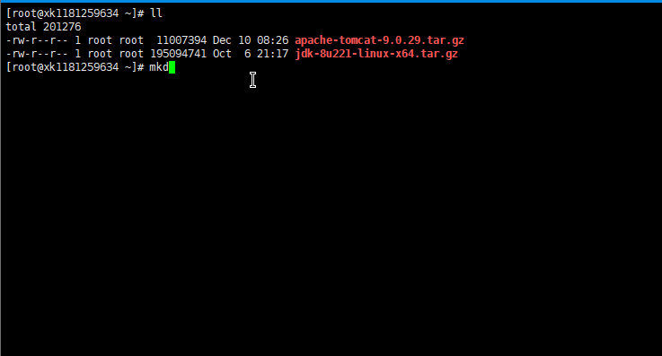
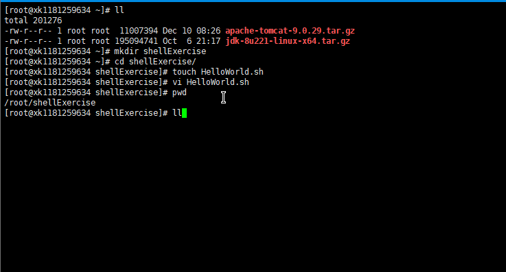
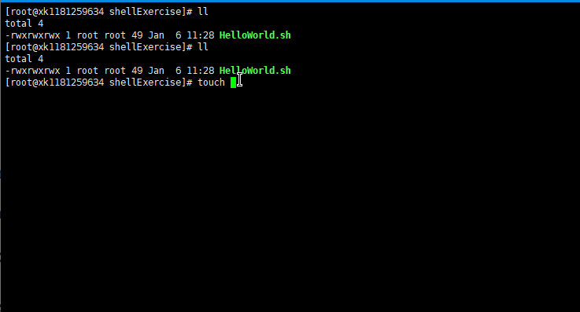
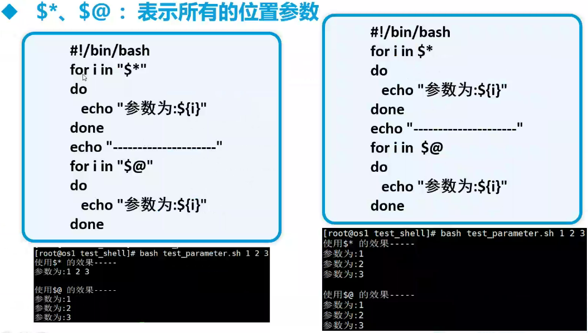
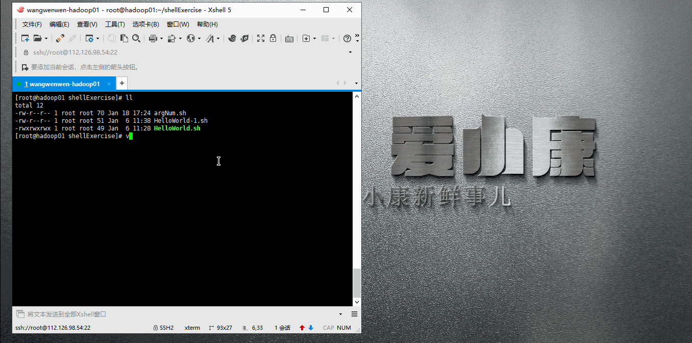
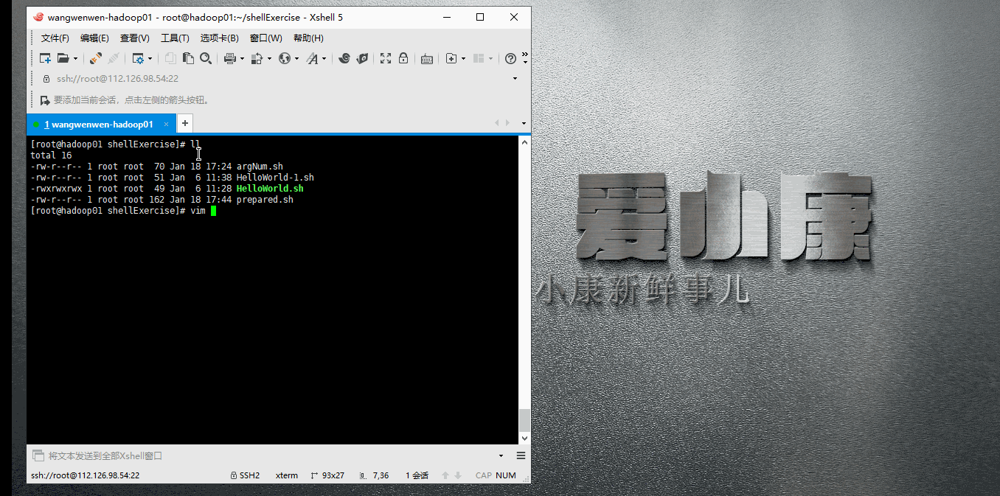
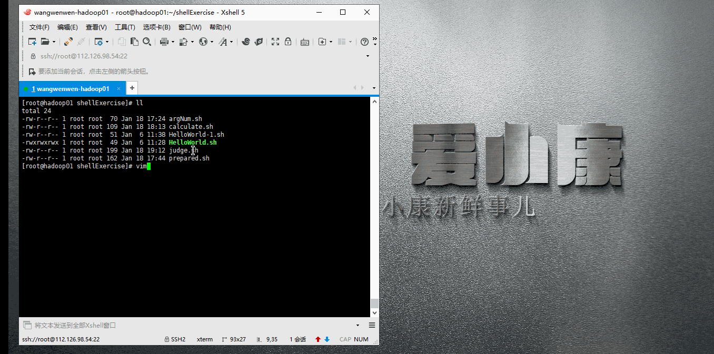

# Shell

> 1）开头加解释器：#!/bin/bash
> 2）语法缩进，使用四个空格；多加注释说明。
> 3）命名建议规则：变量名大写、局部变量小写，函数名小写，名字体现出实际作用。
> 4）默认变量是全局的，在函数中变量local指定为局部变量，避免污染其他作用域。
> 5）有两个命令能帮助我们调试脚本：set -e 遇到执行非0时退出脚本，set-x 打印执行过程。
> 6）写脚本一定先测试再到生产上。
> exit 0 代表正常运行程序并退出程序,
> exit 1 代表非正常运行导致退出程序

```shell
#!/bin/bash
#在默认情况下，遇到不存在的变量，会忽略并继续执行，而这往往不符合预期，加入该选项，可以避免恶果扩大，终止脚本的执行。
set -o nounset
#在默认情况下，遇到执行出错，会跳过并继续执行，而这往往不符合预期，加入该选项，可以避免恶果扩大，终止脚本的执行。
set -o errexit
```

## 1.概述

Shell是一个命令行解释器，它为用户提供了一个向Linux内核发送请求以便运行程序的界面系统级程序，用户可以用Shell来启动、挂起、停止甚至是编写一些程序。

Shell还是一个功能相当强大的编程语言，易编写、易调试、灵活性强。Shell是解释执行的脚本语言，在Shell中可以调用Linux系统命令。

应用场景：

> 重复性操作
> 批量事务处理
> 自动化运维
> 定时任务执行

## 2.Shell脚本的执行方式

- 脚本格式

  1. 脚本以**#!/bin/bash**开头，脚本必须有可执行权限
  2. 脚本内不用添加**#!/bin/bash**，运行时指定shell解释器（/usr/bin/bash、/usr/bin/sh）

- 第一个Shell脚本

  1. 需求：创建一个Shell脚本，输出**HelloWorld-小康新鲜事儿！**

  2. 实际操作：

     

- 脚本的常用执行方式

  - 第一种：输入脚本的绝对路径或相对路径

    1. 首先赋予HelloWorld.sh脚本的+x权限

       ```bash
       chmod 777 HelloWorld.sh
       chmod u+x,g+x,o+x HelloWorld.sh
       ```
  
    2. 执行脚本
  
       ```bash
       /root/shellExercise/HelloWorld.sh
       ./HelloWorld.sh
       ```
  
    
  
  - 第二种：bash或sh+脚本（不用赋予脚本+x权限）
  
    ```bash
    sh /root/shellExercise/HelloWorld-1.sh
    sh HelloWorld-1.sh
    ```
    

## 3.Shell中的变量

1. LinuxShell中的变量分为系统变量和用户自定义变量
2. 系统变量：$HOME、$PWD、$SHELL、$USER等等
3. 显示当前Shell中所有变量：set

### 1.定义变量

- 基本语法

  定义变量：变量=值( 变量名和等号之间不能有空格,变量后面不能有; )

  撤销变量：unset 变量

  声明静态变量：readonly 变量，注意：**这里不能unset**

- 变量定义规则

  变量名称可以由字母、数字和下划线组成，但是不能以数字开头

  等号两侧**不能有空格**

  变量名称区分大小写，一般**习惯大写**

- 实操

  ```bash
  #定义变量A
  A=8
  #使用变量A
  $A或者${A}
  #撤销变量A
  unset A
  #声明静态的变量B=2，不能unset
  readonly B=2
  #可把变量提升为全局环境变量，可供其它Shell程序使用
  export 变量名
  
  #variable.sh
  #!/bin/bash
  set -o nounset
  set -o errexit
  #定义变量
  NUM_1=1181259634
  NUM_2=24
  NUM_3=${NUM_1/125/小康}
  diyPath=${PATH}
  echo "The diyPath is>>>${diyPath}"
  NUM_4=NUM_1
  #定义只读变量
  readonly FAILED_COUNT=3
  #移除非只读变量
  unset diyPath
  
  echo "The number1 is>>>${NUM_1}"
  echo "The number2 is>>>${NUM_2}"
  echo "The number3 is>>>${NUM_3}"
  echo "The number4 is>>>${NUM_4}"
  echo "The number4 is>>>${!NUM_4}"
  echo "The failed_count is>>>${FAILED_COUNT}" 
  echo "The diyPath is>>>${diyPath}"
  ```


### 2.将命令的返回值赋给变量

```bash
#反引号，运行里面的命令，并把结果返回给变量A
A=`ls -lhA`
#下面这种写法等价于上面
A=$(ls -lhA)
```


### 3.设置环境变量

基本语法

export 变量名=变量值（将Shell变量输出为环境变量）

source 配置文件（让修改后的配置信息立即生效）

echo $变量名 （查询环境变量的值）

### 4.位置参数变量

基本语法

$n （n为数字，$0代表命令本身，$1-$9代表第一到第九个参数，十以上的参数，十以上的参数需要用大括号包含，如${10}）

$* （这个变量代表命令行中所有的参数，$*把所有的参数看成一个整体）

$@ （这个变量也代表命令行中所有的参数，不过$@把每个参数区分对待）

$# （这个变量代表命令行中所有参数的个数）


$*与$@的区别

- $*与$@都表示传递给函数或脚本的所有参数，不被双引号""包含时，都以$1 $2 ... $n的形式输出所有参数
- 当它们被双引号""包含时，“$*”会将所有的参数作为一个整体，以“$1 $2 ... $n”的形式输出所有参数；“$@”会将各个参数分开，以”$1" "$2" ... "$n“的形式输出所有参数



### 5.预定义变量

基本语法

$?（最后一次执行的命令的返回状态。如果这个变量的值为0，证明上一个命令正确执行；如果这个变量的值为非0（具体是哪个数，由命令自己来决定），则证明上一个命令执行不正确）

$$ （当前进程的进程号（PID））

$! （后台运行的最后一个进程的进程号（PID））



## 4.运算符

基本语法

1. ”$((运算式))“或”$[运算式]“或((变量=运算的表达式))
2. expr m+n
3. expr \*,/,%



**Tips**（expr注意事项）

-  运算符号和参数之间要有空格分开 
-  通配符号（*）,在作为乘法运算符时要用\ 
-  ’ ‘可以改变运算顺序，表示先计算’ '里面的内容，相当于算术运算中的括号 

## 5.条件判断

### 1.判断语句

- 基本语法

  ```bash
  [ condition ]（注意：condition前后要有空格）
  #非空返回true，可使用$?验证（0为true，>1为false）
  
  test condition
  [[ condition ]]
  ```

- 案例实操


### 2.常用判断条件

```bash
(1)两个整数之间的比较
    -lt 小于
    -le 小于等于
    -eq 等于
    -gt 大于
    -ge 大于等于
    -ne 不等于
（2）逻辑运算
	-a或&& 逻辑与
	-o或|| 逻辑或
	! 逻辑否
（3）字符串运算
	= 等于
	!= 不等于
	-z 判断是否为空，串的长度为0
（4）按照文件权限进行判断
    -r 有读的权限
    -w 有写的权限
    -x 有执行的权限
（5）按照文件类型进行判断
    -f 文件存在并且是一个常规的文件
    -e 文件存在
    -d 文件存在并且是一个目录
```



```bash
#23是否大于等于22
[ 23 -ge 22 ]
#judge.sh是否具有可执行权限
[ -x judge.sh ]
#/root/shiro.ini是否存在
[ -e /root/shiro.ini]
```

## 6.流程控制

### 1.if判断

- 基本语法

  ```bash
  #语法一
  if [ 条件判断式 ]; then
  	程序
  fi
  #语法二
  if [ 条件判断式 ]
  then
  		程序
  fi
  ```

- 案例实操

  ```bash
  #!/bin/bash
  if [ 24 -lt 24  ]
  then
          ./HelloWorld.sh
  elif [ $1 -ge 11  ]
  then
          echo "$1 is great than 11"
  else
          echo "The judge is failed."
  fi
  ```


### 2.case语句

- 基本语法

  ```bash
  case $变量名 in
  	"值1")
  		如果变量的值等于值1，则执行程序1
  		;;
  	"值2")
  		如果变量的值等于值1，则执行程序1
  		;;
  	...省略其他分支...
  	*)
  		如果变量的值都不是以上的值，则执行此程序
  		;;
  	esac
  ```

- 案例实操

  ```bash
  #!/bin/bash
  case $1 in
  1)
          echo 1
          ;;
  2)
          echo 2
          ;;
  *)
          echo This is other.
          ;;
  esac
  ```


### 3.for循环

- 基本语法

  ```bash
  #语法一
  for 变量 in 值1 值2 值3...
      do
          some processing
      done
  #语法二
  for (( 初始值;循环控制条件;变量变化 ))
      do
          some processing
      done
  ```

- 案例实操

  ```bash
  #!/bin/bash
  for i in "$*"
          do
                  echo "The number is $i"
          done
  ```

  ```bash
#!/bin/bash
for i in "$@"
        do
                echo "The number is $i"
        done
  ```

  ```bash
  #!/bin/bash
  s=0
  for (( i=0;i<=100;i++  ))
          do
                  s=$[$s+$i]
          done
  echo "$s"
  ```


### 4.while循环

- 基本语法

  ```bash
  while [ 条件判断式 ]
  	do
  		some processing
  	done
  ```

- 案例实操

  ```bash
  #!/bin/bash
  sum=0
  i=1
  while [ $i -le 100 ]
  do
          sum=$[$sum+$i]
          i=$[$i+1]
  done
  echo "$sum"
  ```


### `遍历目录及其子目录中的所有文件`

```shell
#! /bin/bash
#describe：	遍历目录及其子目录中的所有文件
#author:	xiaokang
set -o nounset
set -o errexit

function read_dir(){
for file in `ls $1` 
	do
		 if [ -d $1"/"$file ];then
			 read_dir $1"/"$file
		 else
			 echo $1"/"$file #在此处处理文件即可
		 fi
	done
} 
read_dir $1
```

## 7.read读取控制台输入

- 基本语法

  ```bash
  read (选项) (参数)
  选项：
  	-n 参数个数
  	-s 屏蔽回显
  	-p 指定读取值时的提示符
  	-t 指定读取值时等待的时间(秒)
  参数：
  	变量：指定读取值的变量名
  ```

- 案例实操

  ```bash
  #!/bin/bash
  read -t 5 -p "Please input your nickname>>>" NICKNAME
  echo $NICKNAME
  ```


## 8.函数

### 1.系统函数

1. basename

   - 功能描述

     `basename命令会删掉所有的前缀包括最后一个（‘/’）字符，然后将字符串显示出来`

   - 基本语法

     ```bash 
     basename [pathname] [suffix]
     basename [string] [suffix]
     选项:
     	suffix为后缀，如果suffix被指定了，basename会将pathname或string中的suffix去掉
     ```

   - 案例实操

     ```bash
     [root@hadoop01 shellExercise]# ll /opt/
     total 8
     drwx--x--x 4 root root 4096 Jan  5 13:03 containerd
     drwxr-x--- 3 root root 4096 Jan  7 08:05 tomcat9
     -rw-r--r-- 1 root root    0 Jan 21 18:58 xiaokang.txt
     [root@hadoop01 shellExercise]# basename /opt/xiaokang.txt 
     xiaokang.txt
     [root@hadoop01 shellExercise]# basename /opt/xiaokang.txt .tx
     xiaokang.txt
     [root@hadoop01 shellExercise]# basename /opt/xiaokang.txt .txt
     xiaokang
     ```

     

2. dirname

   - 功能描述

     `从给定的包含绝对路径的文件名中去除文件名（非目录部分），然后返回剩下的路径（目录的部分）`

   - 基本语法

     ```bash
     dirname 文件绝对路径
     ```

   - 案例实操

     ```bash
     [root@hadoop01 shellExercise]# ll
     total 56
     -rw-r--r-- 1 root root  70 Jan 18 17:24 argNum.sh
     -rw-r--r-- 1 root root 109 Jan 18 18:13 calculate.sh
     -rw-r--r-- 1 root root  86 Jan 20 15:44 case.sh
     -rw-r--r-- 1 root root  62 Jan 20 16:02 for1.sh
     -rw-r--r-- 1 root root  76 Jan 21 17:45 for2.sh
     -rw-r--r-- 1 root root  86 Jan 21 18:10 for-sum.sh
     -rw-r--r-- 1 root root  62 Jan 21 18:09 for-test.sh
     -rw-r--r-- 1 root root  51 Jan  6 11:38 HelloWorld-1.sh
     -rwxrwxrwx 1 root root  49 Jan  6 11:28 HelloWorld.sh
     -rw-r--r-- 1 root root 143 Jan 20 15:14 if.sh
     -rw-r--r-- 1 root root 337 Jan 18 19:13 judge.sh
     -rw-r--r-- 1 root root 162 Jan 18 17:44 prepared.sh
     -rw-r--r-- 1 root root  81 Jan 21 18:36 read.sh
     -rw-r--r-- 1 root root  90 Jan 21 18:18 while.sh
     [root@hadoop01 shellExercise]# dirname judge.sh 
     .
     [root@hadoop01 shellExercise]# dirname /opt/xiaokang.txt 
     /opt
     ```

     

### 2.自定义函数

- 基本语法

  ```bash
  [ function ] funname[()]
  {
  	Action;
  	[return int;]
  }
  funname
  ```

- 经验技巧

  - 必须在调用函数地方之前，先声明函数，Shell脚本是逐行运行，不会像其它语言一样先编译
  - 函数返回值，只能通过$?系统变量获得，可以显示的添加return返回，如果不加，将以最后一条命令运行结果，作为返回值。return后面跟数值n（0-255）

- 案例实操

  ```bash
  #!/bin/bash
  function sum(){
          SUM=0
          SUM=$[$1+$2]
  echo $SUM
  }
  read -p "Please input num1>>" n1
  read -p "Please input num2>>" n2
  sum $n1 $n2
  ```


## **文章中涉及的脚本源码**

蓝奏云： :shell: [shellExercise](https://www.lanzous.com/i8uexpa) 