# 家庭记账管理系统-PlantUML

## 实体类
### 1.用户实体类

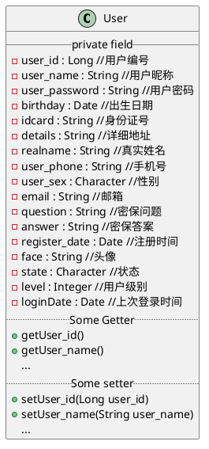

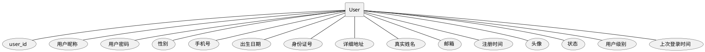

### 2.管理员实体类

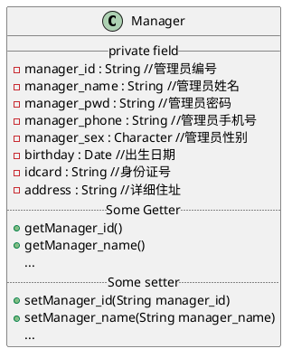

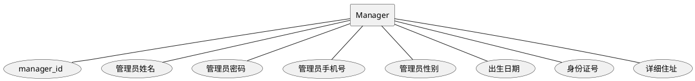

### 3.角色实体类

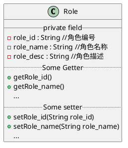

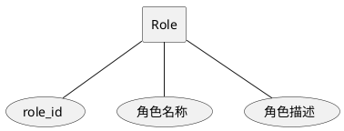

### 4.权限实体类

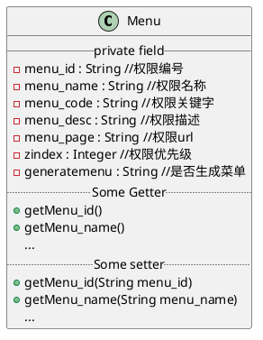

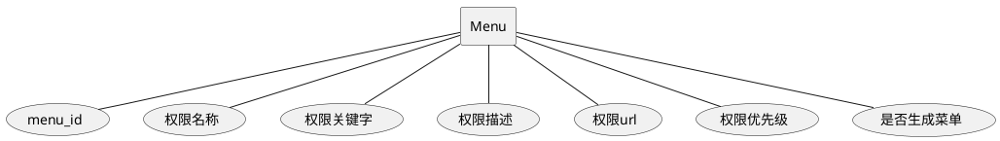

### 5.收入账单实体类

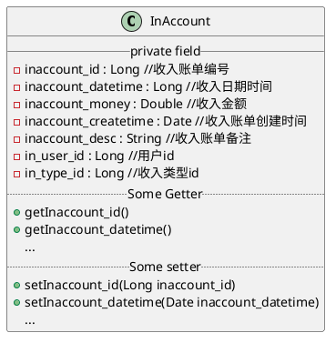

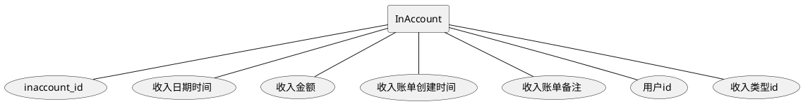

### 6.收入类型实体类

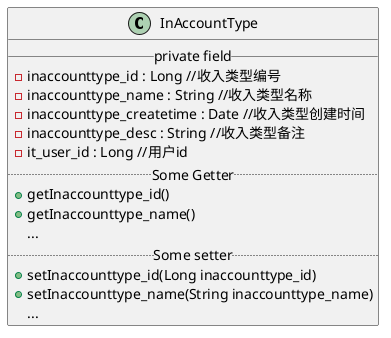

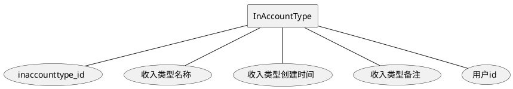

### 7.支出账单实体类

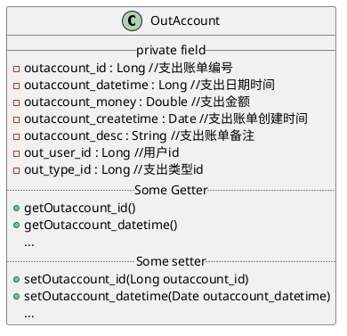

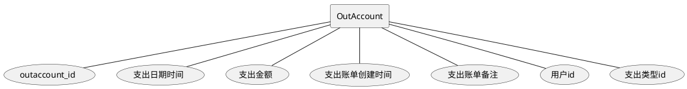

### 8.支出类型实体类

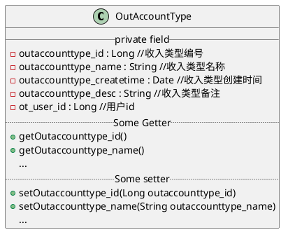

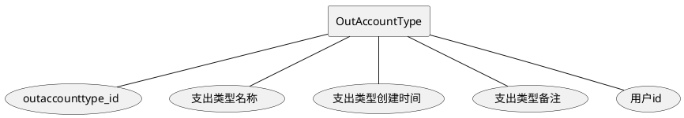

### 9.交流大区实体类

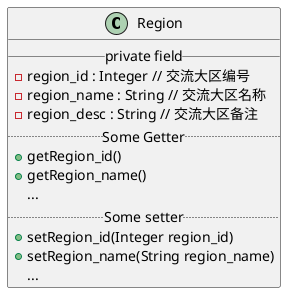

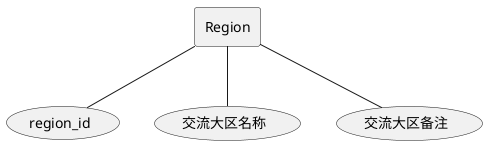

### 10.主题帖实体类

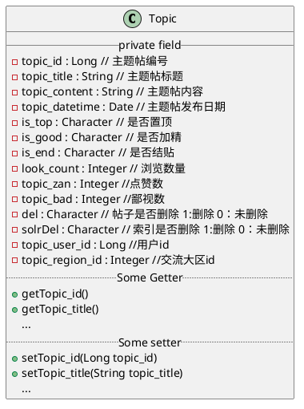

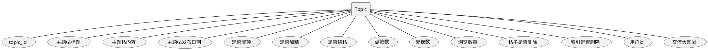

### 11.回复贴实体类

```plantuml
@startuml

class Reply {
__ private field __
 -reply_id : Long // 回复贴编号
 -reply_content : String // 回复内容
 -reply_datetime : Date // 回复日期
 -zan : Integer // 点赞数
 -bad : Integer // 鄙视数
 -status : Integer // 是否被查看
 -reply_user_id : Long //用户id
 -reply_topic_id : Long //帖子id
.. Some Getter ..
  + getReply_id()
  + getReply_content()
  ...
.. Some setter ..
  + setReply_id(Long reply_id)
  + setReply_content(String reply_content)
  ...
}

@enduml
```

```plantuml
@startuml
rectangle Reply
Reply -- (reply_id)
Reply -- (回复内容)
Reply -- (回复日期)
Reply -- (点赞数)
Reply -- (鄙视数)
Reply -- (是否被查看)
Reply -- (用户id)
Reply -- (帖子id)
@enduml
```

### 12. 投资理财实体类

```plantuml
@startuml

class Invest {
__ private field __
 -invest_id : String // 投资理财编号
 -invest_name : String // 投资理财名称
 -invest_datetime : Date // 时间
 -invest_year : Integer // 投资周期
 -invest_target : String // 投资目标
 -invest_createtime : Date // 创建时间
 -interest_rates : Double // 利率
 -invest_money : Double // 投资金额
 -invest_desc : String // 投资理财备注
 -invest_user_id : Long //用户id
.. Some Getter ..
  + getInvest_id()
  + getInvestname()
  ...
.. Some setter ..
  + setInvest_id(String invest_id)
  + setInvestname(String investname)
  ...
}

@enduml
```

```plantuml
@startuml
rectangle Invest
Invest -- (invest_id)
Invest -- (投资理财名称)
Invest -- (投资时间)
Invest -- (投资周期)
Invest -- (投资目标)
Invest -- (创建时间)
Invest -- (利率)
Invest -- (投资金额)
Invest -- (投资理财备注)
Invest -- (用户id)
@enduml
```

### 13.借款还贷实体类

```plantuml
@startuml

class Loan {
__ private field __
 -loan_id : String // 借款还贷编号
 -loan_name : String // 借款还贷名称
 -loan_datetime : Date // 借款还贷日期
 -loan_year : Integer // 周期（按年）
 -interest_rates : Double // 利息率
 -loan_money : Double // 借款金额
 -loan_source : String // 借款来源
 -loan_desc : String // 借款还贷备注
 -loan_createtime : Date // 创建时间
 -loan_user_id : Long //用户id
.. Some Getter ..
  + getLoan_id()
  + getLoanname()
  ...
.. Some setter ..
  + setLoan_id(String loan_id)
  + setLoanname(String loanname)
  ...
}

@enduml
```

```plantuml
@startuml
rectangle Loan
Loan -- (loan_id)
Loan -- (借款还贷名称)
Loan -- (借款还贷日期)
Loan -- (周期（按年）)
Loan -- (利息率)
Loan -- (借款金额)
Loan -- (借款来源)
Loan -- (借款还贷备注)
Loan -- (创建时间)
Loan -- (用户id)
@enduml
```

## 数据备份机制

```shell
cription:  MySQL backup shell script  
# author:       xiaokang
# familyaccount.xiaokang.cool 为专门的备份服务器，需要做一下服务器之间免密码登录

MYSQLDUMP=`which mysqldump`
#备份的数据库名
DATABASE="familyaccount"
USER="root"
PASSWORD="123456"

MAIL="xiaokang.188@qq.com" 
BACKUP_DIR=/home/backup
LOGFILE=/home/backup/data_backup.log 
DATE=`date +%Y%m%d_%H%M`

cd $BACKUP_DIR
#开始备份之前，将备份信息头写入日记文件   
echo "--------------------" >> $LOGFILE   
echo "BACKUP DATE:" $(date +"%y-%m-%d %H:%M:%S") >> $LOGFILE   
echo "-------------------" >> $LOGFILE

$MYSQLDUMP -u$USER -p$PASSWORD --events  -R --opt  $DATABASE | gzip >${BACKUP_DIR}\/${DATABASE}_${DATE}.sql.gz
if [ $? == 0 ];then
    echo "$DATE--$DATABASE is backup succeed" >> $LOGFILE
else
    echo "Database Backup Failed!" >> $LOGFILE   
fi
#判断数据库备份是否全部成功，全部成功就同步到小康个人服务器
if [ $? == 0 ];then
  /usr/bin/rsync -zrtopg   --delete  /home/backup/* xiaokang@familyaccount.xiaokang.cool:/home/xiaokang/familyaccount_sql_backup/  >/dev/null 2>&1
else
  echo "Database Backup Fail!" >> $LOGFILE   
  #备份失败后向管理者发送邮件提醒
  mail -s "database Daily Backup Failed!" $MAIL   
fi

#删除30天以上的备份文件  
find $BACKUP_DIR  -type f -mtime +30 -name "*.gz" -exec rm -f {} \;

【crontab定时任务】
#每天凌晨过一分钟,对familyaccount数据库进行全量备份并同步到小康个人服务器
1 0 * * * sh /root/familyaccount_backup.sh
```

## 前端页面

### 1. 登录界面

<div align="center">  </div>
### 2. 家庭户主主界面

<div align="center">  </div>
### 3. 家庭成员主界面

<div align="center">  </div>
### 4. 收入账单列表

<div align="center">  </div>
### 5. 收入账单类型列表

<div align="center">  </div>
### 6. 添加收入账单

<div align="center">  </div>
### 7. 添加收入账单类型

<div align="center">  </div>
### 8. 收入账单报表

<div align="center">  </div>
### 9. 交流大区

<div align="center">  </div>
### 10. 投资理财列表（家庭户主）

<div align="center">  </div>
### 11. 借款还贷列表（家庭户主）

<div align="center">  </div>
### 12. 主题帖列表

<div align="center">  </div>
### 13. 帖子详情

<div align="center">  </div>
### 14. Solr搜索高亮显示

<div align="center">  </div>
### 15. 我的帖子

<div align="center">  </div>
## 后台页面


## 登录时序图

```plantuml
@startuml
actor User

User -> 登录页面: 1.访问登录页面
activate 登录页面

登录页面 -> 登录页面: 2.创建登录会话
deactivate 登录页面

User -> 登录页面: 3.提交身份信息
activate 登录页面

登录页面 -> 登录页面: 4.系统进行验证
deactivate 登录页面

登录页面 -> 系统主界面: 5.验证通过进入系统主界面
deactivate 系统主界面

登录页面 -> User: 验证失败返回错误信息
deactivate 登录页面
@enduml
```

## 参考案例

### 1.思维导图

```plantuml
@startmindmap
caption figure 1
title Linux发行版之Debian系列

* <&flag>Debian
** <&globe>Ubuntu
*** Linux Mint
*** Kubuntu
*** Lubuntu
*** KDE Neon
** <&graph>LMDE
** <&pulse>SolydXK
** <&people>SteamOS
** <&star>Raspbian with a very long name
*** <s>Raspmbc</s> => OSMC
*** <s>Raspyfi</s> => Volumio

header
作者:小康
endheader

center footer 微信公众号：小康新鲜事儿

legend right
  Short
  legend
endlegend
@endmindmap
```

### 2.流程图

- 开始/结束

```plantuml
@startuml
start
:Hello world;
:This is on defined onseveral **lines**;
stop
@enduml
```

- 一个完整的例子

```plantuml
@startuml

start
:ClickServlet.handleRequest();
:new page;
if (Page.onSecurityCheck) then (true)
  :Page.onInit();
  if (isForward?) then (no)
	:Process controls;
	if (continue processing?) then (no)
	  stop
	endif
	
	if (isPost?) then (yes)
	  :Page.onPost();
	else (no)
	  :Page.onGet();
	endif
	:Page.onRender();
  endif
else (false)
endif

if (do redirect?) then (yes)
  :redirect process;
else
  if (do forward?) then (yes)
	:Forward request;
  else (no)
	:Render page template;
  endif
endif

stop

@enduml
```

```plantuml
@startuml
skinparam rectangle {
	roundCorner<<集群规划-xiaokang>> 25
}

rectangle "老大:hadoop01,小弟:hadoop02、hadoop03" <<集群规划-xiaokang>> {
node hadoop01 #red [
NameNode
DataNode
----
ResourceManager
NodeManager
] 
node hadoop02 #CCCCFF [
DataNode
----
NodeManager
]
node hadoop03 #CCCCFF [
DataNode
----
NodeManager
]
hadoop01 -- hadoop02
hadoop01 -- hadoop03
}
@enduml
```

