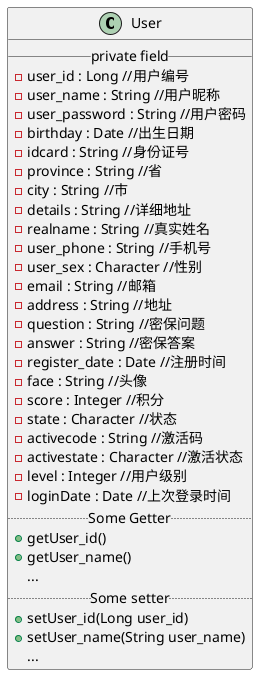
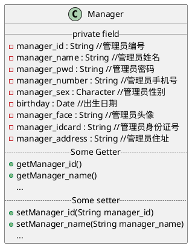
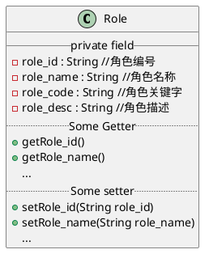
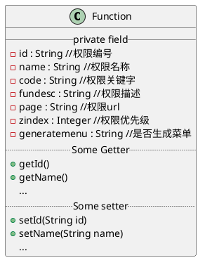
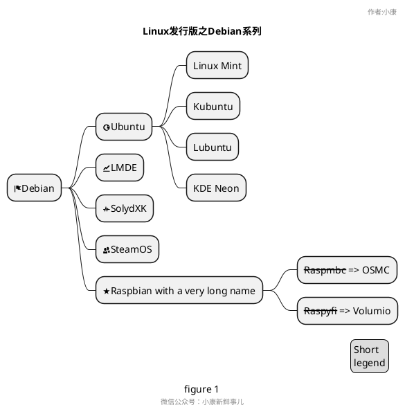
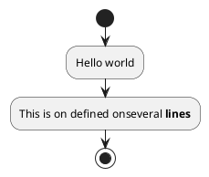
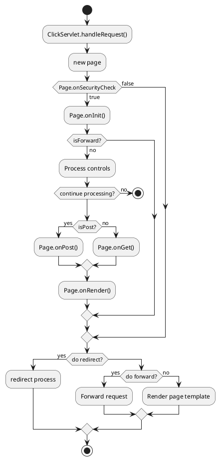

# 家庭记账管理系统-PlantUML

## 实体类
### 1.用户实体类

```plantuml
@startuml

class User {
__ private field __
 -user_id : Long //用户编号
 -user_name : String //用户昵称
 -user_password : String //用户密码
 -birthday : Date //出生日期
 -idcard : String //身份证号
 -province : String //省
 -city : String //市
 -details : String //详细地址
 -realname : String //真实姓名
 -user_phone : String //手机号
 -user_sex : Character //性别
 -email : String //邮箱
 -address : String //地址
 -question : String //密保问题
 -answer : String //密保答案
 -register_date : Date //注册时间
 -face : String //头像
 -score : Integer //积分
 -state : Character //状态
 -activecode : String //激活码
 -activestate : Character //激活状态
 -level : Integer //用户级别
 -loginDate : Date //上次登录时间
.. Some Getter ..
  + getUser_id()
  + getUser_name()
  ...
.. Some setter ..
  + setUser_id(Long user_id)
  + setUser_name(String user_name)
  ...
}

@enduml
```

### 2.管理员实体类

```plantuml
@startuml

class Manager {
__ private field __
 -manager_id : String //管理员编号
 -manager_name : String //管理员姓名
 -manager_pwd : String //管理员密码
 -manager_number : String //管理员手机号
 -manager_sex : Character //管理员性别
 -birthday : Date //出生日期
 -manager_face : String //管理员头像
 -manager_idcard : String //管理员身份证号
 -manager_address : String //管理员住址
.. Some Getter ..
  + getManager_id()
  + getManager_name()
  ...
.. Some setter ..
  + setManager_id(String manager_id)
  + setManager_name(String manager_name)
  ...
}

@enduml
```

### 3.角色实体类

```plantuml
@startuml

class Role {
__ private field __
 -role_id : String //角色编号
 -role_name : String //角色名称
 -role_code : String //角色关键字
 -role_desc : String //角色描述
.. Some Getter ..
  + getRole_id()
  + getRole_name()
  ...
.. Some setter ..
  + setRole_id(String role_id)
  + setRole_name(String role_name)
  ...
}

@enduml
```

### 4.权限实体类

```plantuml
@startuml

class Function {
__ private field __
 -id : String //权限编号
 -name : String //权限名称
 -code : String //权限关键字
 -fundesc : String //权限描述
 -page : String //权限url
 -zindex : Integer //权限优先级
 -generatemenu : String //是否生成菜单
.. Some Getter ..
  + getId()
  + getName()
  ...
.. Some setter ..
  + setId(String id)
  + setName(String name)
  ...
}

@enduml
```

## 参考案例

### 1.思维导图

```plantuml
@startmindmap
caption figure 1
title Linux发行版之Debian系列

* <&flag>Debian
** <&globe>Ubuntu
*** Linux Mint
*** Kubuntu
*** Lubuntu
*** KDE Neon
** <&graph>LMDE
** <&pulse>SolydXK
** <&people>SteamOS
** <&star>Raspbian with a very long name
*** <s>Raspmbc</s> => OSMC
*** <s>Raspyfi</s> => Volumio

header
作者:小康
endheader

center footer 微信公众号：小康新鲜事儿

legend right
  Short
  legend
endlegend
@endmindmap
```

### 2.流程图

- 开始/结束

```plantuml
@startuml
start
:Hello world;
:This is on defined onseveral **lines**;
stop
@enduml
```

- 一个完整的例子

```plantuml
@startuml

start
:ClickServlet.handleRequest();
:new page;
if (Page.onSecurityCheck) then (true)
  :Page.onInit();
  if (isForward?) then (no)
	:Process controls;
	if (continue processing?) then (no)
	  stop
	endif
	
	if (isPost?) then (yes)
	  :Page.onPost();
	else (no)
	  :Page.onGet();
	endif
	:Page.onRender();
  endif
else (false)
endif

if (do redirect?) then (yes)
  :redirect process;
else
  if (do forward?) then (yes)
	:Forward request;
  else (no)
	:Render page template;
  endif
endif

stop

@enduml
```