# 家庭记账管理系统-PlantUML

## 实体类
### 1.用户实体类

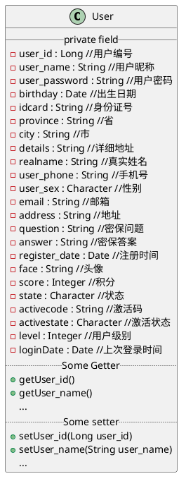

### 2.管理员实体类

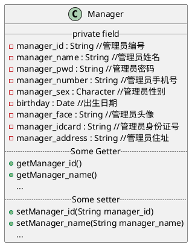

### 3.角色实体类

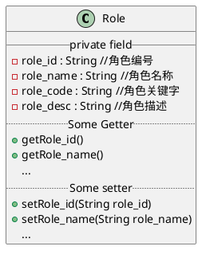

### 4.权限实体类

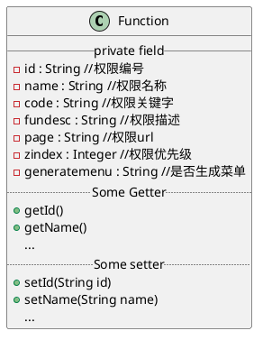

### 5.收入账单实体类

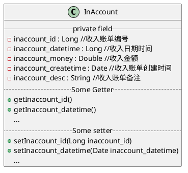

### 6.收入类型实体类

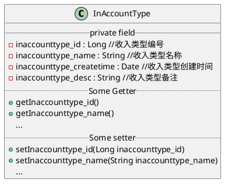

### 7.支出账单实体类

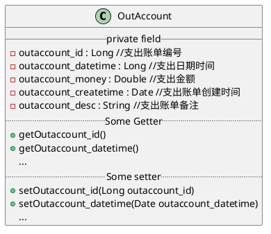

### 8.支出类型实体类

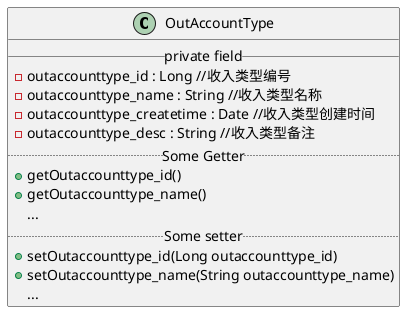

### 9.交流大区实体类

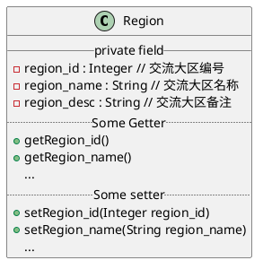

### 10.主题帖实体类

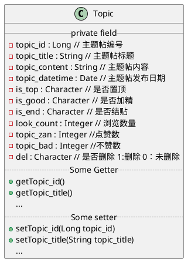

### 11.回复贴实体类

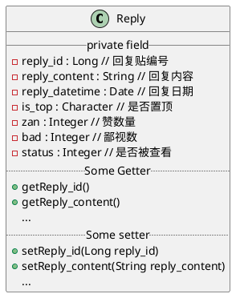

### 12. 投资理财实体类

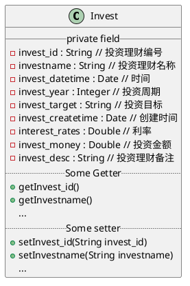

### 13.借款还贷实体类

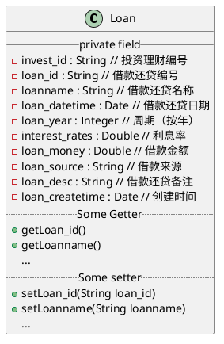

## 参考案例

### 1.思维导图

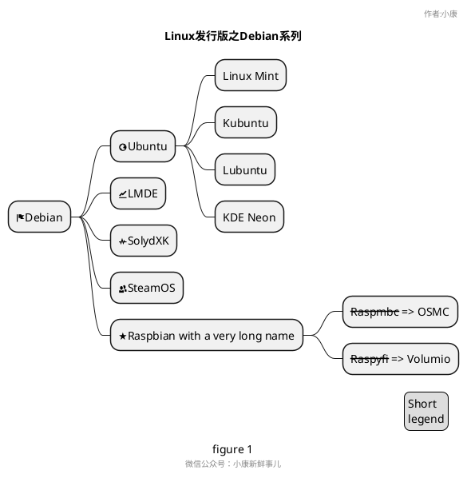

### 2.流程图

- 开始/结束

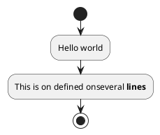

- 一个完整的例子

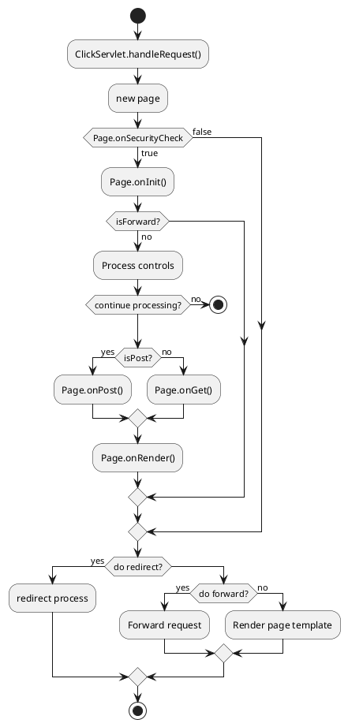